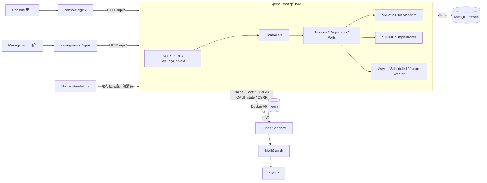
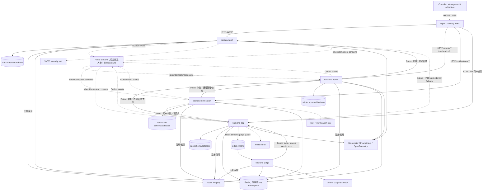
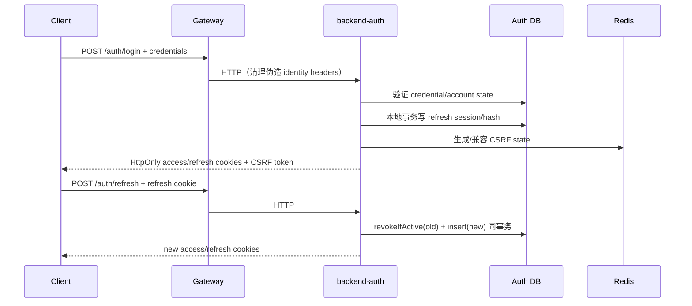

# UltiCode 项目统一文档

更新时间：2026-08-22

本文是项目临时工程文档的唯一汇总入口。原分散在 `services/docs/`、`apps/management/docs/` 和 `wiki/` 的内容已按主题合并；源代码、配置、迁移脚本和 `AGENTS.md` 仍然是行为与规则的权威来源。

## 导航

1. 当前 Services 架构与 Owner/Worker 边界
2. Owner 数据库隔离、迁移与回滚
3. 微服务迁移指导、契约和基础设施参考
4. 安全：访问令牌吊销边界
5. CONTEST-009 开发发布审批记录
6. Management 前端 i18n 设计
7. Services 评审记录与历史证据

## 文档边界

- 本文件只承载工程说明、迁移计划、评审记录和临时运行证据。
- `AGENTS.md`、嵌套 `AGENTS.md`、`CLAUDE.md`、`.codex/` 和代码注释不属于本次临时文档合并对象。
- 当前实现优先于历史迁移方案；历史章节保留是为了审计和回溯，不代表目标架构已经完成。
- 生产环境、生产切流、生产数据和外部审批必须以当时的独立授权为准。
- 第 3 节内保留原迁移指南的章节编号；源码或迁移注释中的 `§2.x`、`§4.x`、`§7.x` 等引用均指第 3 节中的原文小节，而不是本文件的顶层编号。

## 原文件映射

| 原位置 | 合并章节 |
| --- | --- |
| `services/docs/SERVICES_ARCHITECTURE_STATUS_2026-08-18.md` | 当前 Services 架构 |
| `services/docs/OWNER_DATABASE_ISOLATION_PLAN.md` | Owner 数据库隔离 |
| `services/docs/MICROSERVICE_MIGRATION_GUIDE.md` | 微服务迁移指导 |
| `wiki/SECURITY_TOKEN_REVOCATION.md` | 安全：访问令牌吊销边界 |
| `services/docs/CONTEST-009-RELEASE-APPROVAL.md` | CONTEST-009 审批记录 |
| `apps/management/docs/i18n-design.md` | Management i18n 设计 |
| `services/docs/SERVICES_REVIEW_FINDINGS_2026-08-22.md` | Services 评审记录 |

## 1. Current services architecture status

> 原文来源：`services/docs/SERVICES_ARCHITECTURE_STATUS_2026-08-18.md`

### Services 架构现状与优化状态

更新时间：2026-08-22

本文以源码、Maven POM、运行配置、Compose 和实际启动脚本为准；历史迁移指南只作为背景。本文的架构盘点部分是只读 inventory，不代表生产部署或生产数据变更已经执行。

#### 1. 总体结论

UltiCode 已经完成从单体 JVM 到多进程 Owner/Worker 拓扑的骨架迁移：Maven reactor、Contract Seam、独立服务启动入口、生产 Compose 的七个后端 runtime，以及 Outbox/Inbox/Redis Streams 等异步可靠性基础均已存在。

当前仍是 Strangler migration 收敛阶段，不能称为最终微服务形态。当前需要维护的是：

- 开发环境使用显式 Owner schema/account 配置；生产物理切换和外部 authority 不属于本项目；
- Submission read 通过 bounded batch facts seam 组合，事件化 read projection 仍是未来可选能力；
- App 保留 local/remote Submission 与显式 legacy rollback seam，但正常 dev-lite/dev-full 使用 Judge Streams；
- Admin 查询已收敛为粗粒度 query slices，不再作为拆分更多进程的理由；
- DevStack manifest、源码/POM/config/Compose/PM2 和文档由 executable contract checks 持续对账。

#### 2. 模块与运行拓扑

##### 2.1 Owner/Worker 清单

| 类型 | 模块 | 数据职责 | 对外/运行方式 |
| --- | --- | --- | --- |
| Data Owner | `backend-auth` | 账号、认证、会话、授权事实 | HTTP/Dubbo |
| Data Owner | `backend-admin` | 管理、治理、审计和运营查询/命令 | HTTP/Dubbo |
| Data Owner | `backend-app` | OJ 与一般用户业务（Problem、Contest、Forum 等） | HTTP/Dubbo |
| Data Owner | `backend-submission` | Submission、Judge/Result/Created outbox、generation/attempt fence | HTTP/Dubbo |
| Data Owner | `backend-notification` | 通知 Inbox、投递 ledger 和重试状态 | HTTP/Dubbo |
| Worker | `backend-judge` | 不拥有业务表；消费 Judge stream，执行 sandbox，写 verdict seam | Background Worker |
| Worker | `backend-search` | 不拥有业务表；消费 SearchDocumentChanged，写 MeiliSearch | Background Worker |

`judge-runtime` 是 Judge 执行逻辑的共享依赖，不是第八个进程。

共享模块是 `platform/*`、`api/*`、`integration-inbox`、`judge-config` 和 `judge-runtime`。`judge-config` 只承载 Submission/Judge 共用的 flag binding/命名模式校验，不是运行时进程；`services/pom.xml` reactor 已登记 platform、五个 API/Contract 方向、五个 Owner、两个 Worker 和 `judge-runtime`；不存在实际模块的 `backend-api` dependency-management 条目已移除。

`judge-runtime` 内的 `com.ulticode.modules.submission.sandbox` 与
`com.ulticode.modules.queue.port` 通过 `package-info.java` 明确声明为共享
Judge 执行库归属，而不是 App 私有业务包。`RunSubmissionDTO`、`RunResultDTO`
和 `CodeExecutionPort` 暂保留在现有 `app-api` 试运行兼容合同中；本次不搬迁
公共类型，也不因此新增进程或持久化依赖。

生产 Compose (`docker-compose.prod.yml`) 定义 `backend-auth`、`backend-admin`、`backend-app`、`backend-submission`、`backend-search`、`backend-notification`、`backend-judge` 七个后端 runtime。`ecosystem.config.cjs` 也提供七个后端 PM2 entry；本地 `scripts/dev/up.sh --mode dev-lite` 是唯一第一类开发 interface，默认启动六个后端并明确排除 Search，`--mode dev-full` 由 `devstack-manifest.sh` 显式加入 Search，以配合 indexed read；`APP_RUNTIME_MODE`、`APP_SUBMISSION_ROUTING_MODE` 和 Search read mode 均由该 manifest 统一导出，直接本地 App/Judge boot 默认与 dev-lite 一致；`--only search` 仍可单独启动 Search。`up.sh --rebuild` 在启动后端前执行 services 反应堆 `-DskipTests install`,用于刷新 `~/.m2`(PM2 以单模块 spring-boot:run 启动各服务并从本地仓库解析兄弟模块,源码接口变更后不重新 install 会命中旧 jar);启动前还会做服务端口占用预检(监听者不属于对应 PM2 app 时 fail fast),并在加载 `.env` 后丢弃遗留的通用 `SERVER_PORT`,端口一律以 `ecosystem.config.cjs` 为准。完整 DEV-LOCAL 启动在 Owner migration 后通过 `init-db/scripts/app-owner-seed.sh` 分域、幂等导入 App problemset/forum/contest/solution 与 global-ranking seed；该 Adapter 按领域组分别处理空/完整/部分状态，不进入生产 Compose/Owner Flyway 主链。Contest 事务同时导入竞赛和全球排名 canonical fixtures，只使用 App Owner 表与 fixture ID，不通过运行时跨 Owner 查询用户。

##### 2.2 Contract Seam

Auth、Admin、App、Submission、Notification 的服务边界由各自 `api/*` 合同承载，包含接口、DTO、错误码和事件。`api/*` 不应包含 Entity、Mapper、Repository 或实现模块类型；既有 API contract/architecture tests 持续守住该边界。

##### 2.3 Submission 写入回访状态

原写入链是：

```text
App request -> Submission write -> App ProblemFacts / Auth UserExistence -> Submission tables
```

当前 `backend-submission-api` 增加了不可变 `SubmissionFactsSnapshot`。App 本地和远程 request boundary 组装快照，Submission Owner 只校验快照与 command 的 user/problem 是否匹配，不再在写入事务中注入或调用 `ProblemFactsPort`、`UserExistencePort` 的 Dubbo adapter。缺失、错配或非法快照 fail closed。

这只关闭 Submission 写入链。Submission 读侧现在通过 bounded batch facts seam 完成标题/用户 enrichment；没有引入事件化 read database，也不把一次请求拆成逐条跨 Owner 调用。

#### 3. 已建立的优势

##### 3.1 Contract Module 作为主要边界

Contract module 已成为发布和依赖边界：调用方依赖 provider-owned API，而不是跨 Owner 共享实现。Submission API 的 `SubmissionWritePort`、Notification contract、事件 envelope 及契约 shape tests 证明了这一方向。新 DTO 保持实现无关，避免 Entity/Mapper/Repository 泄漏。

##### 3.2 Submission 是边界最清晰的 Owner

Submission 已将复杂逻辑收进 Owner 内部：输入验证、事务、本地 submission/judge/result/created 多个 Outbox、generation/attempt fence、过期 verdict 丢弃、contest event 和 thin external adapters。其外部 Provider 只负责 Contract delegation，存储和并发语义留在 Owner 内，封装深度合适。

##### 3.3 异步可靠性

当前可靠性机制覆盖不同故障窗口：

| 模块 | 机制 |
| --- | --- |
| Submission | 多个 Outbox、事务内落盘、generation/attempt fence、lease/retry、过期结果丢弃 |
| Judge | Redis Streams consumer、PEL reclaim、bounded retry、DLQ、ACK-after-write |
| Notification | Inbox、delivery ledger、lease fencing、重试与幂等投递 |
| Search | Redis Streams、PEL 处理、版本控制、幂等 upsert/delete、DLQ、tombstone/replay 语义 |

这些机制使跨进程副作用可重放、可观测，并降低 DB/Redis/SMTP/MeiliSearch 双写造成的丢失风险。

#### 4. 未完成的收敛问题

##### 4.1 同步回访与单跳原则

长期约束应是“一次请求最多一次业务 Provider hop”。Submission 写入使用不可变 Facts Snapshot；Submission read 使用一次 bounded batch seam 取得本页所需的 User/Problem facts。事件化本地 projection 暂不作为开发环境的必需基础设施。

##### 4.2 数据库物理隔离

- 开发环境的 Auth/Admin/App/Notification/Submission runtime 已使用显式 Owner database/account 配置；
- 当前边界仍是一个 MySQL instance 内的 schema/account isolation，不宣称独立物理集群；
- users account/profile ownership 由 Auth account 与 App profile read/write seams 表达；
- production physical cutover、external authority 和 grant retirement 不在当前开发目标内。

后续必须按 expand → backfill → verify → cutover → observe → contract 推进：先建 profile/授权等新表和专用账号，再回填和校验，最后在有权限与回滚证据的窗口撤销旧访问。不要编辑已应用 migration，也不要在没有生产 authority 的情况下执行 revoke 或删除旧列。

##### 4.3 App 双轨兼容

App 当前保留 Submission local/remote compatibility、Search fallback 和显式 legacy rollback seams；Judge normal dev-lite/dev-full 使用 Streams，RQueue 只有 legacy-rollback mode 才能装配。不要在没有 external authority、quiesce、观察窗和 rollback artifact 的情况下删除这些 seams。

###### 4.3.1 Submission 双轨 seam 的退出条件

以下是三条 Submission routing seam 和 App 残留副本的共同 kill criteria。它们是
切流前的可审计退出条件，不代表本地开发环境已经完成生产 cutover；生产观察窗和
外部 authority 仍需单独批准。

| Seam | Quiesce 观察窗 | Error budget / 必须为零的错误 | 退出前必须保留的 rollback artifacts |
| --- | --- | --- | --- |
| `SubmissionWriteRoutingPort` | 远程 writer 已完成一次授权切流后，连续 14 天覆盖至少一个高峰周期；无未完成的 App local submission/outbox writer、reaper 或 scheduler | 0 丢失/重复 intake、0 错误 Owner 写入、0 因路由产生的不可恢复 5xx；可用性错误预算不超过现有基线的 0.1% | `SubmissionWriteRoutingPort`、`DefaultSubmissionWritePort`、`RemoteSubmissionWritePort`、`SubmissionRoutingProperties`、`scripts/dev/devstack-manifest.sh` 的 route 快照和 routing tests |
| `SubmissionFenceRoutingPort` | Judge、Submission 与所有 lease/reaper writer 已 drain；连续 14 天无未完成 generation/attempt lease | 0 stale generation 写入、0 split-brain lease、0 丢失 verdict；任何 fence 不一致都取消退役 | `SubmissionFenceRoutingPort`、`DefaultSubmissionFencePort`、`RemoteSubmissionFencePort`、generation/attempt contract tests、legacy rollback mode 配置 |
| `SubmissionUserQueryRoutingPort` | 远程读路径连续 14 天完成分页/详情/最佳提交观察；无活跃 local read caller 依赖未迁移的表 | 0 跨用户泄漏、0 顺序/总数/VO 语义回归、0 因 owner 不可用而静默返回错误数据；读取错误预算不超过现有基线的 0.1% | `SubmissionUserQueryRoutingPort`、`LocalSubmissionUserQueryAdapter`、`RemoteSubmissionUserQueryAdapter`、read contract tests、`APP_SUBMISSION_ROUTING_MODE` 回滚值 |

App 侧 `submission` mapper、result dispatcher、lease reaper、shadow comparator 等残留
副本只有在对应三条 seam 的观察窗、零错误预算、数据/事件对账和 in-flight drain 均有
证据后才能删除。每次退役前必须保存：当前 manifest/Compose/PM2 配置快照、local/
remote adapter 版本、outbox/stream 水位与 checksum、恢复命令和一键切回
`APP_SUBMISSION_ROUTING_MODE=local` 的配置 artifact。任何一个 artifact 缺失，都只
能继续保留兼容路径，不能以“代码已不常用”代替退出证据。

Search 的 `database` / `indexed` 读模式是 `devstack-manifest.sh` 的显式策略决策，
不属于上述 Submission seam 的漂移信号，也不因本节的退出条件自动改写。

##### 4.4 Admin Seam 已收敛为粗粒度查询切片

Admin 已按可测量的查询垂直切片收敛为粗粒度 Query Seam：Contest 参与、Revenue、Overview 与 Dashboard（含用户图表）分别经 `AdminAnalyticsPort`/`AdminDashboardReadPort` 的 bounded 并行 Owner 组合暴露，Dashboard 用户图表经 `AccountQueryService` 分页扫描并在 `CancellableQueryExecutor` 的 800ms deadline 与 bounded reads 约束下收敛，`BackendAdminApplication` 的 exclusion 随之缩减。剩余细粒度遗留按需再聚合，不再作为阻塞项。

##### 4.5 文档和运维入口漂移

历史迁移章节可以保留为历史，但当前状态、启动和领域词汇必须与源码对账。当前权威顺序是：

1. Java source and tests；
2. Maven POM/reactor；
3. application/config files；
4. Compose；
5. actual startup scripts/PM2 entries；
6. documentation。

文档只能追随前五项，不能反向定义实际拓扑；scripts/dev/architecture-contract-test.sh 负责阻止已知漂移回归。

#### 5. 后续优先级

优先级高于继续拆分模块：

1. 继续用 bounded read contracts 收敛跨 Owner 读取，必要时再评估事件化 projection；
2. 保持 Owner schema/account isolation 的 development evidence，不伪造 production acceptance；
3. 只在真实稳定性和回滚门禁满足后删除 legacy compatibility；
4. 维护 DevStack、Owner matrix、POM、PM2、Compose、CONTEXT 和 migration guide 的 executable consistency。

#### 6. 评审边界

架构盘点本身是只读 inventory：不以文档推断代码，不修改已应用数据库 migration，不声称生产部署或生产数据验证。后续 `ARCH-*` 任务单独记录实现、测试、回滚和外部 authority gate。

## 2. Owner database isolation plan

> 原文来源：`services/docs/OWNER_DATABASE_ISOLATION_PLAN.md`

### Owner 数据库隔离实施说明

更新时间：2026-08-19

当前项目只有一个 TEST-TARGET；用户已授权在该目标完成 Owner 账号、migration、backfill、cutover、观察和 rollback。本说明记录已执行状态，不声称存在 production environment。

#### 当前矩阵

| Owner | 连接变量 | 当前默认 | 目标账号/数据库 | 状态 |
| --- | --- | --- | --- | --- |
| Auth | `AUTH_DB_HOST/PORT/NAME/USER/PASSWORD` | `DB_*` 仅兼容 fallback | `auth_rw` / `auth` | TEST-TARGET active |
| Admin | `ADMIN_DB_HOST/PORT/NAME/USER/PASSWORD` | `DB_*` 仅兼容 fallback | `admin_rw` / `admin` | TEST-TARGET active |
| App | `APP_DB_HOST/PORT/NAME/USER/PASSWORD` | `DB_*` 仅兼容 fallback | `app_rw` / `app` | TEST-TARGET active |
| Submission | `SUBMISSION_DB_HOST/PORT/NAME/USER/PASSWORD` | 独立 `submission` 配置 | `submission_rw` / `submission` | TEST-TARGET active |
| Notification | `NOTIFICATION_DB_HOST/PORT/NAME/USER/PASSWORD` | `DB_*` 仅兼容 fallback | `notification_rw` / `notification` | TEST-TARGET active |

当前 `.env` 为唯一部署密管输入；Owner runtime 与 direct-grant migration principal 已分离。独立 instance 不是本项目目标，schema/account/permission isolation 是当前物理边界。

运行时迁移边界：`backend-auth` 的 `spring.flyway.enabled` 继续由
`AUTH_FLYWAY_ENABLED` 控制且默认关闭，runtime 账号不执行 canonical migration。
Owner schema migration 由独立 direct-grant migration principal 串行执行；
TEST-TARGET 的 Auth/Admin/App/Notification/Submission Flyway validate 均通过。

#### `users` 职责拆分

目标职责已经区分：Auth 持有 account/credential、authorization/status（id、
username、email、password、refresh/reset、role、permission、active、ban），App
持有 `user_profiles(account_id, ...)` 的 profile 字段。canonical shared history 已执行
`V20260729150000__Create_User_Profiles_Table.sql` 的回填，并由后续
`V20260806120000__Drop_Profile_Columns_From_Users.sql` 完成 shared `users` profile
列的 contract；这两份 applied migration 不得编辑。

Auth owner bootstrap 的兼容 profile 列由后续 Auth-owner contract migration
`V20260820180000__Narrow_Auth_Users_To_Account_Ownership.sql` 收窄；该 migration
不得回写或编辑早期 expand migration。运行时职责已经切开：Auth account/status
写入只进入 `auth.users`，App profile 写入只进入 `app.user_profiles`。App 用户投影
通过 Auth RPC 与 App profile mapper 组合，不再由 App datasource join `users`；
moderation ban 命令携带 actor、trace、idempotency 和 expected authz version 调用
Auth owner。

对尚未完成的 owner schema/runtime 切换，仍按以下顺序执行：

1. **Expand**：为 Auth account/status 与 App profile 建立明确 owner tables、索引和 version/updated-at 字段；在对应 owner history 中保留旧列和旧读路径。
2. **Backfill**：以 `users.id` 为稳定 account id，幂等回填；记录行数、主键 checksum、空值/孤儿引用和重复冲突。
3. **Verify**：Auth、Admin、App、Search、Notification reader/writer 矩阵已转换为 Owner RPC + local profile read，并由 focused tests/静态扫描复核。
4. **Cut over**：TEST-TARGET backfill 在 PM2 writers=0 时执行 idempotent no-op → manifest-scoped rollback → re-backfill；12/12 account/profile rows 和完整 checksums 匹配。
5. **Observe**：登录/account、profile 写读、ban/permission、搜索用户文档、通知收件人和管理查询由后续 ARCH Gate 继续验证。
6. **Contract**：对既有 owner schema 先以 quiesce confirmation 执行
   `owner-user-profile-backfill.sh contract-preflight`，确认 manifest、完整
   account/profile checksum（含 soft-deleted accounts）和 App profile writer，
   再执行 Auth-owner contract migration；禁止编辑 applied migration。

#### 权限与回滚

- migration job 使用独立 direct-grant 高权限账号；runtime 使用 owner 专用账号；
- runtime 账号不得拥有 global/schema-wide `ALL`、`GRANT OPTION`、隐式角色继承或未登记的其他 Owner 表 DML；唯一登记例外是 `auth_rw`/`app_rw` 对 `admin.audit_outbox` 的 append-only `INSERT`；
- 每次切换前后保存 rows/checksum/privilege snapshot；
- 失败时先回滚 route/consumer 到上一 artifact，再按 manifest/copy/reconcile runbook 回写；不得 `DROP`、`TRUNCATE` 或重置共享 source；
- 本地 TEST-TARGET/DEV-LOCAL 证据只能证明 rehearsal 与脚本契约；不得替代外部目标 authority、users/profile responsibility sign-off、physical cutover 或 production acceptance。
- ARCH-002 当前 blocked，直到真实目标账号/权限、责任切换、回填/回滚与最终外部 Review/Validation 证据齐全。
- ARCH-003 的 remote stability、deployment authority、all-writer quiesce、observation/rollback 和 compatibility retirement 仍是外部 blocker。

#### init-db 收敛 — baseline / seed / owner 深模块与 CI 门禁（2026-08-23）

> 非破坏性收敛，不移动已应用迁移（`AGENTS.md §Database changes`），物理归档需 ADR。

#### 旧库 → Owner schema 全量数据迁移（legacy-to-owner backfill）

- **Runbook**：`scripts/runbooks/owner-full-backfill.sh`，动作 `preflight|backfill|verify|rollback|converge|archive-retired`。以共享 `ulticode` 为 source、owner schema 为 target，幂等 `INSERT..SELECT` 回填 + 主键 checksum 门禁；`converge` 将与 legacy 种子漂移的预置 owner 表（时间戳/id 漂移）收敛为与 source 完全一致；`rollback` 仅删除已回填的 target 行，绝不写共享 source。证据（manifest、行数快照、退役表 dump）存于 `.local/migration-audit/`。
- **App submissions 形状收敛**：`app/V20260824000000__Converge_App_Submissions_With_Owner_Contract.sql` 将 App 本地读写 seam 的 `submissions` 列形状对齐 canonical Submission owner 契约（移除 bootstrap 的 verdict/execution_time_ms/memory_used_kb，补齐 runtime/entity 所需列）；幂等 INFORMATION_SCHEMA 探针式 DDL。
- **角色模板映射**：`auth.role_permissions` 使用粗粒度 resource 枚举；runbook 内置 legacy 细粒度 resource → 粗粒度枚举的语义映射并按 (role, action, resource) 去重（该表仅被 admin 投影消费）。
- **退役表处置**：零引用遗留表（DailyRecommendation、system_announcements(+reads)、submission_statuses、forum_community_links/rules/tags/permissions、forum_post_tag_relations）按 ADR 占位约定 dump 归档、不迁入 owner schema；物理归档仍需 ADR。
- **用户名冲突**：legacy 与 bootstrap admin 同名时，回填行以 `_legacy` 后缀重命名入库（email 冲突置 NULL），保证全量与引用完整性。

- **Baseline external seam**：`init-db/migrations/` 仍是唯一 Flyway 源（`AGENTS.md §Database changes`）；`init-db/baseline/baseline.sql` 为生成的 `--no-data` 优化（供 `baseline-optimized fresh-install` / `AI` 导航，标准仍为 `migrate.sh migrate` + `owner-migrate` 串行，`baseline` 路径需经 `baseline-adopt.sh` 建历史。详见 `init-db/baseline/README.md:24-35`）。
- **Seed 隔离**：legacy seed 保留在 `flyway.conf: filesystem:migrations/*.sql`（增量仍扫描但已 APPLIED）；新 seed 只进 `migrations/seed/` 经 `flyway-seed.conf: filesystem:migrations/*.sql,filesystem:migrations/seed`，`baseline-optimized fresh-install` 经 `baseline.sql` 零 seed（标准仍经 incremental）。详见 `init-db/migrations/seed/README.md` 与 `init-db/baseline/README.md:24-35`。
- **Owner 深模块**：`flyway-{auth,admin,app,notification,submission}.conf` 退为 adapters，`owner-migrate` 是支持的编排入口（`init-db/scripts/owner-migrate.sh migrate|validate|info <owner|all>`，`scripts/dev/up.sh` 经它串行 owners）；`baseline` 采用走 `baseline-adopt.sh`（标准）与受约束的 `DEV_LOCAL` 路径（见 `init-db/README.md:130` 与 `init-db/baseline/README.md`）；`direct migrate.sh` + `MIGRATION_SCHEMA` 是受约束低层原语。
- **CI 门禁**：`.github/workflows/ci.yml` `backend` 触发拓至 `init-db/**`；`migrate-validate` 以 `-locations="filesystem:/flyway/sql/*.sql"` 非递归限 `migrations/*.sql`（`seed/` 仅经 `flyway-seed.conf`）；新增 `baseline-parity` job 执行 `validate-baseline.sh` + `baseline-adopt.sh` 双 `PASS` 票据，防派生漂移。

#### CI/CD 结构化 — 编排器 + 可复用子 workflow + 单一汇总门禁（2026-08-23）

> 参考 codebase-memory-mcp 的 pipeline 图结构（编排器 + `_` 前缀 reusable workflows + `ci-ok` 汇总上下文）。

- **CI（`.github/workflows/ci.yml`）**：只做三件事——`dorny/paths-filter` 变更探测、按路径门禁调用可复用 workflow、`ci-ok` 汇总。分支保护只需依赖 `ci-ok` 一个稳定 context；矩阵/job 改名不再影响 required checks。被 path 过滤跳过的 stage 在 `ci-ok` 中视为通过；`changes` job 本身失败则硬失败。
- **可复用子 workflow**：`_security.yml`（gitleaks，全量触发）、`_backend.yml`（build/test/features matrix/migrate-validate/baseline-parity/flyway-filename-lint）、`_frontend.yml`（lint/type-check/test/i18n/shared auth-core；per-app 门禁经显式 boolean inputs 传入）、`_docker.yml`（镜像构建验证）。新增门禁 = 新增一个 `_*.yml` + 编排器一个调用 job + 加入 `ci-ok.needs`。
- **服务矩阵单一来源**：`.github/services-matrix.json` 同时驱动 `_docker.yml` 验证与 `docker-publish.yml` 发布；新增服务 = 新增一条 JSON 记录，两个 workflow 经 `load-matrix` job 读取。
- **CD 复合动作**：`.github/actions/host-deploy/`（SSH 密钥、Flyway 迁移、judge 沙箱预置、compose 拉起）与 `.github/actions/host-health/`（统一健康检查，spec 行格式 `<container> <mode: curl-container|curl-host|inspect> <port> <path>`）由 `cd-deploy.yml` 与 `cd-rollback.yml` 共享；回滚 = 同一动作 + `skip_migrations: true`。
- **顺带修复**：`_docker`/publish 使用规范 Dockerfile 路径 `apps/{console,management}/Dockerfile`（原 ci.yml 内为失效的 `./console/Dockerfile`）；i18n job 工作目录修正为 `apps/management`；auth-core 缓存路径修正为 `packages/auth-core/pnpm-lock.yaml`。
- **迁移注意**：原单体内各 check 名现以 `Backend / ...`、`Frontend / ...` 等 stage 前缀出现；分支保护应切换为仅要求 `ci-ok`。

#### CI 门禁修复 — secret-scan 误报清零 / lint vendored 排除 / 依赖审计达标（2026-08-23）

- **gitleaks**：`.gitleaks.toml` 全局 allowlist 扩至 graphify 生成缓存（`services/graphify-out/cache/` 已 `git rm --cached` 并入 `.gitignore`，生成物不再入库）、vendored `draco_decoder.js`、以及两个测试 fixture 字面量；allowlist `regexes` 匹配捕获的 Secret 而非整行。
- **eslint**：console 忽略 `public/**`（vendored 静态资产不适用应用 lint 规则）；两个 app 统一 `_` 前缀 = 有意未用 的 no-unused-vars 约定（`argsIgnorePattern/varsIgnorePattern: '^_'`）。
- **依赖审计**：`pnpm-workspace.yaml` overrides 增加 `linkify-it ^5.0.2`、`nanoid ^3.3.18`、`postcss ^8.5.18`；必须用 caret 限定消费方主版本线——裸 `>=` 会跨大版本（linkify-it 6 破坏 markdown-it CJS interop）。workspace overrides 是唯一生效位置，app 级 `package.json#pnpm` 在 workspace 成员中被忽略。
## 3. Microservice migration guide and historical architecture

> 原文来源：`services/docs/MICROSERVICE_MIGRATION_GUIDE.md`

> 状态：历史迁移与目标架构参考。当前运行事实以本文件第 1、2 节以及源码、POM、配置和启动脚本为准；本节不代表生产切流已完成。

### UltiCode 后端微服务化迁移指导

> 本文保留迁移调查与决策依据；代码、`init-db/migrations/`、运行配置、Compose 和实际启动脚本是现状真源。当前已落地五个 data Owner 与两个 Worker，但数据库权限、读模型和兼容路径仍在收敛。文内行号用于调查快照定位，后续维护应以文件路径和符号名为准。
> 历史快照说明：第 1 节和第 2.1–2.3 节保留迁移启动时的单体架构快照；
> 其中的 `backend-spring` 相对源码路径不代表当前 owner 服务入口。第 10 节、
> Appendix A 及其他明确标注的 source link 按当前 repository-root owner
> 目录维护。

#### 1. Executive Summary

##### 1.1 为什么拆

当前 `backend-spring` 是一个 Spring Boot 单体。按包划分的模块已经有 Service、Projection、consumer-owned Port 等边界，但所有模块仍共享一个 JVM、一个 MySQL 数据源和一套 Redis；管理端模块还会直接调用 Problem/Contest/User/Submission 等模块的 Mapper 或 Service。该结构适合当前单体开发，却不能直接等价替换成远程调用：若机械“目录搬家 + Dubbo”，会得到共享数据库、双向 RPC、同步 fan-out 和跨网络事务并存的分布式单体。

拆分的现实收益应限定为：

- 隔离认证私钥、凭证与刷新会话的安全爆炸半径；
- 让管理/运营能力与用户流量、判题负载独立部署；
- 明确表和写操作的唯一 Owner，停止跨模块 Mapper 写入；
- 让判题、通知、WebSocket、搜索等失败不再扩大为整个后端失败；
- 为独立扩缩容和发布建立边界，而不是追求“微服务组件齐全”。

##### 1.2 推荐目标

最终保留四个数据 Owner 服务，另设一个不拥有业务表的判题执行运行时：

- **`backend-auth`**：账号、凭证、OAuth identity、JWT、refresh session、账号状态和 RBAC；不拥有用户画像、题目、竞赛或运营数据。
- **`backend-admin`**：管理端 BFF、审核治理、审计、系统配置、监控和备份；“能管理某数据”不等于“拥有该数据”。题目、竞赛、投稿等管理命令仍由其业务 Owner 执行。
- **`backend-app`**：普通用户业务与题目/竞赛/题解/论坛/互动/WebSocket，包括用户画像；提交写入经 Submission Contract，搜索由 Search Worker 消费事件，通知状态和投递由 Notification Owner 持有。过渡期仍保留部分本地兼容实现。
- **`backend-notification`**：通知、偏好、投递台账、邮件和通知相关管理查询/命令；消费 App 的通知意图事件，通过 App 的用户读契约取得收件人信息，并经 Redis Pub/Sub 请求 App 的本地 WebSocket 中继。
- **`backend-judge`**：独立判题 Worker；消费 Redis Streams，沙箱执行后通过 Submission Contract 回写 verdict。它不拥有 Submission/Problem/TestCase 表，数据写入由相应 Owner 负责。

核心内部同步 RPC 使用 **Apache Dubbo 3**；注册发现使用 **Nacos**。外部 HTTP/WS 先由 **Nginx 逻辑 Gateway** 路由，暂不引入 Spring Cloud Gateway/Higress。数据先保持同一 MySQL 实例，按 Owner 收敛写入口和账号权限，再逐步分 schema/database；不一次性物理拆库。

##### 1.3 总体迁移策略

采用 Strangler Fig：新服务先与 Legacy 并存，Gateway 以路由/开关逐组切流；数据库迁移遵循 expand → backfill → verify → cut over → contract；旧实现和旧列只在稳定观察期后删除。每一阶段必须同时满足：可编译、可启动、核心接口可用、旧路径可回滚、业务仍可并行开发。

明确不做：

- 不按 Controller 个数拆服务；
- 不把所有本地调用改成 Dubbo；
- 不共享 Entity、Mapper、业务 Service 或 Repository；
- 不让每个请求同步调用 Auth 验证 JWT；
- 不默认引入 Seata、Sentinel、Kafka/RocketMQ 或 Spring Cloud 全家桶；
- 不为当前不存在的 LMS 领域预建课程/班级/作业服务。

##### 1.4 最高优先级结论

当前最关键的边界问题不是“缺少 Dubbo”，而是：

1. `users` 同时混合账号凭证、角色/封禁状态和公开 profile，且 Auth/User/Admin/Moderation 多方写同一行；
2. `admin` 是横切聚合模块，直接读写众多业务表；
3. 当前进程内事件、ThreadLocal 审计上下文、Redis/SMTP/WebSocket 双写在跨进程后不会自动获得可靠性；
4. canonical schema 已存在需先收敛的漂移：代码使用 `backups` 但 migration 未创建；`problem_notes` 基线与后续 `IF NOT EXISTS` 定义不一致；
5. Auth 抽离前必须处理已发现的 OAuth state cookie 未绑定、OAuth email 自动绑定、WebSocket fail-open/校验分叉等安全阻塞项。

#### 2. Current Architecture

##### 2.1 真实业务域，而非目录推测

现有后端的真实领域是在线判题平台：

| 领域 | 当前模块/能力 |
|---|---|
| 身份与安全 | `auth`、`user`、`permission`、`refreshtoken`、`security/**` |
| OJ 核心 | `problem`、`submission`、`queue`、`contest` |
| 内容与社区 | `solution`、`forum`、`problemlist`、`bookmark`、`vote`、`edgeoperations`、`follow` |
| 用户成长 | `achievement`、`subscription`、用户统计/排行榜 |
| 治理与运营 | `admin`、`moderation`、`backup`、`monitoring`、`i18n` |
| 通知与外围能力 | `notification`、`email`、`websocket`、`search` |

对 `backend-spring/src/main/java/com/ulticode/modules/**` 和 `init-db/migrations/**` 的源码级搜索没有发现 Course、Classroom、Enrollment、Homework、Teacher、Student、LearningResource 对应的 Entity、Mapper、Service 或表。当前角色只有 `USER`、`MODERATOR`、`ADMIN`、`SUPER_ADMIN`（`V20260602_120000__Create_All_Tables.sql:843-847,1096-1113`）。因此“教师端/学生端”只能视为未来产品角色，不得据此虚构当前领域边界。

`users` 混合边界的字段证据如下：身份/凭证为 `id`、`username`、`email`、`password`、`password_reset_token_hash`、`password_reset_expires_at`；授权/状态为 `role`、`is_active`、`is_banned`、`banned_until`、`banned_reason`；公开 profile 为 `name`、`avatar`、`bio`、`company`、`github`、`location`、`twitter`、`website`、`preferred_language`；生命周期/审计为 `joined_at`、`last_login_at`、`created_by`、`updated_by`、`is_deleted`、`deleted_at`、`deleted_by`。这正是 Auth account 与 App profile 需要渐进垂直拆分的原因。

##### 2.2 当前运行拓扑

> **当前实现状态（以 source/POM/config/Compose/startup script 为准）**：Strangler migration 已完成多进程 Owner/Worker 骨架，但仍处于收敛阶段。五个 data Owner 是 `backend-auth`、`backend-admin`、`backend-app`、`backend-submission`、`backend-notification`；两个不持有业务表的 Worker 是 `backend-judge`、`backend-search`。`judge-runtime` 仅是共享依赖，不是独立进程。Contract modules 是服务边界；Judge normal dev-lite/dev-full 使用 provider-owned JudgeQueue Streams，legacy RQueue 只在显式 `legacy-rollback` mode 保留。Submission read 使用 bounded batch owner facts contract，Contest 不再逐条调用 `toVO(id)`。本地开发唯一入口是 `scripts/dev/up.sh`；dev-lite 不启动 Search，dev-full 显式启动 Search/indexed read。根级兼容别名已收敛：`scripts/start.sh`、`scripts/stop.sh`、`scripts/start.bat`、`scripts/stop.bat` 已删除（`scripts/dev/architecture-contract-test.sh` 断言其不存在）；唯一保留的根级 adapter 是 `scripts/pitstop-start-backend.ps1`，因 `pitstop.yaml` 仍消费它（委托 `bash scripts/dev/up.sh --no-frontend`）。一次性数据迁移 runbook 位于 `scripts/runbooks/`（cutover/backfill/rehearsal），独立冒烟位于 `scripts/test/`；共享 shell 原语（env 加载、显式值保全、容器探测、健康等待、写确认谓词）统一由 `scripts/dev/lib/common.sh` 提供，其内部按关注点拆分为 `lib/env.sh`/`lib/validate.sh`/`lib/docker.sh`/`lib/confirm.sh`/`lib/sql.sh` 子模块（外部入口不变）；`mysql_query` 连接 adapter 由 `lib/sql.sh` 的 `define_mysql_query_adapter` 单源生成，各 runbook 不再手写 docker-exec/mysql 调用；`scripts/test/` 冒烟共用 `scripts/test/lib/smoke-common.sh` 前奏（凭据收敛为 `SMOKE_USERNAME`/`SMOKE_PASSWORD`，旧变量名仍兼容）。本地开发拓扑唯一来源为 `scripts/dev/up.sh`+`scripts/dev/devstack-manifest.sh`（受 `devstack-manifest-test:37-52` 覆盖）；生产/PM2 拓扑另由 `docker-compose.*.yml`/`ecosystem.config.cjs` 定义。当前项目没有 production environment，因此本地证据不等于生产切流证据。



证据：

- 旧单体拓扑仅保留为迁移历史；当前实现以 `services/pom.xml`、各 Owner/Worker `application.yml`、`docker-compose.prod.yml` 和 `ecosystem.config.cjs` 为准；
- Spring Boot/MyBatis-Plus/Redis/WebSocket/Actuator 依赖：`pom.xml:40-185`；
- 两个前端 Nginx 都把 `/api/` 转发到 `backend:9001`：`console/nginx.conf:44-54`、`management/nginx.conf:44-54`；
- Compose 启动 MySQL、Redis、Nacos、MeiliSearch 和七个后端 runtime；Dubbo/Nacos 依赖与 provider/consumer 已进入各服务模块；
- 根 POM 不再保留不存在的 `backend-api` reactor dependency-management 条目。

##### 2.3 真实请求/调用链样本

| 场景 | 当前链路 | 拆分含义 |
|---|---|---|
| 登录 | `AuthController` → `AuthenticationWorkflow` → `AuthAccountPort` → `AuthSessionPort` → JWT/refresh/CSRF | Auth 目前仍以 `users` 作为账号表 |
| 注册 | `AuthController` → `AuthenticationWorkflow.register` → `AuthAccountPort` + `refresh_tokens` | 账号和刷新会话应在 Auth 本地事务内，profile 后续事件化 |
| 管理员创建题目 | `AdminProblemController` → `ProblemService.createProblem` → Problem/Detail/Version mappers | Admin Controller 可保留，写事务必须由 App 的 Problem Owner 执行 |
| 普通提交 | App request boundary → immutable `SubmissionFactsSnapshot` → Submission `SubmissionWritePort` → local submission tables + judge outbox | Submission Owner 不再在写事务内同步回访 Problem/Auth；read enrichment 仍是后续 projection 任务 |
| 比赛提交 | Contest Controller → Contest Service → SubmissionWritePort → Submission/Outbox → ContestSubmissionPort | 当前存在 Contest↔Submission 回访；目标需资格同步、记录事件化 |
| 审核动作 | Moderation Controller → Moderation Service → moderation tables + App 内容表 + `users` ban fields | 当前仍是兼容混合写路径；目标拆为 Admin/App/Auth Owner 事件化协作 |
| 搜索 | Search Projection → MeiliSearch 或四个 SearchSource → Problem/Forum/Solution/User mappers | 目标应由 App 拥有搜索索引，不做四路远程串行查询 |
| WebSocket | access cookie → Handshake → STOMP interceptor → Redis blacklist → JWT → User DB → session principal | 目标在 App 本地验 JWT，以事件/cache 处理状态失效，避免每消息 Auth RPC |

代表源码：`services/auth/src/main/java/com/ulticode/auth/service/DefaultAuthenticationWorkflow.java`、`services/app/app-web/src/main/java/com/ulticode/modules/submission/port/DefaultSubmissionWritePort.java:110-214`、`services/app/app-web/src/main/java/com/ulticode/modules/moderation/service/impl/ModerationServiceImpl.java:141-185,412-498`、`services/app/app-web/src/main/java/com/ulticode/modules/search/projection/DefaultSearchReadProjection.java:278-314`、`services/app/app-web/src/main/java/com/ulticode/modules/websocket/auth/DefaultWebSocketAuthenticator.java:46-86`。

##### 2.4 当前耦合与循环性质

已确认的 package/module 双向依赖包括：

- `admin ↔ contest`、`admin ↔ problem`、`admin ↔ user`、`admin ↔ websocket`。例如 `AdminContestMutationServiceImpl.createContest/updateContest` 直接调用 `ContestMapper` 和 `ContestProblemMapper`，`deleteContest/startContest/endContest` 直接更新 `ContestMapper`，公告管理方法直接调用 `ContestAnnouncementMapper`；
- `contest ↔ submission`、`queue ↔ submission`；
- `achievement ↔ submission`、`user ↔ follow`、`contest ↔ websocket`。

这些是包级/运行时回访链，不等同于已证实的 Spring 构造器循环。对高风险依赖对的源码检查未发现明确 Bean A↔B 构造循环，但没有启动容器，不能把该结论扩大为全量运行时证明。迁移风险在于：若把两边 Bean 调用都远程化，会立即变成双向 RPC 或 A→B→A 链。

高风险跨模块写包括：

- Admin 直接写 Contest/Problem/Forum/Solution/Notification/User 等 Mapper；
- Moderation 直接写内容表和 `users.is_banned`；
- Submission 事务同时触达 Contest association 与 Redis judge queue；
- Audit Aspect 在请求线程同步写 `audit_logs`，并依赖 SecurityContext 与 `AuditContext` ThreadLocal；
- Search、Dashboard 和多种 Projection 通过跨表 join/mapper fan-out 组装读模型。

##### 2.5 特殊能力现状

| 能力 | 现状 | 拆分约束 |
|---|---|---|
| WebSocket | STOMP + SockJS + JVM 内 SimpleBroker；端点 `/ws/contest`、`/ws/notifications`、`/ws` | App 初期单实例或粘性会话；多实例前需外部广播/relay |
| 判题队列 | Normal dev-lite/dev-full 使用 Redis Streams `JudgeQueue`、generation fence、lease/reaper、`judge_outbox`；legacy Redisson `RQueue` 仅作显式 rollback seam | 保留 wire/ACK/NACK/回滚兼容；不引入新 MQ |
| 文件 | 用户上传走 App 的 `FileStoragePort`（`com.ulticode.app.storage`）：默认 `app.storage.type=local` 保持旧行为（`uploads/avatars/`、URL `/uploads/avatars/...`）；`app.storage.type=s3` 切换到 S3 兼容对象存储（路径风格 endpoint + 手写 SigV4，无新增依赖，配置见 application.yml `app.storage.*` / `APP_STORAGE_*`），使 App 副本可水平扩展。未设置自定义头像时 Console 使用确定性的本地 SVG fallback；备份仍写本地目录 | 对象存储为多副本部署的推荐模式；备份由 Admin/Ops 管理；Admin 侧头像适配器仍是本地写，待复用同一 Port |
| Async | 成就、关注、备份使用 `@Async`，未见显式业务线程池 | 跨服务改 durable event；服务内配置有界线程池 |
| Scheduled | Contest、judge worker/outbox/reaper、backup、notification ledger、WS flush 等共用调度池 | 每个任务归 Owner；多副本使用 CAS/lease/Redisson lock 防重复 |
| 邮件 | SMTP 管道，默认关闭；写 email log 后同步发 SMTP | 改 intent/outbox + worker；Auth 的密码重置邮件不依赖 App RPC |
| 搜索 | MeiliSearch 可选，失败回退 DB | 保留在 App；由 Owner event 更新索引 |
| AI | 当前未发现 AI/LLM/向量能力 | 不为不存在的能力引入服务或组件 |
| 监控 | Actuator/Micrometer/Prometheus registry，自定义 DB/Redis/Queue inspector | 每服务保留指标；首次 RPC 切流前接分布式 tracing |

##### 2.6 配置、Filter、异常与数据库访问横切面

- 四个 owner 分别由各自的安全配置组装无状态安全链，并在各自入口注册 JWT/CSRF filter；Auth、Admin、App 的现有配置为 `AuthSecurityConfig`、`AdminSecurityConfig`、`AppSecurityConfig`，Notification 复用同等入口安全约束。
- 异常映射由 owner-scoped `*WebExceptionHandler` 维护；共享 `Result<T>` / `RpcResult` 仍定义在 `services/platform/common/src/main/java/com/ulticode/common/response/Result.java` 与 `services/platform/common/src/main/java/com/ulticode/common/rpc/RpcResult.java`，当前示例为 `services/auth/src/main/java/com/ulticode/auth/error/AuthWebExceptionHandler.java`、`services/admin/src/main/java/com/ulticode/admin/error/AdminWebExceptionHandler.java`、`services/app/app-web/src/main/java/com/ulticode/app/error/ProblemWebExceptionHandler.java`。
- `RateLimitAspect`、`BanCheckAspect`、`AuditAspect` 和 `SqlTimingInterceptor` 是当前请求/数据库横切能力（`services/platform/web-security/src/main/java/com/ulticode/websecurity/aspect/RateLimitAspect.java`、`services/app/app-web/src/main/java/com/ulticode/app/security/BanCheckAspect.java`、`services/platform/web-security/src/main/java/com/ulticode/audit/AuditAspect.java`、`services/app/app-web/src/main/java/com/ulticode/common/metrics/SqlTimingInterceptor.java`）。拆分时按职责复制配置或替换为服务入口/事件 adapter，不能把整个 common Spring context 做成共享 runtime jar。
- MyBatis 使用 annotation mapper，源码不存在 XML Mapper；各 owner 的 `application.yml` 分别位于 `services/auth/src/main/resources/application.yml`、`services/admin/src/main/resources/application.yml`、`services/app/app-web/src/main/resources/application.yml`，mapper/type-alias 等配置不得迁入共享 Contract。
- 当前 traceId 主要由 `services/platform/common/src/main/java/com/ulticode/common/util/TraceIdUtil.java` / `Result` 在进程内生成，不是完整分布式上下文；Phase 1 需用 W3C trace context/OTel 统一 HTTP、Dubbo 和 event，而不是继续跨进程依赖静态工具。

#### 3. Target Architecture

##### 3.1 目标拓扑



物理拆库是后期状态。迁移早期四个服务可以连接同一 MySQL 实例和旧 schema，但只能作为有期限的兼容阶段；先由代码/API 和数据库账号权限形成唯一写 Owner，再搬表。

##### 3.2 服务依赖方向

推荐同步方向：

```text
backend-admin ───────> backend-auth
       │
       └─────────────> backend-app

backend-app ──(少量、可缓存、非每请求)──> backend-auth
backend-notification ──(收件人读)──> backend-app ──> backend-auth
backend-auth ──X──> backend-app/backend-admin（只发事件，不同步回调）
backend-app  ──X──> backend-admin（使用事件或直接由 Gateway 路由到 Admin）
```

约束：

- 一个 HTTP 请求最多进入一个业务 Provider 单跳；Provider 不再同步调用第三个服务完成同一业务命令；
- Admin Dashboard 等组合读优先使用 Admin 自有事件投影；确需实时数据时，从 Admin 并行调用少量批量 RPC，而不是逐行 N+1；
- App Submission 的 write、fence、user-read 三条兼容路径共享同一个 `SubmissionRoutingProperties` migration seam；`dev-lite/local` 只解析本地实现，`remote` 只有在 cutover gate 通过后解析远程 adapter，旧本地路径保留为 rollback。
- Gateway 只做路由、TLS、header 清理、基础限流和 trace，不是唯一安全边界；四个服务都验证自己的 JWT/服务身份；
- Auth 下线时，未过期 access token 仍可被 App/Admin 本地验证；登录、刷新和高风险 fresh-auth 操作 fail closed。

##### 3.3 关键架构决策

主决策是：**按数据聚合 Owner 拆，而不是按“谁有 Admin 页面”拆。** `backend-admin` 是治理域与管理 BFF；Problem、Contest、Submission、Forum、Solution 等即使有 `/admin/**` Controller，数据仍由 `backend-app` 的对应聚合拥有。这样把当前大量 Admin→Mapper 写收敛为少量粗粒度 Admin→App command，并保持 App 内的本地事务。

`backend-app` 初期仍较大是有意选择。Contest、WebSocket、Forum/Vote 等现有双向关系继续留在 App 内；Notification 已具备独立数据、inbox、ledger 和 worker 边界。2026-08-15 的新目标以 DEC-011 修订边界：Submission 判题生命周期与 Search 索引 worker 进入独立服务迁移，其余强实时/浅接缝域暂不拆。

#### 4. Service Boundaries

##### 4.1 `backend-auth`

| 项 | 定义 |
|---|---|
| Responsibility | 登录/注册/OAuth、密码与外部身份绑定、access token 签发、refresh rotation/revoke、账号 active/ban、角色与权限定义/授予、JWKS/key rotation、认证安全邮件 |
| Owned Domain | Account、Credential、ExternalIdentity、RefreshSession、Role/Permission Assignment、Authorization Version |
| Owned Tables | `users`（account/authz columns only）、`refresh_tokens`、`role_permissions`、`user_permissions`；`password_resets` 经数据核验后退役。Profile fields belong to App `user_profiles`; the later Auth contract migration `V20260820180000__Narrow_Auth_Users_To_Account_Ownership.sql` removes the compatibility columns |
| Exposed HTTP API | `/auth/login`、`/auth/register`、`/auth/refresh`、`/auth/logout`、OAuth authorize/callback、forgot/reset password、JWKS；兼容期接管 `/users/me/password` 等凭证端点 |
| Dubbo Provider | `IdentityQueryService`、`AccountAdministrationService`、`AuthorizationSnapshotService`；均为窄 DTO、批量优先 |
| Dubbo Consumer | 原则上无业务同步 Consumer；安全邮件使用本服务 SMTP adapter，不调用 App EmailService |
| Events | `AccountRegistered`、`AccountDisabled`、`AccountBanned/Unbanned`、`RoleChanged`、`PermissionChanged`、`SessionRevoked`、`ExternalIdentityProfileObserved` |
| External Dependencies | Auth MySQL、Redis（OAuth state/CSRF 兼容、revocation/version）、SMTP、GitHub/Google OAuth、Nacos、JWKS 公钥分发 |

**禁止演化成万能用户服务：** Auth 不保存用户简介、头像文件、关注、统计、题目/竞赛身份或通知偏好；Identity Query 只返回认证/授权所需最小字段和受控显示字段。

##### 4.2 `backend-admin`

| 项 | 定义 |
|---|---|
| Responsibility | Management HTTP/BFF、审核队列与申诉、审计聚合、系统设置、运营公告、监控、备份、管理端读模型与工作流状态 |
| Owned Domain | Moderation Case/Decision、Audit、System Operations/Settings、Backup Job、Admin Read Models |
| Owned Tables | `appeals`、`audit_logs`、`moderation_actions`、`moderation_queue`、`reports`、`system_settings`、`system_announcements`/`system_announcement_reads`（若启用）、`user_bans`/`user_warnings`（治理记录）、`backups`（先补 migration） |
| Exposed HTTP API | `/admin/**`；`/moderation/**` 中报告/申诉与审核端点按角色分别授权；`/monitoring/**`；管理端导出/备份 |
| Dubbo Provider | 初期不强行创建无 Consumer 的 Provider；后续只有确有消费者的 `RuntimePolicyQueryService` 才进入 `backend-admin-api` |
| Dubbo Consumer | Auth 的账号/角色/权限管理；App 的 Problem/Contest/Submission/Forum/Solution/Notification 管理命令与批量查询 |
| Events | `ModerationDecisionRecorded`、`SystemSettingsChanged`、`AnnouncementPublished`、`AuditRecorded`（消费各服务事件）、workflow retry/failure events |
| External Dependencies | Admin MySQL、Redis（workflow lock/cache）、Nacos、Prometheus/OTel、受控备份存储与只读 backup credential |

**边界裁决：** Admin 不拥有“所有管理页面显示的表”。例如 Admin 创建题目时调用 App 的 `ProblemAdministrationService`，事务在 App；Admin 只记录操作结果、审核流程和审计投影。

##### 4.3 `backend-app`

| 项 | 定义 |
|---|---|
| Responsibility | 普通用户 profile、题目、题单、题解、论坛、竞赛、互动、成就、订阅、WebSocket/实时排名、文件/头像；过渡期提供 Submission/Search facade |
| Owned Domain | UserProfile、Problem、Contest、Solution、Forum、Engagement、Achievement、Subscription、Realtime；Submission/Judge Dispatch 迁至 `backend-submission`，Search index writes 迁至 `backend-search`；不包含 Notification 和 Judge 执行进程 |
| Owned Tables | 除 Auth/Admin/Notification 明确列出的表外，现有 OJ/内容/互动表均归 App；详见 §5 |
| Exposed HTTP API | `/users` profile、`/problems`、`/submissions`、`/contest`、`/solutions`、`/forum`、`/problem-lists`、`/bookmarks`、`/vote`、`/search`、`/i18n` read 等；WebSocket `/ws/**` |
| Dubbo Provider | `ProblemAdministrationService`、`ContestAdministrationService`、`ContentModerationService`、批量管理查询 Contract；过渡期保留 Submission facade，最终由 `backend-submission` 提供 Submission read/write/fence contracts |
| Dubbo Consumer | Auth identity snapshot 仅用于 cache miss、高风险状态或批量补偿；正常 HTTP 只本地验 JWT；不调用 Admin |
| Events | `ProfileUpdated`、`SubmissionCreated/Judged`、`ContestRated`、`FollowCreated`、`AchievementEarned`、`NotificationIntentCreated`、`SearchDocumentChanged` 等；Submission/Search event 的 Owner 与 consumer 见 DEC-011 |
| External Dependencies | App MySQL、Redis queue/cache/lock/Streams、可选 MeiliSearch、对象存储（中期）、Nacos、Prometheus/OTel |

##### 4.4 `backend-notification`

| 项 | 定义 |
|---|---|
| Responsibility | 通知 HTTP/BFF、通知偏好与历史、意图事件消费、站内/邮件/WebSocket fan-out、投递台账与回收重试 |
| Owned Domain | Notification、NotificationPreference、NotificationDeliveryLedger、Email |
| Owned Tables | `notifications`、`notification_preferences`、`notification_delivery_ledger`、`notification_command_receipt`、Notification `consumer_inbox`、email 相关表 |
| Exposed HTTP API | `/notifications/**`；通知偏好、历史、未读计数和管理端通知查询/操作 |
| Dubbo Provider | `NotificationAdminReadPort`、`NotificationAdministrationService`；provider group 为 `backend-notification` |
| Dubbo Consumer | App 的 `UserNotificationReadPort`；不直接读取 App/Auth mapper 或表 |
| Events | 消费 App 发布的 `SubmissionJudged` 与 `NotificationIntentCreated`；按投递结果发布可选 delivery outcome event |
| External Dependencies | Notification MySQL、Redis Streams/Pub/Sub、SMTP、App recipient read port、Nacos、Prometheus/OTel |
| Failure Boundary | 邮件、WebSocket 或通知 worker 故障不阻塞 App 提交/判题；inbox、ledger、lease/retry 保证重放和进程恢复 |
| Scaling | API 与 worker 角色独立扩容；worker 由 `ulticode.notification.worker.enabled` 控制，目标部署为独立 `backend-notification` |

Notification 不承载 WebSocket endpoint。它将允许的 payload 发布到 Redis Pub/Sub，由 App 保留的本地 STOMP/SockJS relay 转发；unknown payload kind 必须丢弃。

兼容期 `backend-notification` 默认仍可使用 `DB_NAME`，但回执表已使用
`notification_command_receipt`，不再复用 App 的 `app_command_receipt`。目标物理库由
`NOTIFICATION_DB_NAME/USER/PASSWORD` 指定（当前 Flyway owner schema/database 名称固定为
`notification`）；先执行
`MIGRATION_SCHEMA=notification ./scripts/dev/migrate.sh migrate`，再用
`scripts/runbooks/notification-schema-cutover.sh preflight` 做行数、checksum、列形状和
目标空表核对。只有在停止旧 writer、核对通过且显式确认后才执行 cutover；失败时先停
Notification、恢复 App grant/路由，再执行 rollback 子命令回写新增行。整个过程不启用
第二个通知 writer。

##### 4.5 `backend-judge`

| 项 | 定义 |
|---|---|
| Responsibility | 消费 Redis Streams judge queue，读取 Problem-owned facts/test cases，执行 Docker sandbox，调用 Submission-owned verdict/fence contract |
| Owned Domain | 无业务表；仅拥有 Worker 运行状态、Streams consumer identity 和进程级指标 |
| Dubbo Consumer | `ProblemFactsPort`、`ProblemJudgingCaseReadPort`、`ProblemExampleReadPort`、Submission owner 的 `SubmissionFencePort`、`SubmissionWritePort` |
| Broker Contract | `judge_outbox` 由 Submission 写入；`JudgeQueue` v2 envelope 携带 generation/attemptId；Streams PEL/reaper 支持 at-least-once，超过 `queue.max-delivery-attempts` 写入 `judge:{judge-stream}:dlq` |
| Failure Boundary | Worker、Docker daemon、沙箱镜像故障不阻塞 App HTTP；结果写入失败保留 PEL，不能 ACK 未完成 job；DLQ 写入失败也保留 PEL 以便重试 |
| Scaling | 按 CPU/Docker 并发独立扩容；Submission 只承担提交、Owner 事务和 durable result outbox |

Judge 的同步依赖方向只有 Worker → App（Problem facts/test cases）与 Worker → Submission（verdict/fence，经 `backend-submission` 的 direct owner provider）；App → Judge 通过 Redis Streams 异步投递，不形成服务启动/同步 RPC 环。

WebSocket endpoint/realtime relay 仍是 `backend-app` 内的独立 package；`backend-notification` 只发布 Redis Pub/Sub payload，不拥有 WS endpoint 或实时房间状态。

##### 4.5.1 `backend-submission`（SPLIT-003 过渡运行时）

| 项 | 定义 |
|---|---|
| Responsibility | Submission write/fence 的独立 HTTP/Dubbo 进程边界；本地存储 writer、outbox 消费者、cutover runbook 与 direct owner provider 均已落地，当前本地目标已切流 |
| Owned Domain | Submission intake、verdict、generation/lease fence、judge/result outbox；写路径类（entity/mapper/codec/stats/result outbox）已复制到本服务，outbox 消费者（`JudgeOutboxDispatcher`/`SubmissionResultDispatcher`）与 `ResultEventPublisher`（直接 XADD `stream:integration`）已迁移到本服务 |
| Owned Tables | `submission` schema 的 `submissions`/`judge_outbox`/`submission_result_outbox`/`submission_created_outbox` 由 Submission owner 负责；当前 remote route 下四张表只有 Submission writer |
| Dubbo Provider | `SubmissionWritePort`、`SubmissionFencePort` 的 direct provider，group=`backend-submission`，只注入进程内 writer/fence 直写 `submission` schema |
| Dubbo Consumer | ProblemFacts（backend-app）、UserExistence（backend-auth IdentityQueryService）；write/fence regular path 不再回访 App |
| Storage | 本地 `DefaultSubmissionWritePort` 写 `submission` schema 四张 owner 表（submission/judge/created/result outbox）；contest `submitContest` 在同一 intake 事务内写 `submission_created_outbox`，judge dispatch 依赖 `useJudgeOutbox+usePort` 激活的 outbox-only 模式；terminal verdict 总是写 `submission_result_outbox` |
| HTTP / Ports | 无业务 HTTP API；内部 boot/actuator 端口 `9106`，Dubbo Triple `20886`，均只在 internal network |
| Rollback | 本 direct-provider artifact 只接受 `APP_SUBMISSION_ROUTING_MODE=remote`；回滚先部署上一已验证 compatibility artifact，再切回 `local`，数据回写使用 `scripts/runbooks/submission-schema-cutover.sh rollback`，不通过当前 artifact 做 route-only rollback |

slice-3 历史边界：outbox 消费者已迁移到 backend-submission（读取 `submission` schema 的 outbox 行；`JudgeOutboxDispatcher` 仅 real dispatch，无 legacy shadow/replay）。App 侧 dispatcher 仍仅在 `app.submission.routing.mode=local` 装配，因此 `APP_SUBMISSION_ROUTING_MODE=remote` 下 regular outbox 不会被 App 消费。

slice-4 历史边界：`scripts/runbooks/submission-schema-cutover.sh` 提供 expand→backfill→verify→cutover 数据 runbook（preflight 列形状/空目标核对 + target-only `submission_created_outbox` 存在且为空核对、cutover 复制三表+撤销 App 表级 grant、rollback 回写+恢复 grant）。**不得**在 SPLIT-004 之前启用 remote：App 读路径（`SubmissionReadAdapter` 等）仍直读 App schema，切流后新提交对用户/管理列表不可见。实际切流 gate 属 SPLIT-004 完成后的观察窗口；切流完成后 direct owner provider 取代过渡 provider。按 advisory 保独立语义：`submission-schema-cutover.sh`、`notification-schema-cutover.sh`、`owner-user-profile-backfill.sh` 各自保持独立 runbook 与 REVOKE/drain 实现，不按文件大小物理合并；公共前言与通用原语（env 加载、显式值保全、容器探测、健康等待、确认谓词 `gate_confirmed`/`require_write_confirmation`、数据核对原语 table_exists/column_signature/row_count/checksum_table——连接统一由 `lib/sql.sh` 的 `define_mysql_query_adapter` 按各 runbook 声明的连接参数生成，传输语义（容器内 socket/TCP、字符集、默认库）保持与原实现一致）仅通过 `scripts/dev/lib/common.sh` 收敛，且全部函数以 readonly -f 冻结防 .env 注入；各 runbook 的 REVOKE/drain 语义保持独立，本地开发拓扑唯一来源为 `scripts/dev/up.sh`+`scripts/dev/devstack-manifest.sh`（受 `devstack-manifest-test:37-52` 覆盖），根级兼容别名已收敛（仅 `pitstop-start-backend.ps1` 保留），由 `scripts/dev/architecture-contract-test.sh` 断言。
slice-7 边界（contest association 事件化）：切流后 contest 提交经 `submitContest` → `submission_created_outbox` → App-Contest 幂等消费写 `contest_submissions`。**历史 contest 提交无 created-outbox 行**：cutover 前已存在的 contest 提交，其 verdict 仍由 App 本地 dispatcher（contest 兼容路径）处理，contestId 从 App 自身 `contest_submissions` 解析，不受影响；若未来 contest 路径整体迁移到 backend-submission 处理历史 verdict，需先从 App `contest_submissions` 回填 `submission_created_outbox`（当前 runbook 未做回填，属已知边界）。

slice-9 边界（SPLIT-004 read-routing 切换 + AC4 退役证据）：数据 cutover 已在可丢弃 MySQL 8.0 环境全链路执行（preflight→cutover 三表 72/2/2 行 checksum 一致→App 表级 grant 撤销→App 用户读写被拒（本环境 1044；表级 grant 姿态下为 1142）、`submission_rw` 解锁后读写正常）。运行时切换组合 = App `APP_SUBMISSION_ROUTING_MODE=remote`（读经 `SubmissionUserQueryRoutingPort` 委托 backend-submission）+ Admin `app.submission.admin.read-group=backend-submission`；Submission provider 已收敛为 direct owner provider。**AC4 退役证据**：以下 App 组件在切流状态仅剩 local contest rollback 与回滚路径职责。Dispatcher/Listener 已由 route 条件装配保护：

| App 组件 | 切流后状态 |
|---|---|
| `JudgeOutboxDispatcher`（App） | 仅 local route 装配；remote/local 时 regular judge_outbox 由 backend-submission 消费 |
| `JudgingLeaseReaper`（App） | 仅 local route + generation fence 装配；remote 时由 backend-submission 回收 |
| `SubmissionResultDispatcher`（App） | 仅 local route 装配；remote/local 时 regular result outbox 由 backend-submission 直发 `stream:integration` |
| `SubmissionResultOutboxListener`/`Writer`/`Mapper`（App） | listener 仅 local route 装配；remote/local 时不访问 App result outbox |
| `SubmissionMapper`/`DefaultSubmissionWritePort`/`SubmissionReadAdapter`/`DefaultSubmissionUserReadAdapter`（App） | local 默认模式与 contest 路径的 read/write adapter，保持兼容职责 |

grant revocation 完整性已通过本地观察：remote route 下显式 contest intake 只写 Submission owner 的四张表，App-Contest 仅消费 `SubmissionCreated` 写 `contest_submissions`；App 源表 grants 已撤销并验证无跨 owner 写入。

slice-6 观察窗（SPLIT-003 实际切流 gate，已执行）：backend-submission 直接 provider 下全量 IT+boot 30/30（本地直写三表强一致、judge/result 事件链、crash-window/duplicate/stale 拒绝）、App 路由单测 9/9（remote 单一 writer 委托 + explicit contest command）；grant revocation 观察：cutover → App 用户读写被拒（1044/1142 语义）→ rollback 回写+恢复 grant（checksum 全同）→ 重 cutover 恢复。gate 结论：regular 路径切流就绪；slice-7 已完成 contest association event/inbox 验证，默认路由仍保留 local 作为可回滚保护，运行时切换由 SPLIT-005 最终 gate 决定。

##### 4.6 身份模型裁决

| 模型 | 当前现实 | 目标 Owner | 其他服务如何使用 |
|---|---|---|---|
| `account` | 没有独立表；与 profile 混在 `users` | Auth | JWT `sub`、受控 Identity RPC、账号事件 |
| `student` | 不存在 | 若未来出现，业务 profile 属 App | 仅以 `accountId` 关联；不是凭证实体 |
| `teacher` | 不存在 | 若未来出现，教师资质/管理 profile 属 Admin；登录账号仍属 Auth | Auth 可增加 TEACHER role/permission，但不保存教学领域数据 |
| `role` | `users.role` enum，没有 role 表 | Auth | 短期写入 JWT；变更发 versioned event |
| `permission` | action/resource enum + `PermissionVocabulary`，没有 permission 表 | Auth | effective permission 过滤过期后写入快照/cache；不让各服务查表 |
| `account_role` | 当前不存在，单角色 | Auth（只有实际需要多角色时才新建） | Contract 只暴露角色集合，不共享表结构 |
| `role_permission` | 当前 `role_permissions` | Auth | Admin 通过 Auth command 管理；服务端授权逐步接入，不误称当前已生效 |

当前服务器端授权实际上只把 JWT 的单一 `role` 转成 `ROLE_*`；`role_permissions/user_permissions` 主要用于 `/auth/permissions` 和管理 UI，并未进入 `GrantedAuthority`/`PermissionEvaluator`。迁移必须先保持现有 role 行为，再逐端点引入细粒度权限，避免无意改变权限语义。

#### 5. Data Ownership Matrix

缩写：**I**=Owner 内部直接 DB；**Q**=粗粒度 Query/批量 RPC 或本地物化投影；**C**=幂等 Command RPC；**E**=outbox/event；**R**=核验后退役。任何 Q/C 都不得返回 Entity、Mapper 或内部 Domain Model。

| Data/Table | Current Owner / 当前调用方 | Target Owner | Consumer | Access Method |
|---|---|---|---|---|
| `DailyRecommendation` | 仅 migration，生产 Java 未见映射 | App（R 候选） | App | 核数据后 R，否则 I |
| `achievements` | achievement；submission/solution/follow 触发或读取 | App | App 内部 | I/E |
| `appeals` | moderation R/W | Admin | App 用户入口 | Gateway 直达 Admin HTTP；I |
| `audit_logs` | admin mapper；各域同步 audit sink | Admin | 各服务、Admin 查询 | 生产者 E，Admin I/Q |
| `collection_items` | bookmark R/W；edgeoperations 读 | App | App | I |
| `collections` | bookmark folder/service | App | App | I |
| `consumer_inbox` | 集成事件暂存；App 过渡期仍写 App-* bindings | Notification | Notification、App（过渡） | Notification I；App 过渡期 C/Q/E |
| `contest_analytics` | 仅 migration，当前实时 projection 计算 | App（R 候选） | Admin analytics | R 或 App I + Admin Q/E |
| `contest_announcements` | contest 读；admin 直接写 | App | Admin、WebSocket | Admin C/Q；App I/E |
| `contest_participants` | contest R/W；admin analytics 读 | App | Admin | App I；Admin Q/投影 |
| `contest_problem_results` | contest adjudication/lifecycle | App | App | I |
| `contest_problems` | contest R/W；admin 直接写 | App | Admin | App I；Admin C/Q |
| `contest_rankings` | 仅 migration；当前排名由 participant/cache 计算 | App（R 候选） | App/Admin | R 或明确为 App projection |
| `contest_scoring_rules` | contest ScoringRuleService | App | Admin | App I；Admin C/Q |
| `contest_submissions` | contest/submission association | App | App | I；由 SubmissionCreated event/inbox 幂等写 |
| `contests` | contest 与 admin 多方写/读 | App | Admin | App I；Admin C/Q/E |
| `edge_operations` | vote/edgeoperations；多内容域使用 | App/Engagement | App 内容模块、Admin | I；统一 Engagement port |
| `first_solve_records` | contest adjudication | App | App | I |
| `forum_comments` | forum；admin/moderation 直接写 | App | Admin | App I；Admin C/Q |
| `forum_communities` | forum；admin 读 | App | Admin | I/Q |
| `forum_community_links` | 仅 migration | App（R 候选） | App | 核数据后 R/I |
| `forum_community_members` | forum membership | App | App | I |
| `forum_community_permissions` | 仅 migration；不是 Auth RBAC | App（R 候选） | App | 核数据后 R/I |
| `forum_community_rules` | 仅 migration | App（R 候选） | App | 核数据后 R/I |
| `forum_community_tags` | 仅 migration | App（R 候选） | App | 核数据后 R/I |
| `forum_post_tag_relations` | 仅 migration，当前 mapper 未见关系 SQL | App（R 候选） | App | 核数据后 R/I |
| `forum_posts` | forum；admin/moderation 直接写，search 读 | App | Admin/Search | App I；Admin C/Q；Search E |
| `forum_tags` | forum；admin tag 管理 | App | Admin | App I；Admin C/Q |
| `forum_users` | forum 的身份投影 | App | Forum | Auth Account event → App I |
| `global_rankings` | contest rating/ranking facts；display name/avatar read from App `user_profiles` | App | Admin/App | I；身份显示只走 App profile projection |
| `judge_outbox` | Submission 写，queue dispatcher/reaper 更新 | Submission | Submission/Judge worker | 与 submission 同 Owner DB I；不跨服务 SQL |
| `moderation_actions` | moderation | Admin | Admin | I |
| `moderation_queue` | moderation，引用多种 App 内容 | Admin | App 内容 Owner | Admin I；App C/Q/E |
| `notification_command_receipt` | Notification 命令回执（幂等重放） | Notification | Notification | I |
| `notification_delivery_ledger` | notification dispatcher/reaper | Notification | Admin 运维读 | Notification I；Admin Q |
| `notification_preferences` | notification | Notification | Notification | I |
| `notifications` | notification | Notification | Admin、WebSocket | Notification I；Admin Q/E |
| `oauth_provider_identities` | Auth OAuth workflow/mapper；provider + provider_user_id 的账号绑定 | Auth | Auth | I；唯一约束保证同一 provider identity 只绑定一个账号 |
| `password_resets` | 仅 migration；实际 hash 存 `users.password_reset_*` | Auth（R 候选） | Auth | 核数据后 R；保留 hash-only 流程 |
| `problem_details` | problem；admin 直接读写 | App | Admin | App I；Admin C/Q |
| `problem_examples` | problem/admin；judge fallback 读 | App | Judge worker、Admin | App I；versioned case snapshot/Q |
| `problem_languages` | problem/admin；submission 读 facts | App | Admin/Judge | App I；C/Q |
| `problem_list_bookmarks` | problemlist | App | App/Admin | I/Q |
| `problem_list_categories` | problemlist | App | App | I |
| `problem_list_problem_relations` | problemlist；admin 读 | App | Admin | I/Q |
| `problem_lists` | problemlist；admin 管理 | App | Admin | App I；Admin C/Q |
| `problem_notes` | problem note | App | App | I；先修 schema drift |
| `problem_tag_relations` | problem；admin/user/solution 读 | App | Admin/App modules | I/C/Q |
| `problem_tags` | problem；admin 管理 | App | Admin | App I；Admin C/Q |
| `problem_versions` | problem version/snapshot | App | Admin | App I；Admin C/Q |
| `problems` | problem；admin/mod/search/contest/submission 多方读写 | App | Admin、Contest、Submission、Search | App I；Admin C/Q；App 内 port/E |
| `refresh_tokens` | refresh token service | Auth | Auth only | I，禁止其他服务读 |
| `reports` | moderation，普通用户可创建 | Admin | App 用户/Admin | Gateway 直达 Admin HTTP；I |
| `role_permissions` | permission；admin projection 直读 | Auth | Admin、Auth | Auth I；Admin C/Q |
| `solution_comments` | solution；admin/moderation 直接写 | App | Admin | App I；Admin C/Q |
| `solution_topics` | solution reference | App | Admin/App | App I；Admin C/Q |
| `solutions` | solution；admin/mod/search/problem/interaction 使用 | App | Admin/Search | App I；Admin C/Q；Search E |
| `submission_statuses` | 仅 migration；代码用 `SubmissionStatusCatalog` | Submission API（纯 contract/catalog） | App、Submission | `SubmissionStatus` enum 在 common；catalog 由 `backend-submission-api` 唯一实现 |
| `submissions` | submission；admin/problem/contest 直读 | Submission | Admin、Contest/Problem | Submission I；Admin Q；结果 E |
| `submission_result_outbox` | submission result dispatcher/worker 写 | Submission | Submission/Judge worker | Submission I；不跨服务 SQL |
| `submission_created_outbox` | contest intake association event | Submission | App-Contest inbox | Submission I；App 仅消费事件写 `contest_submissions` |
| `subscriptions` | subscription；admin analytics | App | Admin | App I；Admin Q/C |
| `system_announcement_reads` | 仅 migration | Admin（R/启用候选） | App 用户 | 启用则 Admin I + HTTP/Q/E |
| `system_announcements` | 仅 migration | Admin（R/启用候选） | App 用户 | Admin I；App Q/E projection |
| `system_settings` | admin store | Admin | App/Auth（只需部分） | Admin I；versioned E/cache，避免热路径 RPC |
| `test_cases` | admin test-case service；judge 读 | App/Problem-Judge | Admin/Judge | App I；Admin C/Q；case snapshot |
| `translations` | i18n service，polymorphic entity reference | App/I18n | Admin | App I；Admin C/Q |
| `user_achievements` | achievement | App | App | I/E |
| `user_bans` | moderation 治理记录 | Admin | Auth/App | Admin I；Auth ban C + status E |
| `user_follows` | follow | App | App | I |
| `user_permissions` | permission；admin 管理 | Auth | Admin | Auth I；Admin C/Q |
| `user_warnings` | moderation | Admin | App 用户 | Admin I；通知 E/Q |
| `users` | Auth/User/Admin/Moderation 多方写的混合表 | 迁移态 Auth；目标 Auth account + App `user_profiles` | App/Admin | Auth I；JWT/Q/C/E；App 不再写旧行 |
| `views` | 仅 migration；与 edge operations 语义重叠 | App（R 候选） | App | 核数据后合并/R |
| `virtual_contest_sessions` | 仅 migration；活动态已在 participants | App（R 候选） | App | 核历史数据后合并/R |
| `email_templates` | email | Notification | Admin、Auth（不共享业务模板） | Notification I；Admin C/Q；Auth 自有安全模板 |
| `email_logs` | email intake | Notification | Admin | Notification I；Admin Q |
| **`backups`（canonical migration 已补齐）** | Backup Entity/Mapper/Service CRUD，canonical migration `V20260724162738__Create_Backups_Table.sql` 已定义 CREATE TABLE | Admin/Ops | Admin | I（owner 已迁移至 backend-admin） |

##### 5.1 当前 schema 风险必须先处理

- `Backup.java:16` 映射 `backups`，Backup Service 执行 CRUD；canonical migration `V20260724162738__Create_Backups_Table.sql` 已定义 `CREATE TABLE backups`（enum 状态/类型 + JSON metadata + 索引），schema drift 已收敛。不再需要新增 migration。
- App Owner 的旧 `forum_posts` 六列 bootstrap shape 已由后置 `V20260823170000__Align_Forum_Posts_With_Runtime_Contracts.sql` additive 对齐到 ForumPost entity/mapper contract；保留旧 `content` 兼容列并回填 `excerpt`，不删除既有行。
- 基线 migration 的 `problem_notes` 只有 `id/problem_id/user_id/content/updated_at`；后续 `CREATE TABLE IF NOT EXISTS` 期望 `create_time/update_time`、`varchar(36) user_id`、`MEDIUMTEXT content` 和两个 FK，但因表已存在而完全不生效。当前 `ProblemNote` Entity 映射 `create_time/update_time`。新的 ALTER migration 应保留项目通用的 `varchar(40) user_id`，从 `updated_at` 回填时间列，先扫描孤儿引用再增加 FK；`content` 只做兼容性扩宽，不能缩窄现有 ID 类型。
- migration-only 表不能根据“源码未调用”直接 DROP；先查询生产行数、最近写入和保留要求，再归档/退役。
- 物理 FK 很少，跨域逻辑引用很多。拆库前需以主键 checksum、孤儿引用扫描和应用级 reconciliation 替代“数据库会帮忙发现”。

##### 5.2 推荐数据迁移路线

1. **同库、唯一 Owner**：先建立 owner manifest、consumer-owned port 和 ArchUnit 规则；每表只有一个写模块。
2. **同实例、不同 DB user**：`auth_rw`、`admin_rw`、`app_rw` 只获自己表权限；兼容账号单独命名并设置删除日期。
3. **同实例、分 schema/database**：优先搬 Auth 的 refresh/RBAC 和 Admin 治理表；App 业务聚合整组搬，避免拆开本地事务。
4. **垂直拆 `users`**：新增 App `user_profiles(account_id PK, ...)`，回填和校验；Auth 独占 `users`/account 字段；App 切读写 profile；对既有 owner schema 先运行 `scripts/runbooks/owner-user-profile-backfill.sh contract-preflight`，再执行 Auth contract migration 删除兼容 profile 列。
5. **独立实例按需**：只有资源隔离、SLA、备份或伸缩需要时再把逻辑 database 搬到独立 MySQL 实例，不作为完成微服务化的前置条件。

生产迁移不可让四个服务同时执行同一份全局 Flyway history。过渡期由单独 migration job 串行执行；分 schema 后把 migration 仍保留在 canonical `init-db/migrations/` 下按 Owner 分目录，并使用各自 schema history。

Owner migration 脚本修改后先运行 `scripts/dev/migrate-owner-preflight-test.sh`，再运行
`scripts/dev/owner-migration-safety-integration-test.sh`。两者均已接入 `scripts/dev/test.sh`：
preflight 套件在 quick/full gate 中必跑；safety integration test 只在 `test.sh integration`
模式运行，且只使用自动清理的一次性 MySQL/Redis 容器验证权限预检、物理账户/profile 回填、
目标绑定和有效 grant 隔离，不作为生产 cutover 证据。

Notification 的物理搬迁使用独立的 `notification` schema history；根 history 只负责创建
schema 和锁定的 shadow user。`notification_rw` 不带可用默认密码，部署必须在密管中配置
凭据并在窗口内解锁。`notification-schema-cutover.sh` 默认只做 preflight，任何写入都需要
`--execute` 与一次性确认 token；rollback 先把目标数据回写源表，再恢复 App 表级权限。

#### 6. Dubbo Design

##### 6.1 当前基线与使用原则

Dubbo 已用于 Auth、Admin、App、Submission、Notification 的内部 Contract seam；当前重点不是继续拆分，而是收敛同步回访、数据权限、兼容路径和过细 Seam。外部客户端仍使用 HTTP/WS，Judge/Search 不作为业务 Dubbo 服务暴露。

##### 6.2 Contract module

推荐 provider-owned API modules：

```text
services/api/
├── auth-api
├── admin-api
├── app-api
├── submission-api
└── notification-api
```

`backend-admin-api` 已加入 reactor。`backend-submission-api` 和
`backend-notification-api` 已作为 provider-owned artifacts 加入 `services` reactor；包根分别为
`com.ulticode.submission.api` 与 `com.ulticode.notification.api`，Dubbo identity 沿用
`backend-submission`/`backend-notification`、version `1.0.0`。Contract 可依赖极小的
`backend-common`，但不得依赖任何服务实现模块。

Wire-incompatible Submission contracts 以 version 门禁发布：`SubmissionFencePort`
（`currentGeneration` 由 `Optional<Long>` 改为可空 `Long`，避免 Dubbo 序列化 `Optional`）与新增
`findByProblemId` 的 `SubmissionUserQueryPort` 的 provider/reference 均已升到 version `1.1.0`；
未变更的端口（如 `SubmissionWritePort`）保持 `1.0.0`。混合滚动窗口内旧消费者只会路由到旧版本
provider，失配在发现阶段显式失败而不是反序列化错配；因此 `backend-submission` 必须与其消费者
（`backend-app`、`backend-judge`）同批部署。

当前 `backend-common` 还提供 implementation-free 的跨 Owner 基础契约：`common.command` 下的
`ActorDelegation`/`WriteCommand`、`common.dto.DifficultyCountDTO`、`common.auth` 下的 credential-free
`AccountInfo`/`JwtPayload`，以及 `common.security` 下的 `AccountReadPort`、`JwtValidationPort` 和
`DelegationAssertionContract`。这些类型不携带凭据、不访问持久化或 Spring Bean；Auth 仍是 account/JWT facts 的
权威来源，原有 `backend-auth-api` 的 provider-owned command contract 保持独立。旧的 `backend-app-api` FQCN
不保留 alias 或 re-export，provider/consumer 必须按 matched contract release 一起迁移。

`backend-app-api` 只保留 App-owned contracts 与显式的 App fact/recipient exceptions；Submission 的
write/fence/read/rejudge/admin contracts、DTO 与 lifecycle events 位于 `backend-submission-api`，Notification
admin/service contracts、commands、payloads 与 intent event 位于 `backend-notification-api`。这次包名迁移是
matched-release 的源码/制品边界；Submission compatibility provider 已在授权的可回滚代码变更中删除，当前本地运行时使用 `APP_SUBMISSION_ROUTING_MODE=remote`，代码默认仍保留 local route 作为回滚入口，失败只走既有 grant/watermark/reconciliation runbook。

Submission 的 `SubmissionTestCaseDetailDTO`、`TestCaseDetailCodec` 与 `SubmissionStatusCatalog` 位于
`backend-submission-api` 的纯 contract seam；App 与 backend-submission 只在各自 storage edge 做 Entity
mapping。`JudgeTestCaseDetailCodec` 仍是独立的 execution-side serializer，不与持久化 codec 合并。

允许内容：接口、request/response DTO、枚举、稳定错误码、trace/idempotency metadata。禁止内容：Entity、Mapper、ServiceImpl、Repository、MyBatis annotation、Spring Security context、数据库字段泄漏。

接口思想示例（现有 ID 是 UUID String，不使用 Long）：

```java
public interface IdentityQueryService {
    RpcResult<UserIdentityDTO> getIdentity(String accountId);
    RpcResult<List<UserIdentityDTO>> batchGetIdentity(Set<String> accountIds);
}

public interface AccountAdministrationService {
    RpcResult<AccountStateDTO> changeState(ChangeAccountStateCommand command);
    RpcResult<AuthorizationSnapshotDTO> changeAuthorization(
            ChangeAuthorizationCommand command);
}

public interface ProblemAdministrationService {
    RpcResult<ProblemAdminViewDTO> createProblem(CreateProblemCommand command);
    RpcResult<ProblemAdminViewDTO> updateProblem(UpdateProblemCommand command);
    RpcResult<Void> publishProblem(PublishProblemCommand command);
}

public interface ContentModerationService {
    RpcResult<ModerationApplyResultDTO> apply(ApplyModerationCommand command);
}
```

每个写 Command 必须有 `commandId/idempotencyKey`、expected version（适用时）、明确 actor delegation 和 trace metadata。Provider 只在自己的数据库开启事务。

##### 6.3 场景分类

| 分类 | 场景 |
|---|---|
| 必须 RPC | Admin 立即禁用/封禁账号；Admin 创建/发布题目或比赛并需当场返回结果；高风险操作的 fresh authorization；比赛提交时权威资格检查（或短期签名 capability） |
| 适合 RPC | 批量 identity/account 状态查询；Admin 单个详情页的粗粒度业务视图；显式 rejudge command |
| 不应该 RPC | 每请求 token 验证；Gateway→服务内部转发；文件字节；逐行用户/题目 enrichment；指标、日志、审计；Search 四路串行远程查询；WebSocket 每条消息验身份 |
| 应该事件化 | Account/Profile/Role 变化；Audit；SubmissionCreated/Judged；Contest scoring/ranking projection；Achievement/Notification；Search index；系统设置和公告 cache invalidation |

##### 6.4 版本、协议和容错

- **Protocol**：Dubbo Triple，首期 Java POJO/record Contract；只允许经过验证的安全 serialization 与 class allowlist，禁止 JDK native serialization。跨语言需求出现后再评估 Protobuf IDL。
- **Group/version**：按 Owner 使用 `auth`、`app` group；接口 version 从 `1.0.0` 开始；环境隔离使用 Nacos namespace，不把环境混进接口版本。
- **演进**：字段只做向后兼容新增；删除/改语义走新 DTO 或 major version；滚动发布期间支持 N 与 N-1；Consumer contract test 阻止不兼容发布。
- **Timeout**：查询默认 300–800 ms，管理写 1–3 s，按 p99 实测调整；deadline 必须继续传播到 Provider。
- **Retry**：写调用自动 retry=0；查询最多 1 次有抖动退避；写重试只能由 Caller 使用同一 commandId 显式发起。
- **Error**：预期业务错误返回 namespaced code、messageKey、retryable、traceId；不跨进程序列化内部 Exception/stack trace。网络/Provider 不可用统一映射 503/明确管理端失败。
- **Degradation**：Auth 登录/刷新和高风险管理命令 fail closed；普通 identity 展示可用有 TTL 的旧投影；Admin 写不做“假成功”；公共 App 读不能因 Admin/Auth 短时不可用级联失败。
- **Observability**：HTTP traceId → Dubbo attachment → outbox/event envelope；记录 service/interface/method/version/timeout/result，不记录 token、Cookie、密码或敏感 DTO。

##### 6.5 防止链式 RPC

- Admin Controller/应用服务可调用一个 App 或 Auth Provider；Provider 不再调用另一个 Provider完成同一命令。
- App Provider 验证转发的用户断言或 service principal，不同步回 Auth 读取普通身份。
- Composite Dashboard 用 Admin 本地 read model；临时实时聚合只能并行批量调用 Owner read seam，并设置总 deadline 与明确的部分结果语义。当前 Dashboard 的完整 VO 选择 fail closed，不返回半成品统计。
- 在 ArchUnit/架构测试中禁止 `backend-auth` 依赖 app/admin API，禁止 App 依赖 admin API，并为运行时 trace 设置“同步服务跳数 > 1”告警。

#### 7. Authentication Architecture

##### 7.1 当前链路与迁移阻塞项

现有 access token 使用 HMAC，claims 只有 `sub`、`username`、`role`、`iat`、`exp`；refresh token 为 JWT，但 DB 只存 SHA-256 hash，并以条件更新实现单次旋转（`JwtTokenProvider.java:49-81`、`RefreshTokenService.java:41-103`）。HTTP 过滤器本地验证 token，不查 DB；这是应保留的热路径特性。

Auth 抽离前必须单独修复并测试：

- OAuth state 虽写 HttpOnly cookie，但 callback 没有读取并比较 cookie，只验证 Redis 中全局 state。Phase 0 必须让 callback 读取 cookie、与回调 state 做恒定时间比较，再原子消费 Redis state 并清除 cookie；
- OAuth provider identity 表已由 `V20260724165931__Create_OAuth_Provider_Identities.sql` 补齐，登录优先按 provider + provider_user_id 绑定；未绑定的历史账号仍按 email fallback。Google 未验证 verified email，GitHub email 可空，`users.email` 无数据库唯一约束；
- `/auth/permissions` 会合并已过期 direct permission，且这些 permission 当前并不参与服务端授权；
- WebSocket 缺失 session user 时部分 SEND/SUBSCRIBE 路径只 log 后 return；使用第二套 JWT validator，CONNECT 不校验 active/ban，长连接不重验 expiry/revocation。Phase 0 必须在 principal/session 缺失时抛出认证异常，并让 CONNECT 校验 active/ban、长连接响应封禁事件和 token 到期；
- access-token blacklist 有读取端但源码内没有完整写入链。

这些问题不是“微服务才能修”的理由，但若原样复制到独立 Auth/Realtime，会固化并扩大风险，因此列为 Phase 0/2 门禁。

##### 7.2 Login、Token Issue、Refresh



- 登录、注册、OAuth callback、refresh、logout 全部发生在 `backend-auth`；
- refresh 只接受 refresh HttpOnly cookie，任何服务都不能接受 access token 作为 refresh credential；
- 保留 hash-only、条件旋转和 revoke-all；中期补 session family、parent/replacedBy 和 reuse detection；
- DB 提交与 HTTP Set-Cookie 无法成为一个事务。失败语义要明确：cookie 写入失败时允许重新登录/恢复 session，而不是引入分布式事务。

##### 7.3 JWT 签发和本地验证

**过渡期：** 为降低第一次 Auth 切流风险，可在 Legacy 与新 Auth 并存的短窗口保留现有 HMAC。App/Admin 若要离线验签就必须持有同一 secret，也因此在密码学上同样具备签发能力；这是明确接受且有删除日期的临时风险。该 secret 必须使用最小分发范围，且在 App/Admin 正式独立切流前完成非对称迁移。

**目标态：** Auth 使用非对称签名（优先 RS256/EdDSA，结合团队库支持裁决），通过 JWKS 发布公钥；Gateway/App/Admin 只持公钥缓存。access claims 至少包含：

```text
iss, aud, sub, iat, nbf, exp, jti, typ=at+jwt,
sid, roles/authorities, authz_version
```

每个接收方固定 algorithm allowlist，并校验 `iss/aud/typ/kid/exp/nbf`。Access TTL 保持短；Auth key rotation 使用 `kid` 和公钥重叠窗口。

##### 7.4 Gateway Authentication 与 Service Authorization

- Gateway 可做 token 形态/签名的快速拒绝和 `/admin/**` 粗路由，但不是信任根；
- Gateway 必须删除客户端提交的 `X-User-*`、`X-Role-*`、`X-Service-*` 等内部 header；
- App/Admin 使用 Spring Security resource-server 风格的本地 JWT 验证并重建 `SecurityContext`；
- `/admin/**` 在 Gateway 路由后，Admin 服务默认仍要求 `ADMIN|SUPER_ADMIN`，Moderation 显式允许 `MODERATOR`；敏感方法继续 `@PreAuthorize` defense-in-depth；
- App 将角色仅用于授权，不把 `USER` 等同于“Student”。未来 TEACHER/STUDENT 权限归 Auth，业务 profile 分别归 Admin/App。

##### 7.5 RBAC 数据与变更传播

Auth 是 `users.role`、`role_permissions`、`user_permissions` 的唯一 Owner。迁移先保持当前 role-only 服务端授权；随后：

1. 修复 effective permission 的 expiry 过滤；
2. 定义稳定 authority vocabulary 和 `authz_version`；
3. 角色/权限变更在 Auth 本地事务写 outbox；
4. App/Admin 失效 `(sub, authzVersion)` cache；
5. 高风险管理写遇到版本过旧时调用 Auth fresh snapshot，普通请求不 RPC；
6. access token 到期后自然获得新快照。

##### 7.6 Dubbo identity propagation 与服务信任

区分两种身份：

- **Service principal**：谁在调用 Provider；生产使用私网/network policy + Nacos ACL，跨不可信网络时启用 Dubbo TLS/mTLS 和 caller allowlist。初期不引入 service mesh。
- **End-user delegation**：代表谁执行。HTTP ingress 验证后，Consumer filter 转发原始 audience 合法的短期 access assertion，或由 Auth 签发极短期 internal assertion；Provider 必须验证签名、audience、deadline、jti 和 actor service。

Dubbo attachment 不是信任边界。Provider 丢弃客户端可控的同名 attachment；业务 request 中的 `userId/role` 只能是目标数据，不能作为审计 actor。审计记录 `subjectUserId`、`actorServiceId`、delegationId、traceId；身份传播丢失必须 fail closed，不能静默记成 `system`。

##### 7.7 CSRF、WebSocket 与 Auth 可用性

- Access/refresh 继续放 HttpOnly cookie。浏览器 mutation 继续要求 CSRF；service-to-service bearer/mTLS ingress 必须与浏览器 CSRF filter 分离。
- 兼容期可共用专用 Redis CSRF namespace；目标可评估签名 double-submit token，避免跨服务同步 Auth，但必须独立安全评审。
- WebSocket 归 App：只从 `access_token` cookie 获取 token，不接受 query、URL 或客户端 STOMP token；本地统一 JWT validator。
- CONNECT 优先本地 JWT + account-state cache；cache 缺失/高风险时才查询 Auth。Auth 状态事件让 App 主动断开被禁用账号会话。
- Auth 不可用时，已有且未撤销的短期 access token仍可访问普通 App；登录/refresh/fresh authorization 和缺少可信状态的 WebSocket CONNECT fail closed。

#### 8. Transaction Analysis

##### 8.1 事务裁决原则

1. 业务 invariant 通过重新划分 Owner 收敛为本地 MySQL 事务；
2. DB 与 Redis/SMTP/WebSocket/对象存储不能靠 `@Transactional` 原子化；使用 outbox、inbox、lease、fence、补偿；
3. 跨服务同步调用只做权威校验或单 Owner command，不把两个数据库事务拼成一个；
4. 批量管理操作返回逐项结果并使用幂等 command，不开启跨服务长事务；
5. Seata 不引入：当前跨界资源大多不是关系型 RM，且已有 CAS/outbox/lease 的正确演进方向。

##### 8.2 关键事务矩阵

| Transaction | Current Boundary | Target Boundary | Strategy |
|---|---|---|---|
| 注册 | `AuthenticationWorkflow.register` 写 Auth-owned `users`，session tail 写 refresh/Cookie | Auth account + refresh 本地；profile 独立 | Account/refresh L；`AccountRegistered` E；Cookie 非事务 |
| refresh rotation | 条件 revoke old + insert new | Auth | 必须强一致的本地 CAS；补 family/reuse detection |
| OAuth/login | state/user/lastLogin/refresh/Cookie 边界不统一 | Auth | 短 DB 事务 + 明确响应失败语义；不需要分布式事务 |
| Admin 用户管理 | Admin 直接写 `users`、permission、审计 | Auth command；Admin workflow/audit | 账号/权限在 Auth L；审计/通知 E |
| 用户 profile/password/avatar | Auth account + App `user_profiles`；头像二进制经 App `FileStoragePort` 写入（local 默认 / s3 可选） | Password Auth；profile App；object storage | 各自 L；临时对象+提交+GC/补偿 |
| Problem 创建/更新/发布 | Problem 主表 + details/examples/languages/tags/version | App Problem Owner | 必须本地 L/S；Admin 单次 C |
| Contest 创建/题集更新 | Admin 事务直接写 contest + contest_problems | App Contest Owner | 必须本地 L/S；Admin C |
| Contest 报名/虚拟赛 | participant + registered_count + unique/CAS | App Contest Owner | 必须本地 L/S；成就 AFTER_COMMIT outbox |
| 比赛提交 | Contest 资格命令 → Submission `submitContest` + durable association event | App/Submission 分 owner | 资格同步；Submission+judge/created outbox L/S；association E |
| 普通 submission intake | `submissions` + judge outbox + Submission owner queue contract + Contest event | Submission Owner | 强制 outbox/stream/fence；DB L，queue E；Contest association E |
| 判题 verdict | generation/attempt fence；下游 durable event/push | Submission Owner | verdict CAS + result outbox L/S；Contest/Notification/Achievement inbox E |
| Judge outbox dispatch | Submission DB claim tx + tx 外 Redis enqueue | Submission worker | 短 claim tx → tx 外 send → 短 confirm；at-least-once+幂等 |
| Contest adjudication | contest submission/participant/problem result | App Contest | Inbox dedup + Owner 本地 L/S |
| Vote/counter | edge operation + solution denormalized counter | App Engagement/Solution | 共置则 L/S；否则 ledger L、counter E；禁止独立 recount |
| Forum/Follow/Achievement | 内容/关系写 + counter + async notification | App | 核心状态 L；首次插入结果触发 outbox；通知/成就 E |
| Notification/email | notification/ledger + WS/SMTP 同步 fan-out | Notification | intent/outbox L；reclaimable worker/ledger E |
| Moderation action | Admin 表 + App 内容 + Auth ban 同一 DB 事务 | Admin decision workflow + Auth/App commands | Admin L + durable outbox；幂等 C/E；不做 2PC |
| Audit | Aspect/Recorder 在请求线程同步 sink，事务顺序不明确 | 各 Owner audit outbox → Admin | 最终一致；actor 显式传播；不依赖 ThreadLocal 跨 RPC |
| Rating/global ranking | participant rank + global ranking 同事务 | App 内可暂时 L；若分模块则 event | ContestRated E；ranking inbox |
| Subscription | find-then-insert，缺 active unique；状态更新非 CAS | App Subscription | 增加唯一约束/状态 CAS，本地 L/S |
| Backup | Admin DB row + mysqldump/文件 | Admin/Ops | Job row/lease L；外部进程/对象存储 E/补偿 |

##### 8.3 迁移前必须补齐的一致性机制

- Judge 已完成 `judge_outbox + generation fence + JudgeQueue port` 的受控切换；目标态由 Submission owner 写入 Streams v2，独立 `backend-judge` 消费者负责执行。回滚开关仍必须保留 legacy RQueue 重放保护，不能把未投递的 non-shadow row 直接标记为 SENT；
- Code-review hardening：Streams consumer group 一律从 `0-0` 创建（NOGROUP 恢复后重放既有条目，靠 generation fence 幂等）；outbox payload 不可解码或缺必需字段时 `markDead` 死信而不是标记 SENT；problem submissions 列表查询只取 summary 列并按 `created_at DESC, id DESC` 排序（配套 owner 索引迁移 `V20260824120000__Add_Submissions_Problem_User_Created_Index.sql`）；空分页跳过 facts RPC；pageSize 统一经 `PaginationRequest` 上限 100；
- `judge_outbox` 只覆盖“送去判题”，不覆盖“verdict 已落库”。新增 result outbox，避免 commit 后 JVM 崩溃丢失 Contest/Notification/Achievement；
- Notification ledger 支持 stale `CLAIMED` 回收和有上限的 `FAILED` 重试；`DELIVERED`、`SKIPPED` 及达到重试上限的 `FAILED` 为终态；integration outbox 的 stale lease 回收、投递确认和失败回写必须按 `claim_owner` 做 CAS fencing；
- SMTP 从事务内发送改为 email intent/outbox worker；
- Follow 只有真正插入成功才发布事件，避免并发重复通知；
- Subscription 增加 active natural uniqueness 与 status CAS；
- Audit 由“同步 sink + ThreadLocal”改为业务事务内 outbox，Admin 幂等消费。

##### 8.4 强一致与最终一致边界

必须强一致但必须保持在单 Owner 内：refresh 单用旋转、permission grant/revoke、账号 ban/password、Contest participant+count、Problem aggregate satellites、Submission+judge outbox、verdict fence+result outbox、Moderation queue claim/decision、Vote ledger invariant。

应最终一致：Judge queue、SMTP、WebSocket、cache、对象存储、审计、通知、成就、搜索索引、global ranking projection、Moderation 对 App/Auth 的副作用。

确需同步权威结果但不做跨库事务：比赛提交资格；高风险 ban/permission/fresh authorization。同步验证成功后，各 Owner 只提交自己的本地事务。

#### 9. Migration Phases

所有 Phase 的共同门禁：Maven reactor 可编译；相关 `verify` 和 `*IT` 通过；Gateway 默认仍可路由 Legacy；只做 additive migration；监控/日志可区分新旧路径；每次切流有负责人、指标、观察期和回退命令。

##### Phase 0 — 架构与安全基线

- **Goal**：冻结事实基线、修复阻塞拆分的 schema/security/inconsistency 风险，不改变服务拓扑。
- **Code Changes**：建立 table owner manifest、跨模块依赖/ArchUnit 规则；让 OAuth callback 校验 cookie state 后原子消费 Redis state，并建立 provider identity；统一 HTTP/WS validator，CONNECT 校验 active/ban，SEND/SUBSCRIBE 在 principal/session 缺失时 fail closed；补有效 permission expiry；完成 judge outbox/fence/stream 切换计划。
- **Database Changes**：canonical migration `V20260724162738` 已创建 `backups`（schema drift 已收敛）；ALTER 收敛 `problem_notes`；盘点 migration-only 表；不修改 applied migration。
- **Compatibility Strategy**：HTTP/DB contract 不变；新安全字段和索引 additive；feature flag 保留旧 judge 路径直至 canary。
- **Validation**：`./mvnw verify -B`、`./mvnw -Dtest='*IT' test -B`；OAuth login-CSRF、refresh 并发、WS ban/expiry、fresh schema migration、legacy table 数据报告。
- **Rollback**：应用回退但保留 additive schema；judge flag 回旧路径；安全修复不以降低安全为回退方式。
- **Completion Criteria**：schema truth 一致；每表有 Owner；Critical Auth/WS 风险关闭；Legacy judge 双写有明确退出门禁。

##### Phase 1 — Maven 多模块骨架、Gateway、Nacos 与可观测

- **Goal**：建立五个 Owner 服务、两个 Worker、共享依赖与 provider-owned contracts，不迁业务表。
- **Code Changes**：`services` parent、`platform/*`、`api/*`、五个 Owner module、`backend-judge`、`backend-search` 与 `judge-runtime`；接入 Dubbo starter/Triple/Nacos registry；Nginx Gateway 保留外部 HTTP/WS 入口；统一 trace/filter。
- **Database Changes**：仍使用旧 DB；只创建各服务 Flyway history/未来 outbox 基础表（若需要），不搬业务表。
- **Compatibility Strategy**：所有业务路由默认 Legacy；新服务只暴露内部 smoke contract；前端 API origin 不变。
- **Validation**：三个 JVM 启动/注册发现；Nacos 故障、Provider unavailable、timeout、trace 跨 HTTP→Dubbo；Compose config；旧接口全回归。
- **Rollback**：Gateway 全路由 Legacy；停止三个新容器；不回滚 additive module/schema。
- **Completion Criteria**：独立构建/镜像/健康探针；Nacos namespace/ACL；OpenTelemetry trace 可串起一次 RPC；没有业务切流。

##### Phase 2 — 抽离 Auth

- **Goal**：由 `backend-auth` 接管认证、token、账号安全与 RBAC，App/Admin 离线验 access JWT。
- **Code Changes**：搬迁 Auth/refresh/permission/security issuer；建立 Auth API；Gateway 切 `/auth/**`；资源服务 verifier；Admin 用户安全操作改 Auth command；Auth 发布 account/authz events。
- **Database Changes**：先让 Auth 独占旧 `users` 写和 refresh/RBAC；新增 provider identity/session family/authz version 等 additive 表/列；profile 暂不物理拆。
- **Compatibility Strategy**：先保持现有 cookie 名、路径、TTL 和 HTTP response；`/auth/me` 兼容期可读旧表，随后版本化为 identity-only，profile 改 `/users/me`。
- **Validation**：password/OAuth/login/refresh/logout、hash-only rotation race、key rotation/N&N-1、Auth down 时既有 token访问 App、Admin role isolation、CSRF、WS cookie-only。
- **Rollback**：Gateway `/auth/**` 切回 Legacy；旧 verifier 支持重叠 key；Auth 写表仍兼容 Legacy；禁止回滚到已知不安全 OAuth/WS 行为。
- **Completion Criteria**：只有 Auth 可写凭证/role/permission/refresh；App/Admin 不持签名私钥；普通请求无 Auth RPC。

##### Phase 3 — 在模块化单体内收敛 Admin/App 边界

- **Goal**：先消除跨 Owner Mapper/Entity，后分进程，避免“一边改网络一边改业务”。
- **Code Changes**：Problem/Contest/Submission/Forum/Solution 等建立 owner-owned application API；Admin Controller 只依赖 command/query port；拆 `user` 的 Account/Profile port；Search/Dashboard 改 batch projection；审计改 outbox seam。
- **Database Changes**：同库不搬表；创建必要 read model/outbox/inbox；开始按 DB user 记录违规访问。
- **Compatibility Strategy**：本地 adapter 仍可在同 JVM 调 Owner Service/Mapper，但接口形状必须等同未来 Dubbo Contract；HTTP contract 不变。
- **Validation**：ArchUnit 禁止跨 Owner Mapper/Entity/ServiceImpl；代表性 admin/app 接口 contract test；所有当前本地事务仍通过。
- **Rollback**：逐模块回退本地 adapter；新接口 additive；不恢复已撤销的任意跨表写权限。
- **Completion Criteria**：Admin 业务写均经过 Owner API；Auth/Profile seam 清晰；运行时服务图可以画成 Admin→Auth/App 单向。

##### Phase 4 — Admin/App Dubbo 化与逐路由切流

- **Goal**：把 Phase 3 的同进程 port adapter 替换为 Dubbo Consumer/Provider，按领域切到独立 App/Admin。
- **Code Changes**：实现 provider-owned Contract；先只读后写；按 Problem → ProblemList/Solution/Forum → Contest → Submission/Judge/WS 的风险顺序切；Dashboard 使用投影。
- **Database Changes**：仍可共 schema，但只有 Owner 服务持 Mapper；使用不同 DB user/grant；写流量仍单写。
- **Compatibility Strategy**：Gateway 逐 route family/canary；旧 Provider version 保持 N-1；Consumer timeout/retry/idempotency 已配置。
- **Validation**：Contract tests、故障注入、Provider 滚动升级、写 command 重放、无 Controller→Dubbo A→B、核心 HTTP E2E。
- **Rollback**：route/consumer feature flag 回本地 Legacy；Provider 保持旧版本；DB writer 仍唯一，避免数据反向同步。
- **Completion Criteria**：三个服务独立部署；同步调用单跳；网络失败语义明确；没有共享 Mapper jar。

##### Phase 5 — 数据 Owner 收敛与渐进拆库

- **Goal**：从“服务分进程、共库”进入“独立 schema/database Owner”。
- **Code Changes**：跨 owner join 改 batch query/事件投影；`users` 垂直拆 profile；reconciliation job；服务 migration location 分离。
- **Database Changes**：按 Auth → Admin governance → App aggregate 整组迁移；Submission 作为本目标新增 owner 组执行 expand/backfill/checksum/dual-read/cutover；撤销非 Owner grant；Contest aggregate、Problem+test cases 仍不拆。
- **Compatibility Strategy**：读先切投影，写保持单 Owner；旧表 CDC/镜像只读；保留 replay watermark；一个完整业务周期后才停止复制。
- **Validation**：fresh Flyway、主键 count/checksum、唯一冲突、逻辑孤儿、读写 shadow compare、备份恢复演练、旧账号权限拒绝测试。
- **Rollback**：切回旧读路径/旧 schema writer；新库写通过 outbox 可回放；只做 additive migration，不 DROP/rename 关键列。
- **Completion Criteria**：每张活跃表只有一个 schema Owner；服务账号不能访问对方表；Legacy 兼容账号已删除。

##### Phase 6 — 跨服务事件化和可靠副作用

- **Goal**：把进程内 Spring event、同步 audit/notification、DB+Redis/SMTP 双写升级为 durable integration event。
- **Code Changes**：每 Owner outbox、dispatcher、consumer inbox；result outbox；reclaimable notification/email ledger；事件 envelope/version；人工 replay/DLQ 工具。
- **Database Changes**：`integration_outbox`、`consumer_inbox`、lease/retry 列；事件 payload schema/version；保留 judge 专用 outbox。
- **Compatibility Strategy**：shadow publish/consume、对账后切换；初期复用独立 Redis Streams key/group；不与 judge stream 混用。
- **Validation**：重复、乱序、broker outage、consumer crash、send-success/confirm-fail、poison event、replay、oldest-outbox-age 告警。
- **Rollback**：停止新 consumer并保留 outbox；旧同步通道只在明确开关下短期恢复；不删除未消费事件。
- **Completion Criteria**：跨服务副作用可重放、幂等、可观测；JVM 崩溃不永久丢 verdict/audit/notification。

##### Phase 7 — 删除 Legacy 与收尾

- **Goal**：这是生产稳定窗口和权限/回滚证据满足后的未来 contract 阶段；当前开发仓库仍保留显式 rollback/compatibility 路径，不能把本节当作已执行的生产收尾。
- **Code Changes**：删除 `backend-legacy`、旧 local adapters、legacy judge queue 路径、重复 JWT util、无 Consumer Contract；更新启动/部署/开发脚本。
- **Database Changes**：观察期和审批后执行 contract migration；归档/删除已确认无用 migration-only 表；旧 schema 只读后下线。
- **Compatibility Strategy**：在删除前完成 N-1 客户端/Provider 支持期；发布说明明确不再支持的旧 API/version。
- **Validation**：`./scripts/dev/test.sh quick/full/integration`；各服务 `./mvnw verify -B` 和 `*IT`；Compose dev/prod config；端到端登录、Admin、提交判题、Contest、WS、回滚演练。
- **Rollback**：只能回滚到最近一个仍支持当前 schema/Contract 的版本；删除前保留镜像、数据库备份和 event replay 水位。
- **Completion Criteria**：无 goal-related TODO、无跨 Owner DB grant、无旧 Gateway route、文档/运行脚本/监控与真实部署一致。

#### 10. Package / Repository Structure

> **Superseded by ADR-008 (2026-08-08):** The transitional layout below was the
> Strangler Fig migration structure. `backend-legacy` has been removed from the
> repository, but Phase 7's production-only contract/compatibility retirement
> is not claimed by the development checkout. The current source, DevStack
> manifest and services architecture status remain authoritative.

当前 Maven reactor（历史布局仅保留在上方 Superseded 说明中）：

```text
repository root/
└── services/
    ├── pom.xml                    # Maven parent/reactor
    ├── platform/{common,web-security,integration-inbox,judge-config}/
    ├── api/{auth-api,admin-api,app-api,submission-api,notification-api}/
    ├── judge-runtime/             # shared dependency, not an independent process
    ├── auth/                       # backend-auth Owner
    ├── admin/                      # backend-admin Owner
    ├── app/                        # backend-app Owner
    ├── submission/                 # backend-submission Owner
    ├── notification/               # backend-notification Owner
    ├── judge/                      # backend-judge Worker
    └── search/                     # backend-search Worker
```

> Historical note: migration phases may refer to `backend-legacy`; it was a
> temporary transition module and is not an active repository directory.

适配当前项目而不强制重写为全套 DDD：每服务继续使用既有 `controller → service/projection/port → mapper → entity` 习惯；只增加明确的 `rpc` 和 service-owned infrastructure adapter。

依赖规则：

```text
platform/common <- api/* <- Owner/Worker provider or adapter
backend-app     -> auth-api + submission-api + notification-api（Contract/Consumer）
backend-admin   -> auth-api + app-api + submission-api + notification-api（Contract/Consumer）
backend-notification -> auth-api + app-api + notification-api（Contract/Consumer）
backend-judge   -> judge-runtime + submission-api（Worker adapter）
backend-search  -> platform/common + search event contracts（Worker only）
backend-auth    -> 不依赖 app/admin API；judge-runtime 仅由运行时复用
```

##### 10.1 共享代码政策

允许共享：

- Dubbo Contract/DTO；
- 通用 `Result`/`PageResult` 或独立 `RpcResult`；
- namespaced Error Code 基础类型；
- trace/deadline/idempotency metadata；
- 无业务语义的 ID、时间、序列化安全工具；
- 测试用 contract fixtures（不含生产 Entity）。

禁止共享：

- Entity、Mapper、MyBatis wrapper/XML、Repository；
- 业务 Service/ServiceImpl、Projection 实现；
- 某服务内部 Domain Model；
- 可自动扫描并连接多个数据库的“万能 infrastructure starter”；
- 私钥、数据源、Redis key 的隐式全局配置。

不建议首期建立单一 `backend-infrastructure` runtime jar。每个服务应拥有自己的 datasource、cache、mail、storage、Dubbo adapter。若未来确需共享，只共享无业务状态的 observability/security-verifier starter，并通过依赖测试防止它引入 Entity/Mapper。

#### 11. Infrastructure

##### 11.1 技术决策矩阵

| 技术 | 为什么需要 | 解决什么问题 | 为什么选择它 | 是否现在引入 | 替代方案 | 迁移成本 |
|---|---|---|---|---|---|---|
| Spring Boot 3 / Java 17 | 三服务运行基座 | Web、安全、配置、生命周期 | 当前项目已使用，迁移成本最低 | 保留，立即 | Quarkus/Micronaut 无现实收益 | 低 |
| Dubbo 3 Triple | 内部同步 Contract | 粗粒度 Query/Command、超时/发现 | 用户指定；Java/Spring 体系成熟；当前已有版本占位 | Phase 1 引入 | REST/OpenFeign、gRPC | 中 |
| Nacos Registry | Provider discovery | 多实例地址与环境隔离 | Compose 已安全部署 Nacos；避免新增 Zookeeper | Phase 1 仅作 registry | Zookeeper、Consul | 低-中 |
| Nacos Config | 动态配置 | 集中配置和推送 | 当前 env/application 已能满足；接入会扩大变更面 | 现在不引入 | Git/env、Spring Cloud Config | 中 |
| Nginx Gateway | 保持统一 `:9001` 与切流 | HTTP/WS 路由、TLS、header 清理、Strangler | 两前端已使用 Nginx；无需新 JVM/reactive 栈 | 首次切流前引入/升级 | Spring Cloud Gateway、Higress | 低-中 |
| Spring Security + JWT/JWKS | 服务独立授权 | Auth 下线时本地验 token、角色隔离 | 当前已用 Spring Security/JJWT；非对称只给 verifier 公钥 | Phase 2 | opaque token introspection（会增加热路径依赖） | 中-高 |
| MyBatis-Plus + MySQL | Owner 数据持久化 | 本地事务、CAS、唯一约束 | 当前真源；无需换 ORM/DB | 保留；物理拆库渐进 | PostgreSQL/JPA 无迁移价值 | 低到高（取决于拆库） |
| Redis | cache/lock/CSRF/queue | 现有缓存、限流、judge stream、短状态 | 已部署和大量使用 | 保留，按服务 key namespace/credential 隔离 | 独立 cache/lock 产品 | 中 |
| Redis Streams + Outbox | 初期跨服务事件 | durable intent、重试、consumer group | 复用现有 Redis/Streams 与 outbox 经验，最少组件 | Phase 6；不复用 judge stream | RocketMQ、Kafka、RabbitMQ | 中 |
| RocketMQ | 更强重试/DLQ/隔离 | Redis Streams 达到持久化、吞吐或运维上限后的事件总线 | 与 Java/Dubbo 生态匹配，但当前没有证据必须承担其运维成本 | 后期达到准入条件才引入 | Kafka、RabbitMQ、继续 Redis Streams | 中-高 |
| Micrometer + Prometheus | 每服务 metrics | RPC、outbox、queue、DB、JVM 可观测 | 当前已有 registry/Actuator | 立即扩展；部署 Prometheus scraper | vendor APM | 低-中 |
| OpenTelemetry | 分布式 trace | HTTP→Dubbo→event 因果链定位 | 标准化，Java agent/OTLP 可减少业务侵入 | Phase 1，第一次 RPC 前 | Micrometer Tracing/Brave | 中 |
| Sentinel | 限流/熔断治理 | 潜在过载和降级 | 当前 Redis 限流 + timeout/fail-fast 足够，暂无指标证明需要 | 现在不引入 | Resilience4j、Dubbo cluster policy | 中 |
| Seata | 分布式事务协调 | 多 DB 原子提交 | 大部分跨界是 Redis/SMTP/WS/文件，Seata 无法解决；Owner+outbox 更合适 | 不引入 | Saga/outbox/inbox/补偿 | 高且负收益 |
| Docker Compose | 本地/当前生产编排 | 三服务与基础设施可重复启动 | 仓库现状，团队熟悉 | Phase 1 更新 | Kubernetes 后期按部署规模评估 | 中 |
| 对象存储接口 | App 多副本共享头像/文件 | 本地路径丢失、不可共享 | 先抽 `FileStoragePort`，实现可用 S3/MinIO/云 OSS | App 水平扩展前 | 共享卷（仅过渡） | 中 |
| MeiliSearch | 全文检索 | 避免跨服务/跨表实时 fan-out | 当前已有可选实现和 DB fallback | 保留可选，不因拆分强制启用 | MySQL LIKE、Elasticsearch | 低 |

RocketMQ 准入条件：Redis event backlog/retention 达不到 SLA、需要独立故障域/延时重试/DLQ、大规模 replay，且团队能承担 broker 运维。满足前不为“微服务完整度”引入。

##### 11.2 引入时序

| 时机 | 基础设施 |
|---|---|
| 必须立即/首次切流前 | Nginx Gateway、Dubbo 3、Nacos registry、每服务 MySQL/Redis namespace、Micrometer/Prometheus、OpenTelemetry、独立配置/secret、服务级健康与 readiness 探针 |
| 迁移中期 | Owner schema/database、outbox/inbox、Redis Streams integration bus、对象存储、Admin read models、集中日志检索（按运维需要） |
| 后期按需 | RocketMQ、Sentinel、独立 MySQL 实例、外部 STOMP broker/Realtime 服务、Kubernetes/Higress/Nacos Config |
| 明确不引入 | Seata、为了目录齐全创建的空服务、无消费者的共享 API、默认 Spring Cloud 全家桶 |

##### 11.3 Registry、配置与网络

- Nacos 只用注册发现，namespace 按 dev/staging/prod 隔离，关闭默认账号并保留现有 ACL；`backend-auth`、`backend-admin`、`backend-app`、`backend-submission`、`backend-notification`、`backend-judge`、`backend-search` 使用不同 service name；业务配置继续 env/application，避免同时改变 discovery 和 config source；
- Base/prod Compose 继续不暴露 MySQL、Redis、Nacos、backend 端口；开发仅 loopback；
- Gateway 是唯一外部 API/WS 入口，Dubbo 端口只在 internal network；
- Auth/Admin/App 使用不同 Nacos service name、DB user、Redis key prefix；高价值 security Redis 可单独 logical DB/credential；
- Owner 服务（auth/admin/app/notification）同时暴露 `/health`（进程 liveness）与 `/health/ready`（readiness：校验 owner 数据库与 Redis，失败返回 503）；
- 生产探针统一使用 readiness 端点（compose `healthcheck`、CD `host-health`、DevStack manifest），Submission 沿用容器内 actuator 探针；
- 无 HTTP 面的 Worker（judge/search）由心跳组件刷新 `/tmp` 下的就绪标记文件，compose healthcheck 校验标记新鲜度（search 同时校验 Redis + MeiliSearch，judge 保留 docker socket + 沙箱镜像能力检查）。

##### 11.4 WebSocket、调度、备份与判题

- App 单实例迁移期可继续 SimpleBroker；多实例前使用粘性会话 + Redis broadcast bridge，或按负载证明引入 broker relay；
- 每个 Scheduled job 只能由 Owner 启用，使用 CAS/lease/fence/Redisson lock，提供 disable flag 和 lag 指标；
- Backup 最终更适合作为外部 Ops job。若暂留 Admin，使用最小权限 backup credential；它读取物理备份流是运维例外，不可借此执行跨库业务查询；
- `backend-judge` 是独立 Maven module/image；它只消费 Redis Streams 并通过 Problem/Submission owner contracts 读 facts、抢 lease、写 verdict。提交、`judge_outbox`、lease/fence、result outbox 的数据 Owner 目标态为 `backend-submission`。生产 Compose 通过 Docker socket、同路径沙箱工作目录和 seccomp profile 运行它；不发布 HTTP/Dubbo 到公网。
- `backend-submission` 是独立 Maven module/image；暴露 direct Submission owner write/fence provider，默认端口为内部 HTTP `9106`、Dubbo `20886`；provider 直接写 Submission schema，App 仅通过 `APP_SUBMISSION_ROUTING_MODE=remote` 访问该 owner。
- 生产 Compose 必须显式提供 `SUBMISSION_DB_HOST/PORT/NAME/USER/PASSWORD`、`SUBMISSION_CUTOVER_COMPLETE=true` 与 Redis 连接变量；`backend-submission` 不再回落到 App 的 `DB_*` 或容器内 `localhost`。`SUBMISSION_DB_USER` 必须是已单独 provision/unlock 的 Submission owner 账号。cutover runbook 的 `SUBMISSION_APP_DB_USER` + `SUBMISSION_APP_DB_HOST` 必须精确标识实际 App 运行账号；该账号只能持有待迁移表的表级 DML grants，不能有其它 host、global/schema/table `ALL`、`GRANT OPTION` 或角色继承；preflight 会拒绝这些姿态，避免 REVOKE 后仍可跨 Owner 写入。`init-env.sh` 只生成凭证并将 marker 置为 false；`up.sh --prepare-submission-owner` 以 owner-first 顺序迁移/解锁且不启动 PM2，正常 `up.sh` 与 App routing properties 在 marker 未置 true 时有意停止。执行 cutover/rollback 前必须停止并 drain 所有可能写入 source 或 target 的进程：`backend-app`/App PM2（submission intake、contest/rejudge、local outbox dispatcher、lease reaper、scheduler）、`backend-submission`（owner writer、dispatcher、reaper）、`backend-judge`（legacy/remote verdict 与 lease writer）以及任何 direct admin/maintenance client；所有 in-flight judge/outbox work 必须结束。随后提供一次性 `SUBMISSION_CUTOVER_QUIESCE_CONFIRM=I_UNDERSTAND_SUBMISSION_QUIESCE_ALL_WRITERS`；runbook 会复核 copy 前后 source rows/checksums，rollback `copy_back` 在单事务中执行，任何 partial revoke/restore/cleanup failure 都显式升级。
- `backend-search` 是独立 no-HTTP/no-business-DB worker（SEARCH-002 已建，`services/search/`）；它只消费 App/Auth owner 发布的 `SearchDocumentChanged`，按 allowlisted index/document 写 MeiliSearch（幂等 upsert/delete，PEL 兜底 at-least-once，超限进 DLQ，`search.worker.enabled` 门控默认关），App 业务写路径不得直连或隐式写索引。`SearchDocumentChanged` 契约已冻结并移至 `backend-common`；四类来源 publisher 已接线（SEARCH-001：App 三源 + Auth users + App user_profiles）；worker 版本账本与 tombstone 语义见 §11.5（SEARCH-003）。worker 单测、boot 无 web/无业务表契约、compose（meilisearch 服务 + backend-search 服务，内网 expose）和 test-only `SearchEventToQueryE2EIT` disposable Redis+Meili 闭环均有独立验证；落线前消费方仍不得假定生产事件已生效。

##### 11.1 `SearchDocumentChanged` 发布矩阵（SEARCH-001）

| Source | Owner writer | 事件 | 依据 |
|---|---|---|---|
| Problem | `ProblemServiceImpl` create/update/delete | UPSERT/UPSERT/DELETE | Q-read 过滤 `is_published=true` |
| Problem | `ProblemServiceImpl` publish/unpublish | UPSERT/DELETE | 同上（visibility 同步） |
| Problem | `ProblemAdministrationProvider` create/update/delete/publish | UPSERT/UPSERT/DELETE/UPSERT-or-DELETE | Admin Dubbo 直调 domainService，必须与 service 路径一致 |
| Problem | `DefaultProblemOwnerPort` insertImportedProblem/applyImportedUpdate | UPSERT/DELETE（按 is_published） | 单条与批量导入共用叶子方法 |
| Problem | `ProblemOwnerPort.updateModerationFlag` | 无事件 | Q-read 不过滤 flag，索引与读一致 |
| Forum | `ForumPostServiceImpl` create/update/delete | UPSERT/UPSERT/DELETE | Q-read 过滤 `is_deleted=true` |
| Forum | `DefaultForumOwnerPort` deletePost（moderation） | DELETE | 软删即从索引 tombstone |
| Forum | `DefaultForumOwnerPort` flag/unflag/pin/lock；`recordShare` | 无事件 | Q-read 不过滤 flag；文档字段未变 |
| Solution | `SolutionServiceImpl` create/update/delete | UPSERT/UPSERT/DELETE | Q-read 过滤 `is_published=true`+`is_deleted=true` |
| Solution | `DefaultSolutionOwnerPort` deleteSolution（moderation） | DELETE | 物理删即 tombstone |
| Solution | `DefaultSolutionOwnerPort` setPublished | UPSERT/DELETE（按 published） | visibility 同步 |
| Solution | `DefaultSolutionOwnerPort` flag/unflag/updateVoteCounts | 无事件 | Q-read 不过滤 flag；文档字段未变 |
| User | backend-auth 写路径：`AuthAccountPort.create`（注册）、`AccountManagementPort.updateCredentials`/`softDelete` | UPSERT/UPSERT/DELETE | AUTH_PUBLISHER；auth 链新增 `search_document_changed_outbox`（V20260816170000，auth_rw 表级 grant），Auth dispatcher XADD `stream:integration`（属性 `auth.search.outbox.dispatcher.enabled` 门控） |
| User | App `DefaultAppUserWritePort` updateProfile/uploadAvatar（user_profiles name/avatar） | UPSERT（完整文档 id/username/name/avatar） | 与 Auth 事件同 documentId，last-write-wins |

发布语义：每个事件在 owner 本地写事务内经 `IntegrationEventPublisher` 写 integration outbox（App）；DELETE 事件 document=null（tombstone/replay 语义）；payload 经 `SearchDocumentChangedEventContract.requireSafeDocument` 递归校验（禁 code/testCases/token 等字段）。

##### 11.5 Search 版本语义与 backfill（SEARCH-003，DEC-016/017）

**版本语义**：`aggregateVersion` = 事件发布时刻（live publisher）或行最后变更时间（backfill）的 epoch 毫秒（同一墙钟域）。worker 对每索引维护 Redis 版本账本 `search:doc-version:{index}`（field=documentId）：UPSERT 仅当 incoming 严格新于账本版本才写（stale 跳过计数 `search.worker.stale_skipped`，仍 ACK）；DELETE 写负值 tombstone（`-V`），非严格新于 tombstone 的 UPSERT 一律跳过（防 backfill 乱序复活已删文档）；写入文档的 `_aggregateVersion` 供 diff watermark 与可观测。多副本并发 HGET/HSET 非原子：worker 按单副本运行，账本为 best-effort 排序辅助。外部重建 Meili 索引后必须 `DEL search:doc-version:{index}` 再重跑 backfill。

**Backfill（App 侧 `SearchBackfillRunner`）**：唯一写者仍是 worker——runner 只枚举 owner 库并发布 `SearchDocumentChanged` 事件（经 integration outbox → stream）。门控 `app.search.backfill.enabled=true` + `meilisearch.enabled=true`（默认关；索引选择 `app.search.backfill.indexes`，空=全部）。协议：watermark W=now → 分页枚举快照（谓词与 Q-read 一致；文档形状与 live publisher 逐字一致）→ 预检读 Meili 现有 `id+_aggregateVersion`（不可达即失败不半跑）→ 全量 UPSERT（版本=行 updated_at；用户=max(users.updated_at, profile.updated_at, deleted_at, joined_at)）→ 仅 `_aggregateVersion < W` 且不在快照的 id 发 DELETE（backfill 期间新建/更新的文档由 live 事件负责）。重跑幂等收敛；每次输出 snapshot/existing/upserts/deletes/watermark 计数日志。

**Disposable event-to-query proof（AR20260820-005）**：运行
`cd services && ./mvnw -pl app/app-web -am -Dtest=SearchEventToQueryE2EIT -Dsurefire.failIfNoSpecifiedTests=false test -B`；test-only harness 使用真实 Redis 与 Compose 同版本的 MeiliSearch，发布现有 envelope、驱动现有 worker，再通过 `SearchReadProjection` 查询。它同时覆盖 duplicate UPSERT、DELETE tombstone/stale suppression、Redis DLQ envelope 和 Meili 不可用时的 DB fallback；不增加运行时模块或 writer。

**启用顺序（SEARCH-003-slice-4 后）**：
App DB fallback 的四类 SearchSource 读契约同时传递 `offset/limit` 并提供与查询谓词一致的 count；用户搜索在 Auth 账号与 App profile 两个 Owner seam 之间按 `account_id ASC` 分页批量合并并去重，不执行跨 Owner SQL 或无界一次性加载。此内部契约迁移不改变 `/search` 的 Result、SearchResponseVO 字段或唯一 Meili writer 边界。
1. 启动 MeiliSearch（compose 已含 meilisearch 服务与 `MEILI_MASTER_KEY`）并将 App 读路径 `meilisearch.enabled=true`；
2. 启用 worker（`SEARCH_WORKER_ENABLED=true`，compose prod backend-search）与 Auth dispatcher（`AUTH_SEARCH_OUTBOX_DISPATCHER_ENABLED=true`）；
3. 对每个索引执行 backfill（可先 `problems` 冒烟）；
4. 观察 worker 计数/lag 与 `_aggregateVersion` 单调性后开放全量。

**回滚**：停 worker/backfill flag 即回退；App `/search` 读路径保持 DB fallback；索引保留，事件 outbox/PEL 可重放；不删除源数据。
- `backend-notification` 使用独立 artifact/image；`api` 角色承接 HTTP/Dubbo，`worker` 角色运行 durable inbox bridge + ledger reaper。过渡期保留 `ulticode.app.inbox.enabled` 作为 App 侧回滚开关，切换完成后关闭 App inbox bridge，Notification 成为 `notifications`、偏好、投递台账和 email 表的唯一 Owner。

#### 12. Risks

| ID | 风险 | 严重度 | 触发信号 | 缓解/回滚 |
|---|---|---|---|---|
| R1 | 分布式单体：共库、共享 Entity/Mapper、服务必须一起发布 | Critical | 跨服务 SQL/grant、实现模块依赖 | Owner manifest、ArchUnit、独立 DB user；回退 route 不回退 Owner |
| R2 | RPC 循环/链式调用 | Critical | trace 出现 Admin→App→Auth 或 Contest↔Submission 回访 | 固定单向图、Provider 本地授权、同步跳数告警、事件化回访 |
| R3 | Auth 单点/密钥泄漏 | Critical | 登录不可用扩大到所有请求；verifier 可签 token | 离线 JWKS、本地验证、Auth HA、非对称私钥仅 Auth、key rotation |
| R4 | OAuth state/account linking 缺陷原样迁移 | Critical | login-CSRF、错误账号合并 | Phase 0 修 cookie binding/provider identity/email verification；安全测试门禁 |
| R5 | Admin/App/Auth 共享写 `users` | Critical | 同一主键多 writer、profile/ban 覆盖 | Auth 先独占；垂直拆 profile；command/event；DB grant |
| R6 | 分布式事务/双写丢失 | High | DB committed 但 Redis/SMTP/WS 未发生，或重复发生 | local tx+outbox/inbox、lease/fence、补偿；不引入 Seata |
| R7 | Provider 网络失败与重试重复写 | High | 管理命令超时后状态未知 | 写 retry=0、commandId、查询状态 API、明确 503/UNKNOWN 语义 |
| R8 | Contract 不兼容 | High | 滚动发布反序列化失败/字段语义变化 | provider-owned API、N/N-1、additive fields、consumer contract test |
| R9 | 数据拆库对账失败/逻辑孤儿 | High | checksum 差异、旧库仍写、跨域 ID 不存在 | 单 writer、shadow compare、reconciliation、grant revoke、可回放水位 |
| R10 | WebSocket 多实例和权限失效 | High | 消息只到部分节点、ban 后仍在线 | 统一 validator、状态事件断连、sticky/bridge/relay、fail closed |
| R11 | Judge duplicate/lost job | High | orphan Pending、重复执行、stale verdict | outbox+stream+generation/attempt fence、result outbox、reaper 指标 |
| R12 | Audit actor 丢失或同步审计阻断业务 | High | actor=`system`、ThreadLocal 泄漏、audit DB 故障级联 | 显式 delegation、outbox、Admin inbox、身份缺失 fail closed |
| R13 | Schema drift | High | fresh DB backup API失败、problem_notes 字段错误 | Phase 0 后续 migration、fresh migrate test；不改 applied migration |
| R14 | 本地文件/备份不可共享 | Medium | 多副本 404、容器重建丢文件 | FileStoragePort、对象存储、临时 key/GC；共享卷仅过渡 |
| R15 | 本地开发/测试复杂度上升 | Medium | 启动慢、开发者绕过服务边界 | legacy/microservice Compose profile、单服务 dev、contract fixtures、统一脚本 |
| R16 | 部署和 migration 竞态 | High | 三服务同时跑全局 Flyway、不同版本争表 | 独立 migration job、owner locations/history、deploy ordering |
| R17 | Redis 单故障域/多用途 key 冲突 | Medium | queue/cache/CSRF 相互驱逐 | namespace/credential、容量与 eviction policy、后期独立实例 |
| R18 | 过早引入 MQ/Sentinel/Config Center | Medium | 运维组件多于服务、无使用指标 | 准入条件和后期决策；默认不部署 |
| R19 | 教育模板误导边界 | Medium | 创建空 Course/Teacher 服务或错误角色迁移 | 以当前 OJ 领域为准；未来需求单独建模 |
| R20 | 细粒度 permission 被误认为当前已执法 | High | UI permission 与服务端 role 行为不一致 | 文档标明现状；先修 expiry，再逐端点显式接入和回归 |

#### 13. Migration Checklist

##### 13.1 调研与门禁

- [ ] 为每张活跃表指定唯一 Owner 和唯一 writer。
- [ ] 记录所有跨模块 Mapper/ServiceImpl/Entity import，并按 Owner API 替换。
- [ ] 区分 package 双向依赖和真实 Bean 循环；启动测试验证容器。
- [ ] 对 migration-only 表查询行数、最近写入、保留策略。
- [x] 为 `backups` 新增 canonical migration（`V20260724162738__Create_Backups_Table.sql` 已完成）；`problem_notes` 仍需 ALTER 收敛。
- [ ] 修复 OAuth state cookie binding、provider identity/email verification。
- [ ] 统一 HTTP/WS JWT validator，WS SEND/SUBSCRIBE fail closed。
- [ ] 修复 effective permission expiry，明确 role-only 当前语义。
- [ ] 完成 judge outbox/fence/stream cutover 和 result outbox 设计。

##### 13.2 工程与 Contract

- [ ] 父 POM 转 Maven reactor，Legacy 可独立构建。
- [x] 建立最小 `backend-common`，无 Entity/Mapper/业务 Bean；并集中实现-free command metadata、difficulty/count
  value 与 credential-free local security projection/port（见 §6.2）。
- [x] 建立 provider-owned `backend-auth-api`、`backend-app-api`、`backend-submission-api`、
  `backend-notification-api`；后两者只依赖纯 contract/common 形状。
- [x] 按 owner matrix 清理已迁移 Submission/Notification FQCN；不保留 app-api alias/re-export，App fact/recipient
  exceptions 仍显式留在 `backend-app-api`。
- [ ] Contract DTO 使用 String UUID、version、commandId、trace/deadline。
- [ ] 写调用 auto retry=0；查询 retry/timeout 有明确默认。
- [ ] 业务错误与网络错误可区分，不传播内部 Exception。
- [ ] 添加 consumer contract test、serialization allowlist、N/N-1 测试。
- [ ] 添加 ArchUnit：禁止实现依赖、跨 Owner Mapper、Auth→App/Admin。

##### 13.3 Gateway 与安全

- [ ] Gateway 保留外部 `:9001` 和现有 cookie/path contract。
- [ ] 配置 `/auth/**`、`/admin/**`、`/moderation/**`、App/WS 路由。
- [ ] Gateway 删除所有客户端伪造 identity/service headers。
- [ ] 各服务本地验证 JWT；Gateway 不是唯一授权层。
- [ ] 私钥只存在 Auth；App/Admin/Gateway 只有 JWKS 公钥。
- [ ] 校验 `alg/iss/aud/typ/kid/exp/nbf`，实现 key overlap rotation。
- [ ] Refresh 只进 Auth，hash-only + CAS rotation + family/reuse detection。
- [ ] 浏览器 CSRF 与 service bearer/mTLS filter chain 分离。
- [ ] `/admin/**` route 和 method 双重授权；Moderation 角色单独测试。
- [ ] Dubbo service principal 与 end-user delegation 分离，audit actor 不取 request DTO。

##### 13.4 数据与事务

- [ ] Admin 不再直接写 App/Auth 表。
- [ ] Moderation decision、Auth ban、App content flag 分解为 workflow + 幂等 command。
- [ ] `users` 先由 Auth 独占，再 backfill App `user_profiles`。
- [ ] `submissions + judge_outbox` 仅由 `backend-submission` Owner 写入；Problem+test cases、Contest aggregate 不被错误拆库。
- [ ] 每服务使用独立 DB user/grant；兼容账号设置删除日期。
- [ ] 使用 expand/backfill/checksum/shadow/cutover/contract，不做 Big Bang。
- [ ] 跨服务事件有 eventId、aggregateId/version、causationId、traceId、schemaVersion。
- [ ] Outbox 与业务状态同事务；Consumer inbox 对 `(eventId, consumer)` 唯一。
- [ ] Notification/email ledger 可 reclaim FAILED/stale CLAIMED。
- [ ] Subscription active 唯一约束和 status CAS 已落地。
- [ ] Object storage 使用临时对象+DB 引用+finalize/GC，不追求 XA。
- [ ] 不引入 Seata。

##### 13.5 基础设施与可观测

- [ ] Nacos 只作 registry，namespace/ACL/凭证按环境隔离。
- [ ] Dubbo Triple Provider/Consumer 有 timeout、deadline、版本和健康指标。
- [ ] OpenTelemetry 串起 Gateway→HTTP→Dubbo→outbox/event。
- [ ] Prometheus 抓取每服务 metrics；敏感 management endpoint 不公开。
- [ ] 监控 outbox oldest age/retry/dead、inbox duplicate、lease expired、stale verdict、RPC p99/error。
- [ ] Redis key prefix、credential、容量和 eviction policy 按服务规划。
- [ ] WebSocket 多实例前完成 sticky/broadcast/relay 方案和断连事件。
- [ ] Scheduled job 有 Owner、disable flag、leader/lease 和 lag 告警。
- [ ] Compose base/prod 不公开基础设施/后端端口，dev 仅 loopback。
- [ ] 备份使用受控 credential，完成三 schema/database 恢复演练。

##### 13.6 切流、验证与回滚

- [ ] 每组路由先 shadow/canary，再全量；记录旧/新指标和负责人。
- [ ] 每个 Phase 执行 `./mvnw verify -B`；涉及 DB/安全/队列执行 `*IT`。
- [ ] 执行登录/OAuth/refresh、Admin、Problem、Submission/Judge、Contest、WS E2E。
- [ ] 注入 Auth/App/Admin/Nacos/Redis/SMTP 不可用和网络超时。
- [ ] 验证写超时重放不会重复副作用。
- [ ] 验证旧服务可在 additive schema 上启动，Gateway 可一键切回。
- [ ] 回滚不依赖 reverse migration 或重新开放跨 Owner DB grant。
- [ ] 一个完整业务周期后才删除旧路由、旧表/列、旧 Provider version。
- [ ] 删除 Legacy 前执行 full/integration、Compose dev/prod config、备份恢复和 event replay。
- [ ] 更新启动脚本、部署工作流、运行手册和本文档。

#### Appendix A. 调研证据与限制

本指导以当前源码、canonical migrations、POM/application/Compose 和代表性真实调用链为依据。结构性调查使用了 codebase graph 作为候选定位，但图谱元数据存在 HEAD/generation 不一致，且当前运行时没有 `check_index_coverage`。因此没有把图谱空结果当作“绝对不存在”的证明；表清单、教育领域缺口、Dubbo/Nacos/AI 未使用、事务注解、跨模块 import 等负面结论均通过当前源码全范围 glob/grep/read 回退。

关键证据入口：

- 后端共享 reactor 规则与分层：`services/AGENTS.md`；
- 共享 reactor 依赖：`services/pom.xml`；
- owner 配置：`services/auth/src/main/resources/application.yml`、`services/admin/src/main/resources/application.yml`、`services/app/app-web/src/main/resources/application.yml`；
- canonical schema：`init-db/migrations/V20260602_120000__Create_All_Tables.sql` 及后续 migrations；
- Auth/JWT：`services/auth/src/main/java/com/ulticode/auth/security/**`、`services/auth/src/main/java/com/ulticode/auth/refreshtoken/**`；
- Admin 横切依赖：`services/admin/src/main/java/com/ulticode/modules/admin/**`；
- 提交/判题：`services/app/app-web/src/main/java/com/ulticode/modules/submission/**`、`services/app/app-web/src/main/java/com/ulticode/modules/queue/**`；
- 审核跨域事务：`services/app/app-web/src/main/java/com/ulticode/modules/moderation/service/impl/ModerationServiceImpl.java`；
- WebSocket：`services/app/app-web/src/main/java/com/ulticode/modules/websocket/**`；
- 通知可靠性：`services/notification/src/main/java/com/ulticode/modules/notification/dispatcher/NotificationDispatcher.java`、`services/notification/src/main/java/com/ulticode/modules/notification/ledger/**`；
- 用户画像写入：`services/app/app-web/src/main/java/com/ulticode/modules/user/port/DefaultAppUserWritePort.java:39-89`；
- 运行拓扑：`docker-compose*.yml`、`console/nginx.conf`、`management/nginx.conf`、`scripts/dev/**`。

本文没有连接生产数据库，无法确认 migration-only 表是否仍有线上数据或手工 DDL；所有 R 候选都必须在真正删除前做生产数据与保留策略核验。

## 4. Access token revocation boundary

> 原文来源：`wiki/SECURITY_TOKEN_REVOCATION.md`

### Access Token Revocation Boundary

UltiCode does not provide immediate access-token revocation. The access-token
TTL is 15 minutes (`JwtProperties.expiration = 900000L`), so that is the
maximum residual exposure window after an authorization downgrade when a
previously issued access token remains otherwise valid.

This is an explicit product and architecture trade-off, not an accidental
missing writer:

- Refresh tokens are hash-only, database-backed, and revoked/rotated by Auth.
- WebSocket CONNECT validates the JWT and Auth-owned active/banned state in
  real time; SEND/SUBSCRIBE also require an authenticated session principal.
- HTTP privileged paths apply `@CheckBan` and the route/method authorization
  rules.
- `authz_version` changes and durable authorization-change events provide the
  fresh authorization signal for downstream consumers; they do not turn an
  already issued access token into a blacklist lookup on every request.
- `TokenBlacklistPort` is intentionally read-only. This boundary must not grow
  a second blacklist writer in App, Admin, or a shared utility.

If the product later requires an immediate “kick all sessions” operation, add
an Auth-owned writer and an explicit consumer/invalidation contract first. The
new contract must define event identity, delivery/retry, existing-token
validation, rollback behavior, and the additional request-time cost before any
writer is introduced.

## 5. CONTEST-009 development release approval

> 原文来源：`services/docs/CONTEST-009-RELEASE-APPROVAL.md`

> 状态：开发环境审批记录，不构成生产发布、迁移、重启或外部部署授权。

### CONTEST-009 Development Release Approval

- Status: `APPROVED`
- Approved at: `2026-08-11T19:34:06+08:00` (Asia/Shanghai)
- Approver: Project requester, explicit approval recorded in the development task conversation
- Scope: CONTEST-009 readiness closure for this development project; there is no concrete production environment.
- Decision: The approval is a Git project record only. It authorizes readiness closure and does not authorize a production release, database migration, service restart, or external deployment.
- Safety condition: Keep `app.features.contest-dubbo-cutover=false`.
- Future condition: If a real production environment is introduced, obtain a new environment-specific approval before enabling release or cutover.

#### Evidence basis

- `ProblemApiContractShapeTest` AssertJ generic compilation baseline fixed without removing or weakening assertions.
- `backend-app-api` module tests, focused contest/Admin verification, full services reactor verification, JaCoCo checks, and the required integration matrix passed.
- Final readiness evidence and the approval state are also recorded in the local `.auto-flow/` control-plane files.

## 6. Management app i18n design

> 原文来源：`apps/management/docs/i18n-design.md`

### i18n 国际化设计文档

#### 目录结构

```
src/i18n/
├── index.ts                 # 主入口，创建 i18n 实例
├── types.ts                 # 类型定义和常量
├── utils.ts                 # 工具函数
├── check.ts                 # 翻译完整性检查脚本
└── locales/
    ├── zh-CN/               # 简体中文
    │   ├── index.ts         # 模块聚合
    │   └── modules/
    │       ├── common.ts    # 通用翻译
    │       ├── nav.ts       # 导航翻译
    │       ├── users.ts     # 用户管理
    │       ├── problems.ts  # 题目管理
    │       ├── contests.ts  # 比赛管理
    │       ├── dashboard.ts # 仪表板
    │       ├── auth.ts      # 认证
    │       ├── errors.ts    # 错误消息
    │       ├── moderation.ts# 审核管理
    │       └── settings.ts  # 系统设置
    └── en-US/               # 英文
        ├── index.ts
        └── modules/
            └── ... (同上)
```

#### 使用方式

##### 1. 基础使用

```vue
<script setup lang="ts">
import { useI18n } from 'vue-i18n'

const { t } = useI18n()
</script>

<template>
  <h1>{{ t('users.title') }}</h1>
  <p>{{ t('users.searchPlaceholder') }}</p>
</template>
```

##### 2. 使用 composable（推荐）

```vue
<script setup lang="ts">
import { useLocale } from '@/composables/useLocale'

const { t, currentLocale, switchLocale, isRtl } = useLocale()

// 切换语言
const toggleLocale = () => {
  switchLocale(currentLocale.value === 'zh-CN' ? 'en-US' : 'zh-CN')
}
</script>
```

##### 3. 命名空间翻译

```vue
<script setup lang="ts">
import { useNamespacedTranslations } from '@/composables/useLocale'

// 创建命名空间翻译函数
const { t } = useNamespacedTranslations('users')

// t('title') 等同于 t('users.title')
</script>
```

##### 4. 工具函数

```ts
import {
  formatDateByLocale,
  formatNumberByLocale,
  formatRelativeTime,
  hasTranslation,
  tWithFallback
} from '@/i18n/utils'

// 格式化日期
formatDateByLocale(new Date()) // "2026年3月18日" 或 "Mar 18, 2026"

// 格式化相对时间
formatRelativeTime(new Date(Date.now() - 3600000)) // "1小时前" 或 "1 hour ago"

// 带回退的翻译
tWithFallback('some.key', '默认文本')
```

#### 命名规范

##### 1. 键名命名

- **小驼峰**: `searchPlaceholder`, `deleteConfirm`
- **模块化**: `users.title`, `problems.actions.edit`
- **语义化**: 使用完整词汇而非缩写

##### 2. 模块划分

| 模块 | 说明 |
|------|------|
| `common` | 通用操作、状态、标签 |
| `nav` | 导航菜单 |
| `users` | 用户管理 |
| `problems` | 题目管理 |
| `contests` | 比赛管理 |
| `dashboard` | 仪表板 |
| `auth` | 认证相关 |
| `errors` | 错误消息 |
| `moderation` | 内容审核 |
| `settings` | 系统设置 |

##### 3. 常见模式

```ts
// CRUD 操作
actions: {
  view: '查看',
  edit: '编辑',
  delete: '删除',
}

// 表单字段
form: {
  title: '标题',
  titlePlaceholder: '请输入标题',
}

// Toast 消息
toast: {
  createSuccess: '创建成功',
  createFailed: '创建失败',
}

// 对话框
dialogs: {
  deleteTitle: '确认删除',
  deleteDescription: '确定要删除吗？',
}

// 列定义
columns: {
  id: 'ID',
  title: '标题',
}
```

#### 类型安全

##### 1. MessageSchema 类型

```ts
// types.ts
import type zhCN from './locales/zh-CN'
export type MessageSchema = typeof zhCN
```

##### 2. SupportedLocale 类型

```ts
export const SUPPORTED_LOCALES = ['zh-CN', 'en-US'] as const
export type SupportedLocale = (typeof SUPPORTED_LOCALES)[number]
```

#### 翻译完整性检查

运行以下命令检查翻译完整性：

```bash
cd management
npx tsx src/i18n/check.ts
```

输出示例：
```
=== i18n Translation Completeness Check ===

Total keys in zh-CN: 245
Total keys in en-US: 245

✅ All translations are complete!
```

#### 添加新翻译

1. 在 `locales/zh-CN/modules/` 中添加键值对
2. 在 `locales/en-US/modules/` 中添加对应翻译
3. 运行 `pnpm type-check` 验证类型
4. 运行 `npx tsx src/i18n/check.ts` 检查完整性

#### 最佳实践

1. **避免硬编码**: 所有用户可见文本都应通过 i18n
2. **保持同步**: 修改翻译时同步更新所有语言
3. **使用命名空间**: 相关翻译组织在同一命名空间下
4. **参数化翻译**: 使用插值而非字符串拼接
   ```ts
   // ✅ 好
   t('users.deleteConfirm', { count: 5 })

   // ❌ 坏
   `确定要删除 ${count} 个用户吗？`
   ```
5. **复数处理**: 使用 vue-i18n 的复数功能
   ```ts
   // zh-CN
   "users.count": "无用户 | 1 个用户 | {count} 个用户"

   // 使用
   t('users.count', count)
   ```

## 7. Services review findings 2026-08-22

> 原文来源：`services/docs/SERVICES_REVIEW_FINDINGS_2026-08-22.md`

> 状态：历史评审输入。修复结果以当前源码、测试和本文件前置章节为准。

### Services 微服务架构评审结论(2026-08-22)

评审方法:graphify 图谱定位 + 源码逐文件核实(所有缺陷均在当前工作区源码中确认,非文档推断)。评审视角为 deep module 设计(seam/interface/depth)+ 安全不变量 + 跨 Owner 一致性。

总体判断:**骨架健康**(Contract Seam、Owner schema/account isolation、Outbox/Inbox/PEL/DLQ、七进程拓扑、executable contract checks 均已落地且相互对账),但存在 **2 个安全契约违规、3 个一致性缺陷**,应先于架构收敛项处理。

---

#### A. 安全缺陷(违反仓库安全不变量)

##### A1. WebSocket CONNECT 认证含 client-controlled 消息头回退分支

- **位置**:`app/app-web/src/main/java/com/ulticode/modules/websocket/interceptor/JwtChannelInterceptor.java`(`authenticateConnection()`)+ `websocket/util/TokenExtractor.java:64-66`
- **事实**:session 属性提取失败后,回退调用 `tokenExtractor.extractTokenFromHeaders(messageHeaders)`,读取 STOMP CONNECT **消息头 `"auth"`**。测试 `JwtChannelInterceptorTest.java:92,111` 将该回退 mock 为成功路径,固化了违规行为。
- **定性**:直接违反仓库不变量 "WebSocket authentication accepts only the `access_token` cookie, never query, URL, or client-controlled STOMP tokens"。这是**契约违规/潜在旁路**:全仓未发现将客户端 `NATIVE_HEADERS` 提升为顶层消息头的代码,标准 Spring STOMP 客户端自定义头落在 `nativeHeaders` 内,生产可达性未经真实解码消息证实。
- **修法**:无论可达与否,删除回退分支(session 无 token 即拒绝 CONNECT);新增"消息头携带 token 必须拒"的拒绝回归测试;同步移除 `TokenExtractor.extractTokenFromHeaders` 及对应测试。

##### A2. OAuth callback 缺 state cookie 时放行

- **位置**:`auth/src/main/java/com/ulticode/auth/security/oauth/OAuthStateModule.java`(`validateAndConsume()` ~L50-55)
- **事实**:`cookieState != null && !cookieState.isBlank()` 才执行比较——cookie 缺失或空白时跳过绑定校验,callback `state` 与 Redis 匹配即通过。发 cookie 时有绑定,**收时不强制**。测试 `OAuthStateModuleTest` 覆盖 mismatch / missing-state / Redis-down,唯独没有缺 cookie 必拒用例。
- **定性**:违反不变量 "OAuth state remains bound to an HttpOnly cookie";登录 CSRF / code 注入不再需要受害者浏览器携带正确 cookie。
- **修法**:cookie 空白 → 抛 `UNAUTHORIZED`(一行收紧)+ 补缺失分支回归测试。

---

#### B. 一致性 / 并发缺陷

##### B3. AuditOutbox 的 claim 无事务保护,FOR UPDATE SKIP LOCKED 实际失效

- **位置**:`admin/src/main/java/com/ulticode/modules/admin/outbox/mapper/AuditOutboxMapper.java:22-35`、`AuditOutboxDispatcher.dispatch()`
- **事实**:`claimPending(...)` 用 `FOR UPDATE SKIP LOCKED`,但调度入口无事务边界——SELECT 在自动提交下执行,行锁即刻释放,multi-instance 并发时 claim 退化为普通轮询;`markProcessed` / `markFailed` 均无 `AND state='PENDING'` CAS 守卫,同一记录可被重复处理并落重复审计行。
- **修法**:claim+处理收进同一事务边界,或改抢占式 CAS claim(`UPDATE ... SET state='PROCESSING' WHERE state='PENDING'`),两个 mark 方法补 state 守卫。

##### B4. RBAC 变更缺 durable invalidation 事件(已知 TODO)

- **位置**:`auth/src/main/java/com/ulticode/auth/permission/service/impl/RoleAdministrationServiceImpl.java:57`
- **事实**:角色/权限变更只发结构化日志,代码注释明确 "P6-OUTBOX-001 will replace this structured log with a durable outbox event"。Auth 内未发现身份缓存——缺口是**事件扇出缺失**,不是缓存陈旧。降权/撤销的生效窗口 = access token 剩余 TTL(15 分钟),当前依赖该窗口兜底。
- **修法**:与 B5/B6 合并为一个切片:auth 出 durable 变更事件(outbox),消费方据此失效通知/bump 版本。黑名单写入不在本切片内(B5 已裁决 read-only 为成立决策)。

##### B5. 访问令牌即时吊销:read-only 黑名单是成立的设计决策(残留文档动作)

吊销责任链分层完整:

1. RefreshTokenService DB-backed hash-only 流承担吊销主责;
2. WS CONNECT 每次实时校验 JWT 签名/过期 + Auth 侧 active/banned(`DefaultWebSocketAuthenticator`);
3. HTTP 侧 `@CheckBan`;
4. access token TTL = 15 分钟(`JwtProperties.expiration=900000L`)封顶最坏暴露窗口。

`TokenBlacklistPort` 刻意只读,javadoc 完整记录了删除投机写方法的审计过程。**不列为缺陷**。仅当产品提出"即时踢下线"需求时,才升级为缺口并按其 javadoc 建议新建 writer-owned 吊销端口。**残留动作**:把"TTL 内不可即时吊销、依赖 15 分钟窗口 + 多层实时检查"的取舍写进 wiki 安全文档。

##### B6. `UserRoleMapper.updateRole` 不 bump `authz_version`,使版本化失效机制出现旁路

- **位置**:`auth/src/main/java/com/ulticode/auth/permission/mapper/UserRoleMapper.java:35`
- **事实**:SQL 为 `UPDATE users SET role = #{newRole} WHERE id = #{userId} AND role <> #{newRole}`——角色变更后行的 `authz_version` 保持不变。而 Auth 已建有版本基础设施:`AuthAccountMapper` 提供 `authz_version = authz_version + 1 WHERE ... AND authz_version = #{expectedVersion}` 的原子 bump/CAS 语句,`AccountManagementEngine` 已消费 `authzVersion()`。任何依赖版本比对来失效缓存/会话/授权状态的路径,**经 RoleAdministration 变更的角色提升不会被感知**——与 B4 叠加后,降权/提权在 TTL 窗口内既无事件也无版本信号。
- **修法**:角色实际变更时同步 bump 该用户 `authz_version`(可复用 `AuthAccountMapper` 的原子 bump);补回归测试断言 updateRole 后 version 递增。

---

#### C. 已裁决项(后续评审不必重报)

| 检查项 | 结论 |
| --- | --- |
| WS SEND/SUBSCRIBE 无 principal | 已 fail-closed(`validateUserSession` 含 Phase-0 修复注释) |
| WS 连接的 active/ban 检查 | 存在(`DefaultWebSocketAuthenticator.isBannedOrInactive`:isActive=false 或 isBanned=true 即拒)。注:javadoc 声称的 `banned_until` 检查已被移除(代码注释明确 "bannedUntil check removed"),当前语义是 ban 生效即拒、由 Admin 操作解除;文档措辞应与实现对齐,不算缺陷 |
| Admin→App 授权链同步查 Auth(`DubboIdentityActorAuthorizer`) | fail-closed 正确、授权新鲜;作为单跳原则的性能偏离保留观察,不算缺陷 |
| Submission 写链跨 Owner hop | 已由不可变 `SubmissionFactsSnapshot` + fail-closed 校验关闭 |

---

#### D. 架构问题(排在安全/一致性之后)

##### D1. 双轨兼容只有入口、没有出口条件(最大结构性负债)

- Submission 三条 RoutingPort(`SubmissionWriteRoutingPort` / `SubmissionFenceRoutingPort` / `SubmissionUserQueryRoutingPort`)各配 local/remote adapter;App 侧仍保留完整的 submission 域副本(mapper/reaper/result dispatcher/shadow comparator 等),与 Owner 内实现长期并存。
- Search 读模式是**显式配置决策而非漂移**:`devstack-manifest.sh:162` 为 dev-lite 设 `APP_SEARCH_READ_MODE=database`,dev-full(:178)设 indexed,`application.yml:70` 默认 database 与 manifest 一致。真正的风险不是配置错误,而是 dev-lite 的日常默认路径持续强化 DATABASE 分支。
- seam 本身设计正确(每条都有真实双 adapter),问题在于**仓库没有任何一处记录 kill criteria**(quiesce 观察窗、错误预算、回滚 artifact 清单)。没有退出条件的 strangler 会永久维护两份实现。

##### D2. `judge-runtime` 归属词汇与实际拓扑相反

被独立 Judge Worker 与 App boot 共同依赖的执行库(reactor 模块 `judge-runtime`,App 经 app-web 引入以复用 sandbox/试运行逻辑),其类却住在 App 私有域包名空间(`com.ulticode.modules.submission.sandbox`、`com.ulticode.modules.queue.port`),并依赖 app-api 合同(`RunSubmissionDTO` / `RunResultDTO` / `CodeExecutionPort`)。模块图上 Judge 已收深为独立 Worker,词汇仍宣称 judge ⊂ app。低成本修法:包改名或在模块内以 package-info 声明归属;进一步把试运行合同从 app-api 挪至 judge-config 或 submission-api。

##### D3. `SubmissionFactsSnapshot` 需守最小字段闸

快照字段会随需求逐个膨胀,最终退化为第二个隐式 facts 接口(接口悄悄变大 = 模块变浅)。规则:snapshot 字段 = Owner 校验所需最小集,加字段必须过现有 contract shape test。

##### D4. 卫生债

- 删除游离编译产物 `services/com/ulticode/modules/problem/service/impl/ProblemAdministrationDomainServiceImpl.class`(整个 `services/com/` 不属于任何 source root,污染 grep 与代码图谱)。
- `PROJECT_DOCUMENTATION.md`(大体量历史文档)与 STATUS 并存——已有 `architecture-contract-test.sh` 对账兜底,保持现状。

---

#### 建议执行顺序

1. **A1、A2**:小改动大风险收敛,各半天内含回归测试;
2. **B3、B6**:各一个局部改动(outbox 事务/CAS;updateRole 同步 bump authz_version);
3. **B4(+B5 文档残留)**:auth 出 durable 事件的最小闭环切片,顺带把吊销取舍写入 wiki;
4. **D 类**:回到架构收敛,优先为每条双轨 seam 写下并执行退出条件;不要继续拆进程(7 个 runtime 对开发环境已是上限)。

#### 证据与核实方式

- 所有缺陷均以当前源码为准逐文件核实;行号为评审当日快照,修复后以 git 历史为准。
- 未声称的事项:OAuth 缺 cookie 分支的真实攻击可达性未做端到端复现;A1 的生产绕过路径未用真实 STOMP 解码消息验证(按潜在旁路处理);Search 读模式差异已核实为 manifest 显式决策,不作为漂移报告。
- 评审边界只读,未修改任何源码;migration 与运行数据不在本次范围内。

## 8. Services review findings 2026-08-25 remediation

### 微服务架构评审(2026-08-25)修复记录

来源评审：`services/docs/SERVICES_MICROSERVICE_ARCHITECTURE_FINAL_2026-08-25.md`。本节记录已落地的修复与明确保留的决策。

#### P0 假健康 — 已修复

- 新增 `com.ulticode.common.health.ReadinessChecks` 与四个 Owner readiness controller（`AuthReadinessController` 等）：`GET /api/v1/{svc}/health/ready` 校验 owner DataSource（JDBC `isValid`）+ Redis `PING`，任一失败返回 503 与组件明细；原 `/health` 保持为纯 liveness。
- 安全配置显式 permitAll 各自 `/health/ready` 路径。
- `docker-compose.prod.yml`、`.github/actions/host-health/action.yml`、`.github/services-matrix.json`、`scripts/dev/devstack-manifest.sh`、`scripts/dev/up.sh` 全部改用 readiness 端点作为健康门禁。Submission 维持容器内 `/actuator/health`（默认含 db/redis indicators，非假健康）。
- Worker 就绪化：`SearchWorkerReadinessHeartbeat`（Redis ping + MeiliSearch health → 刷新 `SEARCH_READY_FILE` 标记）、`JudgeWorkerReadinessHeartbeat`（Redis ping → `JUDGE_READY_FILE`）。生产 compose 为 search 增加 tmpfs `/tmp` 并以“标记 2 分钟内刷新”作为 healthcheck；judge 的 healthcheck 在原 docker 能力检查上追加该标记校验。

#### P1 RPC 可靠性策略 — 已强制执行

- 全部约 90 处消费端 `@DubboReference` 统一改为显式 `RpcPolicy` 常量：查询接口 `QUERY_TIMEOUT_MS/QUERY_RETRIES`（800ms/1 次），写接口 `WRITE_TIMEOUT_MS/WRITE_RETRIES`（3000ms/0 次）；历史漂移值（如 `timeout=3000, retries=2`）清除。
- 新增 `RpcPolicyArchTest`（admin/app-web/submission/notification/judge 五处）：ArchUnit 校验每个 `@DubboReference` 字段必须声明且仅能声明 RpcPolicy 允许的 timeout/retry 组合；裸引用（继承 YAML 默认）同样判定为违规。
- Submission/Judge 的 fence/write 类混合语义接口按“有写即 WRITE”裁决。

#### P1 运行模式校验 — 已存在（评审结论过时）

- `FlagCombinationValidator` 已在 App/Submission/Judge 进程内强制 mode×flag 组合（非法组合启动失败）；`devstack-manifest.sh` 提供声明式拓扑清单。跨进程 Producer/Consumer 配对仍依赖部署门禁，未新增机制。

#### P2 本地备份路径 — 已缓解

- Admin `backup.dir` 本就可经 `BACKUP_DIR` 覆盖；prod compose 为 `backend-admin` 挂载持久卷 `backup_data:/var/lib/ulticode/backup`。多副本对象存储方案仍属未来基础设施升级。

#### FINAL 评审(2026-08-25)剩余差距 — 第二轮修复记录

针对同一文档"仍存在的企业级差距"一节的落地情况（本节取代上方"明确保留"中对下列条目的保留结论）：

- **P1 Admin 静默降级 — 已修复**：Auth 查询不可用时抛类型化 503 `OWNER_QUERY_UNAVAILABLE`（不再伪装成空列表 `total=0`）；单一 Provider 故障时响应载荷显式携带 `degradationStatus=PARTIAL`（`platform/common` `DegradationStatus`：OK/PARTIAL/STALE/UNAVAILABLE，`PageResult`/`AdminUserVO` 可空字段向后兼容）。回归测试见 `AdminUserEnricherTest`。详见下方专节。
- **P1 Worker 横向扩容契约 — 已修复**：Search/Judge/Notification 的 Consumer 身份实例唯一化（环境变量可覆盖确定值）；PEL 回收（dead-letter + claim）配合 Unacked reaper，副本宕机后其未确认条目由存活副本认领。详见下方专节。
- **P1 分布式 tracing 与 Worker SLO — 已补齐**：submission/notification/search/judge 补充 `micrometer-tracing-bridge-otel` + `opentelemetry-exporter-otlp` + prometheus registry，并配置 W3C sampling + OTLP endpoint（`MANAGEMENT_OTLP_TRACING_ENDPOINT`）。新增 `com.ulticode.common.metrics.WorkerSloMeters`（无 Spring 注解、无 Redis client 依赖），导出队列 lag、PEL 回收、DLQ 计数等 SLO 指标，接入 search worker、judge 队列适配器/reaper 与 notification inbox bridge。
  - 运维落地（2026-08-26 第三轮）：告警阈值规则与 DLQ/积压 runbook 见 `docker/prometheus/worker-slo-alerts.yml`（24 条规则，promtool 校验通过）与 `services/docs/WORKER_SLO_RUNBOOK.md`；故障演练脚本 `scripts/dev/drill-worker-failure.sh`（默认 dry-run）。
- **P1 Redis Owner 安全边界 — 已落地**：静态渲染的 `docker/redis/users.acl`（密码仅 SHA-256 哈希落盘，default 用户关闭），七个 owner 用户限定真实 key pattern；生产 compose 要求八个 `<DOMAIN>_REDIS_PASSWORD` 变量并注入 `REDIS_USERNAME`；轮换经 `docker/redis/generate-users-acl.sh`。已用真实 Redis 容器做正反向验证。详见下方专节。
- **P0 Judge Docker Socket — 可配置隔离**：`backend-judge` 透传 `DOCKER_HOST`（`JUDGE_DOCKER_HOST`）/TLS/CERT 环境变量，socket 挂载源可经 `JUDGE_DOCKER_SOCK` 覆盖（rootless socket）；迁移专用节点时移除挂载即可，无需镜像变更。强隔离（Kata/gVisor）仍属基础设施决策。
- **P1 独立发布 — 能力已具备**：全部镜像支持 `<SERVICE>_IMAGE_TAG -> IMAGE_TAG -> latest` 三级回退（如 `BACKEND_AUTH_IMAGE_TAG`），`host-deploy` action 新增白名单校验的 `services` 子集与 `service_tags` 输入，实现逐服务滚动发布与单服务回滚；Maven per-service 版本见下方专节。
  - 契约兼容门禁（2026-08-26 第三轮）：`api/*` 五个 Dubbo 契约模块新增 japicmp 二进制兼容门禁（`services` Maven profile `contract-compat` + CI `_contract.yml`），机制与基线 tag 约定见 `services/docs/CONTRACT_COMPAT_GATE.md`。
- **P2 头像本地状态 — 已收敛**：App 新增 `com.ulticode.app.storage.FileStoragePort` 接缝（local 默认逐字节兼容旧契约；S3 兼容可选实现为手写 SigV4，未引入 SDK；`APP_STORAGE_TYPE` 切换）。prod compose 为 backend-app 挂载共享卷 `app_uploads:/data/uploads/avatars` 并设 `APP_STORAGE_LOCAL_ROOT_DIR`。admin 侧头像写入暂维持基线行为（已知遗留项）。

#### 明确保留（需生产决策，不在代码层修复）

- 生产多主机 HA 拓扑（Nacos 转 3 节点集群、MySQL 主从+切换、Redis Sentinel/Cluster、MeiliSearch 双副本）：单机 Compose 无法提供真 HA；升级触发条件为多可用区部署或正式 SLO 承诺。评审自身亦不建议在仅开发环境阶段引入 K8s/Service Mesh 形式化组件。
- Judge 强隔离执行环境（Kata/gVisor/独立节点采购）：依赖基础设施选型；endpoint 与挂载源均已可配置（见下），强隔离本身仍保留。
- Admin 管理 read model 全面事件化：评审自身要求在明确生产目标后再实施；静默降级已在本分支消除（见上）。
- Redis ACL/按 Owner 凭据、分布式 tracing 与 Worker SLO、Admin 跨 Owner 读静默降级、Worker 唯一 Consumer identity、逐服务独立发布：已在本分支修复或建立机制，见上文各小节。
- 第三轮（2026-08-26）：全部差距的互斥状态总览与生产触发条件见 `services/docs/SERVICES_ENTERPRISE_REMEDIATION_PLAN_2026-08-26.md`；最终评审文档已重写为"已关闭 / 仍开放 / 生产触发条件"三段式结构。

#### P0 生产拓扑 — 可配置化与扩容边界（2026-08-25 分支）

- `docker-compose.prod.yml` 中 Nacos `MODE` 支持 `${NACOS_MODE:-standalone}` 与 `NACOS_SERVERS` 环境变量，cluster 模式配置路径就绪；单主机上禁止以副本形式伪造集群。
- 无状态后端的水平扩容当前受两个机制约束：服务定义中的固定 `container_name`（CD 健康门禁 `host-health` 依赖 `ulticode-backend-*` 容器名）与 Compose 单机部署形态。需要多副本时通过 compose override 文件移除 `container_name` 并调整健康检查，属部署期操作，不在默认配置中启用。

#### P0 Judge 沙箱执行节点隔离 — 远程 daemon 接缝（2026-08-25 分支）

- 沙箱执行器通过 `docker` CLI 拉起容器，CLI 遵循标准 Docker 环境变量。`backend-judge` 现已透传 `DOCKER_HOST`（`JUDGE_DOCKER_HOST`）、`DOCKER_TLS_VERIFY`（`JUDGE_DOCKER_TLS_VERIFY`）、`DOCKER_CERT_PATH`（`JUDGE_DOCKER_CERT_PATH`），可将沙箱指向专用（建议 rootless）daemon。
- 默认仍挂载 `/var/run/docker.sock` 以保持现有部署可用。迁移到专用节点时使用 compose override 移除该挂载并设置上述变量；注意 `seccomp-profile-path` 由 daemon 侧读取，远程 daemon 主机上必须存在同一路径（`SANDBOX_SECCOMP_PROFILE` 可覆盖）。

#### P1 独立发布能力（per-service release）— 已建立机制

针对同一评审“尚未证明真正的独立发布”，本仓库已具备按服务独立发版与回滚的机制。当前各服务默认版本均为 `1.0.0`，机制本身可验证，尚未积累真实的多版本发布历史。

**Maven 层：per-service 版本**

- 根 `services/pom.xml` 引入 CI-friendly `<revision>`（reactor 平台版本，`platform/*`、`api/*`、领域模块等共享库统一使用），并保留 `flatten-maven-plugin` 在 install/deploy 时把 `${revision}` 与 `${service.version.*}` 解析为字面量（`.flattened-pom.xml` 已加入 `.gitignore`）。reactor 构建行为不变。
- 七个可部署 Owner 服务（auth/admin/app/submission/search/notification/judge）各自声明权威发布版本属性 `service.version.<svc>`（定义在各自模块 pom 内，根 pom 保留同名默认值供跨服务 test 依赖解析），可单独 bump 而不影响其他服务；已用 `help:evaluate` 验证单服务 bump 隔离生效。

**镜像层：per-service tag**

- `.github/services-matrix.json` 为后端服务新增 `maven_version_property`；`docker-publish.yml` 从 `services/pom.xml` 提取对应服务版本，在原有 `sha-*` / `latest` 之外额外推送 `v<version>` tag，并通过 `SERVICE_VERSION` build arg 写入镜像 OCI label `org.opencontainers.image.version`。
- `docker-compose.prod.yml` 每个可部署服务的镜像 tag 解析链为 `<SERVICE>_IMAGE_TAG -> IMAGE_TAG -> latest`（如 `BACKEND_AUTH_IMAGE_TAG`、`CONSOLE_IMAGE_TAG`）。全局 `IMAGE_TAG` 用法保持向后兼容。
- 已知缺口：`backend-search` 镜像不在 docker-publish matrix 中（评审前即如此），其独立发版需先补齐该条目。

**部署层：选择性 rollout / rollback**

- `.github/actions/host-deploy` 新增可选输入：`services`（逗号/空格分隔的 compose 服务子集，空或 `all` 保持整栈 pull/up）、`service_tags`（每行一个 `NAME=value` 的逐服务 tag 导出）。两个输入均在本地做白名单校验后才进入远端 shell。
- `cd-deploy.yml` 的 `services` 输入现真实透传到 host-deploy，并新增可选 `service_tags` 文本输入；`cd-rollback.yml` 的 `services` 改为自由字符串（支持子集回滚），GHCR tag 校验只校验所选服务。

**逐服务发布 / 回滚流程**

1. 发布：bump 目标服务 pom 内的 `service.version.<svc>` → merge 到 main 后 docker-publish 推送新 `v<version>` 与 `sha-*` tag → 触发 cd-deploy（`services=<svc>`，`image_tag` 可留 latest 并用 `service_tags` 指定 `BACKEND_<SVC>_IMAGE_TAG=v<version>` 或直接用全局 `image_tag=sha-xxx`）→ host-deploy 仅 pull/up 该服务 → host-health 全量健康检查。
2. 回滚：触发 cd-rollback，填入旧 `sha-<tag>` 与 `services=<svc>`（migrations 固定跳过）；host-deploy 仅对该服务 `pull/up` 到旧镜像。Flyway 迁移不随服务回滚回退，要求服务镜像对 schema 保持向后兼容（见下方契约门禁）。

**混合版本契约兼容门禁（现状）**

- RPC 行为策略由 `com.ulticode.common.rpc.RpcPolicy` 常量统一约束：写命令 `WRITE_TIMEOUT_MS=3000/retries=0`，查询 `QUERY_TIMEOUT_MS=800/retries=1`；五个消费方服务各有 `RpcPolicyArchTest`（ArchUnit）禁止裸 `@DubboReference` 与 timeout/retry 漂移，防止混合版本下重试语义不一致放大故障。
- Dubbo `api/*` 契约模块与全部共享库仍由 reactor 单一 `${revision}` 版本管理：任何契约（接口签名、DTO 字段）变更必须整 reactor 同步构建发布，因此当前允许的“混合版本”仅限各 Owner 服务实现层独立升级；契约破坏性变更没有独立版本化通道，需整栈协同升级（这是刻意的保守边界，未来如需 api 独立演进须先建立契约兼容性测试矩阵）。
- 数据库 schema 由 Flyway 单向迁移保证：服务镜像必须兼容已应用的最新 migration 才允许发布，回滚镜像同样受此约束。

#### P1 Redis per-owner ACL 安全边界 — 已修复

本小节落地评审"Redis 尚未形成 Owner 安全边界"的修复，取代上文"明确保留"清单中的 Redis ACL 条目。此前七个服务共享一个 `REDIS_PASSWORD` 与 DB 0，OAuth state、限流、队列与缓存仅靠 key 前缀隔离，任一 Owner 可跨域读写/删除他人 key。

**ACL 模型**

- `docker/redis/users.acl`（由 `docker/redis/generate-users-acl.sh` 从 `*_REDIS_PASSWORD` 环境变量渲染，密码仅以 SHA-256 哈希 `#<hex>` 形式落盘）：禁用匿名 `default` 用户；每个安全域一个命名 ACL 用户，key pattern 与代码中真实 key 清单一一对应。
- 命令面统一为 `-@all +@connection +@read +@write +@scripting`（限流 Lua 脚本需要 EVAL）；app/notification 额外 `+@pubsub`（WebSocket 广播频道 `ulticode:ws:broadcast`，且 channel 白名单只放行该频道），app 额外 `+info`（monitoring inspector）；ops 用户 `+@all ~*` 供迁移脚本与 compose healthcheck 使用。

| ACL 用户 | 服务 | Key patterns |
| --- | --- | --- |
| `ulticode-ops` | 运维/迁移/healthcheck | `~*` |
| `ulticode-auth` | backend-auth | `csrf:*`、`oauth:*`、`rate-limit:*`、`stream:integration` |
| `ulticode-admin` | backend-admin | `rate-limit:*`、`userStats:*`、`contestRanking:*`、`contest:*` |
| `ulticode-app` | backend-app | `rate-limit:*`、`userStats:*`、`contestRanking:*`、`contest:*`、`monitoring:*`、`queue:*`、`email_queue`、`notification_queue`、channel `ulticode:ws:broadcast` |
| `ulticode-submission` | backend-submission | `stream:integration` |
| `ulticode-search` | backend-search | `stream:integration`、`search:*` |
| `ulticode-notification` | backend-notification | `stream:integration`、`poison:*`、`notification:*`、channel `ulticode:ws:broadcast` |
| `ulticode-judge` | backend-judge | `judge_queue`、`queue:*`、`judge:*` |

- 跨 Owner 共享点（刻意设计，非泄漏）：集成事件流 `stream:integration` 的生产方（auth/submission）与消费方（search/notification）各自持有该单 key 权限；`userStats`/`contestRanking` 等缓存命名空间由 app 写入、admin 驱逐，双方均持权限。新增 key namespace 必须同步扩展对应 pattern，否则运行时报 `NOPERM`。

**接线与凭据流转**

- Compose：base `redis` 改为 `--aclfile /usr/local/etc/redis/users.acl` 挂载启动，healthcheck 以 `ulticode-ops` 凭据 PING；dev override 保持 loopback-only 暴露不变。`docker-compose.prod.yml` 七个后端服务分别注入 `REDIS_USERNAME=<ACL 用户>` 与各自的 `<DOMAIN>_REDIS_PASSWORD`（如 `AUTH_REDIS_PASSWORD`），不再共享口令。
- Spring：各服务 `spring.data.redis.username=${REDIS_USERNAME:}`（auth 的内联 Redisson config 同步增加 `username`；judge/submission 由 redisson-spring-boot-starter 自动映射该属性）。空默认值保证本地无认证 Redis 仍可直连。
- 脚本：`.env.example` 提供与提交版 `users.acl` 哈希配对的 DEV-ONLY 占位口令；`scripts/dev/init-env.sh` 生成随机 per-domain 口令并重渲染 `users.acl`；`scripts/dev/test.sh` 以 ops 凭据导出 `REDIS_USERNAME/REDIS_PASSWORD` 后再跑宿主机测试；`scripts/dev/devstack-manifest.sh` 必需变量清单更新为新变量组。

**凭据轮换**

1. 在 `.env`/密钥库设置新的 `*_REDIS_PASSWORD` 八个值；
2. 运行 `docker/redis/generate-users-acl.sh > docker/redis/users.acl`；
3. `docker compose up -d --force-recreate redis` 及引用旧口令的后端服务；
4. 生产部署机同步更新部署环境变量后重新 rollout。全程不出现明文口令入库。

## 9. Garden design system (landing design adopted globally)

落地页（`apps/console/src/views/landing/`）的编辑风格视觉语言已提取为全局设计契约 "Garden"，覆盖 console 全部视图、management 全部视图与共享包。规范全文见 `packages/design-system/docs/GARDEN_DESIGN_SPEC.md`。

**令牌层（唯一取色来源）**

- `packages/design-system/style.css`：明色 "Parchment Garden"（画布 `#e3e1d1`、卡片 `#f7f6f0`、墨色文本 `#19220e/#545c45`、橄榄主控件 `#545c45`）；暗色 "Night Garden"（深苔画布 `#1c2412/#26301b`、羊皮纸文本 `#eae8d8/#e3e1d1`）。历史 `--solarized-*` 变量名保留为原始桥接刻度，但值为 Garden 调色板；状态/图表语义经 color-mix 保证 WCAG AA。
- 圆角阶梯：控件 8px（lg），卡片/面板 20px（xl = radius+12px）；阴影为墨色调 `rgba(25,34,14,…)`。
- `packages/theme/src/typography.css`：字体三件套由 `html[lang]` 选择 zh-CN / en-US profile：中文优先 Noto Sans/Serif SC，英文优先 Inter/Instrument Serif；JetBrains Mono 继续负责代码数据。两套 profile 同时调整行高、字距与可读性度量；原 LXGW WenKai 全项目楷体契约退役。页面与章节标题角色使用衬线展示字体。
- `packages/design-system/style.css`：`--uc-layout-*` 与 `--uc-component-*` 提供语言感知的页面 gutter、区块间距、控件高度/内距和共享 primitive 几何；`.uc-page-main`、`.uc-page-container`、`.uc-page-stack` 供 console/management shell 复用。Garden 色彩和 comfortable/compact density 不随语言复制。
- Locale 生命周期由 `packages/locale-preference` 统一处理：存储值 → 浏览器语言 → zh-CN fallback；`packages/theme/bootstrap.js` 在 Vue bundle 前同步 `html lang`，运行时切换也通过共享 `useLocale` 更新它。落地页不得直接写 `locale.value`。
- `packages/design-system/src/palette.ts`：运行时桥（ECharts/Monaco）与 CSS 原始刻度逐值锁定；Monaco 主题自动跟随。

**全局质感与动效**

- `.paper-texture-overlay` 纸张微噪点由设计系统提供，两个应用根组件各挂载一次（落地页本地的同名层已移除）。
- `.reveal-on-scroll` 滚动显现工具类全局可用，`prefers-reduced-motion` 下禁用。
- Console 的 `features/sider` 统一消费 `packages/sidebar-menu` 的 Garden 侧栏契约：用户区、上下文导航、分组标题、题单操作/列表、子项和下拉菜单共享行宽、字号/行高、间距、圆角、表面、激活态与焦点态；业务侧只提供内容和状态，不再覆盖局部尺寸或颜色。

**验收节点**

`./scripts/dev/verify-garden-design.sh [--with-build]`：主题守卫 + 设计系统契约测试（调色板锁、明暗对比度映射、第一方颜色字面量扫描器）+ 双应用 type-check/test（可选构建）+ 旧 Solarized 字面量清零扫描。

**豁免说明**

- 落地页组件是设计源文件，其装饰性字面量在 `color-contract.test.mjs` 的 `ALLOWED_FILES` 中钉死；新文件不得加入豁免，必须消费令牌。
- 落地页组件的排版原值在 `packages/theme/typography-allowlist.json` 中作为参考实现豁免。
