# UltiCode

<div align="center">

**在线编程平台 (Online Judge)** · 一站式题库 · 竞赛 · 社区 · 成就系统

</div>

<div align="center">

[](LICENSE)
[](services/)
[](https://adoptium.net/)
[](apps/console/)
[](apps/console/)
[](https://dev.mysql.com/)
[](docker-compose.yml)
[](ecosystem.config.cjs)

</div>

---

## 目录

- [项目简介](#项目简介)
- [核心特性](#核心特性)
- [界面预览](#界面预览)
- [架构概览](#架构概览)
- [技术栈](#技术栈)
- [项目结构](#项目结构)
- [快速开始](#快速开始)
- [访问入口](#访问入口)
- [开发指南](#开发指南)
- [测试与质量](#测试与质量)
- [CI/CD 与部署](#cicd-与部署)
- [PM2 进程管理](#pm2-进程管理)
- [环境变量](#环境变量)
- [项目约定](#项目约定)
- [文档导航](#文档导航)
- [贡献](#贡献)
- [许可证](#许可证)

---

## 项目简介

**UltiCode** 是一个面向开发者的全栈在线评测（Online Judge）平台。提供从**练习、竞赛、社区交流到管理后台**的完整闭环。

无论你是想**刷题备战**、**举办算法竞赛**、**运营编程社区**，还是搭建一个**内部刷题系统**，UltiCode 都提供开箱即用的能力。

> 想看更多视图、对比 light/dark 主题或下载原图：见 [assets/screenshots/](assets/screenshots/README.md)。

---

## 核心特性

### 🧑‍💻 用户端 (Console)

| 模块 | 能力 |
|------|------|
| **题库** | 标签、难度、搜索、题单、收藏夹、Markdown 题面、测试用例预览 |
| **在线评测** | 多语言（Python / C / C++ / Java …）沙箱执行，D-form 隔离运行，实时返回 Verdict |
| **题解** | Markdown + KaTeX 富文本、点赞、收藏、评论 |
| **社区论坛** | 帖子 / 评论 / 点赞 / 关注 / 通知、敏感词与内容审核 |
| **竞赛** | 个人赛 / 团队赛 / 公开赛 / 虚拟赛，榜单（ACM / OI / IOI 规则）、赛中聊天 |
| **成就系统** | 解题徽章、连击、排行榜 |
| **个人主页** | 提交记录、Rating、刷题进度、关注 / 粉丝 |
| **国际化** | 中英双语切换（vue-i18n），所有用户文案走翻译键 |
| **主题** | Light / Dark / System + Compact / Comfortable 密度档 |
| **PWA** | 离线缓存、桌面安装、推送通知 |

### 🛠️ 管理端 (Management)

| 模块 | 能力 |
|------|------|
| **数据看板** | 注册趋势、提交分布、判题分布、收入与订阅概览 |
| **用户管理** | 角色 / 封禁 / 审计日志、批量操作 |
| **题库 / 竞赛管理** | 题目、测试用例、SPJ、特价比赛、滚动改题 |
| **提交审计** | 实时提交流、Replay、再判 |
| **社区治理** | 举报队列、申诉、敏感词、用户警告 |
| **通知 / 邮件** | 模板化系统通知、可定向推送 |
| **订阅 / 计费** | 会员档位、订单、收入仪表 |
| **系统设置** | Nacos 配置、Feature Flag、安全策略 |

---

## 界面预览

> 视口 1496×933 桌面端。浅 / 深主题通过右上角用户菜单 → 主题 切换；以下所有截图源文件见 [assets/screenshots/](assets/screenshots/README.md)。

### 🖥️ 用户端 (Console · 9002)

**Light**


**Dark · 浏览与社区**

| 论坛平台 | 帖子详情 | 比赛首页 | 比赛详情 |
|:-:|:-:|:-:|:-:|
| 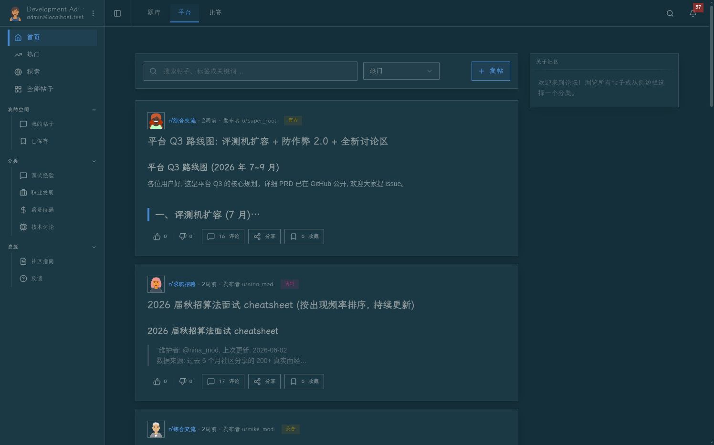 | 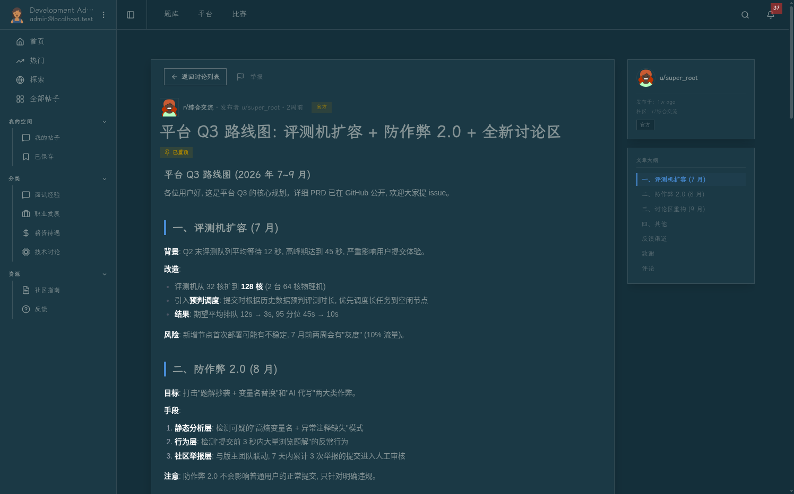 |  | 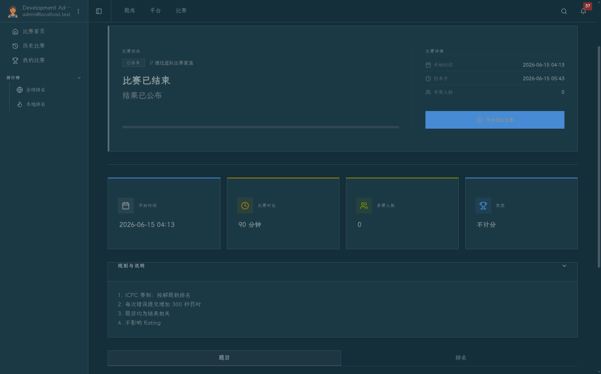 |

**Dark · 题库与题目**

| 题库专题 | 题单详情 | 题目详情 |
|:-:|:-:|:-:|
| 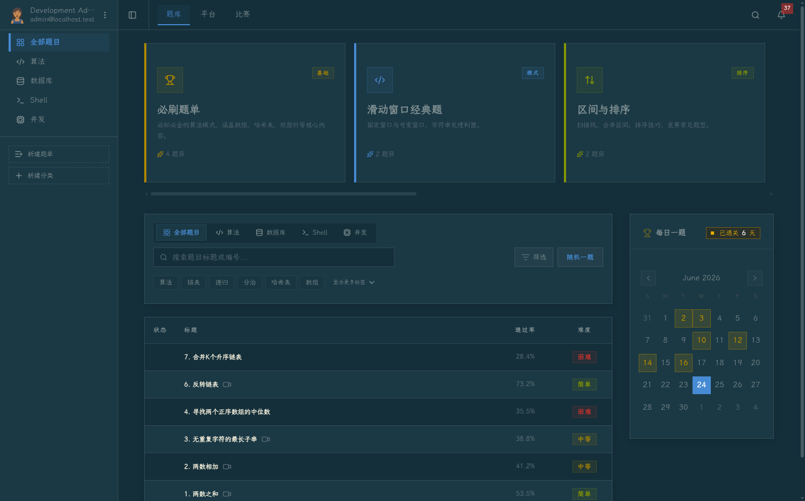 | 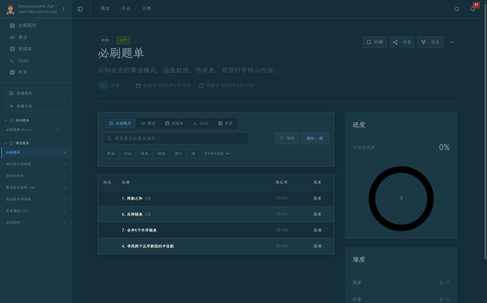 | 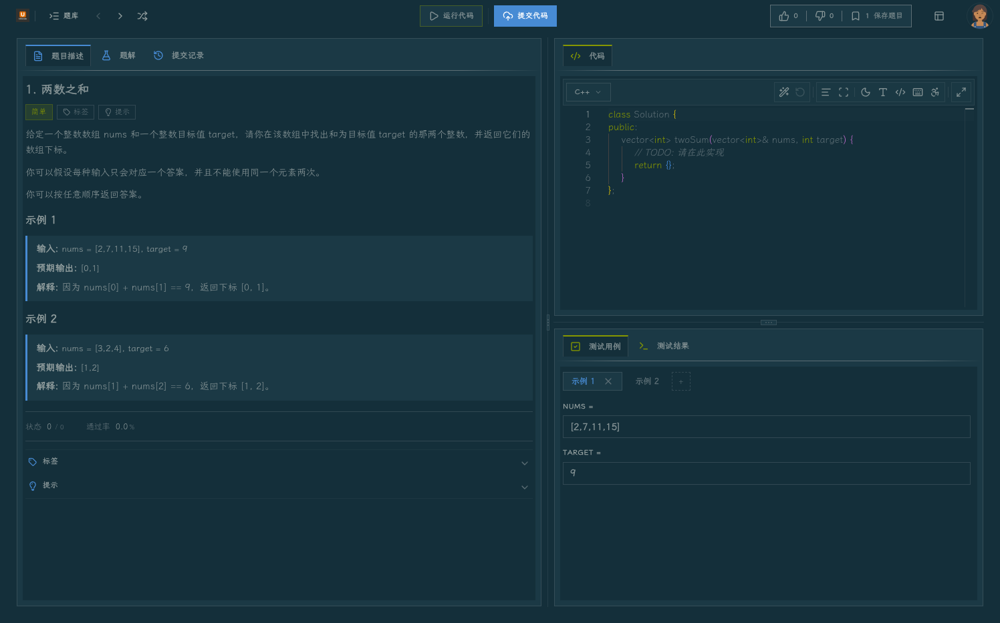 |

**Dark · 个人中心**

| 个人 Dashboard | 提交记录 | 成就徽章 |
|:-:|:-:|:-:|
| 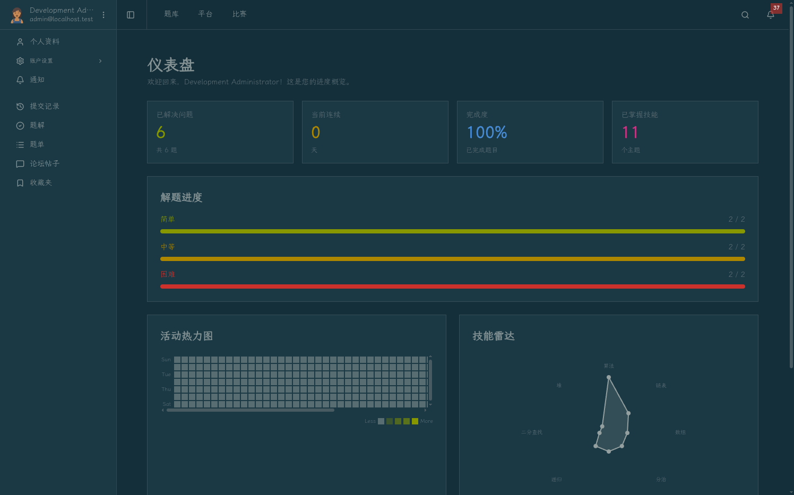 | 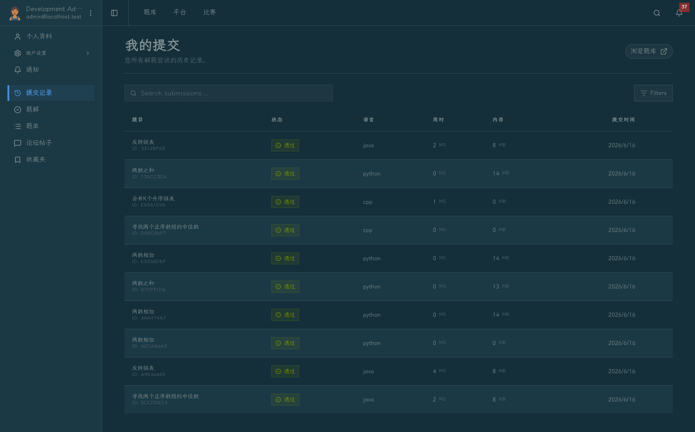 | 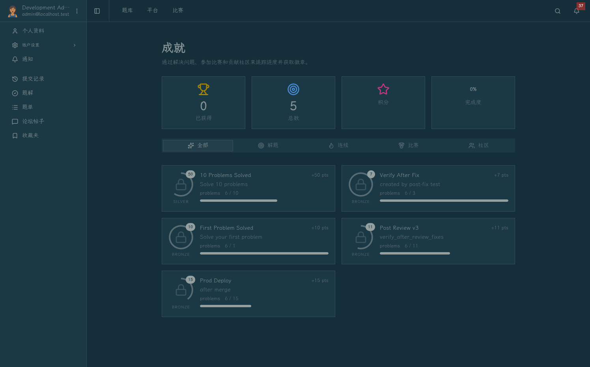 |

### 🛡️ 管理端 (Management · 9003)

**Dark · 概览**

| 数据分析 | 仪表板 |
|:-:|:-:|
| 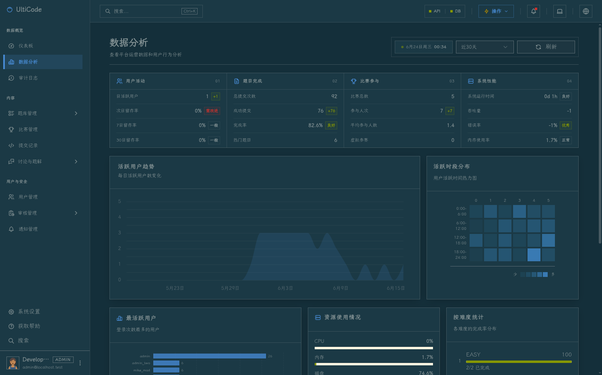 | 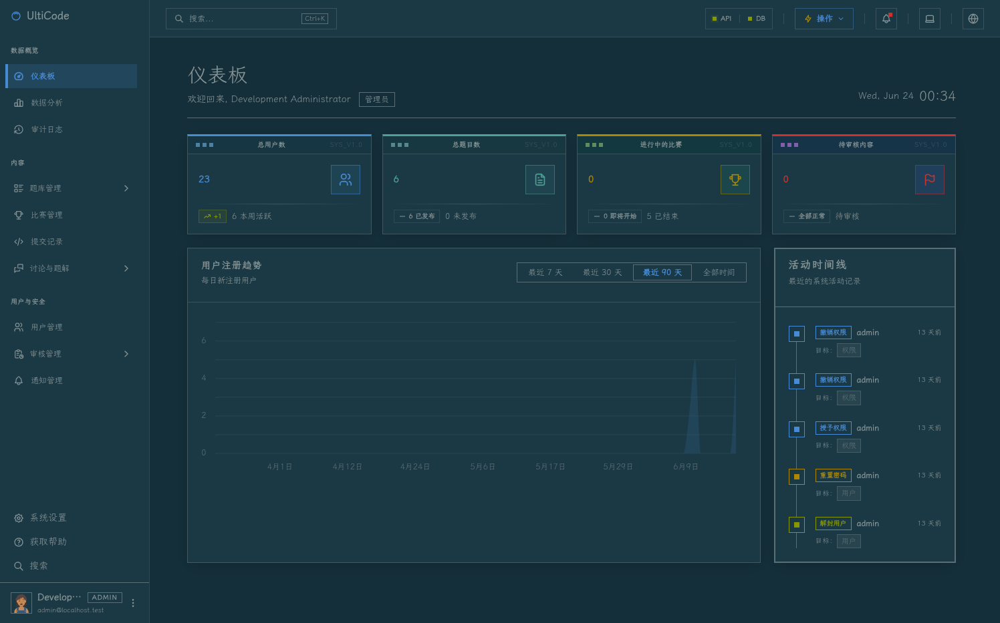 |

**Dark · 治理与审计**

| 用户管理 | 比赛管理 | 内容审核 | 提交审计 |
|:-:|:-:|:-:|:-:|
| 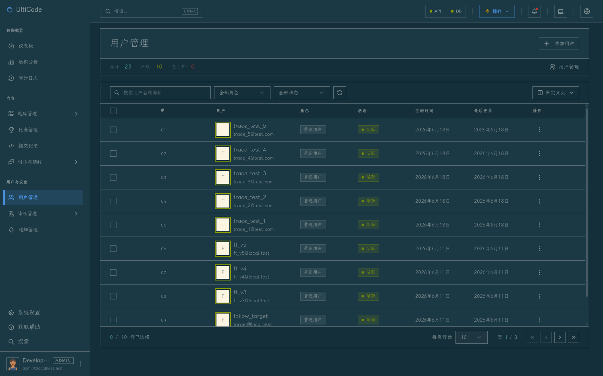 | 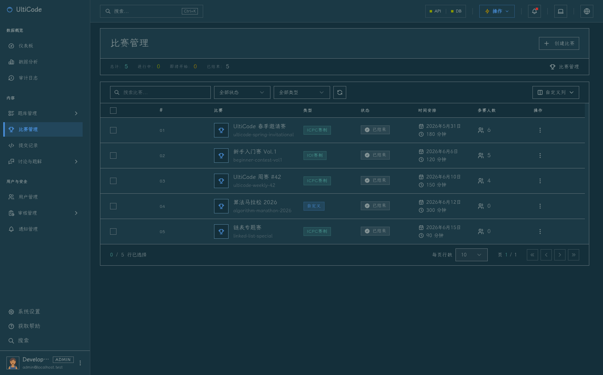 | 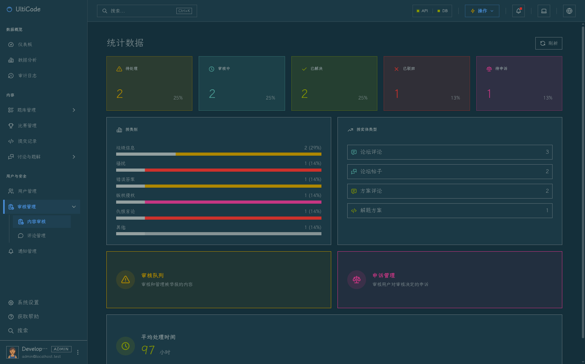 | 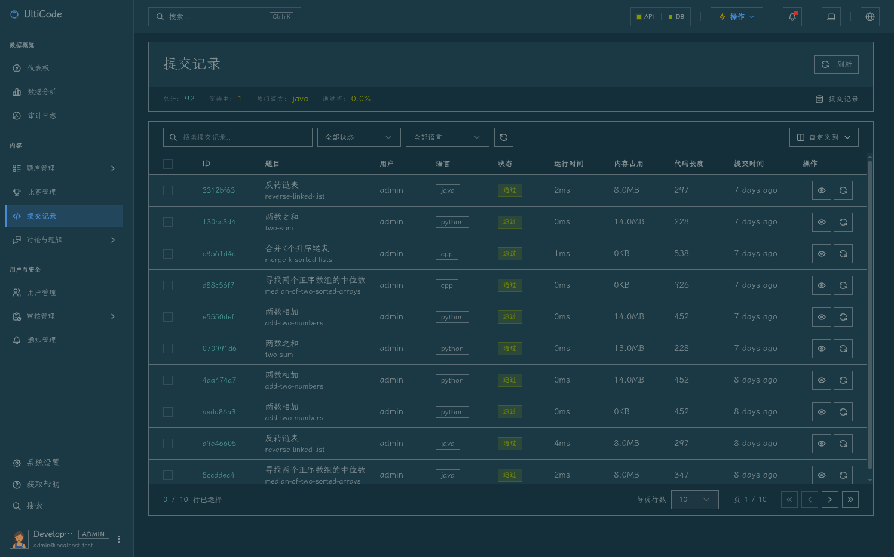 |

---

## 架构概览

```
                       ┌────────────────────────────────────────────┐
                       │              Browser (PWA)                 │
                       │   Console 9002  ·  Management 9003         │
                       └────────────┬────────────────┬───────────────┘
                                    │ Axios + CSRF    │
                                    ▼                ▼
                       ┌────────────────────────────────────────────┐
                       │          Owner API gateway (/api)           │
                       │ Auth :9101 · Admin :9102 · App :9103       │
                       │ Submission :9106 · Notification :9105    │
                       │ JWT + Redis Session · SpringDoc OpenAPI   │
                       └──┬──────────────┬──────────────┬───────────┘
                          │              │              │
                          ▼              ▼              ▼
                    ┌──────────┐  ┌──────────┐  ┌───────────────┐
                    │  MySQL   │  │  Redis   │  │    Nacos      │
                    │  9.1     │  │   7      │  │   2.3.2       │
                    │ (23306)  │  │ (26379)  │  │   (28848)     │
                    └──────────┘  └──────────┘  └───────────────┘
                                       ▲
                                       │
                          ┌────────────┴─────────────┐
                          │  Sandbox Runner (D-form)  │
                          │  Python · C · C++ · Java  │
                          │  Hexagonal / Source-Stage-Image │
                          └────────────────────────────┘
```

### 顶层目录

```
UltiCode/
├── services/         # 后端 Maven reactor（platform · api · auth · admin · app · submission · notification · judge）
│   ├── platform/     # 共享平台层（common · web-security）
│   ├── api/          # Dubbo RPC 契约（auth-api · admin-api · app-api）
│   ├── auth/         # Auth owner — 9101
│   ├── admin/        # Admin owner — 9102
│   ├── app/          # App owner — 9103（app-web boot 壳 + modules/ 私有领域）
│   ├── submission/   # Submission compatibility owner seam — 9106 / Dubbo 20886
│   ├── notification/ # Notification/email owner — 9105
│   └── judge/        # Judge worker — 独立进程，消费 Redis Streams
├── apps/
│   ├── console/      # Vue 3 用户前端 — 端口 9002
│   └── management/   # Vue 3 管理后台 — 端口 9003
├── packages/         # 共享包 (auth-core · auth-ui · badge-config · design-system · sandbox-types · theme)
├── init-db/          # Flyway 数据库迁移
├── docker/           # Docker 初始化脚本 (Nacos SQL · Sandbox harness)
├── assets/           # README 截图等二进制资源
├── scripts/dev/      # 开发运维脚本 (init-env · up · migrate · test)
├── infrastructure/   # Arthas 项目级配置
└── ecosystem.config.cjs  # PM2 进程编排
```

---

## 技术栈

### 后端

| 领域 | 技术 |
|------|------|
| 运行时 | **Java 17** (vfox 管理) · Spring Boot 3.2.5 |
| 持久化 | MyBatis-Plus 3.5.16 · MySQL 9.1 · Flyway |
| 对象映射 | MapStruct 1.6.3 |
| 认证 | JWT (jjwt 0.13.0) · Redis (Redisson 4.3.1) · OAuth2 state in HttpOnly cookie |
| API 文档 | SpringDoc OpenAPI 2.6.0 |
| WebSocket | STOMP over SockJS · Cookie-only access token |
| 测试 | JUnit 5 · Testcontainers (MySQL + Redis) · JaCoCo |

### 前端

| 领域 | 技术 |
|------|------|
| 框架 | **Vue 3.5** + TypeScript (strict) + Composition API |
| 构建 | Vite 8 · pnpm 10 |
| 路由 / 状态 | Vue Router 5 · Pinia 3 |
| UI | Tailwind CSS v4 · shadcn-vue (reka-ui) · Radix Vue · Lucide / Tabler Icons |
| 国际化 | vue-i18n 11（中英双语） |
| HTTP | Axios（统一 `request.ts` · CSRF 自动注入 · 401 自动跳转） |
| PWA | vite-plugin-pwa + Workbox |
| 测试 | Vitest 4 · jsdom · Playwright (management) |
| 代码检查 | ESLint 9/10 (flat config) · Prettier（无分号 / 单引号 / 100 字符） |

### 基础设施

| 领域 | 技术 |
|------|------|
| 容器 | Docker Compose v2 · 非 root 用户 (`appuser:appgroup`) · 多阶段构建 |
| 进程管理 | PM2（7 个长生命周期 app：auth · admin · app · notification · judge · console · management） |
| 运行时诊断 | Arthas 4.2.2 · STATELESS MCP（端口 8563） |
| 服务发现 / 配置 | Nacos 2.3.2 |
| CI/CD | GitHub Actions（路径触发） · CD 滚动发布与回滚 |

---

## 项目结构

### 后端 owner 服务与共享 reactor

`services/auth/`、`services/admin/`、`services/app/`、`services/notification/` 是数据 owner 服务；`services/judge/` 是不拥有业务表的独立判题运行时。`services/` 是 Maven parent/reactor，包含 `platform/`（common、web-security）、`api/`（RPC 契约）和这些运行模块。

| Owner / 模块 | 主代码路径 | 职责 |
|------|------|------|
| `services/auth` | `services/auth/src/main/java/com/ulticode/auth/` | 登录 / 注册 / OAuth / 找回密码 / refresh token / 账号状态 / RBAC |
| `services/admin` | `services/admin/src/main/java/com/ulticode/admin/`、`services/admin/src/main/java/com/ulticode/modules/admin/` | 管理端 BFF / 审核 / 审计 / 设置 / 监控 / 备份 |
| `services/app` | `services/app/app-web/src/main/java/com/ulticode/app/`、`services/app/app-web/src/main/java/com/ulticode/modules/` | 用户画像 / 题目 / 提交判题 / 竞赛 / 题解 / 论坛 / 搜索 / WebSocket；发布通知事件 |
| `services/notification` | `services/notification/src/main/java/com/ulticode/notification/`、`services/notification/src/main/java/com/ulticode/modules/` | 通知 HTTP / 意图投递 / 邮件 / 投递台账 / Redis 实时广播 |
| `services/judge` | `services/judge/src/main/java/com/ulticode/judge/` | Redis Streams 判题消费 / Docker 沙箱 / App verdict RPC；不拥有业务表 |

共享 reactor 的主要模块：

- `services/platform/common/`、`services/platform/web-security/`
- `services/api/auth-api/`、`services/api/admin-api/`、`services/api/app-api/`
- `services/app/modules/contest/`、`services/app/modules/moderation/`（App 保留通知事件发布与非通知消费者）
- `services/notification/`（通知与邮件运行时）
- `services/app/modules/problem/`、`services/app/modules/submission/`

各 owner 内部继续遵循 `controller → service/projection/port → mapper → entity` 分层；跨 owner 访问使用公开 contract 或 consumer-owned port，不直接依赖另一个 owner 的 Mapper / Entity。

### 前端视图

- **Console** (用户端) — 题目 · 题单 · 提交 · 竞赛 · 论坛 · 成就 · 个人主页 · Dashboard
- **Management** (管理端) — Dashboard · 用户 · 题目 · 提交 · 竞赛 · 论坛 · 审核 · 通知 · 订阅 · 标签 · 系统 · 审计 · Help

### 共享包 (`packages/`)

| 包 | 说明 |
|-----|------|
| `auth-core` | Vue composable 鉴权核心（Cookie / CSRF / Auth state / 权限） |
| `auth-ui` | 登录 / 注册 / 找回密码 UI 组件（双端共享） |
| `badge-config` | 成就徽章配置 |
| `design-system` | 设计 token 与组件原语 |
| `sandbox-types` | OJ 沙箱契约类型（与 `docker/sandbox/` 跨语言通信） |
| `theme` | 主题系统：State / Tokens / Primitives / Bootstrap |

> 改动 `packages/` 必须在 `packages/auth-core` 跑 `pnpm test` + `pnpm type-check`，并在 apps/console / apps/management 双端验证。

---

## 快速开始

### 前置要求

| 工具 | 版本 | 用途 |
|------|------|------|
| Docker + Compose | v2 | MySQL / Redis / Nacos |
| Java | **17** (推荐 vfox 管理) | 后端构建与运行 |
| Node.js | `^20.19.0 \|\| >=22.12.0` | 前端 / pnpm |
| pnpm | 10+ | 前端依赖 |
| PM2 | latest | 进程管理 |

### 🚀 一键启动（推荐）

```bash
# 1. 克隆
git clone <repo>
cd UltiCode

# 2. 首次：生成带随机凭据的私有 .env（已有则跳过）
./scripts/dev/init-env.sh

# 3. 启动基础设施 + Flyway 迁移 + 安装依赖 + 启动应用
./scripts/dev/up.sh
```

`up.sh` 是幂等的。再次启动且依赖未变时可跳过安装：

```bash
./scripts/dev/up.sh --skip-install
```

### 🔑 首次登录

dev 数据库会自动创建固定管理员账号：

```
用户名：admin
密码：  admin123
```

> ⚠️ 该弱密码**仅用于本机 dev 数据库**。基础设施密码和 JWT / Nacos 密钥均由 `init-env.sh` 随机生成，写入 Git 忽略的 `.env`。
> 生产环境必须改用强密码与外部密钥管理。

---

## 访问入口

| 服务 | 地址 | 备注 |
|------|------|------|
| 用户前端 (Console) | <http://localhost:9002> | PWA · 支持 light/dark/compact 切换 |
| 管理后台 (Management) | <http://localhost:9003> | 需 `admin` 角色 |
| Auth API | <http://localhost:9101> | 认证 / 凭据 Owner |
| Admin API | <http://localhost:9102> | 治理 / 管理 Owner |
| App API | <http://localhost:9103> | OJ / 用户业务 Owner |
| Submission owner | 内部 HTTP `9106` / Dubbo `20886` | 过渡期兼容 provider；不拥有业务表 |
| Notification API | <http://localhost:9105> | 通知 / 邮件 Owner |
| Judge Worker | Dubbo `20884` / PM2 `ulticode-judge` | 独立判题执行进程，无 HTTP API |
| Nacos 控制台 | <http://localhost:28848/nacos> | 配置中心 / 服务发现 |
| Arthas MCP | <http://localhost:8563/mcp> | STATELESS · Claude Code / IDE 直连 |

> **端口暴露策略**：`docker-compose.yml` 不发布基础设施端口；`docker-compose.dev.yml` 仅绑定 `127.0.0.1`。
> 生产 compose 进一步收紧，两个前端只绑 loopback，TLS 终止在外部网关。

---

## 开发指南

### 后端 owner 服务与共享 reactor

`services/auth/`、`services/admin/`、`services/app/`、`services/notification/` 是数据 owner 服务，`services/judge/` 是独立判题运行时；`services/` 是 Maven parent/reactor（含 platform/api 共享层）。以下命令均从 repository root 执行。

```bash
# 通过 PM2（完整后端 + 独立 Judge）
pm2 restart ulticode-auth ulticode-admin ulticode-app ulticode-notification ulticode-judge
pm2 logs ulticode-auth

# 直接启动单个 owner
(cd services && ./mvnw -pl auth -am spring-boot:run -Dmaven.test.skip=true)
(cd services && ./mvnw -pl admin -am spring-boot:run -Dmaven.test.skip=true)
(cd services && ./mvnw -pl app/app-web -am spring-boot:run -Dmaven.test.skip=true)
(cd services && ./mvnw -pl notification -am spring-boot:run -Dmaven.test.skip=true)
(cd services && ./mvnw -pl judge -am spring-boot:run -Dmaven.test.skip=true)

# 编译 / 测试 / 集成
(cd services && ./mvnw compile -B)
(cd services && ./mvnw test -B)                  # 排除 *IT.java
(cd services && ./mvnw -Dtest='*IT' test -B)     # Testcontainers 集成
(cd services && ./mvnw verify -B)                # 含 JaCoCo 校验
(cd services && ./mvnw package -DskipTests)
```

### 用户前端 (`apps/console/`)

```bash
pnpm --dir apps/console install
pnpm --dir apps/console dev              # lint + type-check + format + test + Vite dev
pnpm --dir apps/console build            # type-check + Vite build
pnpm --dir apps/console type-check       # vue-tsc --build
pnpm --dir apps/console lint             # eslint . --fix --cache
pnpm --dir apps/console test             # vitest --run
pnpm --dir apps/console test:coverage
```

### 管理后台 (`apps/management/`)

```bash
pnpm --dir apps/management install
pnpm --dir apps/management dev
pnpm --dir apps/management build
pnpm --dir apps/management type-check
pnpm --dir apps/management lint
pnpm --dir apps/management test
pnpm --dir apps/management validate:i18n-keys
```

### 共享包 (`packages/auth-core/`)

```bash
pnpm --dir packages/auth-core test
pnpm --dir packages/auth-core type-check
```

> 修改 `packages/auth-core` 必须在 apps/console / apps/management 双端验证。详见 [docs/CONTRIBUTING.md §6](docs/CONTRIBUTING.md)。

### 数据库迁移 (`init-db/`)

```bash
./scripts/dev/migrate.sh migrate     # 跑迁移
./scripts/dev/migrate.sh info        # 状态
./scripts/dev/migrate.sh validate    # 校验
./scripts/dev/migrate.sh repair      # 修复 checksum mismatch

# 只运行 Notification owner schema 的 Flyway history
MIGRATION_SCHEMA=notification ./scripts/dev/migrate.sh migrate

# 物理搬表前只读核对；写入动作必须显式确认
./scripts/dev/notification-schema-cutover.sh preflight
# NOTIFICATION_SOURCE_SCHEMA=app NOTIFICATION_APP_DB_USER=app_rw \
#   NOTIFICATION_CUTOVER_CONFIRM=I_UNDERSTAND_NOTIFICATION_CUTOVER \
#   ./scripts/dev/notification-schema-cutover.sh cutover --execute
# NOTIFICATION_SOURCE_SCHEMA=app NOTIFICATION_APP_DB_USER=app_rw \
#   NOTIFICATION_CUTOVER_CONFIRM=I_UNDERSTAND_NOTIFICATION_ROLLBACK \
#   ./scripts/dev/notification-schema-cutover.sh rollback --execute
```

迁移文件命名：`V{N}__{description}.sql`，**唯一真源**在 `init-db/migrations/`。
**绝不再编辑**已应用的迁移 —— 只能新增时间戳更大的迁移。

### Docker

```bash
# 开发
docker compose --env-file .env \
  -f docker-compose.yml -f docker-compose.dev.yml up -d

# 生产
docker compose -f docker-compose.yml -f docker-compose.prod.yml up -d
```

生产 Judge Worker 还需要在 Docker 宿主机预置沙箱目录、seccomp 文件和沙箱镜像；Worker 通过 Docker socket 启动隔离子容器，socket 不对公网发布：

```bash
export SANDBOX_HOST_DIR=/opt/ulticode/sandbox
export DOCKER_GID="$(stat -c '%g' /var/run/docker.sock)"
sudo install -d -o 1000 -g 1000 "$SANDBOX_HOST_DIR/workspace"
sudo install -o 1000 -g 1000 docker/sandbox/seccomp-profile.json "$SANDBOX_HOST_DIR/seccomp-profile.json"
./docker/sandbox/harness/build.sh
docker compose -f docker-compose.yml -f docker-compose.prod.yml up -d backend-app backend-notification backend-judge
```

> 部署主机 `.env` 必须设 `SANDBOX_ENABLED=true`（本地开发默认 `false` 的占位值会传入容器并禁用沙箱执行，所有判题将退化且无报错）。Worker 镜像固定以 uid/gid 1000 运行，与上面 `-o 1000 -g 1000` 的 workspace 属主及沙箱子容器的 `--user 1000:1000` 一致。

`SANDBOX_HOST_DIR` 必须是宿主机绝对路径，并在 Worker 容器内使用同一路径；否则 Docker daemon 无法看到 Worker 创建的作业目录。Docker socket 等同宿主机 Docker 管理权限，只应授予专用部署主机。

```bash
# 直接进 MySQL（容器默认 latin1，必须显式指定 utf8mb4）
set -a; source .env; set +a
docker exec -e MYSQL_PWD="$DB_PASSWORD" ulticode-mysql \
  mysql --default-character-set=utf8mb4 -u "$DB_USER" "$DB_NAME" \
  -e "SHOW TABLES;"
```

> **字符集陷阱**：不指定 `--default-character-set=utf8mb4` 会导致中文被双重编码（`æžå¨œ`）。详见 [CLAUDE.md §MySQL 容器化操作](CLAUDE.md#mysql-容器化操作-字符集)。

---

## 测试与质量

### 统一测试入口

```bash
./scripts/dev/test.sh quick        # 后端 / shared / console / management 单元测试 + 类型检查
./scripts/dev/test.sh full         # quick + 前端构建 + i18n 检查 + 依赖审计
./scripts/dev/test.sh integration  # quick + Testcontainers + Sandbox 集成测试
```

### 验证矩阵

| 触碰面 | 跑这套 |
|--------|--------|
| 后端 | `(cd services && ./mvnw compile test -B)` |
| 后端集成 | `(cd services && ./mvnw -Dtest='*IT' test -B)` |
| Console | `pnpm --dir apps/console lint && pnpm --dir apps/console type-check && pnpm --dir apps/console test && pnpm --dir apps/console build` |
| Management | `pnpm --dir apps/management lint && pnpm --dir apps/management type-check && pnpm --dir apps/management test && pnpm --dir apps/management validate:i18n-keys && pnpm --dir apps/management build` |
| 共享包 | `pnpm --dir packages/auth-core test && pnpm --dir packages/auth-core type-check` |
| 迁移 / 配置 | `docker compose --env-file .env -f docker-compose.yml -f docker-compose.dev.yml config >/dev/null` · `git diff --check` |

---

## CI/CD 与部署

GitHub Actions 在 push / PR 到 `main` 时触发，**基于路径变化检测**仅运行相关任务。

| Job | 触发条件 | 内容 |
|-----|---------|------|
| Backend | `services/**`, `init-db/migrations/**` | Maven 构建 + 单测 + Flyway 校验 |
| Console | `apps/console/**`, `packages/**` | lint + type-check + test |
| Management | `apps/management/**`, `packages/**` | lint + type-check + test + i18n 校验 |
| Docker | `services/**`、`apps/**`、Dockerfile / Compose 输入 | 多阶段构建验证 |
| Integration | 定时 / 手动 | Testcontainers（MySQL 9.1 + Redis 7） |
| CD Deploy | `workflow_dispatch` | 滚动发布到指定环境 |
| CD Rollback | `workflow_dispatch` | 一键回滚到指定 image tag |

部署 Runbook 见 [`scripts/dev/up.sh`](scripts/dev/up.sh) 与 [`scripts/dev/doctor.sh`](scripts/dev/doctor.sh)。

---

## PM2 进程管理

| 端口 | PM2 app | 进程类型 | 备注 |
|------|---------|---------|------|
| 9101 | `ulticode-auth` | Auth Spring Boot | Auth Owner |
| 9102 | `ulticode-admin` | Admin Spring Boot | Admin Owner |
| 9103 | `ulticode-app` | App Spring Boot | App Owner |
| 9106 | `ulticode-submission` | Submission Spring Boot | 过渡期兼容 provider；Dubbo internal only |
| 9105 | `ulticode-notification` | Notification Spring Boot | Notification/email Owner |
| 20884 | `ulticode-judge` | Judge Spring Boot | Redis Streams consumer；Dubbo internal only |
| 9002 | `ulticode-9002` | Console (Vite) | dev: Vite · prod: 静态服务 |
| 9003 | `ulticode-9003` | Management (Vite) | dev: Vite · prod: 静态服务 |
| — | `ulticode-init-db` | Flyway 一次性任务 | `stopped` 是**预期终态** |
| 8563 | `arthas-diagnostics` 插件 | Arthas MCP | 插件显式 attach，不由 PM2 管理 |

### 常用命令

```bash
pm2 start ecosystem.config.cjs   # 首次启动四 owner + Judge + 两个前端
pm2 start all                    # 后续启动
pm2 restart all                  # 重启
pm2 stop all
pm2 status                       # 状态
pm2 logs                         # 实时日志
pm2 logs ulticode-auth --nostream --lines 200
pm2 logs ulticode-admin --nostream --lines 200
pm2 logs ulticode-app --nostream --lines 200
pm2 save && pm2 resurrect        # 持久化与恢复
```

### Arthas MCP

```bash
node /home/davidhlp/project/arthas-diagnostics/bin/arthas-diagnostics.mjs doctor --port 9103
node /home/davidhlp/project/arthas-diagnostics/bin/arthas-diagnostics.mjs start --port 9103
node /home/davidhlp/project/arthas-diagnostics/bin/arthas-diagnostics.mjs tools
```

Arthas 由 `arthas-diagnostics` OMP 插件管理；先启动 App JVM，再显式 attach。

1. `ulticode-mysql` / `ulticode-redis` / `ulticode-nacos` 必须 **Up + Healthy**
2. `pm2 restart ulticode-init-db`（跑 Flyway）
3. `pm2 restart ulticode-auth ulticode-admin ulticode-app ulticode-judge`
4. 启动两个前端

> 一键修复： `./scripts/dev/up.sh --skip-install`

---

## 环境变量

`.env` 是**唯一**真实来源（gitignored），由 `init-env.sh` 生成。
完整字段与说明见 [docs/ENV.md](docs/ENV.md) 与 [.env.example](.env.example)。

| 变量 | 用途 | 备注 |
|------|------|------|
| `DB_HOST` / `DB_PORT` | MySQL 地址 | dev: `localhost:23306` |
| `DB_USER` / `DB_PASSWORD` / `DB_NAME` | MySQL 凭据 | — |
| `NOTIFICATION_DB_USER` / `NOTIFICATION_DB_PASSWORD` / `NOTIFICATION_DB_NAME` | Notification owner schema/database（当前 Flyway 目标名为 `notification`）；未设置时兼容 `DB_*` | 物理切库时由部署密管提供 |
| `NOTIFICATION_SOURCE_SCHEMA` / `NOTIFICATION_APP_DB_USER` | Notification 搬表前的源 schema 与 App grant 用户 | 仅执行 cutover/rollback 时设置 |
| `REDIS_HOST` / `REDIS_PORT` / `REDIS_PASSWORD` | Redis 配置 | dev: `localhost:26379` |
| `JWT_SECRET` | JWT 签名密钥 | **≥ 32 字符**，由 init-env 随机生成 |
| `CORS_ALLOWED_ORIGINS` | 跨域白名单 | dev: `http://localhost:9002,http://localhost:9003` |
| `NACOS_SERVER_ADDR` | Nacos 地址 | dev: `localhost:28848` |
| `NACOS_USERNAME` / `NACOS_PASSWORD` | Nacos 鉴权 | dev profile 专用账号 |
| `SANDBOX_HOST_DIR` / `DOCKER_GID` | 生产 Judge Worker 的 Docker socket / 沙箱工作目录 | 仅 Compose 部署；目录必须与宿主机路径一致 |
| `FRONTEND_URL` | 邮件 / 回调拼接 | dev: `http://localhost:9002` |
| `SPRING_PROFILES_ACTIVE` | Spring Profile | dev / prod |

> **pm2 env 缓存陷阱**：`pm2 restart --update-env` 不会重读 `.env`。
> 改 `.env` 后若 owner 服务报 `RedisWrongPasswordException` 等认证错，请用：
> `pm2 delete ulticode-auth ulticode-admin ulticode-app ulticode-notification ulticode-judge && pm2 start ecosystem.config.cjs --only ulticode-auth,ulticode-admin,ulticode-app,ulticode-notification,ulticode-judge`

---

## 项目约定

| 主题 | 约定 |
|------|------|
| 提交格式 | `<type>: <description>` · 类型: `feat` `fix` `refactor` `docs` `test` `chore` `perf` `ci` |
| 提交前自检 | `git diff` · `git diff --check` |
| Prettier | 无分号 · 单引号 · 100 字符行宽 |
| 集成测试 | `*IT.java` 后缀，从 `(cd services && ./mvnw test -B)` 排除；用 `(cd services && ./mvnw -Dtest='*IT' test -B)` 或 `./scripts/dev/test.sh integration` |
| 迁移命名 | `V{N}__{description}.sql`，置于 `init-db/migrations/` |
| Docker 容器 | 非 root `appuser:appgroup` · 多阶段构建 |
| 后端 DTO 枚举 | 后端 DTO 字段使用 `String`（前端用 TS enum）；**新代码优先推进后端 enum 化** |
| 分支策略 | 默认在 `main` 直接提交（多文件 / 多 commit / 跨模块亦可） |
| 危险操作 | `git push` / `merge` / `publish` / 改写历史 / 改第三方资源 **必须显式批准** |

> 完整规范：[AGENTS.md](AGENTS.md) · [CLAUDE.md](CLAUDE.md) · [docs/CONTRIBUTING.md](docs/CONTRIBUTING.md)

---

## 文档导航

UltiCode 维护一份分层的工程知识库，按需查阅：

| 你是… | 从这里开始 |
|-------|------------|
| 第一次提 PR | [docs/CONTRIBUTING.md](docs/CONTRIBUTING.md) |
| On-call 工程师 | [docs/RUNBOOK.md](docs/RUNBOOK.md) §0 速查 + §4 常见问题 |
| 架构师 / 规划者 | [wiki/](../wiki/) (`entities/` + `overview/`,无 ADR/概念层) |
| 后端开发 | [docs/CODEMAPS/backend.md](docs/CODEMAPS/backend.md) + [.claude/rules/springboot-rules.md](.claude/rules/springboot-rules.md) |
| 前端开发 | [docs/CODEMAPS/frontend.md](docs/CODEMAPS/frontend.md) + [.claude/rules/frontend-rules.md](.claude/rules/frontend-rules.md) |
| 数据库 / Flyway | [docs/CODEMAPS/data.md](docs/CODEMAPS/data.md) + [.claude/rules/database/01-flyway-migrations.md](.claude/rules/database/01-flyway-migrations.md) |
| 沙箱 / 评测 | [docs/CODEMAPS/sandbox.md](docs/CODEMAPS/sandbox.md) + [docs/adr/0002-sandbox-hexagonal-dform.md](docs/adr/0002-sandbox-hexagonal-dform.md) |
| 运维 / 部署 / 密钥 | [docs/ENV.md](docs/ENV.md) + [docs/RUNBOOK.md](docs/RUNBOOK.md) |
| 安全审查 | [docs/SECURITY_REVIEW_2026-06-06.md](docs/) + [.claude/agents/security-reviewer.md](.claude/agents/) |
| 主题 / 样式 | [docs/theme/README.md](docs/theme/README.md) + [docs/CODEMAPS/frontend.md §Theme](docs/CODEMAPS/frontend.md) |
| 决策记录（ADR） | 已退役 (2026-07-09)。设计决策沉淀在 `AGENTS.md` / `CLAUDE.md` / 源码 Javadoc + 迁移注释;wiki 仅保留"是什么 / 怎么拼"层 |

---

## 贡献

欢迎贡献代码、文档、Issue 与功能建议。在开始前请阅读：

- **[CONTRIBUTING.md](docs/CONTRIBUTING.md)** — 开发环境、代码风格、PR 清单、评审礼仪
- **[AGENTS.md](AGENTS.md)** — 仓库级权威指南（结构、工具链、启动流程、运维命令）
- **[CLAUDE.md](CLAUDE.md)** — Claude Code 协作约定、字符集陷阱、Arthas / PM2 速查

### 提 PR 前的硬清单

```bash
# 1. 看 diff
git diff && git diff --check

# 2. 触碰面测试（按矩阵执行）
./scripts/dev/test.sh quick        # 日常
./scripts/dev/test.sh full         # 涉及前端构建
./scripts/dev/test.sh integration  # 涉及后端集成

# 3. 提交（Conventional Commits）
git add -A
git commit -m "feat(module): concise description"
```

### 报告 Bug / 提功能请求

请使用 [GitHub Issues](https://github.com/your-org/UltiCode-Public-Next/issues)，并附上：

- 复现步骤 / 期望 / 实际行为
- 环境（dev / prod、浏览器、Node / Java 版本）
- 关键日志（`pm2 logs ulticode-auth ulticode-admin ulticode-app --nostream --lines 200`）

---

## 许可证

本项目基于 [MIT License](LICENSE) 开源。

```
MIT License

Copyright (c) 2026 UltiCode
```

---

<div align="center">

**Built with ❤️ by the UltiCode team**

如果这个项目对你有帮助，欢迎 ⭐ Star！

</div>
