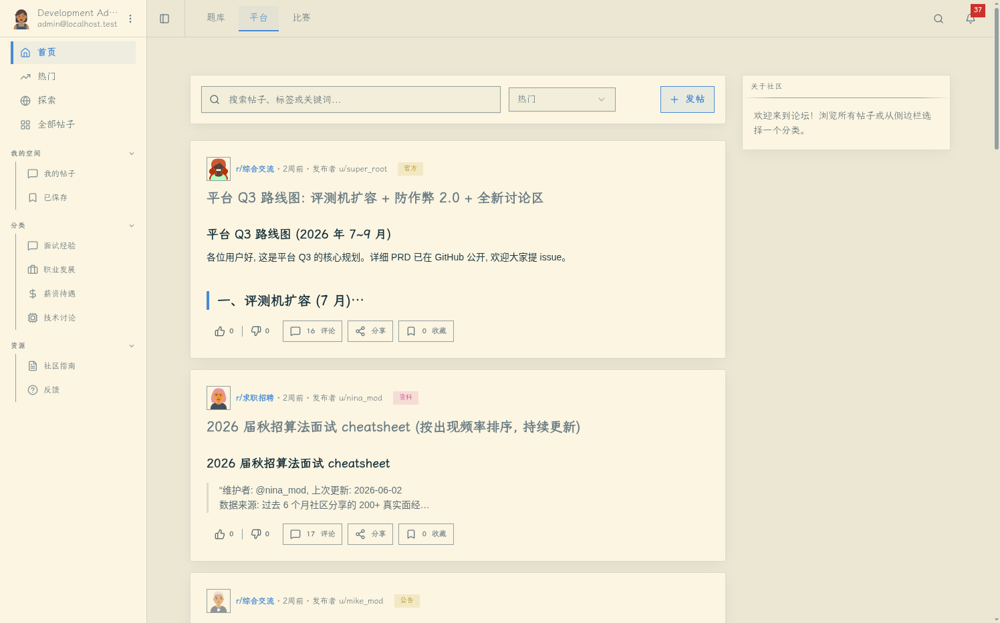
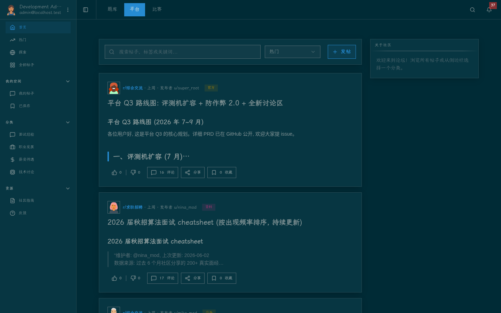
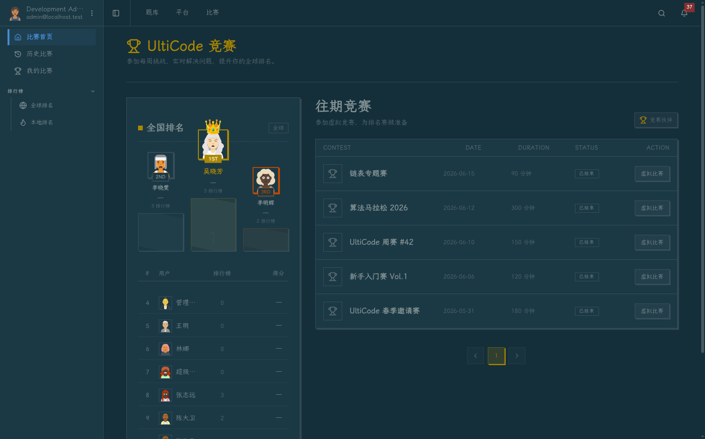
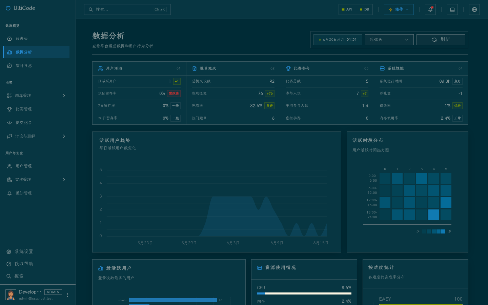
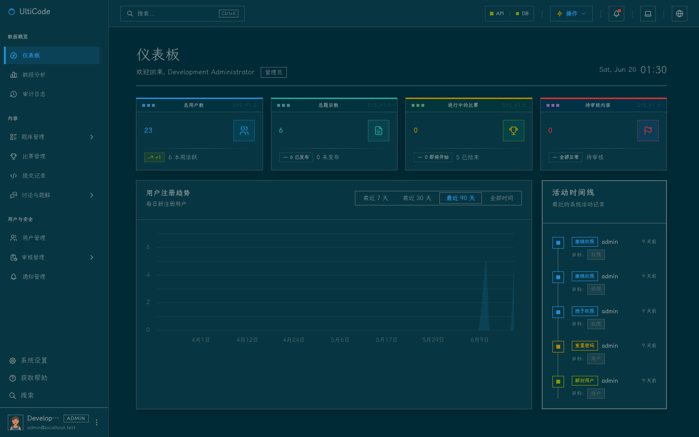

# UltiCode

**在线编程平台 (Online Judge)** — 一个功能完整的在线判题系统，支持题目练习、竞赛、社区讨论、成就系统等。

## 项目截图

> 想看更多视图、对比 light/dark 主题或下载原图：见 [docs/screenshots/](docs/screenshots/README.md)。

### 用户端 (Console · 9002 · light)



### 用户端 (Console · 9002 · dark)






### 管理端 (Management · 9003 · dark)





## 架构概览

```
UltiCode/
├── backend-spring/       # Spring Boot 3.2.5 后端 — 端口 9001
├── console/              # Vue 3 用户前端 — 端口 9002
├── management/           # Vue 3 管理后台 — 端口 9003
├── shared/               # 共享包 (auth-core, badge-config)
├── init-db/              # Flyway 数据库迁移
├── docker/               # Docker 初始化脚本 (Nacos SQL, Sandbox)
└── docs/                 # 项目文档与分析报告
```

## 技术栈

| 层级 | 技术 |
|------|------|
| **后端** | Spring Boot 3.2.5 · Java 17 · MyBatis-Plus 3.5.16 · MapStruct 1.6.3 |
| **认证** | JWT (jjwt 0.13.0) · Redis 会话 (Redisson 4.3.1) |
| **API 文档** | SpringDoc OpenAPI 2.6.0 |
| **数据库** | MySQL 9.1 (端口 23306) · Redis 7 (端口 26379) |
| **服务发现** | Nacos 2.3.2 (端口 28848) |
| **前端** | Vue 3.5 · TypeScript · Vite 8 · Pinia 3 · Vue Router 5 · Tailwind CSS v4 |
| **UI 组件** | shadcn-vue (reka-ui) · Radix Vue · Lucide / Tabler Icons |
| **国际化** | vue-i18n 11 |
| **HTTP** | Axios |
| **测试 (BE)** | JUnit 5 · Testcontainers (MySQL, Redis) · JaCoCo |
| **测试 (FE)** | Vitest 4 · jsdom · Playwright (management) |
| **代码检查** | ESLint 9/10 (flat config) · Prettier (无分号, 单引号, 100 字符) |

## 后端模块

`backend-spring/src/main/java/com/ulticode/modules/` 下包含以下业务模块：

| 模块 | 说明 |
|------|------|
| `achievement` | 成就系统 |
| `auth` | 认证与授权 |
| `contest` | 竞赛系统 |
| `forum` | 社区论坛 |
| `problem` | 题目管理 |
| `problemlist` | 题单系统 |
| `submission` | 提交与判题 |
| `solution` | 题解系统 |
| `user` | 用户管理 |
| `vote` | 投票系统 |
| `notification` | 通知系统 |
| `moderation` | 内容审核 |
| `subscription` | 订阅与支付 |
| `search` | 搜索服务 |
| `bookmark` / `follow` | 收藏与关注 |
| `email` | 邮件服务 |
| `i18n` | 国际化 |
| `admin` / `permission` | 管理与权限 |
| `monitoring` / `backup` | 监控与备份 |

每个模块遵循 `controller → service → mapper (MyBatis-Plus) → entity` 分层架构，DTO 转换通过 MapStruct 实现。

## 快速开始

### 前置要求

- **Docker** & Docker Compose
- **Java 17+** (推荐 [Adoptium](https://adoptium.net/))
- **Node.js 20+** (推荐 22.x)
- **pnpm 10+**
- **PM2**

### 一键启动开发环境

```bash
git clone https://github.com/your-org/UltiCode-Public-Next.git
cd UltiCode-Public-Next

# 首次生成私有随机凭据；已有 .env 时不会覆盖
./scripts/dev/init-env.sh

# 启动基础设施、配置 Nacos、迁移数据库、安装依赖并启动应用
./scripts/dev/up.sh
```

开发数据库会自动创建或恢复固定管理员账号：

```text
用户名：admin
密码：admin123
```

该弱密码仅用于本机可丢弃的 `dev` 数据库。基础设施密码和 JWT/Nacos
密钥仍由 `init-env.sh` 随机生成，并保存在 Git 忽略的 `.env` 中。

再次启动且依赖未变化时可使用：

```bash
./scripts/dev/up.sh --skip-install
```

### 访问地址

| 服务 | 地址 |
|------|------|
| 用户前端 (Console) | http://localhost:9002 |
| 管理后台 (Management) | http://localhost:9003 |
| 后端 API | http://localhost:9001 |
| API 文档 (Swagger) | http://localhost:9001/swagger-ui.html |
| Nacos 控制台 | http://localhost:28848/nacos |

基础 `docker-compose.yml` 不发布基础设施端口；开发覆盖文件仅绑定
`127.0.0.1`。生产环境只把两个前端绑定到本机回环地址，外部 TLS
网关负责公开访问，backend、MySQL、Redis 和 Nacos 保持在 Docker 网络内。

## 开发

### 后端 (backend-spring/)

```bash
# 开发服务器 (PM2)
pm2 restart ulticode-9001
pm2 logs ulticode-9001

# 直接运行
./mvnw spring-boot:run -Dmaven.test.skip=true

# 构建
./mvnw package -DskipTests

# 单元测试 (排除集成测试 *IT.java)
./mvnw test

# 集成测试
./mvnw -Dtest='*IT' test

# 测试与 JaCoCo 校验
./mvnw verify

# 仅编译
./mvnw compile
```

### 用户前端 (console/)

```bash
pnpm dev              # lint + type-check + format + test + vite dev
pnpm build            # type-check + vite build
pnpm type-check       # vue-tsc --build
pnpm lint             # eslint . --fix --cache
pnpm format           # prettier --write src/
pnpm test             # vitest --run
pnpm test:coverage    # vitest --coverage
```

### 管理后台 (management/)

```bash
# 与 console 相同的命令，额外支持 Playwright E2E
pnpm dev
pnpm build
pnpm test
```

### 数据库迁移 (init-db/)

```bash
# 运行迁移
./scripts/dev/migrate.sh migrate

# 查看或校验迁移
./scripts/dev/migrate.sh info
./scripts/dev/migrate.sh validate

# 迁移文件命名规则
# V{N}__{description}.sql
# 例: V20260530130501__Baseline.sql
```

### Docker

```bash
# 开发环境
docker compose --env-file .env \
  -f docker-compose.yml -f docker-compose.dev.yml up -d

# 生产环境
docker compose -f docker-compose.yml -f docker-compose.prod.yml up -d

# 直接操作 MySQL
set -a; source .env; set +a
docker exec -e MYSQL_PWD="$DB_PASSWORD" ulticode-mysql \
  mysql -u "$DB_USER" "$DB_NAME" -e "SHOW TABLES;"
```

### 统一测试入口

```bash
./scripts/dev/test.sh quick        # 后端、共享认证、两个前端的测试和类型检查
./scripts/dev/test.sh full         # quick + 前端构建、i18n 检查和依赖审计
./scripts/dev/test.sh integration  # quick + Testcontainers 与 Sandbox 集成测试
```

## 项目约定

- **提交格式**: `<type>: <description>` — 类型: feat, fix, refactor, docs, test, chore, perf, ci
- **前端 Prettier**: 无分号、单引号、100 字符行宽
- **集成测试后缀**: `*IT.java`，从 `./mvnw test` 排除，使用
  `./mvnw -Dtest='*IT' test` 运行
- **迁移命名**: `V{N}__{description}.sql`，置于 `init-db/migrations/`
- **Docker 容器**: 非 root 用户 (`appuser:appgroup`)、多阶段构建
- **后端 DTO 枚举**: 后端 DTO 字段使用 `String` 类型表示枚举值，前端使用 TS 枚举

## CI/CD

GitHub Actions 在 push/PR 到 `main` 分支时触发，基于路径变化检测仅运行相关任务：

| 任务 | 触发条件 | 内容 |
|------|---------|------|
| Backend | `backend-spring/**` 变更 | Maven 构建 + 测试 + Flyway 迁移验证 |
| Console | `console/**` 变更 | lint + type-check + test |
| Management | `management/**` 变更 | lint + type-check + test |
| Docker | Dockerfile 变更 | 构建验证 |
| Integration | — | Testcontainers (MySQL 9.1 + Redis 7) |

## PM2 服务管理

| 端口 | 名称 | 类型 |
|------|------|------|
| 9001 | ulticode-9001 | Spring Boot 后端 |
| 9002 | ulticode-9002 | Console 前端 (Vite) |
| 9003 | ulticode-9003 | Management 前端 (Vite) |

```bash
pm2 start ecosystem.config.cjs   # 首次启动
pm2 start all                    # 后续启动
pm2 stop all / pm2 restart all
pm2 logs / pm2 status / pm2 monit
pm2 save                         # 保存进程列表
pm2 resurrect                    # 恢复已保存列表
```

## 环境变量

核心配置项（完整列表见 [.env.example](.env.example)）：

| 变量 | 说明 | 默认值 |
|------|------|--------|
| `DB_HOST` / `DB_PORT` | MySQL 地址 | `localhost:23306` |
| `DB_USER` / `DB_PASSWORD` / `DB_NAME` | MySQL 凭据 | — |
| `REDIS_HOST` / `REDIS_PORT` / `REDIS_PASSWORD` | Redis 配置 | `localhost:26379` |
| `JWT_SECRET` | JWT 签名密钥 (≥32 字符) | — |
| `CORS_ALLOWED_ORIGINS` | 允许的跨域来源 | `http://localhost:9002,http://localhost:9003` |
| `NACOS_SERVER_ADDR` | Nacos 地址 | `localhost:28848` |

## 许可证

[MIT License](LICENSE)
