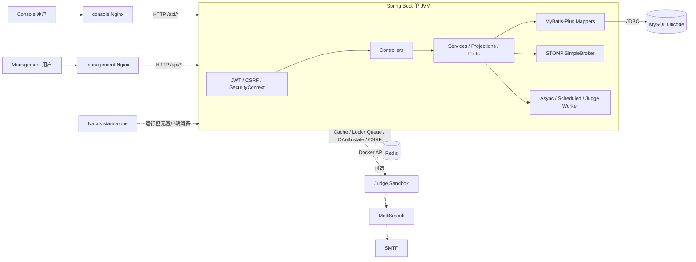
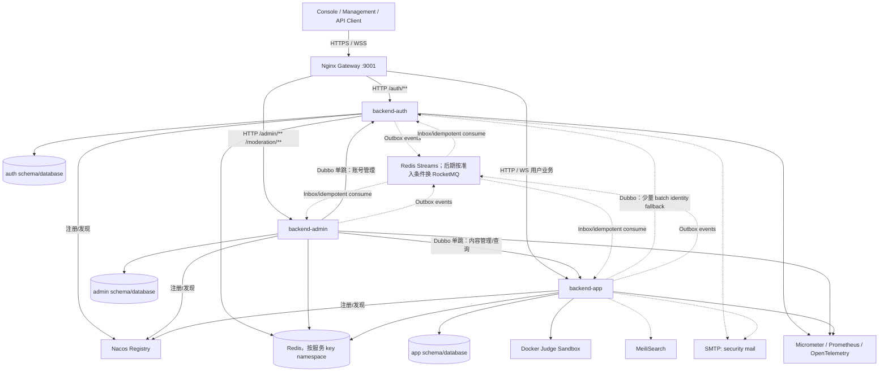
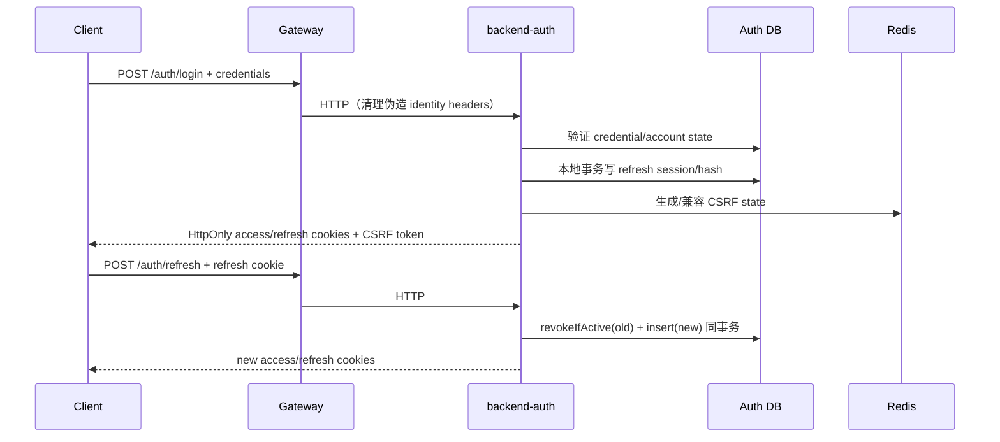

# UltiCode 后端微服务化迁移指导

> 本文只做架构调查与迁移设计，不实施拆分。代码、`init-db/migrations/`、运行配置和 Compose 是现状真源；文中所有“目标态”均需通过后续独立变更落地。文内行号用于调查快照定位，后续维护应以文件路径和符号名为准。

## 1. Executive Summary

### 1.1 为什么拆

当前 `backend-spring` 是一个 Spring Boot 单体。按包划分的模块已经有 Service、Projection、consumer-owned Port 等边界，但所有模块仍共享一个 JVM、一个 MySQL 数据源和一套 Redis；管理端模块还会直接调用 Problem/Contest/User/Submission 等模块的 Mapper 或 Service。该结构适合当前单体开发，却不能直接等价替换成远程调用：若机械“目录搬家 + Dubbo”，会得到共享数据库、双向 RPC、同步 fan-out 和跨网络事务并存的分布式单体。

拆分的现实收益应限定为：

- 隔离认证私钥、凭证与刷新会话的安全爆炸半径；
- 让管理/运营能力与用户流量、判题负载独立部署；
- 明确表和写操作的唯一 Owner，停止跨模块 Mapper 写入；
- 让判题、通知、WebSocket、搜索等失败不再扩大为整个后端失败；
- 为独立扩缩容和发布建立边界，而不是追求“微服务组件齐全”。

### 1.2 推荐目标

最终保留三个粗粒度服务：

- **`backend-auth`**：账号、凭证、OAuth identity、JWT、refresh session、账号状态和 RBAC；不拥有用户画像、题目、竞赛或运营数据。
- **`backend-admin`**：管理端 BFF、审核治理、审计、系统配置、监控和备份；“能管理某数据”不等于“拥有该数据”。题目、竞赛、投稿等管理命令仍由其业务 Owner 执行。
- **`backend-app`**：在线判题核心和普通用户业务，包括用户画像、题目、提交/判题、竞赛、题解、论坛、互动、通知、搜索、WebSocket 等。首轮迁移刻意保持为一个较大的业务服务，避免过早继续拆分。

核心内部同步 RPC 使用 **Apache Dubbo 3**；注册发现使用仓库已部署但尚未被后端使用的 **Nacos**。外部 HTTP/WS 先由 **Nginx 逻辑 Gateway** 路由，暂不引入 Spring Cloud Gateway/Higress。数据先保持同一 MySQL 实例，按 Owner 收敛写入口和账号权限，再逐步分 schema/database；不一次性物理拆库。

### 1.3 总体迁移策略

采用 Strangler Fig：新服务先与 Legacy 并存，Gateway 以路由/开关逐组切流；数据库迁移遵循 expand → backfill → verify → cut over → contract；旧实现和旧列只在稳定观察期后删除。每一阶段必须同时满足：可编译、可启动、核心接口可用、旧路径可回滚、业务仍可并行开发。

明确不做：

- 不按 Controller 个数拆服务；
- 不把所有本地调用改成 Dubbo；
- 不共享 Entity、Mapper、业务 Service 或 Repository；
- 不让每个请求同步调用 Auth 验证 JWT；
- 不默认引入 Seata、Sentinel、Kafka/RocketMQ 或 Spring Cloud 全家桶；
- 不为当前不存在的 LMS 领域预建课程/班级/作业服务。

### 1.4 最高优先级结论

当前最关键的边界问题不是“缺少 Dubbo”，而是：

1. `users` 同时混合账号凭证、角色/封禁状态和公开 profile，且 Auth/User/Admin/Moderation 多方写同一行；
2. `admin` 是横切聚合模块，直接读写众多业务表；
3. 当前进程内事件、ThreadLocal 审计上下文、Redis/SMTP/WebSocket 双写在跨进程后不会自动获得可靠性；
4. canonical schema 已存在需先收敛的漂移：代码使用 `backups` 但 migration 未创建；`problem_notes` 基线与后续 `IF NOT EXISTS` 定义不一致；
5. Auth 抽离前必须处理已发现的 OAuth state cookie 未绑定、OAuth email 自动绑定、WebSocket fail-open/校验分叉等安全阻塞项。

## 2. Current Architecture

### 2.1 真实业务域，而非目录推测

现有后端的真实领域是在线判题平台：

| 领域 | 当前模块/能力 |
|---|---|
| 身份与安全 | `auth`、`user`、`permission`、`refreshtoken`、`security/**` |
| OJ 核心 | `problem`、`submission`、`queue`、`contest` |
| 内容与社区 | `solution`、`forum`、`problemlist`、`bookmark`、`vote`、`edgeoperations`、`follow` |
| 用户成长 | `achievement`、`subscription`、用户统计/排行榜 |
| 治理与运营 | `admin`、`moderation`、`backup`、`monitoring`、`i18n` |
| 通知与外围能力 | `notification`、`email`、`websocket`、`search` |

对 `backend-spring/src/main/java/com/ulticode/modules/**` 和 `init-db/migrations/**` 的源码级搜索没有发现 Course、Classroom、Enrollment、Homework、Teacher、Student、LearningResource 对应的 Entity、Mapper、Service 或表。当前角色只有 `USER`、`MODERATOR`、`ADMIN`、`SUPER_ADMIN`（`V20260602_120000__Create_All_Tables.sql:843-847,1096-1113`）。因此“教师端/学生端”只能视为未来产品角色，不得据此虚构当前领域边界。

`users` 混合边界的字段证据如下：身份/凭证为 `id`、`username`、`email`、`password`、`password_reset_token_hash`、`password_reset_expires_at`；授权/状态为 `role`、`is_active`、`is_banned`、`banned_until`、`banned_reason`；公开 profile 为 `name`、`avatar`、`bio`、`company`、`github`、`location`、`twitter`、`website`、`preferred_language`；生命周期/审计为 `joined_at`、`last_login_at`、`created_by`、`updated_by`、`is_deleted`、`deleted_at`、`deleted_by`。这正是 Auth account 与 App profile 需要渐进垂直拆分的原因。

### 2.2 当前运行拓扑



证据：

- 单应用名、端口、单数据源和 Redis：`src/main/resources/application.yml:1-55`；
- Spring Boot/MyBatis-Plus/Redis/WebSocket/Actuator 依赖：`pom.xml:40-185`；
- 两个前端 Nginx 都把 `/api/` 转发到 `backend:9001`：`console/nginx.conf:44-54`、`management/nginx.conf:44-54`；
- Compose 启动 MySQL、Redis、Nacos，但后端没有 Nacos/Dubbo dependency/config/import：`docker-compose.yml:1-82`、`pom.xml:23,40-233`；
- `pom.xml` 只有 `dubbo.version=3.3.6` 属性，当前并未使用 Dubbo。

### 2.3 真实请求/调用链样本

| 场景 | 当前链路 | 拆分含义 |
|---|---|---|
| 登录 | `AuthController` → `AuthServiceImpl` → `AuthAccountPort` → `UserMapper` → `AuthSessionModule` → JWT/refresh/CSRF | Auth 目前仍以 `users` 作为账号表 |
| 注册 | `AuthController` → `AuthServiceImpl.register` → `UserMapper` + `refresh_tokens` | 账号和刷新会话应在 Auth 本地事务内，profile 后续事件化 |
| 管理员创建题目 | `AdminProblemController` → `ProblemService.createProblem` → Problem/Detail/Version mappers | Admin Controller 可保留，写事务必须由 App 的 Problem Owner 执行 |
| 普通提交 | `ProblemSubmissionController` → `SubmissionWritePort.submit` → Problem facts + `UserMapper` + `SubmissionMapper` + judge outbox/Redis + Contest port | 不能把这一链机械拆成 Problem RPC → Auth RPC → Queue RPC → Contest RPC |
| 比赛提交 | Contest Controller → Contest Service → SubmissionWritePort → Submission/Outbox → ContestSubmissionPort | 当前存在 Contest↔Submission 回访；目标需资格同步、记录事件化 |
| 审核动作 | Moderation Controller → Moderation Service → moderation tables + App 内容表 + `users` ban fields | 当前单事务跨越未来 Admin/App/Auth 三个 Owner |
| 搜索 | Search Projection → MeiliSearch 或四个 SearchSource → Problem/Forum/Solution/User mappers | 目标应由 App 拥有搜索索引，不做四路远程串行查询 |
| WebSocket | access cookie → Handshake → STOMP interceptor → Redis blacklist → JWT → User DB → session principal | 目标在 App 本地验 JWT，以事件/cache 处理状态失效，避免每消息 Auth RPC |

代表源码：`AuthServiceImpl.java:50-117`、`DefaultSubmissionWritePort.java:110-214`、`ModerationServiceImpl.java:141-185,412-498`、`DefaultSearchReadProjection.java:278-314`、`DefaultWebSocketAuthenticator.java:46-86`。

### 2.4 当前耦合与循环性质

已确认的 package/module 双向依赖包括：

- `admin ↔ contest`、`admin ↔ problem`、`admin ↔ user`、`admin ↔ websocket`。例如 `AdminContestMutationServiceImpl.createContest/updateContest` 直接调用 `ContestMapper` 和 `ContestProblemMapper`，`deleteContest/startContest/endContest` 直接更新 `ContestMapper`，公告管理方法直接调用 `ContestAnnouncementMapper`；
- `contest ↔ submission`、`queue ↔ submission`；
- `achievement ↔ submission`、`user ↔ follow`、`contest ↔ websocket`。

这些是包级/运行时回访链，不等同于已证实的 Spring 构造器循环。对高风险依赖对的源码检查未发现明确 Bean A↔B 构造循环，但没有启动容器，不能把该结论扩大为全量运行时证明。迁移风险在于：若把两边 Bean 调用都远程化，会立即变成双向 RPC 或 A→B→A 链。

高风险跨模块写包括：

- Admin 直接写 Contest/Problem/Forum/Solution/Notification/User 等 Mapper；
- Moderation 直接写内容表和 `users.is_banned`；
- Submission 事务同时触达 Contest association 与 Redis judge queue；
- Audit Aspect 在请求线程同步写 `audit_logs`，并依赖 SecurityContext 与 `AuditContext` ThreadLocal；
- Search、Dashboard 和多种 Projection 通过跨表 join/mapper fan-out 组装读模型。

### 2.5 特殊能力现状

| 能力 | 现状 | 拆分约束 |
|---|---|---|
| WebSocket | STOMP + SockJS + JVM 内 SimpleBroker；端点 `/ws/contest`、`/ws/notifications`、`/ws` | App 初期单实例或粘性会话；多实例前需外部广播/relay |
| 判题队列 | Legacy Redisson `RQueue`；已有可切换的 Redis Streams `JudgeQueue`、generation fence、lease/reaper、`judge_outbox` | 先完成已有 outbox/fence/stream cutover，不立即换 MQ |
| 文件 | 头像写硬编码相对路径 `uploads/avatars/`；备份写本地目录 | App 水平扩展前引入 `FileStoragePort` 与对象存储；备份由 Admin/Ops 管理 |
| Async | 成就、关注、备份使用 `@Async`，未见显式业务线程池 | 跨服务改 durable event；服务内配置有界线程池 |
| Scheduled | Contest、judge worker/outbox/reaper、backup、notification ledger、WS flush 等共用调度池 | 每个任务归 Owner；多副本使用 CAS/lease/Redisson lock 防重复 |
| 邮件 | SMTP 管道，默认关闭；写 email log 后同步发 SMTP | 改 intent/outbox + worker；Auth 的密码重置邮件不依赖 App RPC |
| 搜索 | MeiliSearch 可选，失败回退 DB | 保留在 App；由 Owner event 更新索引 |
| AI | 当前未发现 AI/LLM/向量能力 | 不为不存在的能力引入服务或组件 |
| 监控 | Actuator/Micrometer/Prometheus registry，自定义 DB/Redis/Queue inspector | 每服务保留指标；首次 RPC 切流前接分布式 tracing |

### 2.6 配置、Filter、异常与数据库访问横切面

- `SecurityConfig` 以 `JwtAuthenticationFilter → CsrfValidationFilter` 组成无状态安全链，并启用 method security；`PublicEndpointRegistry` 集中维护公开端点（`common/config/SecurityConfig.java:45-115`）。
- `GlobalExceptionHandler` 把 `BusinessException`、校验、SQL/绑定、鉴权等异常统一映射为现有 `Result<T>` 和 traceId；三个服务必须保持 HTTP envelope 兼容，RPC 则使用独立稳定的 `RpcResult`，不能直接序列化异常（`common/exception/GlobalExceptionHandler.java`、`common/response/Result.java`）。
- `XssFilter`、`RateLimitAspect`、`BanCheckAspect`、`AuditAspect` 和 `SqlTimingInterceptor` 是当前请求/数据库横切能力。拆分时应按职责复制配置或替换为服务入口/事件 adapter，不能把整个 common Spring context 做成共享 runtime jar。
- MyBatis 使用 annotation mapper，源码不存在 XML Mapper；`application.yml:99-101` 的 `mapper-locations`/旧 type-alias 配置属于遗留配置，不应被迁入共享 Contract。
- 当前 traceId 主要由 `TraceIdUtil`/`Result` 在进程内生成，不是完整分布式上下文；Phase 1 需用 W3C trace context/OTel 统一 HTTP、Dubbo 和 event，而不是继续跨进程依赖静态工具。

## 3. Target Architecture

### 3.1 目标拓扑



物理拆库是后期状态。迁移早期三个服务可以连接同一 MySQL 实例和旧 schema，但只能作为有期限的兼容阶段；先由代码/API 和数据库账号权限形成唯一写 Owner，再搬表。

### 3.2 服务依赖方向

推荐同步方向：

```text
backend-admin ───────> backend-auth
       │
       └─────────────> backend-app

backend-app ──(少量、可缓存、非每请求)──> backend-auth
backend-auth ──X──> backend-app/backend-admin（只发事件，不同步回调）
backend-app  ──X──> backend-admin（使用事件或直接由 Gateway 路由到 Admin）
```

约束：

- 一个 HTTP 请求最多进入一个业务 Provider 单跳；Provider 不再同步调用第三个服务完成同一业务命令；
- Admin Dashboard 等组合读优先使用 Admin 自有事件投影；确需实时数据时，从 Admin 并行调用少量批量 RPC，而不是逐行 N+1；
- Gateway 只做路由、TLS、header 清理、基础限流和 trace，不是唯一安全边界；三个服务都验证自己的 JWT/服务身份；
- Auth 下线时，未过期 access token 仍可被 App/Admin 本地验证；登录、刷新和高风险 fresh-auth 操作 fail closed。

### 3.3 关键架构决策

主决策是：**按数据聚合 Owner 拆，而不是按“谁有 Admin 页面”拆。** `backend-admin` 是治理域与管理 BFF；Problem、Contest、Submission、Forum、Solution 等即使有 `/admin/**` Controller，数据仍由 `backend-app` 的对应聚合拥有。这样把当前大量 Admin→Mapper 写收敛为少量粗粒度 Admin→App command，并保持 App 内的本地事务。

`backend-app` 初期较大是有意选择。Contest/Submission/Queue、Notification/WebSocket、Forum/Vote 等现有双向关系若继续拆为更多服务，会超出本任务三个服务的目标，并扩大分布式一致性成本。它们应先在 App 内通过模块/port 继续隔离，只有出现独立伸缩或团队边界后再评估第四个服务。

## 4. Service Boundaries

### 4.1 `backend-auth`

| 项 | 定义 |
|---|---|
| Responsibility | 登录/注册/OAuth、密码与外部身份绑定、access token 签发、refresh rotation/revoke、账号 active/ban、角色与权限定义/授予、JWKS/key rotation、认证安全邮件 |
| Owned Domain | Account、Credential、ExternalIdentity、RefreshSession、Role/Permission Assignment、Authorization Version |
| Owned Tables | 迁移态：`users`、`refresh_tokens`、`role_permissions`、`user_permissions`；`password_resets` 经数据核验后退役。目标态把 `users` profile 列迁到 App `user_profiles`；可保留 Auth 表名 `users` 以降低迁移成本 |
| Exposed HTTP API | `/auth/login`、`/auth/register`、`/auth/refresh`、`/auth/logout`、OAuth authorize/callback、forgot/reset password、JWKS；兼容期接管 `/users/me/password` 等凭证端点 |
| Dubbo Provider | `IdentityQueryService`、`AccountAdministrationService`、`AuthorizationSnapshotService`；均为窄 DTO、批量优先 |
| Dubbo Consumer | 原则上无业务同步 Consumer；安全邮件使用本服务 SMTP adapter，不调用 App EmailService |
| Events | `AccountRegistered`、`AccountDisabled`、`AccountBanned/Unbanned`、`RoleChanged`、`PermissionChanged`、`SessionRevoked`、`ExternalIdentityProfileObserved` |
| External Dependencies | Auth MySQL、Redis（OAuth state/CSRF 兼容、revocation/version）、SMTP、GitHub/Google OAuth、Nacos、JWKS 公钥分发 |

**禁止演化成万能用户服务：** Auth 不保存用户简介、头像文件、关注、统计、题目/竞赛身份或通知偏好；Identity Query 只返回认证/授权所需最小字段和受控显示字段。

### 4.2 `backend-admin`

| 项 | 定义 |
|---|---|
| Responsibility | Management HTTP/BFF、审核队列与申诉、审计聚合、系统设置、运营公告、监控、备份、管理端读模型与工作流状态 |
| Owned Domain | Moderation Case/Decision、Audit、System Operations/Settings、Backup Job、Admin Read Models |
| Owned Tables | `appeals`、`audit_logs`、`moderation_actions`、`moderation_queue`、`reports`、`system_settings`、`system_announcements`/`system_announcement_reads`（若启用）、`user_bans`/`user_warnings`（治理记录）、`backups`（先补 migration） |
| Exposed HTTP API | `/admin/**`；`/moderation/**` 中报告/申诉与审核端点按角色分别授权；`/monitoring/**`；管理端导出/备份 |
| Dubbo Provider | 初期不强行创建无 Consumer 的 Provider；后续只有确有消费者的 `RuntimePolicyQueryService` 才进入 `backend-admin-api` |
| Dubbo Consumer | Auth 的账号/角色/权限管理；App 的 Problem/Contest/Submission/Forum/Solution/Notification 管理命令与批量查询 |
| Events | `ModerationDecisionRecorded`、`SystemSettingsChanged`、`AnnouncementPublished`、`AuditRecorded`（消费各服务事件）、workflow retry/failure events |
| External Dependencies | Admin MySQL、Redis（workflow lock/cache）、Nacos、Prometheus/OTel、受控备份存储与只读 backup credential |

**边界裁决：** Admin 不拥有“所有管理页面显示的表”。例如 Admin 创建题目时调用 App 的 `ProblemAdministrationService`，事务在 App；Admin 只记录操作结果、审核流程和审计投影。

### 4.3 `backend-app`

| 项 | 定义 |
|---|---|
| Responsibility | 普通用户 profile、题目、题单、题解、论坛、提交/判题、竞赛、互动、成就、订阅、通知、搜索、WebSocket/实时排名、文件/头像 |
| Owned Domain | UserProfile、Problem、Submission/Judge Dispatch、Contest、Solution、Forum、Engagement、Achievement、Subscription、Notification、Search Index、Realtime |
| Owned Tables | 除 Auth/Admin 明确列出的表外，现有 OJ/内容/互动/通知表均归 App；详见 §5 |
| Exposed HTTP API | `/users` profile、`/problems`、`/submissions`、`/contest`、`/solutions`、`/forum`、`/problem-lists`、`/bookmarks`、`/vote`、`/notifications`、`/search`、`/i18n` read 等；WebSocket `/ws/**` |
| Dubbo Provider | `ProblemAdministrationService`、`ContestAdministrationService`、`SubmissionAdministrationService`、`ContentModerationService`、批量管理查询 Contract |
| Dubbo Consumer | Auth identity snapshot 仅用于 cache miss、高风险状态或批量补偿；正常 HTTP 只本地验 JWT；不调用 Admin |
| Events | `ProfileUpdated`、`SubmissionCreated/Judged`、`ContestRated`、`FollowCreated`、`AchievementEarned`、`NotificationIntentCreated`、`SearchDocumentChanged` 等 |
| External Dependencies | App MySQL、Redis queue/cache/lock、Docker sandbox、可选 MeiliSearch、SMTP、对象存储（中期）、Nacos、Prometheus/OTel |

Judge Worker 和 Realtime 初期是 `backend-app` 内的独立 package/profile，可按同一 artifact 的 `api`/`worker` 运行角色独立扩容，但不成为新的数据 Owner 或第四个逻辑服务。

### 4.4 身份模型裁决

| 模型 | 当前现实 | 目标 Owner | 其他服务如何使用 |
|---|---|---|---|
| `account` | 没有独立表；与 profile 混在 `users` | Auth | JWT `sub`、受控 Identity RPC、账号事件 |
| `student` | 不存在 | 若未来出现，业务 profile 属 App | 仅以 `accountId` 关联；不是凭证实体 |
| `teacher` | 不存在 | 若未来出现，教师资质/管理 profile 属 Admin；登录账号仍属 Auth | Auth 可增加 TEACHER role/permission，但不保存教学领域数据 |
| `role` | `users.role` enum，没有 role 表 | Auth | 短期写入 JWT；变更发 versioned event |
| `permission` | action/resource enum + `PermissionVocabulary`，没有 permission 表 | Auth | effective permission 过滤过期后写入快照/cache；不让各服务查表 |
| `account_role` | 当前不存在，单角色 | Auth（只有实际需要多角色时才新建） | Contract 只暴露角色集合，不共享表结构 |
| `role_permission` | 当前 `role_permissions` | Auth | Admin 通过 Auth command 管理；服务端授权逐步接入，不误称当前已生效 |

当前服务器端授权实际上只把 JWT 的单一 `role` 转成 `ROLE_*`；`role_permissions/user_permissions` 主要用于 `/auth/permissions` 和管理 UI，并未进入 `GrantedAuthority`/`PermissionEvaluator`。迁移必须先保持现有 role 行为，再逐端点引入细粒度权限，避免无意改变权限语义。

## 5. Data Ownership Matrix

缩写：**I**=Owner 内部直接 DB；**Q**=粗粒度 Query/批量 RPC 或本地物化投影；**C**=幂等 Command RPC；**E**=outbox/event；**R**=核验后退役。任何 Q/C 都不得返回 Entity、Mapper 或内部 Domain Model。

| Data/Table | Current Owner / 当前调用方 | Target Owner | Consumer | Access Method |
|---|---|---|---|---|
| `DailyRecommendation` | 仅 migration，生产 Java 未见映射 | App（R 候选） | App | 核数据后 R，否则 I |
| `achievements` | achievement；submission/solution/follow 触发或读取 | App | App 内部 | I/E |
| `appeals` | moderation R/W | Admin | App 用户入口 | Gateway 直达 Admin HTTP；I |
| `audit_logs` | admin mapper；各域同步 audit sink | Admin | 各服务、Admin 查询 | 生产者 E，Admin I/Q |
| `collection_items` | bookmark R/W；edgeoperations 读 | App | App | I |
| `collections` | bookmark folder/service | App | App | I |
| `contest_analytics` | 仅 migration，当前实时 projection 计算 | App（R 候选） | Admin analytics | R 或 App I + Admin Q/E |
| `contest_announcements` | contest 读；admin 直接写 | App | Admin、WebSocket | Admin C/Q；App I/E |
| `contest_participants` | contest R/W；admin analytics 读 | App | Admin | App I；Admin Q/投影 |
| `contest_problem_results` | contest adjudication/lifecycle | App | App | I |
| `contest_problems` | contest R/W；admin 直接写 | App | Admin | App I；Admin C/Q |
| `contest_rankings` | 仅 migration；当前排名由 participant/cache 计算 | App（R 候选） | App/Admin | R 或明确为 App projection |
| `contest_scoring_rules` | contest ScoringRuleService | App | Admin | App I；Admin C/Q |
| `contest_submissions` | contest/submission association | App | App | I；由 Submission event 幂等写 |
| `contests` | contest 与 admin 多方写/读 | App | Admin | App I；Admin C/Q/E |
| `edge_operations` | vote/edgeoperations；多内容域使用 | App/Engagement | App 内容模块、Admin | I；统一 Engagement port |
| `first_solve_records` | contest adjudication | App | App | I |
| `forum_comments` | forum；admin/moderation 直接写 | App | Admin | App I；Admin C/Q |
| `forum_communities` | forum；admin 读 | App | Admin | I/Q |
| `forum_community_links` | 仅 migration | App（R 候选） | App | 核数据后 R/I |
| `forum_community_members` | forum membership | App | App | I |
| `forum_community_permissions` | 仅 migration；不是 Auth RBAC | App（R 候选） | App | 核数据后 R/I |
| `forum_community_rules` | 仅 migration | App（R 候选） | App | 核数据后 R/I |
| `forum_community_tags` | 仅 migration | App（R 候选） | App | 核数据后 R/I |
| `forum_post_tag_relations` | 仅 migration，当前 mapper 未见关系 SQL | App（R 候选） | App | 核数据后 R/I |
| `forum_posts` | forum；admin/moderation 直接写，search 读 | App | Admin/Search | App I；Admin C/Q；Search E |
| `forum_tags` | forum；admin tag 管理 | App | Admin | App I；Admin C/Q |
| `forum_users` | forum 的身份投影 | App | Forum | Auth Account event → App I |
| `global_rankings` | contest rating/ranking；SQL join users | App | Admin/App | I；身份显示用 profile 投影 |
| `judge_outbox` | submission 写，queue dispatcher/reaper 更新 | App/Submission-Judge | App worker | 与 submission 同库 I；不跨服务 SQL |
| `moderation_actions` | moderation | Admin | Admin | I |
| `moderation_queue` | moderation，引用多种 App 内容 | Admin | App 内容 Owner | Admin I；App C/Q/E |
| `notification_delivery_ledger` | notification dispatcher/reaper | App/Notification | Admin 运维读 | App I；Admin Q |
| `notification_preferences` | notification | App/Notification | App | I |
| `notifications` | notification 与 admin 多写 | App/Notification | Admin、WebSocket | App I；Admin C/E |
| `password_resets` | 仅 migration；实际 hash 存 `users.password_reset_*` | Auth（R 候选） | Auth | 核数据后 R；保留 hash-only 流程 |
| `problem_details` | problem；admin 直接读写 | App | Admin | App I；Admin C/Q |
| `problem_examples` | problem/admin；judge fallback 读 | App | Judge worker、Admin | App I；versioned case snapshot/Q |
| `problem_languages` | problem/admin；submission 读 facts | App | Admin/Judge | App I；C/Q |
| `problem_list_bookmarks` | problemlist | App | App/Admin | I/Q |
| `problem_list_categories` | problemlist | App | App | I |
| `problem_list_problem_relations` | problemlist；admin 读 | App | Admin | I/Q |
| `problem_lists` | problemlist；admin 管理 | App | Admin | App I；Admin C/Q |
| `problem_notes` | problem note | App | App | I；先修 schema drift |
| `problem_tag_relations` | problem；admin/user/solution 读 | App | Admin/App modules | I/C/Q |
| `problem_tags` | problem；admin 管理 | App | Admin | App I；Admin C/Q |
| `problem_versions` | problem version/snapshot | App | Admin | App I；Admin C/Q |
| `problems` | problem；admin/mod/search/contest/submission 多方读写 | App | Admin、Contest、Submission、Search | App I；Admin C/Q；App 内 port/E |
| `refresh_tokens` | refresh token service | Auth | Auth only | I，禁止其他服务读 |
| `reports` | moderation，普通用户可创建 | Admin | App 用户/Admin | Gateway 直达 Admin HTTP；I |
| `role_permissions` | permission；admin projection 直读 | Auth | Admin、Auth | Auth I；Admin C/Q |
| `solution_comments` | solution；admin/moderation 直接写 | App | Admin | App I；Admin C/Q |
| `solution_topics` | solution reference | App | Admin/App | App I；Admin C/Q |
| `solutions` | solution；admin/mod/search/problem/interaction 使用 | App | Admin/Search | App I；Admin C/Q；Search E |
| `submission_statuses` | 仅 migration；代码用 `SubmissionStatusCatalog` | App（R 候选） | App | 确认 enum 真源后 R |
| `submissions` | submission；admin/problem/contest 直读 | App | Admin、Contest/Problem | App I；Admin Q；结果 E |
| `subscriptions` | subscription；admin analytics | App | Admin | App I；Admin Q/C |
| `system_announcement_reads` | 仅 migration | Admin（R/启用候选） | App 用户 | 启用则 Admin I + HTTP/Q/E |
| `system_announcements` | 仅 migration | Admin（R/启用候选） | App 用户 | Admin I；App Q/E projection |
| `system_settings` | admin store | Admin | App/Auth（只需部分） | Admin I；versioned E/cache，避免热路径 RPC |
| `test_cases` | admin test-case service；judge 读 | App/Problem-Judge | Admin/Judge | App I；Admin C/Q；case snapshot |
| `translations` | i18n service，polymorphic entity reference | App/I18n | Admin | App I；Admin C/Q |
| `user_achievements` | achievement | App | App | I/E |
| `user_bans` | moderation 治理记录 | Admin | Auth/App | Admin I；Auth ban C + status E |
| `user_follows` | follow | App | App | I |
| `user_permissions` | permission；admin 管理 | Auth | Admin | Auth I；Admin C/Q |
| `user_warnings` | moderation | Admin | App 用户 | Admin I；通知 E/Q |
| `users` | Auth/User/Admin/Moderation 多方写的混合表 | 迁移态 Auth；目标 Auth account + App `user_profiles` | App/Admin | Auth I；JWT/Q/C/E；App 不再写旧行 |
| `views` | 仅 migration；与 edge operations 语义重叠 | App（R 候选） | App | 核数据后合并/R |
| `virtual_contest_sessions` | 仅 migration；活动态已在 participants | App（R 候选） | App | 核历史数据后合并/R |
| `email_templates` | email | App/Notification | Admin、Auth（不共享业务模板） | App I；Admin C/Q；Auth 自有安全模板 |
| `email_logs` | email intake | App/Notification | Admin | App I；Admin Q |
| **`backups`（代码侧 schema drift）** | Backup Entity/Mapper/Service 真实 CRUD，但 migration 无 CREATE | Admin/Ops | Admin | 先新增 canonical migration，再 I |

### 5.1 当前 schema 风险必须先处理

- `Backup.java:16` 映射 `backups`，Backup Service 执行 CRUD；`init-db/migrations/` 没有 `CREATE TABLE backups`，且 CI 配置不允许 ORM 自动建表。迁移 Phase 0 必须新增后续 migration，不能修改已应用 migration。
- 基线 migration 的 `problem_notes` 只有 `id/problem_id/user_id/content/updated_at`；后续 `CREATE TABLE IF NOT EXISTS` 期望 `create_time/update_time`、`varchar(36) user_id`、`MEDIUMTEXT content` 和两个 FK，但因表已存在而完全不生效。当前 `ProblemNote` Entity 映射 `create_time/update_time`。新的 ALTER migration 应保留项目通用的 `varchar(40) user_id`，从 `updated_at` 回填时间列，先扫描孤儿引用再增加 FK；`content` 只做兼容性扩宽，不能缩窄现有 ID 类型。
- migration-only 表不能根据“源码未调用”直接 DROP；先查询生产行数、最近写入和保留要求，再归档/退役。
- 物理 FK 很少，跨域逻辑引用很多。拆库前需以主键 checksum、孤儿引用扫描和应用级 reconciliation 替代“数据库会帮忙发现”。

### 5.2 推荐数据迁移路线

1. **同库、唯一 Owner**：先建立 owner manifest、consumer-owned port 和 ArchUnit 规则；每表只有一个写模块。
2. **同实例、不同 DB user**：`auth_rw`、`admin_rw`、`app_rw` 只获自己表权限；兼容账号单独命名并设置删除日期。
3. **同实例、分 schema/database**：优先搬 Auth 的 refresh/RBAC 和 Admin 治理表；App 业务聚合整组搬，避免拆开本地事务。
4. **垂直拆 `users`**：新增 App `user_profiles(account_id PK, ...)`，回填和校验；Auth 独占旧 `users`/account 字段；App 切读写 profile；最终删除 Auth 表中的 profile 列属于后续 contract migration。
5. **独立实例按需**：只有资源隔离、SLA、备份或伸缩需要时再把逻辑 database 搬到独立 MySQL 实例，不作为完成微服务化的前置条件。

生产迁移不可让三个服务同时执行同一份全局 Flyway history。过渡期由单独 migration job 串行执行；分 schema 后把 migration 仍保留在 canonical `init-db/migrations/` 下按 Owner 分目录，并使用各自 schema history。

## 6. Dubbo Design

### 6.1 当前基线与使用原则

Dubbo 当前为零实现，因此 Phase 1 先建立最小 Contract、注册发现、trace 和失败测试，不能假设已有治理能力。Dubbo 只用于三服务内部、粗粒度、需要即时结果的调用；外部客户端仍使用 HTTP/WS。

### 6.2 Contract module

推荐 provider-owned API modules：

```text
backend-api/
├── backend-auth-api
└── backend-app-api
```

`backend-admin-api` 只有出现真实 Consumer 时才创建。Contract 可依赖极小的 `backend-common`，但不得依赖任何服务实现模块。

允许内容：接口、request/response DTO、枚举、稳定错误码、trace/idempotency metadata。禁止内容：Entity、Mapper、ServiceImpl、Repository、MyBatis annotation、Spring Security context、数据库字段泄漏。

接口思想示例（现有 ID 是 UUID String，不使用 Long）：

```java
public interface IdentityQueryService {
    RpcResult<UserIdentityDTO> getIdentity(String accountId);
    RpcResult<List<UserIdentityDTO>> batchGetIdentity(Set<String> accountIds);
}

public interface AccountAdministrationService {
    RpcResult<AccountStateDTO> changeState(ChangeAccountStateCommand command);
    RpcResult<AuthorizationSnapshotDTO> changeAuthorization(
            ChangeAuthorizationCommand command);
}

public interface ProblemAdministrationService {
    RpcResult<ProblemAdminViewDTO> createProblem(CreateProblemCommand command);
    RpcResult<ProblemAdminViewDTO> updateProblem(UpdateProblemCommand command);
    RpcResult<Void> publishProblem(PublishProblemCommand command);
}

public interface ContentModerationService {
    RpcResult<ModerationApplyResultDTO> apply(ApplyModerationCommand command);
}
```

每个写 Command 必须有 `commandId/idempotencyKey`、expected version（适用时）、明确 actor delegation 和 trace metadata。Provider 只在自己的数据库开启事务。

### 6.3 场景分类

| 分类 | 场景 |
|---|---|
| 必须 RPC | Admin 立即禁用/封禁账号；Admin 创建/发布题目或比赛并需当场返回结果；高风险操作的 fresh authorization；比赛提交时权威资格检查（或短期签名 capability） |
| 适合 RPC | 批量 identity/account 状态查询；Admin 单个详情页的粗粒度业务视图；显式 rejudge command |
| 不应该 RPC | 每请求 token 验证；Gateway→服务内部转发；文件字节；逐行用户/题目 enrichment；指标、日志、审计；Search 四路串行远程查询；WebSocket 每条消息验身份 |
| 应该事件化 | Account/Profile/Role 变化；Audit；SubmissionCreated/Judged；Contest scoring/ranking projection；Achievement/Notification；Search index；系统设置和公告 cache invalidation |

### 6.4 版本、协议和容错

- **Protocol**：Dubbo Triple，首期 Java POJO/record Contract；只允许经过验证的安全 serialization 与 class allowlist，禁止 JDK native serialization。跨语言需求出现后再评估 Protobuf IDL。
- **Group/version**：按 Owner 使用 `auth`、`app` group；接口 version 从 `1.0.0` 开始；环境隔离使用 Nacos namespace，不把环境混进接口版本。
- **演进**：字段只做向后兼容新增；删除/改语义走新 DTO 或 major version；滚动发布期间支持 N 与 N-1；Consumer contract test 阻止不兼容发布。
- **Timeout**：查询默认 300–800 ms，管理写 1–3 s，按 p99 实测调整；deadline 必须继续传播到 Provider。
- **Retry**：写调用自动 retry=0；查询最多 1 次有抖动退避；写重试只能由 Caller 使用同一 commandId 显式发起。
- **Error**：预期业务错误返回 namespaced code、messageKey、retryable、traceId；不跨进程序列化内部 Exception/stack trace。网络/Provider 不可用统一映射 503/明确管理端失败。
- **Degradation**：Auth 登录/刷新和高风险管理命令 fail closed；普通 identity 展示可用有 TTL 的旧投影；Admin 写不做“假成功”；公共 App 读不能因 Admin/Auth 短时不可用级联失败。
- **Observability**：HTTP traceId → Dubbo attachment → outbox/event envelope；记录 service/interface/method/version/timeout/result，不记录 token、Cookie、密码或敏感 DTO。

### 6.5 防止链式 RPC

- Admin Controller/应用服务可调用一个 App 或 Auth Provider；Provider 不再调用另一个 Provider完成同一命令。
- App Provider 验证转发的用户断言或 service principal，不同步回 Auth 读取普通身份。
- Composite Dashboard 用 Admin 本地 read model；临时实时聚合只能并行批量调用 Auth/App，并设置总 deadline、部分结果语义。
- 在 ArchUnit/架构测试中禁止 `backend-auth` 依赖 app/admin API，禁止 App 依赖 admin API，并为运行时 trace 设置“同步服务跳数 > 1”告警。

## 7. Authentication Architecture

### 7.1 当前链路与迁移阻塞项

现有 access token 使用 HMAC，claims 只有 `sub`、`username`、`role`、`iat`、`exp`；refresh token 为 JWT，但 DB 只存 SHA-256 hash，并以条件更新实现单次旋转（`JwtTokenProvider.java:49-81`、`RefreshTokenService.java:41-103`）。HTTP 过滤器本地验证 token，不查 DB；这是应保留的热路径特性。

Auth 抽离前必须单独修复并测试：

- OAuth state 虽写 HttpOnly cookie，但 callback 没有读取并比较 cookie，只验证 Redis 中全局 state。Phase 0 必须让 callback 读取 cookie、与回调 state 做恒定时间比较，再原子消费 Redis state 并清除 cookie；
- OAuth 没有 provider identity 表，按 email 自动合并；Google 未验证 verified email，GitHub email 可空，`users.email` 无数据库唯一约束；
- `/auth/permissions` 会合并已过期 direct permission，且这些 permission 当前并不参与服务端授权；
- WebSocket 缺失 session user 时部分 SEND/SUBSCRIBE 路径只 log 后 return；使用第二套 JWT validator，CONNECT 不校验 active/ban，长连接不重验 expiry/revocation。Phase 0 必须在 principal/session 缺失时抛出认证异常，并让 CONNECT 校验 active/ban、长连接响应封禁事件和 token 到期；
- access-token blacklist 有读取端但源码内没有完整写入链。

这些问题不是“微服务才能修”的理由，但若原样复制到独立 Auth/Realtime，会固化并扩大风险，因此列为 Phase 0/2 门禁。

### 7.2 Login、Token Issue、Refresh



- 登录、注册、OAuth callback、refresh、logout 全部发生在 `backend-auth`；
- refresh 只接受 refresh HttpOnly cookie，任何服务都不能接受 access token 作为 refresh credential；
- 保留 hash-only、条件旋转和 revoke-all；中期补 session family、parent/replacedBy 和 reuse detection；
- DB 提交与 HTTP Set-Cookie 无法成为一个事务。失败语义要明确：cookie 写入失败时允许重新登录/恢复 session，而不是引入分布式事务。

### 7.3 JWT 签发和本地验证

**过渡期：** 为降低第一次 Auth 切流风险，可在 Legacy 与新 Auth 并存的短窗口保留现有 HMAC。App/Admin 若要离线验签就必须持有同一 secret，也因此在密码学上同样具备签发能力；这是明确接受且有删除日期的临时风险。该 secret 必须使用最小分发范围，且在 App/Admin 正式独立切流前完成非对称迁移。

**目标态：** Auth 使用非对称签名（优先 RS256/EdDSA，结合团队库支持裁决），通过 JWKS 发布公钥；Gateway/App/Admin 只持公钥缓存。access claims 至少包含：

```text
iss, aud, sub, iat, nbf, exp, jti, typ=at+jwt,
sid, roles/authorities, authz_version
```

每个接收方固定 algorithm allowlist，并校验 `iss/aud/typ/kid/exp/nbf`。Access TTL 保持短；Auth key rotation 使用 `kid` 和公钥重叠窗口。

### 7.4 Gateway Authentication 与 Service Authorization

- Gateway 可做 token 形态/签名的快速拒绝和 `/admin/**` 粗路由，但不是信任根；
- Gateway 必须删除客户端提交的 `X-User-*`、`X-Role-*`、`X-Service-*` 等内部 header；
- App/Admin 使用 Spring Security resource-server 风格的本地 JWT 验证并重建 `SecurityContext`；
- `/admin/**` 在 Gateway 路由后，Admin 服务默认仍要求 `ADMIN|SUPER_ADMIN`，Moderation 显式允许 `MODERATOR`；敏感方法继续 `@PreAuthorize` defense-in-depth；
- App 将角色仅用于授权，不把 `USER` 等同于“Student”。未来 TEACHER/STUDENT 权限归 Auth，业务 profile 分别归 Admin/App。

### 7.5 RBAC 数据与变更传播

Auth 是 `users.role`、`role_permissions`、`user_permissions` 的唯一 Owner。迁移先保持当前 role-only 服务端授权；随后：

1. 修复 effective permission 的 expiry 过滤；
2. 定义稳定 authority vocabulary 和 `authz_version`；
3. 角色/权限变更在 Auth 本地事务写 outbox；
4. App/Admin 失效 `(sub, authzVersion)` cache；
5. 高风险管理写遇到版本过旧时调用 Auth fresh snapshot，普通请求不 RPC；
6. access token 到期后自然获得新快照。

### 7.6 Dubbo identity propagation 与服务信任

区分两种身份：

- **Service principal**：谁在调用 Provider；生产使用私网/network policy + Nacos ACL，跨不可信网络时启用 Dubbo TLS/mTLS 和 caller allowlist。初期不引入 service mesh。
- **End-user delegation**：代表谁执行。HTTP ingress 验证后，Consumer filter 转发原始 audience 合法的短期 access assertion，或由 Auth 签发极短期 internal assertion；Provider 必须验证签名、audience、deadline、jti 和 actor service。

Dubbo attachment 不是信任边界。Provider 丢弃客户端可控的同名 attachment；业务 request 中的 `userId/role` 只能是目标数据，不能作为审计 actor。审计记录 `subjectUserId`、`actorServiceId`、delegationId、traceId；身份传播丢失必须 fail closed，不能静默记成 `system`。

### 7.7 CSRF、WebSocket 与 Auth 可用性

- Access/refresh 继续放 HttpOnly cookie。浏览器 mutation 继续要求 CSRF；service-to-service bearer/mTLS ingress 必须与浏览器 CSRF filter 分离。
- 兼容期可共用专用 Redis CSRF namespace；目标可评估签名 double-submit token，避免跨服务同步 Auth，但必须独立安全评审。
- WebSocket 归 App：只从 `access_token` cookie 获取 token，不接受 query、URL 或客户端 STOMP token；本地统一 JWT validator。
- CONNECT 优先本地 JWT + account-state cache；cache 缺失/高风险时才查询 Auth。Auth 状态事件让 App 主动断开被禁用账号会话。
- Auth 不可用时，已有且未撤销的短期 access token仍可访问普通 App；登录/refresh/fresh authorization 和缺少可信状态的 WebSocket CONNECT fail closed。

## 8. Transaction Analysis

### 8.1 事务裁决原则

1. 业务 invariant 通过重新划分 Owner 收敛为本地 MySQL 事务；
2. DB 与 Redis/SMTP/WebSocket/对象存储不能靠 `@Transactional` 原子化；使用 outbox、inbox、lease、fence、补偿；
3. 跨服务同步调用只做权威校验或单 Owner command，不把两个数据库事务拼成一个；
4. 批量管理操作返回逐项结果并使用幂等 command，不开启跨服务长事务；
5. Seata 不引入：当前跨界资源大多不是关系型 RM，且已有 CAS/outbox/lease 的正确演进方向。

### 8.2 关键事务矩阵

| Transaction | Current Boundary | Target Boundary | Strategy |
|---|---|---|---|
| 注册 | `AuthServiceImpl.register` 写 `users`，session tail 写 refresh/Cookie | Auth account + refresh 本地；profile 独立 | Account/refresh L；`AccountRegistered` E；Cookie 非事务 |
| refresh rotation | 条件 revoke old + insert new | Auth | 必须强一致的本地 CAS；补 family/reuse detection |
| OAuth/login | state/user/lastLogin/refresh/Cookie 边界不统一 | Auth | 短 DB 事务 + 明确响应失败语义；不需要分布式事务 |
| Admin 用户管理 | Admin 直接写 `users`、permission、审计 | Auth command；Admin workflow/audit | 账号/权限在 Auth L；审计/通知 E |
| 用户 profile/password/avatar | 同一 `users`；头像同时写本地 FS | Password Auth；profile App；object storage | 各自 L；临时对象+提交+GC/补偿 |
| Problem 创建/更新/发布 | Problem 主表 + details/examples/languages/tags/version | App Problem Owner | 必须本地 L/S；Admin 单次 C |
| Contest 创建/题集更新 | Admin 事务直接写 contest + contest_problems | App Contest Owner | 必须本地 L/S；Admin C |
| Contest 报名/虚拟赛 | participant + registered_count + unique/CAS | App Contest Owner | 必须本地 L/S；成就 AFTER_COMMIT outbox |
| 比赛提交 | Contest 外层事务包 Submission/Outbox/association | App 内仍分聚合 | 资格同步；Submission+judge outbox L/S；association E |
| 普通 submission intake | `submissions` + 可选 judge outbox + legacy Redis + contest port | App Submission Owner | 强制 outbox/stream/fence；DB L，queue E |
| 判题 verdict | generation/attempt fence；下游进程内 event/push | App Submission | verdict CAS + result outbox L/S；Contest/Notification/Achievement inbox E |
| Judge outbox dispatch | DB tx 持锁跨 Redis enqueue | App worker | 短 claim tx → tx 外 send → 短 confirm；at-least-once+幂等 |
| Contest adjudication | contest submission/participant/problem result | App Contest | Inbox dedup + Owner 本地 L/S |
| Vote/counter | edge operation + solution denormalized counter | App Engagement/Solution | 共置则 L/S；否则 ledger L、counter E；禁止独立 recount |
| Forum/Follow/Achievement | 内容/关系写 + counter + async notification | App | 核心状态 L；首次插入结果触发 outbox；通知/成就 E |
| Notification/email | notification/ledger + WS/SMTP 同步 fan-out | App Notification | intent/outbox L；reclaimable worker/ledger E |
| Moderation action | Admin 表 + App 内容 + Auth ban 同一 DB 事务 | Admin decision workflow + Auth/App commands | Admin L + durable outbox；幂等 C/E；不做 2PC |
| Audit | Aspect/Recorder 在请求线程同步 sink，事务顺序不明确 | 各 Owner audit outbox → Admin | 最终一致；actor 显式传播；不依赖 ThreadLocal 跨 RPC |
| Rating/global ranking | participant rank + global ranking 同事务 | App 内可暂时 L；若分模块则 event | ContestRated E；ranking inbox |
| Subscription | find-then-insert，缺 active unique；状态更新非 CAS | App Subscription | 增加唯一约束/状态 CAS，本地 L/S |
| Backup | Admin DB row + mysqldump/文件 | Admin/Ops | Job row/lease L；外部进程/对象存储 E/补偿 |

### 8.3 迁移前必须补齐的一致性机制

- 当前 feature flag 默认仍可走 DB + legacy Redis 双写。迁移前完成 `judge_outbox + generation fence + JudgeQueue port` 受控切换并删除 Legacy 双写；
- `judge_outbox` 只覆盖“送去判题”，不覆盖“verdict 已落库”。新增 result outbox，避免 commit 后 JVM 崩溃丢失 Contest/Notification/Achievement；
- Notification ledger 当前已存在 row 后不会 reclaim FAILED/stale CLAIMED。增加 attempt、lease owner/expiry、next retry，只有 DELIVERED 终止；
- SMTP 从事务内发送改为 email intent/outbox worker；
- Follow 只有真正插入成功才发布事件，避免并发重复通知；
- Subscription 增加 active natural uniqueness 与 status CAS；
- Audit 由“同步 sink + ThreadLocal”改为业务事务内 outbox，Admin 幂等消费。

### 8.4 强一致与最终一致边界

必须强一致但必须保持在单 Owner 内：refresh 单用旋转、permission grant/revoke、账号 ban/password、Contest participant+count、Problem aggregate satellites、Submission+judge outbox、verdict fence+result outbox、Moderation queue claim/decision、Vote ledger invariant。

应最终一致：Judge queue、SMTP、WebSocket、cache、对象存储、审计、通知、成就、搜索索引、global ranking projection、Moderation 对 App/Auth 的副作用。

确需同步权威结果但不做跨库事务：比赛提交资格；高风险 ban/permission/fresh authorization。同步验证成功后，各 Owner 只提交自己的本地事务。

## 9. Migration Phases

所有 Phase 的共同门禁：Maven reactor 可编译；相关 `verify` 和 `*IT` 通过；Gateway 默认仍可路由 Legacy；只做 additive migration；监控/日志可区分新旧路径；每次切流有负责人、指标、观察期和回退命令。

### Phase 0 — 架构与安全基线

- **Goal**：冻结事实基线、修复阻塞拆分的 schema/security/inconsistency 风险，不改变服务拓扑。
- **Code Changes**：建立 table owner manifest、跨模块依赖/ArchUnit 规则；让 OAuth callback 校验 cookie state 后原子消费 Redis state，并建立 provider identity；统一 HTTP/WS validator，CONNECT 校验 active/ban，SEND/SUBSCRIBE 在 principal/session 缺失时 fail closed；补有效 permission expiry；完成 judge outbox/fence/stream 切换计划。
- **Database Changes**：新增 migration 创建 `backups`、ALTER 收敛 `problem_notes`；盘点 migration-only 表；不修改 applied migration。
- **Compatibility Strategy**：HTTP/DB contract 不变；新安全字段和索引 additive；feature flag 保留旧 judge 路径直至 canary。
- **Validation**：`./mvnw verify -B`、`./mvnw -Dtest='*IT' test -B`；OAuth login-CSRF、refresh 并发、WS ban/expiry、fresh schema migration、legacy table 数据报告。
- **Rollback**：应用回退但保留 additive schema；judge flag 回旧路径；安全修复不以降低安全为回退方式。
- **Completion Criteria**：schema truth 一致；每表有 Owner；Critical Auth/WS 风险关闭；Legacy judge 双写有明确退出门禁。

### Phase 1 — Maven 多模块骨架、Gateway、Nacos 与可观测

- **Goal**：建立三个可独立启动的空壳/共享契约，不迁业务。
- **Code Changes**：父 POM、`backend-common`、`backend-api/*`、三个 service module、临时 `backend-legacy`；接入 Dubbo starter/Triple/Nacos registry；Nginx Gateway 保留 `:9001`；统一 trace/filter。
- **Database Changes**：仍使用旧 DB；只创建各服务 Flyway history/未来 outbox 基础表（若需要），不搬业务表。
- **Compatibility Strategy**：所有业务路由默认 Legacy；新服务只暴露内部 smoke contract；前端 API origin 不变。
- **Validation**：三个 JVM 启动/注册发现；Nacos 故障、Provider unavailable、timeout、trace 跨 HTTP→Dubbo；Compose config；旧接口全回归。
- **Rollback**：Gateway 全路由 Legacy；停止三个新容器；不回滚 additive module/schema。
- **Completion Criteria**：独立构建/镜像/健康探针；Nacos namespace/ACL；OpenTelemetry trace 可串起一次 RPC；没有业务切流。

### Phase 2 — 抽离 Auth

- **Goal**：由 `backend-auth` 接管认证、token、账号安全与 RBAC，App/Admin 离线验 access JWT。
- **Code Changes**：搬迁 Auth/refresh/permission/security issuer；建立 Auth API；Gateway 切 `/auth/**`；资源服务 verifier；Admin 用户安全操作改 Auth command；Auth 发布 account/authz events。
- **Database Changes**：先让 Auth 独占旧 `users` 写和 refresh/RBAC；新增 provider identity/session family/authz version 等 additive 表/列；profile 暂不物理拆。
- **Compatibility Strategy**：先保持现有 cookie 名、路径、TTL 和 HTTP response；`/auth/me` 兼容期可读旧表，随后版本化为 identity-only，profile 改 `/users/me`。
- **Validation**：password/OAuth/login/refresh/logout、hash-only rotation race、key rotation/N&N-1、Auth down 时既有 token访问 App、Admin role isolation、CSRF、WS cookie-only。
- **Rollback**：Gateway `/auth/**` 切回 Legacy；旧 verifier 支持重叠 key；Auth 写表仍兼容 Legacy；禁止回滚到已知不安全 OAuth/WS 行为。
- **Completion Criteria**：只有 Auth 可写凭证/role/permission/refresh；App/Admin 不持签名私钥；普通请求无 Auth RPC。

### Phase 3 — 在模块化单体内收敛 Admin/App 边界

- **Goal**：先消除跨 Owner Mapper/Entity，后分进程，避免“一边改网络一边改业务”。
- **Code Changes**：Problem/Contest/Submission/Forum/Solution 等建立 owner-owned application API；Admin Controller 只依赖 command/query port；拆 `user` 的 Account/Profile port；Search/Dashboard 改 batch projection；审计改 outbox seam。
- **Database Changes**：同库不搬表；创建必要 read model/outbox/inbox；开始按 DB user 记录违规访问。
- **Compatibility Strategy**：本地 adapter 仍可在同 JVM 调 Owner Service/Mapper，但接口形状必须等同未来 Dubbo Contract；HTTP contract 不变。
- **Validation**：ArchUnit 禁止跨 Owner Mapper/Entity/ServiceImpl；代表性 admin/app 接口 contract test；所有当前本地事务仍通过。
- **Rollback**：逐模块回退本地 adapter；新接口 additive；不恢复已撤销的任意跨表写权限。
- **Completion Criteria**：Admin 业务写均经过 Owner API；Auth/Profile seam 清晰；运行时服务图可以画成 Admin→Auth/App 单向。

### Phase 4 — Admin/App Dubbo 化与逐路由切流

- **Goal**：把 Phase 3 的同进程 port adapter 替换为 Dubbo Consumer/Provider，按领域切到独立 App/Admin。
- **Code Changes**：实现 provider-owned Contract；先只读后写；按 Problem → ProblemList/Solution/Forum → Contest → Submission/Judge/WS 的风险顺序切；Dashboard 使用投影。
- **Database Changes**：仍可共 schema，但只有 Owner 服务持 Mapper；使用不同 DB user/grant；写流量仍单写。
- **Compatibility Strategy**：Gateway 逐 route family/canary；旧 Provider version 保持 N-1；Consumer timeout/retry/idempotency 已配置。
- **Validation**：Contract tests、故障注入、Provider 滚动升级、写 command 重放、无 Controller→Dubbo A→B、核心 HTTP E2E。
- **Rollback**：route/consumer feature flag 回本地 Legacy；Provider 保持旧版本；DB writer 仍唯一，避免数据反向同步。
- **Completion Criteria**：三个服务独立部署；同步调用单跳；网络失败语义明确；没有共享 Mapper jar。

### Phase 5 — 数据 Owner 收敛与渐进拆库

- **Goal**：从“服务分进程、共库”进入“独立 schema/database Owner”。
- **Code Changes**：跨 owner join 改 batch query/事件投影；`users` 垂直拆 profile；reconciliation job；服务 migration location 分离。
- **Database Changes**：按 Auth → Admin governance → App aggregate 整组迁移；expand/backfill/checksum/dual-read/cutover；撤销非 Owner grant；不先拆 `submissions+judge_outbox`、Contest aggregate、Problem+test cases。
- **Compatibility Strategy**：读先切投影，写保持单 Owner；旧表 CDC/镜像只读；保留 replay watermark；一个完整业务周期后才停止复制。
- **Validation**：fresh Flyway、主键 count/checksum、唯一冲突、逻辑孤儿、读写 shadow compare、备份恢复演练、旧账号权限拒绝测试。
- **Rollback**：切回旧读路径/旧 schema writer；新库写通过 outbox 可回放；只做 additive migration，不 DROP/rename 关键列。
- **Completion Criteria**：每张活跃表只有一个 schema Owner；服务账号不能访问对方表；Legacy 兼容账号已删除。

### Phase 6 — 跨服务事件化和可靠副作用

- **Goal**：把进程内 Spring event、同步 audit/notification、DB+Redis/SMTP 双写升级为 durable integration event。
- **Code Changes**：每 Owner outbox、dispatcher、consumer inbox；result outbox；reclaimable notification/email ledger；事件 envelope/version；人工 replay/DLQ 工具。
- **Database Changes**：`integration_outbox`、`consumer_inbox`、lease/retry 列；事件 payload schema/version；保留 judge 专用 outbox。
- **Compatibility Strategy**：shadow publish/consume、对账后切换；初期复用独立 Redis Streams key/group；不与 judge stream 混用。
- **Validation**：重复、乱序、broker outage、consumer crash、send-success/confirm-fail、poison event、replay、oldest-outbox-age 告警。
- **Rollback**：停止新 consumer并保留 outbox；旧同步通道只在明确开关下短期恢复；不删除未消费事件。
- **Completion Criteria**：跨服务副作用可重放、幂等、可观测；JVM 崩溃不永久丢 verdict/audit/notification。

### Phase 7 — 删除 Legacy 与收尾

- **Goal**：删除旧实现、兼容路由、共享权限和无用表/配置，形成稳定三服务仓库。
- **Code Changes**：删除 `backend-legacy`、旧 local adapters、legacy judge queue 路径、重复 JWT util、无 Consumer Contract；更新启动/部署/开发脚本。
- **Database Changes**：观察期和审批后执行 contract migration；归档/删除已确认无用 migration-only 表；旧 schema 只读后下线。
- **Compatibility Strategy**：在删除前完成 N-1 客户端/Provider 支持期；发布说明明确不再支持的旧 API/version。
- **Validation**：`./scripts/dev/test.sh quick/full/integration`；各服务 `./mvnw verify -B` 和 `*IT`；Compose dev/prod config；端到端登录、Admin、提交判题、Contest、WS、回滚演练。
- **Rollback**：只能回滚到最近一个仍支持当前 schema/Contract 的版本；删除前保留镜像、数据库备份和 event replay 水位。
- **Completion Criteria**：无 goal-related TODO、无跨 Owner DB grant、无旧 Gateway route、文档/运行脚本/监控与真实部署一致。

## 10. Package / Repository Structure

推荐 Maven reactor：

```text
backend-spring/
├── pom.xml                         # packaging=pom，dependency/plugin management
├── backend-common/                 # Result/PageResult、最小错误/trace/id 工具
├── backend-web-security/           # Spring Web 限流基础设施；不拥有 SecurityFilterChain
├── backend-api/
│   ├── pom.xml
│   ├── backend-auth-api/           # provider-owned Auth Dubbo contracts/DTO
│   └── backend-app-api/            # provider-owned App Dubbo contracts/DTO
├── backend-auth/
│   └── src/main/java/com/ulticode/auth/
│       ├── controller/
│       ├── service/
│       ├── mapper/
│       ├── entity/
│       ├── rpc/
│       └── infrastructure/
├── backend-admin/
│   └── src/main/java/com/ulticode/admin/
│       ├── controller/
│       ├── service/
│       ├── mapper/
│       ├── entity/
│       ├── rpc/
│       └── modules/                # moderation/audit/ops/read-model
├── backend-app/
│   └── src/main/java/com/ulticode/app/modules/
│       ├── problem/
│       ├── submission/
│       ├── contest/
│       ├── forum/
│       ├── solution/
│       ├── userprofile/
│       ├── notification/
│       ├── websocket/
│       └── ...
└── backend-legacy/                 # 迁移临时模块，Phase 7 删除
```

适配当前项目而不强制重写为全套 DDD：每服务继续使用既有 `controller → service/projection/port → mapper → entity` 习惯；只增加明确的 `rpc` 和 service-owned infrastructure adapter。

依赖规则：

```text
backend-common <- backend-*-api <- provider implementation
backend-admin  -> backend-auth-api + backend-app-api
backend-app    -> backend-auth-api（仅真实 Consumer）
backend-auth   -> 不依赖 app/admin API
```

### 10.1 共享代码政策

允许共享：

- Dubbo Contract/DTO；
- 通用 `Result`/`PageResult` 或独立 `RpcResult`；
- namespaced Error Code 基础类型；
- trace/deadline/idempotency metadata；
- 无业务语义的 ID、时间、序列化安全工具；
- 测试用 contract fixtures（不含生产 Entity）。

禁止共享：

- Entity、Mapper、MyBatis wrapper/XML、Repository；
- 业务 Service/ServiceImpl、Projection 实现；
- 某服务内部 Domain Model；
- 可自动扫描并连接多个数据库的“万能 infrastructure starter”；
- 私钥、数据源、Redis key 的隐式全局配置。

不建议首期建立单一 `backend-infrastructure` runtime jar。每个服务应拥有自己的 datasource、cache、mail、storage、Dubbo adapter。若未来确需共享，只共享无业务状态的 observability/security-verifier starter，并通过依赖测试防止它引入 Entity/Mapper。

## 11. Infrastructure

### 11.1 技术决策矩阵

| 技术 | 为什么需要 | 解决什么问题 | 为什么选择它 | 是否现在引入 | 替代方案 | 迁移成本 |
|---|---|---|---|---|---|---|
| Spring Boot 3 / Java 17 | 三服务运行基座 | Web、安全、配置、生命周期 | 当前项目已使用，迁移成本最低 | 保留，立即 | Quarkus/Micronaut 无现实收益 | 低 |
| Dubbo 3 Triple | 内部同步 Contract | 粗粒度 Query/Command、超时/发现 | 用户指定；Java/Spring 体系成熟；当前已有版本占位 | Phase 1 引入 | REST/OpenFeign、gRPC | 中 |
| Nacos Registry | Provider discovery | 多实例地址与环境隔离 | Compose 已安全部署 Nacos；避免新增 Zookeeper | Phase 1 仅作 registry | Zookeeper、Consul | 低-中 |
| Nacos Config | 动态配置 | 集中配置和推送 | 当前 env/application 已能满足；接入会扩大变更面 | 现在不引入 | Git/env、Spring Cloud Config | 中 |
| Nginx Gateway | 保持统一 `:9001` 与切流 | HTTP/WS 路由、TLS、header 清理、Strangler | 两前端已使用 Nginx；无需新 JVM/reactive 栈 | 首次切流前引入/升级 | Spring Cloud Gateway、Higress | 低-中 |
| Spring Security + JWT/JWKS | 服务独立授权 | Auth 下线时本地验 token、角色隔离 | 当前已用 Spring Security/JJWT；非对称只给 verifier 公钥 | Phase 2 | opaque token introspection（会增加热路径依赖） | 中-高 |
| MyBatis-Plus + MySQL | Owner 数据持久化 | 本地事务、CAS、唯一约束 | 当前真源；无需换 ORM/DB | 保留；物理拆库渐进 | PostgreSQL/JPA 无迁移价值 | 低到高（取决于拆库） |
| Redis | cache/lock/CSRF/queue | 现有缓存、限流、judge stream、短状态 | 已部署和大量使用 | 保留，按服务 key namespace/credential 隔离 | 独立 cache/lock 产品 | 中 |
| Redis Streams + Outbox | 初期跨服务事件 | durable intent、重试、consumer group | 复用现有 Redis/Streams 与 outbox 经验，最少组件 | Phase 6；不复用 judge stream | RocketMQ、Kafka、RabbitMQ | 中 |
| RocketMQ | 更强重试/DLQ/隔离 | Redis Streams 达到持久化、吞吐或运维上限后的事件总线 | 与 Java/Dubbo 生态匹配，但当前没有证据必须承担其运维成本 | 后期达到准入条件才引入 | Kafka、RabbitMQ、继续 Redis Streams | 中-高 |
| Micrometer + Prometheus | 每服务 metrics | RPC、outbox、queue、DB、JVM 可观测 | 当前已有 registry/Actuator | 立即扩展；部署 Prometheus scraper | vendor APM | 低-中 |
| OpenTelemetry | 分布式 trace | HTTP→Dubbo→event 因果链定位 | 标准化，Java agent/OTLP 可减少业务侵入 | Phase 1，第一次 RPC 前 | Micrometer Tracing/Brave | 中 |
| Sentinel | 限流/熔断治理 | 潜在过载和降级 | 当前 Redis 限流 + timeout/fail-fast 足够，暂无指标证明需要 | 现在不引入 | Resilience4j、Dubbo cluster policy | 中 |
| Seata | 分布式事务协调 | 多 DB 原子提交 | 大部分跨界是 Redis/SMTP/WS/文件，Seata 无法解决；Owner+outbox 更合适 | 不引入 | Saga/outbox/inbox/补偿 | 高且负收益 |
| Docker Compose | 本地/当前生产编排 | 三服务与基础设施可重复启动 | 仓库现状，团队熟悉 | Phase 1 更新 | Kubernetes 后期按部署规模评估 | 中 |
| 对象存储接口 | App 多副本共享头像/文件 | 本地路径丢失、不可共享 | 先抽 `FileStoragePort`，实现可用 S3/MinIO/云 OSS | App 水平扩展前 | 共享卷（仅过渡） | 中 |
| MeiliSearch | 全文检索 | 避免跨服务/跨表实时 fan-out | 当前已有可选实现和 DB fallback | 保留可选，不因拆分强制启用 | MySQL LIKE、Elasticsearch | 低 |

RocketMQ 准入条件：Redis event backlog/retention 达不到 SLA、需要独立故障域/延时重试/DLQ、大规模 replay，且团队能承担 broker 运维。满足前不为“微服务完整度”引入。

### 11.2 引入时序

| 时机 | 基础设施 |
|---|---|
| 必须立即/首次切流前 | Nginx Gateway、Dubbo 3、Nacos registry、每服务 MySQL/Redis namespace、Micrometer/Prometheus、OpenTelemetry、独立配置/secret、服务级健康与 readiness 探针 |
| 迁移中期 | Owner schema/database、outbox/inbox、Redis Streams integration bus、对象存储、Admin read models、集中日志检索（按运维需要） |
| 后期按需 | RocketMQ、Sentinel、独立 MySQL 实例、外部 STOMP broker/Realtime 服务、Kubernetes/Higress/Nacos Config |
| 明确不引入 | Seata、为了目录齐全创建的空服务、无消费者的共享 API、默认 Spring Cloud 全家桶 |

### 11.3 Registry、配置与网络

- Nacos 只用注册发现，namespace 按 dev/staging/prod 隔离，关闭默认账号并保留现有 ACL；业务配置继续 env/application，避免同时改变 discovery 和 config source；
- Base/prod Compose 继续不暴露 MySQL、Redis、Nacos、backend 端口；开发仅 loopback；
- Gateway 是唯一外部 API/WS 入口，Dubbo 端口只在 internal network；
- Auth/Admin/App 使用不同 Nacos service name、DB user、Redis key prefix；高价值 security Redis 可单独 logical DB/credential；
- 当前配置已暴露 `/actuator/health`，但迁移后的 readiness 不应假设该端点始终公开或把它作为唯一信号；应组合仓库允许的公共 API 探针、容器 health 与服务注册状态。

### 11.4 WebSocket、调度、备份与判题

- App 单实例迁移期可继续 SimpleBroker；多实例前使用粘性会话 + Redis broadcast bridge，或按负载证明引入 broker relay；
- 每个 Scheduled job 只能由 Owner 启用，使用 CAS/lease/fence/Redisson lock，提供 disable flag 和 lag 指标；
- Backup 最终更适合作为外部 Ops job。若暂留 Admin，使用最小权限 backup credential；它读取物理备份流是运维例外，不可借此执行跨库业务查询；
- Judge worker 可用同一 `backend-app` artifact 的 worker profile 独立进程；提交、outbox、lease/fence 的数据 Owner 仍是 App。

## 12. Risks

| ID | 风险 | 严重度 | 触发信号 | 缓解/回滚 |
|---|---|---|---|---|
| R1 | 分布式单体：共库、共享 Entity/Mapper、服务必须一起发布 | Critical | 跨服务 SQL/grant、实现模块依赖 | Owner manifest、ArchUnit、独立 DB user；回退 route 不回退 Owner |
| R2 | RPC 循环/链式调用 | Critical | trace 出现 Admin→App→Auth 或 Contest↔Submission 回访 | 固定单向图、Provider 本地授权、同步跳数告警、事件化回访 |
| R3 | Auth 单点/密钥泄漏 | Critical | 登录不可用扩大到所有请求；verifier 可签 token | 离线 JWKS、本地验证、Auth HA、非对称私钥仅 Auth、key rotation |
| R4 | OAuth state/account linking 缺陷原样迁移 | Critical | login-CSRF、错误账号合并 | Phase 0 修 cookie binding/provider identity/email verification；安全测试门禁 |
| R5 | Admin/App/Auth 共享写 `users` | Critical | 同一主键多 writer、profile/ban 覆盖 | Auth 先独占；垂直拆 profile；command/event；DB grant |
| R6 | 分布式事务/双写丢失 | High | DB committed 但 Redis/SMTP/WS 未发生，或重复发生 | local tx+outbox/inbox、lease/fence、补偿；不引入 Seata |
| R7 | Provider 网络失败与重试重复写 | High | 管理命令超时后状态未知 | 写 retry=0、commandId、查询状态 API、明确 503/UNKNOWN 语义 |
| R8 | Contract 不兼容 | High | 滚动发布反序列化失败/字段语义变化 | provider-owned API、N/N-1、additive fields、consumer contract test |
| R9 | 数据拆库对账失败/逻辑孤儿 | High | checksum 差异、旧库仍写、跨域 ID 不存在 | 单 writer、shadow compare、reconciliation、grant revoke、可回放水位 |
| R10 | WebSocket 多实例和权限失效 | High | 消息只到部分节点、ban 后仍在线 | 统一 validator、状态事件断连、sticky/bridge/relay、fail closed |
| R11 | Judge duplicate/lost job | High | orphan Pending、重复执行、stale verdict | outbox+stream+generation/attempt fence、result outbox、reaper 指标 |
| R12 | Audit actor 丢失或同步审计阻断业务 | High | actor=`system`、ThreadLocal 泄漏、audit DB 故障级联 | 显式 delegation、outbox、Admin inbox、身份缺失 fail closed |
| R13 | Schema drift | High | fresh DB backup API失败、problem_notes 字段错误 | Phase 0 后续 migration、fresh migrate test；不改 applied migration |
| R14 | 本地文件/备份不可共享 | Medium | 多副本 404、容器重建丢文件 | FileStoragePort、对象存储、临时 key/GC；共享卷仅过渡 |
| R15 | 本地开发/测试复杂度上升 | Medium | 启动慢、开发者绕过服务边界 | legacy/microservice Compose profile、单服务 dev、contract fixtures、统一脚本 |
| R16 | 部署和 migration 竞态 | High | 三服务同时跑全局 Flyway、不同版本争表 | 独立 migration job、owner locations/history、deploy ordering |
| R17 | Redis 单故障域/多用途 key 冲突 | Medium | queue/cache/CSRF 相互驱逐 | namespace/credential、容量与 eviction policy、后期独立实例 |
| R18 | 过早引入 MQ/Sentinel/Config Center | Medium | 运维组件多于服务、无使用指标 | 准入条件和后期决策；默认不部署 |
| R19 | 教育模板误导边界 | Medium | 创建空 Course/Teacher 服务或错误角色迁移 | 以当前 OJ 领域为准；未来需求单独建模 |
| R20 | 细粒度 permission 被误认为当前已执法 | High | UI permission 与服务端 role 行为不一致 | 文档标明现状；先修 expiry，再逐端点显式接入和回归 |

## 13. Migration Checklist

### 13.1 调研与门禁

- [ ] 为每张活跃表指定唯一 Owner 和唯一 writer。
- [ ] 记录所有跨模块 Mapper/ServiceImpl/Entity import，并按 Owner API 替换。
- [ ] 区分 package 双向依赖和真实 Bean 循环；启动测试验证容器。
- [ ] 对 migration-only 表查询行数、最近写入、保留策略。
- [ ] 为 `backups`、`problem_notes` 新增后续 canonical migration。
- [ ] 修复 OAuth state cookie binding、provider identity/email verification。
- [ ] 统一 HTTP/WS JWT validator，WS SEND/SUBSCRIBE fail closed。
- [ ] 修复 effective permission expiry，明确 role-only 当前语义。
- [ ] 完成 judge outbox/fence/stream cutover 和 result outbox 设计。

### 13.2 工程与 Contract

- [ ] 父 POM 转 Maven reactor，Legacy 可独立构建。
- [ ] 建立最小 `backend-common`，无 Entity/Mapper/业务 Bean。
- [ ] 建立 provider-owned `backend-auth-api`、`backend-app-api`。
- [ ] Contract DTO 使用 String UUID、version、commandId、trace/deadline。
- [ ] 写调用 auto retry=0；查询 retry/timeout 有明确默认。
- [ ] 业务错误与网络错误可区分，不传播内部 Exception。
- [ ] 添加 consumer contract test、serialization allowlist、N/N-1 测试。
- [ ] 添加 ArchUnit：禁止实现依赖、跨 Owner Mapper、Auth→App/Admin。

### 13.3 Gateway 与安全

- [ ] Gateway 保留外部 `:9001` 和现有 cookie/path contract。
- [ ] 配置 `/auth/**`、`/admin/**`、`/moderation/**`、App/WS 路由。
- [ ] Gateway 删除所有客户端伪造 identity/service headers。
- [ ] 各服务本地验证 JWT；Gateway 不是唯一授权层。
- [ ] 私钥只存在 Auth；App/Admin/Gateway 只有 JWKS 公钥。
- [ ] 校验 `alg/iss/aud/typ/kid/exp/nbf`，实现 key overlap rotation。
- [ ] Refresh 只进 Auth，hash-only + CAS rotation + family/reuse detection。
- [ ] 浏览器 CSRF 与 service bearer/mTLS filter chain 分离。
- [ ] `/admin/**` route 和 method 双重授权；Moderation 角色单独测试。
- [ ] Dubbo service principal 与 end-user delegation 分离，audit actor 不取 request DTO。

### 13.4 数据与事务

- [ ] Admin 不再直接写 App/Auth 表。
- [ ] Moderation decision、Auth ban、App content flag 分解为 workflow + 幂等 command。
- [ ] `users` 先由 Auth 独占，再 backfill App `user_profiles`。
- [ ] `submissions + judge_outbox`、Problem+test cases、Contest aggregate 不被错误拆库。
- [ ] 每服务使用独立 DB user/grant；兼容账号设置删除日期。
- [ ] 使用 expand/backfill/checksum/shadow/cutover/contract，不做 Big Bang。
- [ ] 跨服务事件有 eventId、aggregateId/version、causationId、traceId、schemaVersion。
- [ ] Outbox 与业务状态同事务；Consumer inbox 对 `(eventId, consumer)` 唯一。
- [ ] Notification/email ledger 可 reclaim FAILED/stale CLAIMED。
- [ ] Subscription active 唯一约束和 status CAS 已落地。
- [ ] Object storage 使用临时对象+DB 引用+finalize/GC，不追求 XA。
- [ ] 不引入 Seata。

### 13.5 基础设施与可观测

- [ ] Nacos 只作 registry，namespace/ACL/凭证按环境隔离。
- [ ] Dubbo Triple Provider/Consumer 有 timeout、deadline、版本和健康指标。
- [ ] OpenTelemetry 串起 Gateway→HTTP→Dubbo→outbox/event。
- [ ] Prometheus 抓取每服务 metrics；敏感 management endpoint 不公开。
- [ ] 监控 outbox oldest age/retry/dead、inbox duplicate、lease expired、stale verdict、RPC p99/error。
- [ ] Redis key prefix、credential、容量和 eviction policy 按服务规划。
- [ ] WebSocket 多实例前完成 sticky/broadcast/relay 方案和断连事件。
- [ ] Scheduled job 有 Owner、disable flag、leader/lease 和 lag 告警。
- [ ] Compose base/prod 不公开基础设施/后端端口，dev 仅 loopback。
- [ ] 备份使用受控 credential，完成三 schema/database 恢复演练。

### 13.6 切流、验证与回滚

- [ ] 每组路由先 shadow/canary，再全量；记录旧/新指标和负责人。
- [ ] 每个 Phase 执行 `./mvnw verify -B`；涉及 DB/安全/队列执行 `*IT`。
- [ ] 执行登录/OAuth/refresh、Admin、Problem、Submission/Judge、Contest、WS E2E。
- [ ] 注入 Auth/App/Admin/Nacos/Redis/SMTP 不可用和网络超时。
- [ ] 验证写超时重放不会重复副作用。
- [ ] 验证旧服务可在 additive schema 上启动，Gateway 可一键切回。
- [ ] 回滚不依赖 reverse migration 或重新开放跨 Owner DB grant。
- [ ] 一个完整业务周期后才删除旧路由、旧表/列、旧 Provider version。
- [ ] 删除 Legacy 前执行 full/integration、Compose dev/prod config、备份恢复和 event replay。
- [ ] 更新启动脚本、部署工作流、运行手册和本文档。

## Appendix A. 调研证据与限制

本指导以当前源码、canonical migrations、POM/application/Compose 和代表性真实调用链为依据。结构性调查使用了 codebase graph 作为候选定位，但图谱元数据存在 HEAD/generation 不一致，且当前运行时没有 `check_index_coverage`。因此没有把图谱空结果当作“绝对不存在”的证明；表清单、教育领域缺口、Dubbo/Nacos/AI 未使用、事务注解、跨模块 import 等负面结论均通过当前源码全范围 glob/grep/read 回退。

关键证据入口：

- 后端规则与分层：`backend-spring/AGENTS.md`；
- 依赖：`backend-spring/pom.xml`；
- 主配置：`backend-spring/src/main/resources/application.yml`；
- canonical schema：`init-db/migrations/V20260602_120000__Create_All_Tables.sql` 及后续 migrations；
- Auth/JWT：`modules/auth/**`、`modules/refreshtoken/**`、`security/jwt/**`、`common/config/SecurityConfig.java`；
- Admin 横切依赖：`modules/admin/**`；
- 提交/判题：`modules/submission/port/DefaultSubmissionWritePort.java`、`modules/queue/**`；
- 审核跨域事务：`modules/moderation/service/impl/ModerationServiceImpl.java`；
- WebSocket：`modules/websocket/**`；
- 通知可靠性：`modules/notification/dispatcher/NotificationDispatcher.java`、`modules/notification/ledger/**`；
- 文件：`modules/user/port/DefaultUserWritePort.java:161-212`；
- 运行拓扑：`docker-compose*.yml`、`console/nginx.conf`、`management/nginx.conf`、`scripts/dev/**`。

本文没有连接生产数据库，无法确认 migration-only 表是否仍有线上数据或手工 DDL；所有 R 候选都必须在真正删除前做生产数据与保留策略核验。
