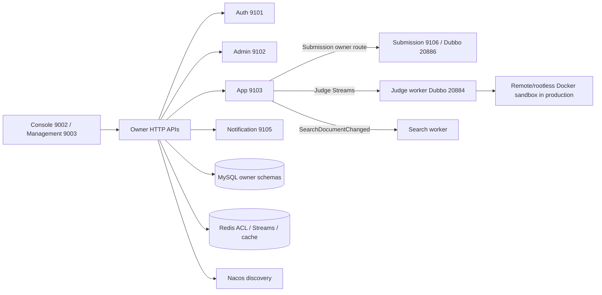

# 架构与系统边界

当前实现以源码、Maven POM、`application.yml`、Compose 和启动脚本为准；本页只提供稳定地图。
## 当前结论

UltiCode 已形成五个 Data Owner 与两个不持有业务表的 Worker：

本页只提供当前拓扑摘要；职责与禁止事项见本页“模块与数据所有权”章节。历史材料不作为当前运行依据；需要核实的事实回到源码、配置、测试和可执行门禁。

| 类型 | 服务 | 责任 |
| --- | --- | --- |
| Owner | `backend-auth` | 账号、凭证、会话、授权事实 |
| Owner | `backend-admin` | 管理 BFF、治理、审计、设置、监控、备份 |
| Owner | `backend-app` | 题目、竞赛、题解、论坛、用户画像、互动和 WebSocket |
| Owner | `backend-submission` | Submission、判题/结果/创建 outbox、generation/lease fence |
| Owner | `backend-notification` | 通知 Inbox、投递 ledger、邮件和重试 |
| Worker | `backend-judge` | 消费 Judge Streams，执行沙箱，回写 Submission verdict |
| Worker | `backend-search` | 消费 `SearchDocumentChanged`，维护 MeiliSearch 派生索引 |
| Profile | `backend-core` | opt-in parent process; assembles Owner child contexts and does not own business tables |
| Standalone | `services/agent` | opt-in Python Agent runtime; U01 read-only loop plus deterministic agent-authored synthetic retrieval/sourced analysis and a 20/10 keyword evaluation baseline; authorized-corpus evaluation, Embedding/Qdrant comparison, real-model sourced-analysis evidence, and isolation gates remain incomplete |

`services/agent` is an independent Python service module, not a Maven reactor module or an Owner/Worker. It calls existing Auth/App HTTP contracts, keeps identity server-side, and must project tool results before they reach a model. Its current retrieval slice is limited to checked-in agent-authored synthetic Markdown; it does not ingest public user solutions. It is not started by the default `dev-lite`/`dev-full` scopes until its runtime, readiness, and secret wiring are explicitly added.

`judge-runtime` 是共享执行依赖，不是进程。Contract modules 在 `services/api/`；共享平台能力在 `services/platform/`。跨 Owner 通过 provider-owned contract 或 consumer-owned port 协作，不共享 Entity、Mapper 或业务 Service。
`services/agent` 的依赖规则是 `Agent -> existing Auth/App HTTP contracts`；它不得连接业务数据库、读取 Owner Entity/Mapper、共享 Java 业务实现或绕过服务端身份/授权。当前仓库只包含 agent-authored synthetic fixtures；未来真实 corpus 必须来自自有或明确授权资料，公开题解不自动获得 corpus/模型外发许可。
当前 synthetic source text 只能作为 untrusted data，不是可执行指令；将检索样本文本发送给真实模型前，必须由系统提示和消息封装共同执行该边界。DAV-45 当前尚缺 sourced-analysis 的真实模型评估；完整 U02 的 DAV-22 评估/题集/Embedding-Qdrant 对照和 DAV-53 双账号隔离证据仍未完成。
The checked-in corpus is agent-authored synthetic test material, not a real user submission, an UltiCode DTO, or licensed user material. The live e2e input is the authenticated user's validated read-only submission projection; the sample e2e is not evidence of a real-user sourced-analysis path.
The opt-in sample e2e entry is `services/agent/e2e_sourced_analysis.py`; it performs no real-model call and only uses the checked-in synthetic corpus.


授权写入的外部 `Seam` 是 Auth-owned `AuthorizationMutationService`：
Admin 只提交单条 direct delta，角色编辑使用独立的 `RoleMutationService`。
`AuthorizationSnapshotService` 仅服务读取，返回的 `PermissionEntry` 保留
role/direct provenance 与 expiry。App `/run` 使用 App-private
`InteractiveCodeRunner`，由 Adapter 映射到 Judge-owned `JudgeRunService`；
同步 `execute` 保持现行 preview 路径，Judge provider 将 runtime validation
failure 映射为 typed 400。异步 `submit/poll/cancel` 位于同一 Judge contract
之后，runtime 以 `AsyncSandboxExecutor` 承载默认 Docker 与可选 Judge0 Adapter；
Judge0 默认关闭且没有外部实例验证；async receipt 当前仅进程内有界，跨副本/
重启 durable 幂等仍未完成。

默认七进程 topology 仍保持为 distributed profile 与回滚路径；另有 opt-in
`core` profile（Core 9108 + 独立 Judge）用于同进程 owner assembly 验证。
Core 已通过显式扫描、多数据源/事务、readiness 和 judge-runtime classpath
静态段测试；但 enabled Owner child assembly 的 exec-jar smoke 当前因同一
classpath 的跨 Owner package leakage 在 bean wiring 阶段失败。完整 local
Adapter parity、同进程业务路由、远端 Judge TLS 和生产性能/HA 仍未证明，
不得切换默认或推断生产可用性。

Core 的 enabled Owner child 启动使用单一尝试协议：每个模块的内部对象
`CoreOwnerContextManager.OwnerStartup` 从线程提交前就注册并持有资源身份，
一次尝试承载自己的启动 slot、超时判定、取消信号（`requestStop`）、有界
drain 预算与幂等 close；boot future 只传达完成或失败，不转移所有权。
manager 只负责全局准入、启动顺序、READY 发布（发布锁内二次检查 stopping）
以及批量停止的两遍流程——先向全部活动尝试发出取消信号，再逐个 close。
取消、drain 与 context/classloader 关闭一律在 attempt 与 manager 的锁外
执行：已认领关闭后迟到的资源在安装点认领、在锁外释放，READY 发布读取
context 也在取得全局锁之前完成。等待与 drain 有界不代表任意 Spring
context.close 或第三方 boot 可被强制终止：超过 drain 预算未终止的 daemon
线程会被记录并禁止成功发布；清理失败作为 suppressed 附加在超时、中断或
boot 主因之后，且仍继续清理其余对象。

## 运行拓扑



- 外部 HTTP/WS 入口由前端 Nginx/Compose gateway 处理；内部 Dubbo 端口不对公网发布。
- `scripts/dev/up.sh --mode dev-lite` 是默认开发入口；`dev-full` 显式启动 Search。当前 binary/DevStack 拒绝已退役的 local compatibility mode；生产回滚只能使用部署方保留的上一份完整 release descriptor。
- **Admin 查询已收敛为粗粒度 query slices**，不再以拆分更多进程为理由；用户趋势使用一次 bounded Auth aggregate，Enricher 使用 bounded parallel owner reads。
- **Judge normal dev-lite/dev-full 使用 provider-owned JudgeQueue Streams**；App 不再扫描 Judge runtime 或运行旧 RQueue poller。
- Submission normal reads 通过 bounded owner-facts contract；App 不再保留本地 Submission read projection、mapper 或 entity。

## 关键边界

1. **Owner-first**：按数据聚合 Owner 划分服务，不按管理页面划分。Admin 可以编排命令，但 Problem、Contest、Submission、Forum、Solution 等数据仍由 App 或 Submission Owner 持有。
2. **单写者**：Submission 和 Notification 的持久化 writer 分别只在对应 Owner；App 只保留 Submission remote adapter、Notification intent 发布和 WebSocket relay。
3. **单跳同步调用**：Admin 可调用 Auth/App/Notification 的一个 Provider；Provider 不为同一命令同步调用第三个 Provider。跨边界副作用使用 Outbox/Inbox/Streams。
4. **本地事务**：强一致 invariant 留在一个 Owner 的 MySQL 事务内；Redis、SMTP、WebSocket、对象存储、搜索和审计使用 outbox、inbox、lease、fence 或补偿。
5. **安全边界**：共享 `platform/web-security` 负责 JWT/JWKS、Cookie CSRF、委托断言和 replay guard；`platform/observability` 在 OTLP authorization 配置时 fail closed，拒绝非 HTTPS endpoint；各 Owner 只保留路由与策略包装。访问令牌只来自 HttpOnly cookie；WebSocket 只接受 `access_token` cookie。

### 查找入口

- 服务职责：[`模块与数据所有权`](#模块与数据所有权)
- 请求、事件和事务：[`数据流、契约与事务`](#数据流契约与事务)
- 认证和信任边界：[`安全架构与信任边界`](#安全架构与信任边界)
- 当前问题与外部触发条件：[`services/docs/SERVICES_ISSUES.md`](../services/docs/SERVICES_ISSUES.md)。
- `docs/` 只保留当前核心主题；精确事实和验证证据回到代码、配置、测试与可执行门禁。
## 模块与数据所有权

### Owner / Worker 划分

| 模块 | 类型 | 主要职责 | 不负责 |
| --- | --- | --- | --- |
| `services/auth` | Data Owner | 登录、注册、OAuth、凭证、refresh、账号状态、RBAC、JWKS | 用户画像、题目、竞赛、通知偏好 |
| `services/admin` | Data Owner | Management BFF、审核、审计、设置、监控、备份和管理读模型 | 业务数据的跨 Owner 持久化 |
| `services/app` | Data Owner | 用户画像、Problem、Contest、Solution、Forum、互动、成就、订阅、WebSocket | Submission 持久化、Notification 投递、Judge 执行、Search 索引写入 |
| `services/submission` | Data Owner | Submission intake、verdict、generation/lease fence、judge/result/created outbox | Problem/TestCase/Contest 业务表 |
| `services/notification` | Data Owner | Notification、偏好、投递 ledger、邮件、Inbox 和重试 | WebSocket endpoint 与 App 业务表 |
| `services/judge` | Worker | 消费 Judge Stream、读取 Problem facts、执行 Docker 沙箱、回写 verdict | 业务表与业务 HTTP |
| `services/search` | Worker | 消费 `SearchDocumentChanged`、维护 MeiliSearch 派生索引 | 业务表与业务 HTTP |

`services/judge-runtime` 是共享 Judge 执行依赖，不是进程；`services/platform/*` 是共享平台层；`services/api/*` 只包含 implementation-free contract。`app-api` 只保留跨 Owner contract；App-only Seam 位于 `app-web` 对应逻辑 Module。

`services/platform/observability` 是所有 Owner/Worker 共用的 OTLP
credential-to-endpoint security guard：配置 authorization 时只允许 HTTPS。

### 服务边界

#### Auth

Auth 独占 account、credential、external identity、refresh session、role/permission 和 authorization version。`users` 的 account/authz 字段归 Auth；profile 字段归 App 的 `user_profiles`。其他 Owner 通过窄的 Identity/Account contract 获取必要事实，不直接读取 Auth Mapper 或 Entity。

#### Admin

Admin 持有 moderation case/decision、audit、system settings、backup job 和自身 read model。`BackupObjectLifecycle` 统一 Admin backup 的异步执行、状态迁移、对象删除墓碑与有界清理；管理页面不是数据所有权依据：创建题目、竞赛、Submission 管理命令仍调用 App/Submission Owner；审计 actor 来自认证或委托 principal，不来自请求 DTO。
Management 前端的分页集合请求由各 store 的 `createCollectionSlice` 唯一持有 request lifecycle：创建、终止当前请求，维护 sequence/latest-result、loading/error 和 metadata；`useRemoteTable` 只负责 query、debounce、pagination、route 与 initial-skeleton presentation，不创建第二套请求控制器。
Moderation 的 `moderationStore` 是 decision seam，拥有 claim、single/batch/appeal mutation 及 server-result reconciliation 和 best-effort stats refresh；`moderationPresentation` 只拥有 action catalog、label/icon/color、route 和纯 UI predicate，不调用 HTTP 或修改 store。

#### App

App 持有普通用户 profile、Problem/Contest/Forum/Solution/Engagement/Achievement/Subscription 和 WebSocket。Profile RPC adapter 只负责 trusted actor、command receipt、command/result/error 映射与 cache eviction；共享 `ProfileMutationModule` 负责 profile 行锁、patch/avatar replacement、cleanup intent、Search publication、结果 snapshot 和 App 事务。本地 HTTP adapter 也调用该 module；对象存储 PUT 位于数据库事务之外。它发布 `NotificationIntentCreated`、`SearchDocumentChanged` 等事件；Submission 通过 owner contract，Notification 只接收 intent 并负责投递。

#### Submission

Submission 是唯一 mutation/fence owner。App 请求边界组装不可变 `SubmissionFactsSnapshot` 并调用远程 `SubmissionIntakePort`；Judge 通过 `SubmissionFencePort` / `SubmissionVerdictWritePort` 回写。Admin rejudge 只发送带 actor、trace、idempotency 的 command。App 不保留本地 writer、rejudge provider、verdict/fence、read projection、mapper 或 entity；当前 binary/DevStack 拒绝旧 local compatibility mode，生产回滚只能指向部署方保留的上一份完整 release descriptor。

#### Notification

Notification 是 notifications、preferences、delivery ledger 和 email 的唯一持久化 owner。App 保留 intent 发布与 WebSocket relay，不保留 Notification SQL。Admin 通过 `NotificationReconciliationReadPort` 消费 500 行上限的 owner facts。

#### Judge / Search

Judge 通过 Redis Streams 异步接收 Submission outbox，使用 Problem facts 和沙箱控制执行，失败留在 PEL 或进入 DLQ。Search 只消费 allowlisted、版本化事件并更新 MeiliSearch；删除是 tombstone，业务写路径不得直写索引。

### 依赖规则

```text
platform/common <- api/* <- Owner/Worker provider 或 adapter
platform/redis <- Owner/Worker Redis value serializer
backend-admin -> auth-api + app-api + submission-api + notification-api
backend-app -> auth-api + submission-api + notification-api + judge-api
backend-notification -> auth-api + app-api + notification-api
backend-judge -> judge-api + judge-runtime + app-api + submission-api
backend-search -> platform/common + search event contract
backend-auth -X-> app/admin API
```

- 每个请求最多经过一个业务 Provider 单跳；Provider 不形成 A→B→A 链。
- Consumer 依赖 consumer-owned port；Provider 暴露 provider-owned contract。
- 允许共享：DTO、Result/RpcResult、error code 基础类型、trace/deadline/idempotency metadata、无业务语义工具、contract fixture 和 Redis value serialization policy。
- 禁止共享：Entity、Mapper、Repository、业务 Service/Projection 实现、数据库连接 starter、私钥和隐式全局 Redis 配置。

### 代码分层

每个 Owner 内继续使用 `controller → service/projection/port → mapper → entity`。跨 Owner 的 adapter 位于消费方，负责 transport、超时、错误映射和契约版本；不把远程 DTO 映射成另一 Owner 的持久化 Entity。具体 contract、版本和错误 envelope 见本页“数据流、契约与事务”章节。
## 数据流、契约与事务

### 请求链样本

| 场景 | 当前链路 | 一致性边界 |
| --- | --- | --- |
| 登录/刷新 | Auth Controller → workflow → Auth account/session store → cookies | Auth 本地事务；refresh hash-only CAS |
| 管理员创建题目 | Admin Controller → App Problem provider → Problem service → local mapper/entity | App Problem Owner 本地事务 |
| Profile 更新/头像 | Profile RPC adapter → `CommandReceiptExecutor` → `ProfileMutationModule`；HTTP adapter → `ProfileMutationModule` | App 事务；receipt、profile、cleanup intent 与 Search publication 同成同败；object storage PUT 在 DB 事务外 |
| 普通提交 | App request boundary → immutable facts snapshot → Submission intake → submission/judge outbox | Submission Owner 本地事务；事件异步 |
| 比赛提交 | Contest eligibility → Submission `submitContest` → created/judge outbox → Contest inbox | 资格同步校验；关联最终一致 |
| 判题结果 | Judge Stream → sandbox → Submission verdict/fence → result outbox | generation/attempt CAS；下游 Inbox |
| 通知投递 | App intent outbox → Notification Inbox → delivery ledger → SMTP/Redis relay | intent 本地事务；投递可重试 |
| 权限写入 | Admin account/version query → Auth `AuthorizationMutationService` delta | Auth 本地事务；direct row + CAS + audit/outbox + receipt |
| 管理备份创建/删除 | Admin `BackupServiceImpl` → `BackupObjectLifecycle.start/delete` → `adminBackupExecutor` / object storage；tombstone → `adminBackupScheduler` sweep | Admin delete 的 row 与 tombstone 同一事务；对象删除 after-commit，失败对象按 settle window 有界重试 |
| 公开代码运行 | App `InteractiveCodeRunner` → Judge `JudgeRunService` → Judge runtime `SandboxExecutor`；异步 preview 另走 `submit/poll/cancel` → `AsyncSandboxExecutor` | Judge 独立进程；只运行显式 public cases，缺 provider 映射 503；Judge0 默认关闭且外部证据未验证 |
| 搜索 | Owner event → Search worker → version ledger → MeiliSearch | 派生索引；旧事件按版本丢弃 |

### Contract 与 Dubbo

`services/api/` 当前包含 `auth-api`、`app-api`、`submission-api`、`notification-api` 和 `judge-api` 五个 provider-owned 模块。Contract 只能包含接口、DTO、错误码、事件和无状态元数据，不得依赖 Entity、Mapper 或实现模块。Submission mutation 已拆成 `SubmissionIntakePort`、`SubmissionVerdictWritePort`；权限 mutation 使用 Auth-owned 单条 delta；Judge preview 使用 `JudgeRunService`，其 App HTTP DTO 只在 App Adapter 侧映射。Contract artifacts 使用 reactor revision `2.0.0`；wire-incompatible 的 Submission read 方法使用 `1.1.0`，同主版本变更由 japicmp 门禁保护。

- 写调用自动 retry 为 0；query/execution 使用 `RpcPolicy` 的有界 timeout 与重试预算。
- Provider 验证签名、audience、deadline、jti/replay 和 actor；Dubbo attachment 不是信任边界。
- Provider 不同步调用第三个 Provider 完成同一命令；组合读优先使用本地 projection，临时实时读只做有界并行批量调用。
- 保持 `Result<T>` / `RpcResult` envelope 和既有字段映射；业务错误与 transport 错误分开映射。

### 命令回执

App 的 Profile RPC、Submission 和 Notification 的 claim 型写命令统一通过
`platform/common` 的 `ReceiptExecutor`：owner adapter 在 mutation 前以
`(service, operation, idempotency_key)` 抢占 `PROCESSING` 回执，成功后条件更新为
`SUCCESS` 并保存 owner 编码的结果载荷；相同 fingerprint 的重试只重放载荷，
处理中重复和 fingerprint 冲突分别返回 owner 既有错误码，mutation 失败删除
claim。Auth 明确保留 `MUTATE_THEN_RECORD` 模式，以兼容既有回执和 legacy
fingerprint；其成功 mutation 的结果载荷随 `SUCCESS` 回执写入。事务边界仍由
各 owner adapter/provider 持有，common core 不依赖 Spring、MyBatis 或 JSON
实现。owner 侧构造由 `platform/receipt`（`backend-receipt`）统一承载：Jackson
payload codec、`ReceiptExecutorFactory.claim` 的 claim profile（共享指纹、metadata
与委托校验），以及 `CommandReceiptStoreBridge`/`ClaimCommandReceiptStoreBridge`
参数化 store 桥；owner 仍持有自己的表、entity 转换与错误命名空间，
`backend-common` 保持 dependency-free。

Profile 的 `ProfileWriteProvider` 只保留 trusted actor 校验、receipt 调用、
command/result/error 映射与 RPC cache eviction；新 receipt 使用 generic fingerprint，
仅在 App receipt adapter 内兼容既有 Profile update/avatar legacy fingerprint。共享
`ProfileMutationModule` 负责 `user_profiles` 行锁、普通 patch、avatar replacement、
cleanup intent、Search publication 和结果 snapshot；receipt claim/finalize、profile
row、cleanup intent 与 Search publication 同成同败。


### 事件可靠性

跨进程副作用使用本地事务内 Outbox、Redis Streams、Consumer Inbox、delivery ledger、lease 和 fence：

- Submission：`judge_outbox`、`submission_result_outbox`、`submission_created_outbox`，generation/attempt fence；judge payload 由 owner-private `JudgeOutboxPayload` 统一编解码（持久 keys/顺序为兼容契约）。
- Notification：Inbox、delivery ledger、stale lease reclaim、有限重试和幂等投递。
- Search：版本账本 `search:doc-version:{index}`，DELETE 使用 `D:T` tombstone，旧版本只 ACK 不覆盖新版本。
- Judge：Streams PEL、`0-0` group replay、bounded reclaim、DLQ、ACK-after-write。
- Audit：Auth/App 在本地业务事务写 audit outbox，Admin 通过 `Admin-Audit` inbox 按 event id 幂等落库。

事件必须带 `eventId`、`aggregateId`、`aggregateVersion`、`causationId`、`traceId`、`schemaVersion`；不支持的版本、恶意字段或非法版本在业务效果前 fail closed。ACK 只发生在持久化或明确 poison staging 成功后。


跨 Owner 不使用 SQL join、共享 Mapper 或跨 schema 写 grant。`users` 的 profile 垂直拆分遵循 expand → backfill → verify → cutover → contract；已应用 migration 不编辑。

#### 完整 Data/Table matrix

缩写：**I**=Owner 内部直接 DB；**Q**=粗粒度 Query/批量 RPC 或本地物化投影；**C**=幂等 Command RPC；**E**=outbox/event；**R**=核验后退役。任何 Q/C 都不得返回 Entity、Mapper 或内部 Domain Model。

| Data/Table | Current Owner / 当前调用方 | Target Owner | Consumer | Access Method |
|---|---|---|---|---|
| `DailyRecommendation` | 仅 migration，生产 Java 未见映射 | App（R 候选） | App | 核数据后 R，否则 I |
| `achievements` | achievement；submission/solution/follow 触发或读取 | App | App 内部 | I/E |
| `appeals` | moderation R/W | Admin | App 用户入口 | Gateway 直达 Admin HTTP；I |
| `audit_logs` | Admin mapper；各 Owner audit event sink | Admin | 各服务、Admin 查询 | 生产者 E，Admin I/Q |
| `audit_outbox` | Auth/App/Admin 请求事务内的 owner-local audit outbox | Auth/App/Admin（各自 schema） | Admin | 各 Owner I；Admin 通过事件 inbox 消费 |
| `collection_items` | bookmark R/W；edgeoperations 读 | App | App | I |
| `collections` | bookmark folder/service | App | App | I |
| `consumer_inbox` | 集成事件暂存；Admin-Audit 与 Notification 各自持有本地 inbox | Admin/Notification（各自 schema） | Admin、Notification、App（过渡） | 各 Owner I；按 group 消费 |
| `contest_analytics` | 仅 migration，当前实时 projection 计算 | App（R 候选） | Admin analytics | R 或 App I + Admin Q/E |
| `contest_announcements` | contest 读；admin 直接写 | App | Admin、WebSocket | Admin C/Q；App I/E |
| `contest_participants` | contest R/W；admin analytics 读 | App | Admin | App I；Admin Q/投影 |
| `contest_problem_results` | contest adjudication/lifecycle | App | App | I |
| `contest_problems` | contest R/W；admin 直接写 | App | Admin | App I；Admin C/Q |
| `contest_rankings` | 仅 migration；当前排名由 participant/cache 计算 | App（R 候选） | App/Admin | R 或明确为 App projection |
| `contest_scoring_rules` | contest ScoringRuleService | App | Admin | App I；Admin C/Q |
| `contest_submissions` | contest/submission association | App | App | I；由 SubmissionCreated event/inbox 幂等写 |
| `contests` | contest 与 admin 多方写/读 | App | Admin | App I；Admin C/Q/E |
| `edge_operations` | vote/edgeoperations；多内容域使用 | App/Engagement | App 内容模块、Admin | I；统一 Engagement port |
| `first_solve_records` | contest adjudication | App | App | I |
| `forum_comments` | forum；admin/moderation 直接写 | App | Admin | App I；Admin C/Q |
| `forum_communities` | forum；admin 读 | App | Admin | I/Q |
| `forum_community_links` | 仅 migration | App（R 候选） | App | 核数据后 R/I |
| `forum_community_members` | forum membership | App | App | I |
| `forum_community_permissions` | 仅 migration；不是 Auth RBAC | App（R 候选） | App | 核数据后 R/I |
| `forum_community_rules` | 仅 migration | App（R 候选） | App | 核数据后 R/I |
| `forum_community_tags` | 仅 migration | App（R 候选） | App | 核数据后 R/I |
| `forum_post_tag_relations` | 仅 migration，当前 mapper 未见关系 SQL | App（R 候选） | App | 核数据后 R/I |
| `forum_posts` | forum；admin/moderation 直接写，search 读 | App | Admin/Search | App I；Admin C/Q；Search E |
| `forum_tags` | forum；admin tag 管理 | App | Admin | App I；Admin C/Q |
| `forum_users` | forum 的身份投影 | App | Forum | Auth Account event → App I |
| `global_rankings` | contest rating/ranking facts；display name/avatar read from App `user_profiles` | App | Admin/App | I；身份显示只走 App profile projection |
| `judge_outbox` | Submission 写，queue dispatcher/reaper 更新 | Submission | Submission/Judge worker | 与 submission 同 Owner DB I；不跨服务 SQL |
| `moderation_actions` | moderation | Admin | Admin | I |
| `moderation_queue` | moderation，引用多种 App 内容 | Admin | App 内容 Owner | Admin I；App C/Q/E |
| `notification_command_receipt` | Notification 命令回执（幂等重放） | Notification | Notification | I |
| `notification_delivery_ledger` | notification dispatcher/reaper | Notification | Admin 运维读 | Notification I；Admin Q |
| `notification_preferences` | notification | Notification | Notification | I |
| `notifications` | notification | Notification | Admin、WebSocket | Notification I；Admin Q/E |
| `oauth_provider_identities` | Auth OAuth workflow/mapper；provider + provider_user_id 的账号绑定 | Auth | Auth | I；唯一约束保证同一 provider identity 只绑定一个账号 |
| `password_resets` | 仅 migration；实际 hash 存 `users.password_reset_*` | Auth（R 候选） | Auth | 核数据后 R；保留 hash-only 流程 |
| `problem_details` | problem；admin 直接读写 | App | Admin | App I；Admin C/Q |
| `problem_examples` | problem/admin；judge fallback 读 | App | Judge worker、Admin | App I；versioned case snapshot/Q |
| `problem_languages` | problem/admin；submission 读 facts | App | Admin/Judge | App I；C/Q |
| `problem_list_bookmarks` | problemlist | App | App/Admin | I/Q |
| `problem_list_categories` | problemlist | App | App | I |
| `problem_list_problem_relations` | problemlist；admin 读 | App | Admin | I/Q |
| `problem_lists` | problemlist；admin 管理 | App | Admin | App I；Admin C/Q |
| `problem_notes` | problem note | App | App | I；先修 schema drift |
| `problem_tag_relations` | problem；admin/user/solution 读 | App | Admin/App modules | I/C/Q |
| `problem_tags` | problem；admin 管理 | App | Admin | App I；Admin C/Q |
| `problem_versions` | problem version/snapshot | App | Admin | App I；Admin C/Q |
| `problems` | problem；admin/mod/search/contest/submission 多方读写 | App | Admin、Contest、Submission、Search | App I；Admin C/Q；App 内 port/E |
| `refresh_tokens` | refresh token service | Auth | Auth only | I，禁止其他服务读 |
| `reports` | moderation，普通用户可创建 | Admin | App 用户/Admin | Gateway 直达 Admin HTTP；I |
| `role_permissions` | permission；admin projection 直读 | Auth | Admin、Auth | Auth I；Admin C/Q |
| `solution_comments` | solution；admin/moderation 直接写 | App | Admin | App I；Admin C/Q |
| `solution_topics` | solution reference | App | Admin/App | App I；Admin C/Q |
| `solutions` | solution；admin/mod/search/problem/interaction 使用 | App | Admin/Search | App I；Admin C/Q；Search E |
| `submission_statuses` | 仅 migration；代码用 `SubmissionStatusCatalog` | Submission API（纯 contract/catalog） | App、Submission | `SubmissionStatus` enum 在 common；catalog 由 `backend-submission-api` 唯一实现 |
| `submissions` | submission；admin/problem/contest 直读 | Submission | Admin、Contest/Problem | Submission I；Admin Q；结果 E |
| `submission_result_outbox` | submission result dispatcher/worker 写 | Submission | Submission/Judge worker | Submission I；不跨服务 SQL |
| `submission_created_outbox` | contest intake association event | Submission | App-Contest inbox | Submission I；App 仅消费事件写 `contest_submissions` |
| `subscriptions` | subscription；admin analytics | App | Admin | App I；Admin Q/C |
| `system_announcement_reads` | 仅 migration | Admin（R/启用候选） | App 用户 | 启用则 Admin I + HTTP/Q/E |
| `system_announcements` | 仅 migration | Admin（R/启用候选） | App 用户 | Admin I；App Q/E projection |
| `system_settings` | admin store | Admin | App/Auth（只需部分） | Admin I；versioned E/cache，避免热路径 RPC |
| `test_cases` | admin test-case service；judge 读 | App/Problem-Judge | Admin/Judge | App I；Admin C/Q；case snapshot |
| `translations` | i18n service，polymorphic entity reference | App/I18n | Admin | App I；Admin C/Q |
| `user_achievements` | achievement | App | App | I/E |
| `user_bans` | moderation 治理记录 | Admin | Auth/App | Admin I；Auth ban C + status E |
| `user_follows` | follow | App | App | I |
| `user_permissions` | permission；admin 管理 | Auth | Admin | Auth I；Admin C/Q |
| `user_warnings` | moderation | Admin | App 用户 | Admin I；通知 E/Q |
| `users` | Auth/User/Admin/Moderation 多方写的混合表 | 迁移态 Auth；目标 Auth account + App `user_profiles` | App/Admin | Auth I；JWT/Q/C/E；App 不再写旧行 |
| `views` | 仅 migration；与 edge operations 语义重叠 | App（R 候选） | App | 核数据后合并/R |
| `virtual_contest_sessions` | 仅 migration；活动态已在 participants | App（R 候选） | App | 核历史数据后合并/R |
| `email_templates` | email | Notification | Admin、Auth（不共享业务模板） | Notification I；Admin C/Q；Auth 自有安全模板 |
| `email_logs` | email intake | Notification | Admin | Notification I；Admin Q |
| `backups` | backup metadata/state；`BackupObjectLifecycle` 负责执行、删除、对象 tombstone 与 settle/sweep | Admin | Admin | lifecycle I；`BackupServiceImpl` 负责请求编排、下载与恢复 |
| `backup_deletion_tombstones` | 已删除或失败上传对象的持久 cleanup intent | Admin | Admin | `BackupObjectLifecycle` I；after-commit fast path + age-gated sweep |


### 事务边界

必须保持强一致且只在单一 Owner 内：refresh rotation、账号 ban/password、permission grant/revoke、Contest participant/count、Problem aggregate satellites、Submission + judge outbox、verdict fence + result outbox、moderation queue claim/decision、backup row delete + tombstone insert、vote ledger invariant。应最终一致：Judge queue、SMTP、WebSocket、cache、对象存储、backup object deletion、audit、notification、achievement、Search index、ranking projection 和跨 Owner moderation side effects。

DB 与 Redis/SMTP/WebSocket/对象存储不由 `@Transactional` 组合；使用 outbox/inbox/lease/fence/补偿。跨服务同步调用只做权威校验或一个 Owner command，不使用 Seata。

### 数据迁移与回滚

Owner migration 顺序固定为 `shared → auth → admin → app → notification → submission → post-owner controls`。`owner-migrate` 和 `owner-migration-manifest.sh` 负责 schema/location、账号、依赖、checksum、lease 和 secret-free reports。备份/恢复覆盖 `ulticode` control schema 与五个 Owner；rollback 通过上一已验证 artifact 与 `skip_migrations=true`，不做 schema downgrade。

详见本页“数据流、契约与事务”章节中的迁移说明、[`OPERATIONS.md#数据库迁移与-owner-收敛`](OPERATIONS.md#数据库迁移与-owner-收敛) 和 [`services/docs/CONTRACT_COMPAT_GATE.md`](../services/docs/CONTRACT_COMPAT_GATE.md)。

## 安全架构与信任边界

### HTTP 认证与授权

- `platform/web-security` 统一 JWT/JWKS、Cookie CSRF、委托断言、公钥加载和 replay guard；Auth、Admin、App、Notification 只保留 owner 路由策略。
- 未匹配 HTTP 路径默认拒绝。Admin 的 `/admin/**` 与 privileged methods 同时要求 `ADMIN` 或 `SUPER_ADMIN`；Moderation 的角色门禁单独声明。
- Gateway 负责路由、TLS、header 清理和基础限流，不是唯一安全边界。各 Owner 本地验证 JWT 并重建 principal。
- refresh 只接受 refresh HttpOnly cookie；access token 不能作为 refresh credential。refresh token 只存数据库 hash，并通过条件 revoke/rotate。

### Cookie 与 CSRF

Access/refresh token 保持 HttpOnly；Cookie 的 Secure、SameSite、Path、Domain 和 lifetime 在签发与删除时一致。`Secure=false` 只能由完全 local 的 `dev`、`test`、`ci` profile 显式启用，生产启动 fail closed。

所有 Cookie-authenticated unsafe methods（包括 refresh/logout）经过无服务端状态的 double-submit CSRF：header 与 `csrf_token` cookie 使用恒定时间比较。Bearer-only service-to-service 请求与 safe methods 不进入浏览器 CSRF filter。

### JWT、JWKS 与委托身份

生产 access token 使用 Auth 签发的 RS256/JWKS；资源服务只持 X509 公钥，不共享 Auth 私钥或签名 secret。接收方校验 `iss`、`aud`、`typ`、`kid`、`iat`、`nbf`、`exp`、签名和 authority。短期 access token 本地验证，Auth 不可用时普通请求仍可用未过期、未撤销的 token；登录、refresh、fresh authorization 和缺少可信状态的 WebSocket CONNECT fail closed。

Admin→Owner 的高风险 command 使用独立 RS256 delegation assertion，绑定 issuer、target audience、actor、subject、`kid`、`jti`、deadline，并以 Redis 一次性 claim 防 replay。Dubbo transport identity 与 end-user delegation 分开：生产 Triple 使用每服务 mTLS certificate，Provider 根据 TLS peer SAN 和 caller matrix 授权；attachment、`remote.application` 和请求 DTO 都不是身份来源。

### WebSocket

WebSocket 只从 handshake 的 `access_token` cookie 获取 token，不接受 query、URL 或客户端 STOMP token。CONNECT 使用统一 JWT validator，并检查 active/ban；SEND/SUBSCRIBE 在 principal/session 缺失时 fail closed。Notification 通过 Redis Pub/Sub 发布允许的 payload，App 保留 STOMP/SockJS relay。

### 访问令牌吊销边界

当前不提供即时 access-token blacklist writer。access token TTL 为 15 分钟，故既有有效 token 的最大残余窗口为 15 分钟。刷新 token revoke、HTTP ban check、WebSocket 实时 account-state 检查和 `authz_version` 事件共同限定窗口；`TokenBlacklistPort` 保持只读，不能在 App、Admin 或共享工具新增第二个 writer。

若产品未来需要“立即踢出全部会话”，先由 Auth 定义 writer-owned revoke contract、事件 identity、delivery/retry、旧 token 校验、回滚和 request-time 成本，再实施。

### Redis、部署与敏感信息

Redis ACL deny-by-default，按 Owner 限制命令、key 和 channel；运行时 ACL 在 ignored directory 原子物化，轮换使用 overlap/finalize/rollback。命令白名单授予 `+scan` 而不授予 `+keys`，因此 Spring Cache 的 Redis writer 必须使用 SCAN 批量策略（共享 `RedisCacheWritePolicy`）；默认的 `KEYS` writer 会让 `@CacheEvict(allEntries = true)` 与 `Cache#clear()` 以 `NOPERM` 失败。生产 Compose 不挂载 Docker socket；Judge 使用部署拥有的 remote/rootless Docker TLS endpoint、只读证书和共享 workspace。真实证书、私钥、密码、token、生产 endpoint 和 secret-store 状态不得提交或写入文档。

### 证据入口

- [Security invariants](../AGENTS.md#security-invariants)
- [Services issue registry](../services/docs/SERVICES_ISSUES.md)
- [Dubbo mTLS 与依赖策略](../services/docs/DEPENDENCY_RESILIENCE_RUNBOOK.md)
