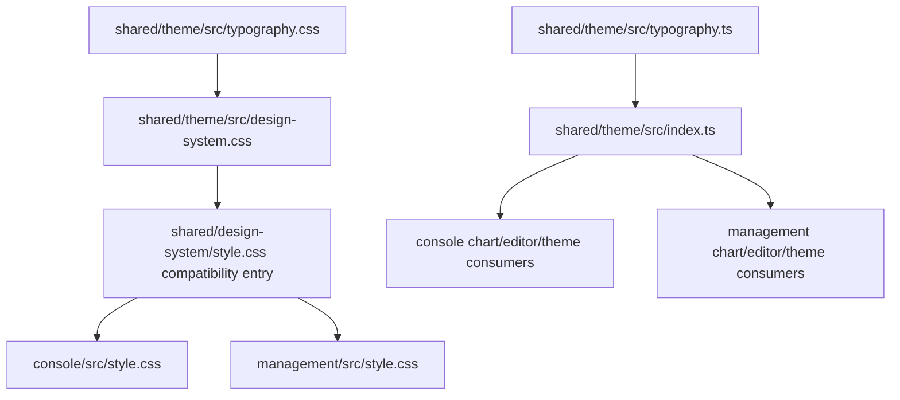

# Shared Typography Design

Last updated: 2026-06-19

## 1. Purpose

This document designs a shared typography system for UltiCode's two Vue
frontends:

- `console/`: learner-facing coding, contest, forum, and personal workspace.
- `management/`: administrator-facing operations, moderation, analytics, and
  data-management workspace.

The goal is to move font families, font sizes, line heights, letter spacing,
and semantic typography roles into `shared/`, so both applications consume the
same source of truth while still allowing each app to choose an appropriate
density profile.

The design is intentionally implementation-ready. It describes the target file
layout, CSS variable contract, TypeScript token contract, migration sequence,
testing strategy, and acceptance criteria.

## 2. Current State

### 2.1 Existing Shared Surface

Both applications already import the shared design system:

```css
/* console/src/style.css */
@import "../../shared/design-system/style.css";

/* management/src/style.css */
@import "../../shared/design-system/style.css";
```

`shared/theme/` is already the source of truth for runtime color-theme behavior:

- `shared/theme/src/applyThemeToDOM.ts`
- `shared/theme/src/useTheme.ts`
- `shared/theme/src/index.ts`

`console/src/composables/useTheme.ts` and
`management/src/composables/useTheme.ts` re-export the shared theme module from
`@/shared/theme/src`, which confirms the current shared-code access pattern.

`docs/CODEMAPS/frontend.md` marks `shared/design-system/` as a legacy CSS-only
surface and says it is being consolidated under `shared/theme`.

### 2.2 Existing Typography Tokens

`shared/design-system/style.css` already defines these global variables:

```css
--font-sans: "JetBrains Mono", "Fira Code", "SF Mono", Menlo, Monaco, Consolas, monospace;
--font-mono: "JetBrains Mono", "Fira Code", "SF Mono", Menlo, Monaco, Consolas, monospace;
--text-xs: 0.75rem;
--text-sm: 0.875rem;
--text-base: 1rem;
--text-lg: 1.25rem;
--text-xl: 1.5rem;
--text-2xl: 1.875rem;
--leading-normal: 1.6;
--leading-code: 1.4;
--tracking-tight: -0.02em;
```

It also contains hardcoded typography in utility classes such as:

- `.font-data`
- `.terminal-label`
- `.terminal-comment`
- `.terminal-badge`
- `.terminal-kv-key`
- `.terminal-kv-value`
- `.terminal-input`
- `.ascii-progress`
- `.terminal-row-num`
- `.header-btn`

`management/src/style.css` also defines a local `.prose` block with its own
heading, code, list, table, and blockquote typography rules, overlapping with
the shared `.markdown-block` rules.

### 2.3 Main Problems

1. Typography values are shared by import, but not governed by a clear token
   contract.
2. Raw pixel/rem values are repeated inside shared utilities and app components.
3. Semantic roles are missing. Developers choose `text-sm`, `text-[10px]`,
   `font-data`, or local CSS case by case.
4. Console and management have different density needs, but there is no
   explicit density profile.
5. `shared/design-system/style.css` owns too much long-term design-system
   responsibility even though project docs already identify it as legacy.
6. Letter spacing currently includes a negative heading token. The target system
   should avoid negative letter spacing and keep CJK text safe by default.

## 3. Design Principles

1. Single source of truth lives in `shared/theme`.
2. CSS variables are the primary runtime interface.
3. TypeScript tokens exist only for non-CSS consumers such as ECharts, Monaco,
   test assertions, and future documentation tooling.
4. App code should prefer semantic roles over raw sizes.
5. Console and management share tokens but can select different density
   profiles.
6. Typography must not scale with viewport width. Responsive behavior should be
   handled by layout, wrapping, and density profiles.
7. Default letter spacing is `0`. Extra spacing is allowed only for short,
   uppercase terminal labels where the text is not normal prose.
8. Raw `font-size`, `font-family`, and arbitrary `text-[...]` values should be
   restricted to shared token files and rare one-off layout fixes.
9. Markdown, KaTeX, code, and table typography must remain readable under both
   light and dark Solarized themes.

## 4. Target Architecture



### 4.1 Ownership

`shared/theme` becomes the canonical package for all theme-adjacent concerns:

- color mode runtime
- CSS design tokens
- typography tokens
- density profiles
- app-neutral design-system primitives

`shared/design-system/style.css` remains as a compatibility entry during
migration, but it should eventually become a thin import wrapper:

```css
@import "../theme/src/design-system.css";
```

### 4.2 Proposed Files

```text
shared/theme/
  src/
    typography.css          # CSS variables + semantic typography classes
    typography.ts           # typed token metadata for TS consumers
    design-system.css       # imports typography + color/surface/component layers
    index.ts                # exports TS token metadata
  __tests__/
    typography.spec.ts      # token shape, names, density profile invariants

shared/design-system/
  style.css                 # compatibility wrapper during migration

console/src/style.css       # continues importing shared design entry
management/src/style.css    # continues importing shared design entry
```

Optional later package exports:

```json
{
  "exports": {
    ".": {
      "import": "./src/index.ts",
      "types": "./src/index.ts"
    },
    "./typography.css": "./src/typography.css",
    "./design-system.css": "./src/design-system.css"
  }
}
```

The current repository imports shared files through `src/shared -> ../../shared`
symlinks and relative CSS imports, so package exports are not required for the
first migration phase.

## 5. Token Model

The typography system has three layers:

1. Foundation tokens: raw families, sizes, line heights, weights, and numeric
   features.
2. Semantic tokens: app-neutral roles such as page title, table cell, control,
   code, and markdown body.
3. Utility classes: stable classes for repeated patterns where Tailwind utility
   strings are too noisy or too easy to drift.

### 5.1 Font Family Tokens

```css
:root {
  --uc-font-ui: "JetBrains Mono", "Fira Code", "SF Mono", Menlo, Monaco, Consolas,
    "PingFang SC", "Microsoft YaHei", "Noto Sans CJK SC", monospace;
  --uc-font-code: "JetBrains Mono", "Fira Code", "SF Mono", Menlo, Monaco, Consolas,
    "Liberation Mono", "Courier New", monospace;
  --uc-font-data: "JetBrains Mono", "SF Mono", Menlo, Monaco, Consolas, monospace;
  --uc-font-prose: var(--uc-font-ui);
}
```

Rationale:

- The existing visual language is terminal/Solarized, so monospace remains the
  default UI identity.
- CJK fallbacks are included in the UI stack to avoid poor glyph fallback for
  Chinese labels and mixed Chinese-English UI.
- Code and data stacks stay tighter and more predictable than prose.

### 5.2 Size Tokens

The raw scale should preserve current sizing while adding the missing `10px`,
`11px`, and `18px` steps that already appear as hardcoded values.

| Token | Value | Use |
| --- | ---: | --- |
| `--uc-text-2xs` | `0.625rem` / 10px | dense terminal labels, table metadata only |
| `--uc-text-xxs` | `0.6875rem` / 11px | badges, header buttons, row numbers |
| `--uc-text-xs` | `0.75rem` / 12px | captions, helper text, compact table cells |
| `--uc-text-sm` | `0.875rem` / 14px | default app body and controls |
| `--uc-text-md` | `1rem` / 16px | readable content, mobile inputs, markdown body |
| `--uc-text-lg` | `1.125rem` / 18px | drawer titles, emphasized card titles |
| `--uc-text-xl` | `1.25rem` / 20px | page titles, major panel titles |
| `--uc-text-2xl` | `1.5rem` / 24px | marketing/auth titles and high-emphasis views |
| `--uc-text-3xl` | `1.875rem` / 30px | rare landing or hero-level title |

Legacy Tailwind-compatible aliases should stay during migration:

```css
@theme inline {
  --font-sans: var(--uc-font-ui);
  --font-mono: var(--uc-font-code);
  --text-xs: var(--uc-text-xs);
  --text-sm: var(--uc-text-sm);
  --text-base: var(--uc-text-md);
  --text-lg: var(--uc-text-xl);
  --text-xl: var(--uc-text-2xl);
  --text-2xl: var(--uc-text-3xl);
}
```

This keeps existing `text-sm`, `text-xl`, and `font-mono` usages working while
new semantic classes move to `--uc-*`.

### 5.3 Line Height Tokens

```css
:root {
  --uc-leading-none: 1;
  --uc-leading-tight: 1.25;
  --uc-leading-snug: 1.35;
  --uc-leading-code: 1.4;
  --uc-leading-normal: 1.6;
  --uc-leading-relaxed: 1.75;
}
```

Usage rules:

- Controls, table rows, and badges use tight or snug line height.
- App body uses normal line height.
- Markdown and long-form content can use relaxed line height.
- Code blocks use code line height.

### 5.4 Weight Tokens

```css
:root {
  --uc-font-weight-regular: 400;
  --uc-font-weight-medium: 500;
  --uc-font-weight-semibold: 600;
  --uc-font-weight-bold: 700;
}
```

Usage rules:

- Body: regular.
- Controls and labels: medium.
- Section/card title: semibold.
- Page title: bold only when the view needs strong hierarchy.

### 5.5 Letter Spacing Tokens

```css
:root {
  --uc-tracking-normal: 0;
  --uc-tracking-label: 0.05em;
  --uc-tracking-terminal: 0.1em;
  --uc-tracking-terminal-wide: 0.15em;
}
```

Rules:

- Normal prose, headings, controls, and form labels use `0`.
- Spaced tracking is allowed only for short uppercase terminal labels and
  metadata chips.
- Negative tracking should be deprecated. The existing `--tracking-tight` alias
  should map to `0` after migration.

### 5.6 Numeric Feature Tokens

```css
:root {
  --uc-font-feature-data: "tnum" on, "lnum" on;
}
```

Rules:

- Use tabular numbers for rankings, timestamps, IDs, scores, status counts, and
  admin metrics.
- Do not enable tabular numbers on normal prose by default.

## 6. Semantic Roles

Semantic roles should be exposed as CSS variables and optional utility classes.
The variables make component-local styles possible; the classes make repeated
markup consistent.

### 6.1 Core Role Variables

```css
:root {
  --uc-type-body-family: var(--uc-font-ui);
  --uc-type-body-size: var(--uc-text-sm);
  --uc-type-body-line-height: var(--uc-leading-normal);
  --uc-type-body-weight: var(--uc-font-weight-regular);

  --uc-type-page-title-size: var(--uc-text-xl);
  --uc-type-page-title-line-height: var(--uc-leading-tight);
  --uc-type-page-title-weight: var(--uc-font-weight-semibold);

  --uc-type-section-title-size: var(--uc-text-lg);
  --uc-type-section-title-line-height: var(--uc-leading-snug);
  --uc-type-section-title-weight: var(--uc-font-weight-semibold);

  --uc-type-card-title-size: var(--uc-text-sm);
  --uc-type-card-title-line-height: var(--uc-leading-snug);
  --uc-type-card-title-weight: var(--uc-font-weight-semibold);

  --uc-type-control-size: var(--uc-text-sm);
  --uc-type-control-line-height: var(--uc-leading-tight);
  --uc-type-control-weight: var(--uc-font-weight-medium);

  --uc-type-label-size: var(--uc-text-xs);
  --uc-type-label-line-height: var(--uc-leading-tight);
  --uc-type-label-weight: var(--uc-font-weight-medium);

  --uc-type-table-header-size: var(--uc-text-2xs);
  --uc-type-table-cell-size: var(--uc-text-xs);

  --uc-type-data-size: var(--uc-text-xs);
  --uc-type-code-size: 0.85em;
  --uc-type-markdown-size: var(--uc-text-md);
}
```

### 6.2 Utility Classes

```css
.uc-type-body {
  font-family: var(--uc-type-body-family);
  font-size: var(--uc-type-body-size);
  line-height: var(--uc-type-body-line-height);
  font-weight: var(--uc-type-body-weight);
  letter-spacing: var(--uc-tracking-normal);
}

.uc-type-page-title {
  font-family: var(--uc-font-ui);
  font-size: var(--uc-type-page-title-size);
  line-height: var(--uc-type-page-title-line-height);
  font-weight: var(--uc-type-page-title-weight);
  letter-spacing: var(--uc-tracking-normal);
}

.uc-type-section-title {
  font-family: var(--uc-font-ui);
  font-size: var(--uc-type-section-title-size);
  line-height: var(--uc-type-section-title-line-height);
  font-weight: var(--uc-type-section-title-weight);
  letter-spacing: var(--uc-tracking-normal);
}

.uc-type-control {
  font-family: var(--uc-font-ui);
  font-size: var(--uc-type-control-size);
  line-height: var(--uc-type-control-line-height);
  font-weight: var(--uc-type-control-weight);
  letter-spacing: var(--uc-tracking-normal);
}

.uc-type-label {
  font-family: var(--uc-font-data);
  font-size: var(--uc-type-label-size);
  line-height: var(--uc-type-label-line-height);
  font-weight: var(--uc-type-label-weight);
  letter-spacing: var(--uc-tracking-label);
}

.uc-type-data {
  font-family: var(--uc-font-data);
  font-size: var(--uc-type-data-size);
  line-height: var(--uc-leading-code);
  font-feature-settings: var(--uc-font-feature-data);
  font-variant-numeric: tabular-nums;
}

.uc-type-code {
  font-family: var(--uc-font-code);
  font-size: var(--uc-type-code-size);
  line-height: var(--uc-leading-code);
}
```

### 6.3 Existing Utility Compatibility

Existing shared utilities should be rewritten internally to use semantic tokens,
without requiring every call site to change immediately.

| Existing class | Target internal mapping |
| --- | --- |
| `.font-data` | `font-family: var(--uc-font-data)` + tabular numbers |
| `.terminal-label` | `--uc-text-2xs`, `--uc-tracking-terminal-wide` |
| `.terminal-comment` | `--uc-text-xxs`, code family, italic |
| `.terminal-badge` | `--uc-text-xxs`, `--uc-tracking-label` |
| `.terminal-kv-key` | `--uc-text-xxs`, `--uc-tracking-terminal` |
| `.terminal-kv-value` | `--uc-text-sm`, tabular numbers |
| `.terminal-input` | `--uc-type-control-*`, no hardcoded `14px` |
| `.ascii-progress` | `--uc-text-xs`, `--uc-tracking-normal` |
| `.terminal-row-num` | `--uc-text-xxs`, tabular numbers |
| `.header-btn` | `--uc-text-xxs`, `--uc-tracking-label` |

## 7. Density Profiles

Console and management share typography tokens, but their primary workflows have
different density requirements.

### 7.1 Profiles

```css
:root,
[data-uc-density="comfortable"] {
  --uc-type-body-size: var(--uc-text-sm);
  --uc-type-control-size: var(--uc-text-sm);
  --uc-type-table-cell-size: var(--uc-text-sm);
  --uc-type-page-title-size: var(--uc-text-2xl);
  --uc-type-markdown-size: var(--uc-text-md);
}

[data-uc-density="compact"] {
  --uc-type-body-size: var(--uc-text-sm);
  --uc-type-control-size: var(--uc-text-xs);
  --uc-type-table-cell-size: var(--uc-text-xs);
  --uc-type-page-title-size: var(--uc-text-xl);
  --uc-type-markdown-size: var(--uc-text-sm);
}
```

### 7.2 App Defaults

| App | Default density | Reason |
| --- | --- | --- |
| `console/` | `comfortable` | Longer reading, markdown, problem statements, forum content, learning flows |
| `management/` | `compact` | Tables, moderation queues, dashboards, audit trails, repeated operations |

App initialization should set the density once near startup:

```ts
document.documentElement.dataset.ucDensity = 'comfortable'
```

for `console/`, and:

```ts
document.documentElement.dataset.ucDensity = 'compact'
```

for `management/`.

This should be a small helper in `shared/theme`, not duplicated string literals:

```ts
export const TYPOGRAPHY_DENSITY = {
  comfortable: 'comfortable',
  compact: 'compact',
} as const

export type TypographyDensity = keyof typeof TYPOGRAPHY_DENSITY

export function applyTypographyDensity(density: TypographyDensity): void {
  if (typeof document === 'undefined') return
  document.documentElement.dataset.ucDensity = density
}
```

## 8. Markdown and Rich Content

Markdown content exists in both applications and has higher readability needs
than dense admin controls.

### 8.1 Target Shared Markdown Class

`.markdown-block` should become the shared markdown contract for both apps.
Management's local `.prose` rules should either be removed or mapped to
`.markdown-block` during migration.

```css
.markdown-block,
.prose {
  font-family: var(--uc-font-prose);
  font-size: var(--uc-type-markdown-size);
  line-height: var(--uc-leading-relaxed);
  letter-spacing: var(--uc-tracking-normal);
}
```

### 8.2 Markdown Scale

| Element | Size | Line height | Notes |
| --- | --- | --- | --- |
| Body paragraph | `--uc-type-markdown-size` | relaxed | Main reading surface |
| H1 | `--uc-text-2xl` | tight | Problem statement title, article title |
| H2 | `--uc-text-xl` | snug | Major content sections |
| H3 | `--uc-text-lg` | snug | Subsections |
| Inline code | `0.85em` | code | Does not inflate line box too much |
| Code block | `--uc-text-sm` | code | Scrolls horizontally when needed |
| Table cell | `--uc-text-sm` | normal | More readable than admin dense tables |
| Blockquote | inherited | normal | Hierarchy through color and border |

### 8.3 Security Boundary

Typography must not weaken existing markdown security rules:

- Keep sanitized HTML before `v-html`.
- Do not use typography changes as a reason to allow unsanitized inline style.
- Avoid classes that imply raw user content can inject CSS variables.

## 9. TypeScript API

CSS variables are the runtime truth, but TypeScript metadata is useful for:

- ECharts text styles.
- Monaco/editor defaults.
- unit tests that assert token names exist.
- future documentation generation.

Proposed `shared/theme/src/typography.ts`:

```ts
export const typographySizes = {
  text2xs: '0.625rem',
  textXxs: '0.6875rem',
  textXs: '0.75rem',
  textSm: '0.875rem',
  textMd: '1rem',
  textLg: '1.125rem',
  textXl: '1.25rem',
  text2xl: '1.5rem',
  text3xl: '1.875rem',
} as const

export const typographyCssVariables = {
  bodySize: '--uc-type-body-size',
  controlSize: '--uc-type-control-size',
  tableCellSize: '--uc-type-table-cell-size',
  pageTitleSize: '--uc-type-page-title-size',
  markdownSize: '--uc-type-markdown-size',
} as const

export const typographyDensities = ['comfortable', 'compact'] as const

export type TypographySizeToken = keyof typeof typographySizes
export type TypographyCssVariable = keyof typeof typographyCssVariables
export type TypographyDensity = (typeof typographyDensities)[number]
```

Guidelines:

- Do not use TS token objects to generate CSS at runtime.
- Do not make Vue components import TS tokens just to choose normal UI classes.
- Use CSS variables in components; use TS tokens only where CSS variables cannot
  be consumed directly.

## 10. Console Integration

### 10.1 Desired Defaults

Console should use the comfortable density profile because it contains:

- problem statements
- solution editor pages
- forum posts
- user profile and learning analytics
- contest descriptions and rankings

Recommended mapping:

| Surface | Role |
| --- | --- |
| Route/page title | `.uc-type-page-title` |
| Problem/content title | `.uc-type-page-title` or markdown H1 |
| Panel/card title | `.uc-type-section-title` or `.uc-type-card-title` |
| Navigation item | `.uc-type-control` |
| Form/input text | `.uc-type-control` |
| Markdown body | `.markdown-block` |
| Code/editor chrome | `.uc-type-code` and `.uc-type-data` |
| Charts labels | TS token metadata or CSS custom properties |

### 10.2 Console-Specific Rules

1. Do not shrink markdown body below `16px` in core reading views.
2. Keep code/editor text separately configurable from UI chrome.
3. Keep contest ranking numbers and submission IDs tabular.
4. Prefer semantic classes for new problem, contest, forum, and personal center
   surfaces.

## 11. Management Integration

### 11.1 Desired Defaults

Management should use the compact density profile because it contains:

- table-heavy CRUD views
- audit logs
- moderation queues
- analytics dashboards
- settings and system views

Recommended mapping:

| Surface | Role |
| --- | --- |
| Admin page title | `.uc-type-page-title` |
| Drawer/dialog title | `.uc-type-section-title` |
| Table header | `.uc-type-label` or `.terminal-label` |
| Table cell | `.uc-type-data` for numeric/ID values, body role for names |
| Filter/control text | `.uc-type-control` |
| Metrics and counters | `.uc-type-data` |
| Audit metadata | `.uc-type-label` + `.uc-type-data` |
| Markdown preview | `.markdown-block` |

### 11.2 Management-Specific Rules

1. Keep dense table metadata at `10px` or `11px` only when it is not primary
   reading content.
2. Admin actions and destructive labels must stay legible at compact density.
3. Replace local `.prose` duplication with shared markdown rules.
4. Keep tabular numbers for all counts, IDs, timestamps, and rankings.

## 12. Font Loading Policy

The current shared CSS imports Google Fonts:

```css
@import url("https://fonts.googleapis.com/css2?family=Fira+Code:wght@300..700&family=JetBrains+Mono:ital,wght@0,100..800;1,100..800&display=swap");
```

Short-term:

- Keep the existing import to avoid a visual regression.
- Keep `display=swap`.
- Keep PWA caching in `console/vite.config.ts`.

Medium-term:

- Consider self-hosting `.woff2` font assets under a shared static asset path if
  production privacy, regional availability, or cold-start performance requires
  it.
- If self-hosting, define `@font-face` once in `shared/theme/src/typography.css`
  and remove app-level font loading duplication.

Fallback policy:

- The UI must remain functional without remote fonts.
- Font stacks must include system monospace and CJK fallbacks.

## 13. Migration Plan

### Phase 1: Add Shared Typography Contract

1. Create `shared/theme/src/typography.css`.
2. Create `shared/theme/src/typography.ts`.
3. Export TS metadata from `shared/theme/src/index.ts`.
4. Add tests for token names, density names, and duplicate-free token lists.
5. Import `typography.css` from the existing shared design-system entry.

No app component migration is required in this phase.

### Phase 2: Convert Shared Design-System Internals

1. Replace hardcoded font stacks in `shared/design-system/style.css` with
   `--uc-font-*`.
2. Replace hardcoded `10px`, `11px`, `12px`, and `14px` values in shared
   utilities with `--uc-text-*`.
3. Replace `--tracking-tight` usage with `--uc-tracking-normal` for headings.
4. Keep legacy aliases:

```css
:root {
  --font-sans: var(--uc-font-ui);
  --font-mono: var(--uc-font-code);
  --leading-normal: var(--uc-leading-normal);
  --leading-code: var(--uc-leading-code);
  --tracking-tight: var(--uc-tracking-normal);
}
```

### Phase 3: Apply App Density

1. Add `applyTypographyDensity` in `shared/theme`.
2. Call it in `console/src/main.ts` with `comfortable`.
3. Call it in `management/src/main.ts` with `compact`.
4. Add small tests around the helper if DOM utilities are already tested in
   `shared/theme`.

### Phase 4: Consolidate Markdown

1. Make `.markdown-block` the shared markdown class.
2. Map `.prose` to shared markdown rules temporarily.
3. Replace management local `.prose` block with shared styles.
4. Verify Markdown, KaTeX, code block, table, image, and blockquote rendering in
   both applications.

### Phase 5: Incremental Component Adoption

For touched files only:

1. Replace `text-[10px] uppercase tracking-[0.15em]` with `.terminal-label` or
   `.uc-type-label`.
2. Replace repeated `font-data text-xs` with `.uc-type-data`.
3. Replace page title class clusters with `.uc-type-page-title`.
4. Replace drawer/dialog title class clusters with `.uc-type-section-title`.
5. Leave unrelated views alone until they are touched.

This avoids a high-risk one-shot visual rewrite.

### Phase 6: Guardrails

Add a lightweight script or documented check:

```bash
rg -n "font-size:|font-family:|text-\\[[0-9.]+(px|rem)\\]|tracking-\\[-" \
  console/src management/src shared \
  -g '*.vue' -g '*.ts' -g '*.css'
```

Allowed matches should be limited to:

- `shared/theme/src/typography.css`
- third-party reset/coverage files
- rare component-specific exceptions documented inline

## 14. Testing and Verification

Run checks proportional to the phase being implemented.

### Shared Theme

```bash
cd shared/theme
pnpm test
pnpm type-check
```

### Console

```bash
cd console
pnpm type-check
pnpm test
pnpm build
pnpm verify:theme-sync
```

### Management

```bash
cd management
pnpm type-check
pnpm test
pnpm validate:i18n-keys
pnpm build
pnpm verify:theme-sync
```

### Visual QA

Check at least these pages:

| App | Pages |
| --- | --- |
| Console | landing/auth, problem detail, editor, contest detail, forum detail, personal dashboard |
| Management | login, dashboard, users table, problems edit drawer, submissions, moderation queue, settings |

Viewport matrix:

- desktop: `1440x900`
- laptop: `1280x800`
- mobile: `390x844`

Visual checklist:

- body text readable and not cramped
- buttons and inputs do not clip text
- table headers stay aligned
- CJK and English mixed text render cleanly
- code and data values use tabular numbers where expected
- markdown headings, code blocks, and KaTeX still fit
- dark and light modes both pass contrast expectations

## 15. Accessibility Requirements

1. Body text should not go below `14px`.
2. Long-form markdown should default to `16px` in console reading flows.
3. `10px` and `11px` text is allowed only for metadata, compact labels, row
   numbers, and terminal badges.
4. Interactive controls should not rely on tiny text alone to communicate state.
5. Do not encode critical state only through color; keep existing icon/text
   patterns.
6. Line height must preserve readable CJK text.
7. Avoid negative tracking and avoid wide tracking on Chinese prose.

## 16. Non-Goals

This design does not require:

- replacing Tailwind
- rewriting all components at once
- changing the Solarized color palette
- changing authentication/theme mode behavior
- changing backend DTOs or API contracts
- introducing a new component library
- forcing management and console to look identical

## 17. Risks and Mitigations

| Risk | Impact | Mitigation |
| --- | --- | --- |
| Shared CSS change causes broad visual regression | High | Keep legacy aliases, migrate in phases, visually QA key pages |
| Compact density makes management controls too small | Medium | Restrict `10px/11px` to metadata, keep controls at least `12px/14px` depending surface |
| Console reading pages become too dense | Medium | Use comfortable density and markdown-specific size token |
| Tailwind `text-*` aliases change unexpectedly | Medium | Preserve existing alias values during first phase |
| Remote font loading fails | Low/Medium | Keep system fallbacks, consider self-hosting later |
| Local `.prose` and shared `.markdown-block` conflict | Medium | Temporarily map both classes to one shared contract before removing local rules |

## 18. Acceptance Criteria

The migration is complete when:

1. Typography foundation tokens live in `shared/theme/src/typography.css`.
2. Non-CSS typography metadata lives in `shared/theme/src/typography.ts`.
3. `console/` and `management/` consume the same shared CSS entry.
4. App density is explicit: console comfortable, management compact.
5. Shared utilities no longer hardcode font families or raw font sizes.
6. Local management `.prose` duplication is removed or mapped to the shared
   markdown contract.
7. New code has a documented preference for semantic typography classes.
8. Shared theme tests pass.
9. Console and management type-check, test, and build successfully.
10. Key pages in both apps pass the visual QA checklist in light and dark mode.

## 19. Recommended First Implementation Slice

Start with a low-risk slice:

1. Add `shared/theme/src/typography.css`.
2. Add `shared/theme/src/typography.ts`.
3. Wire the CSS into `shared/design-system/style.css`.
4. Replace only shared design-system hardcoded typography values.
5. Keep all app component classes unchanged.
6. Run shared, console, and management verification.

This delivers the shared foundation without forcing a broad UI migration in the
same change.
