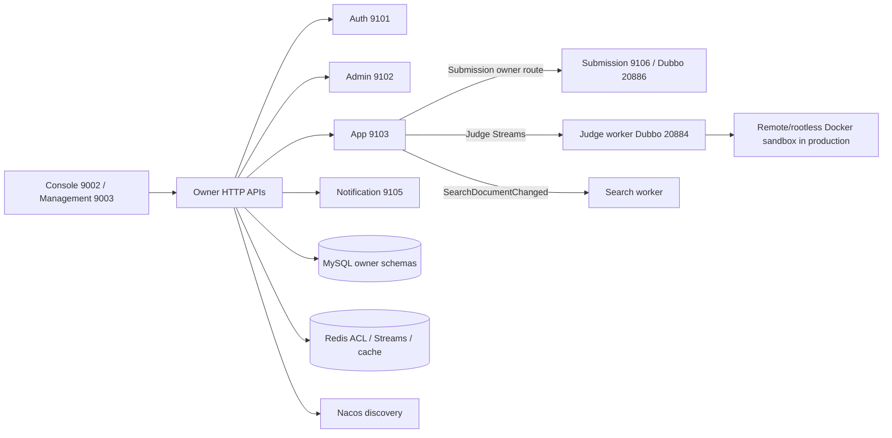

# 架构总览

更新时间：2026-09-01。当前实现以源码、Maven POM、`application.yml`、Compose 和启动脚本为准；本页只提供稳定地图。

## 当前结论

UltiCode 已形成五个 Data Owner 与两个不持有业务表的 Worker：

本页只提供拓扑摘要；职责与禁止事项以[模块与数据所有权](modules.md)为准。

| 类型 | 服务 | 责任 |
| --- | --- | --- |
| Owner | `backend-auth` | 账号、凭证、会话、授权事实 |
| Owner | `backend-admin` | 管理 BFF、治理、审计、设置、监控、备份 |
| Owner | `backend-app` | 题目、竞赛、题解、论坛、用户画像、互动和 WebSocket |
| Owner | `backend-submission` | Submission、判题/结果/创建 outbox、generation/lease fence |
| Owner | `backend-notification` | 通知 Inbox、投递 ledger、邮件和重试 |
| Worker | `backend-judge` | 消费 Judge Streams，执行沙箱，回写 Submission verdict |
| Worker | `backend-search` | 消费 `SearchDocumentChanged`，维护 MeiliSearch 派生索引 |

`judge-runtime` 是共享执行依赖，不是进程。Contract modules 在 `services/api/`；共享平台能力在 `services/platform/`。跨 Owner 通过 provider-owned contract 或 consumer-owned port 协作，不共享 Entity、Mapper 或业务 Service。

## 运行拓扑

- 外部 HTTP/WS 入口由前端 Nginx/Compose gateway 处理；内部 Dubbo 端口不对公网发布。
- `scripts/dev/up.sh --mode dev-lite` 是默认开发入口；`dev-full` 显式启动 Search。当前 binary/DevStack 拒绝已退役的 local compatibility mode；生产回滚只能使用部署方保留的上一份完整 release descriptor。
- **Admin 查询已收敛为粗粒度 query slices**，不再以拆分更多进程为理由；用户趋势使用一次 bounded Auth aggregate，Enricher 使用 bounded parallel owner reads。
- **Judge normal dev-lite/dev-full 使用 provider-owned JudgeQueue Streams**；App 不再扫描 Judge runtime 或运行旧 RQueue poller。
- Submission normal reads 通过 bounded owner-facts contract；App 不再保留本地 Submission read projection、mapper 或 entity。

## 关键边界

1. **Owner-first**：按数据聚合 Owner 划分服务，不按管理页面划分。Admin 可以编排命令，但 Problem、Contest、Submission、Forum、Solution 等数据仍由 App 或 Submission Owner 持有。
2. **单写者**：Submission 和 Notification 的持久化 writer 分别只在对应 Owner；App 只保留 Submission remote adapter、Notification intent 发布和 WebSocket relay。
3. **单跳同步调用**：Admin 可调用 Auth/App/Notification 的一个 Provider；Provider 不为同一命令同步调用第三个 Provider。跨边界副作用使用 Outbox/Inbox/Streams。
4. **本地事务**：强一致 invariant 留在一个 Owner 的 MySQL 事务内；Redis、SMTP、WebSocket、对象存储、搜索和审计使用 outbox、inbox、lease、fence 或补偿。
5. **安全边界**：共享 `platform/web-security` 负责 JWT/JWKS、Cookie CSRF、委托断言和 replay guard；各 Owner 只保留路由与策略包装。访问令牌只来自 HttpOnly cookie；WebSocket 只接受 `access_token` cookie。

## 查找入口

- 服务职责：[`modules.md`](modules.md)
- 请求、事件和事务：[`data-flow.md`](data-flow.md)
- 认证和信任边界：[`security.md`](security.md)
- 当前问题与外部触发条件：[`../project/known-issues.md`](../project/known-issues.md) 与 [`../../services/docs/SERVICES_ISSUES.md`](../../services/docs/SERVICES_ISSUES.md)
- 历史迁移与审计材料：[`archive/README.md`](../archive/README.md)
