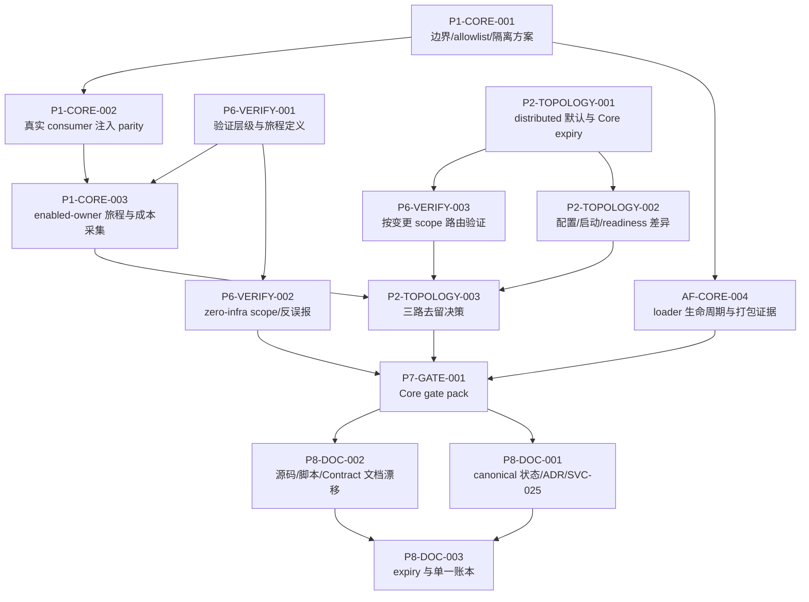

# UltiCode 架构问题自主核查与后续任务计划

> 计划状态：`IMPLEMENTED_WITH_EVIDENCE_GAPS`；Core 已完成显式装配边界、Auth/Admin allowlist、本地契约接线和验证入口收敛，但 enabled-owner 完整业务旅程仍未执行。
>
> 执行授权：`true`。本轮允许修改源码、测试、脚本、配置和文档；不执行 commit、push、merge、deploy、迁移或外部凭据操作。
>
> 当前基线：`main@fedbc45c9fc380689e46434f81c49cd38a3bb3db`，工作区包含用户既有 WIP 与本轮未提交改动；`main...origin/main [ahead 8]`。
>
> 权威机器状态：`.agent/tasks/ulticode-architecture-followup/TASKS.yaml`。恢复信息：`.agent/checkpoints/architecture-followup-planning.md`。

## 1. 结论

本轮不新增物理服务。Core 选择显式装配而非真实 class/resource loader isolation：`CoreModuleRegistry` 注册六个 Owner，但仅 Auth/Admin 启用；`CoreOwnerClassLoaders` 保留为 parent-first 的有界 TCCL/生命周期辅助，不能作为 sibling 不可见性或安全边界证据。

`distributed` 继续是唯一默认拓扑。Core 是 Auth/Admin allowlist 的 opt-in testbed，通用默认关闭，命名 `core` scope 才开启 Owner contexts；Judge readiness 在该 scope 为 optional。Core 三路结果选择 `RETAIN_TEMPORARILY_WITH_EXPIRY`，expiry 为 `2026-10-06`，不自动续期；在完整 journey 证据补齐前不 promotion。

保留以下已建立的边界，不因本计划重新打开：

- Submission 仍由 `backend-submission` 单写；不共享 Entity、Mapper 或事务，不恢复双写。
- Notification 仍拥有投递状态、重试和去重；是否单独运行与是否保持独立 Module 分开判断。
- Auth 仍是凭据和权限写入的权威 Owner；本地调用必须传递同等 actor、授权、幂等和失败语义。
- Judge 仍是独立 Worker；独立进程不等于已经证明 sandbox 安全，远程 Judge/TLS 属于外部或可选验证。
- App 的域数量、目录规模或实现长度不足以触发新的物理服务；先深化现有私有 Module。
- Search 是可重建的派生索引，按业务 scope 运行，不引入新的托管服务作为本轮前置条件。

## 2. 基线、证据和限制

### 2.1 实际核查基线

- 报告提供的基线日期为 2026-09-05，报告 HEAD 为 `fedbc45c9`；本次重新读取的 HEAD 与报告一致。
- 当前分支为 `main`，工作区包含用户既有 WIP 与本轮未提交改动；基线仍为 `main...origin/main [ahead 8]`。
- 现有历史计划 `ulticode-architecture-followup-plan.md` 曾记录 2026-09-02 的 `43/43 DONE` 快照；现已由本文件承接为后续核查计划。旧实现任务的完成状态不在本轮重新包装，历史细节由当前拓扑计划和 evidence 文档承接。
- 当前相关设计参考为 [`ulticode-topology-contract-module-convergence-plan.md`](ulticode-topology-contract-module-convergence-plan.md)，其中的原任务 ID 在本计划中复用，不创建同义的第二套 ID。

### 2.2 证据优先级

当前源码、POM、配置和测试实现高于报告、历史文档、知识页和图谱。当前 codebase-memory 项目 `UltiCode` 已 indexed，generation 为 `2026-09-03T03:56:34Z`；Core 文件有未跟踪/未记录项，部分文档和脚本被排除，因此本计划对 Core 的负面结论回读了源码，对图谱只作定位用途。报告中“2026-09-04 enabled-owner exec-jar smoke 失败”的内容是 `reported` 证据，本轮没有重跑该探针。

执行阶段实际运行：`bash scripts/test/core-profile-contract.sh`、三个 Shell 脚本语法检查、`bash ./mvnw -Punit -pl core test -B`（使用 `JAVA_TOOL_OPTIONS=-XX:-UseContainerSupport`，20 tests 全部通过）、`scripts/dev/test.sh --describe`、DevStack manifest/control contract、docs contract 和 `scripts/dev/test.sh static`，上述检查均通过。`scripts/test/zero-infra-validation-contract.sh` 在默认环境和同一 JVM workaround 下都在 backend-app-web 的 JaCoCo report 阶段以 `Unknown block type 0` 失败；其静态 child checks 通过，因此该入口保持 `validated_with_environment_failure`，不记为 PASS。`scripts/dev/test.sh core` 在 workaround 下通过；Docker/PM2/数据库和四步 disposable journey 未执行，Core 业务 journey 因 Core parent 没有业务 HTTP/WS 路由保持未执行。

## 3. R1—R6 及相邻发现

| ID | 分类 | evidence_kind | 当前结论与证据 | 影响 | 处置 |
|---|---|---|---|---|---|
| R1 | `Confirmed` | `static` + `reported` | `CoreOwnerClassLoaders#createOwnerClassLoader` 使用 `CoreOwnerClassLoaders.class.getClassLoader()` 作为 parent（`services/core/src/main/java/com/ulticode/core/CoreOwnerClassLoaders.java:79-86`）；Core POM 同时依赖六个 Owner Implementation（`services/core/pom.xml:31-73`）。包扫描也重复包含 `com.ulticode.common`、`event.inbox`、`submission.*`、`notification.*`（`CoreOwnerBootConfigurations.java:21-165`）。现有 2026-09-04 报告记录 enabled-owner wiring 在 Bean refresh 阶段失败。 | `core-opt-in` | `P1-CORE-001`、`AF-CORE-004`、`P7-GATE-001`。先选择边界方案；只有选择真实类加载隔离时才承诺类和资源不可见。 |
| R2 | `Confirmed`（运行时为局部 PASS） | `static` + `runtime` | `CoreLocalIdentityQueryAdapter` 仍是 Core parent 的 `@Component`，但当前 Admin child 由 `CoreOwnerContextManager#registerChildContracts` 显式注册 `coreOwnerContextManager`、`CoreLocalIdentityQueryAdapter` 和 `CoreLocalAuthorizationMutationAdapter`；`CoreLocalAdapterWiringTest` 用 mock Auth contract 验证 `AccountReadAdapter` 能解析 identity。真实 Auth provider、权限 mutation consumer 和可用 DB/Redis 未执行。 | `core-opt-in`, `shared-contract` | `P1-CORE-002`。局部接线已修正；真实 provider/permission journey 保持 evidence gap。 |
| R3 | `Confirmed` | `static` | Owner child 被设置为 `spring.main.web-application-type=none`（`CoreOwnerContextManager.java:223-226`）；Core parent 的安全配置仅放行 readiness、其余请求 deny（`services/core/src/main/java/com/ulticode/core/CoreSecurityConfiguration.java:12-18`）。`CoreApplication` 只扫描 `com.ulticode.core`（`CoreApplication.java:18-41`），没有业务 HTTP/WS 路由。 | `core-opt-in` | `P1-CORE-003`、`P2-TOPOLOGY-002`。启动/readiness、业务可用和完整迁移分开验收。 |
| R4 | `Historical / Resolved` | `static` + `runtime` | 变更前 `CoreApplicationSmokeTest` 和 `scripts/dev/test.sh` 的描述会把 disabled Core smoke 误读为 enabled-owner wiring；本轮已将 `core` 帮助、scope、Core 测试和验证表述改为 parent/config/readiness smoke，并以 20 个 Core unit tests 与 static checks 复核。 | `documentation`, `verification` | `P6-VERIFY-001`、`P6-VERIFY-002`、`P6-VERIFY-003`、`P8-DOC-002` 已解决；不把 shell smoke 当业务证明。 |
| R5 | `Hypothesis`（双拓扑存在是 `static`） | `static` | 独立 Owner 启动壳和 Core parent/child 启动壳同时存在（`services/pom.xml:35-42`、`services/core/pom.xml:100-109`、`ecosystem.config.cjs:106-125`）。因此两套配置、Adapter 和验证可能扩大维护面；尚没有同一 journey 的冷启动、内存、配置、改动文件数或验证耗时数据。 | `core-opt-in`, `distributed` | `P2-TOPOLOGY-001`、`P2-TOPOLOGY-003`、`P6-VERIFY-003`。只采集比较方法，不预设数字。 |
| R6 | `Historical / Resolved` | `static` + `documentation` | 变更前 gate、状态文档、difference matrix、ADR、application.yml 和 DevStack 对 isolation、Owner context/Judge 默认值的表述不一致；本轮已统一为 explicit assembly/no classloader isolation、Auth/Admin opt-in、distributed sole default、Judge optional。 | `documentation`, `core-opt-in` | `P8-DOC-001`、`P8-DOC-002`、`P8-DOC-003` 已解决；当前 evidence gap 见第 7—10 节。 |
| N1 | `Historical / Resolved` | `static` | 变更前 `CoreModuleRegistry` 默认遍历六个 Owner 且没有 per-owner allowlist；当前 registry 明确记录六个模块的 enabled 状态，只有 Auth/Admin 在 opt-in Core scope 启用，其余四个保持 disabled。 | `core-opt-in` | `P1-CORE-001`、`P2-TOPOLOGY-002` 已解决。 |
| N2 | `Historical / Resolved` | `static` + `runtime` | 变更前 child classloader 没有稳定 ownership/close handoff；当前 `OwnerStartup` 使用 close-once `StartupAttempt`，manager 跟踪 active attempts/slots，并在 timeout/stop 路径执行 bounded cancellation、resource close 和 termination wait。非 cooperative `SpringApplication.run()` 仅有 bounded termination evidence gap，不宣称强制终止。 | `core-opt-in`, `lifecycle` | `AF-CORE-004` 不适用；loader ownership、close-once 和可合作线程路径已验证，非 cooperative termination 保持 evidence gap。 |

### 3.1 已解决、误报和范围外

| 分类 | 数量 | 结论与依据 |
|---|---:|---|
| `Already Addressed` | 6 | Submission 单写已由 `services/submission` 承担；Notification recipient seam 已移到 `services/notification`；`ContestSubmissionPort` 的旧 `recordSubmissionIfNeeded` 已删除且实现为 `OutboxContestSubmissionPort`；Admin 用户详情已有 `AdminUserDetailQuery` 的 deadline/cancel/显式失败；App 当前 POM 没有 `backend-judge-runtime` compile dependency，且正常路径使用 `backend-common` codec/UUID；App-only Interface 已按 catalog 内部化。证据包括 `docs/architecture/modules.md:36`、`services/notification/src/main/java/com/ulticode/notification/recipient/UserNotificationReadPort.java:14-33`、`services/submission/src/main/java/com/ulticode/submission/port/adapter/OutboxContestSubmissionPort.java`、`services/admin/src/main/java/com/ulticode/modules/admin/query/DefaultAdminUserDetailQuery.java:147-238`、`services/app/app-web/pom.xml:53-75`。 |
| `False Positive` | 1 | “App 当前仍直接编译依赖 `backend-judge-runtime`”不成立。当前 `services/app/app-web/pom.xml` 没有该依赖；Hindsight Component map 和旧 evidence 的对应描述属于过期快照。不能据此重新创建 P4 legacy 删除任务。 |
| `Out of Scope` | 1 组 | 真实生产 HA、多主机 failover、远程 Judge/TLS、托管 MySQL/Redis/Meili、mixed-version 运行史以及 Kubernetes/Kafka/Service Mesh/Seata/多个数据库集群，没有本仓库可用证据，不作为本轮完成条件。既有 `SERVICES_ISSUES.md` 的 `OUT_OF_SCOPE`/`OPTIONAL_PROFILE` 分类继续有效。 |

因此本轮当前问题统计为：`Confirmed=3`（R1、R2、R3），`Historical / Resolved=4`（R4、R6、N1、N2），`Hypothesis=1`（R5），`Already Addressed=6`，`False Positive=1`，`Out of Scope=1 组`。R2 的真实 provider/permission 运行时部分，以及 N2 的非 cooperative termination 仍是 evidence gap；不再把已解决的旧表述当作当前缺口。

## 4. 方案与决策关口

### D1：装配隔离与类加载隔离必须分开

`P1-CORE-001` 先产出方案选择，不默认建设通用 classloader 容器：

1. **显式装配方案（首选候选）**：每个 Owner 只注册自己的 Configuration、MapperScan、数据源和 Contract；共享 parent 只暴露无业务语义的 platform/Contract。验收承诺是 Bean/Mapper/DataSource 装配隔离，不承诺 sibling 类在物理 classpath 上不可见。
2. **真正类加载隔离（条件候选）**：只有显式装配无法满足 Core 目标时才选。必须同时证明 sibling class 与 resource 不可见、共享 Contract 的类型身份稳定、Spring Boot exec-jar 和开发 classpath 都可打包运行、loader 能在 context close 时有界释放。
3. **大范围 parent + 排除名单（拒绝）**：不能把 Core 全部 Owner Implementation 暴露给 child，再靠 `@Primary`、扫描顺序或不断增加排除项掩盖边界。

D1 的失败出口是暂停 Core 扩大，保留 distributed；不自动迁移所有 Owner，也不把失败包装成新平台建设任务。

### D2：本地调用必须穿过真实 Seam

`P1-CORE-002` 只接受以下证据链：

```text
真实 consumer
  → 目标 child context 中实际注册的 Contract/Port
  → local Adapter
  → provider Owner 的真实 Implementation
```

每条链路都要检查 actor/delegation、权限、事务边界、异常/超时、幂等和返回 envelope。`@DubboReference(check=false)` 在 Core 中得到 null 或空结果只能证明 fail-closed，不能证明合法请求成功。当前 Auth mutation/identity 是候选最小链路；Admin→App、Submission→App/Auth、Notification→Auth/App 先列为未覆盖，不强行塞入第一条旅程。

### D3：Core 三路去留

`P2-TOPOLOGY-003` 在 P1/P2/P6 证据完成后重新评审：

- `PROMOTE_LATER`：只有代表性旅程和 enabled-owner wiring 通过，且同条件比较显示 Core 明显降低贡献者成本，才允许另行提出默认切换；本计划不直接授权切换。
- `RETAIN_TEMPORARILY_WITH_EXPIRY`：只保留已证明的 Owner scope，写明 owner allowlist、过期日期、删除动作和 distributed 回退；过期不自动续期。
- `REMOVE_CORE_EXPERIMENT`：若需要通用复杂 loader、重复实现或多条半成品路由才能通过，删除 Core 专属入口/配置/Adapter/测试/文档，保留 Owner 独立进程。

现有 `ADR-0012` 的 `RETAIN_TEMPORARILY_WITH_EXPIRY`（2026-10-06）是待复核输入，不是本轮最终裁决。

## 5. 第一条代表性业务旅程

选择 Auth + App + 管理权限的最小旅程，理由是它覆盖身份、一个公共业务读、一个 App-owned 写和一次角色拒绝，同时不提前引入 Submission→Judge 或 Notification 复杂度：

1. 身份认证：`POST /auth/login`，对应 `services/auth/.../AuthController.java:37-58`，验证 session cookie/CSRF 约束和当前用户可被解析。
2. 业务读取：`GET /problems/{id}`，对应 `services/app/app-web/.../ProblemController.java:31-77`，验证 App-owned Problem projection 与 read-only 路径。
3. 业务写入：`POST /bookmarks/quick`，对应 `services/app/app-web/.../BookmarkController.java:21-40`，验证当前用户身份、App 事务和结果 envelope。
4. 权限拒绝：普通用户调用 `POST /problems`，对应 `ProblemController.java:111-137` 的 `@PreAuthorize("hasAnyRole('ADMIN', 'SUPER_ADMIN')")`，必须得到拒绝结果，不能因 Core 合并而放宽。

旅程的外部 `/api` 前缀和 gateway rewrite 由执行任务从当前 Nginx/route 配置重新确认；上面使用的是 Controller owner-relative path。第一轮不包含 `POST /problems/{problemId}/submissions`、Judge sandbox、结果回写或通知投递；这些保留为后续条件任务，避免把所有入口改造变成 Core 的隐含前置条件。

## 6. 执行路线和并行关系



可并行的第一批是 `P1-CORE-001`、`P6-VERIFY-001` 和 `P2-TOPOLOGY-001`；`AF-CORE-004` 与 `P1-CORE-002` 等待 D1；`P1-CORE-003` 等待真实接线和验证层级；最终 Gate 前不得执行 Core 继续分支。

## 7. 验证分层

| 层级 | 计划证明什么 | 明确不能宣称 | 入口状态 |
|---|---|---|---|
| 静态 / 零基础设施 unit | 依赖方向、allowlist、Contract 绑定规则、负向类/资源约束、小范围逻辑 | Owner 已启动、数据库/消息正确 | `validated`：Core profile contract PASS；Core `-Punit` 20 tests PASS（`JAVA_TOOL_OPTIONS=-XX:-UseContainerSupport`） |
| shell smoke | Core parent、配置对象、readiness fail-closed | enabled-owner wiring、业务可用 | `validated`：入口说明已修正；`test.sh core` 仍是 contexts disabled 的 parent/config/readiness smoke |
| enabled-owner wiring | 实际 child 配置、真实 consumer 注入、local Adapter 到 provider 的绑定、sibling 不泄漏 | 持久化、消息、完整业务旅程 | `partial`：Admin `AccountReadAdapter` + mock Auth contract wiring PASS；真实 provider boot、其余 Owner parity 未执行 |
| 临时基础设施集成 | 对应 MySQL/Redis/消息和事务/幂等行为 | 全部入口、生产 HA、真实流量 | `not_run`：本轮未启动基础设施 |
| 代表性业务 journey | login、Problem read、Bookmark write、普通用户 403，以及 distributed/Core 对照语义 | 全功能等价、性能数字、生产部署 | `deferred/not_run`：Core 无业务路由；distributed disposable 输入未提供 |

所有后续命令必须在任务中标注 `existing` 或 `proposed`。本轮未执行的验证一律保持 `not_run`、`deferred` 或 `not_applicable`；没有 Docker/凭据不会被写成通过。

## 8. 任务索引

完整字段、状态、步骤、验收、回退和 validation 见 TASKS.yaml；本节只给执行顺序，避免维护第二份可变状态表。

| 任务 ID | 结果 | 依赖 | 状态 |
|---|---|---|---|
| `P1-CORE-001` | 选择显式装配隔离，定义 Owner allowlist | — | done |
| `AF-CORE-004` | 证明 sibling 类/资源、Contract 类型身份和 loader close 语义 | P1-CORE-001 | not_applicable |
| `P1-CORE-002` | Auth/Admin consumer→Adapter→provider 局部接线和未覆盖矩阵 | P1-CORE-001 | done_with_evidence_gap |
| `P6-VERIFY-001` | 验证层级、第一条旅程和“不证明什么” | — | done |
| `P6-VERIFY-002` | zero-infra/Core smoke scope 反误报入口 | P6-VERIFY-001 | done_with_evidence_gap |
| `P2-TOPOLOGY-001` | distributed 唯一默认、Core expiry 和回退 | — | done |
| `P2-TOPOLOGY-002` | 配置、Owner scope、启动和 readiness 差异矩阵 | P2-TOPOLOGY-001 | done |
| `P6-VERIFY-003` | 按变更 scope 选择 distributed/Core 验证 | P2-TOPOLOGY-001, P6-VERIFY-001 | done |
| `P1-CORE-003` | enabled-owner 最小旅程与成本采集方法 | P1-CORE-002, P6-VERIFY-001 | deferred |
| `P2-TOPOLOGY-003` | Core `PROMOTE_LATER`/`RETAIN...`/`REMOVE...` 决策 | P1-CORE-003, P2-TOPOLOGY-002, P6-VERIFY-003 | done |
| `P7-GATE-001` | Core load/parity/journey/topology Gate pack | AF-CORE-004, P1-CORE-003, P2-TOPOLOGY-003, P6-VERIFY-002 | done_with_evidence_gap |
| `P8-DOC-001` | 更新 canonical 状态、ADR 和 SVC-025 入口 | P7-GATE-001 | done |
| `P8-DOC-002` | 修正脚本、evidence、Contract 和旧快照表述 | P7-GATE-001, P6-VERIFY-002 | done |
| `P8-DOC-003` | 固化 expiry、任务账本和漂移检查 | P8-DOC-001, P8-DOC-002 | done |

## 9. 风险、回退和停止条件

- **边界扩大风险**：如果执行者需要把所有 Owner Implementation 暴露到 shared parent，停止 Core 实验，回到显式装配或删除分支。
- **安全降级风险**：local Adapter 缺失时可以拒绝请求，但不能把拒绝全部请求当成功；合法 login/read/write/403 需要分别证明。
- **数据所有权风险**：任何 Core 修复不得让 child 直接取得 sibling Mapper、Entity、事务或写权；Submission/Notification 单写者 Gate 始终保留。
- **生命周期风险**：child startup timeout、late completion、context close 和 loader close 必须各有唯一责任方；失败时 readiness 继续非 200。
- **双拓扑成本风险**：没有同一旅程的可比数据前，不得把 Core 的 JVM 数或“预期更低运维”写成事实。
- **文档漂移风险**：Gate、ADR、current-status、issue registry 和 evidence 的状态只能在 P8 任务中同步，不能在本轮通过新文件维护第二份 issue 表。

回退点：任何 Core 分支都能通过保留 `distributed` 默认、关闭 Core Owner contexts、移除 Core scope；如果最终选择移除，按 `P7-GATE-001` 输出的清单删除 Core 专属配置、Adapter、测试、脚本和文档引用，Owner 独立进程不变。任何删除任务都不得与新的 runtime 修复混在同一提交中。

## 10. 计划自审结果

1. R1—R6 全部有分类、证据、影响和任务/不处理依据；相邻 N1/N2 已分别并入 Core boundary/lifecycle 任务。
2. 已解决的 Admin detail、Submission/Notification ownership、Contract relocation 和 App judge-runtime 误报没有重新创建修复任务。
3. Core 与默认 distributed 已明确分开；没有把生产 HA、远程 TLS 或新基础设施变成前置条件。
4. 装配隔离和类加载隔离分别作为 D1 的不同承诺；没有预先指定通用 classloader 方案。
5. P1-CORE-002 的验收明确要求真实 consumer→Adapter→provider；现有 mock-only 测试只作为局部证据。
6. 验证层级区分启动、装配、集成、旅程和生产证明；Core parent/unit 已验证，enabled-owner provider、disposable 和业务旅程明确保持 `not_run` 或 `deferred`。
7. 任务依赖图无环，互斥的三路结果在 P2-TOPOLOGY-003 中选择 retain；promotion 未获授权，expiry 不因状态修改自动延长。
8. 任务均有独立结果；没有新增“优化架构/完善测试”式空任务。
9. 计划授权了本轮源码、测试、脚本、配置和文档收敛，但不授权默认拓扑切换、commit、push、merge、deploy 或外部凭据操作。
10. 旧 completed 账本和当前 topology plan 通过 external reference 承接；新的可变状态只在 TASKS.yaml，checkpoint 不复制任务正文。

执行结果：已完成可在本地、无基础设施条件下证明的 Core 边界、Auth/Admin 局部契约接线和入口文案收敛；Core parent/unit、静态架构合同和文档合同已验证。真实 Auth provider 启动、完整 Owner parity、Core/distributed disposable journey、成本比较和生产/HA 证据不在本轮完成条件内；zero-infra wrapper 的 backend-app-web JaCoCo 环境故障已保留为失败证据，没有被写成 PASS。

本文件和 TASKS.yaml 的引用、YAML 语法、ID 唯一性、依赖无环性已执行只读校验；文档、ADR、issue registry、知识图和源码的实际更正已在本轮完成。后续只允许沿 expiry/新决策路径继续，不得通过改状态静默续期。
