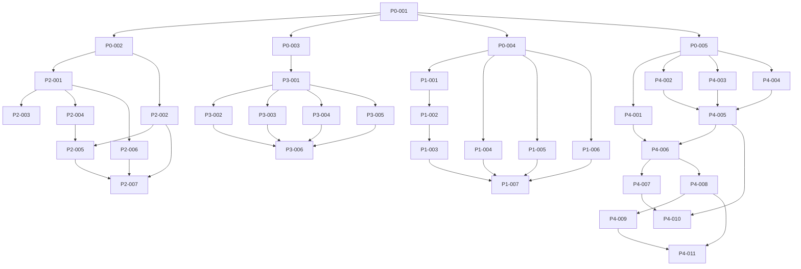

# UltiCode 架构后续整改计划

> 状态：`COMPLETED — 43/43 DONE (2026-09-02)` 
> 模式：`COMPLETED`（实施已闭环，本文保留为历史规划快照） 
> 调查基线：`fix/architecture-remediation@6f97e6d5fee65e3ecf1cbc4e086336dd870606d5` 
> 规划持久化 HEAD：`55b541bf82f7c060ae7eec236b42fc8e0c496b47`；实施完成 HEAD：`9e1c36e14` 
> 调查日期：2026-09-01；规划持久化：2026-09-02；实施闭环：2026-09-02 
> 机器任务源（本 checkout、本地 ignored）：`.agent/tasks/ulticode-architecture-followup/TASKS.yaml`（`plan.status DONE`，本机 ignored，仅本地可读） 
> 规划 checkpoint `.agent/checkpoints/architecture-followup-planning.md` 已于 `2026-09-02` 随任务闭环删除工作树副本，内容已迁移至本文与 `../evidence/`，Git 历史保留实现提交 `9e1c36e14` 之前版本 
> 最终集成矩阵：`../evidence/P5-GATE-004-final-integration-matrix.md`；当前状态：`../../project/current-status.md`
## 1. 执行结论（基线快照说明）

> **快照声明**：本节 `1–4` 描述的是规划基线 `6f97e6d5`（2026-09-01）的调查快照，用于解释为何立项；非当前实现。当前实现已在 `2026-09-02` 完成全部 `43/43` 任务并通过对应 Gate，当前真实状态以 [`../../project/current-status.md`](../../project/current-status.md) 与 [`../../../services/docs/SERVICES_ISSUES.md`](../../../services/docs/SERVICES_ISSUES.md) 为准。下述“仍保留/仍存在”均为基线时态。

四个规划领域均仍成立，但不是普通、未修复的仓库缺陷：

1. **AREA-INFRA**（基线）：默认 MySQL、Redis、MeiliSearch 仍共享单机故障域；Nacos HA profile 需要外部节点。仓库已有 ACL、备份恢复、Search fallback、Streams resilience 和 disposable drills，应先深化现有 seam，不直接引入新平台。
2. **AREA-APP**（基线）：App 已有 Problem、Contest、Submission、Moderation 私有 Maven module，但主要 implementation 仍集中在 `app-web`；`app-api` 同时承载跨 Owner interface 与 App/Judge 内部 interface。先收窄 interface、深化 module，再决定是否物理拆分。
3. **AREA-ADMIN**（基线）：Admin 是同步依赖集中点。调查基线有 61 个 `@DubboReference`：App 33、Auth 18、Submission 6、Notification 4；无 Judge reference。Dashboard stats 已并行，但用户趋势仍按 100 条分页扫描 Auth，RPC 数随账号量增长。
4. **AREA-LEGACY**（基线）：`legacy-rollback` 仍保留 App 本地 Submission read implementation。`app-web -> backend-judge-runtime` 还存在三个非回滚依赖族：`AppUuidGenerator`、queue-local `SubmissionResultPushPort`、`SubmissionStatusCodec`。必须先迁走它们，再关闭 profile 和删除兼容 implementation。

已确认的当前事实：

- Submission mutation 已由 `backend-submission` 单写；App 不存在 local writer。
- Judge 是独立 Worker，不依赖或复用 `app-web`；当前 `AGENTS.md` 已修正为这一事实。
- 实际 Submission module 路径是 `services/submission/`，不是 `services/backend-submission/`。
- 暂不采用 Kubernetes、Kafka、Service Mesh、Seata 不是缺陷。
- 文件数、LOC、interface 数和注解数只作为基线线索，不能单独支持拆分结论。

当前最重要的矛盾是：

> Owner 数据所有权和远程 seam 已建立，但基础设施故障域、App module 深度、Admin use-case 预算和兼容 seam 退出机制尚未完全收敛。

推荐总顺序：

1. 冻结事实与现有 Gate。
2. 迁出 App 对 `judge-runtime` 的非回滚依赖，并收窄 `app-api`。
3. 治理 Admin Dashboard 分页扫描与 use-case 预算。
4. 并行推进基础设施职责隔离和非生产故障演练。
5. 通过 `GATE-LEGACY-REMOVAL` 后关闭 `legacy-rollback`。
6. 分步删除兼容 adapter、read implementation、Mapper、POM 依赖和遗留数据库对象。
7. 依据量化证据决定保持当前 App deployment 或进入物理拆分设计。

## 2. 范围与非目标

### 覆盖范围

- AREA-INFRA：MySQL、Redis、MeiliSearch、Nacos 的职责、消费者、故障影响、降级和恢复。
- AREA-APP：`app-api`、App 私有 module、compile/runtime/data/transaction seam 和发布耦合。
- AREA-ADMIN：全量 Dubbo reference、页面/use case fanout、预算、freshness、partial failure 和条件事件读模型。
- AREA-LEGACY：`legacy-rollback`、本地 Submission read implementation、`judge-runtime` 依赖和安全删除顺序。

### 明确排除

- 真实生产流量、长期生产 SLO、生产多主机 failover。
- 真实生产 mixed-version、证书轮换、远程 Judge 和独立 rollback 证明。
- Kubernetes、Kafka、新 MQ、Service Mesh、Seata。
- 五套独立数据库集群。
- 直接拆分新微服务。
- 无指标支持的 Admin 事件读模型。
- 本计划的自动执行、提交、部署或数据库操作。

Repository、CI、disposable、integration 或 pre-production evidence 必须明确标注，不能描述成生产证明。

## 3. 当前证据基线

本节的数量是绑定上述 commit 的调查快照，不是长期架构事实。

| 领域 | 当前事实 | 权威证据 | 风险 | 可信度 |
| --- | --- | --- | --- | --- |
| 状态 | 官方注册表无 repository-actionable `OPEN`；剩余为 `DEFERRED` 或 `ACCEPTED` | `services/docs/SERVICES_ISSUES.md:5-24` | 历史 Finding 被重新当作当前缺陷 | 高 |
| INFRA | 默认 MySQL、Redis、MeiliSearch 单点；HA Compose 不声明透明 failover | `services/docs/SERVICES_ISSUES.md:68-72`; `docker-compose.ha.yml:10-17` | 一个依赖故障跨多个 Owner/Worker | 高 |
| Redis | Streams、cache、rate-limit、replay、queue、judge、Pub/Sub 共用 Redis；ACL 只隔离身份/keyspace | `docker/redis/generate-users-acl.sh:58-74` | 权限隔离不等于内存、eviction、连接或故障隔离 | 高 |
| MySQL | Owner schema/account 已隔离；已有加密 backup、checksum、Flyway metadata、disposable restore drill | `docs/operations/backup-and-recovery.md:7-23` | 共享实例维护和 pool 压力仍跨 Owner | 高 |
| Search | Search worker 是唯一 MeiliSearch writer；App indexed read 有显式 DB fallback | `SearchDocumentIndexWorker.java:40-55`; `DefaultSearchReadProjection.java:91-148` | fallback 改变排序/freshness；恢复需可执行验证 | 高 |
| APP | 一个 `service.version.app` 发布四个私有 module 和 `app-web` | `services/app/pom.xml:16-29` | 多域共同发布、扩缩容和失败 | 高 |
| APP module | 私有 module 仍较浅，主体 implementation 位于 `app-web` | `services/app/modules/**`; `services/app/app-web/src/main/java/com/ulticode/modules/**` | module 名称与真实 locality 不一致 | 高 |
| app-api | 调查快照有 75 个公开 interface；至少四个 interface 所有权位置不合理 | `JudgeConfigPort.java`; `JudgeEnqueuePort.java`; `VerdictResolvePort.java`; `ModerationUserReadPort.java` | 内部知识扩大 contract lifecycle | 高 |
| ADMIN | 61 个 Dubbo references：App 33、Auth 18、Submission 6、Notification 4 | `services/admin/src/main/java/**/@DubboReference` | Admin 成为同步 coupling 集中点 | 高 |
| ADMIN Enricher | `AdminUserEnricher` 批量合并 Auth/App，返回 `OK/PARTIAL/UNAVAILABLE`；两个独立 batch 当前串行 | `AdminUserEnricher.java:208-361` | page wall time 缺少 use-case budget | 高 |
| ADMIN Dashboard | stats 并行三个 Owner 并限定 800ms；用户趋势按 100 条串行扫描 Auth | `DefaultAdminDashboardReadAdapter.java:78-100,165-243` | RPC 数随账号量增长 | 高 |
| RPC | Query 800ms/1 retry、逻辑总预算 1.6s、bulkhead 32、5 次失败开路 30s | `RpcPolicy.java:74-100`; `DubboDependencyResilienceFilter.java` | dependency budget 不能限制页面 fanout | 高 |
| LEGACY write | App mutation 始终进入 Submission Owner | `RemoteSubmissionWritePort.java`; `DefaultSubmissionWritePort.java` | 不得重新引入双写 | 高 |
| LEGACY profile | `legacy-rollback` 可由 DevStack 显式启用，并打开 local read/Judge compatibility | `devstack-manifest.sh:195-202`; `AppJudgeCompatibilityConfiguration.java` | 临时 seam 永久化或误启用 | 高 |
| LEGACY read | App Submission 调查快照有 59 个 Java 文件，18 个直接含 legacy 条件；Mapper 由 legacy scan 装配 | `LegacySubmissionMapperScanConfig.java`; `SubmissionRoutingProperties.java` | 两套 read model 漂移 | 高 |
| runtime dependency | App 正常路径还直接使用 runtime UUID、push alias 和 status codec | `app-web/pom.xml:68` 及对应 import inventory | 直接删 POM 依赖会破坏正常路径 | 高 |
| 图谱限制 | codebase-memory generation 旧于部分源码，且曾返回已删除 symbol | `check_index_coverage` | 图谱不能用于负面或穷举证明 | 已披露；结论已回读源码 |

## 4. 目标架构原则

### AREA-INFRA

- 每个 infrastructure dependency 的 error mode、fallback、capacity、eviction/durability 和 recovery 都属于其 interface。
- ACL 继续负责权限；资源和故障隔离单独裁决。
- Redis 先建立 workload role 和命名 client/config seam；只有互斥 eviction/durability 或 fault drill 证明收益时才拆实例。
- MySQL 保持 Owner schema/account；优先完善 pool budget、backup/restore 和 disposable recovery，不默认拆五个集群。
- Search index 是派生数据，必须能从 Owner 数据和 event 重建。
- Nacos 启动/运行时失效语义必须可测试，不能 fabricated success。

### AREA-APP

- `app-api` 只承载真实跨进程、provider-owned interface。
- App/Judge 内部 seam 保持 implementation-private。
- Interface 使用 deletion test、consumer、error mode、performance 和 locality 评估，不以方法数裁决。
- 先深化现有私有 module，再运行物理拆分 Gate。
- 新 contract 必须声明 Provider owner、consumer、transport、version、error mode 和 budget。

### AREA-ADMIN

- 页面/use case 是 dependency budget 的基本单位。
- 可聚合事实在 Data Owner 内完成，不把全量数据拉回 Admin。
- 独立 RPC 可以并行；依赖上一结果的调用保持顺序并记录总 budget。
- Freshness、partial、unavailable 是 interface 内容；空集合不能代替故障。
- Cache 先定义 freshness 和 invalidation owner。
- Event read model 只有在同步治理仍不满足量化 Gate 时进入 PoC，且不能成为第二数据真相。

### AREA-LEGACY

- Compatibility seam 必须有 owner、expiry、release floor 和删除 Gate。
- 顺序固定为：迁走正常依赖 → 关闭 profile → 删除 compatibility implementation → 删除 local persistence knowledge → 删除 POM dependency → schema contraction。
- Rollback 优先使用完整、已验证的旧 release descriptor，而不是让当前 binary 永久携带旧 implementation。

## 5. 分阶段路线图

| 阶段 | 目标 | 主要产出 | 进入条件 | 退出条件 | 后续 Gate |
| --- | --- | --- | --- | --- | --- |
| P0 | 冻结当前事实 | Evidence manifest、Maven graph、Dubbo graph、infra graph、legacy graph | 当前仓库可读 | 四领域路径、调用、配置和 Gate 全部可追溯 | `GATE-BASELINE-FROZEN` |
| P1 | 减少共享基础设施故障传播 | Redis role、MySQL recovery、Search/Nacos drills、统一 runbook | P0 infra graph | 每类 workload 有预算、降级、恢复和非生产演练 | `GATE-INFRA-ISOLATION` |
| P2 | 收窄 App interface、深化 module | Contract catalog、内部 interface 迁移、module pilot、growth Gate、scorecard | P0 module graph | `app-api` ownership 清晰；至少一个 pilot 证明 locality | `GATE-APP-SPLIT-CANDIDATE` |
| P3 | 降低 Admin 同步 coupling | Use-case budget、Auth aggregate、Enricher、typed degradation、metrics | P0 Dubbo graph | Dashboard 无分页扫描；核心 use case fanout/budget 可测 | `GATE-ADMIN-EVENT-READ-MODEL` |
| P4 | 关闭并删除 legacy seam | 非回滚依赖迁移、profile 关闭、implementation/data 分步删除 | P0 legacy graph | App 无 local Submission model、无 `judge-runtime` compile dependency | `GATE-LEGACY-REMOVAL` |
| P5 | 固化跨领域 Gate | ownership/profile/dependency/infra/Admin/integration Gate | 相应阶段可验收 | Gate fail closed 且可定位 | `GATE-FINAL-ARCHITECTURE` |
| P6 | 持久化架构与状态 | 架构图、ADR、注册表、任务状态、漂移检查 | 各阶段决策形成 | canonical docs 与源码一致 | Docs contract |

## 6. 任务注册表

任务的完整字段、状态和 acceptance criteria 以本 checkout 的本地 ignored 文件 `.agent/tasks/ulticode-architecture-followup/TASKS.yaml` 为机器权威源。本节提供可提交的执行索引，避免正文和 YAML 形成两份可独立修改的任务真相。

### P0 基线

| ID | 任务 | 优先级 | Size | 依赖 | Gate |
| --- | --- | --- | --- | --- | --- |
| P0-BASELINE-001 | 冻结当前事实与文档漂移 | HIGH | S | — | BASELINE |
| P0-BASELINE-002 | 建立 Maven module 与 contract consumer graph | HIGH | M | 001 | BASELINE |
| P0-BASELINE-003 | 建立 Admin use-case 级 Dubbo 调用图 | HIGH | M | 001 | BASELINE |
| P0-BASELINE-004 | 建立基础设施 workload 与故障传播图 | HIGH | M | 001 | BASELINE |
| P0-BASELINE-005 | 建立 legacy reachability 与删除闭包图 | HIGH | M | 001 | BASELINE |

### P1 基础设施

| ID | 任务 | 优先级 | Size | 依赖 | Gate |
| --- | --- | --- | --- | --- | --- |
| P1-INFRA-001 | 裁决 Redis workload 角色与隔离级别 | HIGH | M | P0-004 | INFRA |
| P1-INFRA-002 | 建立 Redis 命名 client 与资源预算 seam | HIGH | M | 001 | INFRA |
| P1-INFRA-003 | 建立 Redis 非生产故障/eviction/backpressure 演练 | HIGH | M | 001,002 | INFRA |
| P1-INFRA-004 | 建立 MySQL Owner 影响与恢复/连接预算矩阵 | HIGH | M | P0-004 | INFRA |
| P1-INFRA-005 | 固化 MeiliSearch 降级与重建 contract | MEDIUM | M | P0-004 | INFRA |
| P1-INFRA-006 | 固化 Nacos 启动/运行时失效语义 | MEDIUM | M | P0-004 | INFRA |
| P1-INFRA-007 | 汇总跨基础设施恢复 runbook | MEDIUM | L | 003–006 | INFRA |

### P2 App

| ID | 任务 | 优先级 | Size | 依赖 | Gate |
| --- | --- | --- | --- | --- | --- |
| P2-APP-001 | 建立 app-api interface 消费者与稳定性目录 | HIGH | M | P0-002 | APP |
| P2-APP-002 | 建立 App domain 依赖、数据、事务与 co-change 矩阵 | HIGH | M | P0-002 | APP |
| P2-APP-003 | 内部化已确认放错位置的 interface | HIGH | M | 001 | APP |
| P2-APP-004 | 对宽 interface 执行 deletion test 与消费者切片评审 | MEDIUM | M | 001,P0-003 | APP |
| P2-APP-005 | 执行一个 App 私有 module 深化 pilot | MEDIUM | L | 002,004 | APP |
| P2-APP-006 | 建立 app-api 增长和 ownership Gate | HIGH | M | 001 | APP |
| P2-APP-007 | 建立 App 候选部署单元 scorecard | MEDIUM | M | 002,004–006 | APP |

### P3 Admin

| ID | 任务 | 优先级 | Size | 依赖 | Gate |
| --- | --- | --- | --- | --- | --- |
| P3-ADMIN-001 | 定义 Admin use-case RPC、latency 与 freshness 预算 | HIGH | M | P0-003 | ADMIN |
| P3-ADMIN-002 | 用 Auth Owner 聚合替代 Dashboard 账号分页扫描 | HIGH | M | 001,P2-004 | ADMIN |
| P3-ADMIN-003 | 收敛 AdminUserEnricher 串并行与批量 contract | MEDIUM | M | 001 | ADMIN |
| P3-ADMIN-004 | 统一 Admin typed degradation 语义 | HIGH | M | 001 | ADMIN |
| P3-ADMIN-005 | 增加 use-case fanout 与依赖指标 | MEDIUM | M | 001 | ADMIN |
| P3-ADMIN-006 | 建立事件读模型 PoC/采用决策 Gate | MEDIUM | S | 002–005 | ADMIN |

### P4 Legacy

| ID | 任务 | 优先级 | Size | 依赖 | Gate |
| --- | --- | --- | --- | --- | --- |
| P4-LEGACY-001 | 指定 compatibility owner、截止条件和支持版本下限 | HIGH | S | P0-005 | LEGACY |
| P4-LEGACY-002 | 用 common UuidGenerator 替换 AppUuidGenerator | HIGH | M | P0-005 | LEGACY |
| P4-LEGACY-003 | 删除 queue-local SubmissionResultPushPort 别名 | HIGH | S | P0-005 | LEGACY |
| P4-LEGACY-004 | 移除 App 对 Judge runtime SubmissionStatusCodec 的依赖 | HIGH | S | P0-005 | LEGACY |
| P4-LEGACY-005 | 证明 app-web→judge-runtime 只剩 compatibility closure | HIGH | S | 002–004 | LEGACY |
| P4-LEGACY-006 | 关闭 legacy-rollback 当前版本可达性 | HIGH | M | 001,005,P5-001 | LEGACY |
| P4-LEGACY-007 | 删除 App Judge compatibility adapter 与旧 RQueue 路径 | HIGH | M | 006 | LEGACY |
| P4-LEGACY-008 | 删除 App 本地 Submission read adapter/projection implementation | HIGH | L | 006 | LEGACY |
| P4-LEGACY-009 | 删除 App Submission Mapper、entity、mapper scan 与私有 domain 残留 | HIGH | M | 008 | LEGACY |
| P4-LEGACY-010 | 删除 app-web 对 backend-judge-runtime 的 Maven 依赖 | HIGH | S | 005,007 | LEGACY |
| P4-LEGACY-011 | 执行 repository/disposable Submission schema contraction | HIGH | L | 006,008,009,P5-004 | LEGACY |

### P5 Gate

| ID | 任务 | 优先级 | Size | 依赖 | Gate |
| --- | --- | --- | --- | --- | --- |
| P5-GATE-001 | 建立静态 ownership、interface、Maven 与 profile Gate | HIGH | M | P0-002,005 | FINAL |
| P5-GATE-002 | 建立基础设施降级与恢复 Gate | HIGH | M | P1-003–006 | INFRA |
| P5-GATE-003 | 建立 Admin RPC budget Gate | HIGH | M | P3-001,005 | ADMIN |
| P5-GATE-004 | 建立阶段 Go/No-Go 与最终集成矩阵 | HIGH | M | 001–003 | FINAL |

### P6 文档

| ID | 任务 | 优先级 | Size | 依赖 | Gate |
| --- | --- | --- | --- | --- | --- |
| P6-DOC-001 | 更新当前架构与故障域图 | MEDIUM | M | P1-007,P2-007,P3-006,P4-010 | FINAL |
| P6-DOC-002 | 更新 ADR、问题注册表和 legacy 生命周期 | HIGH | S | P4-001,P2-007,P3-006 | FINAL |
| P6-DOC-003 | 持久化实施任务账本并增加漂移检查 | MEDIUM | M | P5-004 | FINAL |

## 7. 依赖关系与关键路径

### 关键路径

1. `P0-BASELINE-001 → P0-BASELINE-005`
2. `P4-LEGACY-002/003/004 → 005 → 006`
3. `P4-LEGACY-007/008 → 009/010 → 011`
4. `P5-GATE-001 → P5-GATE-004`
5. `P6-DOC-001/002/003`

### 可并行流

- P0 的 module、Dubbo、infra 和 legacy 图。
- P1 的 MySQL、MeiliSearch、Nacos 与 Redis 决策。
- P2 的 contract catalog 与 domain dependency matrix。
- P3 的 Dashboard aggregate、Enricher、degradation、metrics（预算 manifest 后）。
- P4 的 UUID、push alias、codec 三个非回滚迁移。
- Profile 关闭后，P4 Judge compatibility 删除与 local read 删除。

### 必须串行

- `P4-LEGACY-005` 前不能关闭 profile。
- Profile 关闭前不能删除 compatibility implementation。
- Local read implementation 删除前不能删除 Mapper/entity。
- 代码/data Gate 完成前不能 schema contraction。
- Interface 收窄与 module 深化前不能给出 App 物理拆分 Go。

## 8. 决策矩阵

### 8.1 App 当前 deployment 与物理拆分

| 方案 | 适用条件 | 收益 | 成本/风险 | 前置证据 | 当前结论 | 触发器 |
| --- | --- | --- | --- | --- | --- | --- |
| 保持当前 deployment、深化 module | 无独立团队/发布/扩缩容证据 | 不增加 RPC 和 data migration；提高 locality | 仍共同发布 | Contract catalog、module pilot | **推荐** | 独立团队、capacity、incident 或 release 证据 |
| 候选 module 物理拆分 | data/transaction清晰；interface 收窄；独立 CI/deploy 可承担 | 独立发布、扩缩容、故障隔离 | 新 RPC、mixed-version、迁移 | P2 全部任务；Gate 多数通过 | 仅进入设计 | `GATE-APP-SPLIT-CANDIDATE` |

### 8.2 Admin 同步治理与事件读模型

| 方案 | 适用条件 | 收益 | 成本/风险 | 前置证据 | 当前结论 | 触发器 |
| --- | --- | --- | --- | --- | --- | --- |
| Batch/aggregate/parallel/budget/degradation | freshness 需要近实时；fanout 可 bounded | 保持 Owner 真相；恢复简单 | 仍依赖 Provider | P3-001–005 | **推荐** | 治理后仍持续超 budget |
| Event projection PoC | 允许 eventual；同步治理仍不足 | 读延迟稳定，可读旧值 | replay/delete/repair/version；第二真相风险 | Gate 输入齐全 | 条件 PoC | controlled P95/P99、failure 与 freshness Gate |
| 正式事件模型 | PoC 可重建、幂等、删除、修复、版本演进全过 | 稳定读路径 | 长期存储和 schema 运维 | 人工+自动 Gate | 当前 No-Go | `GATE-ADMIN-EVENT-READ-MODEL` |

受控非生产默认阈值：最大 fanout/serial rounds 以 manifest 为准；核心 use case 三次基线 P95 > 1.2s 或 P99 > 1.6s，且 batch/aggregate/parallel/degradation 后仍不满足，才允许进入 PoC 评审。这不是生产 SLO。

### 8.3 Redis 逻辑隔离与实例隔离

| 方案 | 适用条件 | 收益 | 成本/风险 | 前置证据 | 当前结论 | 触发器 |
| --- | --- | --- | --- | --- | --- | --- |
| 同实例、角色化 client/config | 当前容量可控；policy兼容 | 最低成本、未来可路由 | 仍共享故障域 | Workload catalog | **第一步推荐** | Fault drill 出现跨 workload 影响 |
| Cache/control 两角色实例 | cache eviction 与 Streams/control noeviction 冲突 | 减少 cache 对控制流影响 | 第二实例、ACL、监控、恢复 | P1-003 | 条件采用 | 任意 stream/control key eviction 或 PEL/recovery 超预算 |
| 新 broker/更多平台 | 吞吐、保留、审计超过 Redis envelope | 更强隔离 | 双写、迁移、运维 | 长期容量证据 | 当前拒绝 | ADR trigger |

### 8.4 Legacy 保留与关闭删除

| 方案 | 适用条件 | 收益 | 成本/风险 | 前置证据 | 当前结论 | 触发器 |
| --- | --- | --- | --- | --- | --- | --- |
| 有期限保留 | 受支持旧 release 仍依赖 App local read；有 owner/expiry | 保留旧路径 | 双模型、误启用、compile coupling | 支持版本矩阵 | 只允许临时 | Expiry 或 release floor 前移 |
| 当前 binary 关闭，rollback 旧完整 artifact | 新旧 contract/data proof 足够 | 当前 binary 简化 | 依赖 artifact 管理 | P4-001/005 | **推荐下一状态** | Legacy Gate |
| 删除 implementation/data | 当前读写均 Owner route；profile 不可达；非回滚依赖为零 | 最大 locality | 删除高风险 | Legacy Gate 全过 | Gate 后分步执行 | 新兼容窗口必须新 ADR |

## 9. Gate 清单

### GATE-BASELINE-FROZEN

- 输入：HEAD、clean status、source/POM/config/test/Gate inventory、graph coverage limitation。
- 自动：路径、hash、Maven graph、reference 与 legacy inventory。
- 人工：历史漂移分类和 source-of-truth 顺序。
- 通过：四领域均有当前证据；无未验证历史结论。
- 阻断：关键事实只存在历史文档；图谱不新鲜且未回读源码。
- 失败：补 source inspection，不进入后续决策。

### GATE-INFRA-ISOLATION

- 输入：workload matrix、Redis decision、MySQL recovery、Search/Nacos drills。
- 自动：ACL、Compose、stop/recover、checksum、PEL/DLQ、fallback flag。
- 人工：额外实例运维成本、recovery owner、evidence level。
- 通过：每个 Owner/Worker 有依赖、降级和恢复；没有未分类 workload。
- 阻断：stream/control key 可被 cache eviction；BLOCKED 被写成 PASS。
- 失败：保持现 topology；必要时进入 cache/control 两角色设计。

### GATE-APP-SPLIT-CANDIDATE

- 输入：contract catalog、domain matrix、module pilot、growth Gate、scorecard。
- 自动：owner、consumer、dependency、table/transaction、CI coverage。
- 人工：团队 owner、release cadence、capacity 和 fault-isolation 收益。
- 通过：data/transaction清晰、interface 收窄、独立测试/部署可承担，证据多数通过。
- 阻断：仅凭 LOC/route；需要共享 DB write；remote cost 未评估。
- 失败：保持当前物理 deployment，继续深化逻辑 module。

### GATE-ADMIN-EVENT-READ-MODEL

- 输入：use-case budget、fanout metrics、同步治理、freshness contract。
- 自动：RPC count、serial rounds、controlled latency、fault drill、replay/idempotency/delete/repair。
- 人工：stale window、projection owner、第二真相风险。
- 通过：同步治理仍持续超预算；允许 eventual；projection 可完整重建。
- 阻断：仅因 reference 多；freshness 未定义；无 delete/replay/repair。
- 失败：维持同步 deep module。

### GATE-LEGACY-REMOVAL

- 输入：owner/expiry、owner-only read/write、non-rollback import=0、profile reachability、contract/data proof。
- 自动：Maven tree、symbol denylist、profile tests、checksum、grants、contraction proof。
- 人工：最低支持 release、旧 artifact rollback 可用性。
- 通过：当前读写不依赖 App local model；profile 关闭；删除可分步回退。
- 阻断：正常路径仍 import runtime/local mapper；支持窗口未结束；data proof 缺失。
- 失败：保留 seam 但必须重新指定 owner/expiry。

### GATE-FINAL-ARCHITECTURE

- 输入：P1–P6 Gate 结果和 integration matrix。
- 自动：quick/full/integration、contract、dependency tree、docs、Git cleanliness。
- 人工：阶段状态、非目标、风险接受。
- 通过：全部计划内 Gate green；生产证据仍明确 excluded。
- 阻断：Gate 绕过、文档冲突、未解释 dependency 或 data deletion。
- 失败：回退最近独立 batch，不部署。

## 10. 风险登记表

| ID | 风险 | 触发条件 | 影响 | 缓解 | 任务 | Owner 建议 |
| --- | --- | --- | --- | --- | --- | --- |
| R-001 | 隐藏调用路径 | 只统计注解/import | 删除后失败 | Maven tree、implements、same-package、use-case trace | P0-002/003/005、P4-005 | Architecture |
| R-002 | Legacy profile 误启用 | 环境变量或 DevStack 仍接受旧 mode | 旧模型重新运行 | Fail-closed validator、移除入口 | P4-006、P5-001 | Release |
| R-003 | App interface 继续扩张 | 新 interface 无 owner/consumer | Contract/release 面增长 | Catalog、growth Gate | P2-001/006 | App Owner |
| R-004 | Admin aggregate 变 God interface | 合并不相关 query | Interface 浅化 | Use-case-specific aggregate | P2-004、P3-002 | Admin/Auth |
| R-005 | Cache freshness 误解 | 无 stale/invalidation contract | 管理决策使用旧数据 | Freshness metadata | P3-001/004 | Admin |
| R-006 | Event projection 成第二真相 | 可本地修正或不可重建 | Data drift | Owner-only write、rebuild Gate | P3-006 | Admin+Owner |
| R-007 | Redis 隔离增加运维复杂度 | 过早增实例 | Config/recovery drift | 先逻辑 seam、drill 后决策 | P1-001/002/003 | Platform/Ops |
| R-008 | 删除兼容后失去 rollback | Release floor/artifact 未确认 | 无恢复路径 | Owner/expiry、旧完整 artifact、分步删除 | P4-001/006/007 | Release |
| R-009 | 文档再次漂移 | 多处复制状态 | Agent 重复旧缺陷 | Canonical docs、delete-zone、contract | P6 | Docs/Architecture |
| R-010 | 图谱或统计陈旧 | Graph generation 旧、机械改造污染 history | 错误结论 | Source fallback、多窗口 history | P0 | Architecture |
| R-011 | Schema contraction 误删数据 | Proof/backup/quiescence/checksum 不足 | 不可逆损失 | 独立 contraction、disposable target、copy-back | P4-011、P5-004 | Submission/DBA |
| R-012 | 模拟验证被写成生产证明 | Disposable green | 错误风险判断 | Evidence level、docs contract | P1、P5、P6 | Architecture |
| R-013 | Module pilot 只增加 wrapper | 旧 pass-through 未删 | 更多浅 module | Deletion test、interface test surface | P2-005 | App Owner |
| R-014 | Auth aggregate 无界 | period/window 不受限 | Auth DB 放大 | Bounded window/bucket、query-plan tests | P3-002 | Auth Owner |

## 11. 实施批次

### Batch A：证据冻结和 Gate 骨架

- 任务：P0 全部、P5-GATE-001 report-only。
- 原因：后续决策依赖同一事实基线。
- 前置：工作树干净。
- 回退：全部是分析或 report-only。
- 完成：`GATE-BASELINE-FROZEN`。

### Batch B：低风险 interface 与非回滚依赖治理

- 任务：P2-APP-001/003/004/006；P4-LEGACY-002/003/004/005。
- 原因：先减少错误 contract placement 和正常 App→runtime coupling。
- 前置：P0 module/legacy graph。
- 回退：UUID、push、codec 各自独立提交。
- 完成：App 正常 source 不再 import runtime type；growth Gate 生效。

### Batch C：基础设施职责隔离准备

- 任务：P1 全部、P5-GATE-002。
- 原因：统一 workload、轻量 config seam 和 disposable drills。
- 前置：P0 infra graph。
- 回退：角色 client 仍全部指向原 Redis。
- 完成：`GATE-INFRA-ISOLATION` 或明确 No-Go/trigger。

### Batch D：Admin 同步 coupling 治理

- 任务：P3-ADMIN-001–005、P5-GATE-003。
- 原因：Budget、aggregate、parallel、degradation、metrics 互相验证。
- 前置：P0 Dubbo graph。
- 回退：Dashboard aggregate 与 Enricher 分开提交。
- 完成：Dashboard 无 Auth pagination scan；核心 use-case budget 可测。

### Batch E：Legacy 关闭决策

- 任务：P4-LEGACY-001/006、P3-ADMIN-006；复用 Batch B 的 P4-LEGACY-005 closure evidence。
- 原因：都是 decision/Gate，不含 data deletion。
- 前置：Batch B；owner/release floor 明确。
- 回退：Gate 不过则保留并重设 owner/expiry。
- 完成：当前 release 不再接受 `legacy-rollback`。

### Batch F：Compatibility 分步删除

- 任务：P4-LEGACY-007–011、P5-GATE-004。
- 原因：按 reachability→implementation→persistence→POM→data 收缩。
- 前置：Legacy Gate。
- 回退：每个 read family、Mapper/entity、POM、contraction 独立提交；data 最后。
- 完成：App 无 local Submission model 和 `judge-runtime` dependency；disposable contraction green。

### Batch G：App module 深化和部署候选判定

- 任务：P2-APP-002/005/007、P6 全部。
- 原因：先 in-process pilot，再作物理拆分 Go/No-Go。
- 前置：Batch B。
- 回退：Pilot 不改变 deployment，可独立回退。
- 完成：App Gate 给出明确结论；证据不足时保持当前 deployment。

## 12. 最终推荐顺序

1. P0 + P5-GATE-001 report-only。
2. P4-002/003/004 和 P2-001/003/006。
3. P3 use-case budget 与 Dashboard aggregate。
4. P1 workload/infra drills。
5. 指定 compatibility owner、release floor 和 expiry。
6. Legacy Gate 后关闭 profile。
7. 删除 Judge compatibility、local Submission read、Mapper/entity 和 runtime dependency。
8. 最后做 repository/disposable schema contraction。
9. 深化一个 App 私有 module pilot。
10. 用 scorecard 决定保持当前 deployment 或进入拆分设计。
11. 持久化 canonical docs 和状态。

非回滚 `judge-runtime` 依赖迁移被提前，因为它们是关闭 compatibility seam 的隐藏前置条件。基础设施调查可以并行，但不阻塞这些低风险 seam 收缩。

## 13. 待确认项

### Q-001 Compatibility owner、expiry 和最低支持 release

- 已查：`SERVICES_ISSUES.md`、`CONTRACT_COMPAT_GATE.md`、ADR-0002、roadmap、POM、DevStack。
- 缺少：命名 owner、expiry、release floor。
- 原因：发布支持/组织决策不在源码。
- 阻塞：P4-006–011。
- 确认方：Release/Architecture owner。

### Q-002 Admin 核心页面 wall budget 和 freshness

- 已查：`RpcPolicy`、dependency runbook、AdminUserEnricher、Dashboard、SVC-006。
- 缺少：产品认可的页面 budget 和 stale window。
- 原因：仓库只有 per-dependency budget。
- 阻塞：P3-001/004/006 的最终阈值。
- 确认方：Admin product owner + Architecture。

### Q-003 第二 Redis role 的运维 owner

- 已查：ACL、Compose、HA profile、runbook、current status。
- 缺少：第二实例的 capacity、backup、alert、recovery owner。
- 原因：运营责任不由源码表达。
- 阻塞：只阻塞物理实例隔离，不阻塞逻辑 seam。
- 确认方：Platform/Ops owner。

### Q-004 App 候选 domain 的组织 ownership 和独立发布需求

- 已查：POM、Git history、ADR、task ledger、domain source。
- 缺少：独立团队、release cadence、capacity 或 fault target。
- 原因：组织和产品计划不在源码。
- 阻塞：只阻塞物理拆分，不阻塞 module 深化。
- 确认方：项目负责人，通过 P2-APP-007 scorecard 记录。

## 14. 完成与停止条件

- 详细任务状态只在 `TASKS.yaml` 更新；本文保持规划与决策语义。
- 任何任务开工前，先检查 dependencies 和对应 Gate。
- 本计划的持久化不代表任何任务已开始。
- 本轮持久化完成后立即停止，不执行实现、测试环境变更、commit、push、deploy 或数据库操作。
