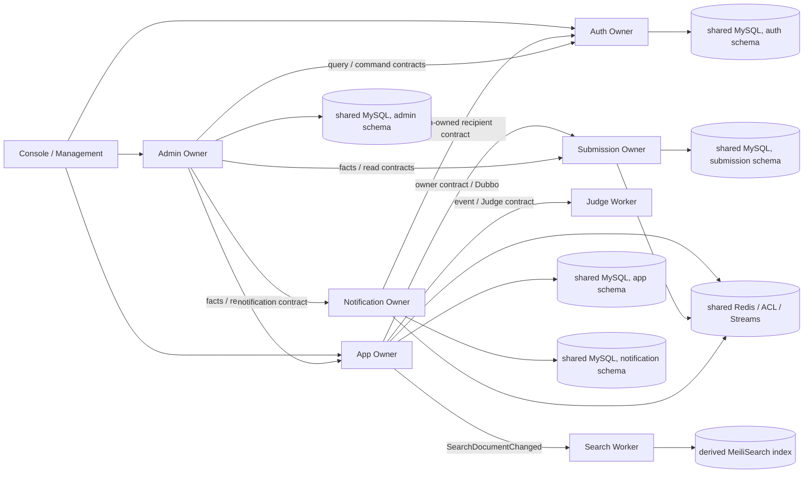
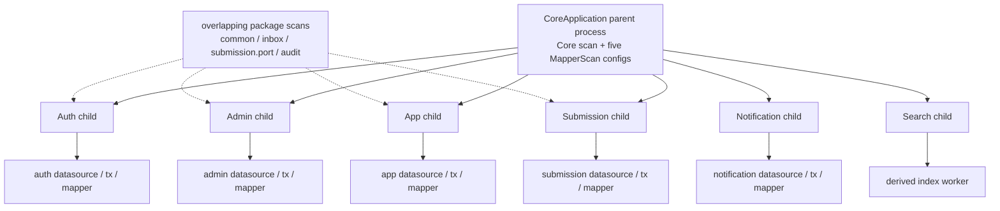
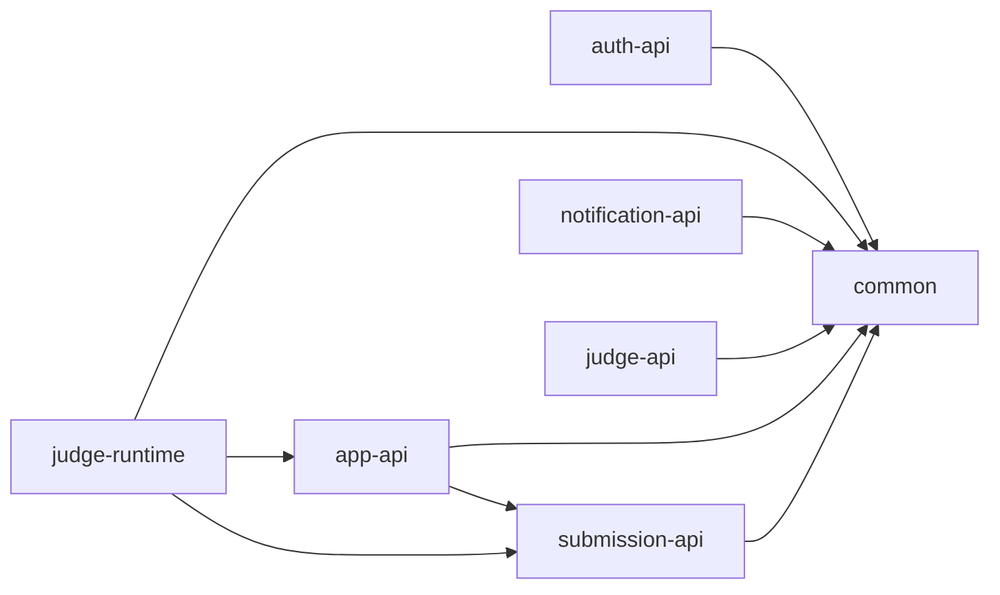
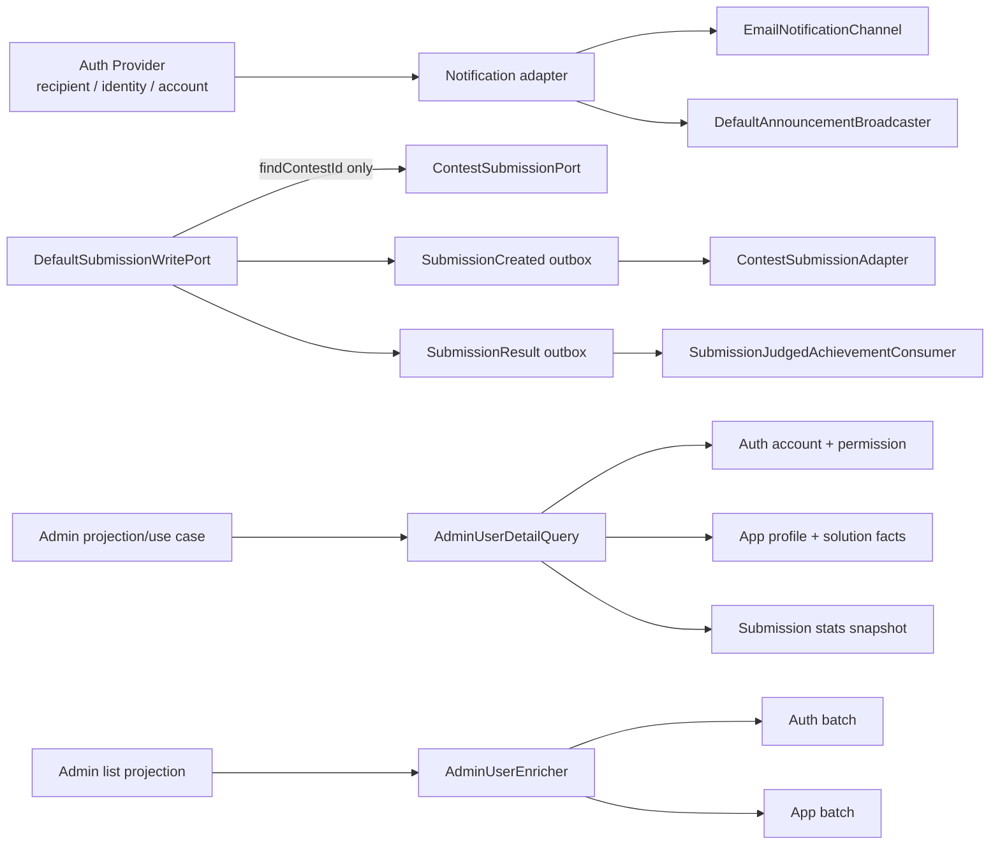
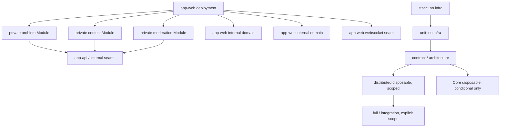
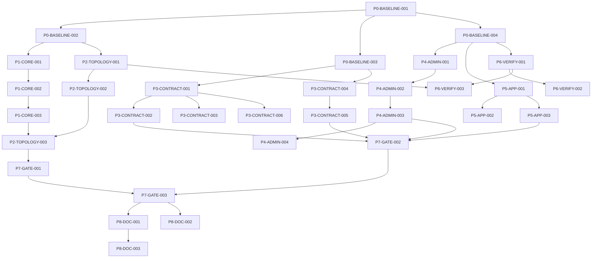

# UltiCode 拓扑收敛、Contract 所有权与深 Module 整改任务计划

> 状态：`PLAN PERSISTED — IMPLEMENTATION NOT STARTED`
>
> 日期：2026-09-05
>
> 计划模式：`PLAN ONLY`；本文件是后续实施的唯一任务计划，不是实施记录。
>
> 当前默认拓扑：`distributed`；`Core` 仅为 `CONDITIONAL` 实验。
>
> 事实优先级：当前 Java 源码、Maven POM、配置、启动脚本和测试高于历史文档、图谱和记忆。

## 1. 执行结论

本轮确认的重点不是“再拆几个服务”，而是先收敛已经存在的 Module、Interface、Implementation、Depth、Seam、Adapter、Leverage 和 Locality。

| 分类 | 结论 |
| --- | --- |
| `ACTIVE_NOW` | Core 启用 Owner child context 时存在同一 classpath 的跨 Owner package/Bean 泄漏；`CoreOwnerContextManager#start` 没有显式 parent 关系，且 Core parent 自身装配多组 MapperScan。 |
| `ACTIVE_NOW` | `app-api` 同时承载跨 Owner Contract、App 内部 outbound port 和已过渡的兼容 Interface；`UserNotificationReadPort` 的当前位置与实际 Provider/Consumer 方向不匹配。 |
| `ACTIVE_NOW` | `ContestSubmissionPort` 混合旧同步 mutation、contest fact query 和 event 兼容路径；`recordSubmissionIfNeeded` 当前没有生产调用者，不能继续作为默认同步写 Seam。 |
| `ACTIVE_NOW` | Admin 已有深 Module 雏形，但仍有列表 N+1、`enrichOne` 顺序扇出、协调扫描无全局上限和部分失败语义不一致等治理任务。 |
| `ACTIVE_NOW` | App 的 Problem、Contest、Moderation 已有私有 Maven Module，但 `app-web` 仍是主要 Implementation locality；当前证据不足以新增物理服务。 |
| `ACTIVE_NOW` | `static`/`unit` 已有零基础设施方向，但验证脚本、Core 条件 journey、CI scope 和文档语义仍需形成单一可执行矩阵。 |
| `CONDITIONAL` | Core 是否保留只由 `GATE-TOPOLOGY-DECISION` 选择 `PROMOTE_LATER`、`RETAIN_TEMPORARILY_WITH_EXPIRY` 或 `REMOVE_CORE_EXPERIMENT`；当前不能提升为默认。 |
| `GUARDRAIL` | Contract 唯一所有权、禁止 API Hub、禁止跨 Owner Implementation 依赖、禁止 Noop 掩盖必需行为、禁止新 deployable 是持续门禁。 |
| `ACCEPTED_TRADEOFF` | 单机参考拓扑共享 MySQL、Redis、Nacos；Search 使用 MeiliSearch。仅维护已有能力和证据，不生成企业级基础设施整改。 |
| `DEFERRED_UNTIL_TRIGGER` | Admin event read model、真实 HA、生产 mixed-version、远端 Judge TLS、独立生产回滚和容量证明。 |
| `REJECTED_FOR_NOW` | 新增物理业务服务、重新合并 Owner、Submission 双写、Judge/Search 并回 App、五套数据库、Kubernetes、Kafka、Service Mesh、Seata。 |

唯一明确的当前 Core OPEN 阻塞是：**启用 Owner child assembly 在 bean wiring 阶段因跨 Owner package leakage 失败**。它早于 DB/Redis 交互，不应通过增加 `@Primary`、扫描顺序或更多排除项掩盖。

当前裁决固定为：

```text
当前默认：distributed
当前 Core 状态：CONDITIONAL
Core 最终去留：由 GATE-TOPOLOGY-DECISION 决定
```

## 2. 范围与非目标

### 覆盖范围

- `AREA-CORE`：Core parent/child context、package scan、Bean wiring、类加载隔离、local Adapter parity。
- `AREA-TOPOLOGY`：distributed 默认语义、Core 实验生命周期、双拓扑配置和验证收敛。
- `AREA-CONTRACT`：`app-api` inventory、所有权、API Module 依赖方向、Hub 回归防护。
- `AREA-CONTEST-SUBMISSION`：`ContestSubmissionPort` 方法级处置、Noop Adapter、Outbox/Event 唯一路径。
- `AREA-ADMIN`：Admin RPC inventory、深 Module、批量/并行、预算、失败和 freshness。
- `AREA-APP`：App Implementation locality、已有私有 Module 深度、真实变更触发的 pilot。
- `AREA-VALIDATION`：static、unit、contract、integration、disposable journey、full 的 scope 语义。
- `AREA-INFRA-ACCEPTED`：只记录共享基础设施接受项、边界和重新开启条件，不生成基础设施整改任务。

### 明确排除

- 本轮不新增业务服务、不把 App 拆成更多进程、不重新合并 Data Owner。
- 不建设 Admin event read model；只有达到明确量化触发条件才重新评估。
- 不恢复 Submission 同步双写，不把 Judge 或 Search 并回 App。
- 不规划五套独立数据库、Redis 集群、Nacos HA、Kubernetes、Kafka、Service Mesh、Seata 或企业级容灾平台。
- 不把静态调查、disposable 验证或仓库 CI 描述成生产证明。
- 本轮计划不执行实现、补丁、测试、服务启动、容器启动、数据库连接、迁移或提交；本次用户要求仅允许写入本地文档。

## 3. 当前证据基线

| 领域 | 当前事实 | 当前证据 | 判断类型 | 风险 | 可信度 |
| --- | --- | --- | --- | --- | --- |
| Core 启动 | `CoreApplication` 只扫描 `com.ulticode.core`；`CoreOwnerMapperConfigurations` 在 parent 注册五组 MapperScan；`CoreOwnerContextManager#start` 用独立 `SpringApplicationBuilder` 启动 child，但没有 `.parent(...)` 或 `setParent`。 | `services/core/src/main/java/com/ulticode/core/CoreApplication.java:18-35`; `CoreOwnerMapperConfigurations.java:13-74`; `CoreOwnerContextManager.java:217-275` | `CONFIRMED_SOURCE` | parent/child 可见性和数据访问边界不清晰。 | 高 |
| Core 泄漏 | Auth/Admin/App/Submission/Notification 的 scan 根包含 `com.ulticode.common`、`com.ulticode.modules.event.inbox`、`com.ulticode.modules.submission.*` 等跨 jar 重叠包；同 classpath smoke 已在 wiring 阶段失败。 | `services/core/src/main/java/com/ulticode/core/CoreOwnerBootConfigurations.java:21-165`; `services/docs/SERVICES_ISSUES.md:30-83` | `CONFIRMED_SOURCE_AND_RECORDED_RUNTIME_EVIDENCE` | 不能证明 Core 与 distributed 同构。 | 高 |
| Core 拓扑范围 | `CoreModuleRegistry` 注册 Auth、Admin、App、Submission、Notification、Search 六个 child；DevStack Core scope 主要启动 Core + Judge，Search 又被描述为独立 Worker。 | `services/core/src/main/java/com/ulticode/core/CoreModuleRegistry.java:13-32`; `scripts/dev/devstack-manifest.sh:7-16,43-55,578-618` | `CONFIRMED_SOURCE` | Core profile 的实际 scope 与 registry 语义不一致。 | 高 |
| distributed 默认 | 文档和脚本仍将 distributed 作为默认，Core 为 opt-in；Core readiness 仅提供 `/api/v1/core/health/ready`，没有业务 HTTP 路由。 | `docs/architecture/overview.md:20-40`; `services/core/src/main/java/com/ulticode/core/web/CoreReadinessController.java:10-29`; `ecosystem.config.cjs:106-125` | `CONFIRMED_SOURCE` | 双拓扑若都被视为一等入口会扩大维护成本。 | 高 |
| API Hub | Root reactor 同时包含 `api/*`、Owner、Worker、Core；`app-api` 有 116 个 Java 文件、42 个 Service Interface，并直接依赖 `backend-submission-api`。 | `services/pom.xml:20-42`; `services/api/app-api/pom.xml:12-38`; `services/api/app-api/src/main/java` inventory | `CONFIRMED_SOURCE` | App Contract 生命周期与其他 Owner/内部 port 混在一起。 | 高 |
| UserNotificationReadPort | Interface 位于 `app-api`；`DubboUserNotificationReadAdapter` 实际由 Notification 使用并调用 Auth 的两个查询 Contract；生产消费者是 Notification 的邮件和公告广播路径，没有 App Provider。 | `services/api/app-api/src/main/java/com/ulticode/app/api/service/UserNotificationReadPort.java:16-33`; `services/notification/src/main/java/com/ulticode/notification/adapter/DubboUserNotificationReadAdapter.java:20-101`; `services/notification/src/main/java/com/ulticode/notification/.../EmailNotificationChannel.java`; `NotificationApiContractShapeTest.java:12-36` | `CONFIRMED_SOURCE; test/doc drift` | Contract owner 与 consumer-owned outbound port 混淆，包移动会影响二进制兼容。 | 高 |
| ContestSubmissionPort | Interface 有 `recordSubmissionIfNeeded`、`isVirtualParticipation`、`isContestSubmission`、`findContestId` 四类职责；生产主路径使用 SubmissionCreated/Result event，`recordSubmissionIfNeeded` 无当前生产 caller。 | `services/api/app-api/src/main/java/com/ulticode/app/api/service/ContestSubmissionPort.java:3-64`; `services/app/app-web/src/main/java/com/ulticode/modules/contest/integration/ContestSubmissionAdapter.java:29-211`; `services/submission/src/main/java/com/ulticode/modules/submission/port/DefaultSubmissionWritePort.java:68-363`; `services/submission/src/main/java/com/ulticode/submission/port/adapter/NoopContestSubmissionPort.java:14-70` | `CONFIRMED_SOURCE` | 旧同步 mutation、查询和兼容注入会遮蔽单写者边界。 | 高 |
| Admin 编排 | `AdminUserDetailQuery` 已是 use-case 深 Interface；详情第一轮 Auth、第二轮并行 Auth/App/Submission；`AdminUserEnricher` 批量路径有受控并发，但 `enrichOne` 被多个 projection 顺序使用；Contest/Problem 列表仍有逐行调用。 | `services/admin/src/main/java/com/ulticode/modules/admin/query/AdminUserDetailQuery.java:10-24`; `DefaultAdminUserDetailQuery.java:49-682`; `AdminUserEnricher.java:253-499`; `DefaultAdminContestProjection.java:38-105`; `DefaultAdminProblemListProjection.java:51-114` | `CONFIRMED_SOURCE` | RPC 数、wall time 和 Provider 故障随页面规模放大。 | 高 |
| Admin 协调扫描 | `OwnerReconciler` 分页处理 Submission、Notification、Audit，但源码没有发现全局最大页数/总记录数上限。 | `services/admin/src/main/java/com/ulticode/modules/admin/reconciliation/OwnerReconciler.java:311-465`; `docs/architecture/evidence/P3-ADMIN-001-admin-budget-manifest.md:245-251` | `CONFIRMED_SOURCE` | 扫描可能长期运行并扩大跨 Owner 依赖。 | 高 |
| App locality | App Web 仍有约 666 个 main Java 文件；Problem/Contest/Moderation 是私有 Module，`app-web` 仍聚合 Web、业务、配置和多 domain。 | `services/app/pom.xml:18-29`; `services/app/app-web/pom.xml:16-75`; `services/app/app-web/src/main/java` inventory | `CONFIRMED_SOURCE` | Module 名称可能先于真实复杂度，物理拆分会增加操作成本。 | 中高 |
| Validation | `test.sh static/unit/core` 已有分层入口；unit profile 排除 IT，但 zero-infra contract 仍会清理 ignored coverage 目录，CI 没有 enabled-owner Core journey。 | `scripts/dev/test.sh:19-43,252-281`; `scripts/test/zero-infra-validation-contract.sh:39-60,102-141`; `.github/workflows/_backend.yml:18-120` | `CONFIRMED_SOURCE` | 贡献者成本和实际 scope 语义可能再次漂移。 | 高 |
| 文档漂移 | `CONTEXT.md` 仍描述旧 ContestSubmission 同步语义；`judge-runtime/pom.xml` 的描述与 App 当前不依赖 runtime 的事实不完全一致；部分 Contract shape test 仍锁定旧包名。 | `CONTEXT.md:30,82`; `services/judge-runtime/pom.xml:17`; `services/api/app-api/src/test/.../NotificationApiContractShapeTest.java:12-36` | `CONFIRMED_DRIFT` | Coding Agent 可能按旧文档重新引入已删除路径。 | 高 |

图谱是 Tier 2 辅助证据：当前 graph project `UltiCode` 已 indexed，但部分 Core 文件不在图谱中，且存在 parse-partial/排除范围；因此本计划对 Core 和负面结论以直接源码为准，不把图谱数量当作完整性证明。

## 4. 架构和调用地图

### 4.1 distributed 拓扑



文字约束：Owner 负责自己的事实和事务；Worker 不持有业务表；跨 Owner 只能通过 provider-owned Contract、consumer-owned outbound port 或 Outbox/Inbox/Event；共享基础设施的故障域是接受项，不等于共享数据所有权。

### 4.2 Core parent/child context



当前问题不是“少一个排除项”，而是 child context 之间缺少可证明的类加载与 Bean allowlist；同一 classpath 让包名重叠的 Implementation 彼此可见。

### 4.3 API Module 依赖图



`app-api -> submission-api` 不在计划中被直接删除；先由 `P0-BASELINE-003` 列出真实类型引用，再由 `P3-CONTRACT-006` 逐类型决定保留、迁移或弃用。

### 4.4 Contract、Contest/Submission 和 Admin 调用图



### 4.5 App Module 图和验证层级



## 5. 冲突与残留 Seam 清单

| ID | 当前实现 | 当前 Contract/文档 | 错位 | 影响 | 所需决策 |
| --- | --- | --- | --- | --- | --- |
| `SEAM-CORE-001` | Core child 使用重叠 package scan；parent 配置含多组 MapperScan。 | `ADR-0010` 和当前状态描述了 parent/child 目标，但未证明所有 child Bean 隔离。 | 目标拓扑与可运行 Implementation 不一致。 | Core 只能是条件实验。 | 选择类加载隔离或等价 allowlist；Gate 失败默认删除。 |
| `SEAM-TOPOLOGY-001` | Core registry 有六 child，DevStack Core scope 主要是 Core + Judge，Search 又是独立 Worker。 | `overview.md` 同时描述 distributed 与 Core。 | 两套 topology 的组件集合、启动顺序和 readiness 语义不够一致。 | 维护两个半成品入口。 | distributed 保持唯一默认；Core 设 expiry 和去留 Gate。 |
| `SEAM-CONTRACT-001` | `app-api` 有大量 Interface 并直接依赖 Submission API。 | Catalog 和 Contract shape test 仍包含 App-owned/旧包名语义。 | Contract owner、provider、consumer port 未逐项分层。 | API Hub、循环依赖和错误兼容责任。 | 逐类型 inventory，禁止无证据的大搬迁。 |
| `SEAM-CONTRACT-002` | `UserNotificationReadPort` 位于 App API，实际 Adapter 在 Notification 调 Auth。 | Javadoc 和测试把它当 App contract。 | 这是 Notification 的 outbound need，不是 App provider capability。 | 版本和 DTO 所有权错误。 | 优先内部化到 Notification；保留 Auth-owned recipient Contract。 |
| `SEAM-CONTEST-001` | `ContestSubmissionPort` 混有同步 mutation、virtual/contest 判断和 contestId 查询。 | Javadoc 仍保留旧同步语义；event 路径已是主路径。 | 一个 Interface 代表多种事实和生命周期。 | 容易重启双写或让旧写路径复活。 | 删除失效 mutation；按调用和 owner 决定查询是否内部化/保留。 |
| `SEAM-CONTEST-002` | Submission 注入 `NoopContestSubmissionPort`。 | Noop Javadoc 声称 event path canonical。 | Noop 可能隐藏必需行为，也可能只是可选 compatibility。 | 静默成功和隐藏调用路径。 | 先证明可达性，再删除或将其限制为明确 optional profile。 |
| `SEAM-ADMIN-001` | `enrichOne` 顺序调用多个 Owner；Contest/Problem list 有逐行调用。 | Admin budget manifest 有历史/当前行混合。 | 深 Module 与实际 fanout/预算没有完全绑定。 | N+1、延迟叠加、故障传播。 | use-case 级 Interface、batch、bounded parallel、typed degradation。 |
| `SEAM-APP-001` | 私有 Maven Module 已存在，但 Implementation 仍集中在 app-web。 | 旧计划以 Module 名称和 LOC 作为候选线索。 | Module 名称不自动等于深 Module 或部署边界。 | 纯目录搬迁会增加 coupling。 | 以 deletion test、Locality、事务和真实变更决定。 |
| `SEAM-VERIFY-001` | static/unit/core/full 入口并存，zero-infra 有 ignored coverage 清理。 | 文档把 unit 描述为零基础设施，但 Core journey 尚无 dedicated enabled-owner 入口。 | 名称、依赖和实际行为可能再次漂移。 | 一人贡献者成本失控。 | 建立 scope matrix 和 anti-infra gate。 |
| `SEAM-DOC-001` | `CONTEXT.md`、Judge runtime POM 描述和 Contract shape test 仍有旧事实。 | `docs/index.md` 规定源码/配置优先。 | 文档与源码不一致。 | 未来 Agent 重复旧整改。 | P8 只修正 canonical 文档和漂移门禁。 |

## 6. 目标状态

- **Core 条件实验**：Core 只有一个 parent 入口；每个 child 有显式 allowlist、类加载边界、数据源/Mapper/事务边界和 local Adapter 装配清单。任何 child 失败都进入明确 FAILED/NOT_READY，不借助 Bean 覆盖制造假成功。Core 通过 Gate 后仍需单独拓扑评审才能提升默认；失败则删除 Core 专属入口、配置、Adapter、测试、脚本和文档引用。
- **拓扑**：`distributed` 是本地、CI、disposable 和文档的唯一默认；Core 只由显式 profile 触发，带实验 expiry、维护成本预算和 3-way decision。
- **Contract 所有权**：每个跨 Owner Contract 有唯一 Contract owner、data owner、Provider、Consumer、transport、版本、失败语义和 freshness。Consumer-owned outbound port 留在 Consumer 私有 Module；`app-api` 不再充当 API Hub。
- **Contest/Submission Seam**：Submission 继续单写；旧同步 `recordSubmissionIfNeeded` 语义删除或显式弃用，Outbox/Event 是主路径；有效查询只保留在真正需要它的 owner/internal seam，不把一个混合 Interface 拆成三个新的公开远程 Interface。
- **Admin 深 Module**：页面和 use case 只依赖 `loadUserDetail`、批量事实或等价窄 Interface；多 Owner 编排、timeout、并发、fallback、freshness、partial failure 和指标藏在 Implementation 中。空数据、无权限、超时、Provider 失败不能混淆。
- **App Locality**：App 仍是一个业务进程；Problem/Contest/Moderation 继续深化现有私有 Module；Forum/Solution 只有发生真实变更且通过准入评分才 pilot，不因文件数或路由数新建服务。
- **验证入口**：`static`/`unit` 不启动 Docker、不连接任何基础设施、不启动 Owner/Judge/Search；Contract/architecture 只验证边界；distributed disposable 按 scope；Core journey 仅条件分支。
- **共享基础设施边界**：接受共享 MySQL/Redis/Nacos 和单机参考拓扑的故障域；仅保留已有 ACL、fallback、backup/runbook 等能力，不生成新平台整改。重新开启必须有采用者、第二主机、明确 SLO/容量事故或专门运维角色。

## 7. 分阶段路线图

| 阶段 | 目标 | 主要产出 | 进入条件 | 退出条件 | 后续 Gate |
| --- | --- | --- | --- | --- | --- |
| P0 | 冻结事实和地图 | Core context/Bean map、API inventory、Contest 方法矩阵、Admin/App/验证基线、漂移清单 | 当前源码可读，graph 限制已披露 | 每个关键判断有精确 source reference | `GATE-BASELINE-FROZEN` |
| P1 | 证明 Core 是否可隔离 | allowlist/classloader 方案、local/remote parity、enabled-owner journey 计划 | P0 Core 证据完成 | 通过或明确阻塞 `GATE-CORE-LOAD-ISOLATION` | `GATE-CORE-LOCAL-ADAPTER-PARITY` |
| P2 | 收敛双拓扑 | distributed default、Core expiry、配置/脚本/CI 差异矩阵、三路去留输出 | P1 的 Core 结论可评审 | 不再有两个一等默认入口 | `GATE-TOPOLOGY-DECISION` |
| P3 | 收敛 Contract 和残留 Seam | app-api ownership catalog、UserNotification 裁决、Contest/Noop 退出路径、API anti-Hub gate | P0 API/调用证据完成 | Contract、Owner 和删除顺序明确 | `GATE-CONTRACT-OWNERSHIP` / `GATE-CONTEST-SUBMISSION-SEAM` |
| P4 | 深化 Admin 同步编排 | use-case budget、batch/parallel、typed degradation、fanout metrics、event model 条件裁决 | P0 Admin map 完成 | 核心 use case 预算可测，N+1 有退出条件 | `GATE-ADMIN-DEEP-MODULE` |
| P5 | 深化 App 内部 Locality | 域 inventory、Module scorecard、一个真实变更 pilot、no-new-deployable gate | P0 App map 完成 | pilot 通过或有证据的 NO-GO | `GATE-APP-INTERNAL-LOCALITY` |
| P6 | 固化贡献者验证 | scope matrix、zero-infra static/unit、distributed/Core 分支和 CI gate | P0 验证基线完成 | 轻量入口成本和行为可验证 | `GATE-ZERO-INFRA-VERIFY` |
| P7 | 跨领域裁决 | Gate pack、最终集成矩阵、Core keep/remove 两条分支 | P1-P6 有输入 | 每个失败可定位且默认 fail closed | `GATE-DOCUMENT-CONSISTENCY` |
| P8 | 文档和状态收敛 | 本计划、ADR、current-status、SVC-025、漂移检查 | P7 产出决策 | 计划、状态、问题、ADR 各自只有一个权威来源 | `GATE-DOCUMENT-CONSISTENCY` |

## 8. 完整任务注册表

以下任务是本计划的完整实施索引。所有任务均为后续实施计划；本次只持久化文档，不执行其中的 `planned actions` 或 `validation commands`。每个任务的字段保持完整，YAML 见第 19 节。

### P0：事实基线与依赖地图

## P0-BASELINE-001 冻结当前事实、覆盖边界与文档漂移

- Phase: P0
- Area: `AREA-CORE`, `AREA-TOPOLOGY`, `AREA-CONTRACT`, `AREA-CONTEST-SUBMISSION`, `AREA-ADMIN`, `AREA-APP`, `AREA-VALIDATION`, `AREA-INFRA-ACCEPTED`
- Priority: HIGH
- Status: `PLANNED`
- Estimated size: `M`
- Objective: 形成当前源码优先的单一证据基线。
- Problem statement: 历史计划、CONTEXT、ADR、Issue registry 和当前源码存在时态或语义差异，不能直接用旧状态指导实施。
- Current evidence: `AGENTS.md`; `docs/index.md`; `services/docs/SERVICES_ISSUES.md:1-83`; 当前 Core、API、Admin、App、脚本和 POM。
- Fact classification: `CONFIRMED_SOURCE`、`CONFIRMED_DRIFT`、`STATIC_INFERENCE` 分栏；不得把静态推断写成运行事实。
- Decision required: 确认每项事实的 canonical source 和是否进入任务。
- Assumptions: 当前 branch/source 可读；生产环境不存在，不以外部状态补事实。
- Affected modules: `services/core`, `services/api/*`, `services/admin`, `services/app`, `services/submission`, `services/notification`, `scripts`, `docs`。
- Affected profiles: `distributed`, `core`, `unit`, `static`。
- Affected interfaces: 所有本轮列出的 Contract 和内部 outbound port。
- Contract owner: 不改变；本任务只记录 owner 候选和未知项。
- Data owner impact: 只建立矩阵，不改变写入权。
- Runtime topology impact: 只读比较 distributed/Core。
- Behavioral compatibility impact: 无实施行为变化；后续任务必须引用此基线。
- Binary compatibility impact: 无；移动 Contract 前必须取得本任务交付物。
- Planned actions: 生成 source/POM/config/script/doc evidence index；标注 graph coverage 限制；列出已完成项和不可重复任务。
- Expected file scope: 计划实施时仅限 `docs/architecture/evidence/` 或现有 canonical 文档；本次不新增 raw evidence。
- Deliverables: evidence index、drift list、resolved-vs-open matrix。
- Acceptance criteria: 每个关键判断都有文件行号、类方法、POM dependency、profile 或脚本函数；没有“全仓 grep 所以确认”的结论。
- Validation method: 只读 source-reference review、路径覆盖检查、文档交叉链接检查。
- Validation commands: `rg -n "Core|UserNotificationReadPort|ContestSubmissionPort|AdminUserEnricher|distributed|unit" services docs scripts`; `git diff --check`（实施时）。
- Dependencies: none
- Parallelizable with: `P0-BASELINE-002`, `P0-BASELINE-003`, `P0-BASELINE-004`（共享事实表完成后合并）。
- Risks: 旧文档再次覆盖源码；图谱缺失被误当不存在。
- Migration or deprecation strategy: 为旧描述标记历史/漂移，不删除历史 ADR。
- Rollback or removal strategy: 删除新增 evidence index，不影响运行时。
- Decision gate: `GATE-BASELINE-FROZEN`
- Out of scope: 测试、服务启动、数据库连接、基础设施修复。
- Source references: `AGENTS.md`; `docs/index.md`; `docs/project/current-status.md:1-90`; `services/docs/SERVICES_ISSUES.md:1-83`。

## P0-BASELINE-002 建立 Core parent/child、package scan 与 Bean 注册矩阵

- Phase: P0
- Area: `AREA-CORE`
- Priority: HIGH
- Status: `PLANNED`
- Estimated size: `M`
- Objective: 对每个 Core child 记录启动类、scan root、MapperScan、DataSource、TransactionManager、Adapter、Scheduler 和禁止加载项。
- Problem statement: 当前 Core 失败发生在 wiring 阶段，但现有 smoke 没有覆盖 enabled Owner 的完整 Bean 图。
- Current evidence: `CoreApplication.java:18-35`; `CoreOwnerBootConfigurations.java:21-165`; `CoreOwnerMapperConfigurations.java:13-74`; `CoreOwnerDataSourceConfiguration.java:17-145`; `CoreOwnerContextManager.java:217-275`。
- Fact classification: package overlap 是 `CONFIRMED_SOURCE`；完整 child Bean graph 是 `RUNTIME_EVIDENCE_REQUIRED`。
- Decision required: child allowlist 与 parent/child 可见性方向。
- Assumptions: 不通过新增第二套 Owner Implementation 解决启动问题。
- Affected modules: `services/core`, 五个 Owner、`search`, `platform/common`, `platform/integration-inbox`。
- Affected profiles: `core`。
- Affected interfaces: local Adapter、Owner Mapper/transaction seams。
- Contract owner: 各 provider Owner；Core 不是业务 Contract owner。
- Data owner impact: Core 只能装配 Owner 已有 Implementation，不取得额外写权。
- Runtime topology impact: 直接影响 Core child assembly，不改变 distributed 默认。
- Behavioral compatibility impact: 目标是与 distributed 相同的业务语义，不允许 Core 专属规则。
- Binary compatibility impact: 可能影响 Core 专属 bootstrap；不得先移动公开 API。
- Planned actions: 建矩阵；区分 package visibility、classloader visibility、Spring Bean visibility；列出 leakage root cause 和最小隔离方案。
- Expected file scope: Core boot/config/test 与 evidence 文档。
- Deliverables: `core-context-bean-matrix`、leakage list、allowlist proposal。
- Acceptance criteria: 每个 child 有明确 allowlist/denylist、数据源和 Mapper owner；每个跨 Owner Bean 都有来源和处理结论。
- Validation method: graph query + direct source read + enabled-owner disposable smoke（后续实施时）。
- Validation commands: `./scripts/test/core-profile-contract.sh`; `rg -n "ComponentScan|MapperScan|Import|SpringApplicationBuilder|parent" services/core`（实施时）。
- Dependencies: `P0-BASELINE-001`
- Parallelizable with: `P0-BASELINE-003`, `P0-BASELINE-004`
- Risks: 将静态 scan 矩阵误当成完整 runtime Bean 图。
- Migration or deprecation strategy: 先增加 allowlist/检测，再逐步收窄 scan；不一次性删除 Owner 配置。
- Rollback or removal strategy: Core-only 配置可回退；distributed 不依赖 Core。
- Decision gate: `GATE-CORE-LOAD-ISOLATION`
- Out of scope: 修复代码、默认 topology 切换、物理服务拆分。
- Source references: `services/core/src/main/java/com/ulticode/core/CoreApplication.java:18-35`; `CoreOwnerBootConfigurations.java:21-165`; `CoreOwnerContextManager.java:217-275`。

## P0-BASELINE-003 建立 API Module 与 Contract 所有权 inventory

- Phase: P0
- Area: `AREA-CONTRACT`
- Priority: HIGH
- Status: `PLANNED`
- Estimated size: `L`
- Objective: 为 `services/api/*` 和 `app-api` 每个公开类型建立 owner/provider/consumer/transport/版本/失败/freshness 记录。
- Problem statement: Interface 名称或所在包不能证明所有权；`app-api` 可能是错误的 Contract Hub。
- Current evidence: `services/api/app-api/pom.xml:12-38`; `app-api` 约 116 Java files/42 interfaces；`P2-APP-001-app-api-catalog.md:22-91`。
- Fact classification: 类型 inventory 是 `CONFIRMED_SOURCE`；最终 owner 是 `DECISION_REQUIRED`。
- Decision required: `app-api -> submission-api` 每个类型的保留、迁移或删除结论。
- Assumptions: 不做大规模一次性包移动；保留现有远程兼容期。
- Affected modules: `services/api/app-api`, `auth-api`, `submission-api`, `notification-api`, `judge-api`, `judge-runtime` 及所有 consumer。
- Affected profiles: `distributed`, `core`, `unit`, `contract`。
- Affected interfaces: `UserNotificationReadPort`, `ContestSubmissionPort` 和所有 app-api public types。
- Contract owner: 按 capability/data/Provider 逐项裁决。
- Data owner impact: 只读建立归属，不改变单写者。
- Runtime topology impact: Core parity 需要使用相同 provider semantics。
- Behavioral compatibility impact: 迁移时保持 DTO/错误/freshness 语义，必要时保留 deprecated bridge。
- Binary compatibility impact: POM 和 package 移动可能影响编译；需要顺序迁移和 consumer cutover。
- Planned actions: 读取每个类型的实现和 caller；给出三类标签：provider-owned remote、consumer-owned outbound、App-private Implementation seam；检查 API Hub 反向依赖。
- Expected file scope: API inventory、contract gate、受影响 POM/Java tests 的后续 PR。
- Deliverables: full ownership matrix、dependency graph、migration order。
- Acceptance criteria: 每个公开 Interface 只有一个 owner；每个 owner 有 provider 和 consumer；未知项显式标 `BLOCKED` 或 `CONDITIONAL`，不凭命名猜测。
- Validation method: compile dependency graph、consumer trace、API boundary contract test plan。
- Validation commands: `./scripts/test/api-contract-boundary-contract.sh`; `rg -n "^import com\.ulticode\.(app|submission|auth|notification|judge)\.api" services`（实施时）。
- Dependencies: `P0-BASELINE-001`
- Parallelizable with: `P0-BASELINE-002`, `P0-BASELINE-004`
- Risks: 一次性移动 DTO 造成循环依赖或旧 consumer 编译失败。
- Migration or deprecation strategy: 先迁移类型和 consumer，再删除旧 package；保留明确 expiry 的 deprecated bridge。
- Rollback or removal strategy: 在所有 consumer cutover 前保留旧 binary-compatible adapter；不得回退到 Implementation 依赖。
- Decision gate: `GATE-CONTRACT-OWNERSHIP`
- Out of scope: 新增业务能力、新远程服务、修改运行时行为。
- Source references: `services/api/app-api/pom.xml:12-38`; `docs/architecture/evidence/P2-APP-001-app-api-catalog.md:22-91`; `scripts/test/api-contract-boundary-contract.sh:49-68,94-95,122-205`。

## P0-BASELINE-004 建立 Admin、App 与验证 scope 基线

- Phase: P0
- Area: `AREA-ADMIN`, `AREA-APP`, `AREA-VALIDATION`
- Priority: HIGH
- Status: `PLANNED`
- Estimated size: `M`
- Objective: 把 Admin use case、App domain locality 和验证依赖放到同一 scope matrix。
- Problem statement: 文件/路由数量只能提供线索；缺少调用、事务、数据、测试和环境依赖矩阵会诱发错误拆分。
- Current evidence: `AdminUserEnricher.java:253-499`; `DefaultAdminUserDetailQuery.java:164-253`; `DefaultAdminContestProjection.java:38-105`; `DefaultAdminProblemListProjection.java:51-114`; `AppModuleSplitAdmissionGateTest.java:8-63`; `scripts/dev/test.sh:19-43,252-281`。
- Fact classification: caller/data/transaction 由源码确认；P95/P99 和真实修改频率需后续测量。
- Decision required: 哪些 use case 值得深化、哪些 App candidate 只能 `REASSESS_ON_CHANGE`。
- Assumptions: 贡献者默认没有真实 dev/prod environment。
- Affected modules: `services/admin`, `services/app`, `services/app/app-web`, private modules, scripts/CI。
- Affected profiles: `admin`, `app`, `distributed`, `core`, `static`, `unit`, `full`。
- Affected interfaces: `AdminUserDetailQuery`, batch read ports、内部 Module Interfaces。
- Contract owner: Admin use-case Interface 由 Admin；跨 Owner facts 由对应 Owner。
- Data owner impact: Admin 不直接访问其他 Owner DB。
- Runtime topology impact: 只选择验证 scope，不产生新 deployable。
- Behavioral compatibility impact: Admin response compatibility 和 degradation 要在后续任务明确。
- Binary compatibility impact: App private Module 可内部移动；公开 API 变化需独立 Contract review。
- Planned actions: 记录 route→use case→Interface→RPC→data/transaction→test chain；标出 N+1、sequential fanout 和 infra prerequisites。
- Expected file scope: Admin/App evidence、validation docs、现有 gate test 后续改动。
- Deliverables: Admin fanout matrix、App locality matrix、validation dependency matrix。
- Acceptance criteria: 每个候选都有 deletion test、consumer、data/transaction、test surface 和 environment cost；没有仅用 LOC 通过拆分。
- Validation method: trace path、source review、scope command review。
- Validation commands: `rg -n "@DubboReference|enrichOne|countProblemsByContestId|enrichAuthor" services/admin`; `./scripts/dev/test.sh --describe`（实施时）。
- Dependencies: `P0-BASELINE-001`
- Parallelizable with: `P0-BASELINE-002`, `P0-BASELINE-003`
- Risks: 历史 budget manifest 与当前 Implementation 混合。
- Migration or deprecation strategy: 历史快照保留历史语义，新增结论标当前 source。
- Rollback or removal strategy: evidence-only 变更可删除，不影响代码。
- Decision gate: `GATE-BASELINE-FROZEN`
- Out of scope: 真实性能压测、生产 SLO、物理 App 拆分。
- Source references: `services/admin/src/main/java/com/ulticode/modules/admin/query/DefaultAdminUserDetailQuery.java:164-253`; `services/app/app-web/src/test/.../AppModuleSplitAdmissionGateTest.java:8-63`; `scripts/dev/test.sh:19-43,252-281`。

### P1：Core 类加载隔离与可行性

## P1-CORE-001 定义 Owner child 的 allowlist 与类加载隔离方案

- Phase: P1
- Area: `AREA-CORE`
- Priority: HIGH
- Status: `PLANNED`
- Estimated size: `L`
- Objective: 让每个 Owner child 只加载自己的配置、Implementation、Mapper、Listener、Provider 和明确允许的 platform capability。
- Problem statement: 多 jar 同包扫描使 Auth/Search 拉入 Admin Audit、Admin 拉入 App Inbox、Submission 注册 BackendSubmissionApplication 等跨 Owner 泄漏。
- Current evidence: `CoreOwnerBootConfigurations.java:21-165`; package overlap `com.ulticode.common.audit`, `com.ulticode.modules.event.inbox`, `com.ulticode.modules.submission.port`; `SVC-025` runtime evidence。
- Fact classification: 泄漏根因是 `CONFIRMED_SOURCE_AND_RUNTIME_EVIDENCE`；哪种隔离实现成本最低是 `DECISION_REQUIRED`。
- Decision required: explicit classloader/jar isolation、等价 child classpath isolation，或证明 Core 不可维护并进入删除分支。
- Assumptions: 不以逐类排除清单作为长期唯一方案；不复制第二套业务 Implementation。
- Affected modules: `services/core`, Owner modules、shared platform.
- Affected profiles: `core` only; distributed is control comparison.
- Affected interfaces: child local Adapter assembly and platform seams.
- Contract owner: 各 Owner；Core 只提供 assembly。
- Data owner impact: 不增加数据访问；每 child 仍只有自己的 DataSource/Mapper。
- Runtime topology impact: Core enabled-owner startup and shutdown。
- Behavioral compatibility impact: 必须保持 Owner provider semantics，失败需 fail closed。
- Binary compatibility impact: 可能改变 Core packaging/classpath；distributed binary 不应受影响。
- Planned actions: 设计 classpath/loader boundary；定义 parent→child 与 child→child 可见性；将非法 Bean 类型作为 gate failure；记录维护成本。
- Expected file scope: Core bootstrap/build/profile/test and packaging contract。
- Deliverables: isolation design、allowlist matrix、cost estimate、failure branch。
- Acceptance criteria: 不靠 `@Primary`/Bean name/order；可自动检测 cross-owner Bean；每个 child context 能在无跨 Owner leakage 下初始化。
- Validation method: Core enabled-owner disposable smoke + Bean graph assertion + static gate。
- Validation commands: `./scripts/test/core-profile-contract.sh`; `./scripts/dev/test.sh core`（后续实施时，当前不运行）。
- Dependencies: `P0-BASELINE-002`
- Parallelizable with: `P1-CORE-002`（先共享 Contract matrix）。
- Risks: 隔离方案变成大量专用启动代码或隐式复制配置。
- Migration or deprecation strategy: 先只在 Core profile 试验；distributed 不变。
- Rollback or removal strategy: Core profile 可整体 disable/remove；不影响 Owner 独立启动。
- Decision gate: `GATE-CORE-LOAD-ISOLATION`
- Out of scope: 将 Core 提升默认、新平台、新物理服务。
- Source references: `services/core/src/main/java/com/ulticode/core/CoreOwnerContextManager.java:217-275`; `CoreOwnerBootConfigurations.java:21-165`; `services/docs/SERVICES_ISSUES.md:30-83`。

## P1-CORE-002 建立 Core local Adapter 与 Dubbo Adapter 行为 parity 矩阵

- Phase: P1
- Area: `AREA-CORE`, `AREA-CONTRACT`
- Priority: HIGH
- Status: `CONDITIONAL`
- Estimated size: `L`
- Objective: 证明 Core local call 与 distributed remote call 在返回值、异常、权限、事务、幂等和 freshness 上同义。
- Problem statement: 当前 Core 只有 Auth direct-permission local Adapter；Admin/App/Submission/Notification 仍依赖 Dubbo Adapter，不能宣称同构。
- Current evidence: `CoreLocalAuthorizationMutationAdapter.java:12-42`; `docs/project/current-status.md:39-54`; `services/core/src/test/.../CoreApplicationSmokeTest.java:14-18`。
- Fact classification: Auth local Adapter 存在是 `CONFIRMED_SOURCE`；其与所有远程路径的完整 parity 是 `UNPROVEN`。
- Decision required: 每个跨 Owner consumer 在 Core 本地化，或保留 Dubbo 并写明理由。
- Assumptions: local Adapter 不能直接穿透别的 Owner Mapper；不得为 Core 写第二套业务逻辑。
- Affected modules: Core、Auth、Admin、App、Submission、Notification、API modules。
- Affected profiles: `core`, `distributed`。
- Affected interfaces: Auth authorization、Admin facts、App/Submission/Notification read/write contracts。
- Contract owner: 原 provider Owner。
- Data owner impact: local call 仍经过 provider Owner Implementation 和本地事务。
- Runtime topology impact: Core only; distributed remains baseline。
- Behavioral compatibility impact: 需要保持 fail-closed、typed error、idempotency、outbox semantics。
- Binary compatibility impact: local Adapter 是 Core-private；公开 Contract 不因 Core 复制。
- Planned actions: 为每个 Contract 建 Adapter parity row；区分 required path、optional path、deferred path；为 parity test 设计同一契约输入输出。
- Expected file scope: Core local adapters、contract tests、Core profile gate。
- Deliverables: parity matrix、required/optional classification、test plan。
- Acceptance criteria: 每个 required Contract 有 local/remote 处理结论；差异都被解释且有 gate；无隐含 Core-only business rule。
- Validation method: Contract-level tests on both profiles and failure injection plan。
- Validation commands: `./scripts/test/api-contract-boundary-contract.sh`; `./scripts/test/core-profile-contract.sh`; `./scripts/dev/test.sh core`（后续实施时）。
- Dependencies: `P0-BASELINE-002`, `P0-BASELINE-003`, `P1-CORE-001`
- Parallelizable with: `P2-TOPOLOGY-001`, `P3-CONTRACT-001`
- Risks: 为了 parity 重复实现复杂业务或扩大 Core scope。
- Migration or deprecation strategy: 先保留 remote path 作为 control；local path 逐 Contract opt-in。
- Rollback or removal strategy: 删除未通过 parity 的 Core local Adapter，恢复 Core 条件失败而不影响 distributed。
- Decision gate: `GATE-CORE-LOCAL-ADAPTER-PARITY`
- Out of scope: 生产 remote Judge TLS、真实 mixed-version。
- Source references: `services/core/src/main/java/com/ulticode/core/adapter/CoreLocalAuthorizationMutationAdapter.java:12-42`; `docs/project/current-status.md:39-54`; `services/core/src/test/java/com/ulticode/core/CoreApplicationSmokeTest.java:14-18`。

## P1-CORE-003 设计 enabled-owner disposable journey、成本预算与实验 expiry

- Phase: P1
- Area: `AREA-CORE`, `AREA-TOPOLOGY`
- Priority: HIGH
- Status: `CONDITIONAL`
- Estimated size: `L`
- Objective: 让 Core 实验有一条可重复的启动→跨 Owner 调用→失败→关闭 journey，并有明确成本和 expiry。
- Problem statement: 现有 Core smoke 默认关闭 Owner contexts，不能证明启用路径；实验若无 expiry 会成为永久半成品。
- Current evidence: `CoreApplicationSmokeTest.java:14-18`; `CoreOwnerContextManager` timeout/CAS lifecycle；`scripts/dev/test.sh:275-281`; `devstack-manifest.sh:578-618`。
- Fact classification: 现有 smoke 是 `CONFIRMED_LIMITATION`；journey 结果是 `RUNTIME_EVIDENCE_REQUIRED`。
- Decision required: journey 最小业务路径、最长维护周期和失败时的去留分支。
- Assumptions: journey disposable，不是生产证明；不进入所有贡献者默认验证。
- Affected modules: Core、至少一个 Auth/Admin/App/Submission/Notification path、Judge/Search 条件 scope、scripts/CI。
- Affected profiles: `core`、显式 disposable；`distributed` control path。
- Affected interfaces: parity matrix 中 selected required Contracts。
- Contract owner: 相关 provider Owner。
- Data owner impact: 使用 disposable 数据，不改变 schema ownership。
- Runtime topology impact: Core experimental journey。
- Behavioral compatibility impact: 失败阶段必须可定位，readiness fail closed。
- Binary compatibility impact: 只增加条件验证入口；不改变默认 artifact。
- Planned actions: 定义最小 journey；记录资源依赖、启动顺序、健康检查、日志/Trace、数据一致性和关闭动作；建立成本 ledger 和 expiry。
- Expected file scope: `scripts/dev`, Core test/profile docs, CI conditional job if justified。
- Deliverables: journey definition、cost budget、expiry、failure report template。
- Acceptance criteria: journey 不手工补 Bean；至少覆盖一个跨 Owner path；任一依赖缺失返回明确失败；通过/失败都能触发 topology decision。
- Validation method: disposable Core journey, static contract and teardown check。
- Validation commands: `./scripts/dev/test.sh core`; `./scripts/test/core-profile-contract.sh`（后续实施时）。
- Dependencies: `P1-CORE-001`, `P1-CORE-002`
- Parallelizable with: `P2-TOPOLOGY-001`
- Risks: Core journey 变成所有贡献者必跑的重型环境；只测 readiness 不测业务路径。
- Migration or deprecation strategy: 仅以 `core` profile opt-in；expiry 到期必须重审。
- Rollback or removal strategy: 删除 Core-specific journey/script/config；distributed journey 保留。
- Decision gate: `GATE-CORE-DISPOSABLE-JOURNEY`
- Out of scope: 生产 HA、远端 Judge、长期 telemetry。
- Source references: `services/core/src/test/java/com/ulticode/core/CoreApplicationSmokeTest.java:14-18`; `scripts/dev/test.sh:275-281`; `scripts/dev/devstack-manifest.sh:578-618`。

### P2：拓扑收敛

## P2-TOPOLOGY-001 固化 distributed 唯一默认与 Core 实验生命周期

- Phase: P2
- Area: `AREA-TOPOLOGY`
- Priority: HIGH
- Status: `PLANNED`
- Estimated size: `M`
- Objective: 统一默认命令、profile、CI、disposable 和文档对 topology 的语义。
- Problem statement: Core、Judge、Search scope 和多套入口可能让贡献者误以为 Core 已是第二个正式默认。
- Current evidence: `docs/architecture/overview.md:20-40`; `scripts/dev/devstack-manifest.sh:7-16,43-55`; `ecosystem.config.cjs:106-125`。
- Fact classification: distributed default 是 `CONFIRMED_SOURCE/DOC`；Core lifecycle policy 尚需固化。
- Decision required: Core 是否有 expiry、谁审查、何时进入 3-way decision。
- Assumptions: 在 Gate 全部通过前绝不 flip default。
- Affected modules: scripts, Compose/profile docs, Core, CI, architecture docs。
- Affected profiles: `distributed`, `core`, `dev-lite`, `dev-full`。
- Affected interfaces: 无新增；只统一 scope。
- Contract owner: unchanged。
- Data owner impact: none。
- Runtime topology impact: default and opt-in semantics。
- Behavioral compatibility impact: 默认贡献者 journey 不变。
- Binary compatibility impact: none unless profile keys change, then compatibility aliases need expiry。
- Planned actions: 建 topology source-of-truth；标注 Core conditional；规定 expiry 和 default flip 禁止条件。
- Expected file scope: `docs/architecture/overview.md`, `docs/project/current-status.md`, `scripts/dev`, CI contract tests。
- Deliverables: topology matrix、default/conditional config table、expiry policy。
- Acceptance criteria: 所有默认命令指向 distributed；Core 只能显式 opt-in；没有两个一等默认；Core failed gate 不阻塞 distributed。
- Validation method: static script/config scan and docs link review。
- Validation commands: `./scripts/dev/test.sh --describe`; `rg -n "core|distributed|CORE_OWNER_CONTEXTS_ENABLED" scripts docs .github ecosystem.config.cjs`（实施时）。
- Dependencies: `P0-BASELINE-001`, `P0-BASELINE-002`
- Parallelizable with: `P1-CORE-003`, `P2-TOPOLOGY-002`
- Risks: 文档写默认，脚本实际却默认 Core；expiry 只写不检查。
- Migration or deprecation strategy: 保留 Core opt-in keys，新增明确 deprecation/expiry。
- Rollback or removal strategy: 恢复 distributed default；Core 不影响 owner processes。
- Decision gate: `GATE-TOPOLOGY-DECISION`
- Out of scope: default topology flip、生产发布。
- Source references: `docs/architecture/overview.md:20-40`; `scripts/dev/devstack-manifest.sh:578-618`; `ecosystem.config.cjs:106-125`。

## P2-TOPOLOGY-002 收敛双拓扑配置、启动、readiness 与验证差异矩阵

- Phase: P2
- Area: `AREA-TOPOLOGY`, `AREA-VALIDATION`
- Priority: HIGH
- Status: `PLANNED`
- Estimated size: `M`
- Objective: 对 distributed/Core 的配置来源、注册发现、启动顺序、健康检查、日志/Trace、数据一致性、失败语义和测试入口逐项对齐或标注差异。
- Problem statement: 当前 Core registry、DevStack scope、Search worker 和 readiness 之间存在集合差异；没有差异矩阵就无法判断 parity。
- Current evidence: `CoreModuleRegistry.java:13-32`; `CoreReadinessService.java:14-84`; `devstack-manifest.sh:338-395,411-426,578-618`; `docs/architecture/overview.md:34-40`。
- Fact classification: 配置/脚本差异是 `CONFIRMED_SOURCE`；运行顺序和日志 trace parity 是 `UNPROVEN`。
- Decision required: 哪些差异是 Core 实验允许的，哪些必须阻断。
- Assumptions: Core 不取得业务 HTTP 默认入口。
- Affected modules: Core, Owner boot, Search/Judge, DevStack, CI。
- Affected profiles: distributed/Core/dev-lite/dev-full。
- Affected interfaces: readiness、local/remote Adapter、event paths。
- Contract owner: provider Owner。
- Data owner impact: no new ownership。
- Runtime topology impact: direct。
- Behavioral compatibility impact: readiness and failure semantics must be explicit。
- Binary compatibility impact: profile keys and port docs may need compatibility alias。
- Planned actions: build matrix; compare config source, Nacos, Dubbo, datasource, Redis, Meili, startup, health, logs, data consistency and tests; mark must-match/allowed-difference。
- Expected file scope: topology evidence and affected scripts/docs。
- Deliverables: distributed/Core difference matrix and blocking criteria。
- Acceptance criteria: 每项差异有 reason、owner、验证方式和是否阻塞；未验证项不得写成 parity。
- Validation method: config contract checks plus conditional journey design。
- Validation commands: `./scripts/test/core-profile-contract.sh`; `./scripts/dev/test.sh --describe`; `git diff --check`（实施时）。
- Dependencies: `P0-BASELINE-002`, `P0-BASELINE-004`, `P2-TOPOLOGY-001`
- Parallelizable with: `P3-CONTRACT-001`, `P6-VERIFY-001`
- Risks: 只比较 port 和 process，不比较 Bean、failure、data semantics。
- Migration or deprecation strategy: 先标差异，再按 gate 逐项收敛；不复制两套全量测试。
- Rollback or removal strategy: 删除 Core-only matrix entries with Core removal branch。
- Decision gate: `GATE-TOPOLOGY-DECISION`
- Out of scope: 真实生产 mixed-version/failover。
- Source references: `services/core/src/main/java/com/ulticode/core/CoreModuleRegistry.java:13-32`; `CoreReadinessService.java:14-84`; `scripts/dev/devstack-manifest.sh:338-395,411-426`。

## P2-TOPOLOGY-003 形成 Core 三路去留决策记录与分支计划

- Phase: P2
- Area: `AREA-TOPOLOGY`, `AREA-CORE`
- Priority: HIGH
- Status: `CONDITIONAL`
- Estimated size: `M`
- Objective: 在 Core evidence 完成后只输出一个去留结果和对应保留/删除分支。
- Problem statement: Core 若只有“继续修”而没有 expiry，会长期维护两个半成品 topology。
- Current evidence: `SVC-025`; `ADR-0010`; `P1-CORE-001..003` planned evidence。
- Fact classification: 当前结果为 `CONDITIONAL`，不是 promote。
- Decision required: `PROMOTE_LATER`、`RETAIN_TEMPORARILY_WITH_EXPIRY` 或 `REMOVE_CORE_EXPERIMENT`。
- Assumptions: 任一核心 Gate 失败默认不能 promote；无明确收益默认 remove。
- Affected modules: Core 专属全部入口；distributed unaffected。
- Affected profiles: Core and default topology policy。
- Affected interfaces: local adapters and Core-only seams。
- Contract owner: provider Owners remain owners。
- Data owner impact: no remerge or new writer。
- Runtime topology impact: may remove Core or keep opt-in only。
- Behavioral compatibility impact: distributed remains behavior baseline。
- Binary compatibility impact: remove branch must enumerate artifacts/config/tests/docs。
- Planned actions: evaluate isolation, parity, journey, maintenance cost, duplication and future leverage; record decision and expiry/exit conditions。
- Expected file scope: ADR/current status/issue registry/plan references。
- Deliverables: one signed decision row and keep/remove branch checklist。
- Acceptance criteria: only one outcome; `PROMOTE_LATER` only if all core gates pass; retain has expiry and exit; remove has deletion closure。
- Validation method: Gate review and matrix completeness check。
- Validation commands: `rg -n "PROMOTE_LATER|RETAIN_TEMPORARILY_WITH_EXPIRY|REMOVE_CORE_EXPERIMENT" docs scripts`（实施时）。
- Dependencies: `P1-CORE-001`, `P1-CORE-002`, `P1-CORE-003`, `P2-TOPOLOGY-002`
- Parallelizable with: none; this is a decision point。
- Risks: 以“未来可能有用”无限期保留；把 experiment promote 当作自动动作。
- Migration or deprecation strategy: retain branch 必须有 expiry；remove branch 先停入口再删实现。
- Rollback or removal strategy: decision itself can be superseded by later ADR；distributed remains rollback anchor。
- Decision gate: `GATE-TOPOLOGY-DECISION`
- Out of scope: 本任务不自动切换默认、不自动删除代码。
- Source references: `docs/architecture/decisions/0010-core-judge-convergence-blockers.md:10-117`; `services/docs/SERVICES_ISSUES.md:30-83`。

### P3：Contract 所有权和残留 Seam

## P3-CONTRACT-001 对 app-api 全量 Interface 做所有权与方向分类

- Phase: P3
- Area: `AREA-CONTRACT`
- Priority: HIGH
- Status: `PLANNED`
- Estimated size: `L`
- Objective: 逐 Interface 区分 provider-owned remote Contract、consumer-owned outbound port 和 App-private Seam。
- Problem statement: app-api 的 42 个 Service Interface 混合了跨 Owner 能力、App 内部能力和兼容残留。
- Current evidence: `services/api/app-api` inventory；`P2-APP-001-app-api-catalog.md:22-91`；`app-api/pom.xml:12-38`。
- Fact classification: consumer/provider/caller 由 source trace 确认；owner disposition 是 `DECISION_REQUIRED`。
- Decision required: 每个类型的最终模块、deprecated bridge 和删除条件。
- Assumptions: 不根据 Interface 名称或包名直接判 Owner。
- Affected modules: app-api、auth-api、submission-api、notification、app-web、judge-runtime。
- Affected profiles: distributed/Core/contract。
- Affected interfaces: all app-api public types, emphasis on UserNotification/ContestSubmission/QueueHealth/Announcement。
- Contract owner: capability/data/semantic/version responsibility holder。
- Data owner impact: no direct DB change。
- Runtime topology impact: Core parity consumes resulting classification。
- Behavioral compatibility impact: preserve error, freshness and idempotency semantics。
- Binary compatibility impact: high for package/POM moves; staged migration required。
- Planned actions: inventory implementation/callers; mark transport, direction, version, failure, freshness; identify types with zero production callers。
- Expected file scope: app-api catalog, contract tests, POM and package moves in later PRs。
- Deliverables: complete matrix and migration order。
- Acceptance criteria: no unclassified public Interface; one owner; no entity/mapper/repository in remote Contract。
- Validation method: API boundary and dependency direction review。
- Validation commands: `./scripts/test/api-contract-boundary-contract.sh`; `./scripts/test/api-contract-arch-gate.sh`（实施时，若入口存在）。
- Dependencies: `P0-BASELINE-003`
- Parallelizable with: `P3-CONTRACT-003`, `P3-CONTRACT-004`
- Risks: catalog becomes second mutable truth; stale test locks wrong package。
- Migration or deprecation strategy: catalog is generated/checked from source; deprecated bridges have expiry。
- Rollback or removal strategy: revert package move by consumer order; no Implementation dependency rollback。
- Decision gate: `GATE-CONTRACT-OWNERSHIP`
- Out of scope: 新增远程 API、全量 API 重命名。
- Source references: `services/api/app-api/pom.xml:12-38`; `docs/architecture/evidence/P2-APP-001-app-api-catalog.md:22-91`。

## P3-CONTRACT-002 建立 API Hub 与跨 Owner Implementation 依赖门禁

- Phase: P3
- Area: `AREA-CONTRACT`
- Priority: HIGH
- Status: `PLANNED`
- Estimated size: `M`
- Objective: 阻止 `app-api` 聚合无关 API、private Module 反向依赖 app-web、跨 Owner 直接引用 Implementation。
- Problem statement: API dependency graph 允许 `app-api -> submission-api`，但未逐类型证明必要性；宽 package allowlist 可能掩盖错误依赖。
- Current evidence: `services/api/app-api/pom.xml:12-38`; `scripts/test/api-contract-boundary-contract.sh:94-95`; App API arch gate 对 `com.ulticode.submission.api..` 的宽允许。
- Fact classification: POM edge 是 `CONFIRMED_SOURCE`；哪些 edge 最终删除需 inventory。
- Decision required: 保留的 API-to-API edge 和明确 façade 例外。
- Assumptions: 默认禁止 API Module 作为 Hub。
- Affected modules: all `services/api`, app private modules, Owner implementations, architecture tests。
- Affected profiles: distributed/Core/contract/unit。
- Affected interfaces: public API and internal ports。
- Contract owner: provider-owned only。
- Data owner impact: none。
- Runtime topology impact: prevents Core/distributed coupling drift。
- Behavioral compatibility impact: gate only initially; migration later preserves behavior。
- Binary compatibility impact: compile-time dependency changes; use consumer cutover。
- Planned actions: add exact type allowlist; reject impl/repository/entity imports; require documented façade exception with owner and expiry。
- Expected file scope: contract arch tests, POMs, catalog。
- Deliverables: anti-Hub gate and dependency exception format。
- Acceptance criteria: illegal cross-owner Implementation dependency fails; permitted API edges are type-specific; no blanket package allowlist without reason。
- Validation method: static dependency graph and negative sample tests。
- Validation commands: `./scripts/test/api-contract-boundary-contract.sh`; `rg -n "backend-(auth|submission|notification|judge)-api" services/api/*/pom.xml`（实施时）。
- Dependencies: `P0-BASELINE-003`, `P3-CONTRACT-001`
- Parallelizable with: `P6-VERIFY-002`
- Risks: gate too broad blocks legitimate provider-owned Contract; too narrow misses generated imports。
- Migration or deprecation strategy: warn→migrate→fail; exception must expire。
- Rollback or removal strategy: remove only newly added exception/gate rule if false positive, not relax all boundaries。
- Decision gate: `GATE-CONTRACT-DEPENDENCY-DIRECTION`
- Out of scope: 新增模块层级、物理服务拆分。
- Source references: `services/api/app-api/pom.xml:12-38`; `scripts/test/api-contract-boundary-contract.sh:49-68,94-95,122-205`。

## P3-CONTRACT-003 裁决 UserNotificationReadPort 的最终位置与兼容顺序

- Phase: P3
- Area: `AREA-CONTRACT`
- Priority: HIGH
- Status: `PLANNED`
- Estimated size: `M`
- Objective: 将 Notification 的 consumer-owned need 与 Auth-owned remote recipient capability 分开。
- Problem statement: `UserNotificationReadPort` 在 app-api，但实际 Notification Adapter 调 Auth；测试和 Javadoc 将其错误锁定为 App-owned。
- Current evidence: `UserNotificationReadPort.java:16-33`; `DubboUserNotificationReadAdapter.java:20-101`; Notification consumers; `NotificationApiContractShapeTest.java:12-36`。
- Fact classification: 实际 provider/consumer 是 `CONFIRMED_SOURCE`；DTO 最终归属需要类型级审查。
- Decision required: 推荐 `REMOVE_FROM_APP_API_AND_INTERNALIZE_IN_NOTIFICATION`；Auth 的 recipient remote Contract 保留在 auth-api。
- Assumptions: Notification 是该 outbound port 的唯一生产 consumer；若发现其他 consumer，按 consumer-specific 分支处理。
- Affected modules: app-api, notification, auth-api, notification tests。
- Affected profiles: distributed/Core/contract。
- Affected interfaces: `UserNotificationReadPort`, Auth recipient/identity query contracts。
- Contract owner: Auth owns remote recipient capability; Notification owns its internal outbound port。
- Data owner impact: Auth remains user/recipient fact owner。
- Runtime topology impact: Core local Adapter parity must use same Auth semantics。
- Behavioral compatibility impact: email/announcement recipient resolution and failure mapping preserved。
- Binary compatibility impact: app-api package removal requires staged consumer compile and deprecated bridge if external consumers exist。
- Planned actions: trace all callers/implementations; relocate only consumer port and DTOs that are genuinely Notification-local; correct contract shape test; update catalog and POM.
- Expected file scope: `services/api/app-api`, `services/notification`, `services/api/auth-api`, tests/docs。
- Deliverables: disposition record, migration map, deprecated bridge expiry if needed。
- Acceptance criteria: no App production provider is required; Notification consumers compile against internal port; Auth remote Contract remains provider-owned; no app-api cycle。
- Validation method: caller/implementation trace, contract compile, negative App-provider test。
- Validation commands: `./scripts/test/api-contract-boundary-contract.sh`; `rg -n "UserNotificationReadPort|DubboUserNotificationReadAdapter" services`（实施时）。
- Dependencies: `P0-BASELINE-003`, `P3-CONTRACT-001`
- Parallelizable with: `P3-CONTRACT-002`, `P3-CONTRACT-004`
- Risks: hidden test-only or future App consumer; DTO move breaks binary compatibility。
- Migration or deprecation strategy: add new internal type, migrate Notification, deprecate old type with release floor, then delete。
- Rollback or removal strategy: keep temporary bridge only while a real consumer exists; never restore App fake provider。
- Decision gate: `GATE-CONTRACT-OWNERSHIP`
- Out of scope: redesign Auth recipient domain or notification business behavior。
- Source references: `services/api/app-api/src/main/java/com/ulticode/app/api/service/UserNotificationReadPort.java:16-33`; `services/notification/src/main/java/com/ulticode/notification/adapter/DubboUserNotificationReadAdapter.java:20-101`; `NotificationApiContractShapeTest.java:12-36`。

## P3-CONTRACT-004 按方法裁决 ContestSubmissionPort 的残留职责

- Phase: P3
- Area: `AREA-CONTEST-SUBMISSION`
- Priority: HIGH
- Status: `PLANNED`
- Estimated size: `M`
- Objective: 删除失效同步 mutation，保留或内部化仍有效的 fact query，不重新公开三个远程 Interface。
- Problem statement: 一个 Interface 混有旧写入、virtual participation、contest membership 和 contestId query；event path 已是主路径。
- Current evidence: `ContestSubmissionPort.java:3-64`; `DefaultSubmissionWritePort.java:212-255`; `ContestSubmissionAdapter.java:59-211`; `SubmissionJudgedAchievementConsumer.java:21-44`; `NoopContestSubmissionPort.java:14-70`。
- Fact classification: `recordSubmissionIfNeeded` 无当前生产 caller 是 `CONFIRMED_SOURCE`；其它方法 caller 需按 profile/production path 分层。
- Decision required: `recordSubmissionIfNeeded` 删除/弃用；`findContestId` 保留为 Submission-owned narrow query；virtual/contest facts 按实际 consumer 选择内部化或保留。
- Assumptions: Submission single writer and outbox/event canonical remain invariant。
- Affected modules: app-api, app-web contest, submission, notification/event consumers, tests。
- Affected profiles: distributed/Core/compatibility tests。
- Affected interfaces: all four methods of `ContestSubmissionPort`。
- Contract owner: Submission for Submission facts; Contest/App for Contest facts; no mixed owner。
- Data owner impact: no dual write; Submission remains writer of submission facts。
- Runtime topology impact: both distributed and Core local/remote adapters。
- Behavioral compatibility impact: contest scoring/achievement event behavior must remain; old synchronous admission path may be deprecated。
- Binary compatibility impact: removing method from public interface requires staged deprecation and consumer migration。
- Planned actions: method-level caller/implementation/profile matrix; remove dead mutation; make event path explicit; decide query placement; update Noop only after reachability proof。
- Expected file scope: app-api, app contest adapter, submission write port, event consumer/tests/gates。
- Deliverables: method disposition matrix and migration sequence。
- Acceptance criteria: no production caller to retired mutation; Outbox/Event is sole main path; every retained method has owner/consumer/failure semantics; no new public remote Interface trio。
- Validation method: source caller trace, contract compile, single-writer negative gate。
- Validation commands: `rg -n "recordSubmissionIfNeeded|isVirtualParticipation|isContestSubmission|findContestId" services`; `./scripts/test/api-contract-boundary-contract.sh`（实施时）。
- Dependencies: `P0-BASELINE-003`, `P0-BASELINE-004`
- Parallelizable with: `P3-CONTRACT-003`
- Risks: 删除旧 mutation 误伤 test-only path；保留混合 Interface 继续扩散。
- Migration or deprecation strategy: delete dead method first; migrate valid callers; retain temporary bridge only with expiry。
- Rollback or removal strategy: use event replay/verified release for rollback; never restore dual writer。
- Decision gate: `GATE-CONTEST-SUBMISSION-SEAM`
- Out of scope: 修改 Submission ownership或引入新 MQ。
- Source references: `services/api/app-api/src/main/java/com/ulticode/app/api/service/ContestSubmissionPort.java:3-64`; `services/submission/src/main/java/com/ulticode/modules/submission/port/DefaultSubmissionWritePort.java:212-255`; `services/app/app-web/src/main/java/com/ulticode/modules/contest/integration/ContestSubmissionAdapter.java:59-211`。

## P3-CONTRACT-005 证明并移除 NoopContestSubmissionPort 的隐藏兼容路径

- Phase: P3
- Area: `AREA-CONTEST-SUBMISSION`
- Priority: HIGH
- Status: `CONDITIONAL`
- Estimated size: `M`
- Objective: 只在证明其可选且非业务必需后删除/限制 Noop Adapter。
- Problem statement: Noop 会对 `recordSubmissionIfNeeded` warn/no-op；如果必需行为误走这里，系统会静默丢业务效果。
- Current evidence: `NoopContestSubmissionPort.java:14-70`; current main caller scan in P3-004；`SubmissionCreated` outbox/event consumers。
- Fact classification: Noop existence/行为是 `CONFIRMED_SOURCE`；所有 profile reachability 需 `RUNTIME_EVIDENCE_REQUIRED`。
- Decision required: delete, restrict to an explicitly optional profile, or retain with fail-closed behavior。
- Assumptions: Noop 不能成为默认 production success substitute。
- Affected modules: submission, app-web, app-api, profile tests。
- Affected profiles: distributed, Core, test/optional。
- Affected interfaces: `ContestSubmissionPort` and Noop implementation。
- Contract owner: Submission/Contest according to P3-004。
- Data owner impact: no write change。
- Runtime topology impact: removes hidden Adapter in both profiles。
- Behavioral compatibility impact: missing required behavior must fail explicitly, not silently no-op。
- Binary compatibility impact: implementation removal may expose injection path; migrate callers first。
- Planned actions: inspect bean/profile registration and call reachability; replace mandatory Noop with explicit failure/real Adapter; remove after gate。
- Expected file scope: Noop class/config/tests and contract gate。
- Deliverables: reachability proof, deletion preconditions, removal PR plan。
- Acceptance criteria: Noop is either unreachable in required paths or explicitly optional; required event/mutation has real path; no silent warning-only success。
- Validation method: profile bean graph, negative required-behavior test, event path test。
- Validation commands: `rg -n "NoopContestSubmissionPort|@Profile|ContestSubmissionPort" services`; `./scripts/test/core-profile-contract.sh`（实施时）。
- Dependencies: `P3-CONTRACT-004`
- Parallelizable with: `P3-CONTRACT-006`
- Risks: hidden DI fallback appears only after deletion。
- Migration or deprecation strategy: mark optional/fail-closed first, then delete after one release floor。
- Rollback or removal strategy: restore only optional Adapter if required path proof fails; do not restore old sync write。
- Decision gate: `GATE-CONTEST-SUBMISSION-SEAM`
- Out of scope: new event bus or dual write。
- Source references: `services/submission/src/main/java/com/ulticode/submission/port/adapter/NoopContestSubmissionPort.java:14-70`; `services/submission/src/main/java/com/ulticode/modules/submission/port/DefaultSubmissionWritePort.java:212-255`。

## P3-CONTRACT-006 按 consumer 顺序收敛 app-api 与 submission-api 依赖

- Phase: P3
- Area: `AREA-CONTRACT`
- Priority: MEDIUM
- Status: `PLANNED`
- Estimated size: `M`
- Objective: 在 P0/P3 inventory 基础上逐类型消除不必要 API Hub edge，同时保持真实跨 Owner Contract。
- Problem statement: `app-api` 对 `submission-api` 的直接依赖可能同时包含必要 Contract 和历史聚合。
- Current evidence: `services/api/app-api/pom.xml:12-38`; `scripts/test/api-contract-boundary-contract.sh:94-95`。
- Fact classification: POM edge confirmed；每个 type usage is `DECISION_REQUIRED`。
- Decision required: per-type keep/move/delete and compatibility floor。
- Assumptions: 不以“依赖边存在”直接判错。
- Affected modules: app-api, submission-api, app-web, judge-runtime, consumers/tests。
- Affected profiles: distributed/Core/contract。
- Affected interfaces: types imported from submission-api/app-api。
- Contract owner: Submission for Submission capability; App for App capability。
- Data owner impact: preserve Submission single writer。
- Runtime topology impact: Core parity uses final contract boundaries。
- Behavioral compatibility impact: preserve submission result/status/event semantics。
- Binary compatibility impact: Maven/API compile compatibility needs staged release。
- Planned actions: produce type-level usage; migrate only misplaced types; narrow arch gate; remove POM edge only when no required type remains。
- Expected file scope: POMs, API packages, app/judge runtime consumers, gate tests。
- Deliverables: edge disposition and deletion checklist。
- Acceptance criteria: every retained edge has documented type reason; no implementation package crossing; POM removal compiles all affected consumers。
- Validation method: Maven dependency graph, API boundary gate, compile plan。
- Validation commands: `./scripts/test/app-judge-runtime-dependency-contract.sh`; `./scripts/test/api-contract-boundary-contract.sh`; `./services/mvnw -pl api/app-api -am dependency:tree`（实施时）。
- Dependencies: `P3-CONTRACT-001`, `P3-CONTRACT-002`, `P3-CONTRACT-004`
- Parallelizable with: `P4-ADMIN-001`, `P6-VERIFY-002`
- Risks: broad gate change hides direct runtime dependency; app-api binary break。
- Migration or deprecation strategy: type-by-type migration with deprecated aliases and release floor。
- Rollback or removal strategy: retain POM edge temporarily if a real consumer remains; record expiry。
- Decision gate: `GATE-CONTRACT-DEPENDENCY-DIRECTION`
- Out of scope: judge-runtime behavior rewrite。
- Source references: `services/api/app-api/pom.xml:12-38`; `services/app/app-web/pom.xml:16-75`; `scripts/test/app-judge-runtime-dependency-contract.sh:72-78,139-147`。

### P4：Admin 深 Module

## P4-ADMIN-001 建立 Admin use-case RPC、fanout、freshness 与预算矩阵

- Phase: P4
- Area: `AREA-ADMIN`
- Priority: HIGH
- Status: `PLANNED`
- Estimated size: `M`
- Objective: 以 use case 为单位记录 RPC 数、串并行、timeout、取消、fallback、状态和数据 freshness。
- Problem statement: 现有 `RpcPolicy` 只限制单次调用/总逻辑预算，不能自动约束列表 N+1、协调扫描或页面编排。
- Current evidence: `AdminUserDetailQuery.java:10-24`; `DefaultAdminUserDetailQuery.java:164-253`; `AdminUserEnricher.java:253-499`; `RpcPolicy.java:63-106`; `P3-ADMIN-001-admin-budget-manifest.md:93-129,245-251`。
- Fact classification: 当前 call shape 是 `CONFIRMED_SOURCE`；P95/P99 是 `MEASUREMENT_REQUIRED`，不得伪造。
- Decision required: 每个核心 use case 的 RPC count ceiling、wall budget、freshness and degradation。
- Assumptions: page/use-case 是预算基本单位；不直接访问 Owner DB。
- Affected modules: services/admin、Auth/App/Submission/Notification provider contracts、metrics。
- Affected profiles: admin/distributed/Core。
- Affected interfaces: `AdminUserDetailQuery`, `AdminUserEnricher`, dashboard/analytics read Interfaces。
- Contract owner: provider Owners own facts; Admin owns composition Interface。
- Data owner impact: none beyond batch/aggregate Contract design。
- Runtime topology impact: distributed and Core parity must keep budgets。
- Behavioral compatibility impact: REST shape preserves status fields; degradation becomes explicit。
- Binary compatibility impact: new deep Interface should be Admin-private unless cross-process capability is proven。
- Planned actions: inventory every Admin Dubbo reference; map controller→projection→deep Interface→provider; measure before setting latency ceiling; mark unbounded scans。
- Expected file scope: Admin query/projection/metrics/tests and budget manifest/gate。
- Deliverables: use-case matrix with measured/unmeasured markers。
- Acceptance criteria: no claimed latency number without measurement; each use case has bounded call plan or explicit conditional branch; N+1 candidates listed。
- Validation method: source trace, budget gate plan, later targeted tests。
- Validation commands: `./scripts/test/gate-admin-rpc-budget.sh`; `rg -n "@DubboReference|enrichOne|Integer\.MAX_VALUE|page" services/admin/src/main/java`（实施时）。
- Dependencies: `P0-BASELINE-004`
- Parallelizable with: `P3-CONTRACT-006`, `P5-APP-001`
- Risks: historical manifest mistaken for current measured performance。
- Migration or deprecation strategy: preserve existing REST fields; migrate call paths behind deep Interface。
- Rollback or removal strategy: revert internal orchestration while retaining explicit failure state。
- Decision gate: `GATE-ADMIN-DEEP-MODULE`
- Out of scope: Admin event read model implementation。
- Source references: `services/admin/src/main/java/com/ulticode/modules/admin/resilience/RpcPolicy.java:63-106`; `docs/architecture/evidence/P3-ADMIN-001-admin-budget-manifest.md:93-129,245-251`。

## P4-ADMIN-002 深化 UserDetail/Enricher，消除列表 N+1

- Phase: P4
- Area: `AREA-ADMIN`
- Priority: HIGH
- Status: `PLANNED`
- Estimated size: `L`
- Objective: 把多 Owner 编排藏进 use-case 深 Module，并把逐项调用改为批量/受控并行。
- Problem statement: `AdminUserDetailQuery` 已有深 Interface，但 `enrichOne` 仍被多个 list projection 顺序调用；Contest/Problem list 存在每行 RPC。
- Current evidence: `AdminUserEnricher.java:296-317,451-499`; `DefaultAdminContestProjection.java:76-105`; `DefaultAdminProblemListProjection.java:88-114`; `DefaultAdminUserProjection.java:64-106`。
- Fact classification: N+1/serial path 是 `CONFIRMED_SOURCE`；性能改善需 targeted measurement。
- Decision required: batch Contract、并行边界、哪些区块可独立降级。
- Assumptions: 不新建 Admin God API；保持 owner-local data source。
- Affected modules: Admin projections/query/enricher, Auth/App/Submission read contracts。
- Affected profiles: distributed/Core/admin。
- Affected interfaces: `AdminUserDetailQuery`, `AdminUserEnricher`, proposed `loadUserPageDetails` private Interface。
- Contract owner: Admin owns composition; facts owned by Auth/App/Submission。
- Data owner impact: prefer provider-side aggregate/snapshot, no cross-owner SQL。
- Runtime topology impact: same call graph must be possible in distributed and Core parity plan。
- Behavioral compatibility impact: preserve page ordering and response envelope; add explicit degradation fields only compatibly。
- Binary compatibility impact: private Interface can evolve; provider Contract changes staged。
- Planned actions: batch IDs; parallel independent calls with bounded executor; preserve sequential dependencies; remove old per-row path after consumer cutover。
- Expected file scope: Admin projection/query/enricher, provider batch Contracts, tests/metrics。
- Deliverables: deep Interface, batch call plan, N+1 removal checklist。
- Acceptance criteria: page call count independent of row count for targeted use cases; no caller knows multiple Owner orchestration; dependency failure not returned as empty success。
- Validation method: call-count tests, bounded concurrency tests, failure matrix, response compatibility tests。
- Validation commands: `./scripts/test/gate-admin-rpc-budget.sh`; `./services/mvnw -pl admin -am -Punit test`（实施时）。
- Dependencies: `P4-ADMIN-001`, `P3-CONTRACT-001`
- Parallelizable with: `P4-ADMIN-003`
- Risks: parallelism overloads provider; batch DTO becomes wide.
- Migration or deprecation strategy: introduce batch path, shadow/compare where safe, then remove per-row path。
- Rollback or removal strategy: feature/profile switch to bounded old path only during migration; retain budget/failure semantics。
- Decision gate: `GATE-ADMIN-DEEP-MODULE`
- Out of scope: event projection, direct DB access, unrelated Admin UI changes。
- Source references: `services/admin/src/main/java/com/ulticode/modules/admin/aggregation/AdminUserEnricher.java:296-317,451-499`; `DefaultAdminContestProjection.java:76-105`; `DefaultAdminProblemListProjection.java:88-114`。

## P4-ADMIN-003 统一 typed degradation、权限失败与 freshness 语义

- Phase: P4
- Area: `AREA-ADMIN`
- Priority: HIGH
- **Status**: COMPLETE
- Estimated size: `M`
- Objective: 明确 `OK/PARTIAL/UNAVAILABLE` 和 no data/no permission/provider failure/timeout/stale 的区别。
- Problem statement: Admin 聚合如果把 provider 失败映射为空集合，会把权限或事实故障伪装成“没有数据”。
- Current evidence: `AdminUserEnricher` 有 `OK/PARTIAL/UNAVAILABLE` 路径；`DefaultAdminDashboardReadAdapter` 当前 stats 有 all-or-nothing 行为；`AdminUserDetailQuery` 已有部分状态字段。
- Fact classification: 现有 status handling 是 `CONFIRMED_SOURCE`；各 use case 的统一字段兼容性需 review。
- Decision required: 每个区块是否独立 status、stale 是否可读、HTTP/status mapping。
- Assumptions: fail closed for permission; no fabricated success。
- Affected modules: Admin DTO/query/metrics, provider adapters, frontend contract if response fields change。
- Affected profiles: distributed/Core/admin/unit/contract。
- Affected interfaces: `AdminUserVO`, `PageResult`, `AdminUserDetailQuery`, dashboard read Interfaces。
- Contract owner: Admin owns response status; provider owns fact error classification。
- Data owner impact: no write change。
- Runtime topology impact: local/remote failures must map consistently。
- Behavioral compatibility impact: additive status fields preferred; existing empty data semantics preserved only when truly empty。
- Binary compatibility impact: DTO additive changes; contract tests updated with compatibility floor。
- Planned actions: create failure matrix and status mapping; define timeout/cancel propagation; add logs/metrics/trace correlation without leaking secrets。
- Expected file scope: Admin DTOs/adapters/tests/docs。
- Deliverables: typed degradation contract and compatibility matrix。
- Acceptance criteria: permission provider failure never equals no permission; empty data distinct from unavailable; each critical block has measurable status。
- Validation method: failure injection/unit/contract tests and static response checks。
- Validation commands: `./scripts/test/gate-admin-rpc-budget.sh`; `./scripts/test/api-contract-boundary-contract.sh`（实施时）。
- Dependencies: `P4-ADMIN-001`, `P4-ADMIN-002`
- Parallelizable with: `P6-VERIFY-001`
- Risks: status enum proliferates; frontend treats PARTIAL as success without visibility。
- Migration or deprecation strategy: additive fields and documented old-client behavior。
- Rollback or removal strategy: retain status mapping in deep Module; remove only obsolete compatibility fields after client floor。
- Decision gate: `GATE-ADMIN-DEEP-MODULE`
- Out of scope: event read model and external telemetry storage。
- Source references: `services/admin/src/main/java/com/ulticode/modules/admin/aggregation/AdminUserEnricher.java:451-499`; `services/admin/src/main/java/com/ulticode/modules/admin/adapter/DefaultAdminDashboardReadAdapter.java:37-252`; `services/admin/src/main/java/com/ulticode/modules/admin/query/DefaultAdminUserDetailQuery.java:164-253`。

## P4-ADMIN-004 建立 Admin event read model 的条件重开 Gate

- Phase: P4
- Area: `AREA-ADMIN`
- Priority: MEDIUM
- **Status**: COMPLETE
- Estimated size: `S`
- Objective: 只记录何时可以重新评估异步投影，不建设投影。
- Problem statement: 同步 fanout 仍有风险，但当前没有真实 P95/P99、事故频率或 freshness 需求证明第二数据真相。
- Current evidence: `docs/architecture/decisions/0008-admin-event-read-model.md`; current Admin batch/degradation work。
- Fact classification: 条件是 `POLICY_DECISION`；是否触发是 `MEASUREMENT_REQUIRED`。
- Decision required: 触发后由谁评审、允许哪些区块异步。
- Assumptions: synchronous deep Module remains default。
- Affected modules: Admin only if future trigger fires; event/outbox infrastructure is not changed now。
- Affected profiles: none now; future optional profile only。
- Affected interfaces: existing deep read Interfaces remain canonical。
- Contract owner: Owner of source facts; projection owner cannot become second source of truth。
- Data owner impact: source Owner remains authoritative。
- Runtime topology impact: no current impact。
- Behavioral compatibility impact: no current change。
- Binary compatibility impact: none now。
- Planned actions: define reopen thresholds: budget overrun, measured P95/P99, repeated provider failure, batch/parallel/cache/degradation insufficient, accepted freshness, no second truth。
- Expected file scope: ADR and gate only until trigger。
- Deliverables: conditional decision row and reject-by-default gate。
- Acceptance criteria: no event read model task is active without all triggers; current plan contains no projection implementation。
- Validation method: gate checklist and metric evidence review。
- Validation commands: `rg -n "event read model|P95|P99|GATE-ADMIN-DEEP-MODULE" docs services`（实施时）。
- Dependencies: `P4-ADMIN-001`, `P4-ADMIN-002`, `P4-ADMIN-003`
- Parallelizable with: `P8-DOC-001`
- Risks: speculative projection becomes second data truth。
- Migration or deprecation strategy: none until trigger; keep synchronous path。
- Rollback or removal strategy: close conditional item if trigger absent。
- Decision gate: `GATE-ADMIN-DEEP-MODULE`
- Out of scope: event schema、projection table、replay worker。
- Source references: `docs/architecture/decisions/0008-admin-event-read-model.md`; `docs/architecture/overview.md:60-72`。

### P5：App implementation locality

## P5-APP-001 建立 App domain locality、事务和 Module 深度矩阵

- Phase: P5
- Area: `AREA-APP`
- Priority: HIGH
- Status: `PLANNED`
- Estimated size: `M`
- Objective: 对 Problem、Contest、Moderation、Forum、Solution、WebSocket、Search 等域记录真实 Locality。
- Problem statement: 现有 private Module 可能只是 Maven/目录包装，app-web 仍拥有多数 Implementation；文件数不能证明拆分收益。
- Current evidence: `services/app/pom.xml:18-29`; `services/app/app-web/pom.xml:16-75`; `AppModuleSplitAdmissionGateTest.java:8-63`; App inventory。
- Fact classification: module/pom/data/transaction facts are `CONFIRMED_SOURCE`; change frequency and co-change need history measurement。
- Decision required: 每个域 `DEEPEN_INTERNAL_MODULE`、`KEEP_IN_APP_WEB`、`REASSESS_ON_CHANGE` 或 `NEEDS_MORE_EVIDENCE`。
- Assumptions: 一人开源项目以少进程、少运行成本为优先。
- Affected modules: app-web and private problem/contest/moderation modules。
- Affected profiles: app/distributed/Core/unit。
- Affected interfaces: private Module Interfaces and app-api types。
- Contract owner: App for App domain; no new remote owner。
- Data owner impact: App keeps domain tables and transaction boundaries。
- Runtime topology impact: no new process。
- Behavioral compatibility impact: preserve controller→service→mapper→entity flow and response contracts。
- Binary compatibility impact: private module moves are compile-time; public API unchanged unless separately approved。
- Planned actions: inventory route/application service/mapper/entity/table/transaction/cache/event/dependency/test/co-change; run deletion test per candidate。
- Expected file scope: App architecture evidence and private module tests。
- Deliverables: locality matrix and candidate scorecard。
- Acceptance criteria: each candidate has Interface size vs hidden complexity, consumer count, transaction/data locality, test surface and real change trigger。
- Validation method: source graph, Git history read-only, module gate review。
- Validation commands: `./services/mvnw -pl app/app-web -am test -DskipITs`（实施时按 scope）；`rg -n "AppModuleSplitAdmissionGateTest|modules/(problem|contest|moderation)" services/app`。
- Dependencies: `P0-BASELINE-004`, `P3-CONTRACT-001`
- Parallelizable with: `P4-ADMIN-001`, `P6-VERIFY-001`
- Risks: 目录搬迁制造 churn；private module 反向依赖 app-web。
- Migration or deprecation strategy: only move with real business/defect change; one candidate at a time。
- Rollback or removal strategy: revert private module move within same process; no deployment rollback complexity。
- Decision gate: `GATE-APP-INTERNAL-LOCALITY`
- Out of scope: 新增 App deployable、独立 DB/Redis、Forum/Solution speculative split。
- Source references: `services/app/pom.xml:18-29`; `services/app/app-web/pom.xml:16-75`; `services/app/app-web/src/test/.../AppModuleSplitAdmissionGateTest.java:8-63`。

## P5-APP-002 绑定一次真实变更执行 App private Module pilot

- Phase: P5
- Area: `AREA-APP`
- Priority: MEDIUM
- Status: `CONDITIONAL`
- Estimated size: `L`
- Objective: 只有真实业务/缺陷变更触发时，执行一个小范围深 Module pilot。
- Problem statement: 没有真实变更时，Forum/Solution 等 module split 只是架构演习，不能证明 Leverage。
- Current evidence: `P2-APP-005-module-pilot.md:8-77`; `AppModuleSplitAdmissionGateTest.java:8-63`; current private module POMs。
- Fact classification: 当前没有触发 pilot 的事实是 `CONFIRMED_NO_TRIGGER_IN_SCOPE`；未来触发条件是 `CONDITIONAL`。
- Decision required: candidate and real change; otherwise explicit `NO-GO`。
- Assumptions: pilot remains one `app-web` deployment and same DB/transaction。
- Affected modules: exactly one App candidate and its consumers/tests。
- Affected profiles: app/distributed/Core only if Core loads App child。
- Affected interfaces: one narrow internal Interface; no new public remote Contract。
- Contract owner: App。
- Data owner impact: unchanged App owner and transaction boundary。
- Runtime topology impact: no new deployable。
- Behavioral compatibility impact: behavior-preserving refactor only。
- Binary compatibility impact: private Maven compile changes only。
- Planned actions: run admission scorecard; move only cohesive Implementation behind deep Interface; verify deletion test, dependency direction, test surface and co-change。
- Expected file scope: one private Module, app-web wiring, tests, architecture gate。
- Deliverables: pilot diff plan, scorecard, NO-GO or pass record。
- Acceptance criteria: no `app-web` reverse dependency; Interface smaller than hidden complexity; no new process/remote call; rollback remains local。
- Validation method: module compile/unit/architecture gate and deletion test。
- Validation commands: `./services/mvnw -pl app/app-web -am -Punit test`（实施时）；App module split gate。
- Dependencies: `P5-APP-001`
- Parallelizable with: `P4-ADMIN-002` if files do not overlap。
- Risks: pilot becomes mini-microservice; no real consumer means artificial abstraction。
- Migration or deprecation strategy: retain old internal wiring until pilot consumer cutover, then delete duplicate path。
- Rollback or removal strategy: revert within App process; if scorecard fails, record `REJECTED` and keep app-web locality。
- Decision gate: `GATE-APP-INTERNAL-LOCALITY`, `GATE-NO-NEW-DEPLOYABLE`
- Out of scope: Forum/Solution unconditional split, new API Module。
- Source references: `docs/architecture/evidence/P2-APP-005-module-pilot.md:8-77`; `services/app/app-web/src/test/.../AppModuleSplitAdmissionGateTest.java:8-63`。

## P5-APP-003 建立 App 内部依赖和新 deployable No-Go 门禁

- Phase: P5
- Area: `AREA-APP`, `AREA-TOPOLOGY`
- Priority: HIGH
- Status: `PLANNED`
- Estimated size: `M`
- Objective: 让内部 Module 只形成 Locality，不演变成隐形微服务或循环依赖。
- Problem statement: App 过宽的感受容易直接转化为新增进程，但一人项目没有独立运维/发布/容量证据。
- Current evidence: `P2-APP-004`, `P2-APP-005`, App POM dependency direction；`docs/architecture/decisions/0001-deferred-platform-expansion.md`。
- Fact classification: no-new-deployable is `POLICY_DECISION` grounded in project constraints。
- Decision required: any future process proposal must satisfy gate evidence。
- Assumptions: existing five Owners/two Workers remain boundary。
- Affected modules: app private modules, services root, deployment/CI docs。
- Affected profiles: distributed/Core/dev/full。
- Affected interfaces: internal Module seams and any proposed remote Contract。
- Contract owner: new process proposal must name provider owner; absent means No-Go。
- Data owner impact: require clear exclusive data boundary; no shared entity writer。
- Runtime topology impact: direct for new deployable proposals。
- Behavioral compatibility impact: remote call/failure cost must be explicit。
- Binary compatibility impact: new artifact/CI/deployment surface not allowed by default。
- Planned actions: add admission fields: team/owner, release cadence, capacity, fault isolation, data boundary, remote cost, test/ops ability, why deep Module fails。
- Expected file scope: App architecture gate and docs only until a real proposal。
- Deliverables: `GATE-NO-NEW-DEPLOYABLE` and scorecard。
- Acceptance criteria: evidence不足 returns `NO-GO`; no task creates a new physical service as a proxy for unclear ownership。
- Validation method: negative architecture test and manual review checklist。
- Validation commands: `./scripts/test/api-contract-boundary-contract.sh`; `rg -n "new service|physical split|GATE-NO-NEW-DEPLOYABLE" docs services`（实施时）。
- Dependencies: `P5-APP-001`
- Parallelizable with: `P2-TOPOLOGY-001`, `P6-VERIFY-001`
- Risks: gate becomes vague policy without required evidence fields。
- Migration or deprecation strategy: existing services unchanged; proposals use explicit review record。
- Rollback or removal strategy: reject proposal; no runtime rollback required。
- Decision gate: `GATE-NO-NEW-DEPLOYABLE`
- Out of scope: enterprise platform planning。
- Source references: `docs/architecture/evidence/P2-APP-004-interface-deletion-report.md`; `docs/architecture/evidence/P2-APP-005-module-pilot.md`; `docs/architecture/decisions/0001-deferred-platform-expansion.md`。

### P6：验证和开发入口

## P6-VERIFY-001 定义 static/unit/contract/integration/journey/full 的真实边界

- Phase: P6
- Area: `AREA-VALIDATION`
- Priority: HIGH
- Status: `PLANNED`
- Estimated size: `M`
- Objective: 让验证层级名称、环境依赖、启动动作和结果语义一致。
- Problem statement: contributor default 若隐式拉起 Testcontainers、Docker、Owner 或完整前端，会不适合一人开源项目。
- Current evidence: `scripts/dev/test.sh:19-43,252-281`; `docs/development/testing.md:5-14`; `zero-infra-validation-contract.sh:39-60,102-141`。
- Fact classification: current script semantics are `CONFIRMED_SOURCE`; ignored file cleanup side effect is `CONFIRMED_SOURCE` and needs hygiene decision。
- Decision required: each scope's dependency allowlist and whether it is default/conditional。
- Assumptions: static/unit are zero-infra by contract。
- Affected modules: scripts, Maven POM, CI workflows, docs。
- Affected profiles: static/unit/contract/integration/full/distributed/core。
- Affected interfaces: architecture and Contract gates only。
- Contract owner: test scope owner (not runtime Owner)。
- Data owner impact: no DB/schema access for static/unit。
- Runtime topology impact: distributed default; Core conditional journey。
- Behavioral compatibility impact: no runtime behavior change。
- Binary compatibility impact: Maven profile/CI command semantics may change; document aliases。
- Planned actions: table each scope's required JDK/Maven/Node/Docker/MySQL/Redis/Nacos/Meili/Judge/frontend; mark forbidden side effects。
- Expected file scope: `scripts/dev/test.sh`, zero-infra contract, CI workflow, testing docs。
- Deliverables: validation taxonomy and scope matrix。
- Acceptance criteria: static/unit cannot start infra or services; Core journey is not default; command names match actual behavior。
- Validation method: deny-shim/static scan and command inspection。
- Validation commands: `./scripts/dev/test.sh --describe`; `./scripts/test/zero-infra-validation-contract.sh`（实施时）。
- Dependencies: `P0-BASELINE-004`
- Parallelizable with: `P2-TOPOLOGY-002`, `P6-VERIFY-002`
- Risks: docs say zero-infra while scripts delete ignored artifacts or invoke hidden plugins。
- Migration or deprecation strategy: preserve existing aliases; warn then fail on scope violations。
- Rollback or removal strategy: revert scope mapping without widening default to full。
- Decision gate: `GATE-ZERO-INFRA-VERIFY`
- Out of scope: running tests in this planning run、full environment repair。
- Source references: `scripts/dev/test.sh:19-43,252-281`; `scripts/test/zero-infra-validation-contract.sh:39-60,102-141`; `docs/development/testing.md:5-14`。

## P6-VERIFY-002 建立零基础设施 static/unit anti-infra 门禁

- Phase: P6
- Area: `AREA-VALIDATION`
- Priority: HIGH
- Status: `PLANNED`
- Estimated size: `M`
- Objective: 通过 deny environment 和静态规则阻止 static/unit 隐式依赖外部环境。
- Problem statement: Maven test selector、Testcontainers、环境变量和 ignored cleanup 可能让“unit”超出贡献者默认成本。
- Current evidence: unit profile in `services/pom.xml`; `scripts/dev/test.sh:252-281`; `zero-infra-validation-contract.sh:102-141`。
- Fact classification: existing no-infra behavior is `CONFIRMED_SOURCE`; future regression gate is `PLANNED`。
- Decision required: whether ignored coverage cleanup counts as forbidden mutation and how to isolate it。
- Assumptions: no Docker/service/DB/Redis/Nacos/Meili/Judge in static/unit。
- Affected modules: root services POM, scripts/test, CI。
- Affected profiles: static/unit。
- Affected interfaces: none runtime; test boundary only。
- Contract owner: validation tooling owner。
- Data owner impact: none。
- Runtime topology impact: prevents accidental topology startup。
- Behavioral compatibility impact: test result semantics preserved。
- Binary compatibility impact: no runtime binary impact。
- Planned actions: use deny shims/env stripping; assert no Testcontainers/Ryuk/port/connection; separate temporary coverage output from tracked repo; add negative samples。
- Expected file scope: validation scripts/POM/CI docs。
- Deliverables: anti-infra contract and failure diagnostics。
- Acceptance criteria: static/unit pass without infra; an injected Docker/DB/Redis call fails gate; no ignored repo cleanup is misreported as read-only。
- Validation method: zero-infra contract with deny environment and tracked/ignored diff checks。
- Validation commands: `./scripts/test/zero-infra-validation-contract.sh`; `./scripts/dev/test.sh static`; `./scripts/dev/test.sh unit`（实施时）。
- Dependencies: `P6-VERIFY-001`
- Parallelizable with: `P3-CONTRACT-002`, `P7-GATE-002`
- Risks: test runner itself changes output or deletes user artifacts；deny shim false positives。
- Migration or deprecation strategy: preserve explicit full/integration path for infra-dependent suites。
- Rollback or removal strategy: disable only a false-positive rule with a documented scope, never remove all deny checks。
- Decision gate: `GATE-ZERO-INFRA-VERIFY`
- Out of scope: full-local/full/integration behavior changes。
- Source references: `scripts/test/zero-infra-validation-contract.sh:39-60,102-141`; `scripts/dev/test.sh:252-281`; `services/pom.xml` unit profile。

## P6-VERIFY-003 按变更 scope 规划 distributed/Core 验证入口

- Phase: P6
- Area: `AREA-VALIDATION`, `AREA-TOPOLOGY`
- Priority: MEDIUM
- Status: `PLANNED`
- Estimated size: `M`
- Objective: Admin/App/Submission/Notification/Judge/Search/Core 各自只运行必要验证。
- Problem statement: 双拓扑若每次双跑会使贡献者放弃验证；只跑 Core 又会错误改变默认成本。
- Current evidence: `scripts/dev/test.sh:19-43`; `.github/workflows/_backend.yml:18-120`; Core current smoke。
- Fact classification: current workflow lacks enabled-owner Core journey is `CONFIRMED_SOURCE`。
- Decision required: scope-to-command map and CI path gate。
- Assumptions: Contract parity tests can be shared; Core journey only conditional。
- Affected modules: scripts/CI and all services by scope。
- Affected profiles: distributed default; Core opt-in。
- Affected interfaces: changed Contract/Module boundary tests。
- Contract owner: changed module owner。
- Data owner impact: no automatic full stack。
- Runtime topology impact: explicit and visible。
- Behavioral compatibility impact: changed surface gets proportional validation。
- Binary compatibility impact: command aliases documented。
- Planned actions: map changed path to static/unit/contract/owner journey; define when distributed and Core both run; ensure Core failure does not block unrelated default contributions unless Core files changed。
- Expected file scope: scripts/CI docs/gates。
- Deliverables: scope matrix and CI routing rule。
- Acceptance criteria: no universal dual topology run; Core branch only on Core/profile/contract changes; distributed remains baseline check。
- Validation method: path-gate static analysis and dry-run command description。
- Validation commands: `./scripts/dev/test.sh --describe`; `./scripts/dev/test.sh quick`（实施时，按 scope）。
- Dependencies: `P2-TOPOLOGY-001`, `P6-VERIFY-001`
- Parallelizable with: `P7-GATE-002`
- Risks: path filters miss shared platform change; Core hidden dependency not triggered。
- Migration or deprecation strategy: start with conservative trigger set, narrow only with evidence。
- Rollback or removal strategy: revert path rule to distributed default；Core remains opt-in。
- Decision gate: `GATE-ZERO-INFRA-VERIFY`, `GATE-TOPOLOGY-DECISION`
- Out of scope: CI provider migration、生产部署。
- Source references: `scripts/dev/test.sh:19-43`; `.github/workflows/_backend.yml:18-120`; `.github/workflows/_contract.yml:30-182`。

### P7：跨领域 Gate

## P7-GATE-001 建立 Core Load、Parity、Journey 与 Topology Decision Gate pack

- Phase: P7
- Area: `AREA-CORE`, `AREA-TOPOLOGY`
- Priority: HIGH
- Status: `PLANNED`
- Estimated size: `M`
- Objective: 把 Core 四个关键证据组成 fail-closed gate，并输出三路去留分支。
- Problem statement: 单个 parent smoke、readiness 或 classpath static pass 不能证明完整 Core parity。
- Current evidence: `SVC-025`; `ADR-0010`; P1/P2 tasks。
- Fact classification: gate criteria are `POLICY_DECISION`; pass/fail awaits implementation evidence。
- Decision required: Core final outcome and expiry/removal scope。
- Assumptions: distributed remains release anchor。
- Affected modules: Core, topology scripts/docs, local adapters。
- Affected profiles: core/distributed。
- Affected interfaces: all required Core parity Contracts。
- Contract owner: provider Owners。
- Data owner impact: no remerge/no new writer。
- Runtime topology impact: determines Core keep/remove only。
- Behavioral compatibility impact: parity and fail-closed required。
- Binary compatibility impact: remove branch lists Core-specific artifacts。
- Planned actions: define automatic checks, human review, blocking criteria, failure treatment, follow-up action for `PROMOTE_LATER`, `RETAIN_TEMPORARILY_WITH_EXPIRY`, `REMOVE_CORE_EXPERIMENT`。
- Expected file scope: gate scripts/tests, ADR, current status, plan。
- Deliverables: Gate pack and final decision record。
- Acceptance criteria: load isolation, parity, journey and maintenance evidence all visible; any core gate failure prevents promote; retain has expiry; remove is complete closure。
- Validation method: gate dry run + disposable evidence review。
- Validation commands: `./scripts/test/core-profile-contract.sh`; `./scripts/dev/test.sh core`; `rg -n "CORE_OWNER_CONTEXTS_ENABLED|CoreLocal|PROMOTE_LATER" scripts services docs`（实施时）。
- Dependencies: `P1-CORE-001`, `P1-CORE-002`, `P1-CORE-003`, `P2-TOPOLOGY-002`, `P2-TOPOLOGY-003`
- Parallelizable with: none; final Core gate sequence。
- Risks: readiness pass mistaken for business parity; expiry unenforced。
- Migration or deprecation strategy: retain conditional until all evidence; promote requires later ADR，不自动 flip。
- Rollback or removal strategy: remove Core profile in one branch; keep distributed unchanged。
- Decision gate: `GATE-TOPOLOGY-DECISION`
- Out of scope: actual implementation in this planning run。
- Source references: `services/docs/SERVICES_ISSUES.md:30-83`; `docs/architecture/decisions/0010-core-judge-convergence-blockers.md:28-117`。

## P7-GATE-002 建立 Contract、Contest、Admin、App 与 No-New-Deployable Gate pack

- Phase: P7
- Area: `AREA-CONTRACT`, `AREA-CONTEST-SUBMISSION`, `AREA-ADMIN`, `AREA-APP`
- Priority: HIGH
- Status: `PLANNED`
- Estimated size: `L`
- Objective: 用可执行门禁防止所有权、双写、Noop、N+1、God API、反向依赖和物理拆分回归。
- Problem statement: 规划若只靠文档，下一次实施可能重新引入旧 seam。
- Current evidence: existing `api-contract-boundary-contract.sh`; `gate-admin-rpc-budget.sh`; `AppModuleSplitAdmissionGateTest`; `P2-APP-004/005`。
- Fact classification: current gates partially exist是 `CONFIRMED_SOURCE`；覆盖缺口待补齐。
- Decision required: exact negative samples and failure messages。
- Assumptions: gate runs zero-infra unless explicit scope says otherwise。
- Affected modules: scripts/test, API modules, Admin/App/Submission tests。
- Affected profiles: static/unit/contract/distributed/Core。
- Affected interfaces: app-api, ContestSubmissionPort, Admin deep Interfaces。
- Contract owner: gate validates provider owner metadata。
- Data owner impact: asserts single writer/no cross-owner DB。
- Runtime topology impact: both profiles where relevant。
- Behavioral compatibility impact: checks failure/degradation and event uniqueness。
- Binary compatibility impact: API movement is staged。
- Planned actions: add checks for unique owner, anti-Hub, no Implementation import, no sync Submission write, no required Noop, bounded Admin call plan, no new deployable without scorecard。
- Expected file scope: scripts/test and architecture tests only in later implementation。
- Deliverables: gate inventory and negative fixtures。
- Acceptance criteria: each gate fails on a minimal bad sample and reports exact rule; passes on current accepted topology without requiring full infra。
- Validation method: static/contract/architecture tests。
- Validation commands: `./scripts/test/api-contract-boundary-contract.sh`; `./scripts/test/gate-admin-rpc-budget.sh`; App module split gate（实施时）。
- Dependencies: `P3-CONTRACT-002`, `P3-CONTRACT-004`, `P4-ADMIN-001`, `P5-APP-003`, `P6-VERIFY-002`
- Parallelizable with: `P7-GATE-001`, `P8-DOC-002`
- Risks: gate overfits current package names; too many exceptions。
- Migration or deprecation strategy: introduce report-only where necessary, then enforce after consumer migration。
- Rollback or removal strategy: remove false-positive fixture/rule narrowly; never remove single-writer/ownership invariants。
- Decision gate: `GATE-CONTRACT-OWNERSHIP`, `GATE-CONTEST-SUBMISSION-SEAM`, `GATE-ADMIN-DEEP-MODULE`, `GATE-APP-INTERNAL-LOCALITY`, `GATE-NO-NEW-DEPLOYABLE`
- Out of scope: new platform/infrastructure gate。
- Source references: `scripts/test/api-contract-boundary-contract.sh:4-5,49-68,122-205`; `scripts/test/gate-admin-rpc-budget.sh:23-135`; `services/app/app-web/src/test/.../AppModuleSplitAdmissionGateTest.java:8-63`。

## P7-GATE-003 形成最终集成矩阵与阶段回退点

- Phase: P7
- Area: all areas
- Priority: HIGH
- Status: `PLANNED`
- Estimated size: `M`
- Objective: 把任务依赖、Gate 输入、通过动作、失败动作和可回退点汇总为单一矩阵。
- Problem statement: Core、Contract、Admin、App、Validation 互相依赖，缺少最终矩阵会让失败处理变成临时决策。
- Current evidence: this plan sections 7, 13-16 and existing `P5-GATE-004` historical evidence。
- Fact classification: planning artifact is `PLANNED`。
- Decision required: batch completion and release/no-go threshold。
- Assumptions: no implementation is considered complete by doc presence alone。
- Affected modules: docs/gates/scripts by later batch。
- Affected profiles: distributed default, Core conditional。
- Affected interfaces: all listed contracts and deep modules。
- Contract owner: each task owner as matrix field。
- Data owner impact: assert no ownership regression。
- Runtime topology impact: branch-specific。
- Behavioral compatibility impact: all gates include compatibility criteria。
- Binary compatibility impact: migration order is explicit。
- Planned actions: produce final integration matrix with Gate→task→command→evidence→action mapping。
- Expected file scope: plan/ADR/status/issues only; evidence remains specialized。
- Deliverables: final matrix, rollback map, rejected/deferred list。
- Acceptance criteria: every task/Gate appears once; every failure has owner/action; Core keep/remove branches complete; accepted infra tradeoff absent from remediation tasks。
- Validation method: cross-reference/YAML parity check。
- Validation commands: `rg -n "P[0-8]-|GATE-" docs/architecture/plans/ulticode-topology-contract-module-convergence-plan.md`（实施时）。
- Dependencies: `P7-GATE-001`, `P7-GATE-002`
- Parallelizable with: `P8-DOC-001`
- Risks: plan and YAML drift；重复生成 evidence/worklog。
- Migration or deprecation strategy: plan version changes only through this canonical file and ADR link。
- Rollback or removal strategy: revert documentation commit; no runtime rollback。
- Decision gate: `GATE-DOCUMENT-CONSISTENCY`
- Out of scope: implementation status claiming。
- Source references: `docs/architecture/evidence/P5-GATE-004-final-integration-matrix.md`; this plan sections 7, 13-16, 19。

### P8：文档和计划状态收敛

## P8-DOC-001 更新 canonical 状态、ADR 与 SVC-025 入口

- Phase: P8
- Area: `AREA-TOPOLOGY`, `AREA-CORE`, `AREA-CONTRACT`, `AREA-ADMIN`, `AREA-APP`, `AREA-VALIDATION`
- Priority: HIGH
- Status: `PLANNED`
- Estimated size: `S`
- Objective: 让 current-status、ADR、SVC-025 和本计划之间只保留链接关系，不复制第二份任务状态。
- Problem statement: 当前状态曾指向 harness-only 深化计划，且 Core/contract facts 可能分散在多处。
- Current evidence: `docs/project/current-status.md:39-90`; `services/docs/SERVICES_ISSUES.md:1-83`; `docs/architecture/decisions/README.md`。
- Fact classification: documentation drift is `CONFIRMED_SOURCE/DOC`。
- Decision required: canonical location of Core final outcome and task plan。
- Assumptions: current-status carries current state; ADR carries durable decisions; issue registry carries issue state; this plan carries tasks。
- Affected modules: docs only。
- Affected profiles: distributed/core/static/unit by documentation semantics。
- Affected interfaces: none runtime。
- Contract owner: none; documentation owner is architecture maintainer。
- Data owner impact: none。
- Runtime topology impact: documentation only, but commands must remain correct。
- Behavioral compatibility impact: no code behavior。
- Binary compatibility impact: none。
- Planned actions: add links; state distributed/Core/conditional; update SVC-025 plan pointer and closure conditions; do not mark tasks complete from doc creation。
- Expected file scope: `docs/index.md`, `docs/project/current-status.md`, `services/docs/SERVICES_ISSUES.md`, `docs/architecture/decisions/README.md`, new ADR。
- Deliverables: canonical cross-link set。
- Acceptance criteria: one plan path; one Core status path; no stale harness-only pointer remains as current plan authority。
- Validation method: link and grep review。
- Validation commands: `rg -n "topology-contract-module-convergence|harness|SVC-025|distributed|CONDITIONAL" docs services/docs`（实施时）。
- Dependencies: `P2-TOPOLOGY-001`, `P7-GATE-003`
- Parallelizable with: `P8-DOC-002`
- Risks: status wording accidentally claims implementation complete。
- Migration or deprecation strategy: history/old plan remains historical; current docs link new plan。
- Rollback or removal strategy: revert links only; preserve historical documents。
- Decision gate: `GATE-DOCUMENT-CONSISTENCY`
- Out of scope: source/POM/config changes。
- Source references: `docs/project/current-status.md:39-90`; `services/docs/SERVICES_ISSUES.md:1-83`; `docs/architecture/decisions/README.md`。

## P8-DOC-002 修正源码、配置、脚本和 Contract 文档漂移

- Phase: P8
- Area: `AREA-CONTRACT`, `AREA-CONTEST-SUBMISSION`, `AREA-VALIDATION`
- Priority: MEDIUM
- Status: `PLANNED`
- Estimated size: `M`
- Objective: 只修正会诱发错误实施的 durable 描述，并添加最小漂移检查。
- Problem statement: `CONTEXT.md` 的旧同步语义、Judge runtime POM 描述、Notification shape test 包名等会误导 Agent。
- Current evidence: `CONTEXT.md:30,82`; `services/judge-runtime/pom.xml:17`; `NotificationApiContractShapeTest.java:12-36`; `docs/architecture/overview.md`。
- Fact classification: drift is `CONFIRMED_DRIFT`。
- Decision required: each stale item authoritative replacement and whether historical note must remain。
- Assumptions: raw grep/log 不进入长期文档；每个事实一个 authority。
- Affected modules: docs, Contract tests, POM descriptions only where stale。
- Affected profiles: distributed/Core/unit/contract。
- Affected interfaces: UserNotification/ContestSubmission wording and tests。
- Contract owner: as P3 disposition。
- Data owner impact: none。
- Runtime topology impact: docs/scripts semantic only。
- Behavioral compatibility impact: shape test must match actual intended owner。
- Binary compatibility impact: test/package updates may follow staged migration, not now automatically。
- Planned actions: update current wording after P3 decisions; replace stale test assumptions; keep historical ADR with date/label。
- Expected file scope: `CONTEXT.md`, selected tests/POM/docs, no broad rewrite。
- Deliverables: drift corrections and check rules。
- Acceptance criteria: executable source remains authority; no current doc claims unverified Core parity or old submission sync writer。
- Validation method: source-vs-doc spot checks and contract gate。
- Validation commands: `rg -n "recordSubmissionIfNeeded|UserNotificationReadPort|backend-judge-runtime|parent" CONTEXT.md docs services`（实施时）。
- Dependencies: `P3-CONTRACT-003`, `P3-CONTRACT-004`, `P7-GATE-003`
- Parallelizable with: `P8-DOC-001`, `P7-GATE-002`
- Risks: historical context is accidentally erased; docs duplicate issue registry。
- Migration or deprecation strategy: mark historical snapshot; update canonical current statement。
- Rollback or removal strategy: revert only incorrect wording; do not restore stale behavior claims。
- Decision gate: `GATE-DOCUMENT-CONSISTENCY`
- Out of scope: unrelated documentation cleanup。
- Source references: `CONTEXT.md:30,82`; `services/judge-runtime/pom.xml:17`; `services/api/app-api/src/test/.../NotificationApiContractShapeTest.java:12-36`。

## P8-DOC-003 固化计划生命周期、expiry 与单一任务账本规则

- Phase: P8
- Area: all areas
- Priority: MEDIUM
- Status: `PLANNED`
- Estimated size: `S`
- Objective: 防止 Core 计划无限期保留、产生多个 TASKS/EVIDENCE/WORKLOG 或让 YAML 与正文分叉。
- Problem statement: 复杂架构工作容易产生重复计划和半成品状态，尤其在 Core conditional branch。
- Current evidence: existing historical plan at `docs/architecture/plans/ulticode-architecture-followup-plan.md`; current docs role rules in `AGENTS.md` and `docs/index.md`。
- Fact classification: governance requirement is `POLICY_DECISION`。
- Decision required: expiry reviewer and plan supersession rule。
- Assumptions: this file is the only current task plan。
- Affected modules: docs and local ignored task runner only if later used。
- Affected profiles: Core/Distributed planning semantics。
- Affected interfaces: none。
- Contract owner: none。
- Data owner impact: none。
- Runtime topology impact: prevents two default topology docs。
- Behavioral compatibility impact: none。
- Binary compatibility impact: none。
- Planned actions: record plan owner/expiry; make Core outcome replace conditional section; forbid durable `WORKLOG.md`, `HANDOFF.yaml`, duplicate `TASKS.yaml` and raw evidence。
- Expected file scope: this plan, ADR/index links, issue/status links。
- Deliverables: lifecycle rule and supersession procedure。
- Acceptance criteria: one current plan, one Core outcome, one issue authority; retain branch has expiry; remove branch enumerates all Core artifacts。
- Validation method: cross-reference and duplicate-plan scan。
- Validation commands: `find docs/architecture/plans -maxdepth 1 -type f -print`; `rg -n "Core|expiry|TASKS.yaml|WORKLOG|HANDOFF" docs services/docs`（实施时）。
- Dependencies: `P7-GATE-003`, `P8-DOC-001`
- Parallelizable with: none; final documentation closure。
- Risks: plan becomes volatile status log; expiry is not reviewed。
- Migration or deprecation strategy: historical plan remains historical; new plan supersedes only current task authority。
- Rollback or removal strategy: supersede the plan with a newer ADR/plan, never create parallel current plans。
- Decision gate: `GATE-DOCUMENT-CONSISTENCY`
- Out of scope: automated scheduler/automation creation。
- Source references: `AGENTS.md` Documentation; `docs/index.md:13-31`; `docs/architecture/plans/ulticode-architecture-followup-plan.md`。

## 9. Contract 所有权矩阵

| Contract / seam | 当前模块 | Provider | Consumer | Data Owner | 推荐 Owner | 推荐动作 |
| --- | --- | --- | --- | --- | --- | --- |
| `UserNotificationReadPort` | `api/app-api` | 当前无 App production provider；Notification Adapter 调 Auth | Notification email/announcement | Auth recipient facts | Auth owns remote recipient Contract；Notification owns outbound port | `REMOVE_FROM_APP_API_AND_INTERNALIZE_IN_NOTIFICATION`；保留 Auth-owned remote Contract；按 P3-003 迁移 |
| Auth recipient query Contract | `api/auth-api` | Auth | Notification | Auth | Auth | 保持 provider-owned；统一错误、批量和 freshness 语义 |
| `ContestSubmissionPort.recordSubmissionIfNeeded` | `api/app-api` | App contest adapter/test only | 当前无生产 caller | Submission/Contest mixed | none | 删除失效同步 mutation；不得恢复双写 |
| `ContestSubmissionPort.findContestId` | `api/app-api` | Submission implementation/Noop/event path | Submission write + Contest adapter | Submission fact | Submission or Submission-private port | 按实际 caller 保留窄 fact query或内部化 |
| `ContestSubmissionPort.isVirtualParticipation` / `isContestSubmission` | `api/app-api` | Contest adapter/Noop | Achievement/event path and tests | Contest | Contest/App | 按调用闭包决定内部化或保留，不新建三个公开 Interface |
| `QueueHealthProbePort` | `api/app-api` | 当前 Judge runtime type relationship；无 App production implementation | App monitoring / catalog says Admin | Queue/Judge runtime | Judge/runtime-private unless real cross-owner Contract proven | P0/P3 inventory；优先移出 app-api，不按 catalog 猜 owner |
| `ContestAnnouncementPushPort` | `api/app-api` | App WebSocket adapter | 当前无明确 production caller；Admin 有 local sub-interface | App contest | App-private | 删除无 caller public Contract 或内部化；保留前需 real caller |
| Admin `AdminUserDetailQuery` | `services/admin` private query | Admin Implementation | Admin projections/controllers | Admin composition of owner facts | Admin | 保持深 Module；隐藏 Auth/App/Submission fanout |
| Auth `AuthorizationMutationService` | `api/auth-api` | Auth | Admin | Auth authorization facts | Auth | 保持 direct delta single owner；不重复生成整改 |
| Core local Adapter | `services/core` | delegates to provider Owner child | Core assembly | Provider Owner | provider Owner | 只为 parity；不产生 Core-owned business Contract |
| `app-api -> submission-api` edge | Maven dependency | N/A | App/Judge/runtime consumers | N/A | type-by-type | P0-003 inventory 后按类型保留/迁移/删除；禁止 Hub by default |

所有权判定顺序固定：谁拥有事实 → 谁定义 capability 语义 → 谁实现 Provider → 谁控制失败/version/兼容 → 谁承担数据和事务责任。调用方包名不作为充分依据。

## 10. Core parity 矩阵

| 能力 | distributed Adapter | Core local Adapter | 当前差异 | 目标语义 | 验证方式 |
| --- | --- | --- | --- | --- | --- |
| Auth authorization mutation | Dubbo Auth provider + signed delegation | `CoreLocalAuthorizationMutationAdapter` delegates Admin signer/Auth child | local Adapter 已存在；完整启用 child parity 未完成 | expectedVersion、actor、idempotency、direct delta、authz CAS、audit outbox 一致 | Contract tests on both profiles + failure/permission tests |
| Admin user detail | Admin query calls Auth/App/Submission remote read contracts | planned Admin child local delegates | 当前只有 remote composition；local route 未证明 | 同一 account/permission/profile/stats snapshot、2 rounds、typed degradation | P1-CORE-002 + enabled-owner journey |
| Admin list enrichment | `AdminUserEnricher` remote batch refs | planned local Auth/App child calls | local Bean graph blocked | batch、bounded parallel、partial status 一致 | call-count/failure matrix |
| App→Submission write | App remote `RemoteSubmissionWritePort` to Submission single writer | planned local Submission child delegation | Core local route missing；不能直穿 Mapper | single writer、receipt/outbox/fence/rollback semantics一致 | single-writer gate + parity test |
| Submission→Contest fact | Submission uses `findContestId`; Contest consumes event path | planned local Submission/Contest child route | `ContestSubmissionPort` mixed and Noop remains | no synchronous dual write；fact query/event semantics explicit | P3 method matrix + Core journey |
| Notification→Auth recipient | Notification Dubbo Adapter calls Auth recipient/identity | planned local Auth child delegate | UserNotification port misplaced in app-api | recipient mapping/error/freshness same | contract test + notification scoped journey |
| Search worker | separate Search worker owns Meili index | Core registry currently includes Search child, DevStack scope differs | worker vs child topology mismatch | Search remains disposable derived writer; either explicit Core child or excluded with reason | topology matrix + reindex/failure contract |
| Judge execution | independent Judge worker/runtime | Core parent excludes `backend-judge-runtime`; Judge remains separate | no Core local Judge runtime by design | Judge remains independent; Core readiness reports optional/required correctly | classpath contract + optional readiness |

Parity 不只比较类名；必须比较返回值、异常、权限、事务、幂等、事件/outbox、timeout、取消和 freshness。

## 11. Admin 编排矩阵

没有当前运行测量时，`目标预算` 只表示需测量的边界或现有静态 policy，不伪造 P95/P99。

| Use case | 当前 RPC 数 | 串/并行 | 失败语义 | 建议 Interface | 目标预算 |
| --- | ---: | --- | --- | --- | --- |
| User detail | 静态约 5 次，2 rounds | Auth account round 1；Auth permission/App profile/App solution/Submission stats round 2 parallel | 已有 `OK/PARTIAL/UNAVAILABLE` 方向；需明确权限失败不等于空权限 | `AdminUserDetailQuery#loadUserDetail` | 保持 ≤2 rounds；Provider count 和 wall budget 以测量/`RpcPolicy` 为界 |
| User page enrichment | Auth/App batches；单项 path 可能每行 2 calls | batch path bounded parallel；`enrichOne` serial | 部分 owner failure 应标区块状态 | `loadUserPageDetails` 或 `enrich(Set)` private deep Interface | page RPC 不随 row 数线性增长；并发受 bounded executor |
| Contest list | 1 list + per-row `countProblemsByContestId` | 当前 per-row sequential | provider failure 可能影响单行/list | batch problem count within App-owned read | 目标为一次 batch/页；不以未测量延迟承诺 |
| Problem list | 1 list + per-row author `enrichOne` | 当前 per-row sequential | Auth/App enrichment failure需 partial | `loadProblemListDetails` private | 目标为批量 author IDs；禁止 page N+1 |
| Dashboard stats | Auth account/App dashboard/Submission dashboard | bounded parallel single round | 当前 all-or-nothing unavailable | `DashboardAdminReadPort` | 静态 3 provider calls / 1 round；总预算遵守 `QUERY_TOTAL_BUDGET_MS`，需测量 |
| Analytics overview | 6 parallel facts | parallel | typed partial needed | `AdminAnalyticsQuery` private | 不增加同步 fanout；provider batch preferred |
| Analytics user activity | Auth top users + Submission aggregate + loops | source shows aggregate loops; exact runtime fanout需测量 | stale/unavailable distinction | `UserActivityAnalyticsProjection` deep Module | bounded top-N/page; no unbounded scan |
| Owner reconciliation | Submission/Notification/Audit paged loops | scheduled sequential per owner | no global max currently evident | `OwnerReconciliationCoordinator` private | finite page/record/time budget; checkpoint and fail closed |

Admin 默认顺序：批量 Contract → bounded parallel → timeout/cancel → typed degradation → metrics/freshness → 才重新评估 event read model。

## 12. App 内部 Module 候选矩阵

| 业务域 | 当前位置 | 内聚度 | 跨域依赖 | 事务边界 | Interface 潜力 | 推荐 |
| --- | --- | --- | --- | --- | --- | --- |
| Problem | `services/app/modules/problem` + app-web wiring | 已有 private Module，但真实 Implementation 仍需检查 | App API、profile、tags、solution 等 | App-local | Problem facts/list/admin 可形成窄内部 Interface | `DEEPEN_INTERNAL_MODULE` |
| Contest | `services/app/modules/contest` + app-web adapter | 领域边界较清晰，Submission facts/event 依赖外部 | Submission/Auth/App event | App-local contest transaction | contest read/admin/achievement seams可深化 | `DEEPEN_INTERNAL_MODULE` |
| Moderation | `services/app/modules/moderation` | Module 很小，需真实变更证明复杂度 | App content/user facts | App-local | 可能只是 policy Implementation | `REASSESS_ON_CHANGE` |
| Forum | app-web internal domain | 真实跨域关系和 change locality需证据 | user/profile/moderation/notification | App-local | 只有删除测试证明扩散时才值得 | `REASSESS_ON_CHANGE` |
| Solution | app-web internal domain | 与 Problem/Submission/identity 关系密集 | Problem, Submission, Auth | App-local | 可能形成过宽 outbound port | `NEEDS_MORE_EVIDENCE` |
| WebSocket/contest push | app-web websocket seam | transport boundary明显，domain ownership仍是 App | Contest, auth cookie, notification | App-local/Redis | push ports可私有化 | `KEEP_IN_APP_WEB` |
| Search read | app-web read projection + Search worker | read/index boundary已有 | Meili derived index, DB fallback | App read / Worker index | Search read contract可窄化 | `KEEP_IN_APP_WEB` |
| Notification UI intent | App adapter to Notification | capability owner是 Notification | App event/Notification | local outbox + remote intent | 保持 provider-owned Notification Contract | `KEEP_IN_APP_WEB` |

行数、文件数、路由数不是单独拆分理由；任何 `DEEPEN_INTERNAL_MODULE` 必须通过 deletion test、consumer、数据/事务、依赖方向、test surface 和真实变更触发。

## 13. 依赖关系和关键路径

### 13.1 任务依赖图



### 13.2 关键路径

```text
事实冻结
  → Core scan leakage 根因
  → Core Load Isolation
  → Local Adapter Parity
  → Enabled-owner Disposable Journey
  → Topology Decision
  → Contract ownership / dependency direction
  → Contest/Submission seam retirement
  → Admin deep orchestration
  → App internal Locality
  → Zero-infra validation and final docs gate
```

### 13.3 并行与条件分支

- P0-002、P0-003、P0-004 可在 P0-001 后并行。
- P1-CORE-002 与 P2-TOPOLOGY-001 可围绕同一 Contract/topology matrix 并行。
- P3-003 与 P3-004 可并行，但 P3-005 必须等待 P3-004。
- P4-ADMIN-003 可与 P4-ADMIN-002 在 Interface 不冲突时并行。
- P5-APP-001、P6-VERIFY-001 可并行。
- Core 保留分支：全部 Core Gate 通过 → 进入 `RETAIN_TEMPORARILY_WITH_EXPIRY` 或后续独立评审的 `PROMOTE_LATER`；不得自动 flip。
- Core 删除分支：任一核心 Gate 失败或成本无收益 → 禁用 Core → 删除 local Adapter/child bootstrap/Core config/Core tests/scripts/docs → 保留 distributed。
- `P4-ADMIN-004` 只有量化触发条件满足才转 `PLANNED` 实施；否则保持 `DEFERRED`。
- `P5-APP-002` 只有真实业务/缺陷变更触发；否则保持 `CONDITIONAL` 并允许 NO-GO。

### 13.4 可回退点

P0 evidence-only、P1 Core-only、P2 topology policy、P3 per-contract migration、P4 Admin internal orchestration、P5 same-process module move、P6 validation script、P8 docs 均应独立可回退；任何回退不得恢复 Submission 双写或把 distributed 改成 Core。

## 14. 实施批次

| 批次 | 包含任务 | 为什么同批 | 前置条件 | 完成信号 | 可回退点 | 条件分支 | 明确不包含 |
| --- | --- | --- | --- | --- | --- | --- | --- |
| Batch A：事实冻结和默认确认 | P0-001..004、P2-TOPOLOGY-001 | 先锁定 source truth 与 default | 可读源码/POM/config/docs | 基线矩阵可追溯 | 删除 evidence-only 产物 | graph gap 需直接回读 | 不改代码、不跑测试 |
| Batch B：Core child context 扫描隔离 | P1-CORE-001 | 先解决 wiring 根因 | Core matrix | cross-owner Bean 被 gate 捕获/隔离方案可行 | Core profile disable | 方案成本过高直接进入 remove | 不新增 Owner Implementation |
| Batch C：Core parity 和 disposable journey | P1-CORE-002..003、P2-TOPOLOGY-002 | 证明 Core 是否有真实 Leverage | B 通过 | parity/journey 可重复或明确 blocked | Core-only adapters/journey removal | 未通过则不 promote | 不跑生产/不远端 Judge |
| Batch D：Core 去留与拓扑收敛 | P2-TOPOLOGY-003、P7-001 | 将实验结束，不留半成品 | C 证据 | 一个三路结果和 expiry/removal checklist | distributed 是锚点 | PROMOTE/RETAIN/REMOVE | 不自动切换默认 |
| Batch E：app-api Contract 所有权纠偏 | P3-001..003、006、P7-002 部分 | 先决定 Interface 再迁移包/POM | P0 API inventory、D topology result | owner matrix/anti-Hub gate | per-type bridge | UserNotification 可走 internalize | 不大规模重命名 |
| Batch F：Contest/Submission 兼容 Seam 删除 | P3-004..005、P7-002 部分 | 清除旧写职责和 Noop 遮蔽 | Contract ownership | event path unique、Noop disposition | 保留有 expiry 的 bridge | 有有效 caller 则迁移后再删 | 不恢复双写 |
| Batch G：Admin 深 Module 与同步治理 | P4-001..004 | 缩短依赖扇出和故障传播 | Admin map/Contract disposition | budget、batch、status、metrics | 保持 bounded old path | event model remains deferred | 不建投影 |
| Batch H：App 内部 Module 渐进深化 | P5-001..003 | 用真实变更验证 Locality | App matrix、no-go gate | pilot pass 或证据 NO-GO | same-process revert | 无 trigger 不做 pilot | 不新建进程 |
| Batch I：贡献者验证和架构门禁 | P6-001..003、P7-002..003 | 防止回归和成本膨胀 | scope decisions | zero-infra/default/conditional 可自证 | revert gate rule narrowly | Core path only when touched | 不把 full 变默认 |
| Batch J：文档与问题注册表收敛 | P8-001..003 | 使源码、状态和计划不漂移 | final matrix | canonical links and expiry present | revert docs links | current status remains distributed/Core conditional | 不生成 WORKLOG/HANDOFF/raw evidence |

## 15. Gate 清单

| Gate | 输入证据 | 自动检查项 | 人工评审项 | 通过标准 | 阻断标准 | 失败处理 | 关联任务 | 通过后允许的动作 |
| --- | --- | --- | --- | --- | --- | --- | --- | --- |
| `GATE-BASELINE-FROZEN` | P0 matrices、source refs、coverage limits | links/path/type refs exist | source vs doc classification | no key claim lacks evidence | graph/file count used as proof | add direct source read; keep task blocked | P0-001..004 | enter P1/P3/P4/P5/P6 |
| `GATE-CORE-LOAD-ISOLATION` | context/Bean matrix、allowlist design、enabled-owner output | cross-owner Bean/package detector、duplicate mapper detector | parent/child visibility and cost | each child initializes without leakage; no `@Primary` masking | any cross-owner Repository/Mapper/Service/Listener/Provider or second Implementation | keep Core conditional; fix isolation or remove | P1-001, P7-001 | parity/journey only |
| `GATE-CORE-LOCAL-ADAPTER-PARITY` | local/remote matrix | same contract cases run both paths | failure/permission/transaction/idempotency/freshness | required path semantics equal | Core-only business rule or missing required adapter | retain Dubbo or block Core | P1-002, P7-001 | journey/decision |
| `GATE-CORE-DISPOSABLE-JOURNEY` | startup→business→failure→shutdown evidence | readiness/failure/teardown checks | no manual wiring, diagnostic quality | one cross-owner path reproducible and disposable | only readiness smoke; hidden manual fix; infra not declared | keep conditional/blocked | P1-003, P7-001 | topology decision |
| `GATE-TOPOLOGY-DECISION` | Core three gates、cost、difference matrix | exactly one outcome value | future leverage vs maintenance | promote only if all core gates pass; retain has expiry; remove has closure | indefinite retain or automatic default flip | execute remove/retain branch; distributed stays default | P2-001..003, P7-001 | only explicitly allowed Core action |
| `GATE-CONTRACT-OWNERSHIP` | full catalog、consumer/provider traces | one owner and no impl imports | data/semantic/version responsibility | every Contract categorized and owned; UserNotification disposition | package-name-only owner; app-api Hub; hidden provider | per-type migration/bridge | P3-001..003, P8-002 | staged contract moves |
| `GATE-CONTRACT-DEPENDENCY-DIRECTION` | Maven graph、type usage | exact allowlist, no broad impl package | façade exceptions and expiry | no unnecessary API Hub edge/cycle | blanket allowlist or implementation dependency | narrow edge/migrate type | P3-002,006, P7-002 | POM/package cleanup |
| `GATE-CONTEST-SUBMISSION-SEAM` | method matrix、caller graph、event path | no retired mutation caller; single-writer check | Noop required behavior and owner | event/outbox canonical; no dual write; every retained method owned | Noop masks required behavior; sync writer returns | migrate caller or fail closed; never dual write | P3-004,005, P7-002 | delete/retire residual seam |
| `GATE-ADMIN-DEEP-MODULE` | use-case budget、call graph、failure matrix | call count/N+1/parallel bound checks | budget selection after measurement, God API risk | deep Interface hides orchestration; typed degradation; no N+1 target | empty hides failure; unbounded scan/fanout; event model speculative | keep bounded sync and reopen only on trigger | P4-001..004, P7-002 | Admin implementation work |
| `GATE-APP-INTERNAL-LOCALITY` | domain matrix、deletion test、scorecard | reverse dependency/no new artifact | cohesion/transaction/test/change evidence | one-process deep Module or explicit NO-GO | physical split justified only by LOC/route count | keep in app-web or reassess on change | P5-001..003, P7-002 | internal module pilot only |
| `GATE-NO-NEW-DEPLOYABLE` | proposal scorecard | artifact/POM/deployable diff | owner/release/capacity/fault/data/ops evidence | all required evidence present | any missing evidence | `NO-GO`, deepen internal Module | P5-003, P7-002 | only separately approved proposal |
| `GATE-ZERO-INFRA-VERIFY` | scope matrix、deny shim、CI mapping | no Docker/DB/Redis/Nacos/Meili/Judge/Testcontainers; no hidden full | default contributor cost and ignored mutation | static/unit truly zero-infra; Core conditional | infra start/connect or misleading command | fail closed and classify scope | P6-001..003, P7-002 | lightweight default verification |
| `GATE-DOCUMENT-CONSISTENCY` | plan/YAML/ADR/status/issues links | task/gate/dependency parity、duplicate plan scan | one authority per fact; historical vs current | links and statuses consistent; no raw worklog | doc claims implementation/parity not proven; duplicate ledger | correct canonical doc before implementation | P7-003, P8-001..003 | close planning persistence |

## 16. 风险登记表

| 风险 ID | 风险 | 触发条件 | 影响 | 缓解措施 | 关联任务 | 建议所有者 |
| --- | --- | --- | --- | --- | --- | --- |
| R-001 | Core scan 修复演变为大量专用启动代码 | 每个 Bean 都增加例外 | Core maintenance cost exceeds leverage | prefer classloader/allowlist boundary; cost gate | P1-001 | Core maintainer |
| R-002 | child 仍隐式加载其他 Owner Bean | smoke passes only due `@Primary`/order | wrong transaction/provider wiring | cross-owner Bean detector and negative samples | P1-001, P7-001 | Core maintainer |
| R-003 | local/Dubbo Adapter 语义漂移 | only happy path tested | distributed/Core behavior differs | same Contract tests and failure matrix | P1-002 | provider Owners |
| R-004 | Core/distributed 形成两套测试体系 | every PR dual-runs full stack | contributor abandonment | Contract shared; Core journey conditional | P1-003, P6-003 | validation maintainer |
| R-005 | Core 无限期保留 | no expiry/reviewer | permanent half-finished topology | 3-way decision and expiry | P2-003, P8-003 | architecture owner |
| R-006 | 删除 Core 漏脚本/config/docs | remove only Java classes | stale default/ops docs | removal closure checklist and docs gate | P7-001, P8-001 | architecture owner |
| R-007 | app-api 移动形成循环依赖 | type/DTO moved before consumer map | compile/deploy break | type-level inventory and staged bridge | P3-001..003, P3-006 | Contract owners |
| R-008 | Contract owner 再次与 consumer port 混淆 | package name used as owner | wrong compatibility responsibility | owner matrix rule | P3-001, P3-003 | Contract owners |
| R-009 | Noop 删除暴露隐藏 caller | optional profile not inspected | startup or silent behavior change | profile bean graph and fail-closed required path | P3-005 | Submission/App owners |
| R-010 | Contest seam 删除误伤有效 query | methods treated uniformly | contest achievement/admission regression | method-level caller matrix | P3-004 | App/Submission owners |
| R-011 | 旧同步 Submission path复活 | compatibility bridge writes | dual write/data divergence | single-writer gate and event canonicality | P3-004, P7-002 | Submission owner |
| R-012 | Admin 并行压垮 Provider | bounded concurrency omitted | latency/resource cascade | bulkhead, cancellation, measured budget | P4-001..003 | Admin/provider owners |
| R-013 | 空数据与 Provider 失败混淆 | catch maps to empty list | false authorization/no data | typed degradation contract | P4-003 | Admin owner |
| R-014 | `loadUserDetail` 变成 God API | every new field added | deep Module loses leverage | use-case scope, block new unrelated facts | P4-002, P4-003 | Admin owner |
| R-015 | App private Module 变迷你微服务 | remote calls/process config introduced | ops burden and coupling | no-new-deployable gate | P5-002, P5-003 | App owner |
| R-016 | Forum/Solution 形成反向依赖 | Module imports app-web | cycle and locality loss | deletion test/reverse dependency gate | P5-001..003 | App owner |
| R-017 | static/unit 隐式启动 infra | Testcontainers/env leakage/cleanup | default validation too expensive | deny shim and side-effect checks | P6-001..002 | validation maintainer |
| R-018 | distributed/Core 文档漂移 | default wording copied without source | wrong contributor journey | single topology authority | P2-001, P8-001..002 | docs owner |
| R-019 | accepted shared fault domain 伪装成整改 | add DB cluster/K8s/MQ task | scope and cost explosion | explicit accepted/reopen trigger list | P0-001, P8-003 | architecture owner |
| R-020 | 计划生成多份状态/evidence/worklog | new TASKS/HANDOFF/raw logs committed | context fragmentation | one plan, status/issues/ADR role separation | P7-003, P8-003 | architecture owner |

## 17. 推荐推进顺序

1. 以当前源码、POM、配置、脚本和文档冻结事实；把 graph 当辅助并披露 coverage。
2. 固定 `distributed` 为唯一默认，Core 保持 `CONDITIONAL`。
3. 定位 Core child context package/Bean leakage，并先形成隔离方案。
4. 只有 Load Isolation 方案可行时，建立 local/Dubbo parity。
5. 用条件 disposable journey 证明一个跨 Owner path，再进入三路 Core 去留裁决。
6. 收窄 `app-api` 所有权和依赖方向，先裁决 `UserNotificationReadPort`。
7. 按方法删除 `ContestSubmissionPort` 的失效同步职责，随后处置 Noop；始终保持 Submission 单写。
8. 以 `AdminUserDetailQuery` 和 `AdminUserEnricher` 为深 Module 入口，先 batch/parallel/budget/degradation，再考虑任何异步投影。
9. 以真实变更触发 App private Module pilot；没有触发就保留 NO-GO，不做纯目录拆分。
10. 建立 static/unit zero-infra 和按 scope 的 distributed/Core 验证入口。
11. 最后执行跨领域 Gate、文档漂移修正和状态索引收敛。

## 18. 待确认项

以下是静态调查后仍需后续运行或明确决策的事项；它们不是“还可以继续 grep”的借口。

| 项目 | 已检查位置 | 缺少的证据 | 阻塞任务 | 后续验证 | 分支 |
| --- | --- | --- | --- | --- | --- |
| Core enabled-owner 完整 Bean graph 是否能在隔离后启动 | Core boot/config/manager、SVC-025 | 当前已知 smoke 失败，但尚无隔离实现后的结果 | P1-001..003、P7-001 | Core enabled-owner disposable smoke | 失败→RETAIN/REMOVE；通过→parity |
| Core child 是否需要 Search child，还是保留独立 Search Worker | Registry、DevStack manifest、Search Worker | 目标 topology 对 Search 的正式 scope | P2-002、P2-003 | topology matrix + journey | child 必需→纳入 parity；worker-only→显式排除 |
| `UserNotificationReadPort` 是否存在隐藏非 Notification consumer | interface、adapter、Notification consumers、contract test | 外部/未来 consumer 不可由当前源码证明 | P3-003 | compile/dependency inventory | 无→internalize；有→consumer-specific bridge |
| `ContestSubmissionPort` 三个查询方法的所有 profile 可达性 | source caller scan、Noop、event code | test/profile runtime reachability | P3-004..005 | profile bean/caller test | 无→internalize/delete；有→保留窄 seam |
| Admin P95/P99、Provider 故障频率与真实容量 | source budgets/manifest | 本项目无生产/稳定 staging | P4-001..004 | disposable/可选真实环境测量 | 未超→同步；持续超且满足 freshness→重开 event model |
| App Forum/Solution 是否有真实变更触发 pilot | P2-APP-005、admission gate、Git history | 下一次真实业务/缺陷变更 | P5-002 | change-specific scorecard | 无→NO-GO；有→one-module pilot |
| zero-infra unit 的 ignored coverage cleanup 是否必须修正 | script lines 122-126、tracked diff check | 工具链需要的临时目录策略 | P6-001..002 | deny run with isolated temp output | 必须清理→隔离；不需→删除清理副作用 |
| 生产部署 authority、HA、remote Judge TLS | current-status external boundary | 本项目没有 authority/endpoint/cert | 不阻塞仓库计划；只阻塞外部验证 | deployment owner supplies evidence | 保持 `OUT_OF_SCOPE/BLOCKED_EXTERNAL` |

## 19. 机器可读任务清单

下面的 YAML 是本文件正文任务、Gate、依赖、条件分支和接受/拒绝范围的机器可读镜像。YAML 与正文必须同一提交变更；不创建第二份 `TASKS.yaml`。

```yaml
plan:
  name: ulticode-topology-contract-module-convergence
  version: 2026-09-05
  mode: plan-only
  implementation_allowed: false
  repository_changes_allowed: false
  tests_allowed: false
  services_allowed: false
  current_default_topology: distributed
  core_status: CONDITIONAL
  current_core_blocker: enabled-owner child context bean wiring fails due to cross-owner package leakage on one classpath
  objectives:
    - resolve-core-child-context-isolation
    - converge-distributed-and-core-topology-semantics
    - correct-contract-ownership-and-api-direction
    - retire-contest-submission-residual-seams-without-dual-write
    - deepen-admin-synchronous-orchestration
    - deepen-app-internal-locality-without-new-deployable
    - establish-zero-infrastructure-scope-validation
  status_values: [PLANNED, CONDITIONAL, DEFERRED, BLOCKED, REJECTED]
  size_values: [S, M, L, XL]
  topology_decision_outcomes:
    - PROMOTE_LATER
    - RETAIN_TEMPORARILY_WITH_EXPIRY
    - REMOVE_CORE_EXPERIMENT
  accepted_tradeoffs:
    - shared-mysql
    - shared-redis
    - shared-nacos
    - single-host-reference-topology
    - search-meilisearch-derived-index
  rejected_for_now:
    - additional-physical-business-services
    - data-owner-remerge
    - submission-dual-write
    - judge-merge-into-app
    - search-merge-into-app
    - admin-event-read-model-without-trigger
    - five-independent-databases
    - redis-cluster-program
    - nacos-ha-program
    - kubernetes
    - kafka
    - service-mesh
    - seata
    - enterprise-ha
  conditional_items:
    - id: P1-CORE-002
      condition: core-load-isolation-gate-passes
      otherwise: RETAIN_CORE_CONDITIONAL_OR_REMOVE
    - id: P1-CORE-003
      condition: core-load-isolation-and-parity-plan-is-feasible
      otherwise: REMOVE_CORE_EXPERIMENT
    - id: P2-TOPOLOGY-003
      condition: core-evidence-is-complete
      outcomes: [PROMOTE_LATER, RETAIN_TEMPORARILY_WITH_EXPIRY, REMOVE_CORE_EXPERIMENT]
    - id: P3-CONTRACT-005
      condition: noop-is-proven-optional-and-not-required
      otherwise: FAIL_CLOSED_AND_MIGRATE_REQUIRED_PATH
    - id: P5-APP-002
      condition: real-business-or-defect-change-triggers-admission
      otherwise: REJECTED
  deferred_items:
    - id: P4-ADMIN-004
      reopen_when:
        - measured-rpc-budget-overrun
        - measured-p95-or-p99-regression
        - repeated-provider-failure-on-core-use-case
        - batch-parallel-cache-degradation-insufficient
        - freshness-acceptance-is-explicit
        - projection-will-not-become-second-source-of-truth
  gates:
    - id: GATE-BASELINE-FROZEN
      status: PLANNED
      tasks: [P0-BASELINE-001, P0-BASELINE-002, P0-BASELINE-003, P0-BASELINE-004]
    - id: GATE-CORE-LOAD-ISOLATION
      status: PLANNED
      tasks: [P1-CORE-001, P7-GATE-001]
    - id: GATE-CORE-LOCAL-ADAPTER-PARITY
      status: PLANNED
      tasks: [P1-CORE-002, P7-GATE-001]
    - id: GATE-CORE-DISPOSABLE-JOURNEY
      status: PLANNED
      tasks: [P1-CORE-003, P7-GATE-001]
    - id: GATE-TOPOLOGY-DECISION
      status: PLANNED
      tasks: [P2-TOPOLOGY-001, P2-TOPOLOGY-002, P2-TOPOLOGY-003, P7-GATE-001]
    - id: GATE-CONTRACT-OWNERSHIP
      status: PLANNED
      tasks: [P3-CONTRACT-001, P3-CONTRACT-003, P8-DOC-002]
    - id: GATE-CONTRACT-DEPENDENCY-DIRECTION
      status: PLANNED
      tasks: [P3-CONTRACT-002, P3-CONTRACT-006]
    - id: GATE-CONTEST-SUBMISSION-SEAM
      status: PLANNED
      tasks: [P3-CONTRACT-004, P3-CONTRACT-005]
    - id: GATE-ADMIN-DEEP-MODULE
      status: PLANNED
      tasks: [P4-ADMIN-001, P4-ADMIN-002, P4-ADMIN-003, P4-ADMIN-004]
    - id: GATE-APP-INTERNAL-LOCALITY
      status: PLANNED
      tasks: [P5-APP-001, P5-APP-002]
    - id: GATE-NO-NEW-DEPLOYABLE
      status: PLANNED
      tasks: [P5-APP-003]
    - id: GATE-ZERO-INFRA-VERIFY
      status: PLANNED
      tasks: [P6-VERIFY-001, P6-VERIFY-002, P6-VERIFY-003]
    - id: GATE-DOCUMENT-CONSISTENCY
      status: PLANNED
      tasks: [P7-GATE-003, P8-DOC-001, P8-DOC-002, P8-DOC-003]
  phases:
    - id: P0
      name: baseline-and-maps
      status: PLANNED
      tasks: [P0-BASELINE-001, P0-BASELINE-002, P0-BASELINE-003, P0-BASELINE-004]
    - id: P1
      name: core-isolation-and-feasibility
      status: CONDITIONAL
      tasks: [P1-CORE-001, P1-CORE-002, P1-CORE-003]
    - id: P2
      name: topology-convergence
      status: CONDITIONAL
      tasks: [P2-TOPOLOGY-001, P2-TOPOLOGY-002, P2-TOPOLOGY-003]
    - id: P3
      name: contract-ownership-and-residual-seams
      status: PLANNED
      tasks: [P3-CONTRACT-001, P3-CONTRACT-002, P3-CONTRACT-003, P3-CONTRACT-004, P3-CONTRACT-005, P3-CONTRACT-006]
    - id: P4
      name: admin-deep-module
      status: PLANNED
      tasks: [P4-ADMIN-001, P4-ADMIN-002, P4-ADMIN-003, P4-ADMIN-004]
    - id: P5
      name: app-internal-locality
      status: CONDITIONAL
      tasks: [P5-APP-001, P5-APP-002, P5-APP-003]
    - id: P6
      name: validation-scopes
      status: PLANNED
      tasks: [P6-VERIFY-001, P6-VERIFY-002, P6-VERIFY-003]
    - id: P7
      name: cross-domain-gates
      status: PLANNED
      tasks: [P7-GATE-001, P7-GATE-002, P7-GATE-003]
    - id: P8
      name: documentation-and-lifecycle
      status: PLANNED
      tasks: [P8-DOC-001, P8-DOC-002, P8-DOC-003]
  tasks:
    - id: P0-BASELINE-001
      title: freeze-current-facts-coverage-and-doc-drift
      phase: P0
      area: [AREA-CORE, AREA-TOPOLOGY, AREA-CONTRACT, AREA-CONTEST-SUBMISSION, AREA-ADMIN, AREA-APP, AREA-VALIDATION, AREA-INFRA-ACCEPTED]
      priority: HIGH
      status: PLANNED
      estimated_size: M
      objective: single-source source-first evidence baseline
      problem_statement: historical docs and current source have time/semantic drift
      current_evidence: [AGENTS.md, docs/index.md, services/docs/SERVICES_ISSUES.md]
      fact_classification: [CONFIRMED_SOURCE, CONFIRMED_DRIFT, STATIC_INFERENCE]
      decision_required: canonical-source mapping
      assumptions: no production environment evidence
      affected_modules: [services/core, services/api, services/admin, services/app, services/submission, services/notification, scripts, docs]
      affected_profiles: [distributed, core, static, unit]
      affected_interfaces: [all-scoped-contracts]
      contract_owner: unchanged; record only
      data_owner_impact: none
      runtime_topology_impact: compare distributed/core
      behavioral_compatibility_impact: none in baseline
      binary_compatibility_impact: none
      planned_actions: [build-evidence-index, classify-facts, disclose-graph-gaps]
      expected_file_scope: [docs/architecture/evidence, canonical-doc-links]
      deliverables: [evidence-index, drift-list, resolved-vs-open-matrix]
      acceptance_criteria: [every-key-claim-has-source-reference, no-count-only-proof]
      validation_method: [source-review, coverage-review, link-review]
      validation_commands: [rg-core-contract-admin-app-validation, git-diff-check]
      dependencies: []
      parallelizable_with: [P0-BASELINE-002, P0-BASELINE-003, P0-BASELINE-004]
      risks: [stale-doc-overrides-source, graph-gap-misread-as-absence]
      migration_or_deprecation_strategy: label-old-snapshots-historical
      rollback_or_removal_strategy: remove-evidence-only-artifact
      decision_gate: GATE-BASELINE-FROZEN
      out_of_scope: [implementation, tests, services, databases]
      source_references: [AGENTS.md, docs/index.md, docs/project/current-status.md, services/docs/SERVICES_ISSUES.md]
    - id: P0-BASELINE-002
      title: map-core-context-package-scan-and-bean-registration
      phase: P0
      area: [AREA-CORE]
      priority: HIGH
      status: PLANNED
      estimated_size: M
      objective: per-child scan/mapper/datasource/bean matrix
      problem_statement: enabled-owner wiring failure lacks complete bean map
      current_evidence: [CoreApplication.java, CoreOwnerBootConfigurations.java, CoreOwnerMapperConfigurations.java, CoreOwnerContextManager.java]
      fact_classification: [CONFIRMED_SOURCE, RUNTIME_EVIDENCE_REQUIRED]
      decision_required: child-allowlist-and-visibility
      assumptions: no-second-business-implementation
      affected_modules: [services/core, owner-services, platform]
      affected_profiles: [core]
      affected_interfaces: [local-adapters, mapper-and-transaction-seams]
      contract_owner: provider-owner
      data_owner_impact: no-extra-write-authority
      runtime_topology_impact: core-child-assembly
      behavioral_compatibility_impact: preserve-owner-semantics
      binary_compatibility_impact: core-bootstrap-only
      planned_actions: [build-context-matrix, classify-leakage, propose-allowlist]
      expected_file_scope: [core-bootstrap, core-tests, evidence]
      deliverables: [core-context-bean-matrix, leakage-list, allowlist-proposal]
      acceptance_criteria: [each-child-has-allowlist, each-cross-owner-bean-resolved, no-count-only-claim]
      validation_method: [graph-plus-source-review, enabled-owner-smoke-later]
      validation_commands: [core-profile-contract, rg-core-scan-and-parent]
      dependencies: [P0-BASELINE-001]
      parallelizable_with: [P0-BASELINE-003, P0-BASELINE-004]
      risks: [static-map-mistaken-for-runtime-graph]
      migration_or_deprecation_strategy: narrow-scan-incrementally
      rollback_or_removal_strategy: core-only-config-revert
      decision_gate: GATE-CORE-LOAD-ISOLATION
      out_of_scope: [code-fix, default-flip, physical-split]
      source_references: [services/core/src/main/java/com/ulticode/core/CoreApplication.java:18-35, services/core/src/main/java/com/ulticode/core/CoreOwnerContextManager.java:217-275]
    - id: P0-BASELINE-003
      title: inventory-api-modules-and-contract-ownership
      phase: P0
      area: [AREA-CONTRACT]
      priority: HIGH
      status: PLANNED
      estimated_size: L
      objective: full provider/consumer/owner/transport/version inventory
      problem_statement: app-api mixes remote contracts and internal ports
      current_evidence: [services/api/app-api/pom.xml, P2-APP-001-app-api-catalog.md]
      fact_classification: [CONFIRMED_SOURCE, DECISION_REQUIRED]
      decision_required: type-level keep-move-delete
      assumptions: no-large-batch-package-move
      affected_modules: [services/api/*, owner-services, judge-runtime]
      affected_profiles: [distributed, core, contract, unit]
      affected_interfaces: [all-app-api-public-types]
      contract_owner: capability-and-data-owner
      data_owner_impact: no-write-change
      runtime_topology_impact: core-parity-input
      behavioral_compatibility_impact: preserve-error-freshness-idempotency
      binary_compatibility_impact: staged-migration-required
      planned_actions: [trace-callers, classify-three-interface-types, map-api-edges]
      expected_file_scope: [api-catalog, contract-tests, poms, package-moves-later]
      deliverables: [ownership-matrix, dependency-graph, migration-order]
      acceptance_criteria: [every-public-interface-classified, one-owner-each, unknowns-explicit]
      validation_method: [consumer-trace, dependency-graph, boundary-test-plan]
      validation_commands: [api-contract-boundary-contract, rg-cross-owner-api-imports]
      dependencies: [P0-BASELINE-001]
      parallelizable_with: [P0-BASELINE-002, P0-BASELINE-004]
      risks: [dto-move-cycle, stale-shape-test]
      migration_or_deprecation_strategy: consumer-first-with-expiring-bridge
      rollback_or_removal_strategy: binary-compatible-bridge-until-cutover
      decision_gate: GATE-CONTRACT-OWNERSHIP
      out_of_scope: [new-api, new-service, runtime-feature]
      source_references: [services/api/app-api/pom.xml:12-38, docs/architecture/evidence/P2-APP-001-app-api-catalog.md:22-91]
    - id: P0-BASELINE-004
      title: baseline-admin-app-locality-and-validation-scopes
      phase: P0
      area: [AREA-ADMIN, AREA-APP, AREA-VALIDATION]
      priority: HIGH
      status: PLANNED
      estimated_size: M
      objective: shared use-case/locality/validation matrix
      problem_statement: LOC and routes do not prove a split or a deep module
      current_evidence: [AdminUserEnricher.java, DefaultAdminUserDetailQuery.java, AppModuleSplitAdmissionGateTest.java, scripts/dev/test.sh]
      fact_classification: [CONFIRMED_SOURCE, MEASUREMENT_REQUIRED]
      decision_required: deepen-vs-keep-vs-reassess
      assumptions: one-person-open-source-no-real-env
      affected_modules: [services/admin, services/app, scripts, ci]
      affected_profiles: [distributed, core, static, unit, full]
      affected_interfaces: [AdminUserDetailQuery, batch-ports, internal-module-interfaces]
      contract_owner: Admin-for-composition-provider-for-facts
      data_owner_impact: no-cross-owner-sql
      runtime_topology_impact: scope-selection-only
      behavioral_compatibility_impact: response-and-degradation-review
      binary_compatibility_impact: private-module-safe-public-api-reviewed
      planned_actions: [map-route-to-call-chain, identify-n-plus-one, map-env-prerequisites]
      expected_file_scope: [admin-app-evidence, validation-docs, gates]
      deliverables: [admin-fanout-matrix, app-locality-matrix, validation-matrix]
      acceptance_criteria: [each-candidate-has-deletion-test, each-use-case-has-test-surface, no-loc-only-decision]
      validation_method: [trace, source-review, command-review]
      validation_commands: [rg-admin-fanout, test-describe]
      dependencies: [P0-BASELINE-001]
      parallelizable_with: [P0-BASELINE-002, P0-BASELINE-003]
      risks: [historical-budget-mixed-with-current]
      migration_or_deprecation_strategy: label-historical-snapshots
      rollback_or_removal_strategy: evidence-only-revert
      decision_gate: GATE-BASELINE-FROZEN
      out_of_scope: [production-load-test, physical-app-split]
      source_references: [services/admin/src/main/java/com/ulticode/modules/admin/query/DefaultAdminUserDetailQuery.java:164-253, services/app/app-web/src/test, scripts/dev/test.sh:19-43]
    - id: P1-CORE-001
      title: define-owner-child-allowlist-and-classloader-isolation
      phase: P1
      area: [AREA-CORE]
      priority: HIGH
      status: PLANNED
      estimated_size: L
      objective: isolate each Owner child implementation
      problem_statement: overlapping packages leak cross-owner beans on one classpath
      current_evidence: [CoreOwnerBootConfigurations.java, SVC-025]
      fact_classification: [CONFIRMED_SOURCE_AND_RUNTIME_EVIDENCE, DECISION_REQUIRED]
      decision_required: classloader-or-equivalent-isolation-vs-remove
      assumptions: no-per-class-exclusion-as-final-architecture
      affected_modules: [services/core, owner-services, shared-platform]
      affected_profiles: [core]
      affected_interfaces: [local-adapters, platform-seams]
      contract_owner: provider-owner
      data_owner_impact: no-new-data-access
      runtime_topology_impact: core-startup
      behavioral_compatibility_impact: fail-closed-provider-semantics
      binary_compatibility_impact: core-packaging-only
      planned_actions: [design-boundary, define-visibility, detect-illegal-beans, cost-review]
      expected_file_scope: [core-bootstrap, build, profile, tests]
      deliverables: [isolation-design, allowlist-matrix, cost-estimate]
      acceptance_criteria: [no-primary-masking, illegal-bean-detection, all-child-init]
      validation_method: [enabled-owner-smoke, bean-graph-assertion, static-gate]
      validation_commands: [core-profile-contract, test-core-later]
      dependencies: [P0-BASELINE-002]
      parallelizable_with: [P1-CORE-002]
      risks: [specialized-bootstrap-sprawl]
      migration_or_deprecation_strategy: core-only-opt-in-first
      rollback_or_removal_strategy: disable-core-without-distributed-impact
      decision_gate: GATE-CORE-LOAD-ISOLATION
      out_of_scope: [default-promotion, new-platform, physical-split]
      source_references: [services/core/src/main/java/com/ulticode/core/CoreOwnerContextManager.java:217-275, services/docs/SERVICES_ISSUES.md:30-83]
    - id: P1-CORE-002
      title: establish-core-local-adapter-and-dubbo-parity
      phase: P1
      area: [AREA-CORE, AREA-CONTRACT]
      priority: HIGH
      status: CONDITIONAL
      estimated_size: L
      objective: equal local and remote semantics
      problem_statement: only Auth local Adapter exists; full parity is unproven
      current_evidence: [CoreLocalAuthorizationMutationAdapter.java, current-status.md]
      fact_classification: [CONFIRMED_SOURCE, UNPROVEN]
      decision_required: localize-required-contract-or-retain-dubbo
      assumptions: no-core-only-business-rule
      affected_modules: [core, auth, admin, app, submission, notification, api]
      affected_profiles: [core, distributed]
      affected_interfaces: [required-cross-owner-contracts]
      contract_owner: provider-owner
      data_owner_impact: provider-local-transaction
      runtime_topology_impact: core-only
      behavioral_compatibility_impact: [error, permission, transaction, idempotency, freshness]
      binary_compatibility_impact: core-private-adapters
      planned_actions: [build-parity-rows, classify-required-optional, design-shared-tests]
      expected_file_scope: [core-adapters, contract-tests, gates]
      deliverables: [parity-matrix, required-optional-list, test-plan]
      acceptance_criteria: [every-required-contract-dispositioned, no-hidden-rule, same-semantics]
      validation_method: [dual-profile-contract-tests, failure-matrix]
      validation_commands: [api-contract-boundary-contract, core-profile-contract, test-core-later]
      dependencies: [P0-BASELINE-002, P0-BASELINE-003, P1-CORE-001]
      parallelizable_with: [P2-TOPOLOGY-001, P3-CONTRACT-001]
      risks: [duplicate-business-implementation]
      migration_or_deprecation_strategy: remote-control-path-first
      rollback_or_removal_strategy: remove-unproven-core-adapter
      decision_gate: GATE-CORE-LOCAL-ADAPTER-PARITY
      out_of_scope: [production-remote-judge-tls, mixed-version]
      source_references: [services/core/src/main/java/com/ulticode/core/adapter/CoreLocalAuthorizationMutationAdapter.java:12-42, docs/project/current-status.md:39-54]
    - id: P1-CORE-003
      title: define-core-enabled-owner-disposable-journey-and-expiry
      phase: P1
      area: [AREA-CORE, AREA-TOPOLOGY]
      priority: HIGH
      status: CONDITIONAL
      estimated_size: L
      objective: repeatable Core start-business-failure-stop journey with expiry
      problem_statement: current smoke disables owner contexts and experiment has no proven end
      current_evidence: [CoreApplicationSmokeTest.java, test.sh core, devstack-manifest.sh]
      fact_classification: [CONFIRMED_LIMITATION, RUNTIME_EVIDENCE_REQUIRED]
      decision_required: minimum-journey-and-maintenance-expiry
      assumptions: disposable-not-production-proof
      affected_modules: [core, selected-owner-path, scripts, ci]
      affected_profiles: [core]
      affected_interfaces: [selected-required-contracts]
      contract_owner: provider-owner
      data_owner_impact: disposable-data-only
      runtime_topology_impact: core-experiment
      behavioral_compatibility_impact: explicit-failure-stage
      binary_compatibility_impact: conditional-entry-only
      planned_actions: [define-journey, record-dependencies, set-cost-and-expiry]
      expected_file_scope: [scripts/dev, core-tests, profile-docs]
      deliverables: [journey, cost-budget, expiry, failure-template]
      acceptance_criteria: [no-manual-bean-fix, one-cross-owner-path, explicit-failure, teardown]
      validation_method: [disposable-journey, teardown-check]
      validation_commands: [test-core-later, core-profile-contract]
      dependencies: [P1-CORE-001, P1-CORE-002]
      parallelizable_with: [P2-TOPOLOGY-001]
      risks: [journey-becomes-default-heavy-check]
      migration_or_deprecation_strategy: explicit-core-opt-in
      rollback_or_removal_strategy: remove-core-only-journey
      decision_gate: GATE-CORE-DISPOSABLE-JOURNEY
      out_of_scope: [production-ha, remote-judge, telemetry]
      source_references: [services/core/src/test/java/com/ulticode/core/CoreApplicationSmokeTest.java:14-18, scripts/dev/test.sh:275-281]
    - id: P2-TOPOLOGY-001
      title: make-distributed-the-only-default-and-core-explicitly-conditional
      phase: P2
      area: [AREA-TOPOLOGY]
      priority: HIGH
      status: PLANNED
      estimated_size: M
      objective: unify default/opt-in semantics and expiry
      problem_statement: two topology entrances can become two first-class defaults
      current_evidence: [overview.md, devstack-manifest.sh, ecosystem.config.cjs]
      fact_classification: [CONFIRMED_SOURCE, POLICY_DECISION]
      decision_required: expiry-owner-and-default-flip-prohibition
      assumptions: no-flip-before-all-core-gates
      affected_modules: [scripts, docs, ci, core]
      affected_profiles: [distributed, core, dev-lite, dev-full]
      affected_interfaces: []
      contract_owner: unchanged
      data_owner_impact: none
      runtime_topology_impact: default-policy
      behavioral_compatibility_impact: preserve-default-journey
      binary_compatibility_impact: profile-alias-review
      planned_actions: [define-topology-source-of-truth, mark-core-conditional, add-expiry]
      expected_file_scope: [overview, current-status, scripts, ci-contracts]
      deliverables: [topology-matrix, expiry-policy]
      acceptance_criteria: [all-defaults-distributed, core-explicit, no-two-first-class-defaults]
      validation_method: [static-script-scan, link-review]
      validation_commands: [test-describe, rg-topology-keys]
      dependencies: [P0-BASELINE-001, P0-BASELINE-002]
      parallelizable_with: [P1-CORE-003, P2-TOPOLOGY-002]
      risks: [docs-script-semantic-drift]
      migration_or_deprecation_strategy: retain-core-keys-with-expiry
      rollback_or_removal_strategy: distributed-default-anchor
      decision_gate: GATE-TOPOLOGY-DECISION
      out_of_scope: [default-flip, production-release]
      source_references: [docs/architecture/overview.md:20-40, scripts/dev/devstack-manifest.sh:578-618]
    - id: P2-TOPOLOGY-002
      title: compare-distributed-and-core-config-startup-readiness-and-validation
      phase: P2
      area: [AREA-TOPOLOGY, AREA-VALIDATION]
      priority: HIGH
      status: PLANNED
      estimated_size: M
      objective: difference matrix across config, discovery, startup, health, logs, data, failures, tests
      problem_statement: registry/scope/search/readiness differences are not fully dispositioned
      current_evidence: [CoreModuleRegistry.java, CoreReadinessService.java, devstack-manifest.sh]
      fact_classification: [CONFIRMED_SOURCE, UNPROVEN]
      decision_required: must-match-vs-allowed-difference
      assumptions: Core-no-default-business-http
      affected_modules: [core, owner-boots, judge, search, devstack, ci]
      affected_profiles: [distributed, core, dev-lite, dev-full]
      affected_interfaces: [readiness, adapters, events]
      contract_owner: provider-owner
      data_owner_impact: no-new-ownership
      runtime_topology_impact: direct
      behavioral_compatibility_impact: explicit-failure/readiness
      binary_compatibility_impact: profile-key-review
      planned_actions: [build-difference-matrix, mark-blocking-differences, define-tests]
      expected_file_scope: [topology-evidence, scripts, docs]
      deliverables: [distributed-core-difference-matrix]
      acceptance_criteria: [every-difference-has-reason-owner-validation, no-unverified-parity]
      validation_method: [config-contract, conditional-journey]
      validation_commands: [core-profile-contract, test-describe, git-diff-check]
      dependencies: [P0-BASELINE-002, P0-BASELINE-004, P2-TOPOLOGY-001]
      parallelizable_with: [P3-CONTRACT-001, P6-VERIFY-001]
      risks: [port-only-comparison]
      migration_or_deprecation_strategy: converge-by-gate
      rollback_or_removal_strategy: remove-core-only-rows
      decision_gate: GATE-TOPOLOGY-DECISION
      out_of_scope: [production-failover, mixed-version]
      source_references: [services/core/src/main/java/com/ulticode/core/CoreModuleRegistry.java:13-32, services/core/src/main/java/com/ulticode/core/CoreReadinessService.java:14-84]
    - id: P2-TOPOLOGY-003
      title: record-core-three-way-keep-retain-remove-decision
      phase: P2
      area: [AREA-TOPOLOGY, AREA-CORE]
      priority: HIGH
      status: CONDITIONAL
      estimated_size: M
      objective: one Core outcome with complete keep/remove branch
      problem_statement: no-expiry experiment becomes permanent half-finished topology
      current_evidence: [SVC-025, ADR-0010, P1-core-tasks]
      fact_classification: [CONDITIONAL]
      decision_required: [PROMOTE_LATER, RETAIN_TEMPORARILY_WITH_EXPIRY, REMOVE_CORE_EXPERIMENT]
      assumptions: failed-core-gate-cannot-promote
      affected_modules: [core-only-artifacts, distributed-anchor]
      affected_profiles: [core, distributed]
      affected_interfaces: [core-local-adapters]
      contract_owner: provider-owners
      data_owner_impact: no-remerge/no-new-writer
      runtime_topology_impact: keep-or-remove-core
      behavioral_compatibility_impact: distributed-baseline
      binary_compatibility_impact: removal-closure-required
      planned_actions: [evaluate-evidence, select-one-outcome, enumerate-branch]
      expected_file_scope: [ADR, current-status, issue-registry, plan]
      deliverables: [decision-record, expiry-or-removal-checklist]
      acceptance_criteria: [one-outcome, promote-only-if-all-core-gates, retain-has-expiry, remove-complete]
      validation_method: [gate-review, matrix-completeness]
      validation_commands: [rg-topology-outcome-values]
      dependencies: [P1-CORE-001, P1-CORE-002, P1-CORE-003, P2-TOPOLOGY-002]
      parallelizable_with: []
      risks: [indefinite-retain, automatic-flip]
      migration_or_deprecation_strategy: retain-expiry-or-stop-then-delete
      rollback_or_removal_strategy: distributed-remains-anchor
      decision_gate: GATE-TOPOLOGY-DECISION
      out_of_scope: [automatic-default-switch, automatic-code-delete]
      source_references: [docs/architecture/decisions/0010-core-judge-convergence-blockers.md:10-117, services/docs/SERVICES_ISSUES.md:30-83]
    - id: P3-CONTRACT-001
      title: classify-all-app-api-interfaces-by-ownership-and-direction
      phase: P3
      area: [AREA-CONTRACT]
      priority: HIGH
      status: PLANNED
      estimated_size: L
      objective: classify provider-remote, consumer-outbound, and App-private seams
      problem_statement: app-api mixes public and internal concerns
      current_evidence: [app-api-inventory, P2-APP-001-catalog]
      fact_classification: [CONFIRMED_SOURCE, DECISION_REQUIRED]
      decision_required: final-module-and-deprecation-per-type
      assumptions: package-name-is-not-owner
      affected_modules: [app-api, auth-api, submission-api, notification, app-web, judge-runtime]
      affected_profiles: [distributed, core, contract]
      affected_interfaces: [all-app-api-types]
      contract_owner: capability-data-semantic-owner
      data_owner_impact: none
      runtime_topology_impact: parity-input
      behavioral_compatibility_impact: preserve-error-freshness-idempotency
      binary_compatibility_impact: staged-move
      planned_actions: [trace-implementation-and-callers, classify-types, mark-zero-production-callers]
      expected_file_scope: [catalog, tests, poms, later-package-moves]
      deliverables: [complete-matrix, migration-order]
      acceptance_criteria: [no-unclassified-public-interface, one-owner, no-entity-mapper-repository-contract]
      validation_method: [boundary-review, dependency-review]
      validation_commands: [api-contract-boundary-contract, api-arch-gate]
      dependencies: [P0-BASELINE-003]
      parallelizable_with: [P3-CONTRACT-003, P3-CONTRACT-004]
      risks: [catalog-drift, stale-test-lock]
      migration_or_deprecation_strategy: catalog-checked-with-expiring-bridges
      rollback_or_removal_strategy: consumer-order-revert
      decision_gate: GATE-CONTRACT-OWNERSHIP
      out_of_scope: [new-remote-api, mass-rename]
      source_references: [services/api/app-api/pom.xml:12-38, docs/architecture/evidence/P2-APP-001-app-api-catalog.md:22-91]
    - id: P3-CONTRACT-002
      title: enforce-api-anti-hub-and-cross-owner-implementation-direction
      phase: P3
      area: [AREA-CONTRACT]
      priority: HIGH
      status: PLANNED
      estimated_size: M
      objective: prevent API hub, impl import, and app-web reverse dependency
      problem_statement: broad API allowlist and API-to-API edge hide wrong direction
      current_evidence: [app-api-pom, api-contract-boundary-contract.sh]
      fact_classification: [CONFIRMED_SOURCE, DECISION_REQUIRED]
      decision_required: exact-type-edge-and-facade-exceptions
      assumptions: API hub forbidden by default
      affected_modules: [all-api, app-private-modules, owner-implementations]
      affected_profiles: [distributed, core, contract, unit]
      affected_interfaces: [public-and-internal-ports]
      contract_owner: provider-only
      data_owner_impact: none
      runtime_topology_impact: prevents-profile-drift
      behavioral_compatibility_impact: gate-first
      binary_compatibility_impact: staged
      planned_actions: [exact-type-allowlist, reject-impl-imports, require-expiring-facade-exception]
      expected_file_scope: [arch-tests, poms, catalog]
      deliverables: [anti-hub-gate, exception-format]
      acceptance_criteria: [illegal-import-fails, permitted-edge-type-specific, no-blanket-allowlist]
      validation_method: [dependency-graph, negative-sample]
      validation_commands: [api-contract-boundary-contract, rg-api-poms]
      dependencies: [P0-BASELINE-003, P3-CONTRACT-001]
      parallelizable_with: [P6-VERIFY-002]
      risks: [false-positive-or-broad-exception]
      migration_or_deprecation_strategy: warn-migrate-fail
      rollback_or_removal_strategy: narrow-rule-revert
      decision_gate: GATE-CONTRACT-DEPENDENCY-DIRECTION
      out_of_scope: [new-module-layer, physical-split]
      source_references: [services/api/app-api/pom.xml:12-38, scripts/test/api-contract-boundary-contract.sh:49-68,94-95]
    - id: P3-CONTRACT-003
      title: disposition-user-notification-read-port
      phase: P3
      area: [AREA-CONTRACT]
      priority: HIGH
      status: PLANNED
      estimated_size: M
      objective: separate Auth-owned recipient capability from Notification outbound need
      problem_statement: UserNotificationReadPort is in app-api but Notification adapter calls Auth
      current_evidence: [UserNotificationReadPort.java, DubboUserNotificationReadAdapter.java, NotificationApiContractShapeTest.java]
      fact_classification: [CONFIRMED_SOURCE, TEST_DOC_DRIFT]
      decision_required: REMOVE_FROM_APP_API_AND_INTERNALIZE_IN_NOTIFICATION
      assumptions: Notification-is-only-production-consumer
      affected_modules: [app-api, notification, auth-api]
      affected_profiles: [distributed, core, contract]
      affected_interfaces: [UserNotificationReadPort, Auth-recipient-contract]
      contract_owner: Auth-remote; Notification-outbound-private
      data_owner_impact: Auth-remains-fact-owner
      runtime_topology_impact: parity
      behavioral_compatibility_impact: recipient-mapping-and-failure-preserved
      binary_compatibility_impact: staged-bridge-if-needed
      planned_actions: [trace-all-callers, internalize-port, correct-shape-test, update-poms]
      expected_file_scope: [app-api, notification, auth-api, tests, docs]
      deliverables: [disposition, migration-map, expiry]
      acceptance_criteria: [no-App-provider-needed, notification-compiles, Auth-contract-provider-owned, no-cycle]
      validation_method: [trace, compile, negative-provider-test]
      validation_commands: [api-contract-boundary-contract, rg-user-notification-port]
      dependencies: [P0-BASELINE-003, P3-CONTRACT-001]
      parallelizable_with: [P3-CONTRACT-002, P3-CONTRACT-004]
      risks: [hidden-consumer, dto-binary-break]
      migration_or_deprecation_strategy: new-internal-type-then-deprecate-old
      rollback_or_removal_strategy: bridge-only-while-real-consumer-exists
      decision_gate: GATE-CONTRACT-OWNERSHIP
      out_of_scope: [Auth-domain-redesign, notification-feature-change]
      source_references: [services/api/app-api/src/main/java/com/ulticode/app/api/service/UserNotificationReadPort.java:16-33, services/notification/src/main/java/com/ulticode/notification/adapter/DubboUserNotificationReadAdapter.java:20-101]
    - id: P3-CONTRACT-004
      title: disposition-contest-submission-port-by-method
      phase: P3
      area: [AREA-CONTEST-SUBMISSION]
      priority: HIGH
      status: PLANNED
      estimated_size: M
      objective: delete dead sync mutation and retain/internalize valid facts
      problem_statement: one interface mixes mutation, contest facts, and event compatibility
      current_evidence: [ContestSubmissionPort.java, DefaultSubmissionWritePort.java, ContestSubmissionAdapter.java, NoopContestSubmissionPort.java]
      fact_classification: [CONFIRMED_SOURCE, PROFILE_REACHABILITY_REQUIRED]
      decision_required: method-level-disposition
      assumptions: single-writer-and-event-canonical
      affected_modules: [app-api, app-web-contest, submission, event-consumers]
      affected_profiles: [distributed, core, compatibility-tests]
      affected_interfaces: [all-four-methods]
      contract_owner: [Submission-for-submission-facts, Contest-for-contest-facts]
      data_owner_impact: no-dual-write
      runtime_topology_impact: local-remote-adapters
      behavioral_compatibility_impact: preserve-event-achievement
      binary_compatibility_impact: staged-method-deprecation
      planned_actions: [caller-matrix, remove-dead-mutation, decide-query-placement, update-noop-after-proof]
      expected_file_scope: [app-api, contest, submission, tests, gates]
      deliverables: [method-disposition, migration-sequence]
      acceptance_criteria: [no-retired-caller, event-unique, retained-method-owned, no-three-new-remote-interfaces]
      validation_method: [caller-trace, compile, single-writer-gate]
      validation_commands: [rg-contest-submission-methods, api-contract-boundary-contract]
      dependencies: [P0-BASELINE-003, P0-BASELINE-004]
      parallelizable_with: [P3-CONTRACT-003]
      risks: [valid-query-regression, mixed-interface-survival]
      migration_or_deprecation_strategy: delete-dead-method-first
      rollback_or_removal_strategy: event-replay-or-verified-release-never-dual-write
      decision_gate: GATE-CONTEST-SUBMISSION-SEAM
      out_of_scope: [submission-ownership-change, new-mq]
      source_references: [services/api/app-api/src/main/java/com/ulticode/app/api/service/ContestSubmissionPort.java:3-64, services/submission/src/main/java/com/ulticode/modules/submission/port/DefaultSubmissionWritePort.java:212-255, services/app/app-web/src/main/java/com/ulticode/modules/contest/integration/ContestSubmissionAdapter.java:59-211]
    - id: P3-CONTRACT-005
      title: prove-and-retire-noop-contest-submission-adapter
      phase: P3
      area: [AREA-CONTEST-SUBMISSION]
      priority: HIGH
      status: CONDITIONAL
      estimated_size: M
      objective: delete or constrain Noop only after optionality proof
      problem_statement: Noop can silently hide required behavior
      current_evidence: [NoopContestSubmissionPort.java, P3-CONTRACT-004]
      fact_classification: [CONFIRMED_SOURCE, RUNTIME_EVIDENCE_REQUIRED]
      decision_required: delete-or-optional-or-fail-closed
      assumptions: required-path-cannot-noop
      affected_modules: [submission, app-web, app-api, profile-tests]
      affected_profiles: [distributed, core, optional-test]
      affected_interfaces: [ContestSubmissionPort, Noop]
      contract_owner: [Submission, Contest]
      data_owner_impact: no-write-change
      runtime_topology_impact: hidden-adapter-removal
      behavioral_compatibility_impact: required-missing-fails-explicitly
      binary_compatibility_impact: DI-path-migration
      planned_actions: [inspect-bean-reachability, replace-required-noop, delete-after-gate]
      expected_file_scope: [Noop, config, tests, gate]
      deliverables: [reachability-proof, deletion-preconditions]
      acceptance_criteria: [Noop-only-optional-or-unreachable, required-path-real, no-warning-only-success]
      validation_method: [profile-bean-graph, negative-required-test]
      validation_commands: [rg-noop-profile, core-profile-contract]
      dependencies: [P3-CONTRACT-004]
      parallelizable_with: [P3-CONTRACT-006]
      risks: [hidden-DI-fallback]
      migration_or_deprecation_strategy: optional-or-fail-closed-first
      rollback_or_removal_strategy: restore-only-optional-adapter
      decision_gate: GATE-CONTEST-SUBMISSION-SEAM
      out_of_scope: [new-event-bus, dual-write]
      source_references: [services/submission/src/main/java/com/ulticode/submission/port/adapter/NoopContestSubmissionPort.java:14-70]
    - id: P3-CONTRACT-006
      title: converge-app-api-and-submission-api-edge-by-consumer
      phase: P3
      area: [AREA-CONTRACT]
      priority: MEDIUM
      status: PLANNED
      estimated_size: M
      objective: remove unnecessary API Hub edge type by type
      problem_statement: app-api direct dependency may mix necessary and historical types
      current_evidence: [app-api-pom, app-web-pom, app-judge-runtime-contract]
      fact_classification: [CONFIRMED_POM_EDGE, DECISION_REQUIRED]
      decision_required: per-type-keep-move-delete
      assumptions: edge-is-not-automatically-wrong
      affected_modules: [app-api, submission-api, app-web, judge-runtime]
      affected_profiles: [distributed, core, contract]
      affected_interfaces: [submission-api-imports]
      contract_owner: [Submission-for-submission, App-for-app]
      data_owner_impact: single-writer-preserved
      runtime_topology_impact: final-contract-boundary
      behavioral_compatibility_impact: preserve-status-events
      binary_compatibility_impact: staged-release
      planned_actions: [type-usage, migrate-misplaced-types, narrow-gate, remove-edge-when-empty]
      expected_file_scope: [poms, api-packages, consumers, gates]
      deliverables: [edge-disposition, deletion-checklist]
      acceptance_criteria: [retained-edge-has-type-reason, no-impl-import, pom-removal-compiles]
      validation_method: [dependency-tree, api-boundary, compile]
      validation_commands: [app-judge-runtime-contract, api-contract-boundary-contract, maven-dependency-tree]
      dependencies: [P3-CONTRACT-001, P3-CONTRACT-002, P3-CONTRACT-004]
      parallelizable_with: [P4-ADMIN-001, P6-VERIFY-002]
      risks: [broad-gate-relaxation, binary-break]
      migration_or_deprecation_strategy: type-by-type-with-alias
      rollback_or_removal_strategy: retain-edge-only-with-expiry
      decision_gate: GATE-CONTRACT-DEPENDENCY-DIRECTION
      out_of_scope: [judge-runtime-rewrite]
      source_references: [services/api/app-api/pom.xml:12-38, services/app/app-web/pom.xml:16-75, scripts/test/app-judge-runtime-dependency-contract.sh:72-78]
    - id: P4-ADMIN-001
      title: define-admin-use-case-rpc-fanout-freshness-and-budget
      phase: P4
      area: [AREA-ADMIN]
      priority: HIGH
      status: PLANNED
      estimated_size: M
      objective: use-case-level fanout and measured budget matrix
      problem_statement: RpcPolicy does not constrain page N+1 or unbounded reconciliation
      current_evidence: [AdminUserDetailQuery, AdminUserEnricher, RpcPolicy, P3-admin-budget-manifest]
      fact_classification: [CONFIRMED_SOURCE, MEASUREMENT_REQUIRED]
      decision_required: measured-ceilings-and-freshness
      assumptions: use-case-is-budget-unit
      affected_modules: [admin, auth, app, submission, notification, metrics]
      affected_profiles: [distributed, core, admin]
      affected_interfaces: [AdminUserDetailQuery, Enricher, dashboard, analytics]
      contract_owner: Admin-composition-provider-facts
      data_owner_impact: no-direct-owner-db
      runtime_topology_impact: budgets-both-profiles
      behavioral_compatibility_impact: explicit-status
      binary_compatibility_impact: private-deep-interface-preferred
      planned_actions: [inventory-refs, map-call-chains, measure-before-ceiling, mark-unbounded]
      expected_file_scope: [admin-query, projections, metrics, budget-gate]
      deliverables: [use-case-matrix]
      acceptance_criteria: [no-unmeasured-p95-claim, every-use-case-bounded-or-conditional, n-plus-one-listed]
      validation_method: [source-trace, budget-gate]
      validation_commands: [gate-admin-rpc-budget, rg-admin-rpc]
      dependencies: [P0-BASELINE-004]
      parallelizable_with: [P3-CONTRACT-006, P5-APP-001]
      risks: [historical-manifest-misread]
      migration_or_deprecation_strategy: preserve-rest-shape
      rollback_or_removal_strategy: bounded-old-path
      decision_gate: GATE-ADMIN-DEEP-MODULE
      out_of_scope: [event-read-model]
      source_references: [services/admin/src/main/java/com/ulticode/modules/admin/resilience/RpcPolicy.java:63-106, docs/architecture/evidence/P3-ADMIN-001-admin-budget-manifest.md:93-129]
    - id: P4-ADMIN-002
      title: deepen-user-detail-and-enricher-and-remove-list-n-plus-one
      phase: P4
      area: [AREA-ADMIN]
      priority: HIGH
      status: PLANNED
      estimated_size: L
      objective: hide orchestration behind deep Module and batch reads
      problem_statement: enrichOne and contest/problem projections do serial per-row calls
      current_evidence: [AdminUserEnricher, DefaultAdminContestProjection, DefaultAdminProblemListProjection]
      fact_classification: [CONFIRMED_SOURCE, MEASUREMENT_REQUIRED]
      decision_required: batch-contract-and-bounded-parallel-boundary
      assumptions: no-admin-god-api
      affected_modules: [admin-projections, auth, app, submission]
      affected_profiles: [distributed, core, admin]
      affected_interfaces: [AdminUserDetailQuery, loadUserPageDetails, Enricher]
      contract_owner: Admin-composition-provider-facts
      data_owner_impact: provider-aggregate-preferred
      runtime_topology_impact: same-parity-call-plan
      behavioral_compatibility_impact: preserve-page-order-and-envelope
      binary_compatibility_impact: private-interface-evolves
      planned_actions: [batch-ids, bounded-parallel, preserve-dependencies, remove-old-path]
      expected_file_scope: [admin, provider-batch-contracts, tests, metrics]
      deliverables: [deep-interface, batch-plan, n-plus-one-checklist]
      acceptance_criteria: [page-call-count-not-row-linear, callers-hide-orchestration, failure-not-empty-success]
      validation_method: [call-count, concurrency, failure, compatibility-tests]
      validation_commands: [gate-admin-rpc-budget, admin-unit-scope]
      dependencies: [P4-ADMIN-001, P3-CONTRACT-001]
      parallelizable_with: [P4-ADMIN-003]
      risks: [provider-overload, wide-batch-dto]
      migration_or_deprecation_strategy: introduce-batch-then-delete-per-row
      rollback_or_removal_strategy: bounded-old-path-during-cutover
      decision_gate: GATE-ADMIN-DEEP-MODULE
      out_of_scope: [event-projection, direct-db]
      source_references: [services/admin/src/main/java/com/ulticode/modules/admin/aggregation/AdminUserEnricher.java:296-317,451-499, services/admin/src/main/java/com/ulticode/modules/admin/projection/DefaultAdminContestProjection.java:76-105]
    - id: P4-ADMIN-003
      title: standardize-typed-degradation-permission-failure-and-freshness
      phase: P4
      area: [AREA-ADMIN]
      priority: HIGH
      status: PLANNED
      estimated_size: M
      objective: distinguish empty, denied, failed, timed-out, and stale
      problem_statement: provider failure can be disguised as empty data
      current_evidence: [AdminUserEnricher status paths, dashboard adapter, user detail query]
      fact_classification: [CONFIRMED_SOURCE, COMPATIBILITY_REVIEW_REQUIRED]
      decision_required: per-block-status-and-http-mapping
      assumptions: permission-failure-fails-closed
      affected_modules: [admin-dto, query, adapters, frontend-contracts]
      affected_profiles: [distributed, core, contract, unit]
      affected_interfaces: [AdminUserVO, PageResult, Dashboard, UserDetail]
      contract_owner: Admin-response-provider-failure
      data_owner_impact: none
      runtime_topology_impact: local-remote-consistency
      behavioral_compatibility_impact: additive-status-preferred
      binary_compatibility_impact: additive-dto
      planned_actions: [failure-matrix, status-map, timeout-cancel, metrics-trace]
      expected_file_scope: [admin-dtos, adapters, tests, docs]
      deliverables: [typed-degradation-contract, compatibility-matrix]
      acceptance_criteria: [permission-failure-not-empty-permission, empty-distinct-from-unavailable, critical-block-status]
      validation_method: [failure-injection, contract, static-response-check]
      validation_commands: [gate-admin-rpc-budget, api-contract-boundary-contract]
      dependencies: [P4-ADMIN-001, P4-ADMIN-002]
      parallelizable_with: [P6-VERIFY-001]
      risks: [status-proliferation, frontend-misinterpretation]
      migration_or_deprecation_strategy: additive-fields
      rollback_or_removal_strategy: retain-deep-mapping-until-client-floor
      decision_gate: GATE-ADMIN-DEEP-MODULE
      out_of_scope: [event-read-model, external-telemetry]
      source_references: [services/admin/src/main/java/com/ulticode/modules/admin/aggregation/AdminUserEnricher.java:451-499, services/admin/src/main/java/com/ulticode/modules/admin/adapter/DefaultAdminDashboardReadAdapter.java:37-252]
    - id: P4-ADMIN-004
      title: defer-admin-event-read-model-until-measured-trigger
      phase: P4
      area: [AREA-ADMIN]
      priority: MEDIUM
      status: DEFERRED
      estimated_size: S
      objective: gate reopening only, no projection implementation
      problem_statement: no production metric/freshness evidence justifies second truth
      current_evidence: [ADR-0008, current-admin-work]
      fact_classification: POLICY_DECISION
      decision_required: reopen-reviewer-and-allowed-blocks
      assumptions: synchronous-deep-module-default
      affected_modules: [admin-only-on-trigger]
      affected_profiles: []
      affected_interfaces: [existing-deep-read-interfaces]
      contract_owner: source-owner-remains-authoritative
      data_owner_impact: no-second-truth
      runtime_topology_impact: none-now
      behavioral_compatibility_impact: none-now
      binary_compatibility_impact: none-now
      planned_actions: [define-reopen-thresholds, reject-untriggered-projection]
      expected_file_scope: [ADR, gate]
      deliverables: [conditional-decision-row]
      acceptance_criteria: [no-active-projection-task-without-all-triggers]
      validation_method: [metric-and-gate-review]
      validation_commands: [rg-event-read-model-and-p95]
      dependencies: [P4-ADMIN-001, P4-ADMIN-002, P4-ADMIN-003]
      parallelizable_with: [P8-DOC-001]
      risks: [speculative-second-truth]
      migration_or_deprecation_strategy: none-until-trigger
      rollback_or_removal_strategy: close-if-no-trigger
      decision_gate: GATE-ADMIN-DEEP-MODULE
      out_of_scope: [projection-schema, replay-worker]
      source_references: [docs/architecture/decisions/0008-admin-event-read-model.md]
    - id: P5-APP-001
      title: establish-app-domain-locality-and-module-depth-matrix
      phase: P5
      area: [AREA-APP]
      priority: HIGH
      status: PLANNED
      estimated_size: M
      objective: map real locality for App domains
      problem_statement: private Module name does not prove hidden complexity
      current_evidence: [app-pom, app-web-pom, AppModuleSplitAdmissionGateTest]
      fact_classification: [CONFIRMED_SOURCE, HISTORY_MEASUREMENT_REQUIRED]
      decision_required: deepen-keep-reassess-needs-evidence
      assumptions: one-process-first
      affected_modules: [app-web, problem, contest, moderation]
      affected_profiles: [app, distributed, core, unit]
      affected_interfaces: [private-module-interfaces, app-api-types]
      contract_owner: App
      data_owner_impact: App-tables-and-transactions-stay-local
      runtime_topology_impact: no-new-process
      behavioral_compatibility_impact: preserve-controller-service-mapper-entity
      binary_compatibility_impact: private-move-only
      planned_actions: [inventory-domain-facts, run-deletion-test, score-candidates]
      expected_file_scope: [app-evidence, private-tests]
      deliverables: [locality-matrix, scorecard]
      acceptance_criteria: [each-candidate-has-cohesion-consumer-data-transaction-test-change-evidence]
      validation_method: [source-graph, history-review, gate-review]
      validation_commands: [app-module-scope, rg-app-module-gate]
      dependencies: [P0-BASELINE-004, P3-CONTRACT-001]
      parallelizable_with: [P4-ADMIN-001, P6-VERIFY-001]
      risks: [directory-churn, reverse-dependency]
      migration_or_deprecation_strategy: real-change-only
      rollback_or_removal_strategy: same-process-revert
      decision_gate: GATE-APP-INTERNAL-LOCALITY
      out_of_scope: [new-deployable, forum-solution-speculative-split]
      source_references: [services/app/pom.xml:18-29, services/app/app-web/pom.xml:16-75, services/app/app-web/src/test]
    - id: P5-APP-002
      title: execute-one-real-change-private-module-pilot
      phase: P5
      area: [AREA-APP]
      priority: MEDIUM
      status: CONDITIONAL
      estimated_size: L
      objective: validate internal depth with real change
      problem_statement: artificial Forum/Solution split has no proven leverage
      current_evidence: [P2-APP-005, AppModuleSplitAdmissionGateTest]
      fact_classification: [CONFIRMED_NO_TRIGGER_IN_SCOPE, CONDITIONAL]
      decision_required: candidate-or-explicit-no-go
      assumptions: one-app-web-deployment-same-transaction
      affected_modules: [one-app-candidate]
      affected_profiles: [app, distributed, core-if-loaded]
      affected_interfaces: [one-narrow-private-interface]
      contract_owner: App
      data_owner_impact: unchanged
      runtime_topology_impact: no-new-deployable
      behavioral_compatibility_impact: behavior-preserving
      binary_compatibility_impact: private-compile-only
      planned_actions: [admission-score, move-cohesive-implementation, verify-deletion-test]
      expected_file_scope: [one-private-module, app-web-wiring, tests]
      deliverables: [pilot-scorecard, pass-or-no-go]
      acceptance_criteria: [no-reverse-dependency, interface-hides-complexity, no-remote-call-or-process]
      validation_method: [module-compile, unit, arch-gate]
      validation_commands: [app-unit-scope, module-split-gate]
      dependencies: [P5-APP-001]
      parallelizable_with: [P4-ADMIN-002]
      risks: [mini-microservice, artificial-abstraction]
      migration_or_deprecation_strategy: old-wiring-until-cutover
      rollback_or_removal_strategy: same-process-revert-or-no-go
      decision_gate: GATE-APP-INTERNAL-LOCALITY
      out_of_scope: [unconditional-forum-solution-split, new-api-module]
      source_references: [docs/architecture/evidence/P2-APP-005-module-pilot.md:8-77, services/app/app-web/src/test]
    - id: P5-APP-003
      title: enforce-app-internal-direction-and-no-new-deployable
      phase: P5
      area: [AREA-APP, AREA-TOPOLOGY]
      priority: HIGH
      status: PLANNED
      estimated_size: M
      objective: prevent internal modules becoming hidden services
      problem_statement: app breadth can trigger unjustified physical split
      current_evidence: [P2-APP-004, P2-APP-005, ADR-0001]
      fact_classification: POLICY_DECISION
      decision_required: evidence-fields-for-any-future-process
      assumptions: five-owners-two-workers-boundary
      affected_modules: [app-modules, services-root, deployment-ci-docs]
      affected_profiles: [distributed, core, dev, full]
      affected_interfaces: [internal-seams, proposed-remote-contract]
      contract_owner: proposal-must-name-provider-owner
      data_owner_impact: exclusive-boundary-required
      runtime_topology_impact: new-process-proposals
      behavioral_compatibility_impact: remote-cost-explicit
      binary_compatibility_impact: new-artifact-not-default
      planned_actions: [add-admission-fields, require-no-go-on-missing-evidence]
      expected_file_scope: [app-gate, docs]
      deliverables: [no-new-deployable-gate, scorecard]
      acceptance_criteria: [missing-evidence-is-no-go, no-process-as-proxy-for-unclear-owner]
      validation_method: [negative-arch-test, manual-scorecard]
      validation_commands: [api-contract-boundary-contract, rg-no-new-deployable]
      dependencies: [P5-APP-001]
      parallelizable_with: [P2-TOPOLOGY-001, P6-VERIFY-001]
      risks: [vague-policy]
      migration_or_deprecation_strategy: proposals-use-review-record
      rollback_or_removal_strategy: reject-proposal
      decision_gate: GATE-NO-NEW-DEPLOYABLE
      out_of_scope: [enterprise-platform-plan]
      source_references: [docs/architecture/decisions/0001-deferred-platform-expansion.md, docs/architecture/evidence/P2-APP-004-interface-deletion-report.md]
    - id: P6-VERIFY-001
      title: define-real-boundaries-for-validation-levels
      phase: P6
      area: [AREA-VALIDATION]
      priority: HIGH
      status: PLANNED
      estimated_size: M
      objective: align validation names with environment dependencies and side effects
      problem_statement: unit can drift into infra/full verification
      current_evidence: [scripts/dev/test.sh, docs/development/testing.md, zero-infra-contract]
      fact_classification: [CONFIRMED_SOURCE, SIDE_EFFECT_REVIEW_REQUIRED]
      decision_required: scope-dependency-allowlist
      assumptions: static-unit-zero-infra
      affected_modules: [scripts, services-pom, ci, docs]
      affected_profiles: [static, unit, contract, integration, full, core]
      affected_interfaces: [test-gates]
      contract_owner: validation-tooling
      data_owner_impact: none-static-unit
      runtime_topology_impact: distributed-default-core-conditional
      behavioral_compatibility_impact: none-runtime
      binary_compatibility_impact: command-alias-review
      planned_actions: [dependency-table, forbid-hidden-side-effects, classify-core-journey]
      expected_file_scope: [test.sh, zero-infra, ci, testing-docs]
      deliverables: [validation-taxonomy, scope-matrix]
      acceptance_criteria: [static-unit-no-infra, core-not-default, names-match-behavior]
      validation_method: [deny-shim, command-inspection]
      validation_commands: [test-describe, zero-infra-contract]
      dependencies: [P0-BASELINE-004]
      parallelizable_with: [P2-TOPOLOGY-002, P6-VERIFY-002]
      risks: [ignored-cleanup-drift]
      migration_or_deprecation_strategy: preserve-explicit-full-path
      rollback_or_removal_strategy: revert-scope-map-not-widen-default
      decision_gate: GATE-ZERO-INFRA-VERIFY
      out_of_scope: [run-tests-now, full-env-repair]
      source_references: [scripts/dev/test.sh:19-43,252-281, scripts/test/zero-infra-validation-contract.sh:39-60,102-141]
    - id: P6-VERIFY-002
      title: enforce-zero-infrastructure-static-and-unit
      phase: P6
      area: [AREA-VALIDATION]
      priority: HIGH
      status: PLANNED
      estimated_size: M
      objective: deny infra/service/container/testcontainer side effects
      problem_statement: env leakage and test selector can pull heavy suites
      current_evidence: [services-pom-unit-profile, test.sh-unit, zero-infra-contract]
      fact_classification: [CONFIRMED_SOURCE, REGRESSION-GATE-PLANNED]
      decision_required: isolated-temp-output-for-coverage-cleanup
      assumptions: no-docker-db-redis-nacos-meili-judge
      affected_modules: [services-pom, scripts/test, ci]
      affected_profiles: [static, unit]
      affected_interfaces: [validation-boundary]
      contract_owner: validation-tooling
      data_owner_impact: none
      runtime_topology_impact: no-topology-start
      behavioral_compatibility_impact: preserve-result-semantics
      binary_compatibility_impact: none
      planned_actions: [deny-env, assert-no-infra, isolate-coverage, add-negative-samples]
      expected_file_scope: [validation-scripts, pom, ci, docs]
      deliverables: [anti-infra-contract, diagnostics]
      acceptance_criteria: [static-unit-pass-without-infra, injected-call-fails, no-misreported-readonly]
      validation_method: [deny-env, tracked-and-ignored-diff-check]
      validation_commands: [zero-infra-contract, test-static, test-unit]
      dependencies: [P6-VERIFY-001]
      parallelizable_with: [P3-CONTRACT-002, P7-GATE-002]
      risks: [shim-false-positive, user-artifact-cleanup]
      migration_or_deprecation_strategy: explicit-full-integration-path
      rollback_or_removal_strategy: narrow-rule-disable-only
      decision_gate: GATE-ZERO-INFRA-VERIFY
      out_of_scope: [full-local, integration]
      source_references: [scripts/test/zero-infra-validation-contract.sh:39-60,102-141, scripts/dev/test.sh:252-281]
    - id: P6-VERIFY-003
      title: map-validation-entrypoints-by-change-scope
      phase: P6
      area: [AREA-VALIDATION, AREA-TOPOLOGY]
      priority: MEDIUM
      status: PLANNED
      estimated_size: M
      objective: owner/scope-specific distributed and conditional Core validation
      problem_statement: universal dual-topology run is too costly; Core-only run changes default cost
      current_evidence: [test.sh, backend-workflow, Core-smoke]
      fact_classification: CONFIRMED_SOURCE
      decision_required: path-to-command-and-ci-trigger
      assumptions: Contract tests shared; Core journey conditional
      affected_modules: [scripts, ci, all-services-by-scope]
      affected_profiles: [distributed, core]
      affected_interfaces: [changed-boundary-tests]
      contract_owner: changed-module-owner
      data_owner_impact: no-auto-full-stack
      runtime_topology_impact: explicit
      behavioral_compatibility_impact: proportional-validation
      binary_compatibility_impact: alias-docs
      planned_actions: [scope-map, core-trigger-rules, preserve-distributed-baseline]
      expected_file_scope: [scripts, ci, docs, gates]
      deliverables: [scope-matrix, ci-routing-rule]
      acceptance_criteria: [no-universal-dual-run, core-only-on-relevant-change, distributed-baseline]
      validation_method: [path-gate, dry-run-description]
      validation_commands: [test-describe, quick-by-scope]
      dependencies: [P2-TOPOLOGY-001, P6-VERIFY-001]
      parallelizable_with: [P7-GATE-002]
      risks: [shared-platform-trigger-miss]
      migration_or_deprecation_strategy: conservative-trigger-then-narrow
      rollback_or_removal_strategy: revert-path-rule-to-distributed
      decision_gate: GATE-ZERO-INFRA-VERIFY
      out_of_scope: [ci-provider-migration, production-deploy]
      source_references: [scripts/dev/test.sh:19-43, .github/workflows/_backend.yml:18-120, .github/workflows/_contract.yml:30-182]
    - id: P7-GATE-001
      title: gate-core-load-parity-journey-and-topology-decision
      phase: P7
      area: [AREA-CORE, AREA-TOPOLOGY]
      priority: HIGH
      status: PLANNED
      estimated_size: M
      objective: fail-closed Core evidence pack and 3-way outcome
      problem_statement: readiness/static smoke alone cannot prove parity
      current_evidence: [SVC-025, ADR-0010, P1-core, P2-topology]
      fact_classification: POLICY_DECISION
      decision_required: final-core-outcome
      assumptions: distributed-release-anchor
      affected_modules: [core, topology-docs, local-adapters]
      affected_profiles: [core, distributed]
      affected_interfaces: [required-core-contracts]
      contract_owner: provider-owner
      data_owner_impact: no-new-writer
      runtime_topology_impact: core-keep-remove
      behavioral_compatibility_impact: parity-fail-closed
      binary_compatibility_impact: removal-artifact-list
      planned_actions: [define-automatic-checks, human-review, branch-actions]
      expected_file_scope: [gate-scripts, tests, ADR, status]
      deliverables: [gate-pack, decision-record]
      acceptance_criteria: [all-four-core-gates-visible, no-promote-on-failure, retain-expiry, remove-closure]
      validation_method: [gate-dry-run, disposable-review]
      validation_commands: [core-profile-contract, test-core-later, rg-core-outcomes]
      dependencies: [P1-CORE-001, P1-CORE-002, P1-CORE-003, P2-TOPOLOGY-002, P2-TOPOLOGY-003]
      parallelizable_with: []
      risks: [readiness-mistaken-for-parity, expiry-not-enforced]
      migration_or_deprecation_strategy: conditional-until-evidence
      rollback_or_removal_strategy: remove-core-keep-distributed
      decision_gate: GATE-TOPOLOGY-DECISION
      out_of_scope: [implementation-now]
      source_references: [services/docs/SERVICES_ISSUES.md:30-83, docs/architecture/decisions/0010-core-judge-convergence-blockers.md:28-117]
    - id: P7-GATE-002
      title: gate-contract-contest-admin-app-and-no-new-deployable
      phase: P7
      area: [AREA-CONTRACT, AREA-CONTEST-SUBMISSION, AREA-ADMIN, AREA-APP]
      priority: HIGH
      status: PLANNED
      estimated_size: L
      objective: executable regression gates for ownership, single-writer, deep-module, and no-go rules
      problem_statement: docs alone allow old seams to return
      current_evidence: [api-contract-boundary-contract.sh, gate-admin-rpc-budget.sh, AppModuleSplitAdmissionGateTest]
      fact_classification: [CONFIRMED_EXISTING_GATES, COVERAGE_GAP]
      decision_required: negative-samples-and-failure-messages
      assumptions: zero-infra-by-default
      affected_modules: [scripts/test, api, admin, app, submission]
      affected_profiles: [static, unit, contract, distributed, core]
      affected_interfaces: [app-api, ContestSubmissionPort, Admin-deep-interfaces]
      contract_owner: validates-provider-metadata
      data_owner_impact: single-writer/no-cross-owner-db
      runtime_topology_impact: both-where-relevant
      behavioral_compatibility_impact: failure/degradation/event-uniqueness
      binary_compatibility_impact: staged-contract-moves
      planned_actions: [add-ownership-check, anti-hub, no-sync-write, no-required-noop, bounded-fanout, no-deployable-scorecard]
      expected_file_scope: [scripts/test, architecture-tests]
      deliverables: [gate-inventory, negative-fixtures]
      acceptance_criteria: [minimal-bad-sample-fails, accepted-current-path-passes, exact-diagnostic]
      validation_method: [static, contract, architecture-tests]
      validation_commands: [api-contract-boundary-contract, gate-admin-rpc-budget, app-module-gate]
      dependencies: [P3-CONTRACT-002, P3-CONTRACT-004, P4-ADMIN-001, P5-APP-003, P6-VERIFY-002]
      parallelizable_with: [P7-GATE-001, P8-DOC-002]
      risks: [package-overfit, exception-sprawl]
      migration_or_deprecation_strategy: report-only-then-enforce
      rollback_or_removal_strategy: narrow-false-positive-rule-revert
      decision_gate: [GATE-CONTRACT-OWNERSHIP, GATE-CONTEST-SUBMISSION-SEAM, GATE-ADMIN-DEEP-MODULE, GATE-APP-INTERNAL-LOCALITY, GATE-NO-NEW-DEPLOYABLE]
      out_of_scope: [new-infra-platform]
      source_references: [scripts/test/api-contract-boundary-contract.sh:4-5,49-68,122-205, scripts/test/gate-admin-rpc-budget.sh:23-135]
    - id: P7-GATE-003
      title: produce-final-integration-matrix-and-rollback-points
      phase: P7
      area: [ALL]
      priority: HIGH
      status: PLANNED
      estimated_size: M
      objective: one task/gate/dependency/action matrix
      problem_statement: cross-domain failures need deterministic branch handling
      current_evidence: [this-plan, P5-GATE-004-history]
      fact_classification: PLANNED
      decision_required: release/no-go-threshold
      assumptions: doc-presence-does-not-equal-implementation
      affected_modules: [docs, gates, scripts]
      affected_profiles: [distributed, core]
      affected_interfaces: [all-scoped]
      contract_owner: per-task-owner
      data_owner_impact: assert-no-regression
      runtime_topology_impact: branch-specific
      behavioral_compatibility_impact: all-gates
      binary_compatibility_impact: explicit-order
      planned_actions: [map-gate-to-task, map-failure-to-action, enumerate-branches]
      expected_file_scope: [plan, ADR, status, issues]
      deliverables: [final-matrix, rollback-map, rejected-deferred-list]
      acceptance_criteria: [every-task-once, every-failure-action, core-branches-complete, accepted-infra-not-remediation]
      validation_method: [cross-reference, yaml-parity]
      validation_commands: [rg-task-and-gate-ids]
      dependencies: [P7-GATE-001, P7-GATE-002]
      parallelizable_with: [P8-DOC-001]
      risks: [plan-yaml-drift, duplicate-evidence]
      migration_or_deprecation_strategy: canonical-plan-only
      rollback_or_removal_strategy: documentation-revert
      decision_gate: GATE-DOCUMENT-CONSISTENCY
      out_of_scope: [implementation-status-claim]
      source_references: [docs/architecture/evidence/P5-GATE-004-final-integration-matrix.md, this-plan]
    - id: P8-DOC-001
      title: update-canonical-status-adr-and-svc025-links
      phase: P8
      area: [AREA-TOPOLOGY, AREA-CORE, AREA-CONTRACT, AREA-ADMIN, AREA-APP, AREA-VALIDATION]
      priority: HIGH
      status: PLANNED
      estimated_size: S
      objective: one plan, one Core status, role-separated docs
      problem_statement: current status previously pointed to harness-only plan and facts are scattered
      current_evidence: [current-status.md, SERVICES_ISSUES.md, ADR README]
      fact_classification: CONFIRMED_DOC_DRIFT
      decision_required: canonical-location-rules
      assumptions: current-status-status, ADR-decision, issue-registry-issue, this-plan-tasks
      affected_modules: [docs-only]
      affected_profiles: [distributed, core, static, unit]
      affected_interfaces: []
      contract_owner: documentation-owner
      data_owner_impact: none
      runtime_topology_impact: docs-only
      behavioral_compatibility_impact: none
      binary_compatibility_impact: none
      planned_actions: [add-links, state-default-and-conditional, update-svc025-pointer]
      expected_file_scope: [docs/index, current-status, SERVICES_ISSUES, ADR README, new ADR]
      deliverables: [canonical-cross-links]
      acceptance_criteria: [one-plan-path, one-core-status, no-stale-harness-authority]
      validation_method: [link-review, grep-review]
      validation_commands: [rg-plan-and-svc025]
      dependencies: [P2-TOPOLOGY-001, P7-GATE-003]
      parallelizable_with: [P8-DOC-002]
      risks: [implementation-claimed-by-wording]
      migration_or_deprecation_strategy: old-plan-historical
      rollback_or_removal_strategy: link-revert-preserve-history
      decision_gate: GATE-DOCUMENT-CONSISTENCY
      out_of_scope: [source-pom-config-change]
      source_references: [docs/project/current-status.md:39-90, services/docs/SERVICES_ISSUES.md:1-83, docs/architecture/decisions/README.md]
    - id: P8-DOC-002
      title: correct-source-config-script-and-contract-document-drift
      phase: P8
      area: [AREA-CONTRACT, AREA-CONTEST-SUBMISSION, AREA-VALIDATION]
      priority: MEDIUM
      status: PLANNED
      estimated_size: M
      objective: correct only durable statements that can mislead implementation
      problem_statement: CONTEXT, judge-runtime POM, and shape test contain old facts
      current_evidence: [CONTEXT.md, judge-runtime/pom.xml, NotificationApiContractShapeTest.java]
      fact_classification: CONFIRMED_DRIFT
      decision_required: authoritative-replacement-per-item
      assumptions: one-authority-per-fact
      affected_modules: [docs, selected-tests, selected-pom-descriptions]
      affected_profiles: [distributed, core, unit, contract]
      affected_interfaces: [UserNotification, ContestSubmission]
      contract_owner: per-P3-disposition
      data_owner_impact: none
      runtime_topology_impact: semantic-doc-only
      behavioral_compatibility_impact: shape-test-aligns-intent
      binary_compatibility_impact: staged-only
      planned_actions: [update-current-wording, correct-test-assumptions, preserve-history-label]
      expected_file_scope: [CONTEXT, selected-tests, POM/docs]
      deliverables: [drift-corrections, checks]
      acceptance_criteria: [no-old-sync-writer-claim, no-unverified-core-parity-claim, source-remains-authority]
      validation_method: [source-doc-spot-check, contract-gate]
      validation_commands: [rg-drift-terms]
      dependencies: [P3-CONTRACT-003, P3-CONTRACT-004, P7-GATE-003]
      parallelizable_with: [P8-DOC-001, P7-GATE-002]
      risks: [historical-erasure, duplicate-issue-text]
      migration_or_deprecation_strategy: historical-label-current-replacement
      rollback_or_removal_strategy: wording-only-revert
      decision_gate: GATE-DOCUMENT-CONSISTENCY
      out_of_scope: [unrelated-doc-cleanup]
      source_references: [CONTEXT.md:30,82, services/judge-runtime/pom.xml:17, services/api/app-api/src/test]
    - id: P8-DOC-003
      title: enforce-plan-lifecycle-expiry-and-single-task-ledger
      phase: P8
      area: [ALL]
      priority: MEDIUM
      status: PLANNED
      estimated_size: S
      objective: prevent plan/task/evidence/worklog duplication and Core expiry loss
      problem_statement: complex work creates fragmented context and permanent experiments
      current_evidence: [historical-followup-plan, AGENTS.md, docs/index.md]
      fact_classification: POLICY_DECISION
      decision_required: expiry-reviewer-and-supersession-rule
      assumptions: this-file-is-only-current-plan
      affected_modules: [docs, optional-local-task-runner]
      affected_profiles: [core, distributed]
      affected_interfaces: []
      contract_owner: documentation-owner
      data_owner_impact: none
      runtime_topology_impact: prevents-two-default-docs
      behavioral_compatibility_impact: none
      binary_compatibility_impact: none
      planned_actions: [record-expiry, make-outcome-authoritative, forbid-duplicate-ledgers]
      expected_file_scope: [this-plan, ADR/index/status/issues]
      deliverables: [lifecycle-rule, supersession-procedure]
      acceptance_criteria: [one-current-plan, one-core-outcome, retain-expiry, remove-closure]
      validation_method: [duplicate-scan, cross-reference]
      validation_commands: [find-plan-files, rg-expiry-and-ledgers]
      dependencies: [P7-GATE-003, P8-DOC-001]
      parallelizable_with: []
      risks: [plan-becomes-worklog, expiry-not-reviewed]
      migration_or_deprecation_strategy: historical-plan-superseded
      rollback_or_removal_strategy: newer-plan-supersedes-never-parallel
      decision_gate: GATE-DOCUMENT-CONSISTENCY
      out_of_scope: [automation-creation]
      source_references: [AGENTS.md, docs/index.md:13-31, docs/architecture/plans/ulticode-architecture-followup-plan.md]
```

## 20. 持久化结果与固定声明

本次用户请求已将计划和相关 canonical 文档写入本地仓库；这不代表任何整改任务已实施。

```text
PLAN-ONLY RESULT

Implementation changes: NONE
Runtime behavior changes: NONE
POM or build changes: NONE
CI behavior changes: NONE
Configuration changes: NONE
Database changes: NONE
Services or containers started: NONE
Tests executed: NONE
Commits created: NONE

Repository documentation persisted:
- docs/architecture/plans/ulticode-topology-contract-module-convergence-plan.md
- docs/architecture/decisions/0011-topology-contract-module-convergence.md
- canonical index/status/issue links updated as listed in the final response

Current default topology:
- distributed

Conditional topology:
- Core

Core final outcome:
- GATE-TOPOLOGY-DECISION only

Accepted without infrastructure remediation:
- Shared MySQL
- Shared Redis
- Shared Nacos
- Single-host reference topology

Explicitly rejected for the current plan:
- Additional physical service split
- Data Owner re-merge
- Submission dual write
- Judge merge into App
- Search merge into App
- Admin event read model without measured trigger
- Five independent databases
- Kubernetes
- Kafka
- Service Mesh
- Seata
- Enterprise HA program
```
