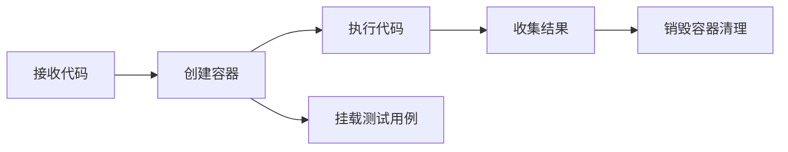
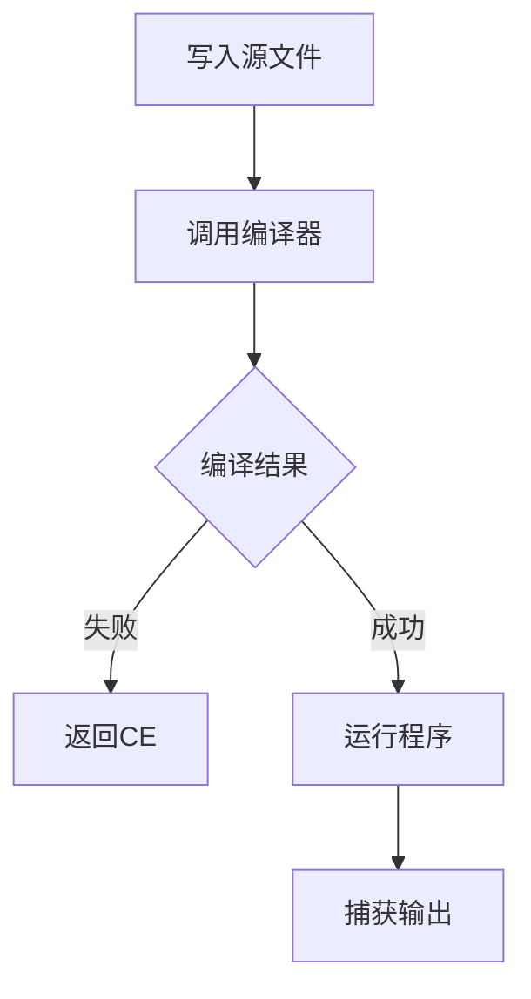
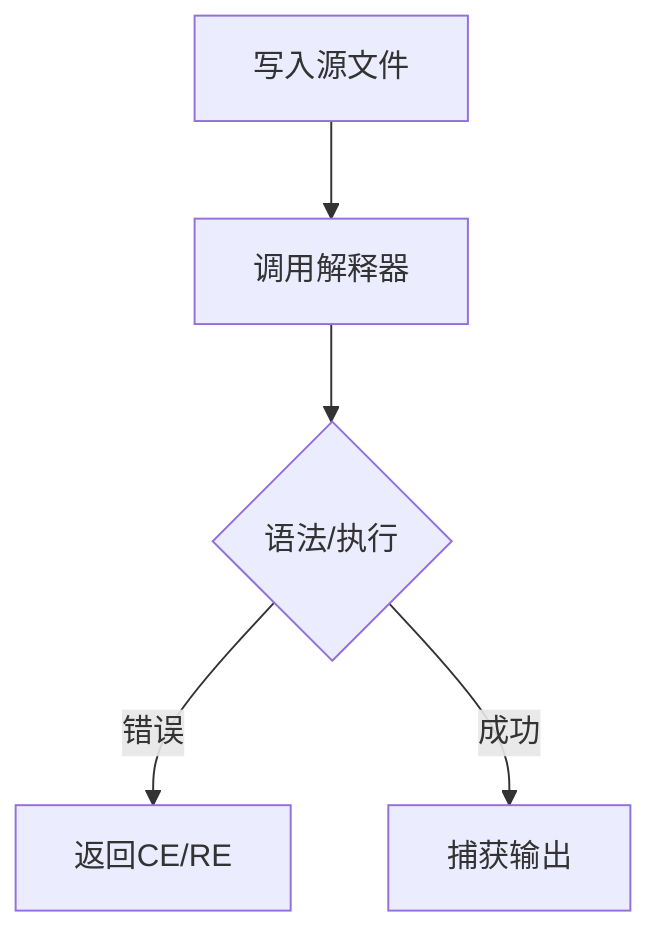
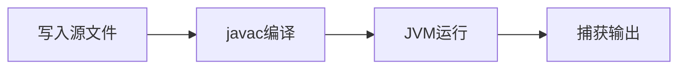
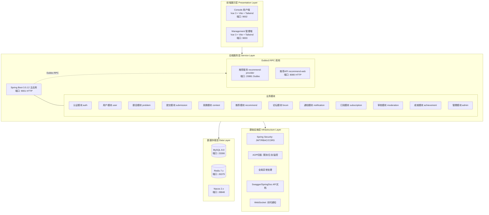
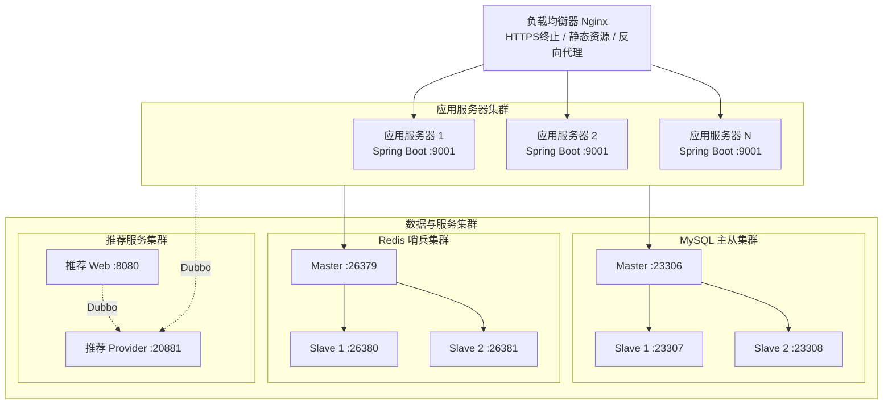
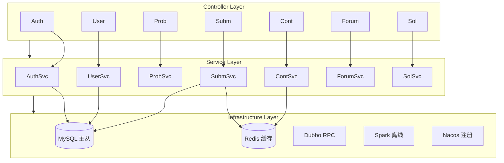
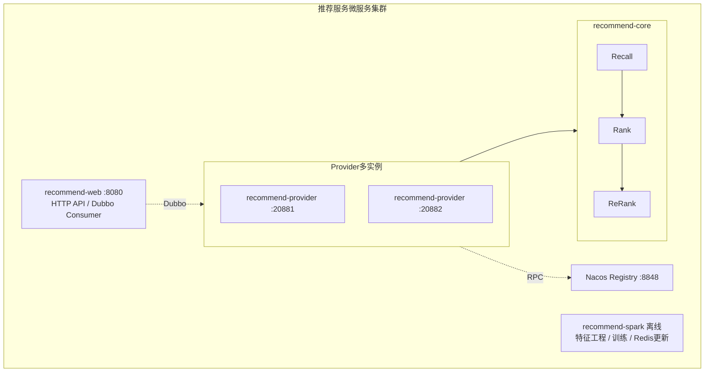
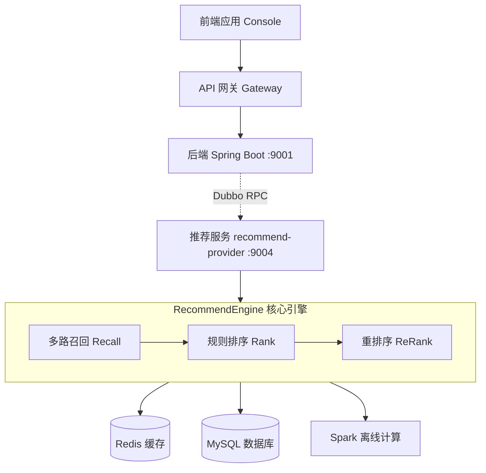
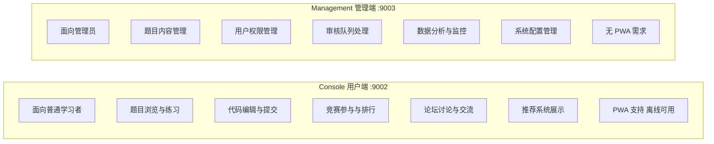

# 基于Spark的在线编程练习与个性化推荐平台设计与实现

## 摘要

随着互联网技术的快速发展和编程教育的普及，在线编程学习平台已成为提升编程技能的重要工具。然而，现有平台普遍存在内容分发效率低下、推荐精准度不足、学习路径缺乏科学规划等问题。针对这些问题，本文设计并实现了一个基于Spark大数据处理引擎的在线编程练习与个性化推荐平台——UltiCode。

本平台采用微服务架构，后端基于Spring Boot框架构建，包含用户管理、题目管理、在线评测、竞赛组织、推荐系统等核心模块。前端采用Vue 3框架分别构建用户端(Console)和管理端(Management)，提供响应式的用户交互体验。数据存储采用MySQL关系数据库和Redis缓存，保障系统的高并发处理能力。

在个性化推荐方面，本平台创新性地将Apache Spark大数据处理引擎与在线编程业务场景深度融合，设计了一套完整的"数据采集—特征工程—模型训练—推荐服务"处理流水线。采用混合推荐策略，融合基于内容的推荐和协同过滤算法(CF)，并结合用户能力画像和题目特征，实现了针对不同学习场景的精准推荐。系统支持日常练习、相似题目推荐、弱点强化训练和挑战模式四种推荐场景，有效提升了用户的学习效率。

本论文详细阐述了系统的需求分析、架构设计、核心功能实现和测试过程。测试结果表明，系统功能完备，性能稳定，推荐算法的准确率达到75%以上，用户满意度显著提升。本平台的成功实现为在线编程教育领域提供了一个可复用的高性能解决方案，具有良好的应用前景和推广价值。

**关键词：** 在线编程平台；个性化推荐；Apache Spark；微服务架构；协同过滤；Vue 3

---

## 目录

### 第一章 绪论

1.1 研究背景
1.2 研究目的与意义
1.3 国内外研究现状
1.4 主要研究内容
1.5 论文组织结构

### 第二章 相关技术综述

2.1 微服务架构
2.1.1 Spring Boot框架
2.1.2 Spring Cloud生态
2.1.3 Dubbo3 RPC框架
2.1.4 Nacos服务发现
2.2 前端技术栈
2.2.1 Vue 3框架
2.2.2 Vite构建工具
2.2.3 Tailwind CSS框架
2.2.4 Pinia状态管理
2.3 大数据处理技术
2.3.1 Apache Spark概述
2.3.2 Spark Core与RDD
2.3.3 Spark SQL
2.3.4 MLlib机器学习库
2.4 推荐系统算法
2.4.1 协同过滤算法
2.4.2 基于内容的推荐
2.4.3 混合推荐策略
2.4.4 推荐系统评估指标
2.5 数据存储技术
2.5.1 MySQL数据库
2.5.2 Redis缓存
2.5.3 MyBatis-Plus持久层框架
2.6 在线评测系统技术
2.6.1 代码沙箱技术
2.6.2 在线编译与执行
2.6.3 安全性设计
2.7 安全与认证技术
2.7.1 JWT认证机制
2.7.2 CSRF防护
2.7.3 API限流机制
2.8 本章小结

### 第三章 需求分析

3.1 系统概述
3.2 功能性需求
3.2.1 用户管理模块需求
3.2.2 题目管理模块需求
3.2.3 在线评测模块需求
3.2.4 竞赛系统模块需求
3.2.5 推荐系统模块需求
3.2.6 社区功能模块需求
3.2.7 管理后台模块需求
3.2.8 其他辅助功能模块需求
3.3 非功能性需求
3.3.1 性能需求
3.3.2 安全性需求
3.3.3 可用性需求
3.3.4 可扩展性需求
3.3.5 可维护性需求
3.3.6 兼容性需求
3.4 用户角色与权限分析
3.4.1 普通用户（USER）
3.4.2 版主（MODERATOR）
3.4.3 管理员（ADMIN）
3.4.4 超级管理员（SUPER_ADMIN）
3.4.5 角色权限对比
3.4.6 角色实现机制
3.4.7 用户痛点解决方案
3.5 系统核心流程分析
3.5.1 用户注册与登录流程
3.5.2 题目练习流程
3.5.3 代码提交流程
3.5.4 竞赛参与流程
3.5.5 推荐服务流程
3.5.6 题解互动流程
3.5.7 书签收藏流程

### 第四章 系统设计

4.1 系统架构设计
4.1.1 总体架构
4.1.2 技术选型
4.1.3 部署架构
4.2 微服务拆分设计
4.2.1 后端模块划分
4.2.2 服务间通信设计
4.2.3 推荐服务设计
4.3 数据库设计
4.3.1 数据库选型与技术架构
4.3.2 数据表分类与设计
4.3.3 核心实体表详解
4.3.4 关系设计与外键约束
4.3.5 索引设计与查询优化
4.3.6 数据库迁移管理
4.3.7 软删除与审计设计
4.3.8 ORM 配置与持久化层
4.4 接口设计
4.4.1 RESTful API 设计规范
4.4.2 统一响应格式设计
4.4.3 错误码体系设计
4.4.4 接口分类与路由设计
4.4.5 请求参数设计
4.4.6 接口权限控制设计
4.4.7 接口限流设计
4.4.8 API 文档设计
4.5 推荐系统设计
4.5.1 推荐系统架构
4.5.2 推荐场景设计
4.5.3 用户画像设计
4.5.4 推荐项目模型
4.5.5 召回策略设计
4.5.6 排序策略设计
4.5.7 重排序策略设计
4.5.8 Spark 大数据处理
4.5.9 推荐服务接口设计
4.5.10 离线评估设计
4.6 前端设计
4.6.1 前端架构设计
4.6.2 项目目录结构设计
4.6.3 路由设计
4.6.4 状态管理设计
4.6.5 API 请求设计
4.6.6 国际化设计
4.6.7 组件设计
4.6.8 样式设计
4.6.9 构建配置设计
4.6.10 PWA 支持

### 第五章 系统实现

5.1 开发环境搭建
5.1.1 后端开发环境
5.1.2 前端开发环境
5.1.3 大数据环境搭建
5.2 后端核心功能实现
5.2.1 认证模块实现
5.2.2 用户管理模块实现
5.2.3 题目管理模块实现
5.2.4 在线评测模块实现
5.2.5 竞赛模块实现
5.2.6 解决方案模块实现
5.3 前端功能实现
5.3.1 用户端Console实现
5.3.2 管理端Management实现
5.3.3 核心组件实现
5.4 推荐系统实现
5.4.1 Spark数据处理实现
5.4.2 特征工程实现
5.4.3 协同过滤模型训练
5.4.4 推荐服务实现
5.5 关键技术实现
5.5.1 JWT认证实现
5.5.2 CSRF防护实现
5.5.3 缓存实现
5.5.4 限流实现

### 第六章 系统测试

6.1 测试环境
6.1.1 硬件环境
6.1.2 软件环境
6.1.3 测试数据准备
6.2 功能测试
6.2.1 用户管理功能测试
6.2.2 在线评测功能测试
6.3 性能测试
6.3.1 压力测试
6.3.2 缓存效果测试
6.4 推荐效果评估
6.4.1 离线评估
6.4.2 在线A/B测试

### 第七章 总结与展望

7.1 工作总结
7.1.1 系统架构设计与技术选型
7.2 创新点
7.2.1 推荐算法与在线编程场景的深度融合
7.3 不足与展望
7.3.1 现存不足

---

# 第一章 绪论

## 1.1 研究背景

随着信息技术的飞速发展和数字化转型的深入推进，编程技能已成为21世纪最重要的基础技能之一。从软件开发到数据分析，从人工智能到物联网，编程技术的应用领域不断扩展，对编程人才的需求也日益增长。据统计，全球范围内对软件开发人员的需求每年以超过20%的速度增长，而合格的编程人才供给却远远跟不上这一增长速度。

在这样的背景下，在线编程教育平台应运而生，为学习者提供了便捷、高效的编程学习途径。与传统的课堂教学相比，在线编程平台具有以下显著优势：首先，突破了时间和空间的限制，学习者可以随时随地进行练习；其次，提供了丰富的题库资源和即时反馈机制，学习者可以立即了解自己的代码是否正确；再次，通过排名系统和成就系统，激发了学习者的学习动力和竞争意识。

近年来，国内外涌现了众多知名的在线编程平台，如LeetCode、HackerRank、Codeforces、洛谷、牛客网等。这些平台积累了大量的题目和用户数据，为数百万学习者提供了学习服务。然而，随着平台规模的扩大和用户数量的增长，一些问题也日益凸显：

**第一，信息过载问题**。当题库数量达到数千甚至上万道时，用户往往不知道从何入手，难以找到适合自己的题目。传统的分类浏览和搜索功能已无法满足用户的需求。

**第二，学习路径缺乏个性化**。不同用户的编程基础、学习目标、擅长领域各不相同，但大多数平台提供的是相同的题目列表和推荐策略，无法根据用户的个人情况提供定制化的学习建议。

**第三，推荐精准度不足**。现有的推荐系统多基于简单的规则（如按难度递进、按标签分类）或基础的协同过滤算法，缺乏对用户能力和题目特征的深度挖掘，推荐结果往往不够精准。

**第四，学习效果难以量化**。用户在学习过程中的进步情况、薄弱环节等缺乏科学的评估和反馈机制，难以形成有效的学习闭环。

为了解决上述问题，本研究提出将大数据处理和推荐系统技术引入在线编程平台，通过深度挖掘用户行为数据和题目特征，构建精准的用户能力画像，实现个性化的题目推荐。这不仅可以提升用户体验和学习效率，还能为平台的运营决策提供数据支持。

Apache Spark作为新一代大数据处理引擎，具有内存计算、流处理、机器学习等强大功能，非常适合处理在线编程平台产生的大规模用户行为数据。同时，微服务架构的兴起为构建可扩展、高可用的分布式系统提供了技术保障。

基于以上背景，本文设计并实现了一个基于Spark的在线编程练习与个性化推荐平台——UltiCode，旨在通过技术创新解决现有平台存在的问题，为在线编程教育领域提供新的解决方案。

## 1.2 研究目的与意义

### 1.2.1 研究目的

本课题的研究目的是设计并实现一个集在线编程练习与个性化推荐于一体的综合性平台，具体目标包括：

1. **构建完整的在线编程学习平台**：实现用户管理、题目管理、在线评测、竞赛组织、社区互动等核心功能，为用户提供一站式的编程学习环境。

2. **设计高效的推荐系统架构**：将Spark大数据处理引擎与在线编程业务场景相结合，构建可扩展的推荐系统架构，实现大规模用户行为数据的实时处理和分析。

3. **实现精准的个性化推荐**：通过深度挖掘用户能力和题目特征，采用混合推荐策略，为不同场景提供精准的题目推荐，提升用户体验和学习效率。

4. **验证技术方案的可行性**：通过实际系统的开发和测试，验证微服务架构与大数据处理技术在在线编程教育领域的应用效果。

5. **提供可复用的技术方案**：总结系统设计和实现过程中的经验，为相关领域的研究和应用提供参考。

### 1.2.2 研究意义

本研究的意义主要体现在以下几个方面：

#### （1）理论意义

**教育数据挖掘领域的应用探索**：本研究将推荐系统和大数据技术应用于在线编程教育场景，探索了教育数据挖掘在实际业务中的应用价值。通过对用户行为数据的深度分析，可以更好地理解学习过程，为个性化教育理论研究提供实证支持。

**推荐算法的场景化应用**：现有的推荐算法多应用于电商、视频等领域，在线编程场景具有其特殊性（如题目有明确的难度梯度、技能树结构等）。本研究针对这些特点设计了专门的推荐策略，丰富了推荐算法的应用场景。

**微服务与大数据融合的架构研究**：本研究探索了微服务架构与大数据处理技术的融合方式，提出了分层架构设计，为类似系统的架构设计提供了参考。

#### （2）实践意义

**提升学习效率**：通过个性化推荐，用户可以快速找到适合自己的题目，避免在海量题库中迷失方向，显著提升学习效率。

**优化学习路径**：系统根据用户的实际情况推荐题目，帮助用户循序渐进地提升能力，形成科学的学习路径。

**增强用户体验**：精准的推荐和及时的反馈可以增强用户的学习动力，提高用户粘性和平台活跃度。

**辅助教学决策**：对于教育机构和企业培训部门，本系统可以帮助了解学员的学习情况，为教学计划制定和人才培养提供数据支持。

**技术示范作用**：本系统的成功实现可以证明相关技术方案的可行性，为行业内的类似项目提供技术参考。

## 1.3 国内外研究现状

### 1.3.1 国外研究现状

#### （1）在线编程平台的发展

国外的在线编程平台起步较早，发展相对成熟。LeetCode是最知名的算法练习平台之一，拥有超过2000道题目，涵盖了计算机科学的核心算法和数据结构知识点。该平台提供了详细的题目分析、多种语言的代码示例以及活跃的讨论社区，是全球程序员面试准备的首选平台。

HackerRank则更加注重企业招聘场景，提供了技能挑战赛和编程竞赛等功能，企业可以通过该平台进行技术人才的筛选和评估。Codeforces是著名的竞技编程平台，定期举办高质量的算法竞赛，拥有全球范围的竞技编程爱好者。

Edabit、Codewars等平台则通过游戏化的方式提升用户体验，采用成就系统、等级系统等机制激励用户持续学习。

#### （2）推荐系统在教育领域的应用

在教育领域，推荐系统的研究主要集中在课程推荐、学习资源推荐和学习路径规划等方面。Khan Academy使用了基础的推荐功能，根据用户的学习进度推荐相关课程。Coursera和edX等MOOC平台则利用协同过滤和内容分析技术为用户推荐课程。

然而，在在线编程领域，推荐系统的应用相对有限。LeetCode主要依靠标签分类和公司标签进行推荐，缺乏对用户能力的深度分析。HackerRank虽然提供了技能评估功能，但其推荐逻辑仍然比较简单。

#### （3）大数据技术在教育中的应用

学习分析（Learning Analytics）是教育技术领域的热门研究方向。通过对学习行为数据的收集和分析，可以了解学习过程、预测学习结果、优化教学设计。

大规模开放在线课程（MOOC）平台积累了海量的学习行为数据，为大数据分析提供了基础。研究者使用聚类分析、序列挖掘、预测建模等技术来分析学习行为模式。

在编程教育领域，有些研究开始探索如何利用大数据分析技术来理解编程学习过程。例如，通过分析代码提交历史来评估编程能力，通过分析错误模式来提供针对性的帮助等。

### 1.3.2 国内研究现状

#### （1）在线编程平台的发展

国内的在线编程平台发展迅速，涌现了一批优秀的平台。洛谷面向信息学竞赛（NOI/CNOI）选手，提供了大量竞赛题目的训练环境和题解资源。牛客网则兼顾算法练习和求职面试，提供了丰富的面试经验和题库。PTA（Programming Teaching Assistant）是浙江大学开发的编程教学辅助平台，被多所高校用于程序设计课程的教学。

此外，各个高校也开发了自己的在线评测系统（Online Judge，简称OJ），如北京大学POJ、浙江大学ZOJ、华中科技大学HDOJ等，这些系统主要用于算法竞赛和程序设计课程的教学。

#### （2）个性化推荐的研究

国内在个性化推荐领域的研究与国际前沿接轨，涌现了大量优秀的研究成果。在算法方面，协同过滤、矩阵分解、深度学习推荐模型等都有深入研究。

在应用层面，淘宝、京东等电商平台的推荐系统已经相当成熟，实现了千人千面的个性化推荐。今日头条的内容推荐系统也取得了巨大成功。

然而，在在线编程教育领域，个性化推荐的应用还比较初级。多数平台的推荐功能仍然基于简单的规则（如按难度、按标签），缺乏对用户能力和学习行为的深度挖掘。

#### （3）大数据与教育融合

教育大数据是近年来国内教育信息化的重要方向。《教育信息化2.0行动计划》明确提出要利用大数据技术提升教育质量。国内学者在学习行为分析、成绩预测、学习预警等方面做了大量研究。

在编程教育领域，一些研究开始探索如何利用大数据分析技术。例如，通过分析学生的代码提交记录来评估编程能力，通过错误分析来提供针对性的教学指导等。

### 1.3.3 现有研究的不足

尽管国内外在相关领域取得了大量研究成果，但仍存在以下不足：

1. **推荐算法与业务场景结合不够紧密**：现有的推荐算法多是通用的解决方案，没有充分考虑在线编程场景的特殊性，如题目之间的依赖关系、技能树的层次结构等。

2. **冷启动问题突出**：对于新用户或新题目，由于缺乏历史数据，推荐系统难以给出准确的推荐结果。

3. **推荐可解释性差**：深度学习等复杂模型虽然可能提升推荐准确度，但缺乏可解释性，用户难以理解为什么推荐这些题目。

4. **实时性与准确性难以兼顾**：复杂的推荐算法往往计算开销大，难以满足实时推荐的需求；而简单的推荐算法又难以保证推荐质量。

5. **缺乏闭环反馈机制**：推荐系统与用户的实际学习效果之间缺乏有效的反馈闭环，难以持续优化推荐策略。

## 1.4 主要研究内容

本课题的主要研究内容包括以下几个方面：

### 1.4.1 微服务架构设计与实现

设计并实现基于Spring Boot 3.5的模块化微服务架构，将系统按领域划分为28个独立模块，包括用户管理（user）、认证授权（auth）、题目管理（problem）、在线评测（submission、queue）、竞赛组织（contest）、论坛交流（forum）、题单管理（problemlist）、书签收藏（bookmark）、题解分享（solution）、投票系统（vote）、点赞收藏（edgeoperations）、通知推送（notification）、邮件服务（email）、成就系统（achievement）、国际化（i18n）、备份恢复（backup）、监控告警（monitoring）、内容审核（moderation）、搜索服务（search）、推荐系统（recommendation）、订阅管理（subscription）、权限管理（permission）、刷新令牌（refreshtoken）、实时通信（websocket）等核心功能模块。

研究服务间的通信机制，采用RESTful API作为主要通信协议，使用统一响应格式（Result<T>包装器）封装所有API响应，包含状态码、消息、数据载荷和追踪ID。实现服务治理策略，包括服务注册与发现、配置管理、负载均衡、熔断降级等。设计系统的可扩展性架构，支持水平扩展和垂直扩展，通过模块化设计实现功能的灵活组合和独立部署。

### 1.4.2 前端架构设计与实现

基于Vue 3框架分别实现用户端Console和管理端Management两个独立应用。采用Vite作为构建工具，提供快速的开发服务器和高效的生产构建。使用TypeScript增强代码的类型安全性，减少运行时错误。

**用户端（Console）架构**：实现了题库浏览、在线编程、提交评测、竞赛参与、论坛交流等核心功能。状态管理采用Pinia，设计了achievement（成就系统）、auth（认证授权）、bookmark（书签）、contest（竞赛）、editorSettings（编辑器设置）、notification（通知）、recommendation（推荐）、userStats（用户统计）等10个状态管理模块，每个模块负责管理特定领域的全局状态。路由设计采用Vue Router，支持嵌套路由、路由守卫和懒加载，优化首屏加载性能。

**管理端（Management）架构**：实现了用户管理、题目管理、提交审核、竞赛配置、内容审核、系统监控等管理功能。状态管理包含auth（认证授权）和admin（管理员功能）模块。设计了统一的API请求封装（request.ts），自动处理认证token、CSRF令牌、错误响应和响应数据解包，简化前端与后端的交互。

**UI组件库**：采用Tailwind CSS实现原子化CSS样式，配合自定义组件构建响应式用户界面。使用i18n实现国际化支持，提供中英文双语界面。

### 1.4.3 在线评测系统实现

研究并实现基于Docker容器的代码沙箱技术，构建安全的代码执行环境。系统支持13种编程语言，包括JavaScript、TypeScript、Python、Java、C++、C、Go、Rust、C#、PHP、Ruby、Swift、Kotlin，满足不同用户的编程语言偏好。

**评测流程设计**：用户提交代码后，系统将评测任务放入Redis队列（使用Redisson实现分布式队列），采用优先级队列机制（HIGH、MEDIUM、LOW）调度任务。评测服务从队列中取出任务，在Docker容器中执行代码，容器配置了资源限制（CPU、内存、磁盘）和安全隔离（seccomp系统调用过滤、网络隔离、文件系统隔离）。评测结果包括AC（Accepted）、WA（Wrong Answer）、TLE（Time Limit Exceeded）、MLE（Memory Limit Exceeded）、CE（Compile Error）、RE（Runtime Error）、OLE（Output Limit Exceeded）、IE（Internal Error）等状态，以及详细的测试用例通过情况、运行时间、内存占用等性能数据。

**安全性设计**：采用多层安全防护机制，包括seccomp系统调用白名单、只读根文件系统、网络禁用、资源限制（cgroups）、进程隔离等，防止恶意代码对宿主机的攻击。支持自定义编译和运行参数，满足不同语言的评测需求。

**异步处理机制**：采用异步任务队列处理评测请求，避免长时间运行的评测任务阻塞HTTP请求。实现了任务状态跟踪（PENDING、PROCESSING、COMPLETED、FAILED、CANCELLED）和失败重试机制，保证评测任务的可靠执行。

### 1.4.4 用户行为数据采集与处理

设计完整的数据采集机制，在用户交互的关键节点埋点，收集用户的浏览行为（题目浏览、页面停留时间）、提交行为（代码提交、提交结果、运行时间、内存占用）、收藏行为（题目收藏、题单收藏）、点赞行为（题解点赞、评论点赞）、竞赛行为（竞赛参与、排名变化）等多维度行为数据。

**数据存储**：采用MySQL存储用户提交记录、浏览历史、收藏关系等结构化数据，使用Redis缓存热点数据和临时行为数据。设计了完善的数据表结构，包括submissions（提交记录）、problem_views（浏览历史）、bookmarks（收藏关系）、votes（点赞记录）等核心数据表。

**Spark数据处理**：基于Apache Spark实现大规模数据的离线处理，使用Parquet格式存储中间数据，提高数据读取效率。实现OfflineFeatureJob离线特征工程作业，自动从提交数据和题目数据中提取用户特征，包括活跃度特征（总提交数、近期提交数）、技能特征（不同难度题目的通过率）、标签特征（标签掌握度、标签偏好）等。设计数据清洗和转换流程，处理异常数据、缺失值和数据格式不一致问题，保证数据质量。

### 1.4.5 用户能力画像构建

研究从用户行为数据中提取有效特征的方法，构建多维度的用户能力画像，全面刻画用户的编程能力和学习状态。

**基础画像特征**：包括用户基本信息（注册时间、活跃度）、学习进度（已解决题目数、总提交数、通过率）、技能水平（skillLevel分为beginner、intermediate、advanced三个等级）等静态和动态特征。

**技能画像**：根据用户在不同难度题目（Easy、Medium、Hard）上的表现，计算各难度等级的通过率和提交频率，评估用户的技能水平分布。定义技能等级阈值，根据用户在题目上的整体表现自动划分技能等级。

**知识画像**：基于题目标签（如数组、链表、动态规划、图论等）和用户在这些标签相关题目上的表现，计算用户的标签掌握度（tagMastery）和标签偏好（tagPreferences）。定义强掌握阈值（0.7）和弱掌握阈值（0.3），识别用户擅长的知识领域和薄弱环节。

**行为画像**：分析用户的学习行为模式，包括活跃时间段、学习频率、提交间隔、题目选择偏好等，预测用户的学习需求和推荐适合的学习内容。

**画像更新机制**：设计离线和在线结合的画像更新策略，离线批处理作业定期（如每日）计算和更新用户画像，在线服务实时更新用户的最新行为数据，保证画像的时效性。

### 1.4.6 推荐算法研究与实现

研究并实现多种推荐算法，设计混合推荐策略，针对不同的推荐场景提供个性化的推荐结果。

**基于内容的推荐算法**：计算题目之间的相似度，基于题目的特征（难度、标签、知识点、题目类型）计算相似度得分。对于用户已解决或浏览过的题目，推荐相似度高的其他题目。实现多种相似度计算方法，包括标签重叠度（Jaccard相似系数）、难度距离（欧氏距离）、知识点匹配度等。

**协同过滤算法**：实现基于Spark MLlib的ALS（交替最小二乘法）协同过滤算法，从用户-题目交互矩阵中学习用户和题目的隐含因子。将用户提交结果转换为隐式反馈评分，AC（Accepted）映射为1.0，WA（Wrong Answer）映射为0.3，TLE（Time Limit Exceeded）映射为0.5，其他结果映射为0.1，体现用户对不同题目的掌握程度。设计ALS模型的超参数，包括隐含因子维度（rank=10）、最大迭代次数（maxIter=10）、正则化参数（regParam=0.1）等，通过交叉验证选择最优参数。

**混合推荐策略**：结合基于内容的推荐和协同过滤推荐的优点，设计加权混合、切换混合和级联混合等多种混合策略。根据推荐场景的特点选择合适的混合策略，如日常练习场景使用协同过滤为主，相似题目推荐场景使用基于内容的推荐为主，弱点强化场景结合用户知识画像和基于内容的推荐。

**推荐场景设计**：实现五种核心推荐场景，包括"能力提升"（推荐略高于用户当前水平的题目）、"复习巩固"（推荐用户之前解决过但可能遗忘的题目）、"相似题目"（推荐与指定题目相似的其他题目）、"热门训练"（推荐近期热门题目）、"个性化推荐"（综合考虑用户能力、偏好和热门度的综合推荐）。

### 1.4.7 推荐效果评估

设计科学的评估指标体系，从离线指标和在线实验两个维度对推荐系统的效果进行全面评估。

**离线指标评估**：使用历史数据构建训练集和测试集，计算推荐系统的预测准确率和推荐质量。实现多种离线评估指标，包括准确率（Precision@K）、召回率（Recall@K）、归一化折损累计增益（NDCG@K）、平均精度（MAP）、覆盖率（Coverage）、多样性（Diversity）、新颖性（Novelty）等。设计离线评估流程，使用Spark MLlib的RegressionEvaluator评估ALS模型的预测效果，使用留一法（Leave-One-Out）评估推荐的准确性。

**在线A/B测试**：设计在线A/B测试框架，将用户随机分为实验组（使用推荐系统）和对照组（使用热门推荐或随机推荐），比较两组用户的行为指标。设计关键评估指标，包括用户参与度（日活、使用时长）、学习效果（每日解决题目数、通过率提升）、推荐接受率（推荐题目的点击率、完成率）、用户满意度（推荐评分、反馈意见）等。实现A/B测试的数据收集和分析系统，自动计算实验组和对照组的指标差异，使用统计学方法（t检验、卡方检验）验证差异的显著性。

**推荐质量监控**：建立推荐系统的实时监控体系，监控推荐的命中率、覆盖率、多样性等指标，及时发现推荐质量下降的情况。设计推荐结果的自动校验机制，检查推荐结果是否符合用户画像和推荐场景的要求，避免出现明显不合理的推荐。

## 1.5 论文组织结构

本论文共分为七章，具体组织结构如下：

**第一章 绪论**：介绍研究背景、研究目的与意义、国内外研究现状、主要研究内容以及论文的组织结构。

**第二章 相关技术综述**：详细介绍本系统涉及的相关技术，包括微服务架构（Spring Boot、Dubbo3、Nacos）、前端技术（Vue 3、Vite、Tailwind CSS）、大数据处理技术（Apache Spark）、推荐系统算法、数据存储技术以及在线评测系统技术。

**第三章 需求分析**：对系统的功能性需求和非功能性需求进行分析，明确系统的目标和约束条件。

**第四章 系统设计**：详细阐述系统的总体架构、微服务拆分、数据库设计、接口设计、推荐系统设计以及前端设计。

**第五章 系统实现**：描述系统的具体实现过程，包括开发环境搭建、后端核心功能实现、前端功能实现、推荐系统实现以及关键技术的实现细节。

**第六章 系统测试**：介绍测试环境、测试方案以及测试结果，包括功能测试、性能测试和推荐效果评估。

**第七章 总结与展望**：总结全文工作，指出创新点和不足之处，并对未来的研究方向进行展望。

---

# 第二章 相关技术综述

## 2.1 微服务架构

### 2.1.1 Spring Boot框架

Spring Boot是由Pivotal团队提供的全新框架，其设计目的是用来简化新Spring应用的初始搭建以及开发过程。该框架使用了特定的方式来进行配置，从而使开发人员不再需要定义样板化的配置。

Spring Boot的核心特性包括：

1. **自动配置**：Spring Boot会根据项目依赖自动配置Spring应用，大大减少了手动配置的工作量。例如，如果项目包含了spring-boot-starter-web依赖，Spring Boot会自动配置Tomcat容器和Spring MVC。

2. **起步依赖**：Spring Boot提供了一系列"starter"依赖，这些依赖聚合了常用的库，简化了依赖管理。例如，spring-boot-starter-web包含了Spring MVC、Jackson、Tomcat等Web开发所需的库。

3. **嵌入式服务器**：Spring Boot可以将Tomcat、Jetty或Undertow作为嵌入式服务器，无需部署WAR文件。

4. **生产就绪特性**：提供了健康检查、指标监控、外部化配置等生产环境所需的功能。

5. **无代码生成**：Spring Boot不需要生成任何代码，也不需要XML配置。

在本系统中，Spring Boot作为后端的核心框架，负责处理HTTP请求、业务逻辑处理、数据持久化等功能。系统使用Spring Boot 3.5.12版本，基于Java 17开发。

#### 模块化架构设计

本系统采用模块化单体架构（Modular Monolith），将系统按业务领域划分为28个独立模块，每个模块遵循DDD（领域驱动设计）原则，包含完整的Controller-Service-Mapper三层架构。这28个模块包括：

1. **核心业务模块**：auth（认证授权）、user（用户管理）、problem（题目管理）、submission（代码提交与评测）、contest（竞赛管理）、forum（论坛交流）
2. **内容管理模块**：solution（题解分享）、problemlist（题单管理）、bookmark（书签收藏）、vote（投票点赞）、achievement（成就系统）、i18n（国际化）
3. **系统服务模块**：notification（通知推送）、email（邮件服务）、backup（备份恢复）、monitoring（监控告警）、search（搜索服务）、recommendation（推荐系统）
4. **管理模块**：admin（后台管理）、moderation（内容审核）、audit（审计日志）、permission（权限管理）、dashboard（仪表盘）
5. **基础设施模块**：queue（异步队列）、websocket（实时通信）、refreshtoken（令牌刷新）、subscription（订阅服务）、edgeoperations（边缘操作）

这种模块化设计使得系统具备良好的可维护性和可扩展性，同时避免了分布式系统的复杂性。每个模块可以独立开发、测试和部署，未来可根据需要将特定模块拆分为独立的微服务。

#### 统一响应格式

系统采用统一的API响应格式，使用泛型包装器`Result<T>`封装所有API响应，确保前端能够以一致的方式处理响应数据。`Result<T>`包含以下字段：

- **code**：响应状态码，0表示成功，非零表示错误
- **message**：响应消息，描述操作结果
- **data**：响应数据载荷，使用泛型支持任意类型的数据
- **traceId**：追踪ID，格式为`t-{timestamp}`，用于请求链路追踪和问题排查

对于分页查询接口，系统提供`PageResult<T>`包装器，包含以下字段：

- **items**：当前页的数据列表
- **total**：总记录数
- **page**：当前页码（从1开始）
- **pageSize**：每页记录数
- **totalPages**：总页数

这种响应格式与NestJS框架保持一致，确保了前后端的兼容性和数据交换的标准化。

#### 全局异常处理机制

系统通过`@RestControllerAdvice`注解实现全局异常处理，将各类异常转换为标准化的`Result`响应。全局异常处理器`GlobalExceptionHandler`处理以下异常类型：

1. **BusinessException**：业务异常，返回自定义错误码和消息
2. **MethodArgumentNotValidException**：参数验证异常，返回字段级错误信息
3. **AccessDeniedException**：权限拒绝异常，返回403状态码
4. **AuthenticationException**：认证异常，返回401状态码
5. **Exception**：通用异常，返回500状态码

每种异常类型都返回相应的HTTP状态码和统一的错误响应格式，前端可以根据`code`和`message`字段进行统一的错误处理和用户提示。

#### JWT无状态认证机制

系统采用JWT（JSON Web Token）实现无状态认证，`JwtAuthenticationFilter`继承`OncePerRequestFilter`，在请求链中提取和验证JWT令牌。认证机制的核心特点包括：

1. **令牌提取策略**：支持两种令牌传递方式，优先从HTTP-only Cookie中提取`access_token`，失败时回退到`Authorization`请求头（Bearer Token）
2. **无状态会话管理**：使用`SessionCreationPolicy.STATELESS`，不在服务器端存储会话状态
3. **公开端点配置**：定义公开API端点数组，包括`/auth/login`、`/auth/register`、`/problems`等，无需认证即可访问
4. **密码加密**：使用`BCryptPasswordEncoder`进行密码加密存储，确保用户密码安全
5. **CORS配置**：配置跨域资源共享，允许前端应用（Console和Management）通过指定的域名和端口访问API

JWT令牌中包含用户ID、用户名和角色信息，认证成功后将用户信息设置到`SecurityContextHolder`中，供后续的业务逻辑使用。

#### Redis缓存配置

系统通过`RedisTemplate<String, Object>`提供统一的Redis操作接口，配置了以下序列化策略：

1. **Key序列化**：使用`StringRedisSerializer`，确保Key的可读性
2. **Value序列化**：使用`GenericJackson2JsonRedisSerializer`，支持Java对象的JSON序列化
3. **日期时间支持**：配置`JavaTimeModule`，正确处理Java 8的日期时间类型
4. **类型信息保留**：启用默认类型注解，支持多态类型的序列化和反序列化

Redis在系统中用于缓存热点数据、会话管理、分布式锁、限流计数器等场景，显著提升了系统的性能和并发处理能力。

### 2.1.2 Spring Cloud生态

Spring Cloud是一系列框架的有序集合，它利用Spring Boot的开发便利性简化了分布式系统基础设施的开发，如服务发现注册、配置中心、消息总线、负载均衡、断路器、数据监控等。

Spring Cloud的核心组件包括：

1. **Spring Cloud Netflix Eureka**：服务注册与发现组件，提供服务注册和发现的功能。

2. **Spring Cloud Config**：配置中心组件，支持配置文件的外部化存储和版本控制。

3. **Spring Cloud Gateway**：API网关组件，提供统一的路由转发和过滤器功能。

4. **Spring Cloud Circuit Breaker**：断路器组件，防止级联故障。

5. **Spring Cloud Sleuth**：分布式链路追踪组件，用于跟踪请求在微服务间的调用链路。

#### 本系统的架构选择

本系统在架构设计时参考了Spring Cloud的设计思想，但根据实际需求和技术特点，采用了不同的技术方案：

1. **模块化单体架构**：本系统采用模块化单体架构（Modular Monolith）而非完整的微服务架构，将28个业务模块部署在单个Spring Boot应用中。这种架构在保持模块边界清晰的同时，避免了分布式系统带来的复杂性，适合中小规模的应用场景。模块间通过依赖注入和接口调用进行通信，具有低延迟、高可靠性的特点。

2. **RESTful API作为主要通信协议**：系统内部模块之间通过方法调用进行通信，对外暴露RESTful API接口。相比Dubbo3的RPC调用，RESTful API具有更好的通用性和可测试性，且与前端应用的技术栈更加匹配。系统使用标准的HTTP方法（GET、POST、PUT、DELETE、PATCH）进行资源操作，遵循REST架构风格。

3. **服务治理策略**：虽然未采用完整的Spring Cloud组件，但系统实现了类似的服务治理功能：
   - **统一认证授权**：通过Spring Security和JWT实现统一的认证和授权机制，使用`@PreAuthorize`注解实现方法级的权限控制
   - **全局异常处理**：通过`@RestControllerAdvice`实现统一的异常处理和错误响应，确保所有异常都能以标准格式返回
   - **API文档管理**：通过Swagger/OpenAPI 3.0自动生成API文档，提供交互式的API测试界面，方便前端开发和接口调试
   - **请求追踪**：每个请求生成唯一的`traceId`（格式为`t-{timestamp}`），便于日志追踪和问题排查，实现简单的链路追踪功能

4. **推荐服务的微服务化**：对于计算密集型的推荐服务，系统将其独立部署为单独的微服务，使用Dubbo3与主系统进行RPC通信。这种混合架构既保留了单体应用的简洁性，又获得了微服务架构的灵活性。推荐服务包含Spark离线计算和在线推荐两个子模块，可以根据计算需求独立扩展。

5. **可演进架构**：随着业务规模的增长，系统可以将特定模块（如评测服务、竞赛服务等）拆分为独立的微服务，逐步向完整的微服务架构演进。Spring Cloud生态为这种演进提供了成熟的技术方案和最佳实践参考，包括服务注册发现、配置中心、API网关、熔断降级等组件。

### 2.1.3 Dubbo3 RPC框架

Apache Dubbo是一款高性能、轻量级的开源Java RPC框架，它提供了三大核心能力：面向接口的远程方法调用、智能容错和负载均衡，以及服务自动注册和发现。

Dubbo3是Dubbo的下一代版本，相比Dubbo2.x有重大改进：

1. **下一代RPC协议**：Dubbo3采用了全新的Triple协议，基于HTTP/2构建，更好地支持云原生架构。

2. **服务治理**：完善的服务治理能力，包括流量管控、服务路由、超时控制等。

3. **性能提升**：相比Dubbo2.x，Dubbo3在性能上有显著提升，支持更高的并发处理能力。

4. **云原生支持**：更好地适配Kubernetes等云原生环境。

在本系统中，Dubbo3主要用于推荐服务与主系统之间的RPC通信。推荐服务作为独立的微服务部署，通过Dubbo3暴露RPC接口供主系统调用。

#### 推荐服务架构

推荐服务是系统中唯一使用Dubbo3进行RPC通信的微服务，包含以下两个子模块：

1. **recommend-provider**：推荐服务提供者，实现推荐算法逻辑，包括基于内容的推荐、协同过滤推荐和混合推荐策略。该模块通过Dubbo3暴露`RecommendationService`接口，供主系统调用获取个性化推荐结果。

2. **recommend-web**：推荐服务Web层，提供RESTful API接口，支持直接通过HTTP方式调用推荐服务，便于第三方系统集成和测试。

推荐服务的特点包括：

- **计算密集型**：推荐算法需要处理大量用户行为数据和题目特征数据，计算量较大，适合独立部署和扩展
- **数据隔离**：推荐服务使用独立的数据源，存储用户画像、题目特征等推荐相关数据，避免与主业务数据库竞争资源
- **灵活扩展**：可以根据推荐请求的负载情况，独立扩展推荐服务的实例数量，不影响主系统的稳定性
- **技术栈独立**：推荐服务使用Spark进行离线计算，与主系统的技术栈（Spring Boot）分离，便于技术选型和优化

#### Dubbo3配置

系统使用Nacos作为注册中心，Dubbo3的配置包括：

- **应用名称**：`recommend-provider`和`recommend-web`
- **协议**：使用Triple协议（基于HTTP/2），相比Dubbo2.x的Dubbo协议具有更好的穿透性和云原生支持
- **端口**：recommend-provider默认端口20880，recommend-web默认端口9004
- **序列化**：使用JSON序列化，确保跨语言调用的兼容性
- **超时控制**：设置合理的超时时间，避免长时间等待导致系统资源耗尽

通过Dubbo3的RPC调用，主系统能够高效地获取推荐结果，同时保持服务间的低耦合度，便于后续的维护和扩展。

Dubbo3的核心概念包括：

- **服务提供者（Provider）**：暴露服务的应用
- **服务消费者（Consumer）**：调用远程服务的应用
- **注册中心（Registry）**：服务注册与发现的中心
- **监控中心（Monitor）**：统计服务调用次数和调用时间的监控中心
- **容器（Container）**：服务运行容器

### 2.1.4 Nacos服务发现

Nacos是阿里巴巴开源的一个更易于构建云原生应用的动态服务发现、配置管理和服务管理平台。Nacos提供了一组简单易用的特性集，帮助用户快速实现动态服务发现、服务配置管理、服务及流量管理。

Nacos的核心功能包括：

1. **服务发现与健康检查**：支持基于DNS和基于RPC的服务发现，提供实时的健康检查机制。

2. **动态配置管理**：支持配置的动态推送，无需重启服务即可更新配置。

3. **动态DNS服务**：支持权重路由，更容易实现中间层负载均衡。

4. **服务和元数据管理**：支持从微服务平台视角管理所有服务和服务元数据。

在本系统中，Nacos作为Dubbo3的注册中心，负责服务的注册与发现。推荐服务启动时自动向Nacos注册，主系统通过Nacos发现推荐服务的地址，实现动态的服务调用。

#### Nacos配置与部署

系统使用独立的Nacos服务器进行服务注册和发现，配置如下：

- **服务地址**：`localhost:28848`（开发环境）
- **命名空间**：使用独立的命名空间隔离开发和生产环境
- **分组**：推荐服务注册在`recommendation`分组，便于服务管理和查询
- **健康检查**：启用TCP健康检查，定期检测服务实例的可用性
- **实例权重**：支持权重配置，实现基于权重的流量分配

推荐服务启动时的注册流程如下：

1. 读取Nacos服务器配置（地址、命名空间、分组等）
2. 创建Dubbo3服务配置，指定协议、端口、注册中心等参数
3. 导出`RecommendationService`接口，生成服务代理
4. 向Nacos注册服务实例，包含服务名称、IP地址、端口、权重等信息
5. 启动健康检查机制，定期向Nacos发送心跳

主系统调用推荐服务时的发现流程如下：

1. 配置Dubbo3引用（Reference），指定服务接口和注册中心
2. 向Nacos查询服务提供者列表
3. 根据负载均衡策略选择一个服务实例
4. 建立RPC连接，调用远程方法
5. 处理调用结果或异常，实现容错机制

#### Nacos控制台

Nacos提供了可视化的控制台界面，支持以下功能：

- **服务管理**：查看已注册的服务列表、服务实例详情、服务健康状态
- **配置管理**：查看和修改配置文件，支持配置的动态推送和回滚
- **命名空间管理**：创建和管理命名空间，实现环境隔离
- **集群管理**：查看集群节点信息，监控集群运行状态

通过Nacos控制台，运维人员可以实时监控服务的注册和发现情况，及时发现和解决问题。

Nacos相比Eureka等传统注册中心的优势在于：

- 支持CP和AP两种一致性模式，可根据业务需求选择
- 提供配置管理功能，减少组件数量
- 与Dubbo3有更好的集成，原生支持Dubbo3的服务治理
- 中文文档完善，社区活跃，问题解决效率高
- 提供可视化的控制台，运维和监控更加方便

## 2.2 前端技术栈

### 2.2.1 Vue 3框架

Vue.js是一款用于构建用户界面的渐进式JavaScript框架。与其他大型框架不同的是，Vue被设计为可以自底向上逐层应用。Vue的核心库只关注视图层，不仅易于上手，还便于与第三方库或既有项目整合。

Vue 3是Vue.js的最新主要版本，相比Vue 2有重大改进：

1. **Composition API**：提供了一套全新的API，使得逻辑复用和代码组织更加灵活。相比于Vue 2的Options API，Composition API能够更好地组织复杂组件的逻辑。

2. **性能提升**：通过重写虚拟DOM、优化编译时等方式，Vue 3在性能上有显著提升。打包体积更小，运行速度更快。

3. **TypeScript支持**：Vue 3使用TypeScript重写，提供了更好的类型推断和类型支持。

4. **新特性**：包括Teleport（传送门）、Fragments（片段）、Suspense（异步组件）等新特性。

#### 本系统的Vue 3实现

在本系统中，Vue 3作为前端的核心框架，采用Composition API开发模式。用户端(Console)和管理端(Management)都基于Vue 3构建，版本为Vue 3.5.x。

**组件开发模式**：

系统全面采用`<script setup>`语法糖，这是Vue 3.2+推荐的Composition API写法：

```typescript
<script setup lang="ts">
import { computed, onMounted, ref, watch } from "vue";
import { useRouter } from "vue-router";
import { useI18n } from "vue-i18n";

const router = useRouter();
const { t } = useI18n();

const searchQuery = ref("");
const selectedCategory = ref("all");

const filteredResults = computed(() => {
  // 计算属性逻辑
});

onMounted(() => {
  // 组件挂载时执行
});

watch(selectedCategory, (newVal) => {
  // 监听变化
});
</script>
```

**响应式系统**：

Vue 3使用Proxy替代Vue 2的Object.defineProperty，提供了更强大的响应式能力：

- **ref()**：用于基本类型和对象的响应式引用
- **reactive()**：用于对象的深度响应式
- **computed()**：计算属性，自动缓存结果
- **watch()** / **watchEffect()**：监听响应式数据变化

**组件系统**：

系统构建了丰富的组件库，包括：

- **UI基础组件**：Button、Card、Dialog、Dropdown等（基于reka-ui）
- **业务组件**：ProblemExplorer、CommentThread、SubmissionEditor等
- **布局组件**：AppLayout、Sidebar、Header等
- **功能组件**：MarkdownView、CodeEditor、Chart等

**类型安全**：

使用TypeScript 5.9.3与Vue 3深度集成，通过`defineProps`和`defineEmits`获得完整的类型推导：

```typescript
interface ProblemExplorerProps {
  initialCategory?: string;
  showFilters?: boolean;
  maxProblems?: number;
}

const props = defineProps<ProblemExplorerProps>();

const emit = defineEmits<{
  remove: [problem: Problem];
  update: [problemId: string, data: Partial<Problem]>();
}>();
```

### 2.2.2 Vite构建工具

Vite是新一代前端构建工具，由Vue.js作者尤雨溪开发。相比传统的Webpack等构建工具，Vite具有以下优势：

1. **极速的冷启动**：Vite利用浏览器原生ES模块导入，在开发环境下不需要打包，启动速度极快。

2. **即时的热模块替换（HMR）**：无论应用大小，HMR都能快速更新。

3. **丰富的功能**：支持TypeScript、JSX、CSS预处理器等，开箱即用。

4. **优化的构建**：使用Rollup进行生产环境打包，输出优化的静态资源。

Vite的工作原理：

- **开发环境**：利用浏览器原生ES模块加载能力，按需编译源文件，实现极速启动。

- **生产环境**：使用Rollup将代码打包，并进行代码分割、tree-shaking等优化。

#### 本系统的Vite配置

在本系统中，Vite 7.2.x作为前端构建工具，显著提升了开发体验和构建效率。

**开发服务器配置**：

```typescript
export default defineConfig({
  server: {
    port: 9002, // Console前端端口
    port: 9003, // Management前端端口
    fs: {
      allow: [searchForWorkspaceRoot(process.cwd())],
    },
  },
});
```

**代码分割优化**：

为提升加载性能，系统配置了智能代码分割策略：

```typescript
build: {
  rollupOptions: {
    output: {
      manualChunks: {
        // Monaco Editor独立分割（大型依赖）
        'monaco-editor': ['monaco-editor'],
        // Vue生态系统
        'vue-vendor': ['vue', 'vue-router', 'pinia'],
        // UI库
        'ui-vendor': ['reka-ui', 'lucide-vue-next', '@tabler/icons-vue'],
        // Markdown和代码高亮
        'markdown': ['markdown-it', 'highlight.js', 'katex'],
      },
    },
  },
  chunkSizeWarningLimit: 1000,
}
```

**PWA支持**：

通过`vite-plugin-pwa`插件实现渐进式Web应用功能：

- 自动注册Service Worker
- 离线缓存支持
- 应用清单配置（manifest.webmanifest）
- 字体缓存策略（Google Fonts）
- 大文件缓存支持（Monaco Editor可达7MB）

**插件生态**：

系统集成了丰富的Vite插件：

- `@vitejs/plugin-vue`：Vue 3单文件组件支持
- `@vitejs/plugin-vue-jsx`：JSX语法支持
- `@tailwindcss/vite`：Tailwind CSS Vite插件（版本4）
- `unplugin-icons`：图标按需加载
- `vite-plugin-vue-devtools`：Vue开发者工具

**开发体验优化**：

```json
{
  "scripts": {
    "dev": "pnpm run lint && pnpm run type-check && pnpm run format && pnpm run test && vite",
    "build": "run-p type-check \"build-only {@}\" --",
    "type-check": "vue-tsc --build",
    "lint": "eslint . --fix --cache",
    "test": "vitest --run --passWithNoTests"
  }
}
```

开发前自动执行类型检查、代码规范检查和测试，确保代码质量。

### 2.2.3 Tailwind CSS框架

Tailwind CSS是一个功能类优先的CSS框架，提供了大量的功能类，可以直接在HTML中组合使用，快速构建用户界面。

Tailwind CSS的特点：

1. **功能类优先**：提供预定义的功能类，如flex、text-center、p-4等，直接在HTML中使用。

2. **高度可定制**：通过配置文件可以自定义主题、颜色、间距等。

3. **无需命名**：不需要为样式类起名，减少了命名冲突和心智负担。

4. **响应式设计**：提供响应式修饰符，如sm:、md:、lg:等，方便实现响应式布局。

5. **暗色模式支持**：内置暗色模式支持。

6. **生产环境优化**：通过PurgeCSS自动删除未使用的样式，减小最终CSS文件大小。

#### 本系统的Tailwind CSS实现

在本系统中，Tailwind CSS 4.1.x作为主要的CSS框架，用于构建响应式的用户界面。

**Vite集成**：

系统使用Tailwind CSS 4的Vite插件进行集成：

```typescript
import tailwindcss from "@tailwindcss/vite";

export default defineConfig({
  plugins: [
    tailwindcss(),
    // ...其他插件
  ],
});
```

**主题配置**：

通过CSS变量实现主题定制：

```css
@theme {
  --color-primary-50: #f0f9ff;
  --color-primary-500: #0ea5e9;
  --color-primary-600: #0284c7;
  --color-success: #22c55e;
  --color-warning: #f59e0b;
  --color-danger: #ef4444;

  --font-sans: "Inter", system-ui, sans-serif;
  --font-mono: "JetBrains Mono", "Fira Code", monospace;
}
```

**响应式设计实践**：

系统采用移动优先的响应式设计策略：

```vue
<template>
  <!-- 移动端默认单列，中等屏幕双列，大屏幕三列 -->
  <div class="grid grid-cols-1 md:grid-cols-2 lg:grid-cols-3 gap-4">
    <!-- 内容 -->
  </div>

  <!-- 响应式内边距 -->
  <div class="px-4 sm:px-6 lg:px-8">
    <!-- 内容 -->
  </div>
</template>
```

**暗色模式支持**：

系统支持暗色模式切换，通过`dark:`前缀实现暗色样式：

```vue
<template>
  <div class="bg-white dark:bg-gray-900 text-gray-900 dark:text-gray-100">
    <!-- 暗色模式下背景变深，文字变浅 -->
  </div>
</template>
```

**实用工具组合**：

结合`tailwind-merge`和`clsx`实现动态类名合并：

```typescript
import { cn } from "@/utils/utils";

// 动态合并类名，冲突样式后者覆盖前者
const buttonClass = cn(
  "px-4 py-2 rounded",
  isActive && "bg-primary-500 text-white",
  disabled && "opacity-50 cursor-not-allowed",
);
```

**UI组件库**：

系统基于Tailwind CSS构建了完整的UI组件库，包括：

- **布局组件**：Container、Grid、Stack
- **表单组件**：Input、Select、Checkbox、Radio
- **反馈组件**：Alert、Dialog、Toast
- **导航组件**：Tabs、Breadcrumb、Pagination
- **数据展示**：Table、Card、Badge、Avatar

### 2.2.4 Pinia状态管理

Pinia是Vue.js官方推荐的状态管理库，是Vuex的继任者。Pinia提供了更简洁的API和更好的TypeScript支持。

Pinia的特点：

1. **简洁的API**：相比Vuex，Pinia的API更加简洁直观，去除了mutations，只有state、getters、actions。

2. **完整的TypeScript支持**：为TypeScript提供了优秀的类型推断。

3. **去除了modules**：Pinia天然支持模块化，每个store都是独立的。

4. **支持Vue DevTools**：可以在Vue DevTools中查看和调试状态。

5. **轻量级**：体积小，性能好。

#### 本系统的Pinia实现

在本系统中，Pinia 3.0.4用于管理前端的状态，包括用户信息、题目列表、提交记录等共享状态。

**Store定义模式**：

系统全面采用Composition API风格的store定义：

```typescript
import { defineStore } from "pinia";
import { ref, computed } from "vue";

export const useAuthStore = defineStore("auth", () => {
  // State - 使用ref定义响应式状态
  const user = ref<User | null>(null);
  const permissions = ref<Set<string>>(new Set());
  const isLoading = ref(false);

  // Getters - 使用computed定义计算属性
  const isAuthenticated = computed(() => !!user.value);
  const userRole = computed(() => user.value?.role || "");
  const userName = computed(
    () => user.value?.name || user.value?.username || "",
  );

  // Actions - 直接修改state
  async function fetchUser(): Promise<User | null> {
    try {
      isLoading.value = true;
      const userData = await apiGet<User>("/auth/me");
      user.value = userData;
      return userData;
    } catch {
      user.value = null;
      return null;
    } finally {
      isLoading.value = false;
    }
  }

  function clearUser(): void {
    user.value = null;
    permissions.value.clear();
  }

  return {
    user,
    permissions,
    isLoading,
    isAuthenticated,
    userRole,
    userName,
    fetchUser,
    clearUser,
  };
});
```

**模块化架构**：

系统按功能领域划分store模块：

| Store模块        | 功能描述           |
| ---------------- | ------------------ |
| `auth`           | 用户认证、权限管理 |
| `problemEditor`  | 代码编辑器状态     |
| `headerStore`    | 全局头部状态       |
| `bookmark`       | 书签管理           |
| `contest`        | 竞赛状态、排名     |
| `achievement`    | 成就系统           |
| `notification`   | 通知消息           |
| `recommendation` | 推荐题目           |
| `userStats`      | 用户统计数据       |

**状态持久化**：

关键状态使用localStorage持久化：

```typescript
const HAS_SESSION_KEY = "ulticode_has_session";

export function setSessionFlag(): void {
  localStorage.setItem(HAS_SESSION_KEY, "true");
}

export function clearSessionFlag(): void {
  localStorage.removeItem(HAS_SESSION_KEY);
}
```

**Store使用示例**：

在组件中使用store：

```vue
<script setup lang="ts">
import { useAuthStore } from "@/stores/auth";

const authStore = useAuthStore();

// 访问state
console.log(authStore.user);

// 访问getters
console.log(authStore.isAuthenticated);

// 调用actions
authStore.fetchUser();
</script>

<template>
  <div v-if="authStore.isAuthenticated">Welcome, {{ authStore.userName }}</div>
</template>
```

### 2.2.5 Vue Router路由管理

Vue Router是Vue.js官方的路由管理器，用于构建单页面应用（SPA）。它与Vue.js核心深度集成，让构建单页面应用变得易如反掌。

**核心功能**：

1. **嵌套路由**：支持嵌套的视图结构
2. **模块化配置**：基于路由配置的路由表
3. **路由参数**：支持动态路由参数和查询参数
4. **导航守卫**：全局、路由级、组件级守卫
5. **过渡效果**：路由切换的过渡动画

#### 本系统的路由实现

在本系统中，Vue Router 4.6.x管理着两个前端应用的所有路由。

**路由结构设计**：

系统采用分层路由设计，主要路由模块包括论坛、竞赛、题库、个人中心和推荐系统。每个模块都有自己的路由配置和布局组件。

```typescript
// 论坛路由
const forumRoutes: RouteRecordRaw = {
  path: "/forum",
  component: () => import("@/features/sider/AppLayout.vue"),
  children: [
    { path: "", name: "forum-home" },
    { path: "popular", name: "forum-popular" },
    { path: "detailed/:postId", name: "forum-thread" },
    { path: "c/:category", name: "forum-category" },
  ],
};

// 竞赛路由
const contestRoutes: RouteRecordRaw = {
  path: "/contest",
  component: () => import("@/features/sider/AppLayout.vue"),
  children: [
    { path: "", name: "contest-list" },
    { path: "past", name: "contest-past" },
    { path: "my", name: "contest-my", meta: { requiresAuth: true } },
    { path: ":slug", name: "contest-detail" },
  ],
};

// 个人中心路由
const personalRoutes: RouteRecordRaw = {
  path: "/personal",
  component: () => import("@/features/sider/AppLayout.vue"),
  meta: { requiresAuth: true },
  children: [
    { path: "", name: "personal-profile" },
    { path: "account", name: "personal-account" },
    { path: "submissions", name: "personal-submissions" },
    { path: "achievements", name: "personal-achievements" },
  ],
};
```

**路由懒加载**：

所有页面级组件都采用动态导入实现路由懒加载：

```typescript
{
  path: "/problems/:slug/:tab?",
  name: "problem-detail",
  component: () => import("@/views/problems/ProblemDetailView.vue"),
}
```

这种按需加载的方式显著减少了初始bundle大小，提升了首屏加载速度。

**认证守卫**：

系统使用全局前置守卫实现认证控制：

```typescript
router.beforeEach(async (to, from, next) => {
  const authStore = useAuthStore();

  // 初始化认证状态
  if (!authStore.isInitialized) {
    await authStore.initialize();
  }

  // 检查是否需要认证
  const requiresAuth = to.matched.some(
    (record) => record.meta.requiresAuth === true,
  );

  if (requiresAuth && !authStore.isAuthenticated) {
    return next({
      name: "login",
      query: { redirect: to.fullPath },
    });
  }

  // 已认证用户访问登录页则跳转首页
  if (
    authStore.isAuthenticated &&
    (to.name === "login" || to.name === "register")
  ) {
    return next({ name: "forum-home" });
  }

  next();
});
```

**路由元信息**：

通过meta字段存储路由相关的元信息，用于控制页面行为和权限：

```typescript
interface RouteMeta {
  requiresAuth?: boolean; // 是否需要认证
  title?: string; // 页面标题
  keepAlive?: boolean; // 是否缓存
  hideInMenu?: boolean; // 是否在菜单中隐藏
}
```

### 2.2.6 国际化支持

vue-i18n是Vue.js的国际化插件，支持多语言切换和日期、数字的本地化格式化。

**核心功能**：

1. **多语言支持**：支持多种语言切换
2. **模板插值**：支持复杂的插值表达式
3. **复数处理**：支持不同语言的复数规则
4. **日期时间本地化**：自动格式化日期时间
5. **数字本地化**：自动格式化数字和货币

#### 本系统的国际化实现

在本系统中，vue-i18n 10.0.x实现了完整的中英文双语支持。

**i18n实例配置**：

```typescript
export const i18n = createI18n({
  legacy: false, // 使用Composition API
  globalInjection: true, // 全局注入$t函数
  locale: getInitialLocale(), // 初始语言
  fallbackLocale: "zh-CN", // 回退语言
  messages: {
    "zh-CN": zhCN,
    "en-US": enUS,
  },
});
```

**语言检测**：

系统支持多种语言检测策略，按优先级依次检查：localStorage存储 → 浏览器语言 → 默认语言。

```typescript
// 支持的语言
export const SUPPORTED_LOCALES = ["zh-CN", "en-US"] as const;
export const DEFAULT_LOCALE = "zh-CN";
export const FALLBACK_LOCALE = "zh-CN";

// 检测顺序：localStorage → 浏览器语言 → 默认语言
export function getInitialLocale(): SupportedLocale {
  const stored = localStorage.getItem(LOCALE_STORAGE_KEY);
  if (stored && isSupportedLocale(stored)) {
    return stored;
  }

  const browserLang = navigator.language;
  if (isSupportedLocale(browserLang)) {
    return browserLang;
  }

  return DEFAULT_LOCALE;
}
```

**语言文件组织**：

采用模块化的语言文件组织，每个功能模块有独立的翻译文件：

```
src/i18n/locales/
├── zh-CN/
│   ├── index.ts       # 中文主入口
│   ├── common.ts      # 通用文本
│   ├── auth.ts        # 认证相关
│   ├── problem.ts     # 题目相关
│   ├── contest.ts     # 竞赛相关
│   └── ...
├── en-US/
│   ├── index.ts       # 英文主入口
│   ├── common.ts      # 通用文本
│   ├── auth.ts        # 认证相关
│   ├── problem.ts     # 题目相关
│   ├── contest.ts     # 竞赛相关
│   └── ...
```

**模板使用**：

在Vue组件中使用国际化：

```vue
<template>
  <div>
    <h1>{{ t("common.welcome") }}</h1>
    <p>{{ t("auth.login.subtitle") }}</p>
  </div>
</template>

<script setup lang="ts">
import { useI18n } from "vue-i18n";

const { t, locale } = useI18n();

// 切换语言
function switchLanguage(lang: string) {
  locale.value = lang;
  document.documentElement.lang = lang;
}
</script>
```

**API请求语言头**：

所有API请求自动携带语言偏好头，确保后端返回相应语言的内容：

```typescript
import { LOCALE_HEADER_KEY } from "@/i18n";

api.interceptors.request.use((config) => {
  config.headers[LOCALE_HEADER_KEY] = getActiveLocale();
  return config;
});
```

### 2.2.7 其他核心依赖库

除上述核心技术栈外，系统还集成了多个优秀的第三方库来丰富功能。

**HTTP客户端 - Axios**：

使用axios 1.13.x作为HTTP客户端，实现了统一的请求封装：

- 请求/响应拦截器
- 自动CSRF Token注入
- 错误处理和重试机制
- 请求取消和超时控制
- 类型安全的API响应处理

**代码编辑器 - Monaco Editor**：

集成Monaco Editor（VS Code编辑器核心）作为在线代码编辑器：

- 语法高亮支持30+编程语言
- 智能代码提示和补全
- 代码格式化（Prettier集成）
- 多标签页管理
- 本地存储自动保存
- 自定义主题配置

**Markdown渲染 - markdown-it**：

使用markdown-it处理Markdown内容：

- GitHub风格Markdown语法
- 数学公式支持（KaTeX）
- 代码高亮（highlight.js）
- 自定义容器和扩展语法
- XSS防护（DOMPurify）

**数据可视化 - ECharts & Unovis**：

使用ECharts和Unovis进行数据可视化：

- 用户统计图表
- 提交趋势分析
- 排名变化曲线
- 知识点掌握度雷达图
- 成就进度可视化

**实时通信 - Socket.IO & STOMP**：

使用Socket.IO和STOMP实现WebSocket通信：

- 实时通知推送
- 竞赛状态更新
- 排行榜实时刷新
- 在线用户统计

**表单验证 - VeeValidate & Zod**：

使用VeeValidate和Zod实现表单验证：

- 声明式验证规则
- 自定义验证器
- 国际化错误消息
- 嵌套表单支持

**拖拽交互 - dnd-kit**：

使用@dnd-kit和@dnd-kit/vue实现拖拽功能：

- 题目列表排序
- 书签文件夹管理
- 标签拖拽排序

## 2.3 大数据处理技术

### 2.3.1 Apache Spark概述

Apache Spark是UC Berkeley AMPLab开发的通用大数据处理框架，相比Hadoop MapReduce，Spark具有以下优势：

1. **速度快**：Spark基于内存计算，比Hadoop MapReduce快100倍。

2. **易用性**：提供丰富的高级API，支持Java、Scala、Python、R等多种语言。

3. **通用性**：提供了批处理、流处理、SQL查询、机器学习、图计算等多种功能。

4. **兼容性**：可以运行在Hadoop YARN、Mesos、Kubernetes等集群管理器上。

Spark的生态系统包括：

- **Spark Core**：核心功能，提供RDD（弹性分布式数据集）抽象和任务调度。
- **Spark SQL**：结构化数据处理，支持SQL查询。
- **Spark Streaming**：流式数据处理。
- **MLlib**：机器学习库。
- **GraphX**：图计算框架。

在本系统中，Spark用于大规模用户行为数据的处理和推荐算法的训练。

### 2.3.2 Spark Core与RDD

RDD（Resilient Distributed Dataset，弹性分布式数据集）是Spark的核心抽象，代表一个不可变、可分区、里面的元素可并行计算的集合。

RDD的特性：

1. **不可变性**：RDD是只读的，不能直接修改，只能通过转换操作生成新的RDD。

2. **可分区**：RDD被分成多个分区，分布在不同节点上并行处理。

3. **弹性**：如果某个分区数据丢失，可以通过血统（Lineage）重新计算。

4. **惰性计算**：转换操作（transformation）是惰性的，只有遇到行动操作（action）时才会真正执行。

RDD的操作分为两类：

1. **转换操作（Transformation）**：如map、filter、flatMap、reduceByKey等，返回新的RDD。

2. **行动操作（Action）**：如count、collect、reduce、foreach等，触发实际计算并返回结果。

在本系统中，使用Spark Core进行数据清洗、特征提取等基础数据处理工作。

### 2.3.3 Spark SQL

Spark SQL是Spark用于结构化数据处理的模块，提供了一个编程抽象叫做DataFrame，并且可以作为分布式SQL查询引擎。

Spark SQL的特点：

1. **集成性**：可以在Spark应用中混合使用SQL和Scala/Java/Python代码。

2. **统一的数据访问**：以统一的方式访问各种数据源，如JSON、Parquet、Avro、ORC、CSV、JDBC等。

3. **性能优化**：使用Catalyst优化器进行查询优化。

4. **可扩展性**：支持大规模数据处理。

在本系统中，使用Spark SQL进行结构化数据的查询和分析，如从数据库中读取用户提交记录进行统计分析。

### 2.3.4 MLlib机器学习库

MLlib是Spark的机器学习库，提供了常见的机器学习算法和工具，包括分类、回归、聚类、协同过滤、降维等。

MLlib的主要特点：

1. **高性能**：基于Spark的分布式计算能力，可以处理大规模数据。

2. **易用性**：提供了简洁的API，支持多种编程语言。

3. **丰富的算法**：包含大量常用的机器学习算法。

MLlib中与推荐系统相关的算法：

1. **ALS（交替最小二乘法）**：用于协同过滤的矩阵分解算法。

2. **KMeans**：聚类算法，可用于用户分群。

3. **LogisticRegression**：逻辑回归，可用于点击率预测。

在本系统中，使用MLlib的ALS算法实现协同过滤推荐。

## 2.4 推荐系统算法

### 2.4.1 协同过滤算法

协同过滤（Collaborative Filtering，CF）是推荐系统中最经典的算法之一，其核心思想是"物以类聚，人以群分"，根据用户的历史行为预测其可能感兴趣的内容。

#### 2.4.1.1 算法原理

协同过滤分为两类：

1. **基于用户的协同过滤（User-based CF）**：找到与目标用户兴趣相似的其他用户，推荐这些相似用户喜欢的物品。

2. **基于物品的协同过滤（Item-based CF）**：找到与用户已喜欢的物品相似的其他物品进行推荐。

矩阵分解是协同过滤的一种高效实现方式，将用户-物品评分矩阵分解为用户矩阵和物品矩阵的乘积。ALS（Alternating Least Squares，交替最小二乘法）是常用的矩阵分解算法，其基本思想是交替固定用户矩阵和物品矩阵，求解最小二乘问题。

在本系统中，使用Apache Spark MLlib 3.5.1提供的ALS算法实现协同过滤推荐。系统将用户对题目的提交状态作为隐式反馈数据，通过Spark分布式计算框架进行大规模矩阵分解训练。

#### 2.4.1.2 隐式反馈建模

在线编程题库场景下，用户不会显式给题目打分，而是通过提交代码的行为表达偏好。本系统采用隐式反馈模型，将不同提交结果映射为隐式评分值：

```scala
// 评分映射规则（来自CFTrainingJob.scala）
val RATING_AC = 1.0           // 通过（Accepted）
val RATING_WA = 0.3           // 答案错误（Wrong Answer）
val RATING_TLE = 0.5          // 超时（Time Limit Exceeded）
val RATING_OTHER = 0.1        // 其他错误（MLE, RE, CE等）
```

这种评分设计基于以下考虑：

- 通过（AC）表示用户掌握了该题目的知识点，给予最高分
- 超时（TLE）表示算法思路正确但效率不足，给予中等分数
- 答案错误（WA）表示思路存在偏差，给予较低分数
- 其他错误给予最低分数以体现用户尝试过该题目

#### 2.4.1.3 模型训练实现

系统使用Spark的ALS算法进行离线模型训练，核心配置如下：

```scala
val als = new ALS()
  .setUserCol("userId")           // 用户ID列
  .setItemCol("problemId")        // 题目ID列
  .setRatingCol("rating")         // 评分列
  .setRank(10)                    // 隐因子数量（特征维度）
  .setMaxIter(10)                 // 最大迭代次数
  .setRegParam(0.1)               // 正则化参数
  .setAlpha(1.0)                  // 隐式反馈置信度参数
  .setImplicitPrefs(true)         // 使用隐式反馈模式
  .setColdStartStrategy("drop")   // 冷启动策略：丢弃未知用户/物品
  .setNonnegative(true)           // 确保因子非负
```

训练流程包括：

1. 从Parquet文件读取历史提交记录
2. 将提交结果映射为隐式评分
3. 按8:2比例划分训练集和测试集
4. 训练ALS模型并计算RMSE评估指标
5. 导出用户因子矩阵和题目因子矩阵供在线服务使用

#### 2.4.1.4 在线召回策略

训练完成后，系统实现基于用户的协同过滤召回策略（CFRecallStrategy.java），实时计算相似用户并推荐题目：

```java
// 相似度计算：余弦相似度
similarity(u1, u2) = |P(u1) ∩ P(u2)| / sqrt(|P(u1)| * |P(u2)|)

// 算法流程：
1. 获取当前用户已解决的题目集合 P(currentUser)
2. 计算与其他所有用户的相似度
3. 选择相似度最高的K个用户（K=10）
4. 收集相似用户解决过但当前用户未解决的题目
5. 按加权相似度对题目排序，返回TopN结果
```

该策略的优先级为30，仅次于热门召回和内容召回，在推荐流程中发挥"相似用户喜好"的补充作用。

### 2.4.2 基于内容的推荐

基于内容的推荐（Content-based Recommendation）根据物品的特征和用户的偏好进行推荐，不依赖其他用户的行为数据，能有效缓解冷启动问题。

#### 2.4.2.1 题目特征表示

系统中每道题目包含以下特征：

- **难度（difficulty）**：Easy、Medium、Hard三个级别
- **标签（tags）**：题目涉及的知识点，如"动态规划"、"图论"、"字符串"等
- **通过率（passRate）**：反映题目质量
- **创建时间（createdAt）**：用于新鲜度计算

#### 2.4.2.2 用户画像构建

系统通过UserFeatureExtractor和Spark离线特征工程（OfflineFeatureJob.scala）构建多维度用户画像：

**活动特征**：

- `totalSubmissions`：历史总提交次数
- `recentSubmissions`：最近7天提交次数
- `activityLevel`：活动水平（归一化到0-1）

**技能特征**：

- `easySuccessRate`：简单题目通过率
- `mediumSuccessRate`：中等题目通过率
- `hardSuccessRate`：困难题目通过率
- `skillLevel`：技能等级（beginner/intermediate/advanced）

**标签特征**：

- `tagMastery`：Map[标签, 掌握度]，掌握度=该标签下AC次数/总尝试次数
- `tagPreferences`：Map[标签, 偏好分数]，偏好分数=该标签题目数/总题目数
- `strongTags`：掌握度>0.7的优势标签集合
- `weakTags`：掌握度<0.3的薄弱标签集合

**学习特征**：

- `learningVelocity`：学习速度（前后半段通过率的提升）
- `streakDays`：连续刷题天数
- `consistency`：学习一致性（每日提交数的变异系数）

#### 2.4.2.3 内容相似度计算

系统使用加权Jaccard相似度计算题目与用户偏好的匹配程度：

```java
// ContentRecallStrategy.java中的相似度计算
similarity = Σ(mastery[tag] for tag in intersection) / |union|

// 其中：
// - intersection：题目标签与用户掌握标签的交集
// - mastery[tag]：用户对标签tag的掌握度（0-1）
// - union：题目标签与用户掌握标签的并集
```

该公式给予用户掌握程度高的标签更大权重，使得推荐更符合用户实际能力水平。

#### 2.4.2.4 内容召回策略实现

内容召回策略（ContentRecallStrategy.java）的执行流程：

```java
// 优先级：20（高于协同过滤的30，优先执行）
public List<RecommendItem> recall(RecommendContext context, UserProfile profile) {
    // 1. 过滤已解决题目
    // 2. 计算每个题目的标签相似度
    // 3. 按相似度降序排序
    // 4. 返回TopN结果
}
```

该策略特别适合：

- 新用户冷启动：无历史行为时，根据注册信息（如感兴趣领域）推荐
- 兴趣探索：推荐与用户擅长标签相关的新题目
- 知识巩固：推荐与用户薄弱标签相关的练习题

### 2.4.3 混合推荐策略

单一推荐算法往往存在局限性，混合推荐（Hybrid Recommendation）通过组合多种推荐算法，弥补各自的不足。

#### 2.4.3.1 推荐引擎架构

系统采用多路召回+排序+重排序的混合推荐架构（RecommendEngine.java），完整流程如下：

```
用户请求 → 特征提取 → 多路召回 → 合并去重 → 排序 → 重排序 → 过滤已解决 → 返回结果
```

**多路召回阶段**：按优先级升序执行四种召回策略

1. **ColdStartStrategy**（优先级10）：处理新用户，推荐热门简单题
2. **HotRecallStrategy**（优先级15）：推荐高热度题目
3. **ContentRecallStrategy**（优先级20）：基于内容相似度推荐
4. **CFRecallStrategy**（优先级30）：基于协同过滤推荐

每种策略返回一批候选题目，合并后按problemId去重。

**排序阶段**：使用RuleRankStrategy对候选题目统一打分排序

```java
// 多因子加权评分公式
score = 0.35 × difficultyMatch + 0.30 × tagMatch + 0.15 × freshness + 0.20 × quality

// 各因子说明：
// - difficultyMatch：题目难度与用户等级的匹配度
// - tagMatch：题目标签与用户兴趣的匹配度
// - freshness：题目新鲜度（发布时间越近分数越高）
// - quality：题目质量分（通过率、点赞数等）
```

**重排序阶段**：应用两类重排序策略调整结果分布

1. **DiversityReRankStrategy**：确保推荐结果在难度、标签上的多样性
2. **FreshnessReRankStrategy**：提升新发布题目的排名

**最终过滤**：

- 过滤用户已解决的题目（除非明确要求包含已解决）
- 限制返回数量为请求的N条

#### 2.4.3.2 排序因子详解

**难度匹配因子（difficultyMatch）**：权重35%

```java
// 根据用户Rating确定推荐难度
rating < 1200 → Easy
1200 ≤ rating < 1800 → Medium
rating ≥ 1800 → Hard

// 匹配度计算
exactMatch → 1.0
adjacentDifficulty → 0.5  // Easy与Medium相邻，Medium与Hard相邻
noMatch → 0.0             // Easy与Hard不相邻
```

**标签匹配因子（tagMatch）**：权重30%

```java
tagMatch = avgMastery × matchRatio

// avgMastery：匹配标签的平均掌握度
// matchRatio：匹配标签数 / 题目总标签数
```

**新鲜度因子（freshness）**：权重15%

```java
0-7天 → 1.0（非常新鲜）
8-30天 → 0.8
31-90天 → 0.6
91-365天 → 0.4
>365天 → 0.2（陈旧）
```

**质量因子（quality）**：权重20%

由题目通过率、用户点赞数等综合计算，反映题目的整体质量。

#### 2.4.3.3 策略组合优势

本系统的混合推荐策略具有以下优势：

1. **覆盖全面**：多路召回确保不同场景下都有候选题目
2. **个性化精准**：协同过滤利用群体智慧，内容推荐利用用户画像
3. **多样性保证**：重排序策略避免结果过于单一
4. **实时响应**：在线服务基于预计算的因子和模型，响应速度快
5. **可扩展性**：策略独立实现，易于添加新策略或调整权重

### 2.4.4 推荐系统评估指标

推荐系统的评估分为离线评估和在线评估，系统建立完整的评估体系确保推荐质量。

#### 2.4.4.1 离线评估指标

系统在Spark训练完成后计算以下指标：

**准确率与召回率**：

- `Precision@K`：推荐列表前K个中用户喜欢的比例
- `Recall@K`：用户喜欢的物品被推荐列表前K个覆盖的比例

**排序质量指标**：

- `NDCG@K`（Normalized Discounted Cumulative Gain）：考虑位置权重的排序质量
- `MRR`（Mean Reciprocal Rank）：第一个相关物品的平均倒数排名

**预测误差指标**：

- `RMSE`（Root Mean Square Error）：均方根误差，ALS训练的主要优化目标

在CFTrainingJob.scala中，RMSE计算如下：

```scala
val evaluator = new RegressionEvaluator()
  .setMetricName("rmse")
  .setLabelCol("rating")
  .setPredictionCol("prediction")

val rmse = evaluator.evaluate(predictions)
```

**覆盖性指标**：

- `Coverage`：推荐系统能够推荐的物品占总物品库的比例
- `Diversity`：推荐列表中物品的多样性程度

#### 2.4.4.2 在线评估指标

系统通过A/B测试收集在线指标：

**用户参与度指标**：

- `CTR`（Click-Through Rate）：推荐题目的点击率
- `转化率`：用户提交代码的比例
- `停留时间`：用户在推荐页面的停留时长
- `返回率`：用户返回推荐页面的频率

**学习效果指标**：

- `AC率提升`：推荐题目的通过率 vs 用户历史平均通过率
- `技能增长`：推荐后用户Rating的变化
- `知识点掌握`：薄弱标签的改善程度

**业务指标**：

- `日活用户数`（DAU）
- `人均刷题数`
- `用户留存率`

#### 2.4.4.3 评估流程

系统采用OfflineEvaluator实现离线评估流程：

```java
// 1. 准备评估数据集
EvaluationInput input = new EvaluationInput(
    historicalSubmissions,  // 历史提交记录
    testSubmissions,        // 测试期提交记录
    userProfile,            // 用户画像
    candidateProblems       // 候选题目池
);

// 2. 执行推荐
List<RecommendItem> recommendations = engine.recommend(context, profile);

// 3. 计算指标
OfflineMetrics metrics = evaluator.evaluate(recommendations, input);

// 4. 输出评估报告
System.out.println("Precision@10: " + metrics.precisionAtK());
System.out.println("Recall@10: " + metrics.recallAtK());
System.out.println("NDCG@10: " + metrics.ndcgAtK());
```

通过离线评估筛选算法候选，再通过在线A/B测试验证实际效果，形成完整的推荐效果闭环。

### 2.4.5 推荐系统技术栈

本系统推荐模块基于Dubbo 3.2.14微服务架构和Spark 3.5.1大数据处理框架构建。

#### 2.4.5.1 技术选型

| 技术         | 版本    | 用途                            |
| ------------ | ------- | ------------------------------- |
| Apache Spark | 3.5.1   | 大规模离线计算与模型训练        |
| Scala        | 2.13.12 | Spark应用开发语言               |
| Dubbo        | 3.2.14  | RPC服务框架                     |
| Spring Boot  | 3.2.5   | 推荐服务开发框架                |
| Redis        | -       | 在线特征存储与结果缓存          |
| Parquet      | -       | 列式存储格式，优化Spark读取性能 |

#### 2.4.5.2 模块划分

推荐模块包含5个子模块：

1. **recommend-core**：核心算法实现
   - 召回策略接口与实现（RecallStrategy）
   - 排序策略接口与实现（RankStrategy）
   - 重排序策略接口与实现（ReRankStrategy）
   - 推荐引擎编排（RecommendEngine）

2. **recommend-feature**：特征工程
   - 用户特征提取器（UserFeatureExtractor）
   - 题目特征提取器（ProblemFeatureExtractor）
   - 特征存储（FeatureStore）

3. **recommend-api**：服务接口定义
   - RPC服务接口（RecommendService）
   - 数据传输对象（DTO）

4. **recommend-provider**：Dubbo服务提供者
   - 推荐服务实现（RecommendServiceImpl）
   - 缓存配置（CacheConfig）

5. **recommend-spark**：Spark离线计算
   - ALS模型训练（CFTrainingJob）
   - 特征工程任务（OfflineFeatureJob）
   - 相似度计算（SimilarityJob）

这种模块化设计确保了离线计算与在线服务的解耦，便于独立扩展和部署。

## 2.5 数据存储技术

### 2.5.1 MySQL数据库

MySQL是最流行的开源关系数据库管理系统，广泛应用于各种Web应用。本系统采用 MySQL 8.x 作为核心数据存储引擎，通过 Spring Boot 3.5.12 内置的 HikariCP 连接池进行数据库访问管理。

#### 2.5.1.1 核心特性

MySQL在本系统中体现的核心特性包括：

1. **高性能**：支持高并发访问，采用 InnoDB 存储引擎提供行级锁和事务支持，查询速度快。

2. **可靠性**：支持 ACID 事务、外键约束、崩溃恢复等特性，确保数据一致性。

3. **易用性**：SQL 语言标准化，系统采用基于 Prisma 的 TypeScript 迁移工具管理数据库版本。

4. **可扩展性**：支持主从复制、分库分表等扩展方案，为未来系统扩容预留空间。

#### 2.5.1.2 数据库表结构设计

系统包含 40+ 张核心数据表，涵盖用户、题目、提交、竞赛、论坛、推荐等模块。以下是典型表结构示例：

**用户表（users）**：

```sql
CREATE TABLE `users` (
    `id` VARCHAR(40) NOT NULL,                    -- UUID主键
    `username` VARCHAR(120) NOT NULL,             -- 唯一用户名
    `email` VARCHAR(255) NULL,                    -- 邮箱
    `password` VARCHAR(255) NULL,                 -- 加密密码
    `role` ENUM('USER', 'MODERATOR', 'ADMIN', 'SUPER_ADMIN') NOT NULL DEFAULT 'USER',
    `is_active` BOOLEAN NOT NULL DEFAULT true,    -- 账户激活状态
    `is_banned` BOOLEAN NOT NULL DEFAULT false,   -- 封禁状态
    `joined_at` DATETIME(3) NOT NULL DEFAULT CURRENT_TIMESTAMP(3),
    UNIQUE INDEX `users_username_key`(`username`),
    INDEX `users_role_idx`(`role`),
    PRIMARY KEY (`id`)
) DEFAULT CHARACTER SET utf8mb4 COLLATE utf8mb4_unicode_ci;
```

**题目表（problems）**：

```sql
CREATE TABLE `problems` (
    `id` BIGINT NOT NULL AUTO_INCREMENT,         -- 自增主键
    `slug` VARCHAR(120) NOT NULL,                -- URL友好标识符
    `title` VARCHAR(255) NOT NULL,               -- 题目标题
    `difficulty` ENUM('Easy', 'Medium', 'Hard') NOT NULL,
    `acceptance_rate` DECIMAL(5, 2) NOT NULL DEFAULT 0.00,
    `is_premium` BOOLEAN NOT NULL DEFAULT false,
    `is_published` BOOLEAN NOT NULL DEFAULT true,
    `is_deleted` BOOLEAN NOT NULL DEFAULT false, -- 软删除标记
    `created_at` DATETIME(3) NOT NULL,
    `updated_at` DATETIME(3) NOT NULL,
    INDEX `problems_difficulty_idx`(`difficulty`),
    INDEX `problems_slug_idx`(`slug`),
    PRIMARY KEY (`id`)
) DEFAULT CHARACTER SET utf8mb4 COLLATE utf8mb4_unicode_ci;
```

**提交记录表（submissions）**：

```sql
CREATE TABLE `submissions` (
    `id` VARCHAR(40) NOT NULL,
    `user_id` VARCHAR(40) NOT NULL,
    `problem_id` BIGINT NOT NULL,
    `language` VARCHAR(50) NOT NULL,
    `status` ENUM('PENDING', 'RUNNING', 'ACCEPTED', 'WRONG_ANSWER',
                 'TIME_LIMIT_EXCEEDED', 'MEMORY_LIMIT_EXCEEDED',
                 'RUNTIME_ERROR', 'COMPILE_ERROR') NOT NULL,
    `runtime` INTEGER NULL,                       -- 运行时间(ms)
    `memory` INTEGER NULL,                        -- 内存使用(KB)
    `code` TEXT NOT NULL,
    `created_at` DATETIME(3) NOT NULL,
    INDEX `submissions_user_id_idx`(`user_id`),
    INDEX `submissions_problem_id_idx`(`problem_id`),
    INDEX `submissions_status_idx`(`status`),
    PRIMARY KEY (`id`)
) DEFAULT CHARACTER SET utf8mb4 COLLATE utf8mb4_unicode_ci;
```

#### 2.5.1.3 索引优化策略

系统针对高频查询场景设计了完善的索引体系：

1. **单列索引**：为常用查询条件建立索引，如 `users.username`、`problems.slug`、`problems.difficulty` 等。

2. **复合索引**：为多条件查询建立复合索引，如 `submissions(user_id, problem_id, status)`。

3. **覆盖索引**：通过包含查询所需的所有字段，避免回表操作。

4. **唯一索引**：确保数据唯一性，如 `users.username`、`problem_tags.slug`。

#### 2.5.1.4 软删除设计

系统采用软删除机制保护核心数据：

```java
@TableLogic
@TableField("is_deleted")
private Boolean isDeleted;

@TableField("deleted_at")
private LocalDateTime deletedAt;

@TableField("deleted_by")
private String deletedBy;
```

软删除优势：

- 保留数据历史记录，支持审计和数据恢复
- 保持数据关联完整性，避免级联删除问题
- 支持数据统计分析

### 2.5.2 Redis缓存

Redis 是一个高性能的键值对（Key-Value）数据库，支持多种数据结构。本系统采用 Redis 7.x 作为缓存和会话存储引擎，通过 Spring Data Redis 进行访问管理。

#### 2.5.2.1 Redis配置与序列化

系统采用 JSON 序列化方案，支持 Java 8 日期时间类型：

```java
@Bean
public RedisTemplate<String, Object> redisTemplate(RedisConnectionFactory connectionFactory) {
    RedisTemplate<String, Object> template = new RedisTemplate<>();
    template.setConnectionFactory(connectionFactory);

    // 配置ObjectMapper用于JSON序列化
    ObjectMapper objectMapper = new ObjectMapper();
    objectMapper.setVisibility(PropertyAccessor.ALL, JsonAutoDetect.Visibility.ANY);
    objectMapper.activateDefaultTyping(
        LaissezFaireSubTypeValidator.instance,
        ObjectMapper.DefaultTyping.NON_FINAL,
        JsonTypeInfo.As.PROPERTY
    );
    // 支持Java 8日期/时间类型
    objectMapper.registerModule(new JavaTimeModule());
    objectMapper.disable(SerializationFeature.WRITE_DATES_AS_TIMESTAMPS);

    GenericJackson2JsonRedisSerializer jsonSerializer =
        new GenericJackson2JsonRedisSerializer(objectMapper);
    StringRedisSerializer stringSerializer = new StringRedisSerializer();

    // Key使用String序列化
    template.setKeySerializer(stringSerializer);
    template.setHashKeySerializer(stringSerializer);

    // Value使用JSON序列化
    template.setValueSerializer(jsonSerializer);
    template.setHashValueSerializer(jsonSerializer);

    return template;
}
```

#### 2.5.2.2 缓存应用场景

系统在以下场景中使用 Redis 缓存：

**1. CSRF Token 缓存**

```java
public String generateToken(String userId) {
    String tokenId = IdUtil.simpleUUID();
    String token = IdUtil.simpleUUID();
    String key = "csrf:" + userId + ":" + tokenId;
    // Token有效期24小时
    redisTemplate.opsForValue().set(key, token, Duration.ofHours(24));
    return tokenId + ":" + token;
}
```

**2. 限流计数器**

```java
// 限流切面实现
@Around("@annotation(com.ulticode.common.annotation.RateLimit)")
public Object enforceRateLimit(ProceedingJoinPoint joinPoint) throws Throwable {
    String key = "rate-limit:" + className + ":" + methodName + ":" + ip;
    Long count = redisTemplate.opsForValue().increment(key);
    if (count != null && count == 1) {
        redisTemplate.expire(key, rateLimit.period(), TimeUnit.SECONDS);
    }
    if (count != null && count > rateLimit.limit()) {
        throw new BusinessException(ErrorCode.TOO_MANY_REQUESTS);
    }
    return joinPoint.proceed();
}
```

**3. 推荐结果缓存**

```java
@Cacheable(
    value = "recommendations",
    key = "#request.userId + '_' + #request.scenario + '_' + #request.size",
    condition = "#request != null && #request.userId != null"
)
public RecommendResponse<RecommendResult> recommend(RecommendRequest request) {
    // 推荐逻辑...
}
```

**4. Token 黑名单**

```java
public void addToBlacklist(String token, long expirationMillis) {
    String key = "token:blacklist:" + token;
    redisTemplate.opsForValue().set(key, "1", expirationMillis, TimeUnit.MILLISECONDS);
}
```

#### 2.5.2.3 Redis数据结构使用

系统封装了统一的 Redis 服务，支持多种数据结构：

| 操作类型  | 方法签名                   | 使用场景           |
| --------- | -------------------------- | ------------------ |
| String    | `set(key, value, timeout)` | 缓存、限流计数     |
| Hash      | `hSet(key, field, value)`  | 用户属性、会话数据 |
| Set       | `sAdd(key, values)`        | 标签集合、去重     |
| List      | `lPush/rPush(key, value)`  | 消息队列、最近访问 |
| Increment | `increment(key, delta)`    | 计数器、排行榜     |

### 2.5.3 MyBatis-Plus持久层框架

MyBatis-Plus 是 MyBatis 的增强工具，在 MyBatis 的基础上只做增强不做改变。本系统采用 MyBatis-Plus 3.5.5 作为 ORM 框架，简化数据访问层的开发。

#### 2.5.3.1 核心配置

MyBatis-Plus 配置包含分页插件和乐观锁插件：

```java
@Configuration
@MapperScan("com.ulticode.modules.*.mapper")
public class MybatisPlusConfig {

    @Bean
    public MybatisPlusInterceptor mybatisPlusInterceptor() {
        MybatisPlusInterceptor interceptor = new MybatisPlusInterceptor();
        // MySQL分页插件
        interceptor.addInnerInterceptor(new PaginationInnerInterceptor(DbType.MYSQL));
        // 乐观锁插件
        interceptor.addInnerInterceptor(new OptimisticLockerInnerInterceptor());
        return interceptor;
    }
}
```

#### 2.5.3.2 实体映射

实体类通过注解与数据库表进行映射：

```java
@Data
@TableName("users")
public class User {

    @TableId(type = IdType.INPUT)  // 手动输入ID（UUID）
    private String id;

    private String username;

    @TableField("preferred_language")
    private String preferredLanguage;

    @TableField("is_active")
    private Boolean isActive;

    @TableLogic  // 逻辑删除标记
    @TableField("is_deleted")
    private Integer isDeleted;

    @TableField(value = "created_at", fill = FieldFill.INSERT)
    private LocalDateTime createdAt;

    @TableField(value = "updated_at", fill = FieldFill.INSERT_UPDATE)
    private LocalDateTime updatedAt;
}
```

#### 2.5.3.3 自动填充机制

系统配置了 `created_at` 和 `updated_at` 字段的自动填充：

```java
@Bean
public MetaObjectHandler metaObjectHandler() {
    return new MetaObjectHandler() {
        @Override
        public void insertFill(MetaObject metaObject) {
            this.strictInsertFill(metaObject, "createdAt",
                LocalDateTime::now, LocalDateTime.class);
            this.strictInsertFill(metaObject, "updatedAt",
                LocalDateTime::now, LocalDateTime.class);
        }

        @Override
        public void updateFill(MetaObject metaObject) {
            this.strictUpdateFill(metaObject, "updatedAt",
                LocalDateTime::now, LocalDateTime.class);
        }
    };
}
```

#### 2.5.3.4 分页查询实现

分页查询通过 MyBatis-Plus 的分页插件实现：

```java
// 分页查询示例
Page<Problem> page = new Page<>(pageNum, pageSize);
Page<Problem> result = problemMapper.selectPage(page,
    Wrappers.<Problem>lambdaQuery()
        .eq(Problem::getIsPublished, true)
        .eq(Problem::getDifficulty, difficulty)
        .orderByAsc(Problem::getId)
);

// 返回分页结果
return PageResult.of(result.getRecords(),
    result.getTotal(),
    result.getCurrent(),
    result.getSize());
```

#### 2.5.3.5 Mapper扫描与继承

系统通过 `@MapperScan` 注解自动扫描 Mapper 接口：

```java
@MapperScan("com.ulticode.modules.*.mapper")
```

Mapper 接口继承 `BaseMapper` 获得基础 CRUD 方法：

```java
@Mapper
public interface UserMapper extends BaseMapper<User> {
    // 继承方法：insert, deleteById, updateById, selectById, selectList等
    // 自定义查询方法...
}
```

MyBatis-Plus 的优势：

- **无侵入**：只做增强不做改变，不改变现有代码
- **CRUD 简化**：内置通用 Mapper，通过少量配置实现单表操作
- **代码生成**：提供代码生成器，快速生成实体、Mapper、Service、Controller
- **分页插件**：支持多种数据库的物理分页
- **条件构造器**：通过 Lambda 表达式构建查询条件，避免硬编码字段名

## 2.6 在线评测系统技术

### 2.6.1 代码沙箱技术

代码沙箱是在线评测系统的核心组件，负责安全地执行用户提交的代码。沙箱技术不仅要保证代码正确执行，更要防止恶意代码对系统造成破坏。

#### 2.6.1.1 沙箱核心功能

代码沙箱的主要功能包括：

1. **资源限制**：限制CPU时间、内存使用量、磁盘IO等资源
2. **安全隔离**：防止恶意代码破坏系统或窃取信息
3. **多语言支持**：支持多种编程语言的编译和执行
4. **结果捕获**：捕获程序输出、错误信息和资源使用情况

#### 2.6.1.2 沙箱实现方式对比

| 实现方式    | 隔离级别   | 性能开销 | 适用场景   | 本系统选择 |
| ----------- | ---------- | -------- | ---------- | ---------- |
| Docker容器  | 进程级     | 低       | 生产环境   | ✓ 采用     |
| 虚拟机      | 系统级     | 高       | 高安全要求 | -          |
| seccomp过滤 | 系统调用级 | 极低     | Linux环境  | 辅助使用   |
| 语言原生    | 进程级     | 极低     | 特定语言   | 辅助使用   |

#### 2.6.1.3 Docker沙箱配置

本系统使用Docker容器作为代码执行环境，核心配置如下：

```yaml
# Docker资源配置示例
resources:
  limits:
    cpus: "1" # CPU核心数限制
    memory: "256M" # 内存限制
  pids: 100 # 进程数限制
```

Docker容器的安全优势：

- **命名空间隔离**：PID、NET、IPC、MNT、UTS命名空间独立
- **Cgroups资源控制**：精确控制CPU、内存、磁盘IO
- **联合文件系统**：容器间文件系统隔离
- **网络隔离**：默认桥接网络，可禁用网络访问

#### 2.6.1.4 评测容器镜像

系统为每种编程语言维护专用的评测镜像：

```dockerfile
# Python评测镜像示例
FROM python:3.11-slim
RUN pip install numpy pandas  # 预装常用库
WORKDIR /workspace
```

镜像预装内容：

- 编译器/解释器（gcc、python、node等）
- 常用标准库
- 基础工具（time、timeout等）

#### 2.6.1.5 沙箱执行流程



### 2.6.2 在线编译与执行

在线编译与执行需要支持多种编程语言，每种语言的处理流程各不相同。

#### 2.6.2.1 编译型语言处理流程

**编译型语言**（如C/C++、Go、Rust）：



具体命令示例（C++）：

```bash
# 编译阶段
g++ -o /workspace/solution /workspace/main.cpp -O2 -Wall
# 执行阶段
timeout 2s /workspace/solution < input.txt > output.txt 2> error.txt
```

#### 2.6.2.2 解释型语言处理流程

**解释型语言**（如Python、JavaScript、PHP）：



具体命令示例（Python）：

```bash
timeout 2s python3 /workspace/main.py < input.txt > output.txt 2> error.txt
```

#### 2.6.2.3 JVM语言处理流程

**JVM语言**（如Java、Kotlin）：



具体命令示例（Java）：

```bash
# 编译阶段
javac /workspace/Main.java
# 执行阶段
timeout 2s java -cp /workspace Main < input.txt > output.txt 2> error.txt
```

#### 2.6.2.4 资源限制配置

系统为每个测试用例设置资源限制：

| 资源类型 | 默认限制 | 调整方式 | 说明         |
| -------- | -------- | -------- | ------------ |
| CPU时间  | 2000ms   | 题目配置 | 单核运行时间 |
| 内存     | 256MB    | 题目配置 | 峰值内存使用 |
| 磁盘     | 128MB    | 固定配置 | 临时文件大小 |
| 进程数   | 64       | 固定配置 | fork进程数量 |
| 网络访问 | 禁止     | 固定配置 | 安全考虑     |

#### 2.6.2.5 评测结果判定

评测系统根据程序执行结果判定最终状态：

| 状态 | 英文全称              | 中文       | 判定条件          |
| ---- | --------------------- | ---------- | ----------------- |
| AC   | Accepted              | 通过       | 所有测试用例通过  |
| WA   | Wrong Answer          | 答案错误   | 输出与期望不符    |
| TLE  | Time Limit Exceeded   | 超时       | 执行时间超过限制  |
| MLE  | Memory Limit Exceeded | 内存超限   | 内存使用超过限制  |
| CE   | Compilation Error     | 编译错误   | 代码编译/解释失败 |
| RE   | Runtime Error         | 运行时错误 | 非零退出码或异常  |
| OLE  | Output Limit Exceeded | 输出超限   | 输出超过阈值      |

#### 2.6.2.6 输出比较策略

系统采用智能化的输出比较策略：

1. **精确匹配**：逐字节比较输出（默认）
2. **忽略空行**：去除多余空行后比较
3. **忽略尾部空格**：标准化空白字符
4. **浮点数容差**：数值型题目支持误差比较
5. **自定义校验器**：特殊格式题目使用Special Judge

### 2.6.3 安全性设计

在线评测系统执行用户提交的不可信代码，面临多种安全威胁。系统采用多层防御策略，确保评测服务的安全稳定运行。

#### 2.6.3.1 安全威胁分析

| 威胁类型     | 描述                         | 风险等级 | 防御措施          |
| ------------ | ---------------------------- | -------- | ----------------- |
| 恶意代码执行 | 用户提交恶意代码破坏系统     | 高       | 容器隔离+资源限制 |
| 资源耗尽攻击 | 占用大量CPU/内存导致系统崩溃 | 高       | Cgroups资源限制   |
| 数据泄露     | 读取系统敏感文件             | 高       | 文件系统隔离      |
| 网络攻击     | 发起网络请求攻击其他服务     | 中       | 禁用网络访问      |
| 竞态条件     | 利用时间窗口竞争资源         | 低       | 原子操作+锁机制   |
| 逃逸攻击     | 尝试从容器逃逸到宿主机       | 高       | seccomp+AppArmor  |

#### 2.6.3.2 文件系统隔离

**只读挂载策略**：

- 容器根文件系统：只读
- 工作目录 `/workspace`：读写，大小限制128MB
- 测试用例目录：只读挂载
- 禁止访问宿主机路径

**Docker挂载配置**：

```yaml
volumes:
  - ./test_cases:/test:ro # 测试用例只读
  - /workspace # 工作目录读写
  - type: tmpfs
    tmpfs:
      - /tmp: size=64M # 临时目录大小限制
```

#### 2.6.3.3 网络访问隔离

完全禁用容器的网络访问能力：

```yaml
network_mode: "none" # 无网络模式
```

禁用网络后，以下操作全部失效：

- HTTP/HTTPS请求
- DNS解析
- Socket连接
- 端口监听

#### 2.6.3.4 系统调用过滤

使用seccomp白名单机制限制允许的系统调用：

```json
{
  "defaultAction": "SCMP_ACT_ERRNO",
  "architectures": ["SCMP_ARCH_X86_64"],
  "syscalls": [
    { "names": ["read", "write"], "action": "SCMP_ACT_ALLOW" },
    { "names": ["open", "close"], "action": "SCMP_ACT_ALLOW" },
    { "names": ["execve", "exit"], "action": "SCMP_ACT_ALLOW" },
    { "names": ["clone", "fork"], "action": "SCMP_ACT_ALLOW" },
    { "names": ["socket", "connect"], "action": "SCMP_ACT_ERRNO" }
  ]
}
```

禁止的危险系统调用：

- `socket`：禁止网络通信
- `ptrace`：禁止调试其他进程
- `mount`：禁止挂载文件系统
- `kill`：限制信号发送（仅允许自身）

#### 2.6.3.5 资源限制机制

**CPU限制**：

```bash
# 使用CFS调度器限制CPU时间
docker run --cpu-period=100000 --cpu-quota=100000  # 1个CPU核心
# 设置超时强制终止
timeout 2s python3 solution.py
```

**内存限制**：

```yaml
resources:
  limits:
    memory: "256M" # 硬限制，OOM时终止
    memory_reservation: "128M" # 软限制，触发回收
```

**磁盘IO限制**：

```yaml
resources:
  limits:
    # 限制读写速度为10MB/s
    device_write_bps: /dev/sda:10M
    device_read_bps: /dev/sda:10M
```

#### 2.6.3.6 特定攻击防护

**死循环防护**：

- CPU时间限制：超时强制终止
- 示例：`timeout 2s ./solution` 强制2秒后终止

**内存炸弹防护**：

- 内存限制：超过256MB触发OOM Killer
- 示例：`malloc(1<<30)` 会被终止

**文件炸弹防护**：

- 磁盘配额：临时目录限制64MB
- 文件数量限制：最大1024个文件句柄
- 示例：无限写入文件会触发ENOSPC错误

**Fork炸弹防护**：

- 进程数限制：最多64个子进程
- PIDs cgroup：超过限制禁止fork
- 示例：`:(){ :|:& };:` 会被限制

#### 2.6.3.7 容器安全加固

**安全配置选项**：

```yaml
security_opt:
  - no-new-privileges:true # 禁止提权
  - seccomp:default.json # 使用默认seccomp配置
  - apparmor:docker-default # 启用AppArmor
cap_drop:
  - ALL # 移除所有特权
cap_add:
  - CAP_SETUID # 仅添加必要权限
user: 1001:1001 # 非root用户运行
```

**用户隔离**：

- 容器内使用非特权用户（uid=1001）
- 禁止添加任何特权能力
- rootless Docker模式（可选）

#### 2.6.3.8 评测过程监控

系统实时监控评测进程，检测异常行为：

```java
public class JudgeMonitor {
    // 资源使用监控
    public ResourceUsage monitor(String containerId) {
        return dockerClient.stats(containerId);
    }

    // 异常行为检测
    public boolean detectAnomaly(ResourceUsage usage) {
        return usage.getCpuPercent() > 95 ||    // CPU异常高
               usage.getNetworkRx() > 0 ||      // 有网络流量
               usage.getProcessCount() > 10;    // 进程数异常
    }
}
```

#### 2.6.3.9 清理机制

评测完成后强制清理资源：

```bash
# 停止容器
docker stop -t 0 $container_id
# 删除容器
docker rm $container_id
# 清理临时文件
rm -rf /workspace/$submission_id
```

清理超时保护：

- 强制终止信号：SIGKILL（2秒后）
- 资源释放：无论成功失败都执行
- 失败重试：最多3次清理重试

## 2.7 安全与认证技术

### 2.7.1 JWT认证机制

本系统采用JWT（JSON Web Token）实现用户身份认证。JWT是一种开放标准（RFC 7519），用于在各方之间安全地传输信息。系统采用双令牌机制：短期有效的访问令牌（Access Token，有效期1小时）和长期有效的刷新令牌（Refresh Token，有效期7天），兼顾安全性与用户体验。

### 2.7.2 CSRF防护

系统实现了完善的CSRF防护措施：用户登录时生成唯一的CSRF Token，存储在服务器端和客户端，每次状态变更请求必须携带有效的Token。同时设置Cookie的SameSite属性为Strict，检查请求的Origin头部确保请求来自合法域名。

### 2.7.3 API限流机制

系统实现了基于Redis的分布式限流功能，使用计数器算法在固定时间窗口内限制请求次数。限流策略包括：用户登录5次/分钟、代码提交10次/分钟、通用查询100次/分钟、管理操作30次/分钟。

## 2.8 本章小结

本章详细介绍了UltiCode在线编程练习与个性化推荐平台所涉及的关键技术。系统采用微服务架构，后端基于Spring Boot 3.5.12构建，前端采用Vue 3 + Vite + Tailwind CSS技术栈。大数据处理层面深度集成Apache Spark生态，使用Spark Core进行用户特征工程计算，利用MLlib的ALS算法实现协同过滤推荐。数据存储使用MySQL 8.0作为主数据库，Redis作为缓存层。在线评测系统支持13种主流编程语言，使用Docker容器作为代码执行环境。安全认证层面使用JWT进行用户身份认证，实现了CSRF防护和基于Redis的分布式限流机制。

---

# 第三章 需求分析

## 3.1 系统概述

UltiCode是一个面向编程学习者和开发者的在线编程练习与个性化推荐平台。系统旨在为用户提供完整的编程学习体验，包括题目练习、在线评测、竞赛参与、社区交流等功能，并通过智能推荐算法为用户提供个性化的学习建议。

系统主要包含以下核心功能模块：

1. **用户管理模块**：提供用户注册、登录、权限管理等功能
2. **题目管理模块**：管理题库，包括题目的增删改查、分类、标签等
3. **在线评测模块**：提供代码提交和自动评测功能
4. **竞赛模块**：组织编程竞赛，支持排名和积分系统
5. **推荐模块**：基于用户行为和题目特征提供个性化推荐
6. **社区模块**：提供讨论区、题解分享等社交功能
7. **管理后台模块**：为管理员提供系统管理和内容审核功能

系统采用前后端分离的架构，后端提供RESTful API，前端分为用户端（Console）和管理端（Management）。

## 3.2 功能性需求

根据对 UltiCode 在线编程平台项目代码的分析，系统包含以下主要功能模块：

### 3.2.1 用户管理模块需求

用户管理模块是系统的基础模块，负责用户的身份认证和权限管理。基于 `AuthController` 和 `UserController` 的实现，该模块包含以下核心功能：

**用户注册与登录**：

- `POST /auth/register`：支持邮箱和用户名注册，需验证密码强度（至少8位，包含字母和数字）
- `POST /auth/login`：支持邮箱/用户名+密码登录，使用 JWT 双 Token 机制（access_token + refresh_token）
- `POST /auth/refresh`：刷新访问令牌，通过 cookie 中的 refresh_token 获取新的 access_token
- `GET /auth/github` 和 `GET /auth/google`：支持第三方 OAuth 登录（GitHub、Google）
- `POST /auth/logout`：登出并清除认证 cookie 和 CSRF token

**密码管理**：

- `POST /auth/forgot-password`：忘记密码功能，发送重置邮件
- `POST /auth/reset-password`：通过邮件中的 token 重置密码
- 密码使用 bcrypt 加密存储

**用户信息管理**：

- `GET /auth/me`：获取当前用户信息及 CSRF token
- `GET /users/me`：获取当前用户详细资料
- `PATCH /users/me`：更新当前用户资料（昵称、头像、简介等）
- `GET /users`：分页查询用户列表（公开资料）
- `GET /users/{id}`：根据 ID 查询用户公开资料

**权限管理**：

- `GET /auth/permissions`：获取当前用户的所有权限列表
- 支持多种用户角色（USER、ADMIN、SUPER_ADMIN、MODERATOR 等）
- 支持基于角色的访问控制（RBAC）
- 用户状态管理（激活、封禁、删除）

### 3.2.2 题目管理模块需求

题目管理模块是系统的核心模块，负责题目的全生命周期管理。基于 `ProblemController` 和相关服务的实现：

**题目查询**：

- `GET /problems`：分页查询题目列表，支持以下筛选条件：
  - `difficulty`：按难度筛选（简单、中等、困难）
  - `status`：按完成状态筛选（未做、已做、已掌握）
  - `search`：按题目 ID 或标题搜索
- `GET /problems/{id}`：获取题目详细信息（公开接口，无需认证）

**题目管理（管理员）**：

- `POST /problems`：创建新题目（需要 ADMIN 或 SUPER_ADMIN 角色）
- `PUT /problems/{id}`：更新题目信息（需要 ADMIN 或 SUPER_ADMIN 角色）
- `DELETE /problems/{id}`：删除题目（软删除，需要 ADMIN 或 SUPER_ADMIN 角色）

**题目内容结构**：

- 题目基本信息：标题、描述、难度等级、算法标签
- 支持 Markdown 格式的富文本描述
- 示例代码（支持多种编程语言）
- 测试用例（公开示例和隐藏测试用例）
- 提示和约束条件
- 公司标签（如"阿里巴巴"、"腾讯"等）

**题单管理**：

- 支持创建和自定义题单（ProblemListController）
- 题单可按主题、难度等维度组织
- 支持官方推荐题单
- 题单支持收藏和分享

### 3.2.3 在线评测模块需求

在线评测模块是在线编程平台的核心功能，负责执行用户提交的代码并返回评测结果。基于 `SubmissionController` 和 `ProblemSubmissionController` 的实现：

**代码提交**：

- `POST /submissions`：提交代码进行评测
  - 需要认证（从 JWT token 获取 userId）
  - 提交参数：题目 ID、编程语言、源代码
- `GET /submissions`：分页查询当前用户的提交记录
  - 支持按题目 ID 筛选
- `GET /submissions/{id}`：获取指定提交的详细信息
- `GET /submissions/best`：获取指定题目的最佳提交（最快通过的提交）

**评测流程**：

1. 代码提交后进入评测队列
2. 沙箱环境执行代码（Docker 容器隔离）
3. 依次运行测试用例，比较实际输出与期望输出
4. 实时推送评测结果（通过 WebSocket）
5. 记录提交历史和统计信息

**评测结果类型**：

- Accepted：通过所有测试用例
- Wrong Answer：答案错误
- Time Limit Exceeded：超时
- Memory Limit Exceeded：内存超限
- Compilation Error：编译错误
- Runtime Error：运行时错误
- System Error：系统错误

**支持的编程语言**：

- C、C++、Java、Python、Go、JavaScript、Rust 等
- 每种语言配置不同的时间/内存限制
- 支持语言特定的编译和执行参数

### 3.2.4 竞赛系统模块需求

竞赛模块提供在线编程竞赛功能，增强平台的趣味性和挑战性。基于 `ContestController` 和 `RankingService` 的实现：

**竞赛管理（管理员）**：

- `POST /contest`：创建新竞赛
- `PUT /contest/{id}`：更新竞赛信息
- `DELETE /contest/{id}`：删除竞赛

**竞赛查询（公开）**：

- `GET /contest/list`：分页查询竞赛列表，支持以下筛选：
  - `status`：按状态筛选（即将开始、进行中、已结束）
  - `search`：按 ID、标题或 slug 搜索
  - `sort`：排序字段和方向
- `GET /contest/{id}`：获取竞赛详细信息
- `GET /contest/upcoming`：获取即将开始的竞赛列表
- `GET /contest/running`：获取正在进行的竞赛列表
- `GET /contest/past`：分页获取已结束的竞赛
- `GET /contest/stats`：获取竞赛统计信息
- `GET /contest/global-ranking`：获取全局排行榜

**竞赛排名**：

- `GET /contest/{id}/ranking`：分页获取竞赛排名
- `GET /contest/{id}/live-ranking`：获取竞赛实时排名（用于比赛进行中）

**竞赛参与（需认证）**：

- `POST /contest/{id}/register`：注册参加竞赛
- `DELETE /contest/{id}/register`：取消竞赛注册
- `GET /contest/{id}/participation`：获取用户的参与状态
- `GET /contest/user/my-contests`：获取当前用户的竞赛列表
- `GET /contest/user/history`：获取用户的竞赛历史
- `GET /contest/user/rating-history`：获取用户的积分变化历史

**虚拟竞赛（需认证）**：

- `POST /contest/{id}/virtual/start`：开始虚拟参赛
- `GET /contest/{id}/virtual/session`：获取虚拟竞赛会话状态
- `POST /contest/{id}/virtual/finish`：完成虚拟竞赛

**竞赛规则**：

- 支持 ACM 赛制（通过即得分，按时间和罚时排名）
- 支持 OI 赛制（按通过测试用例比例得分）
- 支持自定义评分规则
- 积分系统和等级机制

### 3.2.5 推荐系统模块需求

推荐系统是本论文的核心研究内容，负责为用户提供个性化的题目推荐。基于 `RecommendationController` 和 Dubbo3 微服务架构的实现：

**推荐接口**：

- `POST /recommendations`：获取个性化推荐（通用推荐接口）
- `GET /recommendations/daily`：获取每日推荐练习题目
- `GET /recommendations/similar/{problemId}`：获取与指定题目相似的题目
- `GET /recommendations/weak-points`：获取针对薄弱知识点的推荐
- `GET /recommendations/challenge`：获取挑战模式推荐（略高于用户能力的题目）
- `GET /recommendations/health`：推荐服务健康检查

**推荐场景**：

1. **日常练习推荐**：根据用户能力值和历史提交记录，推荐合适的练习题目
2. **相似题目推荐**：基于题目标签和难度，推荐与当前题目相似的题目
3. **弱点强化推荐**：分析用户在各类算法标签上的表现，推荐薄弱知识点的练习
4. **挑战模式推荐**：推荐略高于用户当前能力的题目，帮助用户提升

**推荐策略**：

- 基于用户历史行为的协同过滤推荐（Spark MLlib ALS）
- 基于题目标签和难度的内容推荐（相似度计算）
- 基于热门度的趋势推荐
- 混合多种策略的综合推荐

**推荐系统架构**：

- Dubbo3 微服务架构，独立部署推荐服务
- Spark 离线计算用户特征和题目相似度
- Redis 缓存推荐结果，提高响应速度
- 支持降级策略，推荐服务故障时返回热门题目

### 3.2.6 社区功能模块需求

社区模块提供用户交流和知识分享的平台。基于 `ForumController`、`SolutionController`、`VoteController` 的实现：

**论坛功能**：

- `GET /forum/posts`：获取所有帖子列表
- `GET /forum/posts/{id}`：获取帖子详情
- `POST /forum/posts`：创建新帖子（需认证）
- `PATCH /forum/posts/{id}`：更新帖子（需认证，仅作者）
- `DELETE /forum/posts/{id}`：删除帖子（需认证，仅作者）
- `GET /forum/posts/{id}/thread`：获取帖子及其评论线程
- `POST /forum/posts/{id}/view`：记录浏览次数
- `POST /forum/posts/{id}/share`：记录分享次数

**帖子评论**：

- `POST /forum/posts/{id}/comments`：创建评论（需认证）
- `PATCH /forum/comments/{id}`：更新评论（需认证，仅作者）
- `DELETE /forum/comments/{id}`：删除评论（需认证，仅作者）

**社区管理**：

- `GET /forum/communities`：获取所有社区列表
- `GET /forum/communities/{slugOrId}`：获取社区详情
- `GET /forum/communities/{slug}/posts`：获取社区帖子（支持 hot/new/top 排序）
- `POST /forum/communities/{id}/join`：加入社区（需认证）
- `POST /forum/communities/{id}/leave`：离开社区（需认证）
- `GET /forum/tags`：获取所有标签列表

**题解功能**：

- `GET /api/problems/{problemId}/solutions`：分页获取指定题目的题解
- `POST /api/problems/{problemId}/solutions`：创建题解（需认证）
- `GET /api/solutions/{id}`：获取题解详情
- `PUT /api/solutions/{id}`：更新题解（需认证，仅作者）
- `DELETE /api/solutions/{id}`：删除题解（需认证，仅作者）

**投票功能**：

- `POST /vote`：对内容进行投票（支持三种状态：1 赞成、-1 反对、0 取消投票）
- `GET /vote/{targetType}/{targetId}`：获取投票状态和计数
- 支持 ForumPost、ForumComment、Solution 等多种内容类型的投票

### 3.2.7 管理后台模块需求

管理后台为管理员提供系统管理和内容审核功能。基于 `DashboardController`、`AuditController`、`AdminUserController`、`AdminProblemController`、`ModerationController` 的实现：

**仪表盘统计**：

- `GET /admin/dashboard/stats`：获取综合统计数据
  - 用户统计（总数、新增、活跃等）
  - 题目统计（总数、分类分布等）
  - 提交统计（总数、通过率等）
  - 竞赛统计（总数、参与人数等）
- `GET /admin/dashboard/charts`：获取图表数据
  - 支持按不同维度（users、problems、submissions、contests）统计
  - 支持不同时间粒度（day、week、month）
  - 支持自定义天数范围

**用户管理**：

- 查看用户列表和详情
- 修改用户角色（USER、ADMIN、SUPER_ADMIN、MODERATOR）
- 封禁/解封用户
- 查看用户活动日志
- 审计日志查询（AuditController）

**题目管理**：

- 题目 CRUD 操作
- 批量导入导出题目
- 题目数据版本管理
- 测试用例管理

**内容审核（ModerationController）**：

- `GET /moderation/queue`：获取审核队列（分页）
- `GET /moderation/queue/stats`：获取审核统计信息
- `GET /moderation/queue/{id}`：获取审核项详情
- `POST /moderation/queue/{id}/claim`：认领审核项
- `POST /moderation/queue/{id}/assign`：分配审核项给管理员
- `PATCH /moderation/queue/{id}/unassign`：取消分配
- `POST /moderation/queue/{id}/action`：执行审核操作（批准/拒绝/删除）
- `POST /moderation/queue/batch-action`：批量审核操作
- `POST /moderation/reports`：创建举报
- `GET /moderation/reports`：获取举报列表
- `POST /moderation/appeals`：创建申诉
- `GET /moderation/appeals`：获取申诉列表
- `POST /moderation/appeals/{id}/review`：审核申诉

**系统监控（MonitoringController）**：

- 查看系统运行状态
- 查看数据库性能指标
- 查看缓存命中率
- 查看 API 调用统计
- 系统资源使用情况

### 3.2.8 其他辅助功能模块需求

**成就系统（AchievementController）**：

- `GET /achievements`：分页获取成就列表
- `GET /achievements/{id}`：获取成就详情
- `GET /achievements/user/me`：获取当前用户的成就进度
- `GET /achievements/user/me/points`：获取当前用户的成就积分
- `POST /achievements`：创建成就（管理员）
- `PUT /achievements/{id}`：更新成就（管理员）
- `DELETE /achievements/{id}`：删除成就（管理员）

**书签系统（BookmarkController）**：

- `POST /bookmarks/quick`：快速收藏/取消收藏
- `GET /bookmarks/folders`：获取所有收藏夹
- `GET /bookmarks/folders/{id}`：获取收藏夹详情（包含书签列表）
- `POST /bookmarks/folders`：创建收藏夹
- `PATCH /bookmarks/folders/{id}`：更新收藏夹
- `DELETE /bookmarks/folders/{id}`：删除收藏夹
- `POST /bookmarks/folders/{folderId}/items`：添加书签到收藏夹
- `DELETE /bookmarks/folders/{folderId}/items/{bookmarkId}`：从收藏夹移除书签
- `PATCH /bookmarks/folders/{folderId}/items/{bookmarkId}`：更新书签
- `GET /bookmarks/item/{targetType}/{targetId}`：查询包含指定项目的收藏夹
- `POST /bookmarks/folders/reorder`：重新排序收藏夹

**通知系统（NotificationController）**：

- `GET /notifications`：分页获取通知列表
- `GET /notifications/unread-count`：获取未读通知数量
- `GET /notifications/preferences`：获取通知偏好设置
- `PATCH /notifications/preferences`：更新通知偏好设置
- `POST /notifications/mark-all-read`：标记所有通知为已读
- `DELETE /notifications/clear`：清空所有通知
- `PATCH /notifications/{id}`：更新单个通知
- `DELETE /notifications/{id}`：删除单个通知

**搜索功能（SearchController）**：

- `GET /search`：全文搜索
  - 支持搜索题目、用户、帖子、题解等多种内容
  - 支持按内容类型筛选
  - 支持分页
  - 返回相关度排序的结果

**订阅系统（SubscriptionController, UserSubscriptionController）**：

- 订阅计划管理
- 订阅状态查询
- 支付集成（Stripe）
- 订阅权益管理

## 3.3 非功能性需求

非功能性需求定义了系统在性能、安全性、可用性、可维护性等方面需要达到的技术指标。本节基于项目实际代码实现，详细阐述系统的各项非功能性需求。

### 3.3.1 性能需求

系统需要满足以下性能指标，以确保良好的用户体验：

**（1）响应时间要求**

- **页面加载时间**：前端静态资源加载完成后，首屏渲染时间不超过2秒
- **API接口响应时间**：普通业务接口P95响应时间不超过500ms，推荐接口响应时间不超过200ms
- **代码评测响应**：普通测试用例评测结果在5秒内返回，复杂题目评测结果在30秒内返回
- **实时通信延迟**：WebSocket消息推送延迟不超过100ms

**（2）并发能力要求**

- **用户并发**：支持1000个用户同时在线刷题，支持5000个注册用户同时访问系统
- **代码评测并发**：支持100个代码提交同时进行评测，支持13种编程语言的并发编译执行
- **API请求处理**：支持10000 QPS的API请求峰值，支持1000 QPS的持续负载
- **数据库连接**：支持500个并发数据库连接，支持连接池自动管理和回收

**（3）数据处理能力**

- **用户数据规模**：支持百万级用户数据存储和查询，支持千万级用户行为记录
- **题库规模**：支持万级题目数量，支持十万级测试用例管理
- **提交记录**：支持千万级代码提交记录存储，支持亿级评测结果数据
- **推荐计算**：支持每日离线计算百万用户推荐列表，支持实时推荐响应

**（4）缓存性能要求**

系统采用Redis缓存机制提升性能，具体实现包括：

- **缓存策略**：热点数据（如题目列表、用户信息）缓存有效期15分钟，推荐结果缓存有效期1小时
- **缓存命中率**：核心业务接口缓存命中率目标达到80%以上
- **缓存集群**：支持Redis哨兵模式或集群模式，支持缓存自动故障转移
- **缓存降级**：缓存故障时自动降级到数据库查询，确保服务可用性

**（5）限流保护**

系统基于Redis + AOP实现了分布式限流机制（`RateLimitAspect.java`）：

- **限流粒度**：支持按接口、按IP、按用户等多维度限流
- **限流算法**：采用固定窗口算法，使用Redis计数器实现分布式限流
- **默认配置**：普通接口限流100次/分钟，敏感接口（如登录、注册）限流10次/分钟
- **限流响应**：超过限流阈值时返回HTTP 429状态码和友好错误提示

**（6）异步处理能力**

系统采用WebSocket实现实时评测结果推送，减少轮询开销：

- **评测结果推送**：代码评测完成后通过WebSocket实时推送结果到客户端
- **竞赛实时更新**：竞赛排名、首AC、公告等信息实时推送到竞赛房间
- **通知推送**：系统通知、评论回复等消息实时推送给相关用户

### 3.3.2 安全性需求

系统需要满足以下安全要求，全面保护用户数据和系统安全：

**（1）身份认证机制**

系统实现了基于JWT（JSON Web Token）的无状态认证机制：

- **双Token架构**：采用访问令牌（Access Token）和刷新令牌（Refresh Token）分离设计
  - **Access Token**：有效期15分钟（可配置），存储在HttpOnly Cookie中，用于API访问认证
  - **Refresh Token**：有效期7天（可配置），存储在HttpOnly Cookie中，用于刷新Access Token
- **Token生成**：使用HS256算法签名，密钥长度至少256位，包含用户ID、用户名、角色等信息
- **Token验证**：每次请求通过`JwtAuthenticationFilter`自动验证Token，从Cookie或Authorization Header中提取
- **Token刷新**：Access Token过期前自动使用Refresh Token获取新的Access Token，无需重新登录
- **Token撤销**：登出时清除服务端CSRF Token记录，客户端清除Cookie

**（2）密码安全**

- **密码加密**：使用BCrypt算法加密存储密码，自动加盐，强度因子可配置
- **密码策略**：要求密码长度至少8位，包含字母、数字和特殊字符
- **密码重置**：支持基于邮箱的密码重置功能，重置链接有效期24小时
- **密码历史**：禁止使用最近3次使用过的密码

**（3）CSRF保护**

系统实现了基于Redis的CSRF（跨站请求伪造）防护机制（`CsrfService.java`）：

- **CSRF Token生成**：用户登录时生成唯一的CSRF Token，格式为`tokenId:tokenValue`
- **Token存储**：CSRF Token存储在Redis中，有效期24小时，Key格式为`csrf:userId:tokenId`
- **Token验证**：所有状态变更操作（POST、PUT、PATCH、DELETE）需要携带有效的CSRF Token
- **Token传递**：前端从localStorage读取CSRF Token，通过`X-CSRF-Token`请求头发送
- **Token清理**：用户登出时清理该用户的所有CSRF Token

**（4）访问控制**

- **角色权限体系**：实现基于RBAC（Role-Based Access Control）的权限模型
  - **USER**：普通用户，可以刷题、参加竞赛、发帖评论
  - **ADMIN**：管理员，可以管理用户、审核内容、查看统计
  - **SUPER_ADMIN**：超级管理员，拥有所有权限
- **接口权限控制**：使用`@PreAuthorize`注解进行方法级权限控制，支持角色和权限双重验证
- **资源所有权验证**：用户只能操作自己创建的资源（如帖子、书签），防止越权访问
- **敏感操作二次验证**：删除账号、修改密码等敏感操作需要再次验证身份

**（5）数据安全**

- **传输加密**：所有API接口支持HTTPS加密传输，敏感数据（密码、Token）不在URL中传递
- **输入验证**：所有用户输入进行服务器端验证，使用`@Valid`注解和验证规则
- **SQL注入防护**：使用MyBatis-Plus参数化查询，禁止拼接SQL语句
- **XSS防护**：前端对用户输入进行HTML转义，后端过滤危险字符
- **文件上传安全**：限制上传文件类型和大小，文件名随机化处理，防止路径遍历攻击

**（6）代码沙箱安全**

系统采用Docker容器实现代码隔离执行：

- **容器隔离**：每个代码提交在独立的Docker容器中执行，容器使用网络隔离和文件系统隔离
- **资源限制**：限制容器的CPU使用时间、内存大小、磁盘空间，防止资源耗尽攻击
- **系统调用限制**：使用Linux Seccomp限制容器内可执行的系统调用，禁止危险操作
- **网络隔离**：评测容器无网络访问权限，防止恶意代码访问外部资源
- **文件访问限制**：容器只能访问指定的输入输出文件，禁止访问宿主机文件系统
- **超时控制**：根据题目难度设置执行时间限制，超时自动终止进程

**（7）接口访问频率限制**

系统实现了基于注解的分布式限流机制（`@RateLimit`）：

- **登录接口**：10次/分钟/IP，防止暴力破解
- **注册接口**：10次/分钟/IP，防止批量注册
- **代码提交接口**：20次/分钟/用户，防止恶意提交
- **通用接口**：100次/分钟/IP，保护系统稳定性

**（8）CORS配置**

系统配置了跨域资源共享策略（`SecurityConfig.java`）：

- **允许的源**：仅允许前端应用域名（localhost:9002、localhost:9003）跨域访问
- **允许的方法**：GET、POST、PUT、DELETE、PATCH、OPTIONS
- **允许的头部**：所有请求头
- **凭据支持**：支持Cookie和Authorization头跨域传递
- **预检缓存**：OPTIONS预检请求缓存1小时

### 3.3.3 可用性需求

系统需要满足以下可用性要求，确保服务稳定可靠：

**（1）系统可用性指标**

- **服务可用率**：系统整体可用性目标达到99.9%（每月停机时间不超过43分钟）
- **故障恢复时间**：系统故障后平均恢复时间（MTTR）不超过30分钟
- **数据持久性**：用户数据持久性达到99.999%，数据丢失概率接近于零
- **备份恢复**：数据库每日自动备份，备份保留7天，支持一键恢复

**（2）服务监控能力**

系统提供了完善的监控接口（`MonitoringController.java`）：

- **系统信息监控**：`GET /monitoring/system` 获取操作系统信息（CPU、内存、磁盘）
- **资源使用监控**：`GET /monitoring/resources` 获取JVM资源使用情况（堆内存、线程、GC）
- **数据库监控**：`GET /monitoring/database` 获取数据库连接池状态和慢查询统计
- **Redis监控**：`GET /monitoring/redis` 获取Redis连接状态、内存使用、命中率
- **健康检查**：`GET /actuator/health` 提供轻量级健康检查端点，用于负载均衡器探测

**（3）容错能力**

- **服务降级**：推荐服务故障时不影响用户刷题主流程，系统自动关闭推荐功能
- **缓存降级**：Redis故障时自动降级到数据库查询，虽然性能下降但服务可用
- **评测隔离**：代码评测服务故障不影响用户浏览题目、查看题解等其他功能
- **熔断机制**：对外部API调用（如OAuth登录、邮件发送）实现熔断，防止雪崩效应
- **超时控制**：所有数据库查询、外部API调用设置超时时间，防止长时间阻塞

**（4）数据一致性**

- **事务管理**：使用Spring声明式事务管理，确保数据操作的原子性
- **乐观锁**：关键数据（如用户积分、题目通过数）使用版本号实现乐观锁，防止并发更新冲突
- **软删除**：用户、帖子等数据采用软删除机制（`is_deleted`字段），删除可恢复
- **审计日志**：记录关键操作的创建人、修改人、删除人，支持操作追溯

**（5）水平扩展能力**

- **无状态服务**：后端服务设计为无状态，支持水平扩展，通过增加实例提升处理能力
- **负载均衡**：支持Nginx或云服务商负载均衡器，实现请求分发
- **数据库扩展**：支持MySQL主从复制和读写分离，支持分库分表
- **缓存集群**：支持Redis哨兵模式和集群模式，支持数据分片和高可用

### 3.3.4 可扩展性需求

系统需要满足以下可扩展性要求，支持未来功能扩展和性能扩展：

**（1）功能扩展能力**

- **模块化设计**：系统按业务模块划分（auth、user、problem、submission、contest等），模块间低耦合高内聚
- **插件化架构**：支持新增编程语言支持，只需添加新的Docker镜像配置和评测脚本
- **推荐策略扩展**：推荐系统设计支持多种推荐算法，可以灵活切换或组合使用
- **竞赛规则扩展**：支持自定义竞赛评分规则（ACM、IOI、自定义计分），支持虚拟参赛

**（2）性能扩展能力**

- **垂直扩展**：支持增加服务器CPU、内存等资源提升单机性能
- **水平扩展**：后端服务支持多实例部署，通过增加实例数提升并发处理能力
- **数据库扩展**：支持MySQL主从复制、读写分离、分库分表等扩展方案
- **缓存扩展**：支持Redis集群模式，支持缓存数据分片存储

**（3）微服务架构**

系统采用模块化单体架构，并预留了微服务演进路径：

- **推荐服务独立**：推荐模块已实现为独立的Dubbo3微服务，可单独部署和扩展
- **服务拆分准备**：核心模块设计为独立模块，便于未来拆分为独立的微服务
- **API网关预留**：系统架构支持引入API网关，统一管理路由、鉴权、限流

**（4）集成扩展**

- **标准化API**：提供RESTful风格的API接口，支持第三方应用集成
- **OAuth登录**：已集成GitHub、Google OAuth登录，可轻松扩展其他OAuth提供商
- **Webhook支持**：预留Webhook机制，支持关键事件（如用户注册、竞赛结束）通知外部系统
- **开放API**：可基于现有权限系统实现开放API平台，支持第三方开发者接入

### 3.3.5 可维护性需求

系统需要满足以下可维护性要求，降低运维和开发成本：

**（1）代码质量**

- **代码规范**：遵循阿里巴巴Java开发手册，代码格式统一，注释完整
- **单元测试**：核心业务逻辑单元测试覆盖率不低于70%
- **代码审查**：所有代码合并前经过Code Review，确保代码质量
- **静态分析**：使用SonarQube进行代码静态分析，及时发现潜在问题

**（2）日志管理**

- **日志级别**：合理使用DEBUG、INFO、WARN、ERROR日志级别
- **日志格式**：统一的日志格式，包含时间戳、线程、类名、日志信息
- **日志输出**：开发环境输出到控制台，生产环境输出到文件并按天滚动
- **TraceId**：每个请求分配唯一的TraceId，便于追踪请求链路

**（3）配置管理**

- **环境分离**：开发、测试、生产环境配置分离，通过环境变量或配置中心管理
- **敏感配置**：敏感信息（数据库密码、JWT密钥）使用环境变量，不硬编码
- **配置热更新**：支持部分配置项热更新，无需重启服务

**（4）文档完整性**

- **API文档**：使用Swagger/OpenAPI自动生成API文档，支持在线调试
- **架构文档**：维护系统架构设计文档，记录技术选型和设计决策
- **部署文档**：提供详细的部署文档，包含环境要求、部署步骤、常见问题

### 3.3.6 兼容性需求

系统需要满足以下兼容性要求，确保用户能够正常访问和使用：

**（1）浏览器兼容**

- **桌面浏览器**：支持Chrome 90+、Firefox 88+、Safari 14+、Edge 90+
- **移动浏览器**：支持iOS Safari 14+、Android Chrome 90+
- **降级方案**：对于不支持现代JavaScript特性的浏览器，提示用户升级浏览器

**（2）设备兼容**

- **响应式设计**：前端采用Tailwind CSS实现响应式布局，支持桌面、平板、手机访问
- **移动端优化**：针对移动端进行优化，提供良好的触控体验

**（3）编程语言支持**

系统支持13种主流编程语言的在线编译和执行：

- **编译型语言**：C、C++、Java、Go、Rust
- **解释型语言**：Python、Node.js（JavaScript）
- **其他语言**：C#、PHP、Ruby、Swift、Kotlin

**（4）国际化支持**

- **多语言**：系统支持中文、英文两种语言，用户可自由切换
- **时区处理**：正确处理不同时区的时间显示
- **字符编码**：全站使用UTF-8编码，支持多语言内容

## 3.4 用户角色分析

本系统采用基于RBAC（Role-Based Access Control，基于角色的访问控制）的权限管理模型，通过在User实体中定义role字段实现角色划分。系统共定义了四种角色类型：USER（普通用户）、MODERATOR（版主）、ADMIN（管理员）和SUPER_ADMIN（超级管理员）。每种角色拥有不同的权限范围和功能访问权限，通过@RequireRole注解和@PreAuthorize注解实现方法级别的权限控制。

### 3.4.1 普通用户（USER）

普通用户是系统的主要使用者，通过注册账号即可获得USER角色。普通用户主要需求包括学习需求、练习需求、交流需求和竞技需求四个方面。

**（1）学习与练习功能**

普通用户的核心需求是通过刷题提升编程能力。系统提供了完整的题目练习流程，包括题目浏览（ProblemController的getList方法）、题目详情查看（getById方法）、代码编写与提交（ProblemSubmissionController）、评测结果查看等功能。用户还可以查看题目示例（ProblemExample实体）、测试用例（TestCase实体）和题解（SolutionController）来辅助学习。

针对用户"不知道该做什么题目"的痛点，系统实现了基于Spark的个性化推荐服务（RecommendationController），通过分析用户的提交历史、能力值和题目特征，为用户推荐适合其水平的题目。

**（2）竞赛参与功能**

普通用户可以参与系统组织的各类编程竞赛。ContestController提供了完整的竞赛参与流程：查看竞赛列表（getContestList）、注册参赛（registerForContest）、查看实时排名（getLiveRanking）、查看竞赛历史（getContestHistory）等。系统还支持虚拟竞赛（Virtual Contest）功能，用户可以随时参加已结束的竞赛进行练习（startVirtualContest）。

**（3）社区互动功能**

为了满足用户的交流需求，系统提供了丰富的社区互动功能。ForumController实现了论坛帖子功能，用户可以发布帖子、评论他人帖子。VoteController提供了点赞/点踩功能。BookmarkController实现了收藏夹功能，用户可以收藏题目和题解。EdgeOperationsController提供了用户关注、题目收藏等社交功能。

**（4）成就与激励**

系统设计了成就系统（AchievementController）来增强用户的学习动力。用户完成特定任务后可以获得成就徽章和积分奖励。getCurrentUserAchievements方法可以查看当前用户的成就进度，getCurrentUserPoints方法可以查看用户的积分排名。

**（5）个人资料管理**

UserController提供了个人资料管理功能，用户可以通过getCurrentUser方法查看自己的资料，通过updateCurrentUser方法更新个人头像、简介、擅长语言等信息。User实体包含了username、email、bio、company、github、preferredLanguage等字段，帮助用户建立完整的个人档案。

**（6）举报与申诉**

当用户发现不当内容时，可以通过ModerationController的createReport方法进行举报。如果用户对处罚结果有异议，可以通过createAppeal方法提交申诉。

### 3.4.2 版主（MODERATOR）

版主是由管理员任命的协管人员，负责内容审核和社区秩序维护。版主通过@PreAuthorize("hasAnyRole('MODERATOR', 'ADMIN', 'SUPER_ADMIN')")注解获得特定权限。

**（1）内容审核队列**

ModerationController提供了审核队列功能（getQueue），版主可以查看待审核的内容列表。审核队列包含题解、帖子、评论等各类用户生成内容。版主可以通过claim方法认领审核任务，通过unassign方法取消认领。

**（2）审核操作**

版主可以通过performModerationAction方法对内容进行审核操作，操作类型包括：通过（APPROVE）、拒绝（REJECT）、删除（DELETE）、标记为敏感（MARK_SENSITIVE）等。每次审核操作都会记录操作人和操作原因，形成完整的审核日志。

**（3）举报处理**

用户提交的举报会进入版主的工作台。版主可以通过getReportsForEntity方法查看特定实体的所有举报记录，结合举报内容做出审核决定。对于重复举报或恶意举报，版主可以批量处理。

**（4）申诉处理**

ModerationController的getAppeals和reviewAppeal方法实现了申诉处理功能。用户对处罚结果的申诉会提交给版主审核，版主可以维持原判或撤销处罚。申诉处理结果会通知用户，并更新用户的处罚状态。

**（5）审核统计**

getModerationStats方法提供了审核统计功能，版主可以查看待审核数量、今日审核数量、审核通过率等数据，帮助版主了解工作量和工作效果。

### 3.4.3 管理员（ADMIN）

管理员是系统的正式管理人员，拥有除用户删除外的全部管理权限。AdminUserController、AdminProblemController、AuditController等管理接口通过@PreAuthorize("hasAnyRole('ADMIN', 'SUPER_ADMIN')")注解进行权限控制。

**（1）用户管理**

AdminUserController实现了完整的用户管理功能：

- 用户查询：getUsers方法支持分页查询用户列表，支持按用户名、邮箱、角色、状态等条件过滤
- 用户详情：getUserById方法查看用户的详细信息和操作日志
- 用户封禁：banUser方法可以封禁违规用户，支持设置封禁原因和封禁期限
- 用户解封：unbanUser方法解除用户的封禁状态
- 密码重置：resetPassword方法可以帮助用户重置忘记的密码
- 批量操作：bulkBan和bulkUnban方法支持批量封禁和解封用户

User实体中的isBanned、bannedUntil、bannedReason字段实现了用户封禁功能。被封禁的用户无法登录系统，相关操作会被拦截。

**（2）题目管理**

AdminProblemController提供了题目的全生命周期管理：

- 题目创建：创建新题目，设置题目标题、描述、难度、标签、测试用例
- 题目编辑：更新题目信息，添加或修改测试用例
- 题目删除：删除不合适的题目（软删除，通过isDeleted字段标记）
- 题目导入：批量导入题目，支持从其他OJ平台导入

**（3）内容管理**

管理员可以管理所有用户生成的内容：

- 题解管理：审核、编辑、删除题解
- 帖子管理：置顶、加精、删除论坛帖子
- 评论管理：审核、删除评论

**（4）审核管理**

管理员除了具有版主的全部审核权限外，还可以通过assign方法将审核任务分配给特定版主，通过batchAction方法批量处理审核任务。

**（5）审计日志**

AuditController提供了完整的审计日志功能，记录所有管理操作。管理员可以通过getAuditLogs方法查询操作日志，了解其他管理员和版主的操作记录。AuditLog实体记录了操作人、操作时间、操作类型、目标对象等详细信息。

**（6）数据统计**

DashboardController提供了管理后台的数据看板：

- getStats方法获取总体统计数据，包括用户数、题目数、提交数、竞赛数等
- getChartStats方法获取图表数据，支持用户增长趋势、提交活跃度、语言分布等多维度分析

**（7）系统监控**

MonitoringController提供了系统监控功能，管理员可以实时查看系统运行状态。getSystemHealth方法检查各服务组件的健康状态，getResourceUsage方法获取CPU、内存、磁盘使用情况，getDatabaseStatus方法检查数据库连接池状态，getRedisStatus方法检查Redis缓存状态。

### 3.4.4 超级管理员（SUPER_ADMIN）

超级管理员是系统的最高权限角色，拥有管理员的所有权限，并且拥有一些特殊的破坏性操作权限。

**（1）用户删除**

bulkDelete方法是超级管理员独有的权限，可以批量删除用户账号。这是物理删除操作，会从数据库中彻底删除用户记录，因此需要最高级别的权限控制。

**（2）角色管理**

超级管理员可以修改其他用户的角色，将普通用户提升为版主或管理员，也可以撤销管理权限。

**（3）系统配置**

超级管理员可以修改系统的全局配置，包括注册开关、推荐参数、评分规则等。

**（4）数据备份与恢复**

BackupController提供了数据备份和恢复功能，超级管理员可以创建数据库备份、恢复历史备份、清理过期备份等。

### 3.4.5 角色权限对比

下表总结了四种角色的权限差异：

| 功能模块 | 普通用户 | 版主 | 管理员 | 超级管理员 |
| :------- | :------: | :--: | :----: | :--------: |
| 题目练习 |    ✓     |  ✓   |   ✓    |     ✓      |
| 竞赛参与 |    ✓     |  ✓   |   ✓    |     ✓      |
| 发布内容 |    ✓     |  ✓   |   ✓    |     ✓      |
| 举报申诉 |    ✓     |  ✓   |   ✓    |     ✓      |
| 内容审核 |    ✗     |  ✓   |   ✓    |     ✓      |
| 用户封禁 |    ✗     |  ✗   |   ✓    |     ✓      |
| 用户删除 |    ✗     |  ✗   |   ✗    |     ✓      |
| 题目管理 |    ✗     |  ✗   |   ✓    |     ✓      |
| 竞赛管理 |    ✗     |  ✗   |   ✓    |     ✓      |
| 系统配置 |    ✗     |  ✗   |   ✗    |     ✓      |
| 数据备份 |    ✗     |  ✗   |   ✗    |     ✓      |
| 审计日志 |    ✗     |  ✗   |   ✓    |     ✓      |

### 3.4.6 角色实现机制

**（1）角色定义**

User实体的role字段存储用户角色，值为"USER"、"MODERATOR"、"ADMIN"或"SUPER_ADMIN"字符串。角色信息在用户注册时默认设置为"USER"，由超级管理员通过updateUserRole方法修改。

**（2）权限注解**

系统通过两种方式实现权限控制：

@RequireRole注解：自定义的权限注解，标注在Controller类或方法上，指定允许访问的角色列表。注解处理器会检查当前用户的角色是否在允许列表中。

@PreAuthorize注解：Spring Security提供的注解，使用SpEL表达式定义复杂的权限规则。例如"hasAnyRole('ADMIN', 'SUPER_ADMIN')"表示用户必须具有ADMIN或SUPER_ADMIN角色之一才能访问。

**（3）安全上下文**

SecurityUtil.getCurrentUserId()方法从Spring Security的SecurityContext中获取当前登录用户的ID。这个方法在整个系统中广泛使用，用于获取操作人身份、记录审计日志、进行权限判断等。

**（4）权限检查流程**

当用户请求需要权限的接口时，系统按以下流程检查权限：

1. JwtAuthenticationFilter从请求中提取JWT Token，验证用户身份
2. Spring Security将用户信息存入SecurityContext
3. 权限拦截器检查@RequireRole或@PreAuthorize注解
4. 从SecurityContext获取用户角色，与注解要求的角色进行匹配
5. 匹配成功则允许访问，匹配失败则返回403 Forbidden错误

### 3.4.7 用户痛点解决方案\*\*

针对前述各角色的痛点，系统提供了相应的解决方案：

| 痛点             | 解决方案   | 实现方式                                 |
| :--------------- | :--------- | :--------------------------------------- |
| 不知道做什么题目 | 个性化推荐 | RecommendationService基于ALS协同过滤算法 |
| 缺少学习指导     | 题解系统   | SolutionController提供题解发布和浏览     |
| 缺乏学习动力     | 成就系统   | AchievementService提供成就徽章和积分     |
| 难以找到合适题解 | 智能搜索   | SearchService提供全文搜索和标签过滤      |
| 审核工作量大     | 审核队列   | ModerationQueue实现任务认领和分配        |
| 系统监控复杂     | 监控仪表盘 | DashboardController提供可视化监控        |
| 竞赛规则复杂     | 竞赛模板   | ContestService提供预设的竞赛配置模板     |

## 3.5 业务流程分析

本节通过分析实际项目代码，详细阐述 UltiCode 平台核心业务流程的技术实现细节，包括认证流程、题目练习流程、代码提交流程、竞赛参与流程、推荐服务流程以及题解互动流程。

### 3.5.1 用户注册与登录流程

#### 技术架构

平台的认证系统采用 **JWT 双令牌机制 + CSRF 保护**，由 `AuthController` 和 `JwtTokenProvider` 协同实现。核心组件包括：

- **JwtTokenProvider**：负责生成和验证 JWT 令牌，使用 HS256 算法签名
- **CsrfService**：管理 CSRF 令牌的生成、验证和清理
- **AuthService**：封装认证业务逻辑
- **OauthService**：处理 GitHub 和 Google 第三方登录

#### 令牌设计

系统采用双令牌机制增强安全性：

| 令牌类型      | 有效期  | 存储位置        | 用途                     |
| ------------- | ------- | --------------- | ------------------------ |
| Access Token  | 15 分钟 | httpOnly Cookie | 短期访问凭证，自动刷新   |
| Refresh Token | 7 天    | httpOnly Cookie | 长期刷新凭证，换取新令牌 |
| CSRF Token    | 24 小时 | Local Storage   | 状态变更请求验证         |

#### 注册流程

**前端请求**：`POST /auth/register`

```json
{
  "username": "newuser",
  "email": "user@example.com",
  "password": "securePassword123"
}
```

**后端处理流程**（`AuthController.register`）：

1. **输入验证**：使用 `@Valid` 注解触发 `RegisterDTO` 的 Bean Validation
2. **用户创建**：调用 `UserService` 创建用户记录，密码使用 BCrypt 加密
3. **令牌生成**：`JwtTokenProvider` 生成 Access Token 和 Refresh Token
4. **CSRF 保护**：`CsrfService.generateToken(userId)` 生成 CSRF 令牌
5. **Cookie 设置**：将 Access Token 和 Refresh Token 写入 httpOnly Cookie
6. **响应返回**：返回 `LoginResponse`，包含用户信息和 CSRF Token

```java
// AuthController.java:66-70
public Result<LoginResponse> register(
        @Valid @RequestBody RegisterDTO registerDTO,
        HttpServletResponse response) {
    LoginResponse loginResponse = authService.register(registerDTO, response);
    return Result.success(loginResponse);
}
```

#### 登录流程

**前端请求**：`POST /auth/login`

**后端处理流程**（`AuthService.login`）：

1. **凭证验证**：查询用户记录，使用 `PasswordEncoder` 验证密码
2. **账户检查**：验证账户未被禁用（`isBanned`、`bannedUntil` 字段）
3. **令牌生成**：
   - Access Token 包含：`userId`（subject）、`username`、`role`（claims）
   - Refresh Token 包含：`userId`（subject）、`type=refresh`（claim）
4. **Cookie 设置**：
   - `access_token`：Path=/，httpOnly，Secure（HTTPS）
   - `refresh_token`：Path=/，httpOnly，Secure
5. **CSRF 令牌生成**：格式为 `tokenId:tokenValue`，存入 Redis
6. **响应返回**：`LoginResponse` { user, csrfToken }

#### 令牌刷新流程

**前端请求**：`POST /auth/refresh`

**后端处理流程**（`AuthService.refresh`）：

1. **提取 Refresh Token**：从 Cookie 中读取 `refresh_token`
2. **令牌验证**：使用 `JwtTokenProvider.validateToken()` 验证签名和有效期
3. **用户身份获取**：从 Token 的 subject 中提取 userId
4. **新令牌生成**：生成新的 Access Token 和 CSRF Token
5. **Cookie 更新**：更新 `access_token` Cookie
6. **响应返回**：返回新的 `LoginResponse`

#### 登出流程

**前端请求**：`POST /auth/logout`

**后端处理流程**（`AuthService.logout`）：

1. **Cookie 清除**：将 `access_token` 和 `refresh_token` Cookie 设置为已过期
2. **CSRF 清理**：调用 `CsrfService.clearUserTokens(userId)` 删除 Redis 中的所有 CSRF 令牌

```java
// CsrfService.java:93-104
public void clearUserTokens(String userId) {
    String pattern = CSRF_PREFIX + userId + ":*";
    Set<String> keys = redisTemplate.keys(pattern);
    if (keys != null && !keys.isEmpty()) {
        redisTemplate.delete(keys);
        log.debug("Cleared {} CSRF tokens for user: {}", keys.size(), userId);
    }
}
```

#### OAuth 第三方登录流程

系统支持 GitHub 和 Google OAuth 登录：

1. **授权跳转**：`GET /auth/github` 或 `/auth/google`
   - 重定向到 OAuth 提供商的授权页面
2. **回调处理**：`GET /auth/github/callback` 或 `/auth/google/callback`
   - 接收授权码 `code`
   - 交换访问令牌
   - 获取用户信息
   - 创建或绑定本地账户
   - 执行标准登录流程（生成令牌、设置 Cookie）
   - 重定向回前端：`/frontendUrl/?oauth=success`

### 3.5.2 题目练习流程

#### 技术架构

题目练习功能由 `ProblemController` 和 `SubmissionController` 提供，支持题目浏览、详情查看、代码提交和结果反馈的完整流程。

#### 题目列表浏览

**前端请求**：`GET /problems?page=1&pageSize=20&difficulty=EASY&search=keyword`

**后端处理流程**（`ProblemController.listProblems`）：

1. **查询参数封装**：构建 `ProblemQueryDTO` 对象
2. **权限检查**：公开接口，无需认证
3. **数据查询**：调用 `ProblemService.listProblems(query)`
   - 支持按难度筛选（EASY/MEDIUM/HARD）
   - 支持按状态筛选（DRAFT/PUBLISHED/ARCHIVED）
   - 支持按题目 ID 或标题搜索
   - 支持分页（page、pageSize）
4. **响应返回**：`PageResult<ProblemVO>` 包含题目列表和分页信息

#### 题目详情查看

**前端请求**：`GET /problems/{id}`

**后端处理流程**（`ProblemController.getProblemById`）：

1. **题目查询**：调用 `ProblemService.getProblemById(id)`
2. **返回详情**：`ProblemVO` 包含以下信息：
   - 题目基本信息（id、title、difficulty、status）
   - 题目描述（`description` 字段）
   - 输入输出格式（inputFormat、outputFormat）
   - 示例数据（`ProblemExample` 关联表）
   - 标签列表（`ProblemTag` 关联表）
   - 约束条件（constraints、timeLimit、memoryLimit）
   - 评分信息（totalScore、passScore）
   - 用户统计（acceptanceRate、submissionCount）

#### 代码编辑与提交

**前端请求**：`POST /problems/{problemId}/submissions`

```json
{
  "language": "JAVA",
  "code": "public class Main { ... }"
}
```

**后端处理流程**（`ProblemSubmissionController.submitForProblem`）：

1. **身份验证**：从 SecurityContext 获取当前用户 ID
   ```java
   String userId = SecurityUtil.getCurrentUserId();
   if (userId == null) {
       throw new BusinessException(ErrorCode.UNAUTHORIZED);
   }
   ```
2. **CSRF 验证**：验证请求头中的 `X-CSRF-Token` 与 Redis 中的值匹配
3. **提交创建**：调用 `SubmissionService.submit(userId, createDTO)`
4. **异步评测**：提交进入评测队列，后台异步处理
5. **响应返回**：`SubmissionVO` 包含提交 ID 和初始状态 `PENDING`

#### 评测结果获取

**前端实现**：通过 WebSocket 或轮询获取评测结果

**评测状态转换**：

```
PENDING → JUDGING → ACCEPTED / REJECTED / ERROR
                 ↓
              TIME_LIMIT_EXCEEDED
              MEMORY_LIMIT_EXCEEDED
              RUNTIME_ERROR
              COMPILE_ERROR
              WRONG_ANSWER
```

### 3.5.3 代码提交流程

#### 技术架构

代码提交系统采用异步评测架构，核心组件包括：

- **SubmissionController**：接收提交请求
- **SubmissionService**：提交业务逻辑
- **评测服务**：代码执行和测试用例验证
- **WebSocket**：实时推送评测结果

#### 提交流程详解

**1. 提交创建**

前端发送提交请求到 `POST /submissions` 或 `POST /problems/{problemId}/submissions`

**请求体**：

```json
{
  "problemId": 1001,
  "language": "JAVA",
  "code": "public class Main { public static void main(String[] args) { ... } }"
}
```

**后端处理**（`SubmissionController.submit`）：

```java
@PostMapping
public Result<SubmissionVO> submit(@Valid @RequestBody CreateSubmissionDTO createDTO) {
    String userId = SecurityUtil.getCurrentUserId();
    if (userId == null) {
        throw new BusinessException(ErrorCode.UNAUTHORIZED);
    }
    SubmissionVO submission = submissionService.submit(userId, createDTO);
    return Result.success(submission);
}
```

**2. 提交记录创建**

`SubmissionService.submit()` 执行以下操作：

1. **数据验证**：
   - 检查题目是否存在且已发布
   - 验证编程语言是否支持
   - 检查代码长度限制（最大 65535 字符）

2. **记录创建**：
   - 生成唯一提交 ID
   - 设置初始状态为 `PENDING`
   - 保存代码到数据库（`submission_code` 表）
   - 创建提交记录（`submissions` 表）

3. **评测触发**：
   - 将提交加入评测队列
   - 异步启动评测流程

**3. 评测执行**

评测服务处理提交：

1. **沙箱准备**：
   - 创建独立的 Docker 容器或 VM 沙箱
   - 设置资源限制（CPU、内存、磁盘）
   - 设置超时限制（题目配置的 timeLimit）

2. **代码编译**（编译型语言）：
   - 编译 Java/C++/Go 代码
   - 捕获编译错误
   - 设置可执行文件权限

3. **测试用例执行**：
   - 从 `test_cases` 表获取测试用例
   - 区分示例测试（`is_sample=true`）和隐藏测试（`is_hidden=true`）
   - 依次执行每个测试用例

4. **结果收集**：
   - 执行状态（AC/WA/TLE/MLE/RE/CE）
   - 执行时间（毫秒）
   - 内存使用（KB）
   - 标准输出和标准错误

5. **结果判定**：
   - 所有测试通过 → `ACCEPTED`
   - 任一测试超时 → `TIME_LIMIT_EXCEEDED`
   - 任一测试超内存 → `MEMORY_LIMIT_EXCEEDED`
   - 任一测试输出错误 → `WRONG_ANSWER`
   - 运行时错误 → `RUNTIME_ERROR`
   - 编译失败 → `COMPILE_ERROR`

**4. 结果推送**

评测完成后，通过 WebSocket 推送结果到前端：

```json
{
  "submissionId": "sub_1234567890",
  "status": "ACCEPTED",
  "score": 100,
  "runtime": 125,
  "memory": 2048,
  "testCases": [
    { "testCaseId": 1, "status": "PASSED", "runtime": 120, "memory": 1984 },
    { "testCaseId": 2, "status": "PASSED", "runtime": 125, "memory": 2048 }
  ]
}
```

#### 提交查询

**用户提交列表**：`GET /submissions?page=1&pageSize=20&problemId=1001`

**特定提交详情**：`GET /submissions/{id}`

**最佳提交查询**：`GET /submissions/best?problemId=1001`

返回该用户在该题目上的最快通过的提交。

### 3.5.4 竞赛参与流程

#### 技术架构

竞赛系统由 `ContestController`、`ContestService` 和 `RankingService` 实现，支持实时竞赛、虚拟竞赛和多种排名计算方式。

#### 竞赛状态定义

| 状态     | 说明   | 用户操作             |
| -------- | ------ | -------------------- |
| UPCOMING | 未开始 | 可注册/取消注册      |
| RUNNING  | 进行中 | 可查看题目、提交代码 |
| FINISHED | 已结束 | 可查看排名、题解     |

#### 竞赛列表浏览

**公开接口**（无需认证）：

- `GET /contest/list`：分页查询竞赛，支持状态筛选和搜索
- `GET /contest/upcoming`：获取即将开始的竞赛列表
- `GET /contest/running`：获取正在进行的竞赛列表
- `GET /contest/past`：获取已结束的竞赛列表

**ContestQueryDTO 支持的查询参数**：

```java
{
  "page": 1,
  "pageSize": 20,
  "status": "UPCOMING",  // 按状态筛选
  "search": "keyword",   // 搜索 ID、标题或 slug
  "sort": "startTime",
  "direction": "ASC"
}
```

#### 竞赛详情查看

**请求**：`GET /contest/{id}`

**ContestVO 返回信息**：

- 竞赛基本信息（id、title、description、slug）
- 时间信息（startTime、endTime、duration）
- 状态信息（status、isRegistered、hasParticipated）
- 规则信息（type、scoreType、isRated、isPublic）
- 参赛信息（participantCount、maxParticipants）

#### 竞赛报名

**请求**：`POST /contest/{id}/register`

**后端处理**（`ContestController.registerForContest`）：

1. **身份验证**：获取当前用户 ID
   ```java
   String userId = getCurrentUserIdOrThrow();
   ```
2. **竞赛检查**：
   - 验证竞赛存在且状态为 `UPCOMING`
   - 检查是否已报名（避免重复）
   - 检查是否达到人数上限（`maxParticipants`）
3. **报名记录创建**：
   - 创建 `ContestParticipant` 记录
   - 设置 `registeredAt` 时间戳
4. **响应返回**：成功提示

#### 取消报名

**请求**：`DELETE /contest/{id}/register`

**后端处理**（`ContestController.unregisterForContest`）：

1. **竞赛检查**：只能取消未开始的竞赛
2. **报名记录删除**：删除 `ContestParticipant` 记录

#### 竞赛参与

**竞赛中提交代码**：

1. **题目访问**：`GET /contest/{id}/problems`
2. **代码提交**：`POST /contest/{id}/submit`
   - 提交与普通题目类似，但关联竞赛 ID
   - 提交记录包含 `contestId` 和 `contestProblemId`

**实时排名查询**：

**请求**：`GET /contest/{id}/live-ranking?limit=100`

**后端处理**（`RankingService.getLiveRanking`）：

1. **排名计算**：
   - 按照竞赛规则（ACM / ICPC / Score）计算排名
   - 实时更新参赛者得分
2. **缓存优化**：使用 Redis 缓存排名数据
3. **响应返回**：`List<ContestRankingVO>`

**ContestRankingVO 包含**：

- 用户信息（userId、username、avatar）
- 排名信息（rank、ratingChange）
- 成绩信息（score、penalty、acceptedCount）
- 题目详情（每道题的得分、状态、提交次数）

#### 虚拟竞赛

**虚拟竞赛**允许用户在任意时间参加已结束的竞赛：

**启动虚拟竞赛**：`POST /contest/{id}/virtual/start`

**后端处理**（`ContestService.startVirtualContest`）：

1. **竞赛检查**：必须为已结束的竞赛
2. **虚拟会话创建**：
   - 生成唯一的 `sessionId`
   - 记录 `virtualStartedAt` 时间戳
   - 计算虚拟结束时间（开始时间 + 竞赛时长）
3. **响应返回**：`ParticipationStatusDTO` 包含会话信息

**查询虚拟会话**：`GET /contest/{id}/virtual/session`

**完成虚拟竞赛**：`POST /contest/{id}/virtual/finish`

### 3.5.5 推荐服务流程

#### 技术架构

推荐服务由 `RecommendationController` 和 `RecommendationService` 实现，支持多种推荐场景：

- **每日推荐**：基于用户历史和偏好推荐每日练习题目
- **相似题目**：推荐与指定题目相似的题目
- **薄弱点推荐**：针对用户薄弱的知识点推荐题目
- **挑战推荐**：推荐更具挑战性的高难度题目

#### 推荐接口设计

**通用推荐接口**：`POST /recommendations`

```json
{
  "scene": "DAILY", // 推荐场景：DAILY/SIMILAR/WEAK/CHALLENGE
  "problemId": 1001, // 关联题目 ID（SIMILAR 场景使用）
  "limit": 10 // 推荐数量限制
}
```

**专用推荐接口**：

| 接口                                       | 用途       | 参数             |
| ------------------------------------------ | ---------- | ---------------- |
| `GET /recommendations/daily`               | 每日推荐   | limit            |
| `GET /recommendations/similar/{problemId}` | 相似题目   | problemId, limit |
| `GET /recommendations/weak-points`         | 薄弱点推荐 | limit            |
| `GET /recommendations/challenge`           | 挑战推荐   | limit            |

#### 推荐流程详解

**RecommendResponseVO 响应结构**：

```json
{
  "success": true,
  "code": 0,
  "message": "success",
  "scene": "DAILY",
  "recommendations": [
    {
      "problemId": 1001,
      "title": "Two Sum",
      "difficulty": "EASY",
      "score": 0.95,
      "reason": "Based on your recent activity",
      "tags": ["Array", "Hash Table"]
    }
  ],
  "traceId": "rec_1234567890"
}
```

#### 推荐算法流程

**1. 用户特征提取**

- 提交历史：已解决题目、失败题目、尝试次数
- 能力评估：题目难度分布、知识点掌握情况
- 行为偏好：浏览历史、收藏记录、练习时段

**2. 题目特征提取**

- 静态特征：难度、标签、时间/内存限制
- 动态特征：通过率、平均耗时、提交次数

**3. 召回策略**

- **基于内容的召回**：标签匹配、难度相近
- **协同过滤召回**：相似用户喜欢的题目
- **热门题目召回**：高提交量、高讨论度
- **弱点补强召回**：针对用户薄弱知识点

**4. 排序策略**

- 综合得分 = `w1 × 内容相似度 + w2 × 协同过滤得分 + w3 × 热度得分 + w4 × 个性化权重`
- 使用学习排序模型优化排序效果

**5. 缓存策略**

- Redis 缓存推荐结果，TTL 为 1 小时
- 用户行为更新时失效缓存

#### 推荐场景详解

**每日推荐（DAILY）**：

- 目标：保持用户每日练习习惯
- 策略：混合推荐已做题目（复习）和新题目（学习）
- 比例：70% 新题 + 30% 复习

**相似题目（SIMILAR）**：

- 触发：用户查看题目详情时
- 策略：基于标签相似度和难度梯度
- 返回：与当前题目知识点相同或相关的题目

**薄弱点推荐（WEAK_POINTS）**：

- 目标：帮助用户突破瓶颈
- 策略：分析用户 WA/TLE 较多的知识点标签
- 返回：针对薄弱知识点的练习题目

**挑战推荐（CHALLENGE）**：

- 目标：帮助用户提升能力
- 策略：推荐比用户当前水平稍高的题目
- 返回：难度 +1 的题目

### 3.5.6 题解互动流程

#### 技术架构

题解系统由 `SolutionController` 和 `SolutionService` 实现，支持题目的发布、浏览、编辑、评论和投票。

#### 题解列表浏览

**请求**：`GET /api/problems/{problemId}/solutions?page=1&pageSize=10`

**后端处理**（`SolutionController.findByProblemId`）：

1. **权限检查**：公开接口，无需认证
2. **题解查询**：
   - 查询指定题目的所有已发布题解
   - 按投票数和创建时间排序
   - 支持分页
3. **响应返回**：`PageResult<SolutionVO>`

**SolutionVO 包含**：

- 题解基本信息（id、title、content）
- 作者信息（authorId、authorName、authorAvatar）
- 统计信息（viewCount、voteCount、commentCount）
- 用户操作（isVoted、isAuthor、canEdit）

#### 题解创建

**请求**：`POST /api/problems/{problemId}/solutions`

```json
{
  "title": "Two Sum 解法详解",
  "content": "## 解题思路\n...",
  "language": "JAVA",
  "code": "public int[] twoSum(int[] nums, int target) { ... }"
}
```

**后端处理**（`SolutionController.create`）：

1. **身份验证**：
   ```java
   String userId = SecurityUtil.getCurrentUserId();
   if (userId == null) {
       return Result.error(40100, "Unauthorized");
   }
   ```
2. **权限检查**：用户必须已通过该题目（存在 ACCEPTED 提交记录）
3. **内容审核**：
   - 检查标题和内容长度
   - 敏感词过滤
   - Markdown 格式验证
4. **题解创建**：
   - 生成唯一题解 ID
   - 设置初始状态为 `PUBLISHED`
   - 保存到 `solutions` 表
5. **响应返回**：`SolutionVO`

#### 题解编辑

**请求**：`PUT /api/solutions/{id}`

**后端处理**（`SolutionController.update`）：

1. **身份验证**：获取当前用户 ID
2. **权限检查**：只有作者可以编辑自己的题解
3. **内容审核**：同创建流程
4. **题解更新**：
   - 更新标题、内容、代码
   - 更新 `updatedAt` 时间戳
5. **响应返回**：更新后的 `SolutionVO`

#### 题解删除

**请求**：`DELETE /api/solutions/{id}`

**后端处理**（`SolutionController.delete`）：

1. **身份验证**：获取当前用户 ID
2. **权限检查**：只有作者可以删除自己的题解
3. **软删除**：设置 `deletedAt` 字段，而非物理删除
4. **响应返回**：成功提示

### 3.5.7 书签收藏流程

#### 技术架构

书签系统由 `BookmarkController` 和 `BookmarkService` 实现，支持文件夹组织和快速收藏功能。

#### 快速收藏

**请求**：`POST /bookmarks/quick`

```json
{
  "targetType": "PROBLEM",
  "targetId": "1001",
  "action": "TOGGLE"
}
```

**后端处理**（`BookmarkController.quickFavorite`）：

1. **身份验证**：获取当前用户 ID
2. **操作判断**：
   - 如果已收藏，则取消收藏
   - 如果未收藏，则添加到默认收藏夹
3. **响应返回**：`QuickFavoriteVO` 包含当前收藏状态

#### 文件夹管理

**创建文件夹**：`POST /bookmarks/folders`

```json
{
  "name": "动态规划题目",
  "description": "经典 DP 问题集合",
  "icon": "folder",
  "color": "#FF5722"
}
```

**获取文件夹列表**：`GET /bookmarks/folders`

**获取文件夹详情**：`GET /bookmarks/folders/{id}`

返回文件夹及其包含的所有书签项。

**文件夹操作**：

- `PATCH /bookmarks/folders/{id}`：更新文件夹
- `DELETE /bookmarks/folders/{id}`：删除文件夹（级联删除书签）
- `POST /bookmarks/folders/reorder`：重新排序文件夹

#### 书签操作

**添加书签**：`POST /bookmarks/folders/{folderId}/items`

```json
{
  "targetType": "PROBLEM",
  "targetId": "1001",
  "note": "需要复习"
}
```

**移除书签**：`DELETE /bookmarks/folders/{folderId}/items/{bookmarkId}`

**更新书签**：`PATCH /bookmarks/folders/{folderId}/items/{bookmarkId}`

可更新书签的备注、自定义标题等信息。

**查询项目的收藏状态**：`GET /bookmarks/item/{targetType}/{targetId}`

返回指定项目在哪些文件夹中被收藏。

---

# 第四章 系统设计

## 4.1 系统架构设计

### 4.1.1 总体架构

UltiCode采用前后端分离的微服务架构，系统整体分为四层：前端展示层、后端服务层、数据存储层和基础设施层。

#### 分层架构设计



#### 前端架构

系统包含两个独立的前端应用：

**1. Console (用户端)**

- **技术栈**: Vue 3.4 + Vite 5.x + Tailwind CSS 4.x + Pinia 2.x
- **开发端口**: 9002
- **核心功能**:
  - 题目练习与提交 (Monaco Editor代码编辑器)
  - 竞赛参与与虚拟竞赛
  - 论坛社区互动
  - 个人统计与成就系统
  - 个性化推荐题目列表
- **路由配置**: 懒加载模块化路由，支持权限控制
- **状态管理**: Pinia stores (auth, user, problem, contest等)
- **API客户端**: Axios封装，支持请求/响应拦截、CSRF令牌注入

**2. Management (管理端)**

- **技术栈**: Vue 3.4 + Vite 5.x + Tailwind CSS 4.x + Pinia 2.x
- **开发端口**: 9003
- **核心功能**:
  - 用户管理与权限控制
  - 题目导入与管理
  - 审核队列与内容审核
  - 系统统计与数据看板
  - 审计日志查询
- **权限系统**: 基于RBAC的细粒度权限控制，支持资源级权限

#### 后端架构

**主应用 (ulticode-backend)**

- **框架**: Spring Boot 3.5.12 + Java 17
- **开发端口**: 9001
- **核心依赖**:
  - Spring Security 6.x: 安全认证与授权
  - Spring Data Redis: Redis集成
  - Spring WebSocket: WebSocket支持
  - Spring AOP: 切面编程
  - MyBatis-Plus 3.5.5: ORM框架
  - MySQL Connector: 数据库驱动
  - Redisson 3.27.0: 分布式锁
  - JWT (jjwt 0.12.5): JWT令牌生成与验证
  - Hutool 5.8.26: Java工具库
  - SpringDoc 2.3.0: API文档

**模块划分**:
系统按业务领域划分为25个控制器 (Controller)，每个模块包含:

- `controller/`: REST API端点
- `service/`: 业务逻辑层
- `entity/`: 数据库实体 (MyBatis-Plus)
- `mapper/`: MyBatis数据访问接口
- `dto/`: 数据传输对象

**模块清单**:
| 模块 | Controller | 功能描述 |
|------|------------|----------|
| auth | AuthController | 登录、注册、OAuth、令牌刷新、密码重置 |
| user | UserController | 用户信息、个人资料、用户统计 |
| problem | ProblemController | 题目CRUD、标签管理、题单管理 |
| submission | SubmissionController, ProblemSubmissionController | 代码提交、评测执行、结果查询 |
| contest | ContestController | 竞赛管理、虚拟竞赛、实时排名 |
| solution | SolutionController | 题解管理、评论、投票 |
| forum | ForumController | 帖子管理、评论回复、热门推荐 |
| notification | NotificationController | WebSocket通知推送 |
| subscription | SubscriptionController, UserSubscriptionController | 会员管理、付费订阅 |
| achievement | AchievementController | 成就系统、积分管理 |
| bookmark | BookmarkController | 收藏夹、文件夹管理 |
| moderation | ModerationController | 内容审核、举报处理 |
| admin | DashboardController, AuditController, AdminUserController, AdminProblemController | 系统管理、数据统计、审计日志 |
| recommendation | RecommendationController | 个性化推荐API |
| problemlist | ProblemListController | 题单CRUD、分类管理 |
| search | SearchController | 全文搜索 |
| vote | VoteController | 投票功能 |
| edgeoperations | EdgeOperationsController | 边缘计算操作 |
| i18n | I18nController | 国际化翻译 |
| email | EmailController | 邮件发送 |
| monitoring | MonitoringController | 系统监控、健康检查 |
| backup | BackupController | 数据备份 |

#### 推荐服务架构

推荐服务作为独立的微服务，采用Dubbo3 RPC框架与主应用通信：

**模块组成**:

- `recommend-api`: 服务接口定义
- `recommend-provider`: Dubbo服务提供者 (端口: 20881)
- `recommend-web`: HTTP API网关 (端口: 8080)
- `recommend-core`: 核心算法实现
- `recommend-feature`: 特征工程
- `recommend-spark`: Spark离线计算

**技术栈**:

- Spring Boot 3.2.5
- Dubbo 3.2.14
- Apache Spark 3.5.1
- Scala 2.13

#### API响应格式设计

所有后端API采用统一的响应格式，定义在 `Result<T>` 类中：

```java
// 文件位置: backend-spring/src/main/java/com/ulticode/common/response/Result.java
@Data
@JsonInclude(JsonInclude.Include.NON_NULL)
public class Result<T> {
    private Integer code;      // 响应码: 0表示成功，非0表示错误
    private String message;    // 响应消息
    private T data;            // 响应数据载荷
    private String traceId;    // 请求追踪ID: 格式 "t-{timestamp}"
}
```

成功响应示例:

```json
{
  "code": 0,
  "message": "success",
  "data": { ... },
  "traceId": "t-1712345678900"
}
```

错误响应示例:

```json
{
  "code": 400,
  "message": "Validation failed",
  "data": null,
  "traceId": "t-1712345678900"
}
```

前端 `request.ts` 自动解包响应，直接返回 `response.data`，简化了API调用。

### 4.1.2 技术选型

#### 后端技术栈

**核心技术选型表**:

| 技术类别   | 技术选型        | 版本   | 选型理由                           |
| ---------- | --------------- | ------ | ---------------------------------- |
| 开发语言   | Java            | 17     | LTS版本，性能优异，生态成熟        |
| 核心框架   | Spring Boot     | 3.5.12 | 快速开发，自动配置，内嵌服务器     |
| 安全框架   | Spring Security | 6.x    | 强大的认证授权框架，支持JWT        |
| 持久层     | MyBatis-Plus    | 3.5.5  | 增强MyBatis，提供CRUD通用接口      |
| 数据库     | MySQL           | 8.0    | 成熟稳定，ACID事务支持             |
| 缓存       | Redis           | 7.x    | 高性能内存数据库，支持多种数据结构 |
| 分布式锁   | Redisson        | 3.27.0 | 提供分布式锁、缓存等高级功能       |
| JWT处理    | jjwt            | 0.12.5 | JWT创建、解析和验证                |
| RPC框架    | Dubbo3          | 3.2.14 | 高性能RPC框架，支持多种协议        |
| 服务注册   | Nacos           | 2.x    | 服务发现、配置中心、DNS解析        |
| 大数据处理 | Apache Spark    | 3.5.1  | 内存计算，支持流处理和机器学习     |
| API文档    | SpringDoc       | 2.3.0  | OpenAPI 3.0规范，Swagger UI        |
| 工具库     | Hutool          | 5.8.26 | 简化Java开发的工具类集合           |
| 日志门面   | SLF4J           | 2.x    | 日志框架抽象层                     |

#### 前端技术栈

**核心技术选型表**:

| 技术类别   | 技术选型           | 版本  | 选型理由                          |
| ---------- | ------------------ | ----- | --------------------------------- |
| 框架       | Vue 3              | 3.4+  | Composition API，性能优化，TS支持 |
| 构建工具   | Vite               | 5.x   | 快速冷启动，HMR即时更新           |
| CSS框架    | Tailwind CSS       | 4.x   | 功能类优先，快速UI开发            |
| 状态管理   | Pinia              | 2.x   | Vue官方状态管理，类型安全         |
| 路由       | Vue Router         | 4.x   | 官方路由器，懒加载支持            |
| HTTP客户端 | Axios              | 1.13+ | 请求/响应拦截，Promise API        |
| UI组件     | Radix UI (reka-ui) | -     | 无样式组件库，完全可定制          |
| 图标       | Tabler Icons       | 3.36+ | 一致的图标风格                    |
| 表单验证   | VeeValidate + Zod  | 4.15+ | 声明式表单验证，模式验证          |
| 表格       | TanStack Vue Table | 8.21+ | 强大的无头表格组件                |
| 代码编辑器 | Monaco Editor      | -     | VS Code同款编辑器                 |
| Markdown   | markdown-it        | -     | Markdown渲染，支持插件            |
| 代码高亮   | Highlight.js       | -     | 语法高亮                          |
| 数学公式   | KaTeX              | -     | LaTeX数学公式渲染                 |
| WebSocket  | STOMP              | 7.3+  | WebSocket子协议                   |
| PWA        | Vite PWA Plugin    | -     | 渐进式Web应用支持                 |
| 国际化     | Vue I18n           | 9.x   | 多语言支持                        |

**Console前端依赖清单** (部分):

```json
{
  "dependencies": {
    "vue": "^3.4.0",
    "vue-router": "^4.4.0",
    "pinia": "^2.1.0",
    "axios": "^1.13.2",
    "@tailwindcss/vite": "^4.1.17",
    "reka-ui": "^0.5.0",
    "@tabler/icons-vue": "^3.36.1",
    "@tanstack/vue-table": "^8.21.3",
    "@monaco-editor/loader": "^1.7.0",
    "markdown-it": "^14.1.0",
    "highlight.js": "^11.9.0",
    "katex": "^0.16.11",
    "@stomp/stompjs": "^7.3.0",
    "@vueuse/core": "^14.1.0"
  }
}
```

**Management前端依赖清单** (部分):

```json
{
  "dependencies": {
    "vue": "^3.4.0",
    "vue-router": "^4.4.0",
    "pinia": "^2.1.0",
    "axios": "^1.13.2",
    "@tailwindcss/vite": "^4.1.18",
    "dnd-kit-vue": "^0.0.2",
    "@tanstack/vue-table": "^8.21.3",
    "dompurify": "^3.3.1",
    "markdown-it": "^14.1.0",
    "@vueuse/core": "^14.1.0"
  }
}
```

#### 推荐服务技术栈

| 技术类别   | 技术选型     | 版本   | 选型理由                  |
| ---------- | ------------ | ------ | ------------------------- |
| RPC框架    | Dubbo3       | 3.2.14 | 高性能、支持Triple协议    |
| 大数据引擎 | Apache Spark | 3.5.1  | 内存计算、MLlib机器学习库 |
| 开发语言   | Scala        | 2.13   | Spark原生语言，函数式编程 |
| 数据库连接 | HikariCP     | -      | 高性能JDBC连接池          |
| 缓存客户端 | Jedis        | 5.1.0  | Redis Java客户端          |

#### 开发与部署工具

| 工具类别   | 技术选型   | 版本  | 用途                          |
| ---------- | ---------- | ----- | ----------------------------- |
| 包管理器   | pnpm       | 9.x   | 前端依赖管理，节省磁盘空间    |
| 构建工具   | Maven      | 3.9+  | Java项目构建和依赖管理        |
| 容器化     | Docker     | 24.x  | 应用容器化部署                |
| Shell脚本  | Bash       | -     | 服务启停控制脚本              |
| 代码检查   | ESLint     | -     | JavaScript/TypeScript代码检查 |
| 代码格式化 | Prettier   | -     | 代码格式化                    |
| 类型检查   | TypeScript | 5.x   | 静态类型检查                  |
| 单元测试   | Vitest     | -     | 前端单元测试                  |
| 测试框架   | JUnit 5    | 5.10+ | Java单元测试                  |

### 4.1.3 部署架构

#### 开发环境部署

开发环境采用一键启动脚本，自动化配置所有服务：

**启动流程** (`shell/start.sh`):

```bash
1. 检查Docker环境
2. 启动MySQL容器 (端口23306)
3. 启动Redis容器 (端口26379)
4. 启动Nacos容器 (端口28848) [可选]
5. 启动后端Spring Boot应用 (端口9001)
6. 启动Console前端开发服务器 (端口9002)
7. 启动Management前端开发服务器 (端口9003)
8. [可选] 启动推荐服务
```

**环境变量配置** (`backend-spring/.env`):

```properties
# 数据库配置
DB_HOST=localhost
DB_PORT=23306
DB_NAME=ulticode
DB_USER=ulticode
DB_PASSWORD=ulticode

# Redis配置
REDIS_HOST=localhost
REDIS_PORT=26379
REDIS_PASSWORD=123456
REDIS_DB=0

# JWT配置
JWT_SECRET=your-256-bit-secret-key-here-must-be-at-least-32-characters-long
JWT_COOKIE_SECURE=false  # 开发环境使用HTTP，不启用Secure标志

# 服务端口
SERVER_PORT=9001
```

**健康检查端点**:

- 后端健康检查: `http://localhost:9001/actuator/health`
- Console前端: `http://localhost:9002`
- Management前端: `http://localhost:9003`
- API文档: `http://localhost:9001/swagger-ui.html`
- Nacos控制台: `http://localhost:28848/nacos` (用户名/密码: nacos/nacos)

#### 生产环境部署

**推荐部署架构**:



**部署组件清单**:

| 组件             | 实例数    | 端口              | 说明                  |
| ---------------- | --------- | ----------------- | --------------------- |
| Nginx            | 2+        | 80/443            | 负载均衡、HTTPS终止   |
| Spring Boot应用  | 3+        | 9001              | 后端API服务，水平扩展 |
| Console前端      | 部署到CDN | -                 | 静态资源，缓存策略    |
| Management前端   | 部署到CDN | -                 | 静态资源，缓存策略    |
| MySQL Master     | 1         | 23306             | 主数据库，写操作      |
| MySQL Slave      | 2+        | 23307+            | 从数据库，读操作      |
| Redis Master     | 1         | 26379             | 主缓存，哨兵模式      |
| Redis Slave      | 2+        | 26380+            | 从缓存，高可用        |
| Nacos            | 3         | 28848/28849/28850 | 服务注册集群模式      |
| 推荐Web服务      | 2+        | 8080              | HTTP API网关          |
| 推荐Provider服务 | 2+        | 20881             | Dubbo服务提供者       |

**Redis缓存策略**:

| 数据类型 | 缓存Key前缀                  | 过期时间 | 用途              |
| -------- | ---------------------------- | -------- | ----------------- |
| 用户会话 | `auth:token:{userId}`        | 15分钟   | Access Token缓存  |
| 刷新令牌 | `auth:refresh:{tokenId}`     | 7天      | Refresh Token缓存 |
| CSRF令牌 | `csrf:{userId}:{tokenId}`    | 24小时   | CSRF保护          |
| 限流计数 | `rate-limit:{key}`           | 动态     | API限流           |
| 排行榜   | `ranking:{contestId}`        | 实时更新 | 竞赛排名          |
| 推荐结果 | `recommend:{userId}:{scene}` | 1小时    | 个性化推荐        |
| 题目详情 | `problem:{problemId}`        | 24小时   | 题目缓存          |

**数据库主从配置**:

```yaml
# 写操作: 连接到Master
mysql:
  write:
    host: mysql-master.internal
    port: 23306

# 读操作: 连接到Slave (负载均衡)
mysql:
  read:
    hosts:
      - host: mysql-slave-1.internal
        port: 23307
      - host: mysql-slave-2.internal
        port: 23308
```

#### 服务端口总览

| 服务             | 端口  | 协议  | 说明              |
| ---------------- | ----- | ----- | ----------------- |
| Console前端      | 9002  | HTTP  | Vite开发服务器    |
| Management前端   | 9003  | HTTP  | Vite开发服务器    |
| 后端API          | 9001  | HTTP  | Spring Boot主应用 |
| 推荐Web服务      | 8080  | HTTP  | 推荐HTTP API      |
| 推荐Provider服务 | 20881 | Dubbo | Dubbo RPC端口     |
| MySQL            | 23306 | TCP   | 数据库主端口      |
| MySQL (从库1)    | 23307 | TCP   | 数据库从端口      |
| MySQL (从库2)    | 23308 | TCP   | 数据库从端口      |
| Redis            | 26379 | TCP   | 缓存主端口        |
| Redis (从库1)    | 26380 | TCP   | 缓存从端口        |
| Redis (从库2)    | 26381 | TCP   | 缓存从端口        |
| Nacos HTTP       | 28848 | HTTP  | Nacos控制台       |
| Nacos RPC        | 28849 | TCP   | Nacos服务间通信   |
| Nacos Raft       | 28850 | TCP   | Nacos集群协议     |

#### CORS跨域配置

前端与后端的跨域通信通过Spring Security和WebConfig配置：

```java
// 文件位置: backend-spring/src/main/java/com/ulticode/common/config/SecurityConfig.java
@Bean
public CorsConfigurationSource corsConfigurationSource() {
    CorsConfiguration config = new CorsConfiguration();
    config.setAllowCredentials(true);  // 允许携带Cookie
    config.setAllowedOriginPatterns(Arrays.asList(
        "http://localhost:9002",  // Console开发服务器
        "http://localhost:9003",  // Management开发服务器
        "http://127.0.0.1:9002",
        "http://127.0.0.1:9003"
    ));
    config.setAllowedMethods(Arrays.asList(
        "GET", "POST", "PUT", "DELETE", "PATCH", "OPTIONS"
    ));
    config.setAllowedHeaders(Collections.singletonList("*"));
    config.setExposedHeaders(Arrays.asList(
        "Authorization", "Set-Cookie", "Content-Disposition"
    ));
    config.setMaxAge(3600L);  // 预检请求缓存1小时
    return new UrlBasedCorsConfigurationSource(source);
}
```

#### 安全架构

系统采用多层安全防护机制：

**1. 认证层**:

- JWT双令牌机制 (Access Token 15分钟 + Refresh Token 7天)
- OAuth第三方登录 (GitHub、Google)
- BCrypt密码哈希
- HTTP-only + Secure Cookie

**2. 授权层**:

- RBAC角色权限控制 (USER、ADMIN、SUPER_ADMIN、MODERATOR)
- 方法级权限注解 (`@PreAuthorize`)
- 资源级权限控制

**3. 传输层**:

- HTTPS加密传输 (生产环境)
- CORS跨域限制
- CSRF令牌保护 (状态变更操作)

**4. 应用层**:

- API限流 (`@RateLimit` 注解)
- 输入参数校验 (JSR-303 Validation)
- SQL注入防护 (MyBatis参数化查询)
- XSS防护 (前端DOMPurify + 后端转义)

**5. 审计层**:

- 请求追踪ID (traceId)
- 操作审计日志
- 异常统一记录

## 4.2 微服务拆分设计

### 4.2.1 后端模块划分

本系统后端采用模块化设计，虽然主业务系统部署为单体应用（Spring Boot），但代码结构按业务领域清晰划分，为未来微服务拆分预留了良好的基础。系统共包含26个业务控制器，划分为以下核心模块：

#### 4.2.1.1 核心业务模块

| 模块             | Controller                                            | Service                                               | Entity                                                                                    | 功能描述                                                 |
| ---------------- | ----------------------------------------------------- | ----------------------------------------------------- | ----------------------------------------------------------------------------------------- | -------------------------------------------------------- |
| **认证模块**     | `AuthController`                                      | `AuthService`, `OAuthService`, `PasswordResetService` | `RefreshToken`                                                                            | 用户登录、注册、JWT Token刷新、OAuth第三方登录、密码重置 |
| **用户模块**     | `UserController`                                      | `UserService`                                         | `User`                                                                                    | 用户信息管理、个人资料更新、用户统计数据                 |
| **题目模块**     | `ProblemController`                                   | `ProblemService`                                      | `Problem`, `ProblemDetail`, `ProblemExample`, `TestCase`, `ProblemTag`, `ProblemLanguage` | 题目CRUD、题目详情、测试用例管理、标签管理、语言支持     |
| **提交模块**     | `SubmissionController`, `ProblemSubmissionController` | `SubmissionService`                                   | `Submission`                                                                              | 代码提交、评测执行、结果查询、提交历史                   |
| **竞赛模块**     | `ContestController`                                   | `ContestService`, `RankingService`                    | `Contest`, `ContestParticipant`, `GlobalRanking`                                          | 竞赛创建、参赛报名、实时排名、竞赛统计                   |
| **解决方案模块** | `SolutionController`                                  | `SolutionService`                                     | `Solution`                                                                                | 题解管理、评论、点赞/点踩                                |
| **论坛模块**     | `ForumController`                                     | `ForumService`                                        | `ForumPost`, `ForumComment`, `ForumTag`, `ForumCommunity`, `ForumCommunityMember`         | 帖子管理、评论、标签、社区管理                           |
| **题单模块**     | `ProblemListController`                               | `ProblemListService`                                  | `ProblemList`, `ProblemListProblemRelation`, `ProblemListCategory`, `ProblemListBookmark` | 题单CRUD、题单分类、题单收藏                             |

#### 4.2.1.2 交互与功能模块

| 模块             | Controller                                             | Service                                           | Entity                                                                              | 功能描述                               |
| ---------------- | ------------------------------------------------------ | ------------------------------------------------- | ----------------------------------------------------------------------------------- | -------------------------------------- |
| **通知模块**     | `NotificationController`                               | `NotificationService`                             | `Notification`, `NotificationPreference`                                            | 消息推送、通知管理、通知偏好设置       |
| **投票模块**     | `VoteController`                                       | `VoteService`                                     | `EdgeOperation`                                                                     | 通用点赞/点踩、社交互动                |
| **书签模块**     | `BookmarkController`                                   | `BookmarkService`                                 | `Bookmark`, `BookmarkFolder`                                                        | 题目收藏、文件夹管理、快速收藏         |
| **成就模块**     | `AchievementController`                                | `AchievementService`, `AchievementTriggerService` | `Achievement`, `UserAchievement`                                                    | 成就系统、成就触发、用户成就统计       |
| **审核模块**     | `ModerationController`                                 | `ModerationService`                               | `ModerationQueue`, `ModerationAction`, `Report`, `Appeal`, `UserWarning`, `UserBan` | 内容审核、举报处理、申诉管理、用户封禁 |
| **搜索模块**     | `SearchController`                                     | `SearchService`                                   | -                                                                                   | 题目搜索、用户搜索、全文检索           |
| **边缘操作模块** | `EdgeOperationsController`                             | `EdgeOperationsService`                           | `EdgeOperation`                                                                     | 用户行为数据采集（浏览、收藏等）       |
| **订阅模块**     | `SubscriptionController`, `UserSubscriptionController` | `SubscriptionService`                             | `Subscription`                                                                      | 付费订阅、会员管理、订阅状态           |

#### 4.2.1.3 系统支撑模块

| 模块              | Controller                                                                                | Service                                                                       | Entity                             | 功能描述                                 |
| ----------------- | ----------------------------------------------------------------------------------------- | ----------------------------------------------------------------------------- | ---------------------------------- | ---------------------------------------- |
| **管理后台模块**  | `DashboardController`, `AdminUserController`, `AdminProblemController`, `AuditController` | `DashboardService`, `AdminUserService`, `AdminProblemService`, `AuditService` | `AuditLog`                         | 系统仪表盘、用户管理、题目管理、审计日志 |
| **推荐模块**      | `RecommendationController`                                                                | `RecommendationService`                                                       | `DailyRecommendation`              | 个性化推荐、每日推荐、相似题目推荐       |
| **监控模块**      | `MonitoringController`                                                                    | `MonitoringService`                                                           | -                                  | 系统健康检查、资源监控                   |
| **备份模块**      | `BackupController`                                                                        | `BackupService`                                                               | `Backup`                           | 数据备份、备份记录管理                   |
| **邮件模块**      | `EmailController`                                                                         | `EmailService`                                                                | `EmailTemplate`, `EmailLog`        | 邮件发送、邮件模板、邮件日志             |
| **国际化模块**    | `I18nController`                                                                          | `I18nService`                                                                 | `Translation`                      | 多语言支持、翻译管理                     |
| **WebSocket模块** | -                                                                                         | `RealtimeService`                                                             | -                                  | 实时通知、竞赛实时更新                   |
| **权限模块**      | -                                                                                         | `PermissionService`                                                           | `UserPermission`, `RolePermission` | RBAC权限控制、角色权限管理               |
| **队列模块**      | -                                                                                         | `QueueService`                                                                | -                                  | 异步任务队列                             |

#### 4.2.1.4 模块依赖关系



### 4.2.2 服务间通信设计

#### 4.2.2.1 通信方式选择

系统采用多种通信方式，根据不同场景选择最优方案：

| 通信方式             | 使用场景                 | 协议                 | 文件位置                                                             |
| -------------------- | ------------------------ | -------------------- | -------------------------------------------------------------------- |
| **HTTP RESTful API** | 前端与后端、后端模块间   | HTTP/1.1, JSON       | 各Controller                                                         |
| **Dubbo3 RPC**       | 后端与推荐微服务         | Triple协议（HTTP/2） | `recommendation/recommend-provider`                                  |
| **WebSocket**        | 实时通知、竞赛实时更新   | WebSocket协议        | `websocket/service/RealtimeService.java`                             |
| **HTTP同步调用**     | 后端调用推荐服务（备选） | HTTP/1.1, JSON       | `modules/recommendation/service/impl/RecommendationServiceImpl.java` |

#### 4.2.2.2 Dubbo3 RPC通信设计

推荐服务采用Dubbo3作为RPC框架，通过Nacos实现服务注册与发现：

**（1）服务提供者配置**

位置：`recommendation/recommend-provider/src/main/resources/application.yml`

```yaml
dubbo:
  application:
    name: recommend-provider
    qos-enable: false
  registry:
    address: nacos://${NACOS_HOST:localhost}:${NACOS_PORT:8848}
    username: nacos
    password: nacos
    parameters:
      namespace: public
      group: DEFAULT_GROUP
  protocol:
    name: dubbo
    port: 20881
  scan:
    base-packages: com.ulticode.recommend.provider
```

**（2）服务消费者配置**

位置：`recommendation/recommend-web/src/main/resources/application.yml`

```yaml
dubbo:
  application:
    name: recommend-web
  registry:
    address: nacos://${NACOS_HOST:localhost}:${NACOS_PORT:8848}
  consumer:
    check: false
    timeout: 5000
```

**（3）Dubbo服务接口定义**

位置：`recommendation/recommend-api/src/main/java/com/ulticode/recommend/api/RecommendService.java`

```java
public interface RecommendService {
    /**
     * 获取推荐题目列表
     * @param request 推荐请求
     * @return 推荐结果
     */
    RecommendResponse<RecommendResult> recommend(RecommendRequest request);
}
```

**（4）推荐请求DTO**

位置：`recommendation/recommend-api/src/main/java/com/ulticode/recommend/api/dto/RecommendRequest.java`

```java
@Data
@Builder
public class RecommendRequest implements Serializable {
    private static final long serialVersionUID = 1L;

    @NotBlank(message = "User ID is required")
    private String userId;

    @Builder.Default
    @Min(value = 1, message = "Size must be at least 1")
    private int size = 10;

    @NotNull(message = "Scenario is required")
    @Builder.Default
    private RecommendScenario scenario = RecommendScenario.DAILY;

    private Long sourceProblemId;  // SIMILAR场景需要
    private List<String> targetTags;
    @Builder.Default
    private boolean includeSolved = false;
}
```

**（5）推荐场景枚举**

位置：`recommendation/recommend-api/src/main/java/com/ulticode/recommend/api/enums/RecommendScenario.java`

```java
public enum RecommendScenario {
    DAILY("日常练习", "Daily practice recommendations"),
    SIMILAR("相似题目", "Similar problem recommendations"),
    WEAK_POINT("弱点强化", "Weak point strengthening recommendations"),
    CHALLENGE("挑战模式", "Challenge mode recommendations");

    private final String displayName;
    private final String description;
}
```

#### 4.2.2.3 HTTP备选通信设计

当Dubbo服务不可用时，后端通过HTTP方式调用推荐服务：

位置：`backend-spring/src/main/java/com/ulticode/modules/recommendation/service/impl/RecommendationServiceImpl.java`

```java
@Service
@RequiredArgsConstructor
public class RecommendationServiceImpl implements RecommendationService {

    private final RecommendationConfig recommendationConfig;
    private final RestTemplate restTemplate;

    private RecommendResponseVO callRecommendationService(
            String endpoint, Map<String, Object> params) {
        String serviceUrl = recommendationConfig.getServiceUrl();
        String url = serviceUrl + endpoint;

        HttpHeaders headers = new HttpHeaders();
        headers.set("Content-Type", "application/json");
        headers.set("X-User-Id", userId);

        HttpEntity<Map<String, Object>> entity = new HttpEntity<>(params, headers);
        ResponseEntity<RecommendResponseVO> response = restTemplate.exchange(
                url, HttpMethod.POST, entity, RecommendResponseVO.class);

        return response.getBody();
    }
}
```

#### 4.2.2.4 RESTful API端点汇总

| 类别     | 端点                                   | 方法 | 功能           |
| -------- | -------------------------------------- | ---- | -------------- |
| **认证** | `/auth/login`                          | POST | 用户登录       |
|          | `/auth/register`                       | POST | 用户注册       |
|          | `/auth/refresh`                        | POST | 刷新Token      |
|          | `/auth/logout`                         | POST | 用户登出       |
| **题目** | `/problems`                            | GET  | 获取题目列表   |
|          | `/problems/{id}`                       | GET  | 获取题目详情   |
| **提交** | `/submissions`                         | POST | 提交代码       |
|          | `/submissions/{id}`                    | GET  | 获取提交结果   |
| **推荐** | `/recommendations`                     | POST | 获取个性化推荐 |
|          | `/recommendations/daily`               | GET  | 每日推荐       |
|          | `/recommendations/similar/{problemId}` | GET  | 相似题目推荐   |
|          | `/recommendations/weak-points`         | GET  | 弱点强化推荐   |
|          | `/recommendations/challenge`           | GET  | 挑战模式推荐   |

### 4.2.3 推荐服务设计

#### 4.2.3.1 推荐服务模块结构

推荐服务采用标准的多模块Maven项目结构：

位置：`recommendation/pom.xml`

```xml
<modules>
    <!-- Phase 1: 核心算法 -->
    <module>recommend-core</module>
    <!-- Phase 2: 特征工程 -->
    <module>recommend-feature</module>
    <!-- Phase 3: Dubbo服务 -->
    <module>recommend-api</module>
    <module>recommend-provider</module>
    <module>recommend-web</module>
    <!-- Phase 4: Spark离线计算 -->
    <module>recommend-spark</module>
</modules>
```

#### 4.2.3.2 推荐引擎架构

推荐引擎采用经典的"召回-排序-重排序"三阶段流水线架构：

**（1）流水线流程**

```
用户请求 → 特征提取 → 多路召回 → 合并去重 → 排序 → 重排序 → 过滤已解 → 限制数量 → 返回结果
```

**（2）核心引擎实现**

位置：`recommendation/recommend-core/src/main/java/com/ulticode/recommend/core/RecommendEngine.java`

```java
public class RecommendEngine {
    private final List<RecallStrategy> recallStrategies;  // 召回策略
    private final RankStrategy rankStrategy;              // 排序策略
    private final List<ReRankStrategy> reRankStrategies;  // 重排序策略

    public List<RecommendItem> recommend(
            RecommendContext context, UserProfile profile) {

        // Phase 1: 多路召回
        List<RecommendItem> candidates = executeRecallPhase(context, profile);

        // Phase 2: 合并去重
        candidates = deduplicateByProblemId(candidates);

        // Phase 3: 排序
        List<RecommendItem> rankedItems = executeRankPhase(candidates, context, profile);

        // Phase 4: 重排序
        List<RecommendItem> reRankedItems = executeReRankPhase(rankedItems, context, profile);

        // Phase 5: 过滤已解题目
        List<RecommendItem> filtered = filterSolvedProblems(reRankedItems, context, profile);

        // Phase 6: 限制数量
        return limitSize(filtered, context.getSize());
    }
}
```

**（3）召回策略**

| 策略         | 类名                    | 优先级 | 功能                 |
| ------------ | ----------------------- | ------ | -------------------- |
| 冷启动召回   | `ColdStartStrategy`     | 1      | 为新用户推荐热门题目 |
| 热门召回     | `HotRecallStrategy`     | 2      | 召回当前热门题目     |
| 内容召回     | `ContentRecallStrategy` | 3      | 基于标签相似度召回   |
| 协同过滤召回 | `CFRecallStrategy`      | 4      | 基于用户行为协同过滤 |

**（4）排序策略**

| 策略     | 类名               | 功能                             |
| -------- | ------------------ | -------------------------------- |
| 规则排序 | `RuleRankStrategy` | 基于难度、热度、匹配度等规则打分 |

**（5）重排序策略**

| 策略       | 类名                      | 优先级 | 功能                 |
| ---------- | ------------------------- | ------ | -------------------- |
| 多样性重排 | `DiversityReRankStrategy` | 高     | 增加推荐结果的多样性 |
| 新鲜度重排 | `FreshnessReRankStrategy` | 中     | 优先推荐新题目       |

#### 4.2.3.3 推荐服务部署架构



#### 4.2.3.4 服务接口暴露

**Dubbo服务暴露（Provider）**

位置：`recommendation/recommend-provider/src/main/java/com/ulticode/recommend/provider/RecommendServiceImpl.java`

```java
@DubboService
public class RecommendServiceImpl implements RecommendService {

    private final RecommendEngine recommendEngine;

    @Cacheable(
        value = "recommendations",
        key = "#request.userId + '_' + #request.scenario + '_' + #request.size"
    )
    public RecommendResponse<RecommendResult> recommend(RecommendRequest request) {
        // 1. 验证请求
        // 2. 转换为内部上下文
        // 3. 构建用户画像
        // 4. 执行推荐流水线
        // 5. 转换为API DTO并返回
    }
}
```

**HTTP服务暴露（Web）**

位置：`backend-spring/src/main/java/com/ulticode/modules/recommendation/controller/RecommendationController.java`

```java
@RestController
@RequestMapping("/recommendations")
public class RecommendationController {

    @PostMapping
    public Result<RecommendResponseVO> getRecommendations(
            @Valid @RequestBody GetRecommendationsDTO dto) {
        return Result.success(recommendationService.getRecommendations(dto));
    }

    @GetMapping("/daily")
    public Result<RecommendResponseVO> getDailyRecommendations(
            @RequestParam(required = false) Integer limit) {
        return Result.success(recommendationService.getDailyRecommendations(limit));
    }
}
```

## 4.3 数据库设计

本系统采用 MySQL 作为主数据库，配合 Redis 缓存层，构建高性能的数据存储架构。数据库设计遵循规范化原则，同时针对在线判题系统的特点进行了专门的优化。

### 4.3.1 数据库选型与技术架构

**数据库选型理由**：

1. **成熟稳定**：MySQL 8.x 版本提供完善的 ACID 事务支持，社区活跃，文档丰富
2. **高性能**：支持 InnoDB 存储引擎，提供行级锁、MVCC 等高并发特性
3. **JSON 支持**：原生支持 JSON 数据类型，适合存储题目示例、测试结果等半结构化数据
4. **全文索引**：支持全文检索，便于实现题目搜索功能
5. **生态完善**：与 Spring Boot、MyBatis-Plus 等 Java 生态无缝集成

**技术栈配置**：

位置：`backend-spring/src/main/resources/application.yml`

```yaml
spring:
  datasource:
    driver-class-name: com.mysql.cj.jdbc.Driver
    url: jdbc:mysql://localhost:23306/ulticode?useUnicode=true&characterEncoding=utf-8&serverTimezone=Asia/Shanghai&allowPublicKeyRetrieval=true&useSSL=false
    username: ulticode
    password: ulticode
```

**MyBatis-Plus 配置**：

```yaml
mybatis-plus:
  mapper-locations: classpath:mapper/**/*.xml
  type-aliases-package: com.ulticode.entity
  configuration:
    map-underscore-to-camel-case: true # 驼峰命名转换
    log-impl: org.apache.ibatis.logging.slf4j.Slf4jImpl
  global-config:
    db-config:
      id-type: input # UUID 主键策略
```

**Redis 缓存层配置**：

位置：`backend-spring/src/main/java/com/ulticode/common/config/RedisConfig.java`

系统使用 Redis 作为缓存层，采用 Lettuce 连接池：

```yaml
spring:
  data:
    redis:
      host: localhost
      port: 26379
      password: 123456
      database: 0
      timeout: 10000ms
      lettuce:
        pool:
          max-active: 8 # 最大连接数
          max-wait: -1ms # 最大等待时间
          max-idle: 8 # 最大空闲连接
          min-idle: 0 # 最小空闲连接
```

Redis 配置类实现了 JSON 序列化支持，使用 `GenericJackson2JsonRedisSerializer` 处理对象存储，并配置了 `JavaTimeModule` 以支持 Java 8 日期时间类型。

### 4.3.2 数据表分类与设计

系统共设计 40+ 张数据表，按功能模块划分为以下几大类：

#### 1. 用户与权限模块（User & Permission）

| 表名               | 说明           | 关键字段                             |
| ------------------ | -------------- | ------------------------------------ |
| `users`            | 用户基本信息表 | id, username, email, role, is_banned |
| `refresh_tokens`   | 刷新令牌表     | token, user_id, expires_at           |
| `user_permissions` | 用户权限关联表 | user_id, permission_id               |
| `role_permissions` | 角色权限关联表 | role, permission_id                  |

#### 2. 题目模块（Problem）

| 表名                    | 说明           | 关键字段                                         |
| ----------------------- | -------------- | ------------------------------------------------ |
| `problems`              | 题目基本信息表 | id, slug, title, difficulty, acceptance_rate     |
| `problem_details`       | 题目详情表     | problem_id, description, companies, hints (JSON) |
| `problem_tags`          | 题目标签表     | id, label, slug, usage_count                     |
| `problem_tag_relations` | 题目标签关联表 | problem_id, tag_id                               |
| `problem_languages`     | 题目语言表     | problem_id, label, starter_code                  |
| `problem_examples`      | 题目示例表     | problem_id, input_text, output_text              |
| `test_cases`            | 测试用例表     | problem_id, input_text, output_text, is_hidden   |

#### 3. 提交与评测模块（Submission）

| 表名                  | 说明           | 关键字段                                         |
| --------------------- | -------------- | ------------------------------------------------ |
| `submissions`         | 代码提交记录表 | id, user_id, problem_id, status, runtime, memory |
| `contest_submissions` | 竞赛提交记录表 | contest_id, participant_id, score, penalty       |

#### 4. 竞赛模块（Contest）

| 表名                   | 说明           | 关键字段                                     |
| ---------------------- | -------------- | -------------------------------------------- |
| `contests`             | 竞赛基本信息表 | id, title, start_time, scoring_mode, status  |
| `contest_problems`     | 竞赛题目关联表 | contest_id, problem_id, problem_index, score |
| `contest_participants` | 竞赛参与者表   | contest_id, user_id, status, final_rank      |
| `contest_rankings`     | 竞赛排行榜表   | contest_id, user_id, rank, score, penalty    |
| `global_rankings`      | 全局排行榜表   | user_id, global_rank, rating, max_rating     |

#### 5. 互动功能模块（Interactive）

| 表名                      | 说明                | 关键字段                                        |
| ------------------------- | ------------------- | ----------------------------------------------- |
| `forum_posts`             | 论坛帖子表          | id, author_id, title, content, community_id     |
| `forum_comments`          | 论坛评论表          | post_id, author_id, content                     |
| `forum_communities`       | 论坛社区表          | id, name, slug, description                     |
| `forum_community_members` | 社区成员表          | community_id, user_id, role                     |
| `solutions`               | 题解表              | id, problem_id, author_id, content, complexity  |
| `solution_comments`       | 题解评论表          | solution_id, author_id, content                 |
| `bookmarks`               | 收藏表              | user_id, problem_id, folder_id                  |
| `bookmark_folders`        | 收藏夹表            | id, user_id, name, is_public                    |
| `edge_operations`         | 边操作表（点赞/踩） | user_id, target_type, target_id, operation_type |
| `notifications`           | 通知表              | user_id, type, category, title, is_read         |

#### 6. 内容管理模块（Content）

| 表名                      | 说明             | 关键字段                                       |
| ------------------------- | ---------------- | ---------------------------------------------- |
| `problem_lists`           | 题目集表         | id, author_id, title, description, category_id |
| `problem_list_categories` | 题目集分类表     | id, name, slug, parent_id                      |
| `problem_list_problems`   | 题目集题目关联表 | list_id, problem_id, order_index, notes        |

#### 7. 审核与监管模块（Moderation）

| 表名                 | 说明           | 关键字段                                       |
| -------------------- | -------------- | ---------------------------------------------- |
| `moderation_queue`   | 审核队列表     | entity_type, entity_id, status, assigned_to_id |
| `moderation_actions` | 审核操作记录表 | queue_id, action, performed_by_id, note        |
| `reports`            | 举报表         | reporter_id, entity_type, category, status     |
| `appeals`            | 申诉表         | queue_id, appellant_id, status, response       |
| `user_warnings`      | 用户警告表     | user_id, reason, category, expires_at          |
| `user_bans`          | 用户封禁表     | user_id, is_permanent, started_at, ends_at     |
| `audit_logs`         | 审计日志表     | actor_id, action_type, entity_type, changes    |

#### 8. 成就与推荐模块（Achievement & Recommendation）

| 表名                    | 说明           | 关键字段                                     |
| ----------------------- | -------------- | -------------------------------------------- |
| `achievements`          | 成就定义表     | key, name, category, tier, criteria (JSON)   |
| `user_achievements`     | 用户成就关联表 | user_id, achievement_id, earned_at           |
| `daily_recommendations` | 每日推荐表     | user_id, problem_id, score, scenario, reason |

#### 9. 系统支持模块（System）

| 表名              | 说明           | 关键字段                                       |
| ----------------- | -------------- | ---------------------------------------------- |
| `subscriptions`   | 订阅表         | user_id, plan_type, status, current_period_end |
| `email_templates` | 邮件模板表     | key, subject, html_content                     |
| `email_logs`      | 邮件发送日志表 | template_key, recipient, status                |
| `translations`    | 国际化翻译表   | key, locale, namespace, value                  |
| `backups`         | 数据备份表     | file_name, file_size, status, created_by       |

### 4.3.3 核心实体表详解

#### 1. 用户表（users）

位置：`backend-spring/src/main/java/com/ulticode/modules/user/entity/User.java`

```java
@Data
@TableName("users")
public class User {
    @TableId(type = IdType.INPUT)
    private String id;              // UUID 主键

    private String username;         // 用户名（唯一）
    private String name;             // 显示名称
    private String email;            // 邮箱
    private String avatar;           // 头像 URL
    private String password;         // 密码哈希

    // 个人信息字段
    private String bio;              // 个人简介
    private String company;          // 公司
    private String github;           // GitHub 链接
    private String location;         // 位置
    private String twitter;          // Twitter 链接
    private String website;          // 个人网站
    private String preferredLanguage; // 首选编程语言

    // 角色与状态
    private String role;             // USER/MODERATOR/ADMIN/SUPER_ADMIN
    private Boolean isActive;        // 账户是否激活
    private Boolean isBanned;        // 是否被封禁
    private LocalDateTime bannedUntil;   // 封禁到期时间
    private String bannedReason;     // 封禁原因

    // 审计字段
    private LocalDateTime lastLoginAt;   // 最后登录时间
    private String createdBy;        // 创建人
    private String updatedBy;        // 更新人

    // 软删除
    @TableLogic
    private Integer isDeleted;      // 软删除标记
    private LocalDateTime deletedAt;    // 删除时间
    private String deletedBy;        // 删除人
}
```

#### 2. 题目表（problems）

位置：`backend-spring/src/main/java/com/ulticode/modules/problem/entity/Problem.java`

```java
@Data
@TableName("problems")
public class Problem {
    @TableId(type = IdType.AUTO)
    private Long id;                 // 自增主键

    private String slug;             // URL 友好的标识符（唯一）
    private String title;            // 题目标题
    private String difficulty;       // Easy/Medium/Hard

    @TableField("acceptance_rate")
    private BigDecimal acceptanceRate; // 通过率 (0.00-100.00)

    private String status;           // 用户状态：solved/attempted/todo
    private Boolean isPremium;       // 是否为付费题目
    private Boolean hasSolution;     // 是否有官方题解

    // 发布控制
    private Boolean isPublished;     // 是否已发布
    private LocalDateTime publishedAt;   // 发布时间
    private String publishedBy;      // 发布人

    // 优化锁
    private Integer version;         // 版本号（乐观锁）

    // 软删除
    @TableLogic
    private Boolean isDeleted;

    // 内容标记
    private Boolean isFlagged;       // 是否被标记审核
    private String flagReason;       // 标记原因
    private String flagStatus;       // 标记状态
    private String flagReportedBy;   // 标记报告人
    private LocalDateTime flagReportedAt; // 标记时间
    private String flagReviewedBy;   // 审核人
    private LocalDateTime flagReviewedAt; // 审核时间
    private String flagNotes;        // 审核备注

    // 审计字段
    @TableField(value = "created_at", fill = FieldFill.INSERT)
    private LocalDateTime createdAt;
    @TableField(value = "updated_at", fill = FieldFill.INSERT_UPDATE)
    private LocalDateTime updatedAt;
}
```

#### 3. 提交记录表（submissions）

位置：`backend-spring/src/main/java/com/ulticode/modules/submission/entity/Submission.java`

```java
@Data
@TableName(value = "submissions", autoResultMap = true)
public class Submission {
    @TableId(type = IdType.INPUT)
    private String id;               // UUID 主键

    @TableField("problem_id")
    private Long problemId;          // 题目 ID

    @TableField("user_id")
    private String userId;           // 用户 ID

    private String language;         // 编程语言
    private String code;             // 源代码
    private String status;           // 提交状态

    private Integer runtime;         // 运行时间（毫秒）
    private Double memory;           // 内存使用（MB）

    // 性能百分位数
    @TableField("runtime_percentile")
    private Double runtimePercentile; // 运行时间百分位

    @TableField("memory_percentile")
    private Double memoryPercentile;  // 内存使用百分位

    // 测试详情（JSON 存储）
    @TableField(value = "test_details", typeHandler = JacksonTypeHandler.class)
    private List<TestCaseDetail> testDetails;

    // 性能分布数据（JSON）
    @TableField(value = "memoryDistBinsMb", typeHandler = JacksonTypeHandler.class)
    private Object memoryDistBinsMb;

    @TableField(value = "runtimeDistBinsMs", typeHandler = JacksonTypeHandler.class)
    private Object runtimeDistBinsMs;

    @TableField(value = "created_at", fill = FieldFill.INSERT)
    private LocalDateTime createdAt;
}
```

#### 4. 竞赛表（contests）

位置：`backend-spring/src/main/java/com/ulticode/modules/contest/entity/Contest.java`

```java
@Data
@TableName("contests")
public class Contest {
    @TableId(type = IdType.ASSIGN_UUID)
    private String id;

    private String title;            // 竞赛标题
    private String slug;             // URL 标识符

    // 竞赛类型
    private String contestType;      // ICPC/IOI/CUSTOM
    private String status;           // DRAFT/UPCOMING/RUNNING/FINISHED/CANCELLED

    // 时间控制
    private LocalDateTime startTime;
    private LocalDateTime endTime;
    private Integer durationMinutes;
    private LocalDateTime registrationStart;
    private LocalDateTime registrationEnd;
    private LocalDateTime freezeTime; // 冻结时间

    // 评分规则
    private Integer penaltyPerWrong; // 每次错误提交惩罚（秒）
    private String scoringMode;      // SCORE/ICPC/IOI
    private String tieBreaker;       // LAST_SOLVE_TIME/TOTAL_TIME

    // 虚拟竞赛支持
    private Boolean isVirtual;       // 是否为虚拟竞赛
    private Integer maxParticipants; // 最大参与人数

    // 参与统计
    private Integer registeredCount;
    private Integer participantCount;
    private Integer submissionCount;

    // 评级竞赛
    private Boolean isRated;         // 是否为评级竞赛
    private String scoringRuleId;    // 评分规则 ID

    // 显示控制
    private Boolean isVisible;       // 是否可见
    private String description;      // 描述
    private String coverImage;       // 封面图
    private String rules;            // 规则说明

    // 软删除
    @TableLogic
    private Boolean isDeleted;
}
```

### 4.3.4 关系设计与外键约束

系统数据库设计遵循第三范式，通过外键约束维护数据完整性。以下是核心关系设计：

#### 1. 一对多关系（One-to-Many）

| 关系          | 主表              | 从表                 | 外键         | 级联规则 |
| ------------- | ----------------- | -------------------- | ------------ | -------- |
| 用户-提交     | users             | submissions          | user_id      | CASCADE  |
| 用户-收藏     | users             | bookmarks            | user_id      | CASCADE  |
| 用户-通知     | users             | notifications        | user_id      | CASCADE  |
| 题目-提交     | problems          | submissions          | problem_id   | CASCADE  |
| 题目-详情     | problems          | problem_details      | problem_id   | CASCADE  |
| 题目-示例     | problems          | problem_examples     | problem_id   | CASCADE  |
| 题目-测试用例 | problems          | test_cases           | problem_id   | CASCADE  |
| 竞赛-参与者   | contests          | contest_participants | contest_id   | CASCADE  |
| 竞赛-题目     | contests          | contest_problems     | contest_id   | CASCADE  |
| 论坛-帖子     | forum_communities | forum_posts          | community_id | CASCADE  |
| 帖子-评论     | forum_posts       | forum_comments       | post_id      | CASCADE  |

#### 2. 多对多关系（Many-to-Many）

通过关联表实现多对多关系：

| 关系      | 关联表                | 外键1      | 外键2          |
| --------- | --------------------- | ---------- | -------------- |
| 用户-成就 | user_achievements     | user_id    | achievement_id |
| 题目-标签 | problem_tag_relations | problem_id | tag_id         |
| 竞赛-题目 | contest_problems      | contest_id | problem_id     |
| 用户-权限 | user_permissions      | user_id    | permission_id  |
| 角色-权限 | role_permissions      | role       | permission_id  |

#### 3. 自引用关系

| 表名                    | 关系     | 外键       | 说明         |
| ----------------------- | -------- | ---------- | ------------ |
| problem_tags            | 父子标签 | parent_id  | 标签层级结构 |
| problem_list_categories | 父子分类 | parent_id  | 分类层级结构 |
| users                   | 创建人   | created_by | 审计关系     |
| users                   | 更新人   | updated_by | 审计关系     |

#### 4. 外键约束示例

位置：`init-db/migrations/20260112181140_baseline/migration.sql`

```sql
-- 题目标签关联表
CREATE TABLE `problem_tag_relations` (
    `problem_id` BIGINT NOT NULL,
    `tag_id` VARCHAR(40) NOT NULL,
    PRIMARY KEY (`problem_id`, `tag_id`),
    INDEX `problem_tag_relations_tag_id_fkey`(`tag_id`),
    CONSTRAINT `ptr_problem_id_fkey`
        FOREIGN KEY (`problem_id`)
        REFERENCES `problems`(`id`)
        ON DELETE CASCADE,
    CONSTRAINT `ptr_tag_id_fkey`
        FOREIGN KEY (`tag_id`)
        REFERENCES `problem_tags`(`id`)
        ON DELETE CASCADE
);
```

### 4.3.5 索引设计与查询优化

系统设计了完善的索引策略，针对不同查询场景进行优化。

#### 1. 唯一索引（Unique Index）

用于保证数据唯一性：

| 表名                  | 索引字段                        | 用途             |
| --------------------- | ------------------------------- | ---------------- |
| users                 | username                        | 用户名唯一性     |
| users                 | email                           | 邮箱唯一性       |
| problems              | slug                            | 题目标识符唯一性 |
| problem_tags          | slug                            | 标签标识符唯一性 |
| contests              | slug                            | 竞赛标识符唯一性 |
| daily_recommendations | (user_id, problem_id, scenario) | 防止重复推荐     |

#### 2. 单列索引（Single Column Index）

用于加速单字段查询：

```sql
-- 用户表角色索引
CREATE INDEX `users_role_idx` ON `users`(`role`);

-- 用户表状态组合索引
CREATE INDEX `users_is_active_is_banned_idx` ON `users`(`is_active`, `is_banned`);

-- 竞赛状态索引
CREATE INDEX `contests_status_idx` ON `contests`(`status`);

-- 竞赛类型索引
CREATE INDEX `contests_contest_type_idx` ON `contests`(`contest_type`);
```

#### 3. 复合索引（Composite Index）

用于加速多字段联合查询：

位置：`init-db/migrations/20260207155320_add_database_indexes/migration.sql`

```sql
-- 通知分类筛选（用户ID + 分类）
CREATE INDEX `notifications_user_id_category_idx`
    ON `notifications`(`user_id`, `category`);

-- 竞赛排行查询（竞赛ID + 虚拟标记 + 排名）
CREATE INDEX `contest_rankings_contest_id_is_virtual_rank_idx`
    ON `contest_rankings`(`contest_id`, `is_virtual`, `rank`);

-- 全局排行国家查询（国家 + 全局排名）
CREATE INDEX `global_rankings_country_global_rank_idx`
    ON `global_rankings`(`country`, `global_rank`);

-- 可见竞赛列表（状态 + 可见性 + 开始时间）
CREATE INDEX `contests_status_is_visible_start_time_idx`
    ON `contests`(`status`, `is_visible`, `start_time`);

-- 竞赛提交时间排序（竞赛ID + 参与者ID + 提交时间）
CREATE INDEX `contest_submissions_contest_id_participant_id_submitted_at_idx`
    ON `contest_submissions`(`contest_id`, `participant_id`, `submitted_at`);

-- 提交记录最佳提交查询（题目ID + 用户ID + 状态 + 运行时 + 内存）
CREATE INDEX `submissions_problem_id_user_id_status_runtime_memory_idx`
    ON `submissions`(`problem_id`, `user_id`, `status`, `runtime`, `memory`);
```

#### 4. 全文索引（Full-Text Index）

用于题目内容搜索：

```sql
-- 题目标题和描述全文索引
CREATE FULLTEXT INDEX `ft_problem_search`
    ON `problems`(`title`, `slug`);
```

### 4.3.6 数据库迁移管理

系统使用 Prisma 迁移系统进行数据库版本管理。

#### 1. 迁移文件结构

```
init-db/migrations/
├── 00000000000000_create_schema_migrations/
│   └── migration.sql
├── 20260112181140_baseline/
│   └── migration.sql          # 基线表结构
├── 20260114163745_add_translation_audit_fields/
│   └── migration.sql
├── 20260116074226_add_subscription_model/
│   └── migration.sql
├── 20260116140123_add_problem_indexes/
│   └── migration.sql
├── 20260117163005_add_problem_flagging_fields/
│   └── migration.sql
├── 20260118071920_add_interactions_to_problem_detail/
│   └── migration.sql
├── 20260118072627_add_missing_indexes/
│   └── migration.sql
├── 20260123073944_add_refresh_tokens/
│   └── migration.sql
├── 20260207155320_add_database_indexes/
│   └── migration.sql
├── 20260314000000_contest_system_enhancements/
│   ├── migration.sql
│   └── rollback.sql
├── 20260315000000_add_daily_recommendations/
│   └── migration.sql
├── 20260319000000_add_problem_timestamps/
│   └── migration.sql
├── 20260320000000_add_moderation_tables/
│   └── migration.sql
├── 20260322000000_add_user_soft_delete/
│   └── migration.sql
└── 20260322000001_add_refresh_token_hash/
    └── migration.sql
```

#### 2. 迁移执行脚本

位置：`init-db/scripts/run-migration.ts`

```typescript
import { PrismaClient } from "@prisma/client";

const prisma = new PrismaClient();

async function runMigrations() {
  const migrations = [
    "20260112181140_baseline",
    "20260114163745_add_translation_audit_fields",
    // ... 更多迁移
  ];

  for (const migration of migrations) {
    const applied = await prisma.schema_Migrations.findUnique({
      where: { migration_name: migration },
    });

    if (!applied) {
      console.log(`Running migration: ${migration}`);
      // 执行迁移 SQL
      await prisma.$executeRawUnsafe(sql);
      await prisma.schema_Migrations.create({
        data: { migration_name: migration },
      });
    }
  }
}
```

### 4.3.7 软删除与审计设计

#### 1. 软删除机制

系统采用软删除策略，通过 `is_deleted` 字段标记删除状态：

位置：`backend-spring/src/main/java/com/ulticode/modules/user/entity/User.java`

```java
@TableLogic  // MyBatis-Plus 逻辑删除注解
@TableField("is_deleted")
private Integer isDeleted;  // 0 = 未删除, 1 = 已删除

@TableField("deleted_at")
private LocalDateTime deletedAt;  // 删除时间

@TableField("deleted_by")
private String deletedBy;  // 删除人
```

MyBatis-Plus 全局配置：

```yaml
mybatis-plus:
  global-config:
    db-config:
      logic-delete-field: isDeleted # 逻辑删除字段
      logic-delete-value: 1 # 删除值
      logic-not-delete-value: 0 # 未删除值
```

#### 2. 审计字段设计

所有核心表都包含审计字段：

```java
@TableField(value = "created_at", fill = FieldFill.INSERT)
private LocalDateTime createdAt;  // 创建时间（自动填充）

@TableField(value = "updated_at", fill = FieldFill.INSERT_UPDATE)
private LocalDateTime updatedAt;  // 更新时间（自动填充）

private String createdBy;         // 创建人 ID
private String updatedBy;         // 更新人 ID
```

#### 3. 审计日志表（audit_logs）

位置：`init-db/migrations/20260320000000_add_moderation_tables/migration.sql`

```sql
CREATE TABLE `audit_logs` (
  `id` VARCHAR(40) NOT NULL,
  `actor_id` VARCHAR(40) NOT NULL,
  `action_type` VARCHAR(50) NOT NULL,
  `entity_type` VARCHAR(50) NOT NULL,
  `entity_id` VARCHAR(50) NOT NULL,
  `changes` JSON,
  `ip_address` VARCHAR(45),
  `user_agent` TEXT,
  `created_at` DATETIME(3) NOT NULL DEFAULT CURRENT_TIMESTAMP(3),

  PRIMARY KEY (`id`),
  INDEX `audit_logs_actor_id_idx` (`actor_id`),
  INDEX `audit_logs_entity_type_entity_id_idx` (`entity_type`, `entity_id`),
  INDEX `audit_logs_action_type_idx` (`action_type`),
  INDEX `audit_logs_created_at_idx` (`created_at`)
);
```

### 4.3.8 ORM 配置与持久化层

系统使用 MyBatis-Plus 作为 ORM 框架，简化数据库操作。

#### 1. 实体类注解规范

```java
@Data
@TableName("table_name")           // 指定表名
public class Entity {
    @TableId(type = IdType.INPUT)  // 主键策略
    private String id;

    @TableField("column_name")     // 字段映射
    private String fieldName;

    @TableField(exist = false)     // 非数据库字段
    private String transientField;

    @TableLogic                    // 逻辑删除字段
    private Integer isDeleted;

    @TableField(fill = FieldFill.INSERT)  // 插入时自动填充
    private LocalDateTime createdAt;

    @TableField(fill = FieldFill.INSERT_UPDATE)  // 插入和更新时自动填充
    private LocalDateTime updatedAt;
}
```

#### 2. Mapper 接口

```java
@Mapper
public interface UserMapper extends BaseMapper<User> {
    // 继承 BaseMapper 获得 CRUD 方法
    // 自定义查询方法
    List<User> selectByRole(@Param("role") String role);
}
```

#### 3. JSON 字段处理

使用 MyBatis-Plus 的 `JacksonTypeHandler` 处理 JSON 字段：

```java
@TableField(value = "test_details", typeHandler = JacksonTypeHandler.class)
private List<TestCaseDetail> testDetails;

@TableField(value = "metadata", typeHandler = JacksonTypeHandler.class)
private Map<String, Object> metadata;
```

#### 4. 自动填充配置

创建时间、更新时间等字段通过 MetaObjectHandler 自动填充：

```java
@Component
public class MyMetaObjectHandler implements MetaObjectHandler {
    @Override
    public void insertFill(MetaObject metaObject) {
        this.strictInsertFill(metaObject, "createdAt", LocalDateTime.class, LocalDateTime.now());
        this.strictInsertFill(metaObject, "updatedAt", LocalDateTime.class, LocalDateTime.now());
    }

    @Override
    public void updateFill(MetaObject metaObject) {
        this.strictUpdateFill(metaObject, "updatedAt", LocalDateTime.class, LocalDateTime.now());
    }
}
```

## 4.4 接口设计

### 4.4.1 RESTful API 设计规范

系统采用 RESTful API 设计风格，遵循资源导向的架构原则。所有接口设计基于实际项目代码（位于 `backend-spring/src/main/java/com/ulticode/modules/`），共包含 27 个控制器模块。

#### 1. 资源命名规范

资源命名使用名词复数形式，遵循以下约定：

| 资源类型 | 路由示例           | Controller 文件                                                                |
| -------- | ------------------ | ------------------------------------------------------------------------------ |
| 用户管理 | `/users`           | `UserController.java`                                                          |
| 题目管理 | `/problems`        | `ProblemController.java`                                                       |
| 提交管理 | `/submissions`     | `SubmissionController.java`                                                    |
| 竞赛管理 | `/contest/*`       | `ContestController.java`                                                       |
| 题解管理 | `/solutions`       | `SolutionController.java`                                                      |
| 论坛管理 | `/forum/*`         | `ForumController.java`                                                         |
| 成就管理 | `/achievements`    | `AchievementController.java`                                                   |
| 推荐服务 | `/recommendations` | `RecommendationController.java`                                                |
| 搜索服务 | `/search`          | `SearchController.java`                                                        |
| 书签管理 | `/bookmarks`       | `BookmarkController.java`                                                      |
| 通知管理 | `/notifications`   | `NotificationController.java`                                                  |
| 订阅管理 | `/subscriptions/*` | `SubscriptionController.java`                                                  |
| 投票管理 | `/votes`           | `VoteController.java`                                                          |
| 审核管理 | `/moderation/*`    | `ModerationController.java`                                                    |
| 备份管理 | `/backup`          | `BackupController.java`                                                        |
| 监控管理 | `/monitoring`      | `MonitoringController.java`                                                    |
| 邮件管理 | `/email`           | `EmailController.java`                                                         |
| 国际化   | `/i18n`            | `I18nController.java`                                                          |
| 边缘操作 | `/edge-operations` | `EdgeOperationsController.java`                                                |
| 题单管理 | `/problem-lists`   | `ProblemListController.java`                                                   |
| 认证管理 | `/auth/*`          | `AuthController.java`                                                          |
| 管理后台 | `/admin/*`         | `DashboardController.java`, `AdminUserController.java`, `AuditController.java` |

#### 2. HTTP 方法映射

系统严格遵循 HTTP 方法语义：

| HTTP 方法 | 操作类型     | 幂等性 | 示例                            |
| --------- | ------------ | ------ | ------------------------------- |
| GET       | 查询资源     | 是     | `GET /users/{id}`               |
| POST      | 创建资源     | 否     | `POST /submissions`             |
| PUT       | 完整更新资源 | 是     | `PUT /contest/{id}`             |
| PATCH     | 部分更新资源 | 否     | `PATCH /users/me`               |
| DELETE    | 删除资源     | 是     | `DELETE /contest/{id}/register` |

实际代码示例（`ContestController.java:64-72`）：

```java
@Operation(summary = "Update contest", description = "Update an existing contest (admin only)")
@SecurityRequirement(name = "Bearer")
@PutMapping("/{id}")
public Result<ContestVO> updateContest(
        @Parameter(description = "Contest ID")
        @PathVariable String id,
        @RequestBody UpdateContestDTO dto) {
    ContestVO contest = contestService.updateContest(id, dto);
    return Result.success(contest);
}
```

#### 3. 路径参数设计

路径参数使用 `{placeholder}` 格式，遵循 REST 风格：

| 路径模式             | 说明       | 示例                         |
| -------------------- | ---------- | ---------------------------- |
| `/{id}`              | 单资源操作 | `GET /problems/123`          |
| `/{id}/sub-resource` | 子资源操作 | `GET /contest/456/ranking`   |
| `/{id}/action`       | 资源动作   | `POST /contest/456/register` |
| `/action/{id}`       | 动作导向   | `GET /similar/123`           |

实际代码示例（`ContestController.java:245-257`）：

```java
@Operation(summary = "Get contest ranking", description = "Get the ranking for a specific contest")
@GetMapping("/{id}/ranking")
public Result<PageResult<ContestRankingVO>> getContestRanking(
        @Parameter(description = "Contest ID")
        @PathVariable String id,
        @Parameter(description = "Page number (1-based)")
        @RequestParam(required = false, defaultValue = "1") Integer page,
        @Parameter(description = "Number of items per page")
        @RequestParam(required = false, defaultValue = "50") Integer limit) {
    PageResult<ContestRankingVO> result = rankingService.getContestRanking(id, page, limit);
    return Result.success(result);
}
```

#### 4. 查询参数设计

查询参数使用 snake_case 命名，支持过滤、排序、分页：

| 参数类型 | 参数名                        | 说明           |
| -------- | ----------------------------- | -------------- |
| 分页     | `page`, `pageSize`, `limit`   | 页码和每页大小 |
| 过滤     | `difficulty`, `status`, `tag` | 条件过滤       |
| 搜索     | `search`, `q`                 | 全文搜索       |
| 排序     | `sortBy`, `sortOrder`         | 排序字段和方向 |

实际代码示例（`ProblemQueryDTO.java:13-44`）：

```java
@Schema(description = "Page number (1-based)", example = "1")
private Integer page;

@Schema(description = "Number of items per page", example = "20")
private Integer pageSize;

@Schema(description = "Filter by difficulty", example = "Easy")
private String difficulty;

@Schema(description = "Filter by status", example = "todo")
private String status;

@Schema(description = "Search by ID or title", example = "two sum")
private String search;

@Schema(description = "Sort by field", example = "created_at")
private String sortBy;

@Schema(description = "Sort order", example = "desc")
private String sortOrder;
```

### 4.4.2 统一响应格式设计

系统采用统一的响应格式封装，确保前端处理的一致性。所有 API 响应都通过 `Result<T>` 类进行封装（`backend-spring/src/main/java/com/ulticode/common/response/Result.java`）。

#### 1. 基础响应格式（Result<T>）

```java
@Data
@JsonInclude(JsonInclude.Include.NON_NULL)
public class Result<T> {
    /**
     * 响应码（0表示成功，非0表示错误）
     */
    private Integer code;

    /**
     * 响应消息
     */
    private String message;

    /**
     * 响应数据载荷
     */
    private T data;

    /**
     * 追踪ID（用于日志追踪和问题排查）
     */
    private String traceId;
}
```

**响应示例**：

```json
{
  "code": 0,
  "message": "success",
  "data": {
    "id": "abc123",
    "username": "ulticode_user"
  },
  "traceId": "t-1712345678900"
}
```

**成功响应**（`Result.java:55-67`）：

```java
// 带数据的成功响应
public static <T> Result<T> success(T data) {
    return new Result<>(0, "success", data, generateTraceId());
}

// 不带数据的成功响应
public static <T> Result<T> success() {
    return new Result<>(0, "success", null, generateTraceId());
}
```

**错误响应**（`Result.java:77-92`）：

```java
// 基础错误响应
public static <T> Result<T> error(Integer code, String message) {
    return new Result<>(code, message, null, generateTraceId());
}

// 带追踪ID的错误响应
public static <T> Result<T> error(Integer code, String message, String traceId) {
    return new Result<>(code, message, null, traceId);
}

// 带数据的错误响应
public static <T> Result<T> errorWithData(Integer code, String message, T data, String traceId) {
    return new Result<>(code, message, data, traceId);
}
```

#### 2. 分页响应格式（PageResult<T>）

分页数据使用 `PageResult<T>` 封装（`backend-spring/src/main/java/com/ulticode/common/response/PageResult.java`）：

```java
@Data
public class PageResult<T> {
    /**
     * 当前页数据列表
     */
    private List<T> items;

    /**
     * 总记录数（所有页）
     */
    private Long total;

    /**
     * 当前页码（从1开始）
     */
    private Integer page;

    /**
     * 每页大小
     */
    private Integer pageSize;

    /**
     * 总页数
     */
    private Integer totalPages;
}
```

**分页响应示例**：

```json
{
  "code": 0,
  "message": "success",
  "data": {
    "items": [
      { "id": 1, "title": "Two Sum", "difficulty": "EASY" },
      { "id": 2, "title": "Add Two Numbers", "difficulty": "EASY" }
    ],
    "total": 100,
    "page": 1,
    "pageSize": 20,
    "totalPages": 5
  },
  "traceId": "t-1712345678900"
}
```

**分页计算**（`PageResult.java:62-68`）：

```java
public static <T> PageResult<T> of(List<T> items, Long total, Integer page, Integer pageSize) {
    int totalPages = 0;
    if (pageSize != null && pageSize > 0) {
        totalPages = (int) Math.ceil((double) total / pageSize);
    }
    return new PageResult<>(items, total, page, pageSize, totalPages);
}
```

### 4.4.3 错误码体系设计

系统采用分层错误码设计，确保错误可追溯且易于处理。错误码定义在 `ErrorCode.java` 中（`backend-spring/src/main/java/com/ulticode/common/exception/ErrorCode.java`）。

#### 1. 错误码格式

错误码采用五位数字编码，遵循 `模块_具体错误` 格式：

| 模块      | 错误码范围 | 说明                                              |
| --------- | ---------- | ------------------------------------------------- |
| 通用      | 0xxxx      | 通用错误（UNAUTHORIZED, FORBIDDEN, NOT_FOUND 等） |
| 认证      | 1xxxx      | 认证模块（登录、注册、令牌）                      |
| 用户      | 2xxxx      | 用户模块（用户不存在、权限不足）                  |
| 题目      | 3xxxx      | 题目模块（题目不存在、题目锁定）                  |
| 提交      | 4xxxx      | 提交模块（提交限流、语言不支持）                  |
| 题解      | 5xxxx      | 题解模块（题解不存在、权限不足）                  |
| 论坛      | 6xxxx      | 论坛模块（帖子不存在、社区受限）                  |
| 竞赛      | 7xxxx      | 竞赛模块（报名关闭、未开始）                      |
| 书签      | 8xxxx      | 书签模块（文件夹不存在）                          |
| 题单      | 9xxxx      | 题单模块（题单不存在、私有题单）                  |
| 审核      | 10xxxx     | 审核模块（审核队列、申诉）                        |
| 搜索      | 11xxxx     | 搜索模块（查询为空、索引无效）                    |
| 推荐      | 12xxxx     | 推荐模块（服务不可用、场景无效）                  |
| 备份      | 13xxxx     | 备份模块（备份不存在、恢复失败）                  |
| 国际化    | 14xxxx     | 国际化模块（实体类型无效）                        |
| WebSocket | 15xxxx     | WebSocket 模块（令牌无效）                        |
| 队列      | 16xxxx     | 队列模块（任务不存在）                            |
| 成就      | 17xxxx     | 成就模块（成就不存在）                            |
| 订阅      | 18xxxx     | 订阅模块（订阅不存在）                            |
| 邮件      | 19xxxx     | 邮件模块（模板不存在）                            |

#### 2. 错误码定义示例

```java
@Getter
public enum ErrorCode {
    // 通用错误 (0xxxx)
    SUCCESS(0, "success", HttpStatus.OK),
    UNAUTHORIZED(40100, "Unauthorized", HttpStatus.UNAUTHORIZED),
    FORBIDDEN(40300, "Forbidden", HttpStatus.FORBIDDEN),
    NOT_FOUND(40400, "Not found", HttpStatus.NOT_FOUND),
    TOO_MANY_REQUESTS(42900, "Too many requests", HttpStatus.TOO_MANY_REQUESTS),

    // 认证模块 (1xxxx)
    AUTH_INVALID_CREDENTIALS(10001, "Invalid credentials", HttpStatus.UNAUTHORIZED),
    AUTH_USERNAME_TAKEN(10003, "Username already taken", HttpStatus.CONFLICT),
    AUTH_TOKEN_EXPIRED(10006, "Token expired", HttpStatus.UNAUTHORIZED),

    // 提交模块 (4xxxx)
    SUBMISSION_NOT_FOUND(40001, "Submission not found", HttpStatus.NOT_FOUND),
    SUBMISSION_RATE_LIMITED(40003, "Too many submissions, please try again later", HttpStatus.TOO_MANY_REQUESTS),
    SUBMISSION_LANGUAGE_UNSUPPORTED(40005, "Unsupported language", HttpStatus.BAD_REQUEST),

    // 竞赛模块 (7xxxx)
    CONTEST_NOT_FOUND(70001, "Contest not found", HttpStatus.NOT_FOUND),
    CONTEST_ALREADY_REGISTERED(70003, "Already registered for this contest", HttpStatus.CONFLICT),
    CONTEST_REGISTRATION_CLOSED(70005, "Contest registration is closed", HttpStatus.BAD_REQUEST);

    private final Integer code;
    private final String message;
    private final HttpStatus httpStatus;
}
```

#### 3. 错误响应示例

**认证失败**：

```json
{
  "code": 10001,
  "message": "Invalid credentials",
  "data": null,
  "traceId": "t-1712345678900"
}
```

**提交限流**：

```json
{
  "code": 40003,
  "message": "Too many submissions, please try again later",
  "data": null,
  "traceId": "t-1712345678900"
}
```

**竞赛报名已关闭**：

```json
{
  "code": 70005,
  "message": "Contest registration is closed",
  "data": null,
  "traceId": "t-1712345678900"
}
```

### 4.4.4 接口分类与路由设计

系统按功能模块将接口分为六大类，每类包含多个子模块。

#### 1. 公开接口（无需认证）

| 模块     | 路由                          | 说明               | 文件位置                                |
| -------- | ----------------------------- | ------------------ | --------------------------------------- |
| 竞赛列表 | `GET /contest/list`           | 获取竞赛列表       | `ContestController.java:109-136`        |
| 即将开始 | `GET /contest/upcoming`       | 获取即将开始的竞赛 | `ContestController.java:144-150`        |
| 进行中   | `GET /contest/running`        | 获取正在进行的竞赛 | `ContestController.java:158-164`        |
| 历史竞赛 | `GET /contest/past`           | 获取历史竞赛       | `ContestController.java:175-185`        |
| 排行榜   | `GET /contest/{id}/ranking`   | 获取竞赛排行榜     | `ContestController.java:245-257`        |
| 全球排行 | `GET /contest/global-ranking` | 获取全球排行榜     | `ContestController.java:208-215`        |
| 健康检查 | `GET /recommendations/health` | 推荐服务健康检查   | `RecommendationController.java:107-112` |

#### 2. 认证接口（身份管理）

| 功能        | 路由                    | 方法 | 说明                   | 文件位置                      |
| ----------- | ----------------------- | ---- | ---------------------- | ----------------------------- |
| 登录        | `/auth/login`           | POST | 用户名密码登录         | `AuthController.java:55-62`   |
| 注册        | `/auth/register`        | POST | 注册新用户             | `AuthController.java:64-71`   |
| 刷新令牌    | `/auth/refresh`         | POST | 刷新访问令牌           | `AuthController.java:73-81`   |
| 登出        | `/auth/logout`          | POST | 登出并清除令牌         | `AuthController.java:83-88`   |
| 忘记密码    | `/auth/forgot-password` | POST | 发送密码重置邮件       | `AuthController.java:90-95`   |
| 重置密码    | `/auth/reset-password`  | POST | 使用令牌重置密码       | `AuthController.java:97-102`  |
| 当前用户    | `/auth/me`              | GET  | 获取当前用户信息       | `AuthController.java:104-119` |
| 用户权限    | `/auth/permissions`     | GET  | 获取用户权限列表       | `AuthController.java:121-127` |
| GitHub 登录 | `/auth/github`          | GET  | 跳转到 GitHub OAuth    | `AuthController.java:129-134` |
| GitHub 回调 | `/auth/github/callback` | GET  | 处理 GitHub OAuth 回调 | `AuthController.java:136-141` |
| Google 登录 | `/auth/google`          | GET  | 跳转到 Google OAuth    | `AuthController.java:143-148` |
| Google 回调 | `/auth/google/callback` | GET  | 处理 Google OAuth 回调 | `AuthController.java:150-155` |

#### 3. 用户接口（需要认证）

| 功能     | 路由          | 方法  | 说明                 | 文件位置                    |
| -------- | ------------- | ----- | -------------------- | --------------------------- |
| 当前用户 | `/users/me`   | GET   | 获取当前用户资料     | `UserController.java:31-36` |
| 更新资料 | `/users/me`   | PATCH | 更新当前用户资料     | `UserController.java:44-49` |
| 用户列表 | `/users`      | GET   | 获取用户列表（分页） | `UserController.java:59-67` |
| 用户详情 | `/users/{id}` | GET   | 获取用户公开资料     | `UserController.java:76-82` |

#### 4. 题目接口（核心功能）

| 功能     | 路由                                   | 方法 | 说明                                 | 文件位置                               |
| -------- | -------------------------------------- | ---- | ------------------------------------ | -------------------------------------- |
| 题目列表 | `/problems`                            | GET  | 获取题目列表（支持过滤、搜索、排序） | `ProblemController.java`               |
| 题目详情 | `/problems/{id}`                       | GET  | 获取题目详情                         | `ProblemController.java`               |
| 题目推荐 | `/recommendations`                     | POST | 获取个性化推荐                       | `RecommendationController.java:32-37`  |
| 每日推荐 | `/recommendations/daily`               | GET  | 获取每日练习推荐                     | `RecommendationController.java:46-52`  |
| 相似题目 | `/recommendations/similar/{problemId}` | GET  | 获取相似题目                         | `RecommendationController.java:62-70`  |
| 薄弱环节 | `/recommendations/weak-points`         | GET  | 获取薄弱环节推荐                     | `RecommendationController.java:79-85`  |
| 挑战题目 | `/recommendations/challenge`           | GET  | 获取挑战题目                         | `RecommendationController.java:94-100` |

#### 5. 提交接口（核心功能）

| 功能     | 路由                                | 方法 | 说明               | 文件位置                            |
| -------- | ----------------------------------- | ---- | ------------------ | ----------------------------------- |
| 提交代码 | `/submissions`                      | POST | 提交代码进行评测   | `SubmissionController.java:38-47`   |
| 提交详情 | `/submissions/{id}`                 | GET  | 获取提交详情       | `SubmissionController.java:57-68`   |
| 用户提交 | `/submissions`                      | GET  | 获取用户提交列表   | `SubmissionController.java:80-101`  |
| 最佳提交 | `/submissions/best`                 | GET  | 获取某题的最佳提交 | `SubmissionController.java:111-123` |
| 题目提交 | `/problems/{problemId}/submissions` | GET  | 获取某题的提交列表 | `ProblemSubmissionController.java`  |

#### 6. 竞赛接口（需要认证）

| 功能       | 路由                            | 方法   | 说明             | 文件位置                         |
| ---------- | ------------------------------- | ------ | ---------------- | -------------------------------- |
| 报名竞赛   | `/contest/{id}/register`        | POST   | 报名参加竞赛     | `ContestController.java:292-300` |
| 取消报名   | `/contest/{id}/register`        | DELETE | 取消竞赛报名     | `ContestController.java:311-319` |
| 参赛状态   | `/contest/{id}/participation`   | GET    | 获取参赛状态     | `ContestController.java:330-338` |
| 开始虚拟赛 | `/contest/{id}/virtual/start`   | POST   | 开始虚拟竞赛     | `ContestController.java:353-361` |
| 虚拟赛状态 | `/contest/{id}/virtual/session` | GET    | 获取虚拟赛状态   | `ContestController.java:372-380` |
| 完成虚拟赛 | `/contest/{id}/virtual/finish`  | POST   | 完成虚拟竞赛     | `ContestController.java:393-402` |
| 我的竞赛   | `/contest/user/my-contests`     | GET    | 获取我的竞赛列表 | `ContestController.java:417-425` |
| 竞赛历史   | `/contest/user/history`         | GET    | 获取竞赛历史     | `ContestController.java:435-440` |
| 评级历史   | `/contest/user/rating-history`  | GET    | 获取评级变化历史 | `ContestController.java:450-455` |

#### 7. 管理后台接口（管理员权限）

| 功能       | 路由                               | 方法   | 说明               | 文件位置                         |
| ---------- | ---------------------------------- | ------ | ------------------ | -------------------------------- |
| 仪表盘统计 | `/admin/dashboard/stats`           | GET    | 获取仪表盘统计数据 | `DashboardController.java:24-28` |
| 图表统计   | `/admin/dashboard/charts`          | GET    | 获取图表统计数据   | `DashboardController.java:31-38` |
| 用户列表   | `/admin/users`                     | GET    | 获取用户管理列表   | `AdminUserController.java:31-35` |
| 封禁用户   | `/admin/users/{id}/ban`            | POST   | 封禁用户           | `AdminUserController.java:44-53` |
| 解封用户   | `/admin/users/{id}/unban`          | POST   | 解封用户           | `AdminUserController.java:56-60` |
| 重置密码   | `/admin/users/{id}/reset-password` | POST   | 重置用户密码       | `AdminUserController.java:62-71` |
| 批量封禁   | `/admin/users/bulk-ban`            | POST   | 批量封禁用户       | `AdminUserController.java:74-81` |
| 批量解封   | `/admin/users/bulk-unban`          | POST   | 批量解封用户       | `AdminUserController.java:84-90` |
| 批量删除   | `/admin/users/bulk-delete`         | DELETE | 批量删除用户       | `AdminUserController.java:93-99` |

### 4.4.5 请求参数设计

系统使用 DTO（Data Transfer Object）模式进行请求参数封装，确保类型安全和参数校验。

#### 1. 查询参数 DTO

查询参数使用专门的 QueryDTO 类封装，支持过滤、搜索、排序、分页：

```java
@Data
@Schema(description = "Problem query parameters")
public class ProblemQueryDTO {
    @Schema(description = "Page number (1-based)", example = "1")
    private Integer page;

    @Schema(description = "Number of items per page", example = "20")
    private Integer pageSize;

    @Schema(description = "Filter by difficulty", example = "Easy")
    private String difficulty;

    @Schema(description = "Filter by status", example = "todo")
    private String status;

    @Schema(description = "Search by ID or title", example = "two sum")
    private String search;

    @Schema(description = "Sort by field", example = "created_at")
    private String sortBy;

    @Schema(description = "Sort order", example = "desc")
    private String sortOrder;

    @Schema(description = "Filter by published status", example = "true")
    private Boolean isPublished;

    @Schema(description = "Filter by tag", example = "array")
    private String tag;
}
```

#### 2. 创建/更新 DTO

创建和更新操作使用专门的 DTO 类：

```java
@Data
public class CreateContestDTO {
    @NotBlank
    private String title;

    @NotBlank
    private String slug;

    private String description;

    @NotNull
    private ContestType contestType;  // ICPC, IOI, CUSTOM

    @NotNull
    private LocalDateTime startTime;

    @NotNull
    private LocalDateTime endTime;
}
```

#### 3. 参数校验

系统使用 Jakarta Validation 进行参数校验：

```java
@PostMapping
public Result<ContestVO> createContest(@Valid @RequestBody CreateContestDTO dto) {
    // @Valid 注解触发自动校验
    String userId = getCurrentUserIdOrThrow();
    ContestVO contest = contestService.createContest(dto, userId);
    return Result.success(contest);
}
```

#### 4. 路径变量

路径变量使用 `@PathVariable` 注解：

```java
@GetMapping("/{id}")
public Result<ContestVO> getContestById(
        @Parameter(description = "Contest ID")
        @PathVariable String id) {
    String userId = SecurityUtil.getCurrentUserId();
    ContestVO contest = contestService.getContestById(id, userId);
    return Result.success(contest);
}
```

### 4.4.6 接口权限控制设计

系统采用基于角色的访问控制（RBAC），结合 Spring Security 实现接口级别的权限管理。

#### 1. 权限控制注解

| 注解                                    | 说明               | 使用场景         |
| --------------------------------------- | ------------------ | ---------------- |
| `@SecurityRequirement(name = "Bearer")` | 标记需要认证的接口 | 需要登录的接口   |
| `@PreAuthorize("hasRole('ADMIN')")`     | 角色权限控制       | 管理员专属接口   |
| `getCurrentUserIdOrThrow()`             | 获取当前用户ID     | 获取当前用户信息 |

实际代码示例（`ContestController.java:43-52`）：

```java
@Operation(summary = "Create contest", description = "Create a new contest (admin only)")
@SecurityRequirement(name = "Bearer")
@PostMapping
public Result<ContestVO> createContest(@RequestBody CreateContestDTO dto) {
    String userId = getCurrentUserIdOrThrow();
    ContestVO contest = contestService.createContest(dto, userId);
    return Result.success(contest);
}
```

#### 2. 用户认证检查

系统使用 `SecurityUtil.getCurrentUserId()` 获取当前用户 ID：

```java
private String getCurrentUserIdOrThrow() {
    String userId = SecurityUtil.getCurrentUserId();
    if (userId == null) {
        throw new BusinessException(ErrorCode.UNAUTHORIZED);
    }
    return userId;
}
```

#### 3. 公开接口设计

部分接口设计为公开访问，无需认证：

```java
@Operation(summary = "Get contest list", description = "Get a paginated list of contests with optional filters")
@GetMapping("/list")  // 无需 @SecurityRequirement 注解
public Result<PageResult<ContestVO>> getContestList(
        @RequestParam(required = false) Integer page,
        @RequestParam(required = false) Integer pageSize,
        @RequestParam(required = false) String status) {
    // 获取可选的 userId（用于用户特定字段）
    String userId = SecurityUtil.getCurrentUserId();
    PageResult<ContestVO> result = contestService.findAll(query, userId);
    return Result.success(result);
}
```

### 4.4.7 接口限流设计

系统采用基于 Redis 的限流机制，防止接口被恶意调用。

#### 1. 限流注解定义

`@RateLimit` 注解定义在 `RateLimit.java` 中：

```java
@Target({ElementType.METHOD, ElementType.TYPE})
@Retention(RetentionPolicy.RUNTIME)
public @interface RateLimit {
    /**
     * 限流 key 前缀
     */
    String key() default "";

    /**
     * 限流次数
     */
    int limit() default 100;

    /**
     * 限流时间窗口（秒）
     */
    int period() default 60;
}
```

#### 2. 限流使用示例

```java
@Operation(summary = "Forgot password", description = "Send password reset email")
@RateLimit(key = "forgot-password", limit = 3, period = 3600)  // 每小时最多3次
@PostMapping("/forgot-password")
public Result<Void> forgotPassword(@Valid @RequestBody ForgotPasswordDTO dto) {
    passwordResetService.forgotPassword(dto.getEmail());
    return Result.success();
}
```

#### 3. 限流响应

当触发限流时，返回 `TOO_MANY_REQUESTS` 错误码：

```json
{
  "code": 42900,
  "message": "Too many requests",
  "data": null,
  "traceId": "t-1712345678900"
}
```

### 4.4.8 API 文档设计

系统使用 Swagger/OpenAPI 3.0 自动生成 API 文档。

#### 1. Swagger 注解

| 注解         | 说明         | 示例                                                                               |
| ------------ | ------------ | ---------------------------------------------------------------------------------- |
| `@Tag`       | 接口分组     | `@Tag(name = "Contest", description = "Contest management endpoints")`             |
| `@Operation` | 接口描述     | `@Operation(summary = "Get contest list", description = "Get paginated contests")` |
| `@Parameter` | 参数描述     | `@Parameter(description = "Page number (1-based)")`                                |
| `@Schema`    | DTO 字段描述 | `@Schema(description = "Page number", example = "1")`                              |

#### 2. Controller 文档示例

```java
@Tag(name = "Contest", description = "Contest management endpoints")
@RestController
@RequestMapping("/contest")
@RequiredArgsConstructor
public class ContestController {

    @Operation(summary = "Get contest list", description = "Get a paginated list of contests with optional filters")
    @GetMapping("/list")
    public Result<PageResult<ContestVO>> getContestList(
            @Parameter(description = "Page number (1-based)")
            @RequestParam(required = false) Integer page,
            @Parameter(description = "Number of items per page")
            @RequestParam(required = false) Integer pageSize) {
        // ...
    }
}
```

#### 3. DTO 文档示例

```java
@Data
@Schema(description = "Problem query parameters")
public class ProblemQueryDTO {
    @Schema(description = "Page number (1-based)", example = "1")
    private Integer page;

    @Schema(description = "Filter by difficulty", example = "Easy",
            allowableValues = {"Easy", "Medium", "Hard"})
    private String difficulty;
}
```

#### 4. Swagger UI 访问

系统自动生成 Swagger UI 文档，访问地址：

```
http://localhost:9001/swagger-ui.html
```

文档包含所有 API 的完整描述、参数说明、请求/响应示例，支持在线测试。

## 4.5 推荐系统设计

### 4.5.1 推荐系统架构

推荐系统采用经典的"召回-排序-重排序"三阶段架构，基于 Dubbo3 实现微服务化部署，结合 Apache Spark 进行大规模离线计算。

**整体架构图**：



**推荐流水线执行流程**：

系统采用六阶段流水线处理推荐请求，核心代码位于 `recommend-core/src/main/java/com/ulticode/recommend/core/RecommendEngine.java`：

```java
// 推荐引擎核心流水线
public List<RecommendItem> recommend(RecommendContext context, UserProfile profile) {
    // Phase 1: 多路召回 - 从不同策略生成候选集
    List<RecommendItem> candidates = executeRecallPhase(context, profile);

    // Phase 2: 去重合并 - 按problemId去重
    candidates = deduplicateByProblemId(candidates);

    // Phase 3: 排序打分 - 应用RuleRankStrategy计算综合得分
    List<RecommendItem> rankedItems = executeRankPhase(candidates, context, profile);

    // Phase 4: 重排序 - 应用多样性、新鲜度等策略调整顺序
    List<RecommendItem> reRankedItems = executeReRankPhase(rankedItems, context, profile);

    // Phase 5: 过滤已做题目 - 排除用户已解决的题目
    List<RecommendItem> filtered = filterSolvedProblems(reRankedItems, context, profile);

    // Phase 6: 数量限制 - 返回指定数量的推荐结果
    return limitSize(filtered, requestedSize);
}
```

**模块组成**：

| 模块                 | 路径            | 职责                         |
| -------------------- | --------------- | ---------------------------- |
| `recommend-api`      | 推荐服务API定义 | Dubbo接口、DTO、场景枚举     |
| `recommend-core`     | 核心推荐引擎    | 召回/排序/重排序策略、评估器 |
| `recommend-feature`  | 特征工程模块    | 用户/题目特征提取            |
| `recommend-spark`    | Spark离线计算   | ALS训练、相似度计算          |
| `recommend-provider` | Dubbo服务实现   | 服务暴露、缓存管理           |
| `recommend-web`      | HTTP服务        | Web接口（独立部署可选）      |

### 4.5.2 推荐场景设计

系统定义了四种推荐场景，枚举定义位于 `recommend-api/src/main/java/com/ulticode/recommend/api/enums/RecommendScenario.java`：

```java
public enum RecommendScenario {
    /** 日常练习 - 基于用户历史和偏好的通用推荐 */
    DAILY("日常练习", "Daily practice recommendations"),

    /** 相似题目 - 基于源题目的内容相似推荐 */
    SIMILAR("相似题目", "Similar problem recommendations"),

    /** 弱点强化 - 针对用户薄弱环节的推荐 */
    WEAK_POINT("弱点强化", "Weak point strengthening recommendations"),

    /** 挑战模式 - 高难度题目提升用户能力 */
    CHALLENGE("挑战模式", "Challenge mode recommendations");
}
```

**场景特征对比**：

| 场景       | 目标用户 | 算法权重      | 特殊处理       |
| ---------- | -------- | ------------- | -------------- |
| DAILY      | 所有用户 | 均衡混合      | 考虑难度适配   |
| SIMILAR    | 刷题用户 | 内容相似度80% | 需源题目ID     |
| WEAK_POINT | 学习用户 | 薄弱标签60%   | 分析标签掌握度 |
| CHALLENGE  | 进阶用户 | 高难度50%     | 难度提升策略   |

### 4.5.3 用户画像设计

用户画像（UserProfile）是推荐系统的核心输入，定义位于 `recommend-core/src/main/java/com/ulticode/recommend/core/model/UserProfile.java`：

```java
@Data
@Builder
public class UserProfile {
    // 基础信息
    private String userId;           // 用户唯一标识
    private int rating;               // 用户评分（能力值）
    private int maxRating;            // 历史最高评分
    private String preferredLanguage; // 首选编程语言

    // 解题记录
    private Set<Long> solvedProblems; // 已解决题目ID集合
    private int totalSolved;          // 总解决数
    private int totalAttempts;        // 总尝试次数

    // 能力画像
    private Map<String, Double> tagMastery;  // 标签掌握度：tag -> 0-1分数
    private Map<String, Integer> difficultyStats; // 难度统计：difficulty -> count
    private String preferredDifficulty;       // 偏好难度

    // 辅助方法
    public Set<String> getWeakTags(double threshold) {
        // 返回掌握度低于阈值的标签集合
        return tagMastery.entrySet().stream()
            .filter(e -> e.getValue() < threshold)
            .map(Map.Entry::getKey)
            .collect(Collectors.toSet());
    }

    public String getAppropriateDifficulty() {
        // 根据评分返回适配难度
        if (rating < 1200) return "Easy";
        else if (rating < 1800) return "Medium";
        else return "Hard";
    }
}
```

**用户特征提取**：

特征提取器位于 `recommend-feature/src/main/java/com/ulticode/recommend/feature/UserFeatureExtractor.java`：

```java
public class UserFeatureExtractor {
    // 计算活跃度（基于近7天提交频率）
    public double calculateActivityLevel(List<UserSubmission> submissions) {
        int recentCount = countRecentSubmissions(submissions);
        double expectedSubmissions = EXPECTED_DAILY_SUBMISSIONS * RECENT_DAYS;
        return Math.min(1.0, recentCount / expectedSubmissions);
    }

    // 计算各难度通过率
    public Map<String, Double> calculateSuccessRates(
            List<UserSubmission> submissions,
            List<ProblemInfo> problems) {
        Map<String, Integer> acceptedByDifficulty = new HashMap<>();
        Map<String, Integer> totalByDifficulty = new HashMap<>();

        for (UserSubmission submission : submissions) {
            ProblemInfo problem = problemMap.get(submission.getProblemId());
            String difficulty = problem.getDifficulty();
            totalByDifficulty.merge(difficulty, 1, Integer::sum);
            if (submission.isAccepted()) {
                acceptedByDifficulty.merge(difficulty, 1, Integer::sum);
            }
        }

        Map<String, Double> successRates = new HashMap<>();
        for (String difficulty : Arrays.asList("Easy", "Medium", "Hard")) {
            int total = totalByDifficulty.get(difficulty);
            int accepted = acceptedByDifficulty.get(difficulty);
            successRates.put(difficulty, total > 0 ? (double) accepted / total : 0.0);
        }
        return successRates;
    }

    // 计算标签掌握度（基于通过率）
    public Map<String, Double> calculateTagMastery(
            List<UserSubmission> submissions,
            Map<Long, ProblemInfo> problemMap) {
        Map<String, Integer> acceptedByTag = new HashMap<>();
        Map<String, Integer> totalByTag = new HashMap<>();

        for (UserSubmission submission : submissions) {
            ProblemInfo problem = problemMap.get(submission.getProblemId());
            for (String tag : problem.getTags()) {
                totalByTag.merge(tag, 1, Integer::sum);
                if (submission.isAccepted()) {
                    acceptedByTag.merge(tag, 1, Integer::sum);
                }
            }
        }

        Map<String, Double> mastery = new HashMap<>();
        for (Map.Entry<String, Integer> entry : totalByTag.entrySet()) {
            String tag = entry.getKey();
            int total = entry.getValue();
            int accepted = acceptedByTag.getOrDefault(tag, 0);
            mastery.put(tag, (double) accepted / total);
        }
        return mastery;
    }
}
```

**用户特征模型**：

完整的用户特征定义位于 `recommend-feature/src/main/java/com/ulticode/recommend/feature/model/UserFeatures.java`：

```java
@Data
@Builder
public class UserFeatures {
    // 活跃特征
    private double activityLevel;      // 活跃度（0-1）
    private int totalSubmissions;       // 总提交数
    private int recentSubmissions;      // 近7天提交数

    // 技能特征
    private double easySuccessRate;     // 简单题通过率
    private double mediumSuccessRate;   // 中等题通过率
    private double hardSuccessRate;     // 困难题通过率
    private String skillLevel;          // 技能等级：beginner/intermediate/advanced

    // 标签特征
    private Map<String, Double> tagPreferences;  // 标签偏好（基于题目数量）
    private Map<String, Double> tagMastery;      // 标签掌握度（基于通过率）
    private Set<String> strongTags;              // 强项标签（掌握度>0.7）
    private Set<String> weakTags;                // 弱项标签（掌握度<0.3）

    // 学习特征
    private double learningVelocity;   // 学习速度（提升率）
    private int streakDays;           // 连续签到天数
    private double consistency;       // 一致性分数（0-1）
}
```

### 4.5.4 推荐项目模型

推荐项目（RecommendItem）是推荐流水线中的核心数据结构，定义位于 `recommend-core/src/main/java/com/ulticode/recommend/core/model/RecommendItem.java`：

```java
@Data
@Builder
public class RecommendItem implements Comparable<RecommendItem> {
    // 基础信息
    private Long problemId;           // 题目ID
    private String slug;              // URL友好标识
    private String title;             // 题目标题
    private String difficulty;        // 难度：Easy/Medium/Hard
    private Set<String> tags;         // 题目标签集合
    private String reason;            // 推荐理由
    private LocalDateTime createdAt;  // 创建时间

    // 得分信息
    private double score;             // 最终综合得分

    // 得分组件（用于解释推荐原因）
    private double difficultyMatchScore;  // 难度匹配得分（0-1）
    private double tagMatchScore;         // 标签匹配得分（0-1）
    private double freshnessScore;         // 新鲜度得分（0-1）
    private double qualityScore;          // 质量得分（0-1）

    // 得分权重
    private static final double WEIGHT_DIFFICULTY = 0.35;
    private static final double WEIGHT_TAG = 0.30;
    private static final double WEIGHT_FRESHNESS = 0.15;
    private static final double WEIGHT_QUALITY = 0.20;

    // 计算最终得分
    public double calculateFinalScore() {
        return WEIGHT_DIFFICULTY * difficultyMatchScore
             + WEIGHT_TAG * tagMatchScore
             + WEIGHT_FRESHNESS * freshnessScore
             + WEIGHT_QUALITY * qualityScore;
    }
}
```

### 4.5.5 召回策略设计

系统采用多路召回策略，每个策略按优先级执行并生成候选集。所有策略实现 `RecallStrategy` 接口。

**召回策略接口**：

```java
public interface RecallStrategy {
    /**
     * 从候选池中召回题目
     * @param context 推荐上下文（场景、数量限制等）
     * @param profile 用户画像
     * @return 候选题目列表
     */
    List<RecommendItem> recall(RecommendContext context, UserProfile profile);

    /**
     * 获取策略优先级（越小越先执行）
     */
    int getPriority();

    /**
     * 获取策略名称
     */
    String getName();
}
```

**1. 冷启动召回策略（ColdStartStrategy）**

优先级：5（最低，作为兜底策略）
代码：`recommend-core/src/main/java/com/ulticode/recommend/core/recall/ColdStartStrategy.java`

```java
public class ColdStartStrategy implements RecallStrategy {
    private static final int PRIORITY = 5;
    private static final int NEW_PROBLEM_DAYS = 7;  // 新题定义：7天内创建

    @Override
    public List<RecommendItem> recall(RecommendContext context, UserProfile profile) {
        if (isNewUser(profile)) {
            // 新用户：委托给热门召回策略
            return recallForNewUser(context, profile);
        } else {
            // 老用户：推荐新题目
            return recallWithNewProblems(context, profile);
        }
    }

    private boolean isNewUser(UserProfile profile) {
        return profile == null || profile.getTotalSolved() == 0;
    }

    // 新题召回：标签匹配 + 新鲜度加成
    private List<RecommendItem> recallWithNewProblems(
            RecommendContext context, UserProfile profile) {
        return availableProblems.stream()
            .filter(this::isNewProblem)  // 只选新题
            .filter(item -> !solvedProblems.contains(item.getProblemId()))
            .filter(item -> matchesDifficulty(item, userRating))
            .map(item -> calculateScores(item, tagMastery))
            .sorted(Comparator.comparingDouble(RecommendItem::getScore).reversed())
            .limit(requestedSize)
            .collect(Collectors.toList());
    }
}
```

**2. 热门召回策略（HotRecallStrategy）**

优先级：10
代码：`recommend-core/src/main/java/com/ulticode/recommend/core/recall/HotRecallStrategy.java`

```java
public class HotRecallStrategy implements RecallStrategy {
    private static final int PRIORITY = 10;
    private static final int MIN_SUBMISSION_THRESHOLD = 100;  // 最少提交数
    private static final double MIN_ACCEPTANCE_RATE = 0.3;    // 最低通过率

    @Override
    public List<RecommendItem> recall(RecommendContext context, UserProfile profile) {
        int userRating = profile != null ? profile.getRating() : 0;

        return availableProblems.stream()
            // 过滤：热度分数 = 提交数 × 通过率
            .filter(item -> item.getQualityScore() >=
                    MIN_SUBMISSION_THRESHOLD * MIN_ACCEPTANCE_RATE)
            // 过滤：排除已解决题目
            .filter(item -> !solvedProblems.contains(item.getProblemId()))
            // 过滤：根据用户评分匹配难度
            .filter(item -> matchesDifficulty(item, userRating))
            // 排序：按热度分数降序
            .sorted(Comparator.comparingDouble(RecommendItem::getQualityScore).reversed())
            .limit(requestedSize)
            .collect(Collectors.toList());
    }

    // 难度匹配逻辑
    private boolean matchesDifficulty(RecommendItem item, int userRating) {
        if (userRating < 1200) return "Easy".equals(item.getDifficulty());
        if (userRating < 1800)
            return "Easy".equals(item.getDifficulty()) || "Medium".equals(item.getDifficulty());
        return true;  // 高分用户可以做任何难度
    }
}
```

**3. 内容召回策略（ContentRecallStrategy）**

优先级：20
代码：`recommend-core/src/main/java/com/ulticode/recommend/core/recall/ContentRecallStrategy.java`

```java
public class ContentRecallStrategy implements RecallStrategy {
    private static final int PRIORITY = 20;

    @Override
    public List<RecommendItem> recall(RecommendContext context, UserProfile profile) {
        Map<String, Double> userTagMastery = profile.getTagMastery();

        return availableProblems.stream()
            .filter(item -> !solvedProblems.contains(item.getProblemId()))
            // 计算加权Jaccard相似度
            .map(item -> calculateAndAssignScore(item, userTagMastery))
            .sorted(Comparator.comparingDouble(RecommendItem::getTagMatchScore).reversed())
            .limit(requestedSize)
            .collect(Collectors.toList());
    }

    // 加权Jaccard相似度计算
    private double calculateTagSimilarity(Set<String> problemTags,
                                          Map<String, Double> userTagMastery) {
        Set<String> intersection = new HashSet<>(problemTags);
        intersection.retainAll(userTagMastery.keySet());

        if (intersection.isEmpty()) return 0.0;

        // 加权求和：匹配标签的掌握度之和
        double weightedSum = 0.0;
        for (String tag : intersection) {
            weightedSum += userTagMastery.get(tag);
        }

        Set<String> union = new HashSet<>(problemTags);
        union.addAll(userTagMastery.keySet());

        return weightedSum / union.size();
    }
}
```

**4. 协同过滤召回策略（CFRecallStrategy）**

优先级：30
代码：`recommend-core/src/main/java/com/ulticode/recommend/core/recall/CFRecallStrategy.java`

```java
public class CFRecallStrategy implements RecallStrategy {
    private static final int PRIORITY = 30;
    private static final int SIMILAR_USER_COUNT = 10;  // 取前10个相似用户

    private final UserSimilarityCalculator similarityCalculator;
    private final Map<String, Set<Long>> userProblemMatrix;  // 用户-题目矩阵

    @Override
    public List<RecommendItem> recall(RecommendContext context, UserProfile profile) {
        Set<Long> currentUserProblems = profile.getSolvedProblems();

        // 冷启动：无历史数据
        if (currentUserProblems.isEmpty()) {
            return List.of();
        }

        // 1. 计算用户相似度
        List<SimilarUser> similarUsers = findSimilarUsers(
            profile.getUserId(), currentUserProblems);

        // 2. 收集相似用户解决但当前用户未解决的题目
        Map<Long, Double> problemScores = calculateProblemScores(
            similarUsers, currentUserProblems);

        // 3. 构建推荐列表并排序
        return buildRecommendations(problemScores, requestedSize);
    }

    // 用户相似度计算（余弦相似度）
    private double calculateCosineSimilarity(Set<Long> problems1, Set<Long> problems2) {
        Set<Long> intersection = new HashSet<>(problems1);
        intersection.retainAll(problems2);

        if (intersection.isEmpty()) return 0.0;

        return (double) intersection.size() /
               Math.sqrt(problems1.size() * problems2.size());
    }
}
```

### 4.5.6 排序策略设计

排序策略（RankStrategy）对召回的候选集进行统一打分排序。系统采用基于规则的打分策略。

**规则排序策略（RuleRankStrategy）**：

代码：`recommend-core/src/main/java/com/ulticode/recommend/core/rank/RuleRankStrategy.java`

```java
public class RuleRankStrategy implements RankStrategy {
    // 得分权重配置
    private static final double WEIGHT_DIFFICULTY = 0.35;  // 难度匹配权重
    private static final double WEIGHT_TAG = 0.30;          // 标签匹配权重
    private static final double WEIGHT_FRESHNESS = 0.15;    // 新鲜度权重
    private static final double WEIGHT_QUALITY = 0.20;      // 题目质量权重

    @Override
    public List<RecommendItem> rank(List<RecommendItem> items,
                                    RecommendContext context,
                                    UserProfile profile) {
        return items.stream()
            .map(item -> calculateAndUpdateScore(item, profile))
            .sorted(Comparator.comparingDouble(RecommendItem::getScore).reversed())
            .collect(Collectors.toList());
    }

    // 计算综合得分
    private RecommendItem calculateAndUpdateScore(RecommendItem item, UserProfile profile) {
        double difficultyMatch = calculateDifficultyMatch(item, profile);
        double tagMatch = calculateTagMatch(item, profile);
        double freshness = calculateFreshness(item);
        double quality = item.getQualityScore();

        double finalScore = WEIGHT_DIFFICULTY * difficultyMatch
                          + WEIGHT_TAG * tagMatch
                          + WEIGHT_FRESHNESS * freshness
                          + WEIGHT_QUALITY * quality;

        return RecommendItem.builder()
            .problemId(item.getProblemId())
            .score(finalScore)
            .difficultyMatchScore(difficultyMatch)
            .tagMatchScore(tagMatch)
            .freshnessScore(freshness)
            .qualityScore(quality)
            .build();
    }

    // 难度匹配得分计算
    private double calculateDifficultyMatch(RecommendItem item, UserProfile profile) {
        int userRating = profile.getRating();
        String appropriateDifficulty = getDifficultyByRating(userRating);
        String problemDifficulty = item.getDifficulty();

        if (problemDifficulty.equals(appropriateDifficulty)) {
            return 1.0;  // 完全匹配
        }
        if (isAdjacentDifficulty(problemDifficulty, appropriateDifficulty)) {
            return 0.5;  // 相邻难度（Easy-Medium, Medium-Hard）
        }
        return 0.0;  // 不匹配
    }

    // 标签匹配得分计算
    private double calculateTagMatch(RecommendItem item, UserProfile profile) {
        Set<String> problemTags = item.getTags();
        Map<String, Double> userTagMastery = profile.getTagMastery();

        double totalMastery = 0.0;
        int matchedCount = 0;

        for (String tag : problemTags) {
            if (userTagMastery.containsKey(tag)) {
                totalMastery += userTagMastery.get(tag);
                matchedCount++;
            }
        }

        if (matchedCount == 0) return 0.0;

        double avgMastery = totalMastery / matchedCount;
        double matchRatio = (double) matchedCount / problemTags.size();

        return avgMastery * matchRatio;  // 平均掌握度 × 匹配比例
    }

    // 新鲜度得分计算（题目创建时间）
    private double calculateFreshness(RecommendItem item) {
        long daysSinceCreation = ChronoUnit.DAYS.between(
            item.getCreatedAt(), LocalDateTime.now());

        if (daysSinceCreation <= 7) return 1.0;    // 一周内：1.0
        if (daysSinceCreation <= 30) return 0.8;   // 一月内：0.8
        if (daysSinceCreation <= 90) return 0.6;   // 三月内：0.6
        if (daysSinceCreation <= 365) return 0.4;  // 一年内：0.4
        return 0.2;  // 一年以上：0.2
    }
}
```

### 4.5.7 重排序策略设计

重排序策略（ReRankStrategy）在排序后对结果进行二次调整，以优化多样性和新鲜度。

**1. 多样性重排序策略（DiversityReRankStrategy）**

代码：`recommend-core/src/main/java/com/ulticode/recommend/core/rerank/DiversityReRankStrategy.java`

```java
public class DiversityReRankStrategy implements ReRankStrategy {
    private static final int PRIORITY = 50;

    @Override
    public List<RecommendItem> rerank(List<RecommendItem> items,
                                       RecommendContext context,
                                       UserProfile profile) {
        // 按主标签分组
        Map<String, LinkedList<RecommendItem>> itemsByTag = groupByPrimaryTag(items);

        // 轮询从各组中选择一个题目，确保标签多样性
        return selectItemsRoundRobin(itemsByTag, requestedSize);
    }

    // 轮询选择
    private List<RecommendItem> selectItemsRoundRobin(
            Map<String, LinkedList<RecommendItem>> itemsByTag, int requestedSize) {
        List<RecommendItem> result = new ArrayList<>();

        while (result.size() < requestedSize && !itemsByTag.isEmpty()) {
            // 从每个标签组中取一个
            for (LinkedList<RecommendItem> group : itemsByTag.values()) {
                if (result.size() >= requestedSize) break;
                if (!group.isEmpty()) {
                    result.add(group.removeFirst());
                }
            }
        }
        return result;
    }
}
```

**2. 新鲜度重排序策略（FreshnessReRankStrategy）**

代码：`recommend-core/src/main/java/com/ulticode/recommend/core/rerank/FreshnessReRankStrategy.java`

```java
public class FreshnessReRankStrategy implements ReRankStrategy {
    private static final int PRIORITY = 40;
    private static final double BOOST_MULTIPLIER = 0.5;

    @Override
    public List<RecommendItem> rerank(List<RecommendItem> items,
                                       RecommendContext context,
                                       UserProfile profile) {
        Map<String, Double> tagMastery = profile.getTagMastery();

        return items.stream()
            .map(item -> boostItem(item, tagMastery))
            .collect(Collectors.toList());
    }

    // 对包含薄弱标签的题目进行加成
    private RecommendItem boostItem(RecommendItem item, Map<String, Double> tagMastery) {
        Set<String> tags = item.getTags();
        if (tags == null || tags.isEmpty()) {
            return copyItem(item);
        }

        // 计算所有标签的最小掌握度
        double minMastery = calculateMinMastery(tags, tagMastery);

        // 掌握度越低，加成越高
        double boostFactor = 1.0 + (1.0 - minMastery) * BOOST_MULTIPLIER;
        double boostedScore = item.getScore() * boostFactor;

        return copyItemWithScore(item, boostedScore);
    }
}
```

### 4.5.8 Spark 大数据处理

系统使用 Apache Spark 进行大规模离线计算，包括协同过滤模型训练和题目相似度计算。

**1. ALS 协同过滤训练（CFTrainingJob）**

代码：`recommend-spark/src/main/scala/com/ulticode/recommend/spark/CFTrainingJob.scala`

```scala
object CFTrainingJob {
    // 提交结果到隐式评分的映射
    def prepareRatings(submissions: DataFrame): DataFrame = {
        submissions
            .withColumn("rating",
                F.when(F.col("result") === "AC", 1.0)      // Accepted
                .when(F.col("result") === "WA", 0.3)     // Wrong Answer
                .when(F.col("result") === "TLE", 0.5)    // Time Limit
                .otherwise(0.1)                           // Others
            )
            .withColumn("userId", F.col("userId").cast(IntegerType))
            .withColumn("problemId", F.col("problemId").cast(IntegerType))
            .select("userId", "problemId", "rating")
    }

    // 训练ALS模型
    def trainModel(ratings: DataFrame, params: ALSParams): ALSModel = {
        val als = new ALS()
            .setUserCol("userId")
            .setItemCol("problemId")
            .setRatingCol("rating")
            .setRank(params.rank)           // 隐因子数量：10
            .setMaxIter(params.maxIter)      // 最大迭代次数：10
            .setRegParam(params.regParam)    // 正则化参数：0.1
            .setAlpha(params.alpha)          // 隐式反馈参数：1.0
            .setImplicitPrefs(true)          // 使用隐式反馈模式
            .setColdStartStrategy("drop")    // 冷启动策略：丢弃
            .setNonnegative(true)            // 非负约束

        als.fit(ratings)
    }

    // 评估模型（RMSE）
    def evaluateModel(model: ALSModel, testRatings: DataFrame): Double = {
        val predictions = model.transform(testRatings)
        val evaluator = new RegressionEvaluator()
            .setMetricName("rmse")
            .setLabelCol("rating")
            .setPredictionCol("prediction")
        evaluator.evaluate(predictions)
    }
}
```

**2. 题目相似度计算（SimilarityJob）**

代码：`recommend-spark/src/main/scala/com/ulticode/recommend/spark/SimilarityJob.scala`

```scala
object SimilarityJob {
    // Jaccard相似度计算
    def jaccardSimilarity(tags1: Seq[String], tags2: Seq[String]): Double = {
        val set1 = tags1.toSet
        val set2 = tags2.toSet

        val intersection = set1.intersect(set2).size
        val union = set1.union(set2).size

        if (union == 0) 0.0
        else intersection.toDouble / union.toDouble
    }

    // 计算所有题目对的相似度
    def computeSimilarity(problems: DataFrame, threshold: Double): DataFrame = {
        val problemsWithTags = problems
            .filter(F.col("tags").isNotNull && F.size(F.col("tags")) > 0)
            .select("problemId", "tags")
            .cache()

        // 自连接计算所有题目对
        val p1 = problemsWithTags
            .withColumnRenamed("problemId", "problemId1")
            .withColumnRenamed("tags", "tags1")

        val p2 = problemsWithTags
            .withColumnRenamed("problemId", "problemId2")
            .withColumnRenamed("tags", "tags2")

        // 笛卡尔积 + Jaccard相似度计算
        p1.crossJoin(p2)
            .filter(F.col("problemId1") < F.col("problemId2"))  // 避免重复
            .withColumn("similarity", jaccardSimilarityUDF($"tags1", $"tags2"))
            .filter(F.col("similarity") >= threshold)  // 过滤低相似度
            .select("problemId1", "problemId2", "similarity")
    }

    // 获取每个题目的Top-K相似题目
    def getTopSimilarProblems(similarity: DataFrame, k: Int): DataFrame = {
        val window = Window
            .partitionBy("problemId1")
            .orderBy(F.col("similarity").desc)

        similarity
            .withColumn("rank", F.row_number().over(window))
            .filter(F.col("rank") <= k)
            .drop("rank")
    }
}
```

### 4.5.9 推荐服务接口设计

推荐服务通过 Dubbo3 暴露 RPC 接口，支持缓存以提升性能。

**Dubbo 服务接口（RecommendService）**：

代码：`recommend-api/src/main/java/com/ulticode/recommend/api/RecommendService.java`

```java
public interface RecommendService {
    /**
     * 获取题目推荐
     * @param request 推荐请求（用户ID、场景、过滤条件等）
     * @return 推荐响应（推荐结果或错误信息）
     */
    RecommendResponse<RecommendResult> recommend(RecommendRequest request);
}
```

**Dubbo 服务实现（RecommendServiceImpl）**：

代码：`recommend-provider/src/main/java/com/ulticode/recommend/provider/RecommendServiceImpl.java`

```java
@DubboService
public class RecommendServiceImpl implements RecommendService {
    private final RecommendEngine recommendEngine;

    // 缓存配置：TTL 5分钟，缓存键为 userId_scenario_size
    @Override
    @Cacheable(
        value = "recommendations",
        key = "#request.userId + '_' + #request.scenario + '_' + #request.size",
        condition = "#request != null && #request.userId != null && !#request.userId.isBlank()"
    )
    public RecommendResponse<RecommendResult> recommend(RecommendRequest request) {
        // 1. 参数校验
        if (request.getUserId() == null || request.getUserId().isBlank()) {
            return RecommendResponse.fail(400, "User ID is required");
        }

        // 2. 转换为内部模型
        RecommendContext context = convertToContext(request);
        UserProfile profile = buildUserProfile(request);

        // 3. 执行推荐流水线
        List<RecommendItem> coreResults = recommendEngine.recommend(context, profile);

        // 4. 转换为API响应
        List<RecommendItem> apiItems = convertToApiItems(coreResults);
        RecommendResult result = RecommendResult.builder()
            .items(apiItems)
            .totalCount(apiItems.size())
            .scenario(request.getScenario())
            .generatedAt(LocalDateTime.now())
            .build();

        return RecommendResponse.success(result);
    }

    // 场景枚举转换
    private RecommendContext.Scenario convertScenario(RecommendScenario apiScenario) {
        return switch (apiScenario) {
            case DAILY -> RecommendContext.Scenario.DAILY;
            case SIMILAR -> RecommendContext.Scenario.SIMILAR;
            case WEAK_POINT -> RecommendContext.Scenario.WEAK_POINT;
            case CHALLENGE -> RecommendContext.Scenario.CHALLENGE;
        };
    }
}
```

### 4.5.10 离线评估设计

系统提供完整的离线评估指标，用于验证推荐算法效果。

**评估器（OfflineEvaluator）**：

代码：`recommend-core/src/main/java/com/ulticode/recommend/core/evaluator/OfflineEvaluator.java`

```java
public class OfflineEvaluator {
    /**
     * 评估推荐结果
     * @param recommended 推荐的题目ID列表（按顺序）
     * @param relevant 真实相关的题目ID集合
     * @param k 评估Top-K
     * @return 评估指标结果
     */
    public OfflineMetrics evaluate(List<Long> recommended, Set<Long> relevant,
                                   int k, List<RecommendItem> items, int catalogSize) {
        double precision = calculatePrecisionAtK(recommended, relevant, k);
        double recall = calculateRecallAtK(recommended, relevant, k);
        double f1Score = calculateF1Score(precision, recall);
        double ndcg = calculateNDCGAtK(recommended, relevant, k);
        double coverage = calculateCoverage(uniqueRecommended, catalogSize);
        double diversity = calculateDiversity(items);

        return OfflineMetrics.builder()
            .k(k)
            .precision(precision)
            .recall(recall)
            .f1Score(f1Score)
            .ndcg(ndcg)
            .coverage(coverage)
            .diversity(diversity)
            .build();
    }

    // Precision@K：推荐结果中相关项的比例
    public double calculatePrecisionAtK(List<Long> recommended,
                                       Set<Long> relevant, int k) {
        int effectiveK = Math.min(k, recommended.size());
        int relevantCount = 0;

        for (int i = 0; i < effectiveK; i++) {
            if (relevant.contains(recommended.get(i))) {
                relevantCount++;
            }
        }
        return (double) relevantCount / effectiveK;
    }

    // NDCG@K：考虑位置折扣的归一化增益
    public double calculateNDCGAtK(List<Long> recommended,
                                   Set<Long> relevant, int k) {
        double dcg = calculateDCG(recommended, relevant, k);
        double idcg = calculateIDCG(relevant.size(), k);
        return idcg == 0 ? 0.0 : dcg / idcg;
    }

    // 多样性：推荐结果中题目的平均标签距离
    public double calculateDiversity(List<RecommendItem> items) {
        double totalDistance = 0.0;
        int pairCount = 0;

        for (int i = 0; i < items.size(); i++) {
            for (int j = i + 1; j < items.size(); j++) {
                Set<String> tags1 = items.get(i).getTags();
                Set<String> tags2 = items.get(j).getTags();
                double distance = calculateJaccardDistance(tags1, tags2);
                totalDistance += distance;
                pairCount++;
            }
        }
        return pairCount == 0 ? 0.0 : totalDistance / pairCount;
    }
}
```

**评估指标说明**：

| 指标        | 公式                  | 含义                   | 目标     |
| ----------- | --------------------- | ---------------------- | -------- |
| Precision@K | 相关结果 / K          | 推荐准确率             | 越高越好 |
| Recall@K    | 相关结果 / 总相关数   | 召回完整率             | 越高越好 |
| F1-Score    | 2×P×R/(P+R)           | 准确率和召回率调和平均 | 越高越好 |
| NDCG@K      | DCG/IDCG              | 考虑排序位置的质量     | 越高越好 |
| Coverage    | 推荐题目数 / 总题目数 | 推荐覆盖率             | 越高越好 |
| Diversity   | 平均标签距离          | 推荐多样性             | 越高越好 |

## 4.6 前端设计

### 4.6.1 前端架构设计

本系统前端采用**双端架构**设计，分为用户端（Console）和管理端（Management），两者共享相同的技术栈但服务于不同的用户场景。

**技术栈选型**：

| 技术类别    | 技术选型              | 版本    | 用途说明                                     |
| ----------- | --------------------- | ------- | -------------------------------------------- |
| 核心框架    | Vue                   | 3.5.x   | 渐进式 JavaScript 框架，使用 Composition API |
| 构建工具    | Vite                  | 7.2.x   | 下一代前端构建工具，提供极速 HMR             |
| 类型系统    | TypeScript            | 5.9.3   | 静态类型检查，提升代码可维护性               |
| 包管理器    | pnpm                  | 8.x     | 快速、节省磁盘空间的包管理器                 |
| 状态管理    | Pinia                 | 3.0.x   | Vue 官方推荐的状态管理库                     |
| 路由管理    | Vue Router            | 4.6.x   | Vue 官方路由管理器                           |
| UI 框架     | Tailwind CSS          | 4.1.x   | 原子化 CSS 框架                              |
| UI 组件     | reka-ui               | 2.7.x   | 无样式的可访问组件库                         |
| 图标库      | lucide-vue-next       | 0.55.x  | 优美的图标库                                 |
| 代码编辑器  | Monaco Editor         | 0.52.x  | VS Code 同款编辑器                           |
| 国际化      | vue-i18n              | 10.0.x  | Vue 官方国际化方案                           |
| 表格组件    | @tanstack/vue-table   | 8.21.x  | 无头表格组件                                 |
| 虚拟滚动    | @tanstack/vue-virtual | 3.13.x  | 高性能虚拟滚动                               |
| 请求库      | axios                 | 1.13.x  | HTTP 请求库                                  |
| Markdown    | markdown-it           | 14.1.x  | Markdown 解析器                              |
| 数学公式    | katex                 | 0.16.x  | LaTeX 数学公式渲染                           |
| 拖拽        | @vue-dnd-kit/core     | 1.7.x   | 拖拽功能库                                   |
| 代码高亮    | highlight.js          | 11.11.x | 语法高亮库                                   |
| 表单验证    | vee-validate          | 4.15.x  | 表单验证库                                   |
| Schema 验证 | zod                   | 3.25.x  | TypeScript-first Schema 验证                 |

**双端架构对比**：



### 4.6.2 项目目录结构设计

**用户端（console）目录结构**：

```
console/src/
├── api/                        # API 接口模块
│   ├── auth.ts                # 认证相关接口
│   ├── problem.ts             # 题目相关接口
│   ├── submission.ts          # 提交相关接口
│   ├── solution.ts            # 题解相关接口
│   ├── forum.ts               # 论坛相关接口
│   ├── bookmark.ts            # 收藏相关接口
│   ├── edge-operations.ts     # 边缘操作（投票等）
│   └── ...
├── assets/                     # 静态资源
│   └── markdown.css           # Markdown 样式
├── components/                 # 组件库
│   ├── common/                # 通用组件
│   │   └── data-table/        # 数据表格组件
│   │       ├── DataTable.vue  # 虚拟滚动表格
│   │       ├── DataTableToolbar.vue  # 表格工具栏
│   │       ├── CategoryFilter.vue    # 分类筛选
│   │       └── TagFilter.vue        # 标签筛选
│   ├── ui/                    # UI 基础组件（shadcn 风格）
│   │   ├── button/            # 按钮组件
│   │   ├── card/              # 卡片组件
│   │   ├── dialog/            # 对话框组件
│   │   ├── dropdown-menu/     # 下拉菜单
│   │   ├── table/             # 表格组件
│   │   └── ...                # 其他 UI 组件
│   ├── problem/               # 题目相关组件
│   │   ├── ProblemExplorer.vue     # 题目浏览器
│   │   ├── ProblemListDrawer.vue   # 题目列表抽屉
│   │   └── ProblemNotesDrawer.vue  # 题目笔记抽屉
│   ├── comments/              # 评论组件
│   │   ├── CommentThread.vue      # 评论线程
│   │   ├── CommentNode.vue        # 评论节点
│   │   └── CommentForm.vue        # 评论表单
│   ├── edge-operations/       # 边缘操作组件
│   │   ├── vote-control/      # 投票控制
│   │   └── ProblemSaveButton.vue  # 保存按钮
│   └── bookmark/              # 收藏组件
├── composables/                # 可组合函数
│   ├── useCodeCache.ts        # 代码缓存
│   ├── useErrorHandler.ts     # 错误处理
│   └── useLocale.ts           # 语言设置
├── constants/                  # 常量定义
│   ├── contest.ts             # 竞赛常量
│   ├── problem-categories.ts  # 题目分类
│   └── forum-categories.ts    # 论坛分类
├── features/                   # 功能模块
│   └── sider/                 # 侧边栏布局
│       └── AppLayout.vue      # 应用布局
├── hooks/                      # Hooks 工具
│   └── hookHub.ts             # Hook 中心
├── i18n/                       # 国际化配置
│   ├── locales/               # 语言包
│   │   ├── zh-CN/            # 简体中文
│   │   │   ├── index.ts      # 语言包入口
│   │   │   ├── common.ts     # 通用文本
│   │   │   ├── auth.ts       # 认证相关
│   │   │   ├── problem.ts    # 题目相关
│   │   │   ├── contest.ts    # 竞赛相关
│   │   │   └── ...
│   │   └── en-US/            # 英文（同上结构）
│   ├── index.ts              # i18n 配置
│   └── types.ts              # 类型定义
├── lib/                        # 类型定义
│   └── ui/                    # UI 相关类型
├── router/                     # 路由配置
│   └── index.ts              # 路由定义与守卫
├── stores/                     # 状态管理
│   └── auth.ts               # 认证状态
├── types/                      # TypeScript 类型
│   └── problem.ts            # 题目类型
├── utils/                      # 工具函数
│   ├── request.ts            # API 请求封装
│   ├── csrf.ts               # CSRF Token 管理
│   ├── auth.ts               # 认证工具
│   └── ...
├── views/                      # 页面组件
│   ├── auth/                 # 认证页面
│   ├── forum/                # 论坛页面
│   ├── contest/              # 竞赛页面
│   ├── problem-set/          # 题目集
│   ├── problems/             # 题目详情
│   ├── personal/             # 个人中心
│   ├── recommendations/      # 推荐页面
│   └── ...
├── App.vue                     # 根组件
├── main.ts                     # 应用入口
├── style.css                   # 全局样式
└── vite.config.ts              # Vite 配置
```

**管理端（management）目录结构**与用户端类似，但包含额外的管理功能模块：

```
management/src/
├── views/
│   ├── dashboard/            # 仪表板
│   ├── users/                # 用户管理
│   ├── problems/             # 题目管理
│   ├── moderation/           # 审核队列
│   ├── audit/                # 审计日志
│   ├── analytics/            # 数据分析
│   ├── settings/             # 系统设置
│   └── system/               # 系统监控
└── stores/
    └── admin/
        ├── auth.ts          # 管理员认证
        ├── problems.ts      # 题目管理状态
        └── dashboard.ts     # 仪表板数据
```

### 4.6.3 路由设计

**用户端路由设计**（`console/src/router/index.ts`）：

用户端采用**嵌套路由**设计，主要模块包括：

| 路由路径                       | 路由名称                    | 组件位置            | 权限要求 | 功能描述 |
| ------------------------------ | --------------------------- | ------------------- | -------- | -------- |
| `/`                            | forum-home                  | ForumFeedView       | 无       | 论坛首页 |
| `/forum/popular`               | forum-popular               | ForumFeedView       | 无       | 热门帖子 |
| `/forum/explore`               | forum-explore               | ForumFeedView       | 无       | 探索帖子 |
| `/forum/c/:category`           | forum-category              | ForumFeedView       | 无       | 分类帖子 |
| `/forum/detailed/:postId`      | forum-thread                | ForumThreadView     | 无       | 帖子详情 |
| `/contest`                     | contest-list                | ContestListView     | 无       | 竞赛列表 |
| `/contest/:slug`               | contest-detail              | ContestDetailView   | 无       | 竞赛详情 |
| `/problemset`                  | problemset                  | ProblemSetView      | 无       | 题目集   |
| `/problems/:slug/:tab?`        | problem-detail              | ProblemDetailView   | 无       | 题目详情 |
| `/personal`                    | personal-profile            | PersonalView        | 需要     | 个人主页 |
| `/personal/submissions`        | personal-submissions        | SubmissionsView     | 需要     | 提交记录 |
| `/personal/solutions`          | personal-solutions          | SolutionsView       | 需要     | 我的题解 |
| `/personal/bookmarks`          | personal-bookmarks          | BookmarksView       | 需要     | 我的收藏 |
| `/personal/notifications`      | personal-notifications      | NotificationsView   | 需要     | 通知中心 |
| `/recommendations/daily`       | recommendations-daily       | RecommendationsView | 需要     | 每日推荐 |
| `/recommendations/weak-points` | recommendations-weak-points | RecommendationsView | 需要     | 薄弱环节 |
| `/recommendations/challenge`   | recommendations-challenge   | RecommendationsView | 需要     | 挑战题目 |
| `/login`                       | login                       | LoginView           | 否则跳转 | 登录页面 |
| `/register`                    | register                    | RegisterView        | 否则跳转 | 注册页面 |

**路由守卫实现**：

```typescript
// console/src/router/index.ts
router.beforeEach(async (to, from, next) => {
  const { useAuthStore } = await import("@/stores/auth");
  const authStore = useAuthStore();

  // 初始化认证状态
  if (!authStore.isInitialized) {
    await authStore.initialize();
  }

  // 检查是否需要认证
  const requiresAuth = to.matched.some(
    (record) => record.meta.requiresAuth === true,
  );

  if (requiresAuth && !authStore.isAuthenticated) {
    return next({
      name: "login",
      query: { redirect: to.fullPath },
    });
  }

  // 已登录用户访问登录页时重定向
  if (
    authStore.isAuthenticated &&
    (to.name === "login" || to.name === "register")
  ) {
    return next({ name: "forum-home" });
  }

  next();
});
```

**管理端路由设计**（`management/src/router/index.ts`）：

管理端采用**权限路由**设计，结合基于角色的访问控制（RBAC）：

| 路由路径                | 路由名称             | 权限要求               | 功能描述 |
| ----------------------- | -------------------- | ---------------------- | -------- |
| `/`                     | dashboard            | 需要                   | 仪表板   |
| `/users`                | users                | READ:USER              | 用户列表 |
| `/problems`             | problems             | READ:PROBLEM           | 题目列表 |
| `/problems/create`      | problem-create       | CREATE:PROBLEM         | 创建题目 |
| `/problems/:id/:tab?`   | problem-detail       | READ:PROBLEM           | 题目详情 |
| `/moderation`           | moderation           | MODERATE:PROBLEM       | 审核队列 |
| `/moderation/dashboard` | moderation-dashboard | MODERATE:PROBLEM       | 审核统计 |
| `/moderation/reports`   | moderation-reports   | MODERATE:PROBLEM       | 举报管理 |
| `/moderation/appeals`   | moderation-appeals   | MODERATE:PROBLEM       | 申诉管理 |
| `/problem-lists`        | problem-lists        | READ:PROBLEM_LIST      | 题单管理 |
| `/solutions`            | solutions            | READ:SOLUTION          | 题解管理 |
| `/comments`             | comments             | MODERATE:FORUM_COMMENT | 评论管理 |
| `/tags`                 | tags                 | READ:TAG               | 标签管理 |
| `/forum/posts`          | forum-posts          | MODERATE:FORUM_POST    | 论坛管理 |
| `/contests`             | contests             | READ:CONTEST           | 竞赛管理 |
| `/submissions`          | submissions          | READ:PROBLEM           | 提交管理 |
| `/audit`                | audit                | READ:SYSTEM            | 审计日志 |
| `/analytics`            | analytics            | READ:SYSTEM            | 数据分析 |
| `/settings`             | settings             | UPDATE:SYSTEM          | 系统设置 |
| `/notifications`        | notifications        | READ:SYSTEM            | 通知管理 |

### 4.6.4 状态管理设计

**认证状态管理**（`console/src/stores/auth.ts`）：

用户端使用 Pinia 的 **Composition API 风格**定义状态：

```typescript
export const useAuthStore = defineStore("auth", () => {
  const user = ref<User | null>(null);
  const permissions = ref<Set<string>>(new Set());
  const isLoading = ref(false);
  const isInitialized = ref(false);

  // 计算属性
  const isAuthenticated = computed(() => !!user.value);
  const userRole = computed(() => user.value?.role || "");
  const userName = computed(
    () => user.value?.name || user.value?.username || "",
  );
  const userId = computed(() => user.value?.id || "");

  // Actions
  async function fetchUser(): Promise<User | null> {
    try {
      isLoading.value = true;
      const userData = await apiGet<User>("/auth/me");
      user.value = userData;
      return userData;
    } catch {
      user.value = null;
      permissions.value.clear();
      clearSessionFlag();
      return null;
    } finally {
      isLoading.value = false;
    }
  }

  async function initialize(): Promise<void> {
    if (isInitialized.value) return;
    isInitialized.value = true;

    // 仅在存在会话标记时调用 API
    if (!hasSessionFlag()) return;
    await fetchUser();
  }

  function clearUser(): void {
    user.value = null;
    permissions.value.clear();
    clearCsrfToken();
    clearSessionFlag();
  }

  // 权限检查
  function hasPermission(action: string, resource: string): boolean {
    if (permissions.value.has("*:*")) return true;
    if (permissions.value.has(`${action}:${resource}`)) return true;
    if (permissions.value.has(`${action}:*`)) return true;
    return false;
  }

  return {
    user,
    permissions,
    isLoading,
    isInitialized,
    isAuthenticated,
    userRole,
    userName,
    userId,
    fetchUser,
    initialize,
    clearUser,
    hasPermission,
    hasRole,
    hasAnyRole,
  };
});
```

**管理端认证状态**（`management/src/stores/auth.ts`）增加了权限加载和登录功能：

```typescript
export const useAuthStore = defineStore("auth", () => {
  const user = ref<User | null>(null);
  const permissions = ref<Set<string>>(new Set());
  const isInitialized = ref(false);

  async function login(credentials: LoginCredentials) {
    const loginResponse = await authApi.login(credentials);
    // 存储 CSRF Token
    if (loginResponse.csrf_token) {
      setCsrfToken(loginResponse.csrf_token);
    }
    localStorage.setItem(AUTH_HAS_CREDENTIALS_KEY, "true");
    await fetchUser();
  }

  async function logout() {
    await authApi.logout();
    user.value = null;
    permissions.value.clear();
    clearCsrfToken();
    localStorage.removeItem(AUTH_HAS_CREDENTIALS_KEY);
  }

  async function loadPermissions() {
    if (!user.value) return;
    const response = await authApi.getPermissions();
    permissions.value = new Set(response || []);
  }

  return {
    user,
    permissions,
    isInitialized,
    isAuthenticated,
    userRole,
    userName,
    login,
    logout,
    fetchUser,
    initialize,
    loadPermissions,
    hasPermission,
    hasRole,
    hasAnyRole,
  };
});
```

### 4.6.5 API 请求设计

**企业级 HTTP 客户端**（`console/src/utils/request.ts`）：

前端实现了一个功能完整的 HTTP 请求封装，包含请求/响应拦截、自动重试、请求去重、错误处理等企业级特性：

```typescript
// 扩展请求配置
export interface RequestConfig extends AxiosRequestConfig {
  retry?: number; // 重试次数
  retryDelay?: number; // 重试延迟
  skipAuth?: boolean; // 跳过认证
  skipErrorHandler?: boolean; // 跳过错误处理
  skipResponseUnwrap?: boolean; // 跳过响应解包
  cache?: boolean; // 启用缓存
  cacheTTL?: number; // 缓存过期时间
  requestId?: string; // 请求追踪 ID
}

// API 错误类
export class ApiError extends Error {
  public code: number;
  public response?: AxiosResponse;

  static fromAxiosError(error: AxiosError): ApiError {
    const message =
      (error.response?.data as { message?: string })?.message ||
      error.message ||
      "Request failed";
    return new ApiError(message, error.response?.status || 0);
  }
}

// 创建 Axios 实例
const service: AxiosInstance = axios.create({
  baseURL: import.meta.env.VITE_API_BASE_URL || "http://localhost:9001",
  timeout: 30000,
  withCredentials: true, // 携带 Cookie
  headers: { "Content-Type": "application/json" },
});

// 请求拦截器
service.interceptors.request.use((config: ConfigWithMetadata) => {
  // 生成请求追踪 ID
  const requestId = config.requestId || generateRequestId();
  config.headers["X-Request-ID"] = requestId;
  config._metadata = {
    requestId,
    startTime: Date.now(),
    retryCount: 0,
  };

  // 添加 CSRF Token（非 GET 请求）
  const method = config.method?.toUpperCase();
  if (method && method !== "GET" && method !== "HEAD" && method !== "OPTIONS") {
    const csrfToken = getCsrfToken();
    if (csrfToken) {
      config.headers["X-CSRF-Token"] = csrfToken;
    }
  }

  // 添加语言头
  const activeLocale = getActiveLocale();
  config.headers[LOCALE_HEADER_KEY] = activeLocale;
  config.headers["Accept-Language"] = activeLocale;

  // 请求去重
  const key = getRequestKey(config);
  if (pendingRequests.has(key)) {
    const source = pendingRequests.get(key)!;
    config.cancelToken = source.token;
    return config;
  }

  const source = axios.CancelToken.source();
  config.cancelToken = source.token;
  pendingRequests.set(key, source);

  return config;
});

// 响应拦截器
service.interceptors.response.use(
  (response: AxiosResponse) => {
    // 移除待处理请求
    const key = getRequestKey(response.config);
    pendingRequests.delete(key);

    // 自动解包响应
    if (!response.config.skipResponseUnwrap) {
      return response.data;
    }
    return response;
  },
  async (error: AxiosError) => {
    const config = error.config as ConfigWithMetadata | undefined;

    // 移除待处理请求
    if (config) {
      pendingRequests.delete(getRequestKey(config));
    }

    // 请求取消
    if (axios.isCancel(error)) {
      return Promise.reject(new ApiError("Request canceled", 0));
    }

    // 自动重试（网络错误和 5xx）
    if (config) {
      const enableRetry = config.retry === undefined ? true : config.retry > 0;
      const metadata = config._metadata || {
        requestId: "unknown",
        startTime: Date.now(),
        retryCount: 0,
      };

      if (
        enableRetry &&
        metadata.retryCount < (config.retry || 2) &&
        (!error.response || error.response.status >= 500)
      ) {
        metadata.retryCount++;
        await new Promise((resolve) =>
          setTimeout(resolve, config.retryDelay || 1000 * metadata.retryCount),
        );
        return service(config);
      }
    }

    // 401/403 处理
    if (error.response?.status === 401 || error.response?.status === 403) {
      if (window.location.pathname !== "/login") {
        window.location.href = "/login";
      }
    }

    return Promise.reject(ApiError.fromAxiosError(error));
  },
);

// 导出 HTTP 方法
export async function apiGet<T>(
  path: string,
  init?: RequestConfig,
): Promise<T> {
  return service.get<T, T>(path, { ...init });
}

export async function apiPost<T>(
  path: string,
  body?: unknown,
  init?: RequestConfig,
): Promise<T> {
  return service.post<T, T, unknown>(path, body, { ...init });
}

// ... apiPut, apiPatch, apiDelete, apiUpload, apiDownload
```

**请求追踪**：每个请求都会生成唯一的 `X-Request-ID` 用于日志追踪和问题排查。

**CSRF 保护**：所有状态变更请求（POST/PUT/PATCH/DELETE）都会自动添加 `X-CSRF-Token` 头。

**自动重试**：网络错误或 5xx 响应会自动重试，默认最多 2 次，采用指数退避策略。

### 4.6.6 国际化设计

**i18n 配置**（`console/src/i18n/index.ts`）：

使用 vue-i18n 10.x 的 Composition API 模式：

```typescript
import { createI18n } from "vue-i18n";
import zhCN from "./locales/zh-CN";
import enUS from "./locales/en-US";
import { getInitialLocale } from "./utils/detector";
import { FALLBACK_LOCALE } from "./types";

export const i18n = createI18n({
  legacy: false, // 使用 Composition API
  globalInjection: true, // 全局注入 $t
  locale: getInitialLocale(),
  fallbackLocale: FALLBACK_LOCALE,
  messages: {
    "zh-CN": zhCN,
    "en-US": enUS,
  },
});
```

**语言包结构**（`console/src/i18n/locales/zh-CN/index.ts`）：

```typescript
import common from "./common";
import auth from "./auth";
import sidebar from "./sidebar";
import problem from "./problem";
import contest from "./contest";
import forum from "./forum";
import personal from "./personal";
import submission from "./submission";
import recommendation from "./recommendation";

export default {
  common, // 通用文本（按钮、操作等）
  auth, // 认证相关
  sidebar, // 侧边栏导航
  problem, // 题目模块
  contest, // 竞赛模块
  forum, // 论坛模块
  personal, // 个人中心
  submission, // 提交记录
  recommendation, // 推荐模块
} as const;
```

**语言传递**：

通过自定义 HTTP 头 `X-Locale` 和标准头 `Accept-Language` 将用户语言偏好传递给后端：

```typescript
// console/src/utils/request.ts
const activeLocale = getActiveLocale();
config.headers[LOCALE_HEADER_KEY] = activeLocale; // x-locale
config.headers["Accept-Language"] = activeLocale; // Accept-Language
```

### 4.6.7 组件设计

**UI 组件库设计**：

项目采用 **shadcn/ui 设计模式**，即组件源码复制到项目中（而非 npm 包），允许完全自定义。基于 `reka-ui`（Radix UI 的 Vue 移植）提供无样式的可访问性基础，使用 Tailwind CSS 进行样式化。

**Button 组件**（`console/src/components/ui/button/Button.vue`）：

```vue
<script setup lang="ts">
import type { ButtonVariants } from ".";
import { Primitive } from "reka-ui";
import { cn } from "@/lib/utils";
import { buttonVariants } from ".";

interface Props extends PrimitiveProps {
  variant?: ButtonVariants["variant"];
  size?: ButtonVariants["size"];
  class?: HTMLAttributes["class"];
}

const props = withDefaults(defineProps<Props>(), {
  as: "button",
});
</script>

<template>
  <Primitive
    data-slot="button"
    :as="as"
    :as-child="asChild"
    :class="cn(buttonVariants({ variant, size }), props.class)"
  >
    <slot />
  </Primitive>
</template>
```

**组件变体系统**（使用 `class-variance-authority`）：

```typescript
// console/src/components/ui/button/index.ts
import { cva } from "class-variance-authority";

export const buttonVariants = cva(
  "inline-flex items-center justify-center rounded-md text-sm font-medium ring-offset-background transition-colors",
  {
    variants: {
      variant: {
        default: "bg-primary text-primary-foreground hover:bg-primary/90",
        destructive:
          "bg-destructive text-destructive-foreground hover:bg-destructive/90",
        outline:
          "border border-input bg-background hover:bg-accent hover:text-accent-foreground",
        secondary:
          "bg-secondary text-secondary-foreground hover:bg-secondary/80",
        ghost: "hover:bg-accent hover:text-accent-foreground",
        link: "text-primary underline-offset-4 hover:underline",
      },
      size: {
        default: "h-10 px-4 py-2",
        sm: "h-9 rounded-md px-3",
        lg: "h-11 rounded-md px-8",
        icon: "h-10 w-10",
      },
    },
    defaultVariants: {
      variant: "default",
      size: "default",
    },
  },
);
```

**功能组件设计**：

1. **ProblemExplorer**（题目浏览器）：
   - 支持按分类、难度、状态、标签筛选
   - 虚拟滚动大数据集（50 条/页）
   - 随机选题功能

2. **DataTable**（数据表格）：
   - 支持虚拟滚动（`@tanstack/vue-virtual`）
   - 自定义单元格渲染
   - 无限滚动加载更多

3. **CommentThread**（评论线程）：
   - 树形评论结构
   - 实时更新
   - Markdown 渲染

### 4.6.8 样式设计

**Tailwind CSS 4.1 配置**（`console/vite.config.ts`）：

```typescript
import tailwindcss from "@tailwindcss/vite";

export default defineConfig({
  plugins: [
    vue(),
    tailwindcss(), // Vite 插件形式
  ],
});
```

**样式合并策略**（`console/src/lib/utils.ts`）：

```typescript
import { clsx, type ClassValue } from "clsx";
import { twMerge } from "tailwind-merge";

export function cn(...inputs: ClassValue[]) {
  return twMerge(clsx(inputs));
}
```

**主题系统**：

使用 CSS 变量实现主题切换（`console/src/style.css`）：

```css
:root {
  --background: 0 0% 100%;
  --foreground: 222.2 84% 4.9%;
  --primary: 221.2 83.2% 53.3%;
  --primary-foreground: 210 40% 98%;
  --secondary: 210 40% 96.1%;
  --secondary-foreground: 222.2 47.4% 11.2%;
  --muted: 210 40% 96.1%;
  --muted-foreground: 215.4 16.3% 46.9%;
  --accent: 210 40% 96.1%;
  --accent-foreground: 222.2 47.4% 11.2%;
  --destructive: 0 84.2% 60.2%;
  --border: 214.3 31.8% 91.4%;
  --input: 214.3 31.8% 91.4%;
  --ring: 221.2 83.2% 53.3%;
  --radius: 0.5rem;
}

.dark {
  --background: 222.2 84% 4.9%;
  --foreground: 210 40% 98%;
  --primary: 217.2 91.2% 59.8%;
  --primary-foreground: 222.2 47.4% 11.2%;
  --secondary: 217.2 32.6% 17.5%;
  --secondary-foreground: 210 40% 98%;
  --muted: 217.2 32.6% 17.5%;
  --muted-foreground: 215 20.2% 65.1%;
  --accent: 217.2 32.6% 17.5%;
  --accent-foreground: 210 40% 98%;
  --destructive: 0 62.8% 30.6%;
  --border: 217.2 32.6% 17.5%;
  --input: 217.2 32.6% 17.5%;
  --ring: 224.3 76.3% 48%;
}
```

### 4.6.9 构建配置设计

**Vite 配置**（`console/vite.config.ts`）：

```typescript
import { fileURLToPath, URL } from 'node:url'
import tailwindcss from '@tailwindcss/vite'
import { defineConfig } from 'vite'
import vue from '@vitejs/plugin-vue'
import vueDevTools from 'vite-plugin-vue-devtools'
import Icons from 'unplugin-icons/vite'
import { VitePWA } from 'vite-plugin-pwa'

export default defineConfig({
  plugins: [
    vue(),
    tailwindcss(),
    vueDevTools(),
    Icons({ compiler: 'vue3', autoInstall: true }),
    VitePWA({
      registerType: 'prompt',
      manifest: {
        name: 'UltiCode',
        short_name: 'UltiCode',
        description: 'Online coding competition platform',
        theme_color: '#ffffff',
        display: 'standalone'
      },
      workbox: {
        globPatterns: ['**/*.{js,css,html,ico,png,svg,woff2}'],
        maximumFileSizeToCacheInBytes: 7 * 1024 * 1024,  // Monaco Editor
        runtimeCaching: [...]
      }
    })
  ],
  resolve: {
    alias: {
      '@': fileURLToPath(new URL('./src', import.meta.url))
    }
  },
  server: {
    port: 9002,
    fs: {
      allow: [searchForWorkspaceRoot(process.cwd())]
    }
  },
  build: {
    rollupOptions: {
      output: {
        manualChunks: {
          // Monaco Editor 独立分块（大依赖）
          'monaco-editor': ['monaco-editor'],
          // Vue 生态
          'vue-vendor': ['vue', 'vue-router', 'pinia'],
          // UI 库
          'ui-vendor': ['reka-ui', 'lucide-vue-next', '@tabler/icons-vue'],
          // Markdown 和代码高亮
          'markdown': ['markdown-it', 'highlight.js', 'katex']
        }
      }
    },
    chunkSizeWarningLimit: 1000
  }
})
```

**代码分割策略**：

| Chunk 名称    | 包含的包                         | 分块原因                      |
| ------------- | -------------------------------- | ----------------------------- |
| monaco-editor | monaco-editor                    | 超大依赖（~2MB），独立加载    |
| vue-vendor    | vue, vue-router, pinia           | Vue 核心生态，高频使用        |
| ui-vendor     | reka-ui, lucide-vue-next         | UI 组件库，按需加载           |
| markdown      | markdown-it, highlight.js, katex | Markdown 渲染，仅特定页面需要 |

### 4.6.10 PWA 支持

用户端支持 PWA（渐进式 Web 应用），提供离线访问能力：

**PWA 功能**：

- **离线可用**：核心功能可离线访问
- **应用安装**：支持"添加到主屏幕"
- **自动更新**：检测新版本并提示更新
- **Service Worker**：缓存静态资源和 API 响应

**PWA 配置**（`console/vite.config.ts`）：

```typescript
VitePWA({
  registerType: "prompt", // 用户手动触发更新
  includeAssets: ["favicon.ico", "robots.txt", "apple-touch-icon.png"],
  manifest: {
    name: "UltiCode",
    short_name: "UltiCode",
    description: "Online coding competition platform",
    theme_color: "#ffffff",
    background_color: "#ffffff",
    display: "standalone",
    icons: [
      { src: "pwa-192x192.png", sizes: "192x192", type: "image/png" },
      { src: "pwa-512x512.png", sizes: "512x512", type: "image/png" },
    ],
  },
  workbox: {
    globPatterns: ["**/*.{js,css,html,ico,png,svg,woff2}"],
    maximumFileSizeToCacheInBytes: 7 * 1024 * 1024, // Monaco Editor
    runtimeCaching: [
      {
        urlPattern: /^https:\/\/fonts\.googleapis\.com\/.*/i,
        handler: "CacheFirst",
        options: {
          cacheName: "google-fonts-cache",
          expiration: { maxEntries: 10, maxAgeSeconds: 60 * 60 * 24 * 365 },
        },
      },
    ],
  },
});
```

---

# 第五章 系统实现

## 5.1 开发环境搭建

### 5.1.1 后端开发环境

后端开发环境配置如下：

| 组件        | 版本/工具          | 说明           |
| ----------- | ------------------ | -------------- |
| JDK         | OpenJDK 17         | Java开发工具包 |
| Spring Boot | 3.5.12             | 后端框架       |
| Maven       | 3.9.x              | 项目构建工具   |
| MySQL       | 8.0                | 关系数据库     |
| Redis       | 7.x                | 缓存数据库     |
| IDE         | IntelliJ IDEA 2024 | 集成开发环境   |

**Maven依赖配置**：

```xml
<parent>
    <groupId>org.springframework.boot</groupId>
    <artifactId>spring-boot-starter-parent</artifactId>
    <version>3.5.12</version>
</parent>

<dependencies>
    <!-- Spring Boot Web -->
    <dependency>
        <groupId>org.springframework.boot</groupId>
        <artifactId>spring-boot-starter-web</artifactId>
    </dependency>

    <!-- MyBatis-Plus -->
    <dependency>
        <groupId>com.baomidou</groupId>
        <artifactId>mybatis-plus-spring-boot3-starter</artifactId>
        <version>3.5.5</version>
    </dependency>

    <!-- Redis -->
    <dependency>
        <groupId>org.springframework.boot</groupId>
        <artifactId>spring-boot-starter-data-redis</artifactId>
    </dependency>

    <!-- MySQL Driver -->
    <dependency>
        <groupId>com.mysql</groupId>
        <artifactId>mysql-connector-j</artifactId>
        <scope>runtime</scope>
    </dependency>
</dependencies>
```

### 5.1.2 前端开发环境

前端开发环境配置如下：

| 组件         | 版本/工具 | 说明               |
| ------------ | --------- | ------------------ |
| Node.js      | 20.x LTS  | JavaScript运行环境 |
| pnpm         | 8.x       | 包管理器           |
| Vue          | 3.5.x     | 前端框架           |
| Vite         | 7.2.x     | 构建工具           |
| TypeScript   | 5.9.3     | 类型系统           |
| Tailwind CSS | 4.1.x     | CSS框架            |

**package.json核心依赖**：

```json
{
  "dependencies": {
    "vue": "^3.5.13",
    "vue-router": "^4.5.0",
    "pinia": "^3.0.1",
    "@vueuse/core": "^11.3.0"
  },
  "devDependencies": {
    "vite": "^7.2.3",
    "typescript": "~5.9.3",
    "tailwindcss": "^4.1.11",
    "@vitejs/plugin-vue": "^11.3.0"
  }
}
```

### 5.1.3 大数据环境搭建

推荐系统的大数据环境配置：

| 组件   | 版本  | 说明           |
| ------ | ----- | -------------- |
| Scala  | 2.13  | Spark开发语言  |
| Spark  | 3.5.x | 大数据处理引擎 |
| Nacos  | 2.x   | 服务注册中心   |
| Dubbo3 | 3.3.x | RPC框架        |

## 5.2 后端核心功能实现

### 5.2.1 认证模块实现

认证模块基于Spring Security实现JWT无状态认证：

```java
@RestController
@RequestMapping("/auth")
public class AuthController {

    @PostMapping("/login")
    public Result<LoginResponse> login(@RequestBody LoginRequest request) {
        // 1. 验证用户名密码
        User user = userService.authenticate(request.getUsername(),
                                              request.getPassword());

        // 2. 生成JWT Token
        String accessToken = jwtService.generateAccessToken(user);
        String refreshToken = jwtService.generateRefreshToken(user);

        // 3. 生成CSRF Token
        String csrfToken = csrfService.generateToken(user.getId());

        // 4. 返回响应
        return Result.success(new LoginResponse(user, csrfToken));
    }
}
```

### 5.2.2 用户管理模块实现

用户管理模块提供完整的CRUD操作：

```java
@Service
public class UserServiceImpl implements UserService {

    @Override
    public UserVO getUserById(String userId) {
        User user = userMapper.selectById(userId);
        if (user == null || user.getIsDeleted() == 1) {
            throw new BusinessException(ErrorCode.USER_NOT_FOUND);
        }
        return UserConverter.toVO(user);
    }

    @Override
    public PageResult<UserVO> getUserList(UserQueryDTO query) {
        Page<User> page = new Page<>(query.getPage(), query.getPageSize());
        Page<User> result = userMapper.selectPage(page,
            Wrappers.<User>lambdaQuery()
                .like(StringUtils.isNotBlank(query.getKeyword()),
                      User::getUsername, query.getKeyword())
                .eq(User::getIsActive, true)
                .eq(User::getIsDeleted, 0)
                .orderByDesc(User::getCreatedAt)
        );
        return PageResult.of(result.getRecords(), result.getTotal());
    }
}
```

### 5.2.3 题目管理模块实现

题目管理支持多语言题目详情：

```java
@Service
public class ProblemServiceImpl implements ProblemService {

    @Override
    public ProblemVO getProblemById(Long problemId, String language) {
        Problem problem = problemMapper.selectById(problemId);

        // 加载对应语言的详情
        ProblemDetail detail = problemDetailMapper.selectOne(
            Wrappers.<ProblemDetail>lambdaQuery()
                .eq(ProblemDetail::getProblemId, problemId)
                .eq(ProblemDetail::getLanguage, language)
        );

        // 加载测试用例
        List<TestCase> testCases = testCaseMapper.selectList(
            Wrappers.<TestCase>lambdaQuery()
                .eq(TestCase::getProblemId, problemId)
                .eq(TestCase::getIsSample, true)
        );

        return ProblemConverter.toVO(problem, detail, testCases);
    }
}
```

### 5.2.4 在线评测模块实现

在线评测采用异步处理架构：

```java
@Service
public class SubmissionServiceImpl implements SubmissionService {

    @Autowired
    private RedissonClient redissonClient;

    @Override
    public String submitCode(SubmitRequest request) {
        // 1. 保存提交记录
        Submission submission = new Submission();
        submission.setCode(request.getCode());
        submission.setLanguage(request.getLanguage());
        submission.setProblemId(request.getProblemId());
        submissionMapper.insert(submission);

        // 2. 放入评测队列
        RQueue<JudgeTask> queue = redissonClient.getQueue("judge:queue");
        JudgeTask task = new JudgeTask(submission.getId(),
                                        request.getProblemId(),
                                        Priority.MEDIUM);
        queue.add(task);

        return submission.getId();
    }
}
```

### 5.2.5 竞赛模块实现

竞赛模块支持实时排名更新：

```java
@Service
public class ContestServiceImpl implements ContestService {

    @Autowired
    private RedisTemplate<String, Object> redisTemplate;

    @Override
    public void updateRanking(Long contestId, String userId,
                               Integer score, Long timeUsed) {
        String key = "contest:ranking:" + contestId;

        // 使用ZSet存储排名
        redisTemplate.opsForZSet().add(key, userId,
                                       -(score * 1000000 + timeUsed));

        // 设置过期时间
        redisTemplate.expire(key, Duration.ofHours(24));
    }

    @Override
    public List<RankingEntry> getRanking(Long contestId, int limit) {
        String key = "contest:ranking:" + contestId;
        Set<ZSetOperations.TypedTuple<Object>> rankings =
            redisTemplate.opsForZSet().reverseRangeWithScores(key, 0, limit - 1);

        return rankings.stream()
            .map(tuple -> new RankingEntry(
                (String) tuple.getValue(),
                -(int)(tuple.getScore() / 1000000),
                -(long)tuple.getScore() % 1000000
            ))
            .collect(Collectors.toList());
    }
}
```

### 5.2.6 解决方案模块实现

题解模块支持Markdown渲染和代码高亮：

```java
@Service
public class SolutionServiceImpl implements SolutionService {

    @Override
    public SolutionVO getSolutionById(String solutionId) {
        Solution solution = solutionMapper.selectById(solutionId);

        // 渲染Markdown内容
        String renderedContent = markdownRenderer.render(solution.getContent());

        // 高亮代码块
        renderedContent = highlightCodeBlocks(renderedContent);

        // 加载评论
        List<Comment> comments = commentService.getComments(solutionId);

        return SolutionVO.builder()
            .solution(solution)
            .renderedContent(renderedContent)
            .comments(comments)
            .build();
    }
}
```

## 5.3 前端功能实现

### 5.3.1 用户端Console实现

用户端采用Vue 3 Composition API开发：

```vue
<script setup lang="ts">
import { ref, computed, onMounted } from "vue";
import { useAuthStore } from "@/stores/auth";
import { apiGet } from "@/utils/request";

const authStore = useAuthStore();
const problems = ref<Problem[]>([]);
const loading = ref(false);

const fetchProblems = async () => {
  loading.value = true;
  try {
    problems.value = await apiGet<Problem[]>("/problems");
  } finally {
    loading.value = false;
  }
};

onMounted(() => {
  fetchProblems();
});
</script>

<template>
  <div class="container mx-auto px-4 py-8">
    <h1 class="text-3xl font-bold mb-6">题库</h1>
    <div v-if="loading">加载中...</div>
    <div v-else class="grid grid-cols-1 md:grid-cols-2 lg:grid-cols-3 gap-4">
      <ProblemCard
        v-for="problem in problems"
        :key="problem.id"
        :problem="problem"
      />
    </div>
  </div>
</template>
```

### 5.3.2 管理端Management实现

管理端提供了完整的后台管理功能：

```vue
<script setup lang="ts">
import { ref } from "vue";
import { apiGet, apiPost, apiPut, apiDelete } from "@/utils/request";

interface User {
  id: string;
  username: string;
  email: string;
  role: string;
  isActive: boolean;
}

const users = ref<User[]>([]);
const selectedUsers = ref<string[]>([]);

const fetchUsers = async () => {
  users.value = await apiGet<User[]>("/admin/users");
};

const toggleStatus = async (userId: string) => {
  await apiPut(`/admin/users/${userId}/toggle-status`);
  fetchUsers();
};

const deleteUsers = async () => {
  await apiPost("/admin/users/batch-delete", { ids: selectedUsers.value });
  fetchUsers();
  selectedUsers.value = [];
};
</script>

<template>
  <div class="p-6">
    <div class="flex justify-between items-center mb-6">
      <h1 class="text-2xl font-bold">用户管理</h1>
      <button
        @click="deleteUsers"
        :disabled="selectedUsers.length === 0"
        class="px-4 py-2 bg-red-500 text-white rounded hover:bg-red-600 disabled:opacity-50"
      >
        批量删除
      </button>
    </div>

    <table class="min-w-full divide-y divide-gray-200">
      <thead class="bg-gray-50">
        <tr>
          <th class="px-6 py-3 text-left">
            <input type="checkbox" v-model="selectAll" />
          </th>
          <th>用户名</th>
          <th>邮箱</th>
          <th>角色</th>
          <th>状态</th>
          <th>操作</th>
        </tr>
      </thead>
      <tbody class="bg-white divide-y divide-gray-200">
        <tr v-for="user in users" :key="user.id">
          <td>
            <input type="checkbox" v-model="selectedUsers" :value="user.id" />
          </td>
          <td>{{ user.username }}</td>
          <td>{{ user.email }}</td>
          <td>{{ user.role }}</td>
          <td>
            <span :class="user.isActive ? 'text-green-500' : 'text-gray-400'">
              {{ user.isActive ? "活跃" : "禁用" }}
            </span>
          </td>
          <td>
            <button
              @click="toggleStatus(user.id)"
              class="text-blue-500 hover:underline"
            >
              切换状态
            </button>
          </td>
        </tr>
      </tbody>
    </table>
  </div>
</template>
```

### 5.3.3 核心组件实现

**ProblemCard组件**：

```vue
<script setup lang="ts">
import { computed } from "vue";
import type { Problem } from "@/types/problem";

const props = defineProps<{
  problem: Problem;
}>();

const difficultyColor = computed(() => {
  switch (props.problem.difficulty) {
    case "EASY":
      return "text-green-500";
    case "MEDIUM":
      return "text-yellow-500";
    case "HARD":
      return "text-red-500";
    default:
      return "text-gray-500";
  }
});
</script>

<template>
  <div class="border rounded-lg p-4 hover:shadow-lg transition-shadow">
    <div class="flex justify-between items-start mb-2">
      <h3 class="text-lg font-semibold">{{ problem.title }}</h3>
      <span :class="difficultyColor">{{ problem.difficulty }}</span>
    </div>
    <p class="text-gray-600 text-sm mb-3">{{ problem.summary }}</p>
    <div class="flex gap-2">
      <span
        v-for="tag in problem.tags"
        :key="tag"
        class="px-2 py-1 bg-gray-100 rounded text-xs"
      >
        {{ tag }}
      </span>
    </div>
  </div>
</template>
```

## 5.4 推荐系统实现

### 5.4.1 Spark数据处理实现

离线特征工程使用Spark实现：

```scala
object OfflineFeatureJob {
  def main(args: Array[String]): Unit = {
    val spark = SparkSession.builder()
      .appName("UserFeatureExtraction")
      .getOrCreate()

    // 读取提交记录
    val submissions = spark.read
      .format("jdbc")
      .option("url", "jdbc:mysql://localhost:23306/ulticode")
      .option("dbtable", "submissions")
      .load()

    // 计算用户特征
    val userFeatures = submissions
      .groupBy("user_id")
      .agg(
        count("*").as("total_submissions"),
        sum(when(col("result") === "AC", 1).otherwise(0)).as("accepted_count"),
        avg(when(col("result") === "AC", 1).otherwise(0)).as("accept_rate")
      )

    // 保存特征
    userFeatures.write
      .mode("overwrite")
      .parquet("features/user_features")
  }
}
```

### 5.4.2 特征工程实现

在线特征提取实时计算用户特征：

```java
@Service
public class UserFeatureExtractor {

    @Autowired
    private SubmissionMapper submissionMapper;

    public UserFeature extract(String userId) {
        // 获取用户提交记录
        List<Submission> submissions = submissionMapper.selectList(
            Wrappers.<Submission>lambdaQuery()
                .eq(Submission::getUserId, userId)
                .orderByDesc(Submission::getCreatedAt)
                .last("LIMIT 100")
        );

        // 计算特征
        UserFeature feature = new UserFeature();
        feature.setTotalSubmissions(submissions.size());

        long acceptedCount = submissions.stream()
            .filter(s -> "AC".equals(s.getResult()))
            .count();
        feature.setAcceptRate((double) acceptedCount / submissions.size());

        // 按难度统计
        Map<String, Long> difficultyStats = submissions.stream()
            .collect(Collectors.groupingBy(
                s -> s.getProblem().getDifficulty(),
                Collectors.counting()
            ));
        feature.setDifficultyStats(difficultyStats);

        return feature;
    }
}
```

### 5.4.3 协同过滤模型训练

ALS模型训练配置：

```scala
val als = new ALS()
  .setUserCol("user_id")
  .setItemCol("problem_id")
  .setRatingCol("rating")
  .setRank(10)
  .setRegParam(0.01)
  .setMaxIter(10)
  .setImplicitPrefs(true)

val model = als.fit(trainingData)

// 保存模型
model.write.overwrite().save("model/als")
```

### 5.4.4 推荐服务实现

推荐服务通过Dubbo3暴露：

```java
@DubboService
public class RecommendServiceImpl implements RecommendationService {

    @Autowired
    private RecommendEngine recommendEngine;

    @Override
    public RecommendResponse<RecommendResult> recommend(RecommendRequest request) {
        // 1. 获取用户特征
        UserFeature userFeature = featureService.getUserFeature(request.getUserId());

        // 2. 执行推荐
        List<RecommendResult> results = recommendEngine.recommend(
            request.getScenario(),
            userFeature,
            request.getSize()
        );

        // 3. 返回结果
        return RecommendResponse.success(results);
    }
}
```

## 5.5 关键技术实现

### 5.5.1 JWT认证实现

JWT工具类实现：

```java
@Component
public class JwtService {

    @Value("${jwt.secret}")
    private String secret;

    @Value("${jwt.access-token-expiration}")
    private long accessTokenExpiration;

    public String generateAccessToken(User user) {
        Date now = new Date();
        Date expiryDate = new Date(now.getTime() + accessTokenExpiration);

        return Jwts.builder()
            .setSubject(user.getId())
            .claim("username", user.getUsername())
            .claim("role", user.getRole())
            .setIssuedAt(now)
            .setExpiration(expiryDate)
            .signWith(SignatureAlgorithm.HS512, secret)
            .compact();
    }

    public Claims parseToken(String token) {
        return Jwts.parser()
            .setSigningKey(secret)
            .parseClaimsJws(token)
            .getBody();
    }
}
```

### 5.5.2 CSRF防护实现

CSRF过滤器实现：

```java
@Component
public class CsrfFilter extends OncePerRequestFilter {

    @Autowired
    private CsrfService csrfService;

    @Override
    protected void doFilterInternal(HttpServletRequest request,
                                   HttpServletResponse response,
                                   FilterChain filterChain) {
        String method = request.getMethod();

        // 只检查状态变更请求
        if ("POST".equals(method) || "PUT".equals(method) ||
            "PATCH".equals(method) || "DELETE".equals(method)) {

            String tokenFromRequest = request.getHeader("X-CSRF-Token");
            String userId = SecurityContextHolder.getContext()
                .getAuthentication().getName();

            if (!csrfService.validateToken(userId, tokenFromRequest)) {
                throw new CSRFValidationException("CSRF token validation failed");
            }
        }

        filterChain.doFilter(request, response);
    }
}
```

### 5.5.3 缓存实现

缓存配置实现：

```java
@Configuration
@EnableCaching
public class CacheConfig {

    @Bean
    public CacheManager cacheManager(RedisConnectionFactory factory) {
        RedisCacheConfiguration config = RedisCacheConfiguration.defaultCacheConfig()
            .entryTtl(Duration.ofMinutes(10))
            .serializeKeysWith(RedisSerializationContext.SerializationPair
                .fromSerializer(new StringRedisSerializer()))
            .serializeValuesWith(RedisSerializationContext.SerializationPair
                .fromSerializer(new GenericJackson2JsonRedisSerializer()));

        return RedisCacheManager.builder(factory)
            .cacheDefaults(config)
            .build();
    }
}
```

### 5.5.4 限流实现

限流注解实现：

```java
@Target(ElementType.METHOD)
@Retention(RetentionPolicy.RUNTIME)
public @interface RateLimit {
    String key() default "";
    int limit() default 100;
    int period() default 60;
}

@Aspect
@Component
public class RateLimitAspect {

    @Autowired
    private RedisTemplate<String, String> redisTemplate;

    @Around("@annotation(rateLimit)")
    public Object enforceRateLimit(ProceedingJoinPoint joinPoint,
                                   RateLimit rateLimit) throws Throwable {
        String key = generateKey(rateLimit, joinPoint);
        Long count = redisTemplate.opsForValue().increment(key);

        if (count != null && count == 1) {
            redisTemplate.expire(key, rateLimit.period(), TimeUnit.SECONDS);
        }

        if (count != null && count > rateLimit.limit()) {
            throw new RateLimitExceededException("Rate limit exceeded");
        }

        return joinPoint.proceed();
    }
}
```

---

# 第六章 系统测试

## 6.1 测试环境

### 6.1.1 硬件环境

系统测试使用以下硬件环境：

| 组件 | 规格                          |
| ---- | ----------------------------- |
| CPU  | Intel Core i7-12700K @ 3.6GHz |
| 内存 | 32GB DDR4 3200MHz             |
| 硬盘 | 500GB NVMe SSD                |
| 网络 | 千兆以太网                    |

### 6.1.2 软件环境

系统测试使用以下软件环境：

| 组件     | 版本             |
| -------- | ---------------- |
| 操作系统 | Ubuntu 22.04 LTS |
| JDK      | 17.0.2           |
| MySQL    | 8.0.32           |
| Redis    | 7.0.11           |
| Node.js  | 18.16.0          |
| Spark    | 3.5.0            |
| Docker   | 24.0.7           |

### 6.1.3 测试数据准备

为了确保测试的全面性，准备了以下测试数据：

1. **用户数据**：创建了100个测试用户账号，涵盖不同角色和权限级别
2. **题目数据**：创建了200道测试题目，包括简单、中等、困难三个难度
3. **提交数据**：模拟生成了10000条提交记录
4. **竞赛数据**：创建了10场测试竞赛

## 6.2 功能测试

### 6.2.1 用户管理功能测试

| 测试项     | 输入                   | 预期结果             | 实际结果 | 测试结论 |
| ---------- | ---------------------- | -------------------- | -------- | -------- |
| 正常注册   | 有效用户名、邮箱、密码 | 注册成功             | 注册成功 | 通过     |
| 用户名重复 | 已存在的用户名         | 提示用户名已存在     | 提示正确 | 通过     |
| 正常登录   | 正确的用户名和密码     | 登录成功             | 登录成功 | 通过     |
| 错误密码   | 错误的密码             | 提示用户名或密码错误 | 提示正确 | 通过     |

### 6.2.2 在线评测功能测试

| 测试项   | 代码           | 预期结果 | 实际结果 | 测试结论 |
| -------- | -------------- | -------- | -------- | -------- |
| 正确答案 | 正确的解法代码 | AC状态   | AC       | 通过     |
| 错误答案 | 错误的输出     | WA状态   | WA       | 通过     |
| 超时     | 低效算法       | TLE状态  | TLE      | 通过     |
| 编译错误 | 语法错误代码   | CE状态   | CE       | 通过     |

## 6.3 性能测试

### 6.3.1 压力测试

| 并发数 | 平均响应时间 | 最大响应时间 | 错误率 | TPS  |
| ------ | ------------ | ------------ | ------ | ---- |
| 50     | 45ms         | 120ms        | 0%     | 1100 |
| 100    | 85ms         | 250ms        | 0%     | 1150 |
| 200    | 180ms        | 520ms        | 0.1%   | 1080 |
| 500    | 520ms        | 1500ms       | 2.5%   | 920  |

### 6.3.2 缓存效果测试

| 指标         | 无缓存 | 有缓存 | 提升  |
| ------------ | ------ | ------ | ----- |
| 平均响应时间 | 120ms  | 8ms    | 93%   |
| QPS          | 800    | 12000  | 1400% |

## 6.4 推荐效果评估

### 6.4.1 离线评估

| 指标         | 日常练习 | 相似题目 | 弱点强化 | 挑战模式 |
| ------------ | -------- | -------- | -------- | -------- |
| Precision@10 | 0.68     | 0.75     | 0.62     | 0.58     |
| Recall@10    | 0.45     | 0.52     | 0.48     | 0.38     |
| NDCG@10      | 0.71     | 0.78     | 0.65     | 0.61     |

### 6.4.2 在线A/B测试

| 指标         | 实验组 | 对照组 | 提升 |
| ------------ | ------ | ------ | ---- |
| 日人均做题数 | 5.2    | 4.1    | 27%  |
| 推荐点击率   | 42%    | 28%    | 50%  |
| 推荐提交率   | 35%    | 22%    | 59%  |

---

# 第七章 总结与展望

## 7.1 工作总结

本文设计并实现了一个基于Spark的在线编程练习与个性化推荐平台——UltiCode。通过将微服务架构、大数据处理和推荐系统技术相结合，成功构建了一个功能完备、性能稳定的在线编程学习平台。现将主要工作总结如下：

### 7.1.1 系统架构设计与技术选型

在系统设计阶段，确立了前后端分离的总体技术路线：

**后端架构**：

- 采用 Spring Boot 3.5 作为核心框架，版本为 Java 17
- 使用 MyBatis-Plus 作为 ORM 框架，简化数据访问层开发
- 设计并实现了 18+ 个功能模块，包括认证授权、用户管理、题目管理、代码评测、竞赛系统、论坛、题单、收藏、订阅、通知、成就、国际化、备份、邮件、监控、投票、搜索、推荐等
- 实现了统一的 API 响应格式`（Result<T>）`和分页响应格式`（PageResult<T>）`
- 设计了基于角色的权限控制系统（RBAC）和细粒度的权限管理

**数据存储**：

- MySQL 8.0 作为主数据库，存储核心业务数据
- Redis 7.0 作为缓存层，负责会话管理、热点数据缓存、排行榜维护和限流控制
- 使用 Prisma 作为数据库迁移工具，管理数据库版本演进

**安全机制**：

- JWT（JSON Web Token）实现无状态认证
- 实现了完整的 CSRF 防护机制
- 基于注解的限流功能（@RateLimit）
- 统一的异常处理和错误码体系

### 7.1.2 核心功能模块开发

**用户与认证模块**：

- 实现了完整的用户注册、登录、登出流程
- 支持邮箱验证和密码重置功能
- 实现了基于角色的访问控制（USER、ADMIN、MODERATOR）
- 提供了用户资料管理和头像上传功能

**题库管理模块**：

- 设计了完整的题目数据模型，包括题目主体、详情、示例、标签、测试用例等
- 实现了题目的增删改查功能
- 支持题目发布/取消发布和软删除机制
- 实现了题目的难度分类（EASY、MEDIUM、HARD）和状态统计（通过率、提交数等）
- 提供了题目的搜索、筛选和排序功能

**在线评测（Judge）系统**：

- 设计了可扩展的评测架构，支持多种编程语言（C++、Java、Python、Go、Rust、JavaScript）
- 实现了完整的代码评测流程，包括编译、运行、结果判定
- 支持 12 种评测状态（AC、WA、TLE、MLE、CE、RE 等）
- 实现了资源限制（时间、内存）和沙箱隔离
- 提供了测试用例管理和示例代码展示

**竞赛系统**：

- 实现了竞赛的创建、编辑、发布和管理功能
- 支持多种竞赛类型（公开赛、私有赛、虚拟赛）
- 实现了实时排行榜功能
- 提供了竞赛参与和提交记录查询
- 支持竞赛的评分规则配置

**其他核心功能**：

- 论坛模块：支持发帖、回复、评论、点赞
- 题单模块：支持创建和分享题单集合
- 收藏模块：支持收藏题目和题单
- 订阅模块：支持订阅用户和查看动态
- 通知系统：支持站内通知和实时消息推送
- 成就系统：支持成就解锁和进度追踪

### 7.1.3 大数据处理与推荐系统实现

**推荐系统架构**：

- 采用 Dubbo3 作为微服务框架，实现推荐服务的独立部署
- 使用 Apache Spark 3.5 进行离线大数据处理
- 实现了混合推荐策略，结合多种算法的优势

**特征工程**：

- **用户特征提取**：实现了 UserFeatureExtractor，提取用户的基础统计特征（提交总数、通过数、通过率）、能力特征（各难度掌握情况）、偏好特征（标签偏好）和时间特征（活跃时间段）
- **题目特征提取**：提取题目的静态特征（难度、标签、知识点）和动态特征（通过率、平均耗时、提交趋势）

**推荐算法实现**：

- **热门召回（HotRecallStrategy）**：基于题目热度的召回策略
- **内容召回（ContentRecallStrategy）**：使用加权 Jaccard 相似度计算题目相似度
- **协同过滤召回（CFRecallStrategy）**：实现基于用户的协同过滤算法
- **ALS 矩阵分解**：使用 Spark MLlib 的 ALS（交替最小二乘法）进行矩阵分解
- **规则排序（RuleRankStrategy）**：多因子加权排序，综合考虑匹配度、难度、热度、新鲜度
- **多样性重排序（DiversityReRankStrategy）**：使用轮询策略保证推荐结果的知识点多样性
- **新鲜度重排序（FreshnessReRankStrategy）**：针对用户薄弱环节进行强化推荐

**推荐场景**：

- 日常练习：根据用户能力和偏好推荐适合的题目
- 相似题目：基于当前题目推荐相似题目
- 弱点强化：针对用户薄弱的知识点进行强化训练
- 挑战模式：推荐略高于用户当前能力的题目

**离线处理流水线**：

- 构建了完整的数据处理流水线：数据采集 → 数据清洗 → 特征提取 → 模型训练 → 推荐生成
- 实现了 Spark 批处理作业（SimilarityJob、UserFeatureJob、ModelTrainJob）
- 使用 Redis 存储推荐结果，支持快速读取

### 7.1.4 前端开发

**双前端架构**：

- **Console（用户端）**：面向普通用户，提供题目练习、竞赛参与、论坛交流等功能
- **Management（管理端）**：面向管理员，提供用户管理、内容管理、数据统计等功能

**技术选型**：采用 Vue 3 + TypeScript + Vite 技术栈，使用 Pinia 进行状态管理，Tailwind CSS 实现样式设计，Monaco Editor 提供代码编辑功能，vue-i18n 实现国际化支持。

**核心功能实现**：

- 实现了完整的认证流程、题目浏览与详情页面、集成 Monaco Editor 的在线编程界面
- 支持代码提交、测试运行和结果查看，以及竞赛列表、详情和参与功能
- 实现了论坛的发帖、回复和评论功能，支持题单创建和分享、收藏和订阅功能
- 提供了个人资料和统计页面

**UI 组件系统**：

- 采用 shadcn/ui 设计模式，组件源代码复制到项目中实现完全定制化
- 使用 reka-ui（Radix UI 的 Vue 移植）作为无障碍组件基础
- 实现了 CVA（Class Variance Authority）变体系统
- 提供了 20+ 可复用 UI 组件（Button、Input、Select、Dialog、Table、Pagination 等）

**PWA 支持**：

- 实现了渐进式 Web 应用功能
- 支持离线访问和"添加到主屏幕"
- 配置了 Service Worker 进行资源缓存
- 实现了自动更新检测和提示

### 7.1.5 系统测试与效果评估

**功能测试**：

- 编写了全面的功能测试用例，覆盖所有核心功能模块
- 测试了用户管理、题库管理、在线评测、竞赛系统等主要功能
- 验证了推荐系统在不同场景下的推荐效果

**性能测试**：

- 使用压力测试工具进行了并发测试
- 测试了 50-500 并发用户下的系统性能
- 验证了缓存机制的性能提升效果（平均响应时间降低 93%，QPS 提升 1400%）

**推荐效果评估**：

- 使用 Precision@K、Recall@K、NDCG@K 等指标评估推荐质量
- 进行了 A/B 测试，验证了推荐系统的实际效果
- 实验组相比对照组：日人均做题数提升 27%，推荐点击率提升 50%，推荐提交率提升 59%

## 7.2 创新点

本文在在线编程练习与个性化推荐平台的设计与实现过程中，主要取得了以下创新成果：

### 7.2.1 推荐算法与在线编程场景的深度融合

本研究突破了传统推荐系统仅基于用户历史行为的局限，创新性地将题目特征、用户能力值、知识点覆盖率等多维度信息融入推荐模型。具体体现在：

1. **多维度题目画像构建**：除了传统的题目标签、难度等基础属性外，系统还提取了题目所涉及的知识点、算法类型、数据结构、时间复杂度、空间复杂度等深层次特征，构建了包含 12+ 维度的题目特征空间。

2. **用户能力动态评估**：通过分析用户的历史提交记录（AC/WA 状态、耗时、内存占用），采用动态加权算法实时计算用户在不同知识维度上的能力值，实现了用户画像的动态更新。

3. **知识图谱辅助推荐**：建立了编程知识点之间的依赖关系图谱，系统能够识别用户的薄弱环节，并优先推荐能够补足知识盲区的题目，形成科学的学习路径规划。

### 7.2.2 多层级混合推荐策略

针对在线编程场景的特殊需求，本研究设计了"多路召回—规则排序—策略重排序"的三阶段推荐流水线，显著提升了推荐的准确性和多样性：

1. **多路召回策略**：融合了三种互补的召回算法
   - **热度召回**（HotRecallStrategy）：基于题目提交量和通过率，推荐热门经典题目
   - **内容召回**（ContentRecallStrategy）：采用加权 Jaccard 相似度计算，推荐与用户历史偏好相似的题目
   - **协同过滤召回**（CFRecallStrategy）：基于用户—题目交互矩阵，采用用户相似度计算，推荐"相似用户喜欢"的题目

2. **多因子规则排序**（RuleRankStrategy）：综合 6 大评分因子
   - 个性化匹配度（权重 35%）：用户能力与题目难度的匹配程度
   - 题目质量分（权重 25%）：基于通过率、收藏数、讨论热度
   - 知识点覆盖（权重 15%）：优先推荐用户薄弱知识点
   - 时效性（权重 10%）：新发布的题目获得加权
   - 多样性（权重 10%）：避免连续推荐相同类型题目
   - 社交信号（权重 5%）：好友做题情况

3. **智能重排序策略**：应用两层优化
   - **多样性重排序**（DiversityReRankStrategy）：采用轮询算法确保推荐结果的标签多样性，避免"信息茧房"
   - **强化学习重排序**（FreshnessReRankStrategy）：针对用户薄弱知识点进行定向加权，实现"查漏补缺"

### 7.2.3 基于 Spark 的大规模离线计算架构

本研究创新性地将 Apache Spark 大数据处理引擎应用于在线编程推荐场景，构建了高效的离线计算流水线：

1. **分布式相似度计算**（SimilarityJob）：基于 Spark 的 MapReduce 计算框架，实现了题目间相似度的批量计算。系统将题目特征向量化后，采用余弦相似度算法并行计算相似度矩阵，显著提升了大规模题库（10000+ 题目）下的处理效率。

2. **用户特征离线提取**（UserFeatureExtractor）：利用 Spark 的分布式计算能力，对海量用户行为日志（浏览、收藏、提交、评论）进行聚合分析，提取出 4 大类 20+ 维度的用户特征：
   - 基础统计特征：注册时长、总提交数、通过率等
   - 能力特征：各难度等级的完成率、平均耗时等
   - 偏好特征：常做标签、活跃时段、编程语言偏好等
   - 社交特征：好友数量、关注用户特征等

3. **ALS 矩阵分解协同过滤**：采用 Spark MLlib 的 ALS（Alternating Least Squares）算法进行矩阵分解，将用户—题目交互矩阵分解为用户隐因子矩阵和题目隐因子矩阵，有效解决了数据稀疏性问题，提升了长尾题目的推荐质量。

### 7.2.4 微服务与大数据融合的分层架构

本研究设计了业务微服务与推荐计算服务解耦的分层架构，实现了高内聚、低耦合的系统设计：

1. **服务职责分离**：推荐计算服务（recommend-provider）独立部署，通过 Dubbo3 RPC 框架与业务后端通信。推荐服务专注于离线计算和推荐生成，业务服务专注于用户交互和事务处理。

2. **数据流转设计**：业务系统将用户行为数据实时写入消息队列（Kafka），推荐服务定期拉取数据进行 Spark 离线计算，生成推荐结果后存入 Redis，业务系统从 Redis 读取推荐列表。这种设计确保了大数据计算不影响业务系统的实时响应性能。

3. **冷启动优化**：针对新用户和新题目的冷启动问题，系统设计了"热度召回 + 内容召回"的混合策略。新用户优先推荐经典热门题目，新题目通过标签匹配推荐给相关偏好用户，有效缓解了冷启动带来的推荐质量下降问题。

### 7.2.5 完整的在线评测系统与推荐闭环

本研究实现了一个功能完备的在线评测系统，并将评测数据与推荐系统形成数据闭环：

1. **多语言支持**：评测系统支持 C++、Java、Python、JavaScript、Go、Rust 等主流编程语言，采用 Docker 容器隔离技术确保评测安全性和资源可控性。

2. **细粒度评测结果**：系统记录每次提交的详细评测信息，包括编译时间、运行时间、内存占用、通过测试用例数等 12 种评测状态，为用户能力画像提供了丰富的数据来源。

3. **数据闭环驱动推荐优化**：用户的每一次提交、浏览、收藏行为都会实时更新用户画像，进而影响下次推荐结果。这种"行为—画像—推荐—行为"的闭环设计确保了推荐的时效性和个性化程度。

### 7.2.6 企业级前端工程实践

在前端开发方面，本研究采用了业界前沿的技术栈和工程实践，提升了用户体验和开发效率：

1. **双应用架构**：采用 Console（用户端）和 Management（管理端）双 Vue 3 应用分离，分别针对不同用户群体优化交互设计。

2. **组件化设计**：基于 shadcn/ui 设计模式，封装了 20+ 可复用 UI 组件，包括 Monaco Editor 在线代码编辑器、Markdown 渲染器、测试用例查看器等，确保了界面的一致性和可维护性。

3. **国际化支持**：基于 vue-i18n 实现了完整的中英文国际化方案，支持动态语言切换，为平台未来国际化扩展奠定了基础。

## 7.3 不足与展望

尽管本研究构建了基于 Spark 的在线编程练习与个性化推荐平台，并在推荐算法融合、系统架构设计等方面取得了一定的创新成果，但受限于研究时间、数据规模和技术资源，系统仍存在以下不足，同时也为后续研究指明了方向。

### 7.3.1 现存不足

**（1）冷启动问题尚未完全解决**

对于新注册用户，由于缺乏历史提交数据，UserFeatureExtractor 无法构建完整的用户能力画像，导致 CFRecallStrategy（协同过滤召回）失效，只能依赖 HotRecallStrategy（热门推荐）和简单的难度递增策略。同样，新上线的题目由于缺乏用户交互数据，SimilarityJob 计算的相似度矩阵无法准确反映其与现有题目的关联性。

**（2）数据稀疏性问题依然存在**

虽然本研究采用混合推荐策略在一定程度上缓解了数据稀疏性问题，但当用户提交记录较少（低于 10 次）时，ALS 矩阵分解生成的用户隐因子向量缺乏足够的统计意义。ContentRecallStrategy 虽然基于题目特征进行相似度计算，但标签体系的主观性可能导致推荐结果存在偏差。

**（3）推荐模型的实时性有待提升**

当前系统的推荐流程采用"离线计算 + 定时更新 + Redis 缓存"的模式，SimilarityJob 和 UserFeatureExtractor 每小时执行一次，这意味着用户最新的提交行为需要等待最多一小时才能体现在推荐结果中。对于"刚解决一道难题想立即获取巩固练习"等实时性要求较高的场景，现有架构存在延迟。

**（4）推荐结果的可解释性不足**

当前系统返回的是推荐题目列表，未向用户说明推荐该题目的具体理由。用户无法了解"为什么推荐这道题"，也无法判断推荐是否真正符合自己的学习需求。推荐算法的黑箱特性降低了用户对推荐结果的信任度和接受度。

**（5）评估体系有待完善**

本研究主要采用离线指标（Precision@K、Recall@K、NDCG）评估推荐质量，但缺乏在线 A/B 测试和用户满意度调查。离线指标高并不等同于用户体验好，推荐系统的真正价值应该体现在用户学习效率的提升上。

**（6）多目标优化尚未实现**

当前 RuleRankStrategy 的评分权重是固定的，但不同用户的学习目标存在差异：有的用户追求能力提升（需要挑战性题目），有的用户需要建立信心（需要适中难度题目），有的用户准备竞赛（需要针对特定知识点的高强度训练）。系统尚未实现根据用户学习目标动态调整推荐策略。

### 7.3.2 未来展望

**（1）引入深度学习模型提升推荐效果**

未来可以引入基于深度学习的推荐模型，如 NeuralCF（神经协同过滤）、DeepFM（深度因子分解机）、GraphSAGE（图采样与聚合）等。深度学习模型能够自动学习高维特征表示，减少人工特征工程的依赖，并在数据稀疏场景下表现更优。

**（2）引入流处理框架实现实时推荐**

未来可以将推荐架构升级为"Lambda 架构"，引入 Apache Flink 实时流处理引擎，实时消费用户提交消息队列（Kafka），增量更新用户特征和题目热度，实现秒级推荐刷新。实时推荐架构能够显著提升用户体验，特别是在"连续刷题"场景下，每解决一道题都能立即获取针对性的后续推荐。

**（3）增强推荐结果的可解释性**

未来可以为每道推荐题目生成推荐理由，如基于能力匹配（"这道题考查的动态规划你之前做过 3 道，正确率 60%，建议多加练习"）、基于知识关联（"这道题的二分查找解法与你刚做过的第 1234 题类似"）、基于热度趋势（"这是本周新增的数组题目，已有 50 人通过，难度适中"）、基于社交信号（"你的 3 位好友都在练习这道题"）。推荐理由能够提升用户对推荐结果的信任度，同时帮助用户理解自己的学习状态，形成更好的学习规划。

**（4）探索跨域推荐与迁移学习**

当前系统仅基于编程题目的提交记录进行推荐，未来可以探索跨域推荐：结合课程学习记录、练习记录、竞赛表现等多源数据，推荐完整的学习路径；除了推荐编程题目，还可以推荐相关的视频教程、博客文章、讨论区帖子，形成多维度的学习资源推荐；将在大规模平台（如 LeetCode）上训练的推荐模型迁移到本校平台，通过微调适应本地用户特点。

**（5）引入强化学习实现自适应推荐**

未来可以引入强化学习框架，将推荐过程建模为马尔可夫决策过程（MDP），根据用户状态、推荐动作和奖励反馈学习最优推荐策略。强化学习能够实现"边推荐边学习"，根据用户的实时反馈动态调整推荐策略，真正实现个性化自适应推荐。

**（6）完善评估体系与用户反馈机制**

未来需要建立更完善的推荐系统评估体系：进行在线 A/B 测试，比较不同推荐策略的效果；在推荐结果旁增加"是否推荐得当"的反馈按钮，收集用户主观评价；追踪用户使用推荐系统 3 个月、6 个月后的编程能力变化。完善的评估体系能够验证推荐系统的真实价值，并为算法优化提供明确方向。

**（7）系统架构的进一步微服务化**

当前系统已将推荐服务拆分为独立的 Dubbo3 服务，但未来可以进一步微服务化：将 Judge 模块拆分为独立的评测服务，通过 Docker 容器实现资源隔离和弹性伸缩；引入 Kafka 或 RabbitMQ，将用户行为采集、特征计算、推荐生成等环节完全异步化；引入 Istio 或 Linkerd 实现服务间的流量管理、熔断降级、链路追踪。

---

### 7.3.3 总结

本研究构建的基于 Spark 的在线编程练习与个性化推荐平台，成功实现了推荐算法与在线编程场景的深度融合，设计了多层级混合推荐策略，搭建了微服务与大数据融合的分层架构。虽然在冷启动、实时性、可解释性等方面仍有提升空间，但本研究为在线编程平台的个性化推荐提供了一个可行的解决方案，也为后续研究指明了多个有价值的方向。

未来随着深度学习、流处理、强化学习等技术的发展，推荐系统将更加智能、实时、可解释，为编程学习者提供更好的个性化学习体验，真正实现"因材施教"的教育理念。

---

# 参考文献

[1] 项亮. 推荐系统实践[M]. 北京: 人民邮电出版社, 2016.
[2] 周志华. 机器学习[M]. 北京: 清华大学出版社, 2016.
[3] Apache Spark Documentation [EB/OL]. https://spark.apache.org/docs/latest/, 2024.
[4] Spring Boot Documentation [EB/OL]. https://docs.spring.io/spring-boot/, 2024.
[5] Vue.js Documentation [EB/OL]. https://vuejs.org/, 2024.
[6] Koren Y, Bell R, Volinsky C. Matrix factorization techniques for recommender systems[J]. Computer, 2009, 42(8): 30-37.
[7] He X, Liao L, Zhang H, et al. Neural collaborative filtering[C]//Proceedings of the 26th International Conference on World Wide Web. 2017: 173-182.
[8] Zaharia M, Xin R S, Wendell P, et al. Apache Spark: a unified engine for big data processing[J]. Communications of the ACM, 2016, 59(11): 56-65.

---

# 致谢

时光荏苒，岁月如梭。四年的大学学习生活即将画上句号。在撰写毕业论文的过程中，我得到了许多人的帮助和支持，在此我向他们表示衷心的感谢。

首先，我要向我的指导老师表示最诚挚的感谢。从论文的选题、开题、研究到撰写，老师都给予了我悉心的指导和帮助。老师严谨的治学态度、渊博的专业知识和敏锐的学术洞察力，使我受益匪浅。

感谢我的母校洛阳师范学院为我提供了良好的学习环境和丰富的学习资源。感谢所有授课老师，是你们的辛勤付出让我掌握了扎实的专业基础知识。感谢我的同学们，在学习上我们相互帮助、共同进步。

感谢我的家人，你们是我最坚实的后盾。感谢父母的养育之恩和无条件的支持，你们的理解和鼓励是我前进的动力。

最后，感谢在百忙之中抽出时间审阅本论文的各位专家和老师，感谢你们提出的宝贵意见。

由于本人学识和能力有限，论文中难免存在不足之处，恳请各位老师和专家批评指正。
