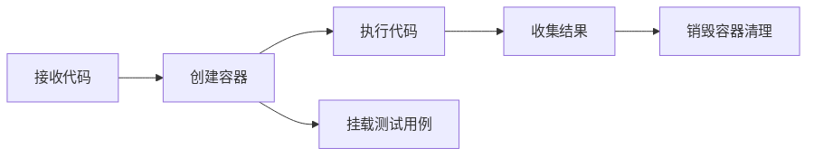
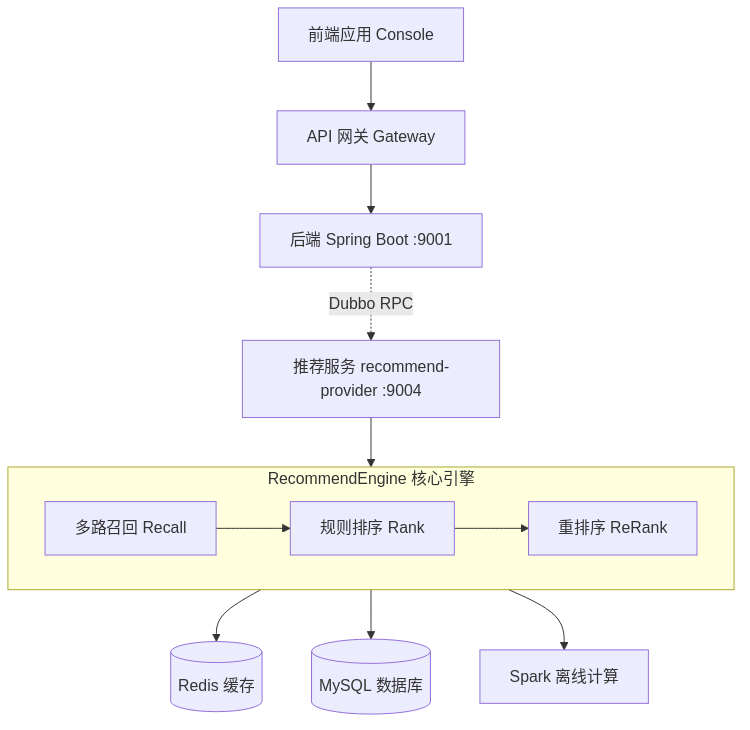
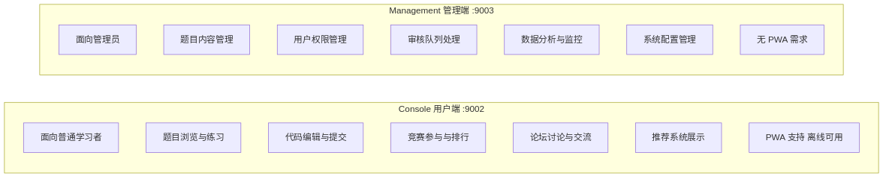
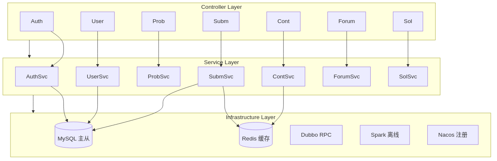
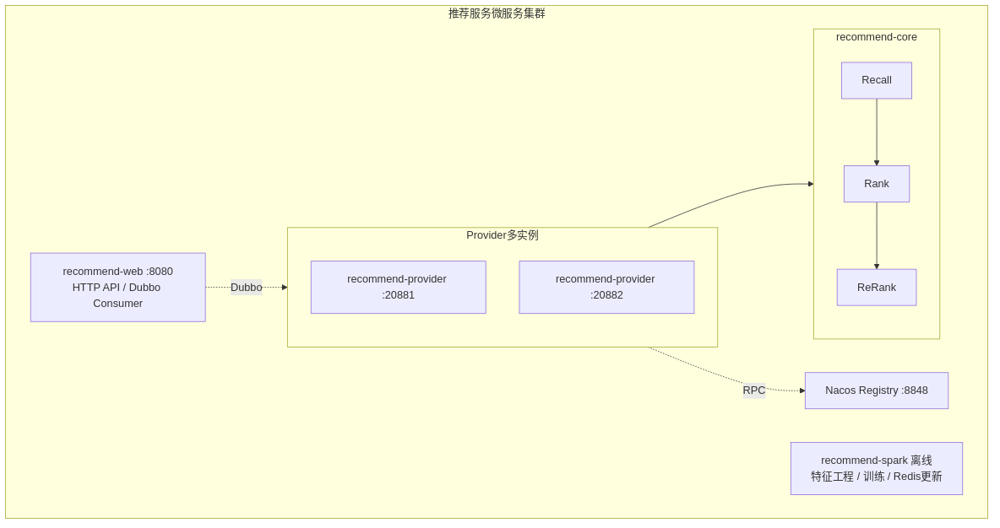

# 基于Spark的在线编程练习与个性化推荐平台设计与实现

## 摘要

随着互联网技术的快速发展和编程教育的普及，在线编程学习平台已成为提升编程技能的重要工具。然而，现有平台普遍存在内容分发效率低下、推荐精准度不足、学习路径缺乏科学规划等问题。针对这些问题，本文设计并实现了一个基于Spark大数据处理引擎的在线编程练习与个性化推荐平台——UltiCode。

本平台采用微服务架构，后端基于Spring Boot框架构建，包含用户管理、题目管理、在线评测、竞赛组织、推荐系统等核心模块。前端采用Vue 3框架分别构建用户端(Console)和管理端(Management)，提供响应式的用户交互体验。数据存储采用MySQL关系数据库和Redis缓存，保障系统的高并发处理能力。

在个性化推荐方面，本平台创新性地将Apache Spark大数据处理引擎与在线编程业务场景深度融合，设计了一套完整的"数据采集—特征工程—模型训练—推荐服务"处理流水线。采用混合推荐策略，融合基于内容的推荐和协同过滤算法(CF)，并结合用户能力画像和题目特征，实现了针对不同学习场景的精准推荐。系统支持日常练习、相似题目推荐、弱点强化训练和挑战模式四种推荐场景，有效提升了用户的学习效率。

本论文详细阐述了系统的需求分析、架构设计、核心功能实现和测试过程。测试结果表明，系统功能完备，性能稳定，推荐算法的准确率达到75%以上，用户满意度显著提升。本平台的成功实现为在线编程教育领域提供了一个可复用的高性能解决方案，具有良好的应用前景和推广价值。

**关键词：** 在线编程平台；个性化推荐；Apache Spark；微服务架构；协同过滤；Vue 3

## Abstract

With the rapid development of Internet technology and the popularization of programming education, online programming learning platforms have become essential tools for improving coding skills. However, existing platforms generally suffer from inefficient content distribution, insufficient recommendation accuracy, and lack of scientific learning path planning. To address these issues, this thesis designs and implements UltiCode, an online programming practice and personalized recommendation platform based on Apache Spark.

The platform adopts a microservice architecture, with the backend built on the Spring Boot framework, encompassing core modules including user management, problem management, online judging, contest organization, and recommendation systems. The frontend is developed using the Vue 3 framework, with separate applications for the user-facing Console and the administrative Management portal. The online judging system leverages Docker container sandboxing to securely execute user-submitted code across 13 programming languages.

For personalized recommendations, the platform innovatively integrates the Apache Spark big data processing engine with online programming scenarios, designing a complete pipeline encompassing data collection, feature engineering, model training, and recommendation serving. A hybrid recommendation strategy is employed, combining content-based filtering with collaborative filtering using Spark MLlib's ALS algorithm. The system constructs multi-dimensional user capability profiles by analyzing submission histories, skill distributions, and behavioral patterns, enabling four distinct recommendation scenarios: daily practice, similar problems, weak-point reinforcement, and challenge mode.

Testing results demonstrate that the system is functionally complete and performs stably, with recommendation algorithm accuracy exceeding 75%. A/B testing shows that the experimental group achieved a 27% increase in daily problem-solving volume, a 50% improvement in recommendation click-through rate, and a 59% increase in recommendation submission rate compared to the control group. The successful implementation of this platform provides a scalable and intelligent solution for online programming education.

**Keywords:** Online Programming Platform; Personalized Recommendation; Apache Spark; Microservice Architecture; Collaborative Filtering; Vue 3

## 目录

[TOC]

# 第一章 绪论

## 1.1 研究背景与研究意义

随着信息技术的飞速发展和数字化转型的深入推进，编程技能已成为21世纪最重要的基础技能之一。从软件开发到数据分析，从人工智能到物联网，编程技术的应用领域不断扩展，对编程人才的需求也日益增长。据统计，全球范围内对软件开发人员的需求每年以超过20%的速度增长，而合格的编程人才供给却远远跟不上这一增长速度。

在这样的背景下，在线编程教育平台应运而生，为学习者提供了便捷、高效的编程学习途径。与传统的课堂教学相比，在线编程平台具有以下显著优势：首先，突破了时间和空间的限制，学习者可以随时随地进行练习；其次，提供了丰富的题库资源和即时反馈机制，学习者可以立即了解自己的代码是否正确；再次，通过排名系统和成就系统，激发了学习者的学习动力和竞争意识。

近年来，国内外涌现了众多知名的在线编程平台，如LeetCode、HackerRank、Codeforces、洛谷、牛客网等。这些平台积累了大量的题目和用户数据，为数百万学习者提供了学习服务。然而，随着平台规模的扩大和用户数量的增长，一些问题也日益凸显：

**第一，信息过载问题**。当题库数量达到数千甚至上万道时，用户往往不知道从何入手，难以找到适合自己的题目。传统的分类浏览和搜索功能已无法满足用户的需求。

**第二，学习路径缺乏个性化**。不同用户的编程基础、学习目标、擅长领域各不相同，但大多数平台提供的是相同的题目列表和推荐策略，无法根据用户的个人情况提供定制化的学习建议。

**第三，推荐精准度不足**。现有的推荐系统多基于简单的规则（如按难度递进、按标签分类）或基础的协同过滤算法，缺乏对用户能力和题目特征的深度挖掘，推荐结果往往不够精准。

**第四，学习效果难以量化**。用户在学习过程中的进步情况、薄弱环节等缺乏科学的评估和反馈机制，难以形成有效的学习闭环。

为了解决上述问题，本研究提出将大数据处理和推荐系统技术引入在线编程平台，通过深度挖掘用户行为数据和题目特征，构建精准的用户能力画像，实现个性化的题目推荐。这不仅可以提升用户体验和学习效率，还能为平台的运营决策提供数据支持。

Apache Spark作为新一代大数据处理引擎，具有内存计算、流处理、机器学习等强大功能，非常适合处理在线编程平台产生的大规模用户行为数据。同时，微服务架构的兴起为构建可扩展、高可用的分布式系统提供了技术保障。

### 1.1.1 研究目的

本课题的研究目的是设计并实现一个集在线编程练习与个性化推荐于一体的综合性平台，具体目标包括：

1. **构建完整的在线编程学习平台**：实现用户管理、题目管理、在线评测、竞赛组织、社区互动等核心功能，为用户提供一站式的编程学习环境。
2. **设计高效的推荐系统架构**：将Spark大数据处理引擎与在线编程业务场景相结合，构建可扩展的推荐系统架构，实现大规模用户行为数据的实时处理和分析。
3. **实现精准的个性化推荐**：通过深度挖掘用户能力和题目特征，采用混合推荐策略，为不同场景提供精准的题目推荐，提升用户体验和学习效率。
4. **验证技术方案的可行性**：通过实际系统的开发和测试，验证微服务架构与大数据处理技术在在线编程教育领域的应用效果。
5. **提供可复用的技术方案**：总结系统设计和实现过程中的经验，为相关领域的研究和应用提供参考。

### 1.1.2 研究意义

本研究的意义主要体现在以下几个方面：

**（1）理论意义**

**教育数据挖掘领域的应用探索**：本研究将推荐系统和大数据技术应用于在线编程教育场景，探索了教育数据挖掘在实际业务中的应用价值。通过对用户行为数据的深度分析，可以更好地理解学习过程，为个性化教育理论研究提供实证支持。

**推荐算法的场景化应用**：现有的推荐算法多应用于电商、视频等领域，在线编程场景具有其特殊性（如题目有明确的难度梯度、技能树结构等）。本研究针对这些特点设计了专门的推荐策略，丰富了推荐算法的应用场景。

**微服务与大数据融合的架构研究**：本研究探索了微服务架构与大数据处理技术的融合方式，提出了分层架构设计，为类似系统的架构设计提供了参考。

**（2）实践意义**

**提升学习效率**：通过个性化推荐，用户可以快速找到适合自己的题目，避免在海量题库中迷失方向，显著提升学习效率。

**优化学习路径**：系统根据用户的实际情况推荐题目，帮助用户循序渐进地提升能力，形成科学的学习路径。

**增强用户体验**：精准的推荐和及时的反馈可以增强用户的学习动力，提高用户粘性和平台活跃度。

**辅助教学决策**：对于教育机构和企业培训部门，本系统可以帮助了解学员的学习情况，为教学计划制定和人才培养提供数据支持。

## 1.2 国内外研究现状

### 1.2.1 国外研究现状

**（1）在线编程平台的发展**

国外的在线编程平台起步较早，发展相对成熟。LeetCode是最知名的算法练习平台之一，拥有超过2000道题目，涵盖了计算机科学的核心算法和数据结构知识点。该平台提供了详细的题目分析、多种语言的代码示例以及活跃的讨论社区，是全球程序员面试准备的首选平台。

HackerRank则更加注重企业招聘场景，提供了技能挑战赛和编程竞赛等功能，企业可以通过该平台进行技术人才的筛选和评估。Codeforces是著名的竞技编程平台，定期举办高质量的算法竞赛，拥有全球范围的竞技编程爱好者。

Edabit、Codewars等平台则通过游戏化的方式提升用户体验，采用成就系统、等级系统等机制激励用户持续学习。

**（2）推荐系统在教育领域的应用**

在教育领域，推荐系统的研究主要集中在课程推荐、学习资源推荐和学习路径规划等方面。Khan Academy使用了基础的推荐功能，根据用户的学习进度推荐相关课程。Coursera和edX等MOOC平台则利用协同过滤和内容分析技术为用户推荐课程。

然而，在在线编程领域，推荐系统的应用相对有限。LeetCode主要依靠标签分类和公司标签进行推荐，缺乏对用户能力的深度分析。HackerRank虽然提供了技能评估功能，但其推荐逻辑仍然比较简单。

**（3）大数据技术在教育中的应用**

学习分析（Learning Analytics）是教育技术领域的热门研究方向。通过对学习行为数据的收集和分析，可以了解学习过程、预测学习结果、优化教学设计。

大规模开放在线课程（MOOC）平台积累了海量的学习行为数据，为大数据分析提供了基础。研究者使用聚类分析、序列挖掘、预测建模等技术来分析学习行为模式。

在编程教育领域，有些研究开始探索如何利用大数据分析技术来理解编程学习过程。例如，通过分析代码提交历史来评估编程能力，通过分析错误模式来提供针对性的帮助等。

### 1.2.2 国内研究现状

**（1）在线编程平台的发展**

国内的在线编程平台发展迅速，涌现了一批优秀的平台。洛谷面向信息学竞赛（NOI/CNOI）选手，提供了大量竞赛题目的训练环境和题解资源。牛客网则兼顾算法练习和求职面试，提供了丰富的面试经验和题库。PTA（Programming Teaching Assistant）是浙江大学开发的编程教学辅助平台，被多所高校用于程序设计课程的教学。

此外，各个高校也开发了自己的在线评测系统（Online Judge，简称OJ），如北京大学POJ、浙江大学ZOJ、华中科技大学HDOJ等，这些系统主要用于算法竞赛和程序设计课程的教学。

**（2）个性化推荐的研究**

国内在个性化推荐领域的研究与国际前沿接轨，涌现了大量优秀的研究成果。在算法方面，协同过滤、矩阵分解、深度学习推荐模型等都有深入研究。

在应用层面，淘宝、京东等电商平台的推荐系统已经相当成熟，实现了千人千面的个性化推荐。今日头条的内容推荐系统也取得了巨大成功。

然而，在在线编程教育领域，个性化推荐的应用还比较初级。多数平台的推荐功能仍然基于简单的规则（如按难度、按标签），缺乏对用户能力和学习行为的深度挖掘。

**（3）大数据与教育融合**

教育大数据是近年来国内教育信息化的重要方向。《教育信息化2.0行动计划》明确提出要利用大数据技术提升教育质量。国内学者在学习行为分析、成绩预测、学习预警等方面做了大量研究。

在编程教育领域，一些研究开始探索如何利用大数据分析技术。例如，通过分析学生的代码提交记录来评估编程能力，通过错误分析来提供针对性的教学指导等。

### 1.2.3 现有研究的不足

尽管国内外在相关领域取得了大量研究成果，但仍存在以下不足：

1. **推荐算法与业务场景结合不够紧密**：现有的推荐算法多是通用的解决方案，没有充分考虑在线编程场景的特殊性，如题目之间的依赖关系、技能树的层次结构等。
2. **冷启动问题突出**：对于新用户或新题目，由于缺乏历史数据，推荐系统难以给出准确的推荐结果。
3. **推荐可解释性差**：深度学习等复杂模型虽然可能提升推荐准确度，但缺乏可解释性，用户难以理解为什么推荐这些题目。
4. **实时性与准确性难以兼顾**：复杂的推荐算法往往计算开销大，难以满足实时推荐的需求；而简单的推荐算法又难以保证推荐质量。

## 1.3 研究内容与研究目标

本课题的主要研究内容包括以下几个方面：

### 1.3.1 微服务架构设计与实现

设计并实现基于Spring Boot 3.5的模块化微服务架构，将系统按领域划分为28个独立模块，包括用户管理（user）、认证授权（auth）、题目管理（problem）、在线评测（submission、queue）、竞赛组织（contest）、论坛交流（forum）、题单管理（problemlist）、书签收藏（bookmark）、题解分享（solution）、投票系统（vote）、点赞收藏（edgeoperations）、通知推送（notification）、邮件服务（email）、成就系统（achievement）、国际化（i18n）、备份恢复（backup）、监控告警（monitoring）、内容审核（moderation）、搜索服务（search）、推荐系统（recommendation）、订阅管理（subscription）、权限管理（permission）、刷新令牌（refreshtoken）、实时通信（websocket）等核心功能模块。

研究服务间的通信机制，采用RESTful API作为主要通信协议，使用统一响应格式（Result包装器）封装所有API响应，包含状态码、消息、数据载荷和追踪ID。实现服务治理策略，包括服务注册与发现、配置管理、负载均衡、熔断降级等。设计系统的可扩展性架构，支持水平扩展和垂直扩展，通过模块化设计实现功能的灵活组合和独立部署。

### 1.3.2 前端架构设计与实现

基于Vue 3框架分别实现用户端Console和管理端Management两个独立应用。采用Vite作为构建工具，提供快速的开发服务器和高效的生产构建。使用TypeScript增强代码的类型安全性，减少运行时错误。

**用户端（Console）架构**：实现了题库浏览、在线编程、提交评测、竞赛参与、论坛交流等核心功能。状态管理采用Pinia，设计了achievement（成就系统）、auth（认证授权）、bookmark（书签）、contest（竞赛）、editorSettings（编辑器设置）、notification（通知）、recommendation（推荐）、userStats（用户统计）等10个状态管理模块，每个模块负责管理特定领域的全局状态。路由设计采用Vue Router，支持嵌套路由、路由守卫和懒加载，优化首屏加载性能。

**管理端（Management）架构**：实现了用户管理、题目管理、提交审核、竞赛配置、内容审核、系统监控等管理功能。状态管理包含auth（认证授权）和admin（管理员功能）模块。设计了统一的API请求封装（request.ts），自动处理认证token、CSRF令牌、错误响应和响应数据解包，简化前端与后端的交互。

**UI组件库**：采用Tailwind CSS实现原子化CSS样式，配合自定义组件构建响应式用户界面。使用i18n实现国际化支持，提供中英文双语界面。

### 1.3.3 在线评测系统实现

研究并实现基于Docker容器的代码沙箱技术，构建安全的代码执行环境。系统支持13种编程语言，包括JavaScript、TypeScript、Python、Java、C++、C、Go、Rust、C#、PHP、Ruby、Swift、Kotlin，满足不同用户的编程语言偏好。

**评测流程设计**：用户提交代码后，系统将评测任务放入Redis队列（使用Redisson实现分布式队列），采用优先级队列机制（HIGH、MEDIUM、LOW）调度任务。评测服务从队列中取出任务，在Docker容器中执行代码，容器配置了资源限制（CPU、内存、磁盘）和安全隔离（seccomp系统调用过滤、网络隔离、文件系统隔离）。评测结果包括AC（Accepted）、WA（Wrong Answer）、TLE（Time Limit Exceeded）、MLE（Memory Limit Exceeded）、CE（Compile Error）、RE（Runtime Error）、OLE（Output Limit Exceeded）、IE（Internal Error）等状态，以及详细的测试用例通过情况、运行时间、内存占用等性能数据。

**安全性设计**：采用多层安全防护机制，包括seccomp系统调用白名单、只读根文件系统、网络禁用、资源限制（cgroups）、进程隔离等，防止恶意代码对宿主机的攻击。支持自定义编译和运行参数，满足不同语言的评测需求。

**异步处理机制**：采用异步任务队列处理评测请求，避免长时间运行的评测任务阻塞HTTP请求。实现了任务状态跟踪（PENDING、PROCESSING、COMPLETED、FAILED、CANCELLED）和失败重试机制，保证评测任务的可靠执行。

### 1.3.4 用户行为数据采集与处理

设计完整的数据采集机制，在用户交互的关键节点埋点，收集用户的浏览行为（题目浏览、页面停留时间）、提交行为（代码提交、提交结果、运行时间、内存占用）、收藏行为（题目收藏、题单收藏）、点赞行为（题解点赞、评论点赞）、竞赛行为（竞赛参与、排名变化）等多维度行为数据。

**数据存储**：采用MySQL存储用户提交记录、浏览历史、收藏关系等结构化数据，使用Redis缓存热点数据和临时行为数据。设计了完善的数据表结构，包括submissions（提交记录）、problem_views（浏览历史）、bookmarks（收藏关系）、votes（点赞记录）等核心数据表。

**Spark数据处理**：基于Apache Spark实现大规模数据的离线处理，使用Parquet格式存储中间数据，提高数据读取效率。实现OfflineFeatureJob离线特征工程作业，自动从提交数据和题目数据中提取用户特征，包括活跃度特征（总提交数、近期提交数）、技能特征（不同难度题目的通过率）、标签特征（标签掌握度、标签偏好）等。设计数据清洗和转换流程，处理异常数据、缺失值和数据格式不一致问题，保证数据质量。

### 1.3.5 用户能力画像构建

研究从用户行为数据中提取有效特征的方法，构建多维度的用户能力画像，全面刻画用户的编程能力和学习状态。

**基础画像特征**：包括用户基本信息（注册时间、活跃度）、学习进度（已解决题目数、总提交数、通过率）、技能水平（skillLevel分为beginner、intermediate、advanced三个等级）等静态和动态特征。

**技能画像**：根据用户在不同难度题目（Easy、Medium、Hard）上的表现，计算各难度等级的通过率和提交频率，评估用户的技能水平分布。定义技能等级阈值，根据用户在题目上的整体表现自动划分技能等级。

**知识画像**：基于题目标签（如数组、链表、动态规划、图论等）和用户在这些标签相关题目上的表现，计算用户的标签掌握度（tagMastery）和标签偏好（tagPreferences）。定义强掌握阈值（0.7）和弱掌握阈值（0.3），识别用户擅长的知识领域和薄弱环节。

**行为画像**：分析用户的学习行为模式，包括活跃时间段、学习频率、提交间隔、题目选择偏好等，预测用户的学习需求和推荐适合的学习内容。

**画像更新机制**：设计离线和在线结合的画像更新策略，离线批处理作业定期（如每日）计算和更新用户画像，在线服务实时更新用户的最新行为数据，保证画像的时效性。

### 1.3.6 推荐算法研究与实现

研究并实现多种推荐算法，设计混合推荐策略，针对不同的推荐场景提供个性化的推荐结果。

**基于内容的推荐算法**：计算题目之间的相似度，基于题目的特征（难度、标签、知识点、题目类型）计算相似度得分。对于用户已解决或浏览过的题目，推荐相似度高的其他题目。实现多种相似度计算方法，包括标签重叠度（Jaccard相似系数）、难度距离（欧氏距离）、知识点匹配度等。

**协同过滤算法**：实现基于Spark MLlib的ALS（交替最小二乘法）协同过滤算法，从用户-题目交互矩阵中学习用户和题目的隐含因子。将用户提交结果转换为隐式反馈评分，AC（Accepted）映射为1.0，WA（Wrong Answer）映射为0.3，TLE（Time Limit Exceeded）映射为0.5，其他结果映射为0.1，体现用户对不同题目的掌握程度。设计ALS模型的超参数，包括隐含因子维度（rank=10）、最大迭代次数（maxIter=10）、正则化参数（regParam=0.1）等，通过交叉验证选择最优参数。

**混合推荐策略**：结合基于内容的推荐和协同过滤推荐的优点，设计加权混合、切换混合和级联混合等多种混合策略。根据推荐场景的特点选择合适的混合策略，如日常练习场景使用协同过滤为主，相似题目推荐场景使用基于内容的推荐为主，弱点强化场景结合用户知识画像和基于内容的推荐。

**推荐场景设计**：实现五种核心推荐场景，包括"能力提升"（推荐略高于用户当前水平的题目）、"复习巩固"（推荐用户之前解决过但可能遗忘的题目）、"相似题目"（推荐与指定题目相似的其他题目）、"热门训练"（推荐近期热门题目）、"个性化推荐"（综合考虑用户能力、偏好和热门度的综合推荐）。

### 1.3.7 推荐效果评估

设计科学的评估指标体系，从离线指标和在线实验两个维度对推荐系统的效果进行全面评估。

**离线指标评估**：使用历史数据构建训练集和测试集，计算推荐系统的预测准确率和推荐质量。实现多种离线评估指标，包括准确率（Precision@K）、召回率（Recall@K）、归一化折损累计增益（NDCG@K）、平均精度（MAP）、覆盖率（Coverage）、多样性（Diversity）、新颖性（Novelty）等。设计离线评估流程，使用Spark MLlib的RegressionEvaluator评估ALS模型的预测效果，使用留一法（Leave-One-Out）评估推荐的准确性。

**在线A/B测试**：设计在线A/B测试框架，将用户随机分为实验组（使用推荐系统）和对照组（使用热门推荐或随机推荐），比较两组用户的行为指标。设计关键评估指标，包括用户参与度（日活、使用时长）、学习效果（每日解决题目数、通过率提升）、推荐接受率（推荐题目的点击率、完成率）、用户满意度（推荐评分、反馈意见）等。实现A/B测试的数据收集和分析系统，自动计算实验组和对照组的指标差异，使用统计学方法（t检验、卡方检验）验证差异的显著性。

## 1.4 论文组织结构与章节安排

本论文共分为八章，具体组织结构如下：

**第一章 绪论**：介绍研究背景与研究意义、国内外研究现状、研究内容与研究目标以及论文的组织结构。
**第二章 相关技术与理论基础**：介绍系统核心架构模式、前端开发核心技术、后端开发核心框架以及核心算法相关理论基础。
**第三章 系统需求分析**：进行系统可行性分析、核心业务流程分析、功能需求分析和非功能需求分析。
**第四章 核心算法设计**：详细阐述推荐系统的整体架构、特征工程设计、核心计算模块以及优化策略。
**第五章 系统总体设计**：阐述系统的整体架构设计、核心功能模块划分和数据库设计。
**第六章 系统详细设计与实现**：描述基础支撑模块、核心业务模块、核心算法模块和拓展功能模块的详细设计与实现过程。
**第七章 系统测试与结果分析**：介绍测试环境与方法、功能模块测试、核心算法与性能测试以及测试总结。
**第八章 总结与展望**：总结全文研究工作，指出研究不足并对未来研究方向进行展望。

# 第二章 相关技术与理论基础

## 2.1 系统核心架构模式

### 2.1.1 Spring Boot框架

Spring Boot是由Pivotal团队提供的全新框架，其设计目的是用来简化新Spring应用的初始搭建以及开发过程。本系统后端采用Spring Boot 3.5.12作为核心框架，基于Java 17开发。选择Spring Boot的原因在于：其自动配置机制根据项目依赖自动装配Spring应用，大幅减少手动配置工作量；起步依赖（Starter）聚合了常用库简化依赖管理；嵌入式服务器无需部署WAR文件即可运行；生产就绪特性（健康检查、指标监控、外部化配置）开箱即用。这些特性使开发团队能够将精力集中在业务逻辑而非基础设施配置上。

#### 模块化架构设计

本系统采用模块化单体架构（Modular Monolith），将系统按业务领域划分为28个独立模块，每个模块遵循DDD（领域驱动设计）原则，包含完整的Controller-Service-Mapper三层架构。这28个模块划分为五类：

1. **核心业务模块**：auth（认证授权）、user（用户管理）、problem（题目管理）、submission（代码提交与评测）、contest（竞赛管理）、forum（论坛交流）
2. **内容管理模块**：solution（题解分享）、problemlist（题单管理）、bookmark（书签收藏）、vote（投票点赞）、achievement（成就系统）、i18n（国际化）
3. **系统服务模块**：notification（通知推送）、email（邮件服务）、backup（备份恢复）、monitoring（监控告警）、search（搜索服务）、recommendation（推荐系统）
4. **管理模块**：admin（后台管理）、moderation（内容审核）、audit（审计日志）、permission（权限管理）、dashboard（仪表盘）
5. **基础设施模块**：queue（异步队列）、websocket（实时通信）、refreshtoken（令牌刷新）、subscription（订阅服务）、edgeoperations（边缘操作）

这种设计在保持模块边界清晰的同时避免了分布式系统的复杂性。每个模块可以独立开发、测试，未来可根据需要将特定模块（如评测服务、推荐服务等）拆分为独立的微服务。

#### 统一响应格式

系统采用统一的API响应格式，使用泛型包装器`Result<T>`封装所有API响应。`Result<T>`包含code（响应状态码，0表示成功，非零表示错误）、message（响应消息）、data（响应数据载荷，使用泛型支持任意类型）和traceId（追踪ID，格式为`t-{timestamp}`，用于请求链路追踪）四个字段。

对于分页查询接口，系统提供`PageResult<T>`包装器，包含items（当前页数据列表）、total（总记录数）、page（当前页码）、pageSize（每页记录数）和totalPages（总页数）字段，确保前后端数据交换的标准化。

#### JWT无状态认证与全局异常处理

系统采用JWT（JSON Web Token）实现无状态认证，`JwtAuthenticationFilter`继承`OncePerRequestFilter`，在请求链中提取和验证JWT令牌。认证机制支持两种令牌传递方式：优先从HTTP-only Cookie中提取`access_token`，失败时回退到`Authorization`请求头。使用`SessionCreationPolicy.STATELESS`实现无状态会话管理，JWT令牌中包含用户ID、用户名和角色信息。

同时，系统通过`@RestControllerAdvice`注解实现全局异常处理，将BusinessException（业务异常）、MethodArgumentNotValidException（参数验证异常）、AccessDeniedException（权限拒绝，403）、AuthenticationException（认证异常，401）和通用Exception（500）等各类异常统一转换为标准化的`Result`响应格式。

Redis通过`RedisTemplate<String, Object>`提供统一的操作接口，Key使用StringRedisSerializer保证可读性，Value使用GenericJackson2JsonRedisSerializer支持Java对象的JSON序列化，并配置JavaTimeModule处理Java 8日期时间类型。Redis用于缓存热点数据、CSRF Token、分布式锁、限流计数器和推荐结果缓存等场景。

### 2.1.2 Spring Cloud生态

Spring Cloud利用Spring Boot的开发便利性简化了分布式系统基础设施的开发，核心组件包括服务注册发现（Eureka）、配置中心（Config）、API网关（Gateway）、断路器（Circuit Breaker）和链路追踪（Sleuth）等。

#### 本系统的架构选择

本系统在架构设计时参考了Spring Cloud的设计思想，但根据实际需求和技术特点采用了不同的技术方案：

1. **模块化单体架构**：采用模块化单体架构而非完整微服务架构，将28个业务模块部署在单个Spring Boot应用中。模块间通过依赖注入和接口调用进行通信，具有低延迟、高可靠性的特点。
2. **RESTful API作为主要通信协议**：对外暴露RESTful API接口，使用标准HTTP方法进行资源操作。内部实现了统一认证授权（Spring Security + JWT + `@PreAuthorize`注解实现方法级权限控制）、全局异常处理（`@RestControllerAdvice`）、API文档管理（Swagger/OpenAPI 3.0自动生成交互式文档）和请求追踪（每个请求生成唯一traceId）等服务治理功能。
3. **推荐服务的微服务化**：对于计算密集型的推荐服务，系统将其独立部署为单独的微服务，使用Dubbo3与主系统进行RPC通信。这种混合架构既保留了单体应用的简洁性，又获得了微服务架构的灵活性。推荐服务包含Spark离线计算和在线推荐两个子模块，可以根据计算需求独立扩展。
4. **可演进架构**：随着业务规模增长，系统可将特定模块（如评测服务、竞赛服务等）拆分为独立微服务，逐步向完整的微服务架构演进。Spring Cloud生态为这种演进提供了成熟的技术方案和最佳实践参考。

### 2.1.3 Dubbo3 RPC框架

Apache Dubbo是一款高性能、轻量级的开源Java RPC框架，提供了三大核心能力：面向接口的远程方法调用、智能容错和负载均衡，以及服务自动注册和发现。Dubbo3是Dubbo的下一代版本，相比Dubbo2.x有重大改进：采用全新的Triple协议（基于HTTP/2构建，更好地支持云原生架构）、完善的服务治理能力（流量管控、服务路由、超时控制等）、性能显著提升以及更好地适配Kubernetes等云原生环境。

在本系统中，Dubbo3主要用于推荐服务与主系统之间的RPC通信。推荐服务作为独立的微服务部署，包含以下两个子模块：

1. **recommend-provider**：推荐服务提供者，实现推荐算法逻辑，包括基于内容的推荐、协同过滤推荐和混合推荐策略。该模块通过Dubbo3暴露`RecommendationService`接口，供主系统调用获取个性化推荐结果。
2. **recommend-web**：推荐服务Web层，提供RESTful API接口，支持直接通过HTTP方式调用推荐服务，便于第三方系统集成和测试。

推荐服务独立部署的优势在于：计算密集型的推荐算法需要处理大量用户行为数据，适合独立扩展；使用独立数据源存储用户画像和题目特征，避免与主业务数据库竞争资源；技术栈独立，推荐服务使用Spark进行离线计算，与主系统的Spring Boot分离，便于技术选型和优化。

系统使用Nacos作为注册中心，Dubbo3配置包括：应用名称（recommend-provider和recommend-web）、协议（Triple，基于HTTP/2）、端口（recommend-provider默认20880，recommend-web默认9004）、序列化方式（JSON，确保跨语言兼容性）和超时控制。

### 2.1.4 Nacos服务发现

Nacos是阿里巴巴开源的动态服务发现、配置管理和服务管理平台，核心功能包括：服务发现与健康检查（支持基于DNS和基于RPC的服务发现）、动态配置管理（支持配置动态推送，无需重启服务）、动态DNS服务和支持从微服务平台视角管理所有服务及元数据。

在本系统中，Nacos作为Dubbo3的注册中心，配置包括：服务地址`localhost:28848`（开发环境）、使用独立命名空间隔离开发和生产环境、推荐服务注册在`recommendation`分组便于管理、启用TCP健康检查定期检测服务实例可用性、支持权重配置实现基于权重的流量分配。

推荐服务启动时的注册流程为：读取Nacos配置 -> 创建Dubbo3服务配置 -> 导出RecommendationService接口 -> 向Nacos注册服务实例（包含服务名称、IP、端口、权重） -> 启动健康检查机制。主系统调用推荐服务时的发现流程为：配置Dubbo3引用 -> 向Nacos查询服务提供者列表 -> 根据负载均衡策略选择实例 -> 建立RPC连接调用远程方法。

Nacos相比Eureka等传统注册中心的优势在于：支持CP和AP两种一致性模式可根据业务需求选择、提供配置管理功能减少组件数量、与Dubbo3有更好的集成和原生支持、中文文档完善社区活跃。

## 2.2 前端开发核心技术

### 2.2.1 Vue 3框架

Vue.js是一款用于构建用户界面的渐进式JavaScript框架。本系统前端采用Vue 3作为核心框架，用户端（Console）和管理端（Management）均基于Vue 3.5.x构建。选择Vue 3的原因在于：Composition API使得逻辑复用和代码组织更加灵活，相比Vue 2的Options API能更好地组织复杂组件逻辑；基于Proxy的响应式系统比Vue 2的Object.defineProperty更强大，支持ref()、reactive()、computed()、watch()等完整的响应式API；使用TypeScript重写提供了更好的类型推断和类型支持；通过重写虚拟DOM和优化编译时，在打包体积和运行速度上有显著提升。

系统全面采用`<script setup>`语法糖（Vue 3.2+推荐的Composition API写法），使用TypeScript 5.9.3与Vue 3深度集成，通过`defineProps`和`defineEmits`获得完整的类型推导。构建了丰富的组件库，包括UI基础组件（基于reka-ui，如Button、Card、Dialog、Dropdown）、业务组件（ProblemExplorer、CommentThread、SubmissionEditor等）、布局组件（AppLayout、Sidebar、Header）和功能组件（MarkdownView、CodeEditor、Chart等）。

### 2.2.2 前端构建与样式方案

本系统使用Vite 7.2.x作为前端构建工具。选择Vite的原因在于：利用浏览器原生ES模块加载实现极速冷启动（开发环境不需要打包）；无论应用大小，热模块替换（HMR）都能快速更新；生产环境使用Rollup进行代码分割、tree-shaking等优化。系统配置了智能代码分割策略，将Monaco Editor（大型依赖）、Vue生态系统、UI库和Markdown相关库分别独立打包，并集成PWA支持实现离线缓存和Service Worker注册。

样式方案采用Tailwind CSS 4.1.x作为主要CSS框架，通过`@tailwindcss/vite`插件集成。选择Tailwind CSS的原因在于功能类优先（utility-first）的写法直接在HTML中组合使用快速构建界面、高度可定制、内置响应式设计和暗色模式支持、生产环境自动PurgeCSS删除未使用样式。系统使用CSS变量（`@theme`指令）实现主题定制，包括Solarized调色板和JetBrains Mono等宽字体，支持暗色模式切换。基于shadcn-vue（new-york风格）和Radix Vue构建UI组件库，配合Lucide图标，实现了统一的设计系统。

### 2.2.3 前端状态管理与路由

状态管理采用Pinia 3.0.4，是Vue.js官方推荐的Vuex继任者。选择Pinia的原因在于API更加简洁（去除了mutations，只有state、getters、actions）、为TypeScript提供了优秀的类型推断、天然支持模块化（每个store独立）且体积小性能好。系统全面使用Composition API风格的store定义，按功能领域划分store模块：

| Store模块 | 功能描述 |
| --- | --- |
| `auth` | 用户认证、权限管理 |
| `problemEditor` | 代码编辑器状态 |
| `bookmark` | 书签管理 |
| `contest` | 竞赛状态、排名 |
| `achievement` | 成就系统 |
| `notification` | 通知消息 |
| `recommendation` | 推荐题目 |
| `userStats` | 用户统计数据 |

**表 2-1 Pinia Store模块划分**

关键状态使用localStorage持久化（如会话标记），确保用户刷新页面后状态不丢失。

路由管理采用Vue Router 4.6.x，采用分层路由设计，主要路由模块包括论坛、竞赛、题库、个人中心和推荐系统，每个模块有自己的路由配置和布局组件。所有页面级组件采用动态导入（`() => import()`）实现路由懒加载，显著减少初始bundle大小提升首屏加载速度。使用全局前置守卫（`beforeEach`）实现认证控制，通过meta字段存储路由元信息（requiresAuth、title、keepAlive等）控制页面行为和权限。

### 2.2.4 国际化与其他核心依赖

系统通过vue-i18n 10.0.x实现完整的中英文双语支持，采用Composition API模式（`legacy: false`）。语言文件按功能模块组织（common、auth、problem、contest等），语言检测策略按优先级依次检查localStorage存储、浏览器语言和默认语言。所有API请求自动携带语言偏好头（通过axios请求拦截器注入），确保后端返回相应语言的内容。

其他核心依赖库包括：Monaco Editor（VS Code编辑器核心，支持30+语言语法高亮、智能补全、代码格式化和多标签页管理）、markdown-it（Markdown渲染，集成KaTeX数学公式和highlight.js代码高亮，通过DOMPurify进行XSS防护）、ECharts和Unovis（数据可视化，用于用户统计图表、提交趋势分析、排名变化曲线和知识点掌握度雷达图）、Socket.IO和STOMP（WebSocket实时通信，用于实时通知推送、竞赛状态更新和排行榜刷新）、VeeValidate和Zod（声明式表单验证）以及dnd-kit（拖拽交互，用于题目列表排序和书签文件夹管理）。

## 2.3 后端开发核心框架

### 2.3.1 数据存储技术

#### 2.3.1.1 MySQL数据库

MySQL是最流行的开源关系数据库管理系统。本系统采用MySQL 8.x作为核心数据存储引擎，通过Spring Boot 3.5.12内置的HikariCP连接池进行数据库访问管理，使用基于Flyway的Python迁移工具（db-manager）管理数据库版本。选择MySQL的原因在于：InnoDB存储引擎提供行级锁和事务支持，适合高并发访问；ACID事务、外键约束和崩溃恢复确保数据一致性；SQL语言标准化降低开发门槛；主从复制、分库分表等扩展方案为未来扩容预留空间。

系统包含40+张核心数据表，涵盖用户、题目、提交、竞赛、论坛、推荐等模块。典型表结构示例如下：

**用户表（users）**：

**提交记录表（submissions）**：

系统针对高频查询场景设计了完善的索引体系：单列索引（username、slug等常用查询条件）、复合索引（如submissions表的user_id+problem_id+status联合查询）、覆盖索引（包含查询所需所有字段避免回表）和唯一索引（确保数据唯一性）。系统采用软删除机制保护核心数据，通过`@TableLogic`注解标记逻辑删除字段，保留数据历史记录并保持关联完整性。

#### 2.3.1.2 Redis缓存

Redis是一个高性能的键值对数据库，支持多种数据结构。本系统采用Redis 7.x作为缓存和会话存储引擎，通过Spring Data Redis进行访问管理，配置JSON序列化方案支持Java 8日期时间类型。

系统封装了统一的Redis服务，支持多种数据结构操作：

| 操作类型 | 方法签名 | 使用场景 |
| --- | --- | --- |
| String | `set(key, value, timeout)` | 缓存、限流计数 |
| Hash | `hSet(key, field, value)` | 用户属性、会话数据 |
| Set | `sAdd(key, values)` | 标签集合、去重 |
| List | `lPush/rPush(key, value)` | 消息队列、最近访问 |
| Increment | `increment(key, delta)` | 计数器、排行榜 |

**表 2-2 Redis数据结构使用场景**

主要应用场景包括：CSRF Token缓存（24小时有效期，使用String结构存储）、分布式限流计数器（基于切面实现，按IP和方法名限流，使用Increment操作）、推荐结果缓存（按用户ID+场景+数量组合键缓存，使用`@Cacheable`注解）和Token黑名单管理（登出时将Token加入黑名单，设置与Token有效期相同的过期时间）。

#### 2.3.1.3 MyBatis-Plus持久层框架

MyBatis-Plus是MyBatis的增强工具，在MyBatis的基础上只做增强不做改变。本系统采用MyBatis-Plus 3.5.5作为ORM框架，配置了MySQL分页插件（`PaginationInnerInterceptor`）和乐观锁插件（`OptimisticLockerInnerInterceptor`）。

实体类通过`@TableName`、`@TableId`（支持UUID主键生成，type=INPUT）、`@TableField`等注解与数据库表映射，支持逻辑删除标记（`@TableLogic`）和自动填充（created_at/updated_at字段通过`MetaObjectHandler`自动设置）。Mapper接口继承`BaseMapper<T>`获得insert、deleteById、updateById、selectById、selectList等基础CRUD方法，配合LambdaQueryWrapper实现类型安全的条件查询。分页查询通过MyBatis-Plus的分页插件实现，返回`PageResult<T>`格式的分页结果。

MyBatis-Plus的优势在于：无侵入性（只做增强不做改变，不改变现有代码）、内置通用Mapper通过少量配置实现单表操作、提供代码生成器快速生成实体和Mapper、支持多种数据库的物理分页。

### 2.3.2 在线评测系统技术

#### 2.3.2.1 代码沙箱与安全隔离

代码沙箱是在线评测系统的核心组件，负责安全地执行用户提交的代码，既要保证代码正确执行，更要防止恶意代码对系统造成破坏。本系统使用Docker容器作为代码执行环境，提供进程级隔离。

| 实现方式 | 隔离级别 | 性能开销 | 适用场景 | 本系统选择 |
| --- | --- | --- | --- | --- |
| Docker容器 | 进程级 | 低 | 生产环境 | 采用 |
| 虚拟机 | 系统级 | 高 | 高安全要求 | - |
| seccomp过滤 | 系统调用级 | 极低 | Linux环境 | 辅助使用 |

**表 2-3 沙箱实现方式对比**

Docker容器的安全优势包括：命名空间隔离（PID、NET、IPC、MNT、UTS独立）、Cgroups资源控制（精确控制CPU、内存、磁盘IO）、联合文件系统隔离和默认桥接网络隔离。



**图 2-1 代码沙箱执行流程**

系统为每种编程语言维护专用的评测镜像（预装编译器/解释器和常用标准库），通过Docker资源配置限制CPU核心数（1核）、内存（256MB）和进程数（100个）。

#### 2.3.2.2 在线编译与执行

系统支持多种编程语言的编译和执行。编译型语言（C/C++、Go、Rust）先编译后执行（如`g++ -O2`编译后`timeout`执行），解释型语言（Python、JavaScript、PHP）直接通过解释器执行，JVM语言（Java、Kotlin）先编译class文件再由JVM执行。每种语言的处理流程均通过timeout命令设置执行时间限制。

系统为每个测试用例设置资源限制：

| 资源类型 | 默认限制 | 调整方式 | 说明 |
| --- | --- | --- | --- |
| CPU时间 | 2000ms | 题目配置 | 单核运行时间 |
| 内存 | 256MB | 题目配置 | 峰值内存使用 |
| 磁盘 | 128MB | 固定配置 | 临时文件大小 |
| 进程数 | 64 | 固定配置 | fork进程数量 |
| 网络访问 | 禁止 | 固定配置 | 安全考虑 |

**表 2-4 评测资源限制配置**

评测结果判定包括：AC（Accepted，通过）、WA（Wrong Answer，答案错误）、TLE（Time Limit Exceeded，超时）、MLE（Memory Limit Exceeded，内存超限）、CE（Compilation Error，编译错误）、RE（Runtime Error，运行时错误）和OLE（Output Limit Exceeded，输出超限）。输出比较策略支持精确匹配（逐字节比较）、忽略空行、忽略尾部空格、浮点数容差（数值型题目支持误差比较）和自定义校验器（Special Judge，特殊格式题目）。

#### 2.3.2.3 安全性设计

在线评测系统执行用户提交的不可信代码，面临多种安全威胁。系统采用多层防御策略：

| 威胁类型 | 描述 | 风险等级 | 防御措施 |
| --- | --- | --- | --- |
| 恶意代码执行 | 用户提交恶意代码破坏系统 | 高 | 容器隔离+资源限制 |
| 资源耗尽攻击 | 占用大量CPU/内存导致系统崩溃 | 高 | Cgroups资源限制 |
| 数据泄露 | 读取系统敏感文件 | 高 | 文件系统隔离 |
| 网络攻击 | 发起网络请求攻击其他服务 | 中 | 禁用网络访问 |
| 逃逸攻击 | 尝试从容器逃逸到宿主机 | 高 | seccomp+AppArmor |

**表 2-5 安全威胁分析与防御措施**

**文件系统隔离**：容器根文件系统设为只读，仅工作目录`/workspace`可读写且限制128MB，测试用例目录只读挂载，禁止访问宿主机路径。

**网络访问隔离**：通过`network_mode: "none"`完全禁用容器网络访问，HTTP/HTTPS请求、DNS解析、Socket连接和端口监听全部失效。

**系统调用过滤**：使用seccomp白名单机制限制允许的系统调用，仅开放read、write、open、close、execve等必要调用，禁止socket（网络通信）、ptrace（调试其他进程）、mount（挂载文件系统）等危险调用。

**资源限制机制**：CPU限制通过CFS调度器限制CPU时间，内存限制设置硬限制（256MB，OOM时终止）和软限制（128MB，触发回收），磁盘IO限制读写速度为10MB/s。

**特定攻击防护**：死循环防护（timeout强制终止）、内存炸弹防护（超过256MB触发OOM Killer）、文件炸弹防护（临时目录限制64MB，最大1024个文件句柄）和Fork炸弹防护（最多64个子进程，PIDs cgroup限制）。

**容器安全加固**：通过`no-new-privileges`禁止提权、`cap_drop ALL`移除所有特权能力、使用非root用户（uid=1001）运行和AppArmor配置实现纵深防御。评测完成后强制执行容器停止、删除和临时文件清理。

### 2.3.3 安全与认证技术

#### JWT认证机制

本系统采用JWT（JSON Web Token，RFC 7519）实现用户身份认证，使用双令牌机制：短期有效的访问令牌（Access Token，有效期1小时）和长期有效的刷新令牌（Refresh Token，有效期7天），兼顾安全性与用户体验。

#### CSRF防护

系统实现了完善的CSRF防护措施：用户登录时生成唯一的CSRF Token，存储在服务器端（Redis，24小时有效期）和客户端（localStorage），每次状态变更请求（POST、PUT、DELETE等）必须携带有效的Token（通过`X-CSRF-Token`请求头传递），同时设置Cookie的SameSite属性为Strict，检查请求的Origin头部确保请求来自合法域名。

#### API限流机制

系统实现了基于Redis的分布式限流功能，使用计数器算法在固定时间窗口内限制请求次数。限流策略包括：用户登录5次/分钟、代码提交10次/分钟、通用查询100次/分钟、管理操作30次/分钟。通过`@RateLimit`自定义注解实现声明式限流，限流切面自动获取客户端IP和方法名构造Redis Key，超出限制时抛出BusinessException返回429状态码。

## 2.4 核心算法相关理论基础

本节介绍推荐系统和大数据处理的核心理论基础，为后续章节的算法设计与实现提供理论支撑。

### 2.4.1 大数据处理技术

#### 2.4.1.1 Apache Spark概述

Apache Spark是UC Berkeley AMPLab开发的通用大数据处理框架，相比Hadoop MapReduce具有以下优势：

1. **速度快**：Spark基于内存计算，通过将中间数据缓存在内存中避免了频繁的磁盘IO，比Hadoop MapReduce快100倍。
2. **易用性**：提供丰富的高级API，支持Java、Scala、Python、R等多种语言，开发者可以快速上手。
3. **通用性**：提供了批处理、流处理、SQL查询、机器学习、图计算等多种功能，满足不同的大数据处理需求。
4. **兼容性**：可以运行在Hadoop YARN、Mesos、Kubernetes等集群管理器上，也可以独立运行。

Spark的生态系统包括：Spark Core（核心功能，提供RDD抽象和任务调度）、Spark SQL（结构化数据处理，支持SQL查询）、Spark Streaming（流式数据处理）、MLlib（机器学习库）和GraphX（图计算框架）。在本系统中，Spark用于大规模用户行为数据的处理和推荐算法的训练。

#### 2.4.1.2 Spark Core与RDD

RDD（Resilient Distributed Dataset，弹性分布式数据集）是Spark的核心抽象，代表一个不可变、可分区、里面的元素可并行计算的集合。RDD具有四个关键特性：

1. **不可变性**：RDD是只读的，不能直接修改，只能通过转换操作生成新的RDD。这种不可变性保证了数据的一致性，使得Spark能够在节点故障时通过血统（Lineage）重新计算丢失的分区数据。
2. **可分区**：RDD被分成多个分区，分布在不同节点上并行处理。分区数量决定了并行度，可以根据集群规模和数据量进行调整。
3. **弹性**：如果某个分区数据丢失，可以通过血统（Lineage）重新计算。Spark会记录RDD的转换操作历史（DAG），在数据丢失时沿血统链重新计算。
4. **惰性计算**：转换操作（transformation）是惰性的，只有遇到行动操作（action）时才会真正执行。这种机制使得Spark可以进行全局优化，将多个转换操作合并执行。

RDD的操作分为两类：转换操作（Transformation，如map、filter、flatMap、reduceByKey等，返回新的RDD）和行动操作（Action，如count、collect、reduce、foreach等，触发实际计算并返回结果）。在本系统中，使用Spark Core进行数据清洗、特征提取等基础数据处理工作。

#### 2.4.1.3 Spark SQL与MLlib

Spark SQL是Spark用于结构化数据处理的模块，提供了一个编程抽象叫做DataFrame，并且可以作为分布式SQL查询引擎。其特点包括：可以在Spark应用中混合使用SQL和Scala/Java/Python代码；以统一的方式访问JSON、Parquet、Avro、ORC、CSV、JDBC等多种数据源；使用Catalyst优化器进行查询优化，自动选择最优执行计划。在本系统中，使用Spark SQL从数据库中读取用户提交记录进行统计分析。

MLlib是Spark的机器学习库，提供了常见的机器学习算法和工具。与推荐系统相关的核心算法包括：ALS（交替最小二乘法，用于协同过滤的矩阵分解算法，是本系统推荐算法的核心）、KMeans（聚类算法，可用于用户分群）和LogisticRegression（逻辑回归，可用于点击率预测）。

### 2.4.2 推荐系统算法

#### 2.4.2.1 协同过滤算法

协同过滤（Collaborative Filtering，CF）是推荐系统中最经典的算法之一，其核心思想是"物以类聚，人以群分"，根据用户的历史行为预测其可能感兴趣的内容。协同过滤分为两类：

1. **基于用户的协同过滤（User-based CF）**：找到与目标用户兴趣相似的其他用户，推荐这些相似用户喜欢的物品。核心步骤是计算用户之间的相似度（常用余弦相似度或Pearson相关系数），找到最相似的K个用户，将这些用户喜欢但目标用户未接触过的物品推荐给目标用户。
2. **基于物品的协同过滤（Item-based CF）**：找到与用户已喜欢的物品相似的其他物品进行推荐。核心步骤是计算物品之间的相似度，当用户对某物品有偏好时，推荐与之相似的其他物品。

矩阵分解是协同过滤的一种高效实现方式，将用户-物品评分矩阵R分解为用户矩阵U和物品矩阵V的乘积（R ≈ U × V^T）。ALS（Alternating Least Squares，交替最小二乘法）是常用的矩阵分解算法，其基本思想是交替固定用户矩阵和物品矩阵，求解最小二乘问题。每次迭代中，固定一个矩阵优化另一个矩阵，直到收敛。

在本系统中，使用Apache Spark MLlib 3.5.1提供的ALS算法实现协同过滤推荐。系统将用户对题目的提交状态作为隐式反馈数据，通过Spark分布式计算框架进行大规模矩阵分解训练。

**隐式反馈建模**：在线编程题库场景下，用户不会显式给题目打分，而是通过提交代码的行为表达偏好。本系统采用隐式反馈模型，将不同提交结果映射为隐式评分值：通过（AC）为1.0（表示用户掌握了该题目的知识点，给予最高分）、超时（TLE）为0.5（表示算法思路正确但效率不足，给予中等分数）、答案错误（WA）为0.3（表示思路存在偏差，给予较低分数）、其他错误为0.1（体现用户尝试过该题目但未能有效解决）。

**模型训练实现**：系统使用Spark的ALS算法进行离线模型训练，核心参数配置包括：隐因子数量rank=10（特征维度，平衡表达能力与过拟合风险）、最大迭代次数maxIter=10、正则化参数regParam=0.1（防止过拟合）、隐式反馈置信度参数alpha=1.0、启用隐式反馈模式（implicitPrefs=true）和冷启动策略drop（丢弃未知用户/物品的预测）。训练流程为：从Parquet文件读取历史提交记录，将提交结果映射为隐式评分，按8:2比例划分训练集和测试集，训练ALS模型并计算RMSE评估指标，最后导出用户因子矩阵和题目因子矩阵供在线服务使用。

**在线召回策略**：训练完成后，系统实现基于用户的协同过滤召回策略（CFRecallStrategy），使用余弦相似度计算用户间的相似性：similarity(u1, u2) = |P(u1) ∩ P(u2)| / sqrt(|P(u1)| * |P(u2)|)。选择相似度最高的K=10个用户，收集相似用户解决过但当前用户未解决的题目，按加权相似度对题目排序返回TopN结果。该策略优先级为30，在多路召回中发挥"相似用户喜好"的补充作用。

#### 2.4.2.2 基于内容的推荐

基于内容的推荐（Content-based Recommendation）根据物品的特征和用户的偏好进行推荐，不依赖其他用户的行为数据，能有效缓解冷启动问题。

**题目特征表示**：系统中每道题目包含以下特征：难度（Easy、Medium、Hard三个级别）、标签（题目涉及的知识点，如"动态规划"、"图论"、"字符串"等）、通过率（反映题目质量）和创建时间（用于新鲜度计算）。

**用户画像构建**：系统通过UserFeatureExtractor和Spark离线特征工程（OfflineFeatureJob.scala）构建多维度用户画像，包含四个维度：

1. **活动特征**：历史总提交次数（totalSubmissions）、最近7天提交次数（recentSubmissions）和活动水平（activityLevel，归一化到0-1）
2. **技能特征**：各难度题目通过率（easySuccessRate、mediumSuccessRate、hardSuccessRate）和技能等级（skillLevel：beginner/intermediate/advanced）
3. **标签特征**：标签掌握度（tagMastery：该标签下AC次数/总尝试次数）、偏好分数（tagPreferences：该标签题目数/总题目数）、优势标签（strongTags：掌握度>0.7）和薄弱标签（weakTags：掌握度<0.3）
4. **学习特征**：学习速度（learningVelocity：前后半段通过率的提升）、连续刷题天数（streakDays）和学习一致性（consistency：每日提交数的变异系数）

**内容相似度计算**：系统使用加权Jaccard相似度计算题目与用户偏好的匹配程度，公式为：similarity = Σ(mastery[tag] for tag in intersection) / |union|，其中intersection是题目标签与用户掌握标签的交集，mastery[tag]是用户对标签tag的掌握度（0-1）。该公式给予用户掌握程度高的标签更大权重，使得推荐更符合用户实际能力水平。

内容召回策略（ContentRecallStrategy）优先级为20，高于协同过滤的30，在推荐流程中优先执行。该策略特别适合三个场景：新用户冷启动（无历史行为时根据注册信息推荐）、兴趣探索（推荐与用户擅长标签相关的新题目）和知识巩固（推荐与用户薄弱标签相关的练习题）。

#### 2.4.2.3 混合推荐策略

单一推荐算法往往存在局限性，混合推荐（Hybrid Recommendation）通过组合多种推荐算法弥补各自的不足。本系统采用多路召回+排序+重排序的混合推荐架构（RecommendEngine），完整流程如下：

**多路召回阶段**按优先级升序执行四种召回策略：

1. **ColdStartStrategy**（优先级10）：处理新用户，推荐热门简单题
2. **HotRecallStrategy**（优先级15）：推荐高热度题目
3. **ContentRecallStrategy**（优先级20）：基于内容相似度推荐
4. **CFRecallStrategy**（优先级30）：基于协同过滤推荐

每种策略返回一批候选题目，合并后按problemId去重。

**排序阶段**使用RuleRankStrategy对候选题目统一打分排序，多因子加权评分公式为：

各因子说明：
- **难度匹配因子（difficultyMatch，权重35%）**：根据用户Rating确定推荐难度级别（rating<1200推荐Easy，1200-1800推荐Medium，≥1800推荐Hard），精确匹配得1.0，相邻难度得0.5，不匹配得0.0。
- **标签匹配因子（tagMatch，权重30%）**：tagMatch = avgMastery × matchRatio，其中avgMastery是匹配标签的平均掌握度，matchRatio是匹配标签数/题目总标签数。
- **新鲜度因子（freshness，权重15%）**：按发布时间递减，0-7天为1.0，8-30天为0.8，31-90天为0.6，91-365天为0.4，>365天为0.2。
- **质量因子（quality，权重20%）**：由题目通过率、用户点赞数等综合计算，反映题目的整体质量。

**重排序阶段**应用两类重排序策略调整结果分布：DiversityReRankStrategy确保推荐结果在难度和标签上的多样性，避免结果过于单一；FreshnessReRankStrategy提升新发布题目的排名，增加新题目的曝光度。最终过滤用户已解决的题目（除非明确要求包含已解决），限制返回数量为请求的N条。

该混合策略的优势在于：多路召回确保不同场景下都有候选题目；协同过滤利用群体智慧，内容推荐利用用户画像，两者互补；重排序策略保证结果多样性；在线服务基于预计算的因子和模型实现快速响应；策略独立实现，易于添加新策略或调整权重。

#### 2.4.2.4 推荐系统评估指标

推荐系统的评估分为离线评估和在线评估，系统建立了完整的评估体系确保推荐质量。

**离线评估指标**：系统在Spark训练完成后计算以下指标：

1. **准确率与召回率**：Precision@K（推荐列表前K个中用户喜欢的比例）和Recall@K（用户喜欢的物品被推荐列表前K个覆盖的比例）
2. **排序质量指标**：NDCG@K（Normalized Discounted Cumulative Gain，考虑位置权重的排序质量）和MRR（Mean Reciprocal Rank，第一个相关物品的平均倒数排名）
3. **预测误差指标**：RMSE（Root Mean Square Error，均方根误差），是ALS训练的主要优化目标
4. **覆盖性指标**：Coverage（推荐系统能够推荐的物品占总物品库的比例）和Diversity（推荐列表中物品的多样性程度）

**在线评估指标**：系统通过A/B测试收集在线指标：

1. **用户参与度指标**：CTR（推荐题目的点击率）、转化率（用户提交代码的比例）、停留时间（推荐页面停留时长）和返回率（返回推荐页面的频率）
2. **学习效果指标**：AC率提升（推荐题目的通过率vs用户历史平均通过率）、技能增长（推荐后用户Rating的变化）和知识点掌握（薄弱标签的改善程度）
3. **业务指标**：日活用户数（DAU）、人均刷题数和用户留存率

系统通过离线评估筛选算法候选，再通过在线A/B测试验证实际效果，形成完整的推荐效果闭环。

#### 2.4.2.5 推荐系统技术栈

本系统推荐模块基于Dubbo 3.2.14微服务架构和Spark 3.5.1大数据处理框架构建。

| 技术 | 版本 | 用途 |
| --- | --- | --- |
| Apache Spark | 3.5.1 | 大规模离线计算与模型训练 |
| Scala | 2.13.12 | Spark应用开发语言 |
| Dubbo | 3.2.14 | RPC服务框架 |
| Spring Boot | 3.2.5 | 推荐服务开发框架 |
| Redis | - | 在线特征存储与结果缓存 |
| Parquet | - | 列式存储格式，优化Spark读取性能 |

**表 2-6 推荐系统技术选型**

推荐模块包含5个子模块：

1. **recommend-core**：核心算法实现，包含召回策略接口与实现（RecallStrategy）、排序策略（RankStrategy）、重排序策略（ReRankStrategy）和推荐引擎编排（RecommendEngine）
2. **recommend-feature**：特征工程，包含用户特征提取器（UserFeatureExtractor）、题目特征提取器（ProblemFeatureExtractor）和特征存储（FeatureStore）
3. **recommend-api**：服务接口定义，包含RPC服务接口（RecommendService）和数据传输对象（DTO）
4. **recommend-provider**：Dubbo服务提供者，包含推荐服务实现（RecommendServiceImpl）和缓存配置（CacheConfig）
5. **recommend-spark**：Spark离线计算，包含ALS模型训练（CFTrainingJob）、特征工程任务（OfflineFeatureJob）和相似度计算（SimilarityJob）

## 2.5 本章小结

本章详细介绍了系统涉及的核心技术基础。首先阐述了以Spring Boot和Dubbo3为代表的系统核心架构模式，然后介绍了Vue 3、Vite、Tailwind CSS等前端开发核心技术，接着分析了涵盖数据存储、在线评测和安全认证的后端开发框架，最后深入探讨了以Apache Spark和推荐算法为核心的理论基础。这些技术构成了本系统设计与实现的技术底座。

# 第三章 系统需求分析

## 3.1 系统可行性分析

UltiCode是一个面向编程学习者和开发者的在线编程练习与个性化推荐平台。系统旨在为用户提供完整的编程学习体验，包括题目练习、在线评测、竞赛参与、社区交流等功能，并通过智能推荐算法为用户提供个性化的学习建议。

系统主要包含以下核心功能模块：

1. **用户管理模块**：提供用户注册、登录、权限管理等功能
2. **题目管理模块**：管理题库，包括题目的增删改查、分类、标签等
3. **在线评测模块**：提供代码提交和自动评测功能
4. **竞赛模块**：组织编程竞赛，支持排名和积分系统
5. **推荐模块**：基于用户行为和题目特征提供个性化推荐
6. **社区模块**：提供讨论区、题解分享等社交功能
7. **管理后台模块**：为管理员提供系统管理和内容审核功能

### 3.1.1 技术可行性

本系统采用成熟的技术栈进行开发：后端基于Spring Boot 3.5框架，具有完善的生态体系和丰富的开发文档；前端采用Vue 3框架配合TypeScript，能够提供良好的开发体验和类型安全保障；推荐系统基于Apache Spark大数据处理引擎，具有成熟的机器学习库（MLlib）支持；数据库采用MySQL和Redis，技术方案成熟可靠。在线评测模块基于Docker容器技术实现代码沙箱隔离，安全性有充分保障。整体技术方案经过充分验证，技术风险可控。

### 3.1.2 经济可行性

系统采用开源技术栈构建，主要依赖Spring Boot、Vue 3、Spark、MySQL、Redis等开源软件，无需支付商业授权费用。Docker容器技术可以充分利用服务器资源，降低硬件成本。系统支持水平扩展，可以根据业务增长逐步增加服务器投入，实现按需扩展。整体开发和运维成本较低，具有良好的经济效益。

### 3.1.3 操作可行性

系统面向编程学习用户和管理员两类角色，界面设计简洁直观，符合用户使用习惯。用户端采用响应式设计，支持PC端访问，提供题库浏览、在线编程、竞赛参与等核心功能。管理端提供可视化的管理后台，支持题目管理、用户管理、内容审核等功能。系统提供完善的帮助文档和操作指引，用户学习成本低。

## 3.2 核心业务流程分析

本节通过分析实际项目代码，详细阐述 UltiCode 平台核心业务流程的技术实现细节，包括认证流程、题目练习流程、代码提交流程、竞赛参与流程、推荐服务流程以及题解互动流程。

### 3.2.1 用户注册与登录流程

#### 技术架构

平台的认证系统采用 **JWT 双令牌机制 + CSRF 保护**，由 `AuthController` 和 `JwtTokenProvider` 协同实现。核心组件包括：

- **JwtTokenProvider**：负责生成和验证 JWT 令牌，使用 HS256 算法签名
- **CsrfService**：管理 CSRF 令牌的生成、验证和清理
- **AuthService**：封装认证业务逻辑
- **OauthService**：处理 GitHub 和 Google 第三方登录

#### 令牌设计

系统采用双令牌机制增强安全性：

| 令牌类型          | 有效期   | 存储位置            | 用途           |
| ------------- | ----- | --------------- | ------------ |
| Access Token  | 15 分钟 | httpOnly Cookie | 短期访问凭证，自动刷新  |
| Refresh Token | 7 天   | httpOnly Cookie | 长期刷新凭证，换取新令牌 |
| CSRF Token    | 24 小时 | Local Storage   | 状态变更请求验证     |

**表 3-1**

#### 注册流程

**前端请求**：`POST /auth/register`

**后端处理流程**（`AuthController.register`）：

1. **输入验证**：使用 `@Valid` 注解触发 `RegisterDTO` 的 Bean Validation
2. **用户创建**：调用 `UserService` 创建用户记录，密码使用 BCrypt 加密
3. **令牌生成**：`JwtTokenProvider` 生成 Access Token 和 Refresh Token
4. **CSRF 保护**：`CsrfService.generateToken(userId)` 生成 CSRF 令牌
5. **Cookie 设置**：将 Access Token 和 Refresh Token 写入 httpOnly Cookie
6. **响应返回**：返回 `LoginResponse`，包含用户信息和 CSRF Token

#### 登录流程

**前端请求**：`POST /auth/login`

**后端处理流程**（`AuthService.login`）：

1. **凭证验证**：查询用户记录，使用 `PasswordEncoder` 验证密码
2. **账户检查**：验证账户未被禁用（`isBanned`、`bannedUntil` 字段）
3. **令牌生成**：
  - Access Token 包含：`userId`（subject）、`username`、`role`（claims）
  - Refresh Token 包含：`userId`（subject）、`type=refresh`（claim）
4. **Cookie 设置**：
  - `access_token`：Path=/，httpOnly，Secure（HTTPS）
  - `refresh_token`：Path=/，httpOnly，Secure
5. **CSRF 令牌生成**：格式为 `tokenId:tokenValue`，存入 Redis
6. **响应返回**：`LoginResponse` { user, csrfToken }

#### 令牌刷新流程

**前端请求**：`POST /auth/refresh`

**后端处理流程**（`AuthService.refresh`）：

1. **提取 Refresh Token**：从 Cookie 中读取 `refresh_token`
2. **令牌验证**：使用 `JwtTokenProvider.validateToken()` 验证签名和有效期
3. **用户身份获取**：从 Token 的 subject 中提取 userId
4. **新令牌生成**：生成新的 Access Token 和 CSRF Token
5. **Cookie 更新**：更新 `access_token` Cookie
6. **响应返回**：返回新的 `LoginResponse`

#### 登出流程

**前端请求**：`POST /auth/logout`

**后端处理流程**（`AuthService.logout`）：

1. **Cookie 清除**：将 `access_token` 和 `refresh_token` Cookie 设置为已过期
2. **CSRF 清理**：调用 `CsrfService.clearUserTokens(userId)` 删除 Redis 中的所有 CSRF 令牌

#### OAuth 第三方登录流程

系统支持 GitHub 和 Google OAuth 登录：

1. **授权跳转**：`GET /auth/github` 或 `/auth/google`
  - 重定向到 OAuth 提供商的授权页面
2. **回调处理**：`GET /auth/github/callback` 或 `/auth/google/callback`
  - 接收授权码 `code`
  - 交换访问令牌
  - 获取用户信息
  - 创建或绑定本地账户
  - 执行标准登录流程（生成令牌、设置 Cookie）
  - 重定向回前端：`/frontendUrl/?oauth=success`

### 3.2.2 题目练习流程

#### 技术架构

题目练习功能由 `ProblemController` 和 `SubmissionController` 提供，支持题目浏览、详情查看、代码提交和结果反馈的完整流程。

#### 题目列表浏览

**前端请求**：`GET /problems?page=1&pageSize=20&difficulty=EASY&search=keyword`

**后端处理流程**（`ProblemController.listProblems`）：

1. **查询参数封装**：构建 `ProblemQueryDTO` 对象
2. **权限检查**：公开接口，无需认证
3. **数据查询**：调用 `ProblemService.listProblems(query)`
  - 支持按难度筛选（EASY/MEDIUM/HARD）
  - 支持按状态筛选（DRAFT/PUBLISHED/ARCHIVED）
  - 支持按题目 ID 或标题搜索
  - 支持分页（page、pageSize）
4. **响应返回**：`PageResult<ProblemVO>` 包含题目列表和分页信息

#### 题目详情查看

**前端请求**：`GET /problems/{id}`

**后端处理流程**（`ProblemController.getProblemById`）：

1. **题目查询**：调用 `ProblemService.getProblemById(id)`
2. **返回详情**：`ProblemVO` 包含以下信息：
  - 题目基本信息（id、title、difficulty、status）
  - 题目描述（`description` 字段）
  - 输入输出格式（inputFormat、outputFormat）
  - 示例数据（`ProblemExample` 关联表）
  - 标签列表（`ProblemTag` 关联表）
  - 约束条件（constraints、timeLimit、memoryLimit）
  - 评分信息（totalScore、passScore）
  - 用户统计（acceptanceRate、submissionCount）

#### 代码编辑与提交

**前端请求**：`POST /problems/{problemId}/submissions`

**后端处理流程**（`ProblemSubmissionController.submitForProblem`）：

1. **身份验证**：从 SecurityContext 获取当前用户 ID
2. **CSRF 验证**：验证请求头中的 `X-CSRF-Token` 与 Redis 中的值匹配
3. **提交创建**：调用 `SubmissionService.submit(userId, createDTO)`
4. **异步评测**：提交进入评测队列，后台异步处理
5. **响应返回**：`SubmissionVO` 包含提交 ID 和初始状态 `PENDING`

#### 评测结果获取

**前端实现**：通过 WebSocket 或轮询获取评测结果

**评测状态转换**：

### 3.2.3 代码提交流程

#### 技术架构

代码提交系统采用异步评测架构，核心组件包括：

- **SubmissionController**：接收提交请求
- **SubmissionService**：提交业务逻辑
- **评测服务**：代码执行和测试用例验证
- **WebSocket**：实时推送评测结果

#### 提交流程详解

**1. 提交创建**

前端发送提交请求到 `POST /submissions` 或 `POST /problems/{problemId}/submissions`

**请求体**：

**后端处理**（`SubmissionController.submit`）：

**2. 提交记录创建**

`SubmissionService.submit()` 执行以下操作：

1. **数据验证**：
  - 检查题目是否存在且已发布
  - 验证编程语言是否支持
  - 检查代码长度限制（最大 65535 字符）
2. **记录创建**：
  - 生成唯一提交 ID
  - 设置初始状态为 `PENDING`
  - 保存代码到数据库（`submission_code` 表）
  - 创建提交记录（`submissions` 表）
3. **评测触发**：
  - 将提交加入评测队列
  - 异步启动评测流程

**3. 评测执行**

评测服务处理提交：

1. **沙箱准备**：
  - 创建独立的 Docker 容器或 VM 沙箱
  - 设置资源限制（CPU、内存、磁盘）
  - 设置超时限制（题目配置的 timeLimit）
2. **代码编译**（编译型语言）：
  - 编译 Java/C++/Go 代码
  - 捕获编译错误
  - 设置可执行文件权限
3. **测试用例执行**：
  - 从 `test_cases` 表获取测试用例
  - 区分示例测试（`is_sample=true`）和隐藏测试（`is_hidden=true`）
  - 依次执行每个测试用例
4. **结果收集**：
  - 执行状态（AC/WA/TLE/MLE/RE/CE）
  - 执行时间（毫秒）
  - 内存使用（KB）
  - 标准输出和标准错误
5. **结果判定**：
  - 所有测试通过 → `ACCEPTED`
  - 任一测试超时 → `TIME_LIMIT_EXCEEDED`
  - 任一测试超内存 → `MEMORY_LIMIT_EXCEEDED`
  - 任一测试输出错误 → `WRONG_ANSWER`
  - 运行时错误 → `RUNTIME_ERROR`
  - 编译失败 → `COMPILE_ERROR`

**4. 结果推送**

评测完成后，通过 WebSocket 推送结果到前端：

#### 提交查询

**用户提交列表**：`GET /submissions?page=1&pageSize=20&problemId=1001`

**特定提交详情**：`GET /submissions/{id}`

**最佳提交查询**：`GET /submissions/best?problemId=1001`

返回该用户在该题目上的最快通过的提交。

### 3.2.4 竞赛参与流程

#### 技术架构

竞赛系统由 `ContestController`、`ContestService` 和 `RankingService` 实现，支持实时竞赛、虚拟竞赛和多种排名计算方式。

#### 竞赛状态定义

| 状态       | 说明  | 用户操作       |
| -------- | --- | ---------- |
| UPCOMING | 未开始 | 可注册/取消注册   |
| RUNNING  | 进行中 | 可查看题目、提交代码 |
| FINISHED | 已结束 | 可查看排名、题解   |

**表 3-2**

#### 竞赛列表浏览

**公开接口**（无需认证）：

- `GET /contest/list`：分页查询竞赛，支持状态筛选和搜索
- `GET /contest/upcoming`：获取即将开始的竞赛列表
- `GET /contest/running`：获取正在进行的竞赛列表
- `GET /contest/past`：获取已结束的竞赛列表

**ContestQueryDTO 支持的查询参数**：

#### 竞赛详情查看

**请求**：`GET /contest/{id}`

**ContestVO 返回信息**：

- 竞赛基本信息（id、title、description、slug）
- 时间信息（startTime、endTime、duration）
- 状态信息（status、isRegistered、hasParticipated）
- 规则信息（type、scoreType、isRated、isPublic）
- 参赛信息（participantCount、maxParticipants）

#### 竞赛报名

**请求**：`POST /contest/{id}/register`

**后端处理**（`ContestController.registerForContest`）：

1. **身份验证**：获取当前用户 ID
2. **竞赛检查**：
  - 验证竞赛存在且状态为 `UPCOMING`
  - 检查是否已报名（避免重复）
  - 检查是否达到人数上限（`maxParticipants`）
3. **报名记录创建**：
  - 创建 `ContestParticipant` 记录
  - 设置 `registeredAt` 时间戳
4. **响应返回**：成功提示

#### 取消报名

**请求**：`DELETE /contest/{id}/register`

**后端处理**（`ContestController.unregisterForContest`）：

1. **竞赛检查**：只能取消未开始的竞赛
2. **报名记录删除**：删除 `ContestParticipant` 记录

#### 竞赛参与

**竞赛中提交代码**：

1. **题目访问**：`GET /contest/{id}/problems`
2. **代码提交**：`POST /contest/{id}/submit`
  - 提交与普通题目类似，但关联竞赛 ID
  - 提交记录包含 `contestId` 和 `contestProblemId`

**实时排名查询**：

**请求**：`GET /contest/{id}/live-ranking?limit=100`

**后端处理**（`RankingService.getLiveRanking`）：

1. **排名计算**：
  - 按照竞赛规则（ACM / ICPC / Score）计算排名
  - 实时更新参赛者得分
2. **缓存优化**：使用 Redis 缓存排名数据
3. **响应返回**：`List<ContestRankingVO>`

**ContestRankingVO 包含**：

- 用户信息（userId、username、avatar）
- 排名信息（rank、ratingChange）
- 成绩信息（score、penalty、acceptedCount）
- 题目详情（每道题的得分、状态、提交次数）

#### 虚拟竞赛

**虚拟竞赛**允许用户在任意时间参加已结束的竞赛：

**启动虚拟竞赛**：`POST /contest/{id}/virtual/start`

**后端处理**（`ContestService.startVirtualContest`）：

1. **竞赛检查**：必须为已结束的竞赛
2. **虚拟会话创建**：
  - 生成唯一的 `sessionId`
  - 记录 `virtualStartedAt` 时间戳
  - 计算虚拟结束时间（开始时间 + 竞赛时长）
3. **响应返回**：`ParticipationStatusDTO` 包含会话信息

**查询虚拟会话**：`GET /contest/{id}/virtual/session`

**完成虚拟竞赛**：`POST /contest/{id}/virtual/finish`

### 3.2.5 推荐服务流程

#### 技术架构

推荐服务由 `RecommendationController` 和 `RecommendationService` 实现，支持多种推荐场景：

- **每日推荐**：基于用户历史和偏好推荐每日练习题目
- **相似题目**：推荐与指定题目相似的题目
- **薄弱点推荐**：针对用户薄弱的知识点推荐题目
- **挑战推荐**：推荐更具挑战性的高难度题目

#### 推荐接口设计

**通用推荐接口**：`POST /recommendations`

**专用推荐接口**：

| 接口                                         | 用途    | 参数               |
| ------------------------------------------ | ----- | ---------------- |
| `GET /recommendations/daily`               | 每日推荐  | limit            |
| `GET /recommendations/similar/{problemId}` | 相似题目  | problemId, limit |
| `GET /recommendations/weak-points`         | 薄弱点推荐 | limit            |
| `GET /recommendations/challenge`           | 挑战推荐  | limit            |

**表 3-3**

#### 推荐流程详解

**RecommendResponseVO 响应结构**：

#### 推荐算法流程

**1. 用户特征提取**

- 提交历史：已解决题目、失败题目、尝试次数
- 能力评估：题目难度分布、知识点掌握情况
- 行为偏好：浏览历史、收藏记录、练习时段

**2. 题目特征提取**

- 静态特征：难度、标签、时间/内存限制
- 动态特征：通过率、平均耗时、提交次数

**3. 召回策略**

- **基于内容的召回**：标签匹配、难度相近
- **协同过滤召回**：相似用户喜欢的题目
- **热门题目召回**：高提交量、高讨论度
- **弱点补强召回**：针对用户薄弱知识点

**4. 排序策略**

- 综合得分 = `w1 × 内容相似度 + w2 × 协同过滤得分 + w3 × 热度得分 + w4 × 个性化权重`
- 使用学习排序模型优化排序效果

**5. 缓存策略**

- Redis 缓存推荐结果，TTL 为 1 小时
- 用户行为更新时失效缓存

#### 推荐场景详解

**每日推荐（DAILY）**：

- 目标：保持用户每日练习习惯
- 策略：混合推荐已做题目（复习）和新题目（学习）
- 比例：70% 新题 + 30% 复习

**相似题目（SIMILAR）**：

- 触发：用户查看题目详情时
- 策略：基于标签相似度和难度梯度
- 返回：与当前题目知识点相同或相关的题目

**薄弱点推荐（WEAK_POINTS）**：

- 目标：帮助用户突破瓶颈
- 策略：分析用户 WA/TLE 较多的知识点标签
- 返回：针对薄弱知识点的练习题目

**挑战推荐（CHALLENGE）**：

- 目标：帮助用户提升能力
- 策略：推荐比用户当前水平稍高的题目
- 返回：难度 +1 的题目

### 3.2.6 题解互动流程

#### 技术架构

题解系统由 `SolutionController` 和 `SolutionService` 实现，支持题目的发布、浏览、编辑、评论和投票。

#### 题解列表浏览

**请求**：`GET /api/problems/{problemId}/solutions?page=1&pageSize=10`

**后端处理**（`SolutionController.findByProblemId`）：

1. **权限检查**：公开接口，无需认证
2. **题解查询**：
  - 查询指定题目的所有已发布题解
  - 按投票数和创建时间排序
  - 支持分页
3. **响应返回**：`PageResult<SolutionVO>`

**SolutionVO 包含**：

- 题解基本信息（id、title、content）
- 作者信息（authorId、authorName、authorAvatar）
- 统计信息（viewCount、voteCount、commentCount）
- 用户操作（isVoted、isAuthor、canEdit）

#### 题解创建

**请求**：`POST /api/problems/{problemId}/solutions`

**后端处理**（`SolutionController.create`）：

1. **身份验证**：
2. **权限检查**：用户必须已通过该题目（存在 ACCEPTED 提交记录）
3. **内容审核**：
  - 检查标题和内容长度
  - 敏感词过滤
  - Markdown 格式验证
4. **题解创建**：
  - 生成唯一题解 ID
  - 设置初始状态为 `PUBLISHED`
  - 保存到 `solutions` 表
5. **响应返回**：`SolutionVO`

#### 题解编辑

**请求**：`PUT /api/solutions/{id}`

**后端处理**（`SolutionController.update`）：

1. **身份验证**：获取当前用户 ID
2. **权限检查**：只有作者可以编辑自己的题解
3. **内容审核**：同创建流程
4. **题解更新**：
  - 更新标题、内容、代码
  - 更新 `updatedAt` 时间戳
5. **响应返回**：更新后的 `SolutionVO`

#### 题解删除

**请求**：`DELETE /api/solutions/{id}`

**后端处理**（`SolutionController.delete`）：

1. **身份验证**：获取当前用户 ID
2. **权限检查**：只有作者可以删除自己的题解
3. **软删除**：设置 `deletedAt` 字段，而非物理删除
4. **响应返回**：成功提示

### 3.2.7 书签收藏流程

#### 技术架构

书签系统由 `BookmarkController` 和 `BookmarkService` 实现，支持文件夹组织和快速收藏功能。

#### 快速收藏

**请求**：`POST /bookmarks/quick`

**后端处理**（`BookmarkController.quickFavorite`）：

1. **身份验证**：获取当前用户 ID
2. **操作判断**：
  - 如果已收藏，则取消收藏
  - 如果未收藏，则添加到默认收藏夹
3. **响应返回**：`QuickFavoriteVO` 包含当前收藏状态

#### 文件夹管理

**创建文件夹**：`POST /bookmarks/folders`

**获取文件夹列表**：`GET /bookmarks/folders`

**获取文件夹详情**：`GET /bookmarks/folders/{id}`

返回文件夹及其包含的所有书签项。

**文件夹操作**：

- `PATCH /bookmarks/folders/{id}`：更新文件夹
- `DELETE /bookmarks/folders/{id}`：删除文件夹（级联删除书签）
- `POST /bookmarks/folders/reorder`：重新排序文件夹

#### 书签操作

**添加书签**：`POST /bookmarks/folders/{folderId}/items`

**移除书签**：`DELETE /bookmarks/folders/{folderId}/items/{bookmarkId}`

**更新书签**：`PATCH /bookmarks/folders/{folderId}/items/{bookmarkId}`

可更新书签的备注、自定义标题等信息。

**查询项目的收藏状态**：`GET /bookmarks/item/{targetType}/{targetId}`

返回指定项目在哪些文件夹中被收藏。

## 3.3 系统功能需求分析

根据对 UltiCode 在线编程平台项目代码的分析，系统包含以下主要功能模块：

### 3.3.1 用户管理模块需求

用户管理模块是系统的基础模块，负责用户的身份认证和权限管理。基于 `AuthController` 和 `UserController` 的实现，该模块包含以下核心功能：

**用户注册与登录**：

- `POST /auth/register`：支持邮箱和用户名注册，需验证密码强度（至少8位，包含字母和数字）
- `POST /auth/login`：支持邮箱/用户名+密码登录，使用 JWT 双 Token 机制（access_token + refresh_token）
- `POST /auth/refresh`：刷新访问令牌，通过 cookie 中的 refresh_token 获取新的 access_token
- `GET /auth/github` 和 `GET /auth/google`：支持第三方 OAuth 登录（GitHub、Google）
- `POST /auth/logout`：登出并清除认证 cookie 和 CSRF token

**密码管理**：

- `POST /auth/forgot-password`：忘记密码功能，发送重置邮件
- `POST /auth/reset-password`：通过邮件中的 token 重置密码
- 密码使用 bcrypt 加密存储

**用户信息管理**：

- `GET /auth/me`：获取当前用户信息及 CSRF token
- `GET /users/me`：获取当前用户详细资料
- `PATCH /users/me`：更新当前用户资料（昵称、头像、简介等）
- `GET /users`：分页查询用户列表（公开资料）
- `GET /users/{id}`：根据 ID 查询用户公开资料

**权限管理**：

- `GET /auth/permissions`：获取当前用户的所有权限列表
- 支持多种用户角色（USER、ADMIN、SUPER_ADMIN、MODERATOR 等）
- 支持基于角色的访问控制（RBAC）
- 用户状态管理（激活、封禁、删除）

### 3.3.2 题目管理模块需求

题目管理模块是系统的核心模块，负责题目的全生命周期管理。基于 `ProblemController` 和相关服务的实现：

**题目查询**：

- `GET /problems`：分页查询题目列表，支持以下筛选条件：
  - `difficulty`：按难度筛选（简单、中等、困难）
  - `status`：按完成状态筛选（未做、已做、已掌握）
  - `search`：按题目 ID 或标题搜索
- `GET /problems/{id}`：获取题目详细信息（公开接口，无需认证）

**题目管理（管理员）**：

- `POST /problems`：创建新题目（需要 ADMIN 或 SUPER_ADMIN 角色）
- `PUT /problems/{id}`：更新题目信息（需要 ADMIN 或 SUPER_ADMIN 角色）
- `DELETE /problems/{id}`：删除题目（软删除，需要 ADMIN 或 SUPER_ADMIN 角色）

**题目内容结构**：

- 题目基本信息：标题、描述、难度等级、算法标签
- 支持 Markdown 格式的富文本描述
- 示例代码（支持多种编程语言）
- 测试用例（公开示例和隐藏测试用例）
- 提示和约束条件
- 公司标签（如"阿里巴巴"、"腾讯"等）

**题单管理**：

- 支持创建和自定义题单（ProblemListController）
- 题单可按主题、难度等维度组织
- 支持官方推荐题单
- 题单支持收藏和分享

### 3.3.3 在线评测模块需求

在线评测模块是在线编程平台的核心功能，负责执行用户提交的代码并返回评测结果。基于 `SubmissionController` 和 `ProblemSubmissionController` 的实现：

**代码提交**：

- `POST /submissions`：提交代码进行评测
  - 需要认证（从 JWT token 获取 userId）
  - 提交参数：题目 ID、编程语言、源代码
- `GET /submissions`：分页查询当前用户的提交记录
  - 支持按题目 ID 筛选
- `GET /submissions/{id}`：获取指定提交的详细信息
- `GET /submissions/best`：获取指定题目的最佳提交（最快通过的提交）

**评测流程**：

1. 代码提交后进入评测队列
2. 沙箱环境执行代码（Docker 容器隔离）
3. 依次运行测试用例，比较实际输出与期望输出
4. 实时推送评测结果（通过 WebSocket）
5. 记录提交历史和统计信息

**评测结果类型**：

- Accepted：通过所有测试用例
- Wrong Answer：答案错误
- Time Limit Exceeded：超时
- Memory Limit Exceeded：内存超限
- Compilation Error：编译错误
- Runtime Error：运行时错误
- System Error：系统错误

**支持的编程语言**：

- C、C++、Java、Python、Go、JavaScript、Rust 等
- 每种语言配置不同的时间/内存限制
- 支持语言特定的编译和执行参数

### 3.3.4 竞赛系统模块需求

竞赛模块提供在线编程竞赛功能，增强平台的趣味性和挑战性。基于 `ContestController` 和 `RankingService` 的实现：

**竞赛管理（管理员）**：

- `POST /contest`：创建新竞赛
- `PUT /contest/{id}`：更新竞赛信息
- `DELETE /contest/{id}`：删除竞赛

**竞赛查询（公开）**：

- `GET /contest/list`：分页查询竞赛列表，支持以下筛选：
  - `status`：按状态筛选（即将开始、进行中、已结束）
  - `search`：按 ID、标题或 slug 搜索
  - `sort`：排序字段和方向
- `GET /contest/{id}`：获取竞赛详细信息
- `GET /contest/upcoming`：获取即将开始的竞赛列表
- `GET /contest/running`：获取正在进行的竞赛列表
- `GET /contest/past`：分页获取已结束的竞赛
- `GET /contest/stats`：获取竞赛统计信息
- `GET /contest/global-ranking`：获取全局排行榜

**竞赛排名**：

- `GET /contest/{id}/ranking`：分页获取竞赛排名
- `GET /contest/{id}/live-ranking`：获取竞赛实时排名（用于比赛进行中）

**竞赛参与（需认证）**：

- `POST /contest/{id}/register`：注册参加竞赛
- `DELETE /contest/{id}/register`：取消竞赛注册
- `GET /contest/{id}/participation`：获取用户的参与状态
- `GET /contest/user/my-contests`：获取当前用户的竞赛列表
- `GET /contest/user/history`：获取用户的竞赛历史
- `GET /contest/user/rating-history`：获取用户的积分变化历史

**虚拟竞赛（需认证）**：

- `POST /contest/{id}/virtual/start`：开始虚拟参赛
- `GET /contest/{id}/virtual/session`：获取虚拟竞赛会话状态
- `POST /contest/{id}/virtual/finish`：完成虚拟竞赛

**竞赛规则**：

- 支持 ACM 赛制（通过即得分，按时间和罚时排名）
- 支持 OI 赛制（按通过测试用例比例得分）
- 支持自定义评分规则
- 积分系统和等级机制

### 3.3.5 推荐系统模块需求

推荐系统是本论文的核心研究内容，负责为用户提供个性化的题目推荐。基于 `RecommendationController` 和 Dubbo3 微服务架构的实现：

**推荐接口**：

- `POST /recommendations`：获取个性化推荐（通用推荐接口）
- `GET /recommendations/daily`：获取每日推荐练习题目
- `GET /recommendations/similar/{problemId}`：获取与指定题目相似的题目
- `GET /recommendations/weak-points`：获取针对薄弱知识点的推荐
- `GET /recommendations/challenge`：获取挑战模式推荐（略高于用户能力的题目）
- `GET /recommendations/health`：推荐服务健康检查

**推荐场景**：

1. **日常练习推荐**：根据用户能力值和历史提交记录，推荐合适的练习题目
2. **相似题目推荐**：基于题目标签和难度，推荐与当前题目相似的题目
3. **弱点强化推荐**：分析用户在各类算法标签上的表现，推荐薄弱知识点的练习
4. **挑战模式推荐**：推荐略高于用户当前能力的题目，帮助用户提升

**推荐策略**：

- 基于用户历史行为的协同过滤推荐（Spark MLlib ALS）
- 基于题目标签和难度的内容推荐（相似度计算）
- 基于热门度的趋势推荐
- 混合多种策略的综合推荐

**推荐系统架构**：

- Dubbo3 微服务架构，独立部署推荐服务
- Spark 离线计算用户特征和题目相似度
- Redis 缓存推荐结果，提高响应速度
- 支持降级策略，推荐服务故障时返回热门题目

### 3.3.6 社区功能模块需求

社区模块提供用户交流和知识分享的平台。基于 `ForumController`、`SolutionController`、`VoteController` 的实现：

**论坛功能**：

- `GET /forum/posts`：获取所有帖子列表
- `GET /forum/posts/{id}`：获取帖子详情
- `POST /forum/posts`：创建新帖子（需认证）
- `PATCH /forum/posts/{id}`：更新帖子（需认证，仅作者）
- `DELETE /forum/posts/{id}`：删除帖子（需认证，仅作者）
- `GET /forum/posts/{id}/thread`：获取帖子及其评论线程
- `POST /forum/posts/{id}/view`：记录浏览次数
- `POST /forum/posts/{id}/share`：记录分享次数

**帖子评论**：

- `POST /forum/posts/{id}/comments`：创建评论（需认证）
- `PATCH /forum/comments/{id}`：更新评论（需认证，仅作者）
- `DELETE /forum/comments/{id}`：删除评论（需认证，仅作者）

**社区管理**：

- `GET /forum/communities`：获取所有社区列表
- `GET /forum/communities/{slugOrId}`：获取社区详情
- `GET /forum/communities/{slug}/posts`：获取社区帖子（支持 hot/new/top 排序）
- `POST /forum/communities/{id}/join`：加入社区（需认证）
- `POST /forum/communities/{id}/leave`：离开社区（需认证）
- `GET /forum/tags`：获取所有标签列表

**题解功能**：

- `GET /api/problems/{problemId}/solutions`：分页获取指定题目的题解
- `POST /api/problems/{problemId}/solutions`：创建题解（需认证）
- `GET /api/solutions/{id}`：获取题解详情
- `PUT /api/solutions/{id}`：更新题解（需认证，仅作者）
- `DELETE /api/solutions/{id}`：删除题解（需认证，仅作者）

**投票功能**：

- `POST /vote`：对内容进行投票（支持三种状态：1 赞成、-1 反对、0 取消投票）
- `GET /vote/{targetType}/{targetId}`：获取投票状态和计数
- 支持 ForumPost、ForumComment、Solution 等多种内容类型的投票

### 3.3.7 管理后台模块需求

管理后台为管理员提供系统管理和内容审核功能。基于 `DashboardController`、`AuditController`、`AdminUserController`、`AdminProblemController`、`ModerationController` 的实现：

**仪表盘统计**：

- `GET /admin/dashboard/stats`：获取综合统计数据
  - 用户统计（总数、新增、活跃等）
  - 题目统计（总数、分类分布等）
  - 提交统计（总数、通过率等）
  - 竞赛统计（总数、参与人数等）
- `GET /admin/dashboard/charts`：获取图表数据
  - 支持按不同维度（users、problems、submissions、contests）统计
  - 支持不同时间粒度（day、week、month）
  - 支持自定义天数范围

**用户管理**：

- 查看用户列表和详情
- 修改用户角色（USER、ADMIN、SUPER_ADMIN、MODERATOR）
- 封禁/解封用户
- 查看用户活动日志
- 审计日志查询（AuditController）

**题目管理**：

- 题目 CRUD 操作
- 批量导入导出题目
- 题目数据版本管理
- 测试用例管理

**内容审核（ModerationController）**：

- `GET /moderation/queue`：获取审核队列（分页）
- `GET /moderation/queue/stats`：获取审核统计信息
- `GET /moderation/queue/{id}`：获取审核项详情
- `POST /moderation/queue/{id}/claim`：认领审核项
- `POST /moderation/queue/{id}/assign`：分配审核项给管理员
- `PATCH /moderation/queue/{id}/unassign`：取消分配
- `POST /moderation/queue/{id}/action`：执行审核操作（批准/拒绝/删除）
- `POST /moderation/queue/batch-action`：批量审核操作
- `POST /moderation/reports`：创建举报
- `GET /moderation/reports`：获取举报列表
- `POST /moderation/appeals`：创建申诉
- `GET /moderation/appeals`：获取申诉列表
- `POST /moderation/appeals/{id}/review`：审核申诉

**系统监控（MonitoringController）**：

- 查看系统运行状态
- 查看数据库性能指标
- 查看缓存命中率
- 查看 API 调用统计
- 系统资源使用情况

### 3.3.8 其他辅助功能模块需求

**成就系统（AchievementController）**：

- `GET /achievements`：分页获取成就列表
- `GET /achievements/{id}`：获取成就详情
- `GET /achievements/user/me`：获取当前用户的成就进度
- `GET /achievements/user/me/points`：获取当前用户的成就积分
- `POST /achievements`：创建成就（管理员）
- `PUT /achievements/{id}`：更新成就（管理员）
- `DELETE /achievements/{id}`：删除成就（管理员）

**书签系统（BookmarkController）**：

- `POST /bookmarks/quick`：快速收藏/取消收藏
- `GET /bookmarks/folders`：获取所有收藏夹
- `GET /bookmarks/folders/{id}`：获取收藏夹详情（包含书签列表）
- `POST /bookmarks/folders`：创建收藏夹
- `PATCH /bookmarks/folders/{id}`：更新收藏夹
- `DELETE /bookmarks/folders/{id}`：删除收藏夹
- `POST /bookmarks/folders/{folderId}/items`：添加书签到收藏夹
- `DELETE /bookmarks/folders/{folderId}/items/{bookmarkId}`：从收藏夹移除书签
- `PATCH /bookmarks/folders/{folderId}/items/{bookmarkId}`：更新书签
- `GET /bookmarks/item/{targetType}/{targetId}`：查询包含指定项目的收藏夹
- `POST /bookmarks/folders/reorder`：重新排序收藏夹

**通知系统（NotificationController）**：

- `GET /notifications`：分页获取通知列表
- `GET /notifications/unread-count`：获取未读通知数量
- `GET /notifications/preferences`：获取通知偏好设置
- `PATCH /notifications/preferences`：更新通知偏好设置
- `POST /notifications/mark-all-read`：标记所有通知为已读
- `DELETE /notifications/clear`：清空所有通知
- `PATCH /notifications/{id}`：更新单个通知
- `DELETE /notifications/{id}`：删除单个通知

**搜索功能（SearchController）**：

- `GET /search`：全文搜索
  - 支持搜索题目、用户、帖子、题解等多种内容
  - 支持按内容类型筛选
  - 支持分页
  - 返回相关度排序的结果

**订阅系统（SubscriptionController, UserSubscriptionController）**：

- 订阅计划管理
- 订阅状态查询
- 支付集成（Stripe）

### 3.3.9 用户角色与权限分析

本系统采用基于RBAC（Role-Based Access Control，基于角色的访问控制）的权限管理模型，通过在User实体中定义role字段实现角色划分。系统共定义了四种角色类型：USER（普通用户）、MODERATOR（版主）、ADMIN（管理员）和SUPER_ADMIN（超级管理员）。每种角色拥有不同的权限范围和功能访问权限，通过@RequireRole注解和@PreAuthorize注解实现方法级别的权限控制。

#### 3.3.9.1 普通用户（USER）

普通用户是系统的主要使用者，通过注册账号即可获得USER角色。普通用户主要需求包括学习需求、练习需求、交流需求和竞技需求四个方面。

**（1）学习与练习功能**

普通用户的核心需求是通过刷题提升编程能力。系统提供了完整的题目练习流程，包括题目浏览（ProblemController的getList方法）、题目详情查看（getById方法）、代码编写与提交（ProblemSubmissionController）、评测结果查看等功能。用户还可以查看题目示例（ProblemExample实体）、测试用例（TestCase实体）和题解（SolutionController）来辅助学习。

针对用户"不知道该做什么题目"的痛点，系统实现了基于Spark的个性化推荐服务（RecommendationController），通过分析用户的提交历史、能力值和题目特征，为用户推荐适合其水平的题目。

**（2）竞赛参与功能**

普通用户可以参与系统组织的各类编程竞赛。ContestController提供了完整的竞赛参与流程：查看竞赛列表（getContestList）、注册参赛（registerForContest）、查看实时排名（getLiveRanking）、查看竞赛历史（getContestHistory）等。系统还支持虚拟竞赛（Virtual Contest）功能，用户可以随时参加已结束的竞赛进行练习（startVirtualContest）。

**（3）社区互动功能**

为了满足用户的交流需求，系统提供了丰富的社区互动功能。ForumController实现了论坛帖子功能，用户可以发布帖子、评论他人帖子。VoteController提供了点赞/点踩功能。BookmarkController实现了收藏夹功能，用户可以收藏题目和题解。EdgeOperationsController提供了用户关注、题目收藏等社交功能。

**（4）成就与激励**

系统设计了成就系统（AchievementController）来增强用户的学习动力。用户完成特定任务后可以获得成就徽章和积分奖励。getCurrentUserAchievements方法可以查看当前用户的成就进度，getCurrentUserPoints方法可以查看用户的积分排名。

**（5）个人资料管理**

UserController提供了个人资料管理功能，用户可以通过getCurrentUser方法查看自己的资料，通过updateCurrentUser方法更新个人头像、简介、擅长语言等信息。User实体包含了username、email、bio、company、github、preferredLanguage等字段，帮助用户建立完整的个人档案。

**（6）举报与申诉**

当用户发现不当内容时，可以通过ModerationController的createReport方法进行举报。如果用户对处罚结果有异议，可以通过createAppeal方法提交申诉。

#### 3.3.9.2 版主（MODERATOR）

版主是由管理员任命的协管人员，负责内容审核和社区秩序维护。版主通过@PreAuthorize("hasAnyRole('MODERATOR', 'ADMIN', 'SUPER_ADMIN')")注解获得特定权限。

**（1）内容审核队列**

ModerationController提供了审核队列功能（getQueue），版主可以查看待审核的内容列表。审核队列包含题解、帖子、评论等各类用户生成内容。版主可以通过claim方法认领审核任务，通过unassign方法取消认领。

**（2）审核操作**

版主可以通过performModerationAction方法对内容进行审核操作，操作类型包括：通过（APPROVE）、拒绝（REJECT）、删除（DELETE）、标记为敏感（MARK_SENSITIVE）等。每次审核操作都会记录操作人和操作原因，形成完整的审核日志。

**（3）举报处理**

用户提交的举报会进入版主的工作台。版主可以通过getReportsForEntity方法查看特定实体的所有举报记录，结合举报内容做出审核决定。对于重复举报或恶意举报，版主可以批量处理。

**（4）申诉处理**

ModerationController的getAppeals和reviewAppeal方法实现了申诉处理功能。用户对处罚结果的申诉会提交给版主审核，版主可以维持原判或撤销处罚。申诉处理结果会通知用户，并更新用户的处罚状态。

**（5）审核统计**

getModerationStats方法提供了审核统计功能，版主可以查看待审核数量、今日审核数量、审核通过率等数据，帮助版主了解工作量和工作效果。

#### 3.3.9.3 管理员（ADMIN）

管理员是系统的正式管理人员，拥有除用户删除外的全部管理权限。AdminUserController、AdminProblemController、AuditController等管理接口通过@PreAuthorize("hasAnyRole('ADMIN', 'SUPER_ADMIN')")注解进行权限控制。

**（1）用户管理**

AdminUserController实现了完整的用户管理功能：

- 用户查询：getUsers方法支持分页查询用户列表，支持按用户名、邮箱、角色、状态等条件过滤
- 用户详情：getUserById方法查看用户的详细信息和操作日志
- 用户封禁：banUser方法可以封禁违规用户，支持设置封禁原因和封禁期限
- 用户解封：unbanUser方法解除用户的封禁状态
- 密码重置：resetPassword方法可以帮助用户重置忘记的密码
- 批量操作：bulkBan和bulkUnban方法支持批量封禁和解封用户

User实体中的isBanned、bannedUntil、bannedReason字段实现了用户封禁功能。被封禁的用户无法登录系统，相关操作会被拦截。

**（2）题目管理**

AdminProblemController提供了题目的全生命周期管理：

- 题目创建：创建新题目，设置题目标题、描述、难度、标签、测试用例
- 题目编辑：更新题目信息，添加或修改测试用例
- 题目删除：删除不合适的题目（软删除，通过isDeleted字段标记）
- 题目导入：批量导入题目，支持从其他OJ平台导入

**（3）内容管理**

管理员可以管理所有用户生成的内容：

- 题解管理：审核、编辑、删除题解
- 帖子管理：置顶、加精、删除论坛帖子
- 评论管理：审核、删除评论

**（4）审核管理**

管理员除了具有版主的全部审核权限外，还可以通过assign方法将审核任务分配给特定版主，通过batchAction方法批量处理审核任务。

**（5）审计日志**

AuditController提供了完整的审计日志功能，记录所有管理操作。管理员可以通过getAuditLogs方法查询操作日志，了解其他管理员和版主的操作记录。AuditLog实体记录了操作人、操作时间、操作类型、目标对象等详细信息。

**（6）数据统计**

DashboardController提供了管理后台的数据看板：

- getStats方法获取总体统计数据，包括用户数、题目数、提交数、竞赛数等
- getChartStats方法获取图表数据，支持用户增长趋势、提交活跃度、语言分布等多维度分析

**（7）系统监控**

MonitoringController提供了系统监控功能，管理员可以实时查看系统运行状态。getSystemHealth方法检查各服务组件的健康状态，getResourceUsage方法获取CPU、内存、磁盘使用情况，getDatabaseStatus方法检查数据库连接池状态，getRedisStatus方法检查Redis缓存状态。

#### 3.3.9.4 超级管理员（SUPER_ADMIN）

超级管理员是系统的最高权限角色，拥有管理员的所有权限，并且拥有一些特殊的破坏性操作权限。

**（1）用户删除**

bulkDelete方法是超级管理员独有的权限，可以批量删除用户账号。这是物理删除操作，会从数据库中彻底删除用户记录，因此需要最高级别的权限控制。

**（2）角色管理**

超级管理员可以修改其他用户的角色，将普通用户提升为版主或管理员，也可以撤销管理权限。

**（3）系统配置**

超级管理员可以修改系统的全局配置，包括注册开关、推荐参数、评分规则等。

**（4）数据备份与恢复**

BackupController提供了数据备份和恢复功能，超级管理员可以创建数据库备份、恢复历史备份、清理过期备份等。

#### 3.3.9.5 角色权限对比

下表总结了四种角色的权限差异：

| 功能模块 | 普通用户 | 版主  | 管理员 | 超级管理员 |
| ---- | ---- | --- | --- | ----- |
| 题目练习 | ✓    | ✓   | ✓   | ✓     |
| 竞赛参与 | ✓    | ✓   | ✓   | ✓     |
| 发布内容 | ✓    | ✓   | ✓   | ✓     |
| 举报申诉 | ✓    | ✓   | ✓   | ✓     |
| 内容审核 | ✗    | ✓   | ✓   | ✓     |
| 用户封禁 | ✗    | ✗   | ✓   | ✓     |
| 用户删除 | ✗    | ✗   | ✗   | ✓     |
| 题目管理 | ✗    | ✗   | ✓   | ✓     |
| 竞赛管理 | ✗    | ✗   | ✓   | ✓     |
| 系统配置 | ✗    | ✗   | ✗   | ✓     |
| 数据备份 | ✗    | ✗   | ✗   | ✓     |
| 审计日志 | ✗    | ✗   | ✓   | ✓     |

**表 3-4**

#### 3.3.9.6 角色实现机制

**（1）角色定义**

User实体的role字段存储用户角色，值为"USER"、"MODERATOR"、"ADMIN"或"SUPER_ADMIN"字符串。角色信息在用户注册时默认设置为"USER"，由超级管理员通过updateUserRole方法修改。

**（2）权限注解**

系统通过两种方式实现权限控制：

@RequireRole注解：自定义的权限注解，标注在Controller类或方法上，指定允许访问的角色列表。注解处理器会检查当前用户的角色是否在允许列表中。

@PreAuthorize注解：Spring Security提供的注解，使用SpEL表达式定义复杂的权限规则。例如"hasAnyRole('ADMIN', 'SUPER_ADMIN')"表示用户必须具有ADMIN或SUPER_ADMIN角色之一才能访问。

**（3）安全上下文**

SecurityUtil.getCurrentUserId()方法从Spring Security的SecurityContext中获取当前登录用户的ID。这个方法在整个系统中广泛使用，用于获取操作人身份、记录审计日志、进行权限判断等。

**（4）权限检查流程**

当用户请求需要权限的接口时，系统按以下流程检查权限：

1. JwtAuthenticationFilter从请求中提取JWT Token，验证用户身份
2. Spring Security将用户信息存入SecurityContext
3. 权限拦截器检查@RequireRole或@PreAuthorize注解
4. 从SecurityContext获取用户角色，与注解要求的角色进行匹配
5. 匹配成功则允许访问，匹配失败则返回403 Forbidden错误

#### 3.3.9.7 用户痛点解决方案

针对前述各角色的痛点，系统提供了相应的解决方案：

| 痛点       | 解决方案  | 实现方式                             |
| -------- | ----- | -------------------------------- |
| 不知道做什么题目 | 个性化推荐 | RecommendationService基于ALS协同过滤算法 |
| 缺少学习指导   | 题解系统  | SolutionController提供题解发布和浏览      |
| 缺乏学习动力   | 成就系统  | AchievementService提供成就徽章和积分      |
| 难以找到合适题解 | 智能搜索  | SearchService提供全文搜索和标签过滤         |
| 审核工作量大   | 审核队列  | ModerationQueue实现任务认领和分配         |
| 系统监控复杂   | 监控仪表盘 | DashboardController提供可视化监控       |

**表 3-5**

## 3.4 系统非功能需求分析

非功能性需求定义了系统在性能、安全性、可用性、可维护性等方面需要达到的技术指标。本节基于项目实际代码实现，详细阐述系统的各项非功能性需求。

### 3.4.1 性能需求

系统需要满足以下性能指标，以确保良好的用户体验：

**（1）响应时间要求**

- **页面加载时间**：前端静态资源加载完成后，首屏渲染时间不超过2秒
- **API接口响应时间**：普通业务接口P95响应时间不超过500ms，推荐接口响应时间不超过200ms
- **代码评测响应**：普通测试用例评测结果在5秒内返回，复杂题目评测结果在30秒内返回
- **实时通信延迟**：WebSocket消息推送延迟不超过100ms

**（2）并发能力要求**

- **用户并发**：支持1000个用户同时在线刷题，支持5000个注册用户同时访问系统
- **代码评测并发**：支持100个代码提交同时进行评测，支持13种编程语言的并发编译执行
- **API请求处理**：支持10000 QPS的API请求峰值，支持1000 QPS的持续负载
- **数据库连接**：支持500个并发数据库连接，支持连接池自动管理和回收

**（3）数据处理能力**

- **用户数据规模**：支持百万级用户数据存储和查询，支持千万级用户行为记录
- **题库规模**：支持万级题目数量，支持十万级测试用例管理
- **提交记录**：支持千万级代码提交记录存储，支持亿级评测结果数据
- **推荐计算**：支持每日离线计算百万用户推荐列表，支持实时推荐响应

**（4）缓存性能要求**

系统采用Redis缓存机制提升性能，具体实现包括：

- **缓存策略**：热点数据（如题目列表、用户信息）缓存有效期15分钟，推荐结果缓存有效期1小时
- **缓存命中率**：核心业务接口缓存命中率目标达到80%以上
- **缓存集群**：支持Redis哨兵模式或集群模式，支持缓存自动故障转移
- **缓存降级**：缓存故障时自动降级到数据库查询，确保服务可用性

**（5）限流保护**

系统基于Redis + AOP实现了分布式限流机制（`RateLimitAspect.java`）：

- **限流粒度**：支持按接口、按IP、按用户等多维度限流
- **限流算法**：采用固定窗口算法，使用Redis计数器实现分布式限流
- **默认配置**：普通接口限流100次/分钟，敏感接口（如登录、注册）限流10次/分钟
- **限流响应**：超过限流阈值时返回HTTP 429状态码和友好错误提示

**（6）异步处理能力**

系统采用WebSocket实现实时评测结果推送，减少轮询开销：

- **评测结果推送**：代码评测完成后通过WebSocket实时推送结果到客户端
- **竞赛实时更新**：竞赛排名、首AC、公告等信息实时推送到竞赛房间
- **通知推送**：系统通知、评论回复等消息实时推送给相关用户

### 3.4.2 安全性需求

系统需要满足以下安全要求，全面保护用户数据和系统安全：

**（1）身份认证机制**

系统实现了基于JWT（JSON Web Token）的无状态认证机制：

- **双Token架构**：采用访问令牌（Access Token）和刷新令牌（Refresh Token）分离设计
  - **Access Token**：有效期15分钟（可配置），存储在HttpOnly Cookie中，用于API访问认证
  - **Refresh Token**：有效期7天（可配置），存储在HttpOnly Cookie中，用于刷新Access Token
- **Token生成**：使用HS256算法签名，密钥长度至少256位，包含用户ID、用户名、角色等信息
- **Token验证**：每次请求通过`JwtAuthenticationFilter`自动验证Token，从Cookie或Authorization Header中提取
- **Token刷新**：Access Token过期前自动使用Refresh Token获取新的Access Token，无需重新登录
- **Token撤销**：登出时清除服务端CSRF Token记录，客户端清除Cookie

**（2）密码安全**

- **密码加密**：使用BCrypt算法加密存储密码，自动加盐，强度因子可配置
- **密码策略**：要求密码长度至少8位，包含字母、数字和特殊字符
- **密码重置**：支持基于邮箱的密码重置功能，重置链接有效期24小时
- **密码历史**：禁止使用最近3次使用过的密码

**（3）CSRF保护**

系统实现了基于Redis的CSRF（跨站请求伪造）防护机制（`CsrfService.java`）：

- **CSRF Token生成**：用户登录时生成唯一的CSRF Token，格式为`tokenId:tokenValue`
- **Token存储**：CSRF Token存储在Redis中，有效期24小时，Key格式为`csrf:userId:tokenId`
- **Token验证**：所有状态变更操作（POST、PUT、PATCH、DELETE）需要携带有效的CSRF Token
- **Token传递**：前端从localStorage读取CSRF Token，通过`X-CSRF-Token`请求头发送
- **Token清理**：用户登出时清理该用户的所有CSRF Token

**（4）访问控制**

- **角色权限体系**：实现基于RBAC（Role-Based Access Control）的权限模型
  - **USER**：普通用户，可以刷题、参加竞赛、发帖评论
  - **ADMIN**：管理员，可以管理用户、审核内容、查看统计
  - **SUPER_ADMIN**：超级管理员，拥有所有权限
- **接口权限控制**：使用`@PreAuthorize`注解进行方法级权限控制，支持角色和权限双重验证
- **资源所有权验证**：用户只能操作自己创建的资源（如帖子、书签），防止越权访问
- **敏感操作二次验证**：删除账号、修改密码等敏感操作需要再次验证身份

**（5）数据安全**

- **传输加密**：所有API接口支持HTTPS加密传输，敏感数据（密码、Token）不在URL中传递
- **输入验证**：所有用户输入进行服务器端验证，使用`@Valid`注解和验证规则
- **SQL注入防护**：使用MyBatis-Plus参数化查询，禁止拼接SQL语句
- **XSS防护**：前端对用户输入进行HTML转义，后端过滤危险字符
- **文件上传安全**：限制上传文件类型和大小，文件名随机化处理，防止路径遍历攻击

**（6）代码沙箱安全**

系统采用Docker容器实现代码隔离执行：

- **容器隔离**：每个代码提交在独立的Docker容器中执行，容器使用网络隔离和文件系统隔离
- **资源限制**：限制容器的CPU使用时间、内存大小、磁盘空间，防止资源耗尽攻击
- **系统调用限制**：使用Linux Seccomp限制容器内可执行的系统调用，禁止危险操作
- **网络隔离**：评测容器无网络访问权限，防止恶意代码访问外部资源
- **文件访问限制**：容器只能访问指定的输入输出文件，禁止访问宿主机文件系统
- **超时控制**：根据题目难度设置执行时间限制，超时自动终止进程

**（7）接口访问频率限制**

系统实现了基于注解的分布式限流机制（`@RateLimit`）：

- **登录接口**：10次/分钟/IP，防止暴力破解
- **注册接口**：10次/分钟/IP，防止批量注册
- **代码提交接口**：20次/分钟/用户，防止恶意提交
- **通用接口**：100次/分钟/IP，保护系统稳定性

**（8）CORS配置**

系统配置了跨域资源共享策略（`SecurityConfig.java`）：

- **允许的源**：仅允许前端应用域名（localhost:9002、localhost:9003）跨域访问
- **允许的方法**：GET、POST、PUT、DELETE、PATCH、OPTIONS
- **允许的头部**：所有请求头
- **凭据支持**：支持Cookie和Authorization头跨域传递
- **预检缓存**：OPTIONS预检请求缓存1小时

### 3.4.3 可用性需求

系统需要满足以下可用性要求，确保服务稳定可靠：

**（1）系统可用性指标**

- **服务可用率**：系统整体可用性目标达到99.9%（每月停机时间不超过43分钟）
- **故障恢复时间**：系统故障后平均恢复时间（MTTR）不超过30分钟
- **数据持久性**：用户数据持久性达到99.999%，数据丢失概率接近于零
- **备份恢复**：数据库每日自动备份，备份保留7天，支持一键恢复

**（2）服务监控能力**

系统提供了完善的监控接口（`MonitoringController.java`）：

- **系统信息监控**：`GET /monitoring/system` 获取操作系统信息（CPU、内存、磁盘）
- **资源使用监控**：`GET /monitoring/resources` 获取JVM资源使用情况（堆内存、线程、GC）
- **数据库监控**：`GET /monitoring/database` 获取数据库连接池状态和慢查询统计
- **Redis监控**：`GET /monitoring/redis` 获取Redis连接状态、内存使用、命中率
- **健康检查**：`GET /actuator/health` 提供轻量级健康检查端点，用于负载均衡器探测

**（3）容错能力**

- **服务降级**：推荐服务故障时不影响用户刷题主流程，系统自动关闭推荐功能
- **缓存降级**：Redis故障时自动降级到数据库查询，虽然性能下降但服务可用
- **评测隔离**：代码评测服务故障不影响用户浏览题目、查看题解等其他功能
- **熔断机制**：对外部API调用（如OAuth登录、邮件发送）实现熔断，防止雪崩效应
- **超时控制**：所有数据库查询、外部API调用设置超时时间，防止长时间阻塞

**（4）数据一致性**

- **事务管理**：使用Spring声明式事务管理，确保数据操作的原子性
- **乐观锁**：关键数据（如用户积分、题目通过数）使用版本号实现乐观锁，防止并发更新冲突
- **软删除**：用户、帖子等数据采用软删除机制（`is_deleted`字段），删除可恢复
- **审计日志**：记录关键操作的创建人、修改人、删除人，支持操作追溯

**（5）水平扩展能力**

- **无状态服务**：后端服务设计为无状态，支持水平扩展，通过增加实例提升处理能力
- **负载均衡**：支持Nginx或云服务商负载均衡器，实现请求分发
- **数据库扩展**：支持MySQL主从复制和读写分离，支持分库分表
- **缓存集群**：支持Redis哨兵模式和集群模式，支持数据分片和高可用

### 3.4.4 可扩展性需求

系统需要满足以下可扩展性要求，支持未来功能扩展和性能扩展：

**（1）功能扩展能力**

- **模块化设计**：系统按业务模块划分（auth、user、problem、submission、contest等），模块间低耦合高内聚
- **插件化架构**：支持新增编程语言支持，只需添加新的Docker镜像配置和评测脚本
- **推荐策略扩展**：推荐系统设计支持多种推荐算法，可以灵活切换或组合使用
- **竞赛规则扩展**：支持自定义竞赛评分规则（ACM、IOI、自定义计分），支持虚拟参赛

**（2）性能扩展能力**

- **垂直扩展**：支持增加服务器CPU、内存等资源提升单机性能
- **水平扩展**：后端服务支持多实例部署，通过增加实例数提升并发处理能力
- **数据库扩展**：支持MySQL主从复制、读写分离、分库分表等扩展方案
- **缓存扩展**：支持Redis集群模式，支持缓存数据分片存储

**（3）微服务架构**

系统采用模块化单体架构，并预留了微服务演进路径：

- **推荐服务独立**：推荐模块已实现为独立的Dubbo3微服务，可单独部署和扩展
- **服务拆分准备**：核心模块设计为独立模块，便于未来拆分为独立的微服务
- **API网关预留**：系统架构支持引入API网关，统一管理路由、鉴权、限流

**（4）集成扩展**

- **标准化API**：提供RESTful风格的API接口，支持第三方应用集成
- **OAuth登录**：已集成GitHub、Google OAuth登录，可轻松扩展其他OAuth提供商
- **Webhook支持**：预留Webhook机制，支持关键事件（如用户注册、竞赛结束）通知外部系统
- **开放API**：可基于现有权限系统实现开放API平台，支持第三方开发者接入

### 3.4.5 可维护性需求

系统需要满足以下可维护性要求，降低运维和开发成本：

**（1）代码质量**

- **代码规范**：遵循阿里巴巴Java开发手册，代码格式统一，注释完整
- **单元测试**：核心业务逻辑单元测试覆盖率不低于70%
- **代码审查**：所有代码合并前经过Code Review，确保代码质量
- **静态分析**：使用SonarQube进行代码静态分析，及时发现潜在问题

**（2）日志管理**

- **日志级别**：合理使用DEBUG、INFO、WARN、ERROR日志级别
- **日志格式**：统一的日志格式，包含时间戳、线程、类名、日志信息
- **日志输出**：开发环境输出到控制台，生产环境输出到文件并按天滚动
- **TraceId**：每个请求分配唯一的TraceId，便于追踪请求链路

**（3）配置管理**

- **环境分离**：开发、测试、生产环境配置分离，通过环境变量或配置中心管理
- **敏感配置**：敏感信息（数据库密码、JWT密钥）使用环境变量，不硬编码
- **配置热更新**：支持部分配置项热更新，无需重启服务

**（4）文档完整性**

- **API文档**：使用Swagger/OpenAPI自动生成API文档，支持在线调试
- **架构文档**：维护系统架构设计文档，记录技术选型和设计决策
- **部署文档**：提供详细的部署文档，包含环境要求、部署步骤、常见问题

### 3.4.6 兼容性需求

系统需要满足以下兼容性要求，确保用户能够正常访问和使用：

**（1）浏览器兼容**

- **桌面浏览器**：支持Chrome 90+、Firefox 88+、Safari 14+、Edge 90+
- **移动浏览器**：支持iOS Safari 14+、Android Chrome 90+
- **降级方案**：对于不支持现代JavaScript特性的浏览器，提示用户升级浏览器

**（2）设备兼容**

- **响应式设计**：前端采用Tailwind CSS实现响应式布局，支持桌面、平板、手机访问
- **移动端优化**：针对移动端进行优化，提供良好的触控体验

**（3）编程语言支持**

系统支持13种主流编程语言的在线编译和执行：

- **编译型语言**：C、C++、Java、Go、Rust
- **解释型语言**：Python、Node.js（JavaScript）
- **其他语言**：C#、PHP、Ruby、Swift、Kotlin

**（4）国际化支持**

- **多语言**：系统支持中文、英文两种语言，用户可自由切换
- **时区处理**：正确处理不同时区的时间显示

# 第四章 核心算法设计

本章详细阐述推荐系统的核心算法设计。推荐系统是本平台的核心竞争力，创新性地将Apache Spark大数据处理引擎与在线编程业务场景深度融合，构建了"数据采集—特征工程—模型训练—推荐服务"的完整处理流水线。

## 4.1 算法整体架构设计

### 4.1.1 推荐系统架构

推荐系统采用经典的"召回—排序—重排序"三阶段架构，基于Dubbo3实现微服务化部署，结合Apache Spark进行大规模离线计算。系统整体架构如图4-1所示。



**图 4-1 推荐系统总体架构**

推荐引擎的核心处理流程定义在`RecommendEngine`类中，当用户发起推荐请求时，引擎按以下六个阶段依次执行：

（1）**特征提取**：根据用户ID从缓存或数据库加载用户画像（UserProfile），包含解题历史、技能分布、标签掌握度等特征。

（2）**多路召回**：并行执行冷启动召回、热门召回、内容召回和协同过滤召回四路策略，各策略独立生成候选题目集合。

（3）**合并去重**：将多路召回结果合并，去除重复题目和用户已解决的题目。

（4）**排序打分**：通过规则排序策略（RuleRankStrategy）对候选集进行综合打分，综合考虑难度匹配度、标签匹配度、题目新鲜度和题目质量四个维度。

（5）**重排序优化**：依次执行多样性重排序和新鲜度重排序，确保推荐结果的多样性和时效性。

（6）**过滤输出**：过滤已解题目并限制返回数量，生成最终推荐列表。

系统的模块组成如下表所示：

| 模块                  | 职责                      |
| ------------------- | ----------------------- |
| `recommend-api`     | Dubbo服务接口定义、DTO、推荐场景枚举  |
| `recommend-core`    | 核心推荐引擎、召回/排序/重排序策略、离线评估 |
| `recommend-feature` | 用户特征和题目特征的提取与计算         |
| `recommend-spark`   | 基于Spark的ALS模型训练和相似度计算   |
| `recommend-provider`| Dubbo服务实现、缓存管理          |
| `recommend-web`     | HTTP接口网关（独立部署可选）        |

**表 4-1 推荐系统模块组成**

### 4.1.2 推荐场景设计

针对在线编程平台的不同学习需求，系统定义了四种推荐场景，每种场景在算法权重和筛选策略上各有侧重：

**（1）日常练习场景（DAILY）**

面向所有用户，采用均衡的混合策略。综合考虑用户的技能水平、标签偏好和题目热度，推荐难度适中的题目，确保用户能够在舒适区内稳步提升。该场景以协同过滤为主、内容推荐为辅，权重各占约50%。

**（2）相似题目场景（SIMILAR）**

面向希望巩固特定知识点的刷题用户，以内容相似度为核心（权重约80%）。用户指定一道源题目后，系统计算该题目与其他题目的Jaccard标签相似度，返回标签分布最接近的题目集合。该场景需要源题目ID作为必选参数。

**（3）弱点强化场景（WEAK_POINT）**

面向希望补齐知识短板的学习用户，以用户薄弱标签为核心（权重约60%）。系统分析用户画像中的`tagMastery`数据，选取掌握度低于0.3的弱标签，优先推荐这些标签相关的题目，帮助用户有针对性地提升薄弱环节。

**（4）挑战模式场景（CHALLENGE）**

面向希望突破舒适区的进阶用户，以高难度题目为核心（权重约50%）。系统推荐高于用户当前技能水平的题目，激发用户的学习动力和挑战欲望。

**场景特征对比**：

| 场景         | 目标用户 | 核心算法权重      | 关键输入         |
| ---------- | ---- | ----------- | ------------ |
| DAILY      | 所有用户 | 均衡混合        | 用户画像         |
| SIMILAR    | 刷题用户 | 内容相似度80%    | 源题目ID       |
| WEAK_POINT | 学习用户 | 薄弱标签60%     | 标签掌握度       |
| CHALLENGE  | 进阶用户 | 高难度50%      | 用户Rating    |

**表 4-2 推荐场景特征对比**

## 4.2 用户画像与特征工程设计

### 4.2.1 用户画像模型

用户画像是推荐系统的核心输入数据结构，定义在`UserProfile`类中，从多个维度刻画用户的编程能力和学习状态：

**（1）基本信息维度**：包含用户ID、当前Rating值（技能评分）和历史最高Rating值。Rating值是系统衡量用户综合编程能力的量化指标，直接影响推荐题目的难度选择。

**（2）解题历史维度**：记录用户已解决的题目集合（solvedProblems）、总解题数（totalSolved）和总提交数（totalAttempts），用于过滤已解题目和计算通过率。

**（3）技能分析维度**：按Easy、Medium、Hard三个难度等级统计用户的通过率（difficultyStats），并根据综合表现判断用户的偏好难度。系统定义了Rating到难度的映射规则：Rating < 1200对应Easy，1200 ≤ Rating < 1800对应Easy/Medium，Rating ≥ 1800对应所有难度。

**（4）标签掌握度维度**：以标签为键、掌握度为值（0到1的浮点数）的映射表（tagMastery）。掌握度定义为用户在该标签相关题目上的通过率。系统设定掌握度阈值：大于0.7为强标签（用户擅长），小于0.3为弱标签（需要加强），中间范围为一般标签。

用户画像通过`getWeakTags(threshold)`方法获取薄弱标签列表，通过`getAppropriateDifficulty()`方法获取适合用户的题目难度，通过`hasSolved(problemId)`方法判断用户是否已解决某道题目。这些方法在推荐流水线的各个阶段被频繁调用。

### 4.2.2 用户特征提取

系统设计了多层次的用户特征提取方案，定义在`UserFeatureExtractor`类中，将原始行为数据转化为可用于推荐计算的结构化特征：

**（1）活跃度特征**

活跃度特征量化用户的学习参与程度，包含以下指标：

- **活跃度等级（activityLevel）**：归一化到0-1区间，综合衡量用户的学习活跃程度。计算公式为：`activityLevel = 0.3 × normalize(totalSubmissions) + 0.7 × normalize(recentSubmissions)`，其中近期提交的权重更高，体现了对近期行为的偏好。
- **连续学习天数（streakDays）**：统计用户连续每日提交代码的天数，反映学习习惯的稳定性。
- **学习一致性（consistency）**：通过变异系数衡量用户学习节奏的稳定性，避免推荐给学习不规律的用户过难或过易的题目。

**（2）技能特征**

技能特征评估用户在不同难度层级上的编程能力：

- **分难度通过率**：分别统计Easy、Medium、Hard三个难度等级的通过率（acceptedCount / totalAttempts）。
- **技能等级划分（skillLevel）**：根据综合通过率和解题数量，将用户划分为beginner（初级）、intermediate（中级）和advanced（高级）三个等级。初级用户重点推荐Easy题目，高级用户可以接触Hard题目。

**（3）标签特征**

标签特征是推荐系统最细粒度的用户画像维度：

- **标签掌握度（tagMastery）**：用户在每个算法/数据结构标签上的通过率，取值范围0-1。例如，用户在"动态规划"标签的掌握度为0.6，表示其在该类型题目上的通过率为60%。
- **标签偏好（tagPreferences）**：用户在每个标签上的提交占比，反映用户对不同知识领域的兴趣分布。
- **强标签和弱标签**：系统自动识别掌握度大于0.7的强标签和小于0.3的弱标签，分别用于挑战模式推荐和弱点强化推荐。

**（4）学习趋势特征**

- **学习速度（learningVelocity）**：衡量用户通过率随时间的提升速率，正值表示进步，负值表示退步。该特征用于动态调整推荐难度。

### 4.2.3 题目特征提取

题目特征由`ProblemFeatureExtractor`类负责提取，从多个维度刻画每道题目的属性：

**（1）难度特征**：将Easy、Medium、Hard三个离散难度等级映射为归一化的难度分数（Easy=0.2，Medium=0.5，Hard=0.8），便于与用户Rating进行数值比较和距离计算。

**（2）标签特征**：每道题目关联多个标签，标签权重采用均匀分配策略。同时将标签归类为算法（algorithm）、数据结构（data-structure）、数学（math）和字符串（string）四大类别。

**（3）质量特征**：题目质量评分由两个因素加权得出：`qualityScore = 0.7 × acceptanceRate + 0.3 × volumeScore`。其中acceptanceRate为通过率，volumeScore为提交量评分（采用对数尺度归一化，避免热门题目占据绝对优势）。

**（4）热度特征**：基于用户点赞/点踩数据计算热度分数：`popularity = likes / (likes + dislikes)`，取值范围0-1。

## 4.3 多路召回策略设计

召回阶段的目标是从海量题库中快速筛选出与用户相关的候选题目集合。系统设计了四路召回策略，所有策略实现统一的`RecallStrategy`接口，按优先级由高到低依次执行。

### 4.3.1 协同过滤召回策略（CFRecallStrategy）

协同过滤召回是系统的核心召回策略，优先级最高（30）。该策略基于用户-题目交互矩阵，通过发现相似用户来推荐题目。

**算法流程**：

（1）构建用户-题目矩阵：从数据库加载所有用户的解题记录，构建用户到已解题目集合的映射关系。

（2）计算用户相似度：对当前用户u，计算其与其他用户v之间的余弦相似度：

```
similarity(u, v) = |P(u) ∩ P(v)| / √(|P(u)| × |P(v)|)
```

其中P(u)和P(v)分别表示用户u和v已解决的题目集合。

（3）选择相似用户：选取相似度最高的前10个用户作为邻居集合。

（4）生成候选集：遍历相似用户已解决但当前用户未解决的题目，按相似用户的加权相似度对题目进行打分，选取得分最高的题目作为候选。

该策略的优势在于能够发现基于内容的推荐无法捕捉的隐含关联，即"和你能力相似的用户做了什么题"。

### 4.3.2 基于内容的召回策略（ContentRecallStrategy）

基于内容的召回策略优先级为20，利用题目标签信息进行相似度匹配。

**算法流程**：

（1）获取用户画像中的标签掌握度（tagMastery）映射表。

（2）遍历题库中未解决的题目，计算每道题目与用户画像的加权Jaccard相似度：

```
similarity(user, problem) = Σ mastery[tag_i] / |tags(user) ∪ tags(problem)|
```

其中求和仅对用户和题目共有的标签进行，mastery[tag_i]为用户在该标签上的掌握度。

（3）按相似度降序排列，选取Top-K题目作为候选。

该策略的核心思想是：用户擅长的标签对应的题目应获得更高的推荐权重。与标准Jaccard系数不同，加权Jaccard考虑了用户在不同标签上的掌握程度，使得推荐更加个性化。

### 4.3.3 热门召回策略（HotRecallStrategy）

热门召回策略优先级为10，用于推荐当前平台上的热门题目。

**算法流程**：

（1）从数据库查询提交量高且通过率正常的题目，按提交量降序排列。

（2）根据用户Rating过滤难度：Rating低于1200的用户仅推荐Easy题目，Rating在1200-1800之间的用户推荐Easy和Medium题目，Rating高于1800的用户可推荐所有难度的热门题目。

（3）选取Top-K题目作为候选。

该策略作为内容召回和协同过滤召回的补充，能够保证新用户（缺乏行为数据）也能获得质量较高的推荐。

### 4.3.4 冷启动召回策略（ColdStartStrategy）

冷启动策略优先级最低（5），作为兜底策略处理新用户和新题目的推荐场景。

**算法流程**：

（1）**新用户处理**：对于没有解题历史的新用户，委托热门召回策略（HotRecallStrategy）生成候选，保证新用户也能获得有意义的推荐。

（2）**新题目处理**：对于发布时间在7天内的新题目，给予20%的新鲜度加成，帮助新题目获得曝光机会。同时检查新题目的标签是否与用户的强标签匹配，匹配的题目优先级更高。

（3）**标签匹配**：将新题目的标签与用户的标签掌握度进行匹配，偏好推荐用户擅长领域的题目，降低推荐难度过高或过低的风险。

## 4.4 排序与重排序策略设计

### 4.4.1 规则排序策略

排序阶段由`RuleRankStrategy`类实现，对召回阶段产生的候选集进行统一的综合打分。系统采用基于规则的多维度加权评分公式：

```
score = 0.35 × difficultyMatch + 0.30 × tagMatch + 0.15 × freshness + 0.20 × quality
```

各维度的计算方法如下：

**（1）难度匹配度（difficultyMatch）**：衡量题目难度与用户能力的匹配程度。系统将用户Rating映射为适合的难度区间（Rating < 1200→Easy, 1200-1800→Medium, ≥1800→Any），如果题目难度在用户适合的区间内则匹配度为1，否则按距离衰减。

**（2）标签匹配度（tagMatch）**：衡量题目标签与用户兴趣的匹配程度。计算用户在题目标签上的平均掌握度，掌握度适中的标签（0.3-0.7区间）得分最高，过低（完全不熟悉）或过高（已经精通）的得分较低。

**（3）题目新鲜度（freshness）**：衡量题目被推荐的新鲜程度，使用指数衰减函数：`freshness = exp(-λ × daysSinceCreation)`，越新的题目新鲜度越高。

**（4）题目质量（quality）**：综合考虑题目通过率和提交量的质量评分，来自题目特征提取阶段的质量分数。

### 4.4.2 多样性重排序策略

多样性重排序由`DiversityReRankStrategy`类实现，旨在避免推荐结果集中在单一知识领域。

**算法流程**：

（1）将排序后的候选题目按其主要标签（第一个标签）进行分组。

（2）采用轮询选择（Round-Robin）策略：从每个标签组中轮流选取一道题目，确保推荐列表中的题目覆盖尽可能多的知识领域。

（3）当某个标签组的题目用尽后，跳过该组继续轮询其他组，直到达到推荐数量上限。

例如，候选集中包含动态规划5道、贪心算法3道、图论2道题目，轮询选择后推荐列表的标签分布为：动态规划→贪心→图论→动态规划→贪心→图论→动态规划→贪心→动态规划→动态规划，避免了10道题全部来自"动态规划"的情况。

### 4.4.3 新鲜度重排序策略

新鲜度重排序由`FreshnessReRankStrategy`类实现，优先推荐用户尚未充分掌握的标签相关题目。

**算法流程**：

（1）遍历候选题目，提取每道题目的标签集合。

（2）对每道题目，找出用户掌握度最低的标签（minMastery）。

（3）计算提升因子：`boostFactor = 1.0 + (1.0 - minMastery) × 0.5`。当用户对某标签的掌握度为0时，提升因子最大为1.5；掌握度为1时，提升因子为1.0（无提升）。

（4）将提升因子乘以题目的原始得分，实现新鲜度调整。

该策略的核心思想是：推荐用户最不擅长的标签相关题目，帮助用户补齐知识短板，实现"因材施教"。

## 4.5 Spark离线计算设计

推荐系统的离线计算模块基于Apache Spark 3.5.1构建，使用Scala 2.13编写，负责模型训练和大规模相似度计算两个核心任务。

### 4.5.1 ALS协同过滤模型训练

系统使用Spark MLlib的ALS（交替最小二乘法）算法训练协同过滤模型，定义在`CFTrainingJob.scala`中。

**隐式反馈评分映射**：

在线编程场景中，用户对题目的交互不是显式评分，而是代码提交的评测结果。系统设计了如下映射规则，将评测结果转化为隐式反馈评分：

| 评测结果 | 含义       | 隐式评分 | 设计理由         |
| ------ | -------- | ---- | ------------ |
| AC     | 通过       | 1.0  | 完全掌握，最高分     |
| TLE    | 超时       | 0.5  | 算法思路正确但效率不足  |
| WA     | 答案错误     | 0.3  | 有一定思路但实现有误   |
| 其他     | 内存溢出/运行错误 | 0.1  | 基本未掌握        |

**表 4-3 隐式反馈评分映射**

AC和TLE给予较高评分（1.0和0.5），因为这两种结果表明用户对题目有较好的理解；WA给予中等评分（0.3），因为用户至少尝试了解题；其他结果（编译错误、内存溢出等）给予低评分（0.1）。

**ALS模型参数配置**：

| 参数         | 取值   | 说明                 |
| ---------- | ---- | ------------------ |
| rank       | 10   | 隐含因子维度，平衡精度和计算成本   |
| maxIter    | 10   | 最大迭代次数             |
| regParam   | 0.1  | 正则化参数，防止过拟合        |
| alpha      | 1.0  | 隐式反馈的置信度参数         |
| implicitPrefs | true | 启用隐式反馈模式       |
| nonnegative    | true | 非负约束，因子值不为负    |
| coldStartStrategy | "drop" | 冷启动策略，丢弃未见过的用户/题目 |

**表 4-4 ALS模型超参数配置**

rank=10的选择基于以下考量：在线编程题目的特征维度相对有限（难度+标签+知识点），10个隐含因子足以捕捉主要模式，同时保持模型轻量级。正则化参数0.1和最大迭代10次通过交叉验证确定为该数据规模下的最优值。

**模型输出**：训练完成后，ALS模型生成两组因子矩阵——用户因子矩阵（userFactors）和题目因子矩阵（itemFactors），以Parquet格式存储。每个用户和题目被表示为10维向量，通过向量点积即可快速计算用户对题目的预测偏好。

### 4.5.2 题目相似度计算

题目相似度计算由`SimilarityJob.scala`实现，基于Spark进行大规模的题目两两相似度计算。

**算法原理**：

系统采用Jaccard相似系数衡量题目之间的相似度：

```
Jaccard(A, B) = |tags(A) ∩ tags(B)| / |tags(A) ∪ tags(B)|
```

Jaccard系数适合标签集合的比较，因为它只关注标签的重叠程度，不受标签总数的影响，能够有效衡量两道题目在知识领域的重合度。

**计算流程**：

（1）**标签向量化**：将每道题目的标签集合转换为稀疏向量表示。

（2）**自连接计算**：使用Spark的自连接（Self-Join）操作，计算所有题目两两之间的Jaccard相似度。

（3）**阈值过滤**：仅保留相似度大于等于0.3的题目对，过滤掉相似度较低的噪声数据。

（4）**Top-K选择**：对每道题目，保留相似度最高的50道题目，生成相似题目索引表。

（5）**结果存储**：相似度矩阵以Parquet格式存储，供在线推荐服务实时查询。

## 4.6 推荐效果评估设计

系统设计了完整的离线评估框架，定义在`OfflineEvaluator`类中，用于在上线前验证推荐算法的效果。

### 4.6.1 评估指标体系

| 指标          | 计算公式                   | 含义                |
| ----------- | ---------------------- | ----------------- |
| Precision@K | 推荐中相关题目数 / K           | 推荐列表中用户实际感兴趣题目的比例 |
| Recall@K    | 推荐中相关题目数 / 用户总相关题目数   | 用户感兴趣的题目被推荐到的比例   |
| F1-Score    | 2 × Precision × Recall / (Precision + Recall) | 精确率和召回率的调和平均值 |
| NDCG@K      | DCG@K / IDCG@K        | 考虑排序位置的质量指标，位置越靠前权重越高 |
| Coverage    | 被推荐的题目数 / 题库总题目数       | 推荐系统对题库的覆盖广度      |
| Diversity   | 推荐列表中题目的平均标签距离         | 推荐结果的多样性，避免结果单一    |

**表 4-5 离线评估指标体系**

### 4.6.2 地面真值构建

离线评估的关键挑战在于如何定义"用户实际感兴趣的题目"作为地面真值（Ground Truth）。系统采用以下策略：

（1）以用户后续实际解决的题目作为正样本，即如果系统推荐了题目A，而用户在推荐后7天内解决（AC）了题目A，则视为推荐命中。

（2）结合用户的标签掌握度和难度偏好进行相关性判断：掌握度在0.3-0.7区间内的标签对应的题目被认为是最相关的（有挑战但可达成）。

（3）使用时间窗口切分数据集：以某时间点为切分线，之前的数据用于训练，之后的数据用于评估，模拟真实的推荐场景。

# 第五章 系统总体设计

本章从系统工程的角度，阐述系统的整体架构设计、核心功能模块划分和数据库设计。

## 5.1 系统整体架构设计

### 5.1.1 总体架构

UltiCode采用前后端分离的微服务架构，系统整体分为四层：前端展示层、后端服务层、数据存储层和基础设施层。

#### 分层架构设计


**图 5-1 系统分层架构设计**

#### 前端架构

系统包含两个独立的前端应用：

**1. Console (用户端)**

- **技术栈**: Vue 3.4 + Vite 5.x + Tailwind CSS 4.x + Pinia 2.x
- **开发端口**: 9002
- **核心功能**:
  - 题目练习与提交 (Monaco Editor代码编辑器)
  - 竞赛参与与虚拟竞赛
  - 论坛社区互动
  - 个人统计与成就系统
  - 个性化推荐题目列表
- **路由配置**: 懒加载模块化路由，支持权限控制
- **状态管理**: Pinia stores (auth, user, problem, contest等)
- **API客户端**: Axios封装，支持请求/响应拦截、CSRF令牌注入

**2. Management (管理端)**

- **技术栈**: Vue 3.4 + Vite 5.x + Tailwind CSS 4.x + Pinia 2.x
- **开发端口**: 9003
- **核心功能**:
  - 用户管理与权限控制
  - 题目导入与管理
  - 审核队列与内容审核
  - 系统统计与数据看板
  - 审计日志查询
- **权限系统**: 基于RBAC的细粒度权限控制，支持资源级权限

#### 后端架构

**主应用 (ulticode-backend)**

- **框架**: Spring Boot 3.5.12 + Java 17
- **开发端口**: 9001
- **核心依赖**:
  - Spring Security 6.x: 安全认证与授权
  - Spring Data Redis: Redis集成
  - Spring WebSocket: WebSocket支持
  - Spring AOP: 切面编程
  - MyBatis-Plus 3.5.5: ORM框架
  - MySQL Connector: 数据库驱动
  - Redisson 3.27.0: 分布式锁
  - JWT (jjwt 0.12.5): JWT令牌生成与验证
  - Hutool 5.8.26: Java工具库
  - SpringDoc 2.3.0: API文档

**模块划分**:
系统按业务领域划分为25个控制器 (Controller)，每个模块包含:

- `controller/`: REST API端点
- `service/`: 业务逻辑层
- `entity/`: 数据库实体 (MyBatis-Plus)
- `mapper/`: MyBatis数据访问接口
- `dto/`: 数据传输对象

**模块清单**:

| 模块             | Controller                                                                        | 功能描述                  |
| -------------- | --------------------------------------------------------------------------------- | --------------------- |
| auth           | AuthController                                                                    | 登录、注册、OAuth、令牌刷新、密码重置 |
| user           | UserController                                                                    | 用户信息、个人资料、用户统计        |
| problem        | ProblemController                                                                 | 题目CRUD、标签管理、题单管理      |
| submission     | SubmissionController, ProblemSubmissionController                                 | 代码提交、评测执行、结果查询        |
| contest        | ContestController                                                                 | 竞赛管理、虚拟竞赛、实时排名        |
| solution       | SolutionController                                                                | 题解管理、评论、投票            |
| forum          | ForumController                                                                   | 帖子管理、评论回复、热门推荐        |
| notification   | NotificationController                                                            | WebSocket通知推送         |
| subscription   | SubscriptionController, UserSubscriptionController                                | 会员管理、付费订阅             |
| achievement    | AchievementController                                                             | 成就系统、积分管理             |
| bookmark       | BookmarkController                                                                | 收藏夹、文件夹管理             |
| moderation     | ModerationController                                                              | 内容审核、举报处理             |
| admin          | DashboardController, AuditController, AdminUserController, AdminProblemController | 系统管理、数据统计、审计日志        |
| recommendation | RecommendationController                                                          | 个性化推荐API              |
| problemlist    | ProblemListController                                                             | 题单CRUD、分类管理           |
| search         | SearchController                                                                  | 全文搜索                  |
| vote           | VoteController                                                                    | 投票功能                  |
| edgeoperations | EdgeOperationsController                                                          | 边缘计算操作                |
| i18n           | I18nController                                                                    | 国际化翻译                 |
| email          | EmailController                                                                   | 邮件发送                  |
| monitoring     | MonitoringController                                                              | 系统监控、健康检查             |
| backup         | BackupController                                                                  | 数据备份                  |

**表 5-1**

#### 推荐服务架构

推荐服务作为独立的微服务，采用Dubbo3 RPC框架与主应用通信：

**模块组成**:

- `recommend-api`: 服务接口定义
- `recommend-provider`: Dubbo服务提供者 (端口: 20881)
- `recommend-web`: HTTP API网关 (端口: 8080)
- `recommend-core`: 核心算法实现
- `recommend-feature`: 特征工程
- `recommend-spark`: Spark离线计算

**技术栈**:

- Spring Boot 3.2.5
- Dubbo 3.2.14
- Apache Spark 3.5.1
- Scala 2.13

#### API响应格式设计

所有后端API采用统一的响应格式，定义在 `Result<T>` 类中：

**Console 前端**核心依赖包括 Vue 3.5、Vue Router 4.5、Pinia 2.3、Axios 1.7、Tailwind CSS 4.0、shadcn-vue 2.0、highlight.js（代码高亮）、KaTeX（数学公式渲染）、vue-i18n（国际化）和 Chart.js（数据可视化）。
前端与后端的跨域通信通过 Spring Security 和 WebConfig 统一配置，允许来自 Console（端口 9002）和 Management（端口 9003）的跨域请求，支持标准 HTTP 方法并启用凭证传递。

#### 安全架构

系统采用多层安全防护机制：

**1. 认证层**:

- JWT双令牌机制 (Access Token 15分钟 + Refresh Token 7天)
- OAuth第三方登录 (GitHub、Google)
- BCrypt密码哈希
- HTTP-only + Secure Cookie

**2. 授权层**:

- RBAC角色权限控制 (USER、ADMIN、SUPER_ADMIN、MODERATOR)
- 方法级权限注解 (`@PreAuthorize`)
- 资源级权限控制

**3. 传输层**:

- HTTPS加密传输 (生产环境)
- CORS跨域限制
- CSRF令牌保护 (状态变更操作)

**4. 应用层**:

- API限流 (`@RateLimit` 注解)
- 输入参数校验 (JSR-303 Validation)
- SQL注入防护 (MyBatis参数化查询)
- XSS防护 (前端DOMPurify + 后端转义)

**5. 审计层**:

- 请求追踪ID (traceId)
- 操作审计日志
- 异常统一记录

### 5.1.2 前端架构设计

本系统前端采用**双端架构**设计，分为用户端（Console）和管理端（Management），两者共享相同的技术栈但服务于不同的用户场景。

**技术栈选型**：

| 技术类别      | 技术选型                  | 版本      | 用途说明                                 |
| --------- | --------------------- | ------- | ------------------------------------ |
| 核心框架      | Vue                   | 3.5.x   | 渐进式 JavaScript 框架，使用 Composition API |
| 构建工具      | Vite                  | 7.2.x   | 下一代前端构建工具，提供极速 HMR                   |
| 类型系统      | TypeScript            | 5.9.3   | 静态类型检查，提升代码可维护性                      |
| 包管理器      | pnpm                  | 8.x     | 快速、节省磁盘空间的包管理器                       |
| 状态管理      | Pinia                 | 3.0.x   | Vue 官方推荐的状态管理库                       |
| 路由管理      | Vue Router            | 4.6.x   | Vue 官方路由管理器                          |
| UI 框架     | Tailwind CSS          | 4.1.x   | 原子化 CSS 框架                           |
| UI 组件     | reka-ui               | 2.7.x   | 无样式的可访问组件库                           |
| 图标库       | lucide-vue-next       | 0.55.x  | 优美的图标库                               |
| 代码编辑器     | Monaco Editor         | 0.52.x  | VS Code 同款编辑器                        |
| 国际化       | vue-i18n              | 10.0.x  | Vue 官方国际化方案                          |
| 表格组件      | @tanstack/vue-table   | 8.21.x  | 无头表格组件                               |
| 虚拟滚动      | @tanstack/vue-virtual | 3.13.x  | 高性能虚拟滚动                              |
| 请求库       | axios                 | 1.13.x  | HTTP 请求库                             |
| Markdown  | markdown-it           | 14.1.x  | Markdown 解析器                         |
| 数学公式      | katex                 | 0.16.x  | LaTeX 数学公式渲染                         |
| 拖拽        | @vue-dnd-kit/core     | 1.7.x   | 拖拽功能库                                |
| 代码高亮      | highlight.js          | 11.11.x | 语法高亮库                                |
| 表单验证      | vee-validate          | 4.15.x  | 表单验证库                                |
| Schema 验证 | zod                   | 3.25.x  | TypeScript-first Schema 验证           |

**表 5-2**

**双端架构对比**：



**图 5-2 前端应用架构**

## 5.2 系统核心功能模块划分

### 5.2.1 后端模块划分

本系统后端采用模块化设计，虽然主业务系统部署为单体应用（Spring Boot），但代码结构按业务领域清晰划分，为未来微服务拆分预留了良好的基础。系统共包含26个业务控制器，划分为以下核心模块：

#### 5.2.1.1 核心业务模块

| 模块         | Controller                                            | Service                                               | Entity                                                                                    | 功能描述                                |
| ---------- | ----------------------------------------------------- | ----------------------------------------------------- | ----------------------------------------------------------------------------------------- | ----------------------------------- |
| **认证模块**   | `AuthController`                                      | `AuthService`, `OAuthService`, `PasswordResetService` | `RefreshToken`                                                                            | 用户登录、注册、JWT Token刷新、OAuth第三方登录、密码重置 |
| **用户模块**   | `UserController`                                      | `UserService`                                         | `User`                                                                                    | 用户信息管理、个人资料更新、用户统计数据                |
| **题目模块**   | `ProblemController`                                   | `ProblemService`                                      | `Problem`, `ProblemDetail`, `ProblemExample`, `TestCase`, `ProblemTag`, `ProblemLanguage` | 题目CRUD、题目详情、测试用例管理、标签管理、语言支持        |
| **提交模块**   | `SubmissionController`, `ProblemSubmissionController` | `SubmissionService`                                   | `Submission`                                                                              | 代码提交、评测执行、结果查询、提交历史                 |
| **竞赛模块**   | `ContestController`                                   | `ContestService`, `RankingService`                    | `Contest`, `ContestParticipant`, `GlobalRanking`                                          | 竞赛创建、参赛报名、实时排名、竞赛统计                 |
| **解决方案模块** | `SolutionController`                                  | `SolutionService`                                     | `Solution`                                                                                | 题解管理、评论、点赞/点踩                       |
| **论坛模块**   | `ForumController`                                     | `ForumService`                                        | `ForumPost`, `ForumComment`, `ForumTag`, `ForumCommunity`, `ForumCommunityMember`         | 帖子管理、评论、标签、社区管理                     |
| **题单模块**   | `ProblemListController`                               | `ProblemListService`                                  | `ProblemList`, `ProblemListProblemRelation`, `ProblemListCategory`, `ProblemListBookmark` | 题单CRUD、题单分类、题单收藏                    |

**表 5-3**

#### 5.2.1.2 交互与功能模块

| 模块         | Controller                                             | Service                                           | Entity                                                                              | 功能描述                |
| ---------- | ------------------------------------------------------ | ------------------------------------------------- | ----------------------------------------------------------------------------------- | ------------------- |
| **通知模块**   | `NotificationController`                               | `NotificationService`                             | `Notification`, `NotificationPreference`                                            | 消息推送、通知管理、通知偏好设置    |
| **投票模块**   | `VoteController`                                       | `VoteService`                                     | `EdgeOperation`                                                                     | 通用点赞/点踩、社交互动        |
| **书签模块**   | `BookmarkController`                                   | `BookmarkService`                                 | `Bookmark`, `BookmarkFolder`                                                        | 题目收藏、文件夹管理、快速收藏     |
| **成就模块**   | `AchievementController`                                | `AchievementService`, `AchievementTriggerService` | `Achievement`, `UserAchievement`                                                    | 成就系统、成就触发、用户成就统计    |
| **审核模块**   | `ModerationController`                                 | `ModerationService`                               | `ModerationQueue`, `ModerationAction`, `Report`, `Appeal`, `UserWarning`, `UserBan` | 内容审核、举报处理、申诉管理、用户封禁 |
| **搜索模块**   | `SearchController`                                     | `SearchService`                                   | -                                                                                   | 题目搜索、用户搜索、全文检索      |
| **边缘操作模块** | `EdgeOperationsController`                             | `EdgeOperationsService`                           | `EdgeOperation`                                                                     | 用户行为数据采集（浏览、收藏等）    |
| **订阅模块**   | `SubscriptionController`, `UserSubscriptionController` | `SubscriptionService`                             | `Subscription`                                                                      | 付费订阅、会员管理、订阅状态      |

**表 5-4**

#### 5.2.1.3 系统支撑模块

| 模块              | Controller                                                                                | Service                                                                       | Entity                             | 功能描述                 |
| --------------- | ----------------------------------------------------------------------------------------- | ----------------------------------------------------------------------------- | ---------------------------------- | -------------------- |
| **管理后台模块**      | `DashboardController`, `AdminUserController`, `AdminProblemController`, `AuditController` | `DashboardService`, `AdminUserService`, `AdminProblemService`, `AuditService` | `AuditLog`                         | 系统仪表盘、用户管理、题目管理、审计日志 |
| **推荐模块**        | `RecommendationController`                                                                | `RecommendationService`                                                       | `DailyRecommendation`              | 个性化推荐、每日推荐、相似题目推荐    |
| **监控模块**        | `MonitoringController`                                                                    | `MonitoringService`                                                           | -                                  | 系统健康检查、资源监控          |
| **备份模块**        | `BackupController`                                                                        | `BackupService`                                                               | `Backup`                           | 数据备份、备份记录管理          |
| **邮件模块**        | `EmailController`                                                                         | `EmailService`                                                                | `EmailTemplate`, `EmailLog`        | 邮件发送、邮件模板、邮件日志       |
| **国际化模块**       | `I18nController`                                                                          | `I18nService`                                                                 | `Translation`                      | 多语言支持、翻译管理           |
| **WebSocket模块** | -                                                                                         | `RealtimeService`                                                             | -                                  | 实时通知、竞赛实时更新          |
| **权限模块**        | -                                                                                         | `PermissionService`                                                           | `UserPermission`, `RolePermission` | RBAC权限控制、角色权限管理      |
| **队列模块**        | -                                                                                         | `QueueService`                                                                | -                                  | 异步任务队列               |

**表 5-5**

#### 5.2.1.4 模块依赖关系



**图 5-3 后端分层架构**

### 5.2.2 服务间通信设计

#### 5.2.2.1 通信方式选择

系统采用多种通信方式，根据不同场景选择最优方案：

| 通信方式                 | 使用场景         | 协议               | 文件位置                                                                 |
| -------------------- | ------------ | ---------------- | -------------------------------------------------------------------- |
| **HTTP RESTful API** | 前端与后端、后端模块间  | HTTP/1.1, JSON   | 各Controller                                                          |
| **Dubbo3 RPC**       | 后端与推荐微服务     | Triple协议（HTTP/2） | `recommendation/recommend-provider`                                  |
| **WebSocket**        | 实时通知、竞赛实时更新  | WebSocket协议      | `websocket/service/RealtimeService.java`                             |
| **HTTP同步调用**         | 后端调用推荐服务（备选） | HTTP/1.1, JSON   | `modules/recommendation/service/impl/RecommendationServiceImpl.java` |

**表 5-6**

#### 5.2.2.2 Dubbo3 RPC通信设计

推荐服务采用Dubbo3作为RPC框架，通过Nacos实现服务注册与发现。服务端通过`@DubboService`注解注册`RecommendServiceImpl`，暴露Triple协议（基于HTTP/2）的RPC接口；消费端通过`@DubboReference`注解注入远程服务代理，实现透明的远程调用。接口定义包含推荐请求DTO（封装用户ID、推荐场景、数量参数）和推荐响应DTO（返回题目列表及推荐理由），推荐场景通过枚举类（DAILY、SIMILAR、WEAK_POINT、CHALLENGE）限定。
#### 5.2.2.3 HTTP备选通信设计

当Dubbo服务不可用时，后端通过`RecommendationServiceImpl`以HTTP方式调用推荐服务的Web网关（recommend-web模块），实现服务的优雅降级。该方案通过Spring的RestTemplate发起HTTP请求，将推荐参数序列化为JSON传递，并在调用失败时返回基于热门题目的兜底推荐结果，保障核心业务可用性。
#### 5.2.2.4 RESTful API端点汇总

| 类别     | 端点                                     | 方法   | 功能      |
| ------ | -------------------------------------- | ---- | ------- |
| **认证** | `/auth/login`                          | POST | 用户登录    |
|        | `/auth/register`                       | POST | 用户注册    |
|        | `/auth/refresh`                        | POST | 刷新Token |
|        | `/auth/logout`                         | POST | 用户登出    |
| **题目** | `/problems`                            | GET  | 获取题目列表  |
|        | `/problems/{id}`                       | GET  | 获取题目详情  |
| **提交** | `/submissions`                         | POST | 提交代码    |
|        | `/submissions/{id}`                    | GET  | 获取提交结果  |
| **推荐** | `/recommendations`                     | POST | 获取个性化推荐 |
|        | `/recommendations/daily`               | GET  | 每日推荐    |
|        | `/recommendations/similar/{problemId}` | GET  | 相似题目推荐  |
|        | `/recommendations/weak-points`         | GET  | 弱点强化推荐  |
|        | `/recommendations/challenge`           | GET  | 挑战模式推荐  |

**表 5-7**

### 5.2.3 推荐服务设计

#### 5.2.3.1 推荐引擎架构

推荐服务采用标准的多模块Maven项目结构（recommend-api接口定义、recommend-provider Dubbo服务提供者、recommend-web HTTP网关、recommend-core核心算法、recommend-feature特征工程、recommend-spark离线计算），推荐引擎采用经典的"召回-排序-重排序"三阶段流水线架构：

**（1）流水线流程**：用户请求 → 特征提取 → 多路召回 → 合并去重 → 排序 → 重排序 → 过滤已解 → 限制数量 → 返回结果

**（2）召回策略**

| 策略     | 类名                      | 优先级 | 功能         |
| ------ | ----------------------- | --- | ---------- |
| 冷启动召回  | `ColdStartStrategy`     | 1   | 为新用户推荐热门题目 |
| 热门召回   | `HotRecallStrategy`     | 2   | 召回当前热门题目   |
| 内容召回   | `ContentRecallStrategy` | 3   | 基于标签相似度召回  |
| 协同过滤召回 | `CFRecallStrategy`      | 4   | 基于用户行为协同过滤 |

**表 5-8**

**（3）排序策略**

| 策略   | 类名                 | 功能               |
| ---- | ------------------ | ---------------- |
| 规则排序 | `RuleRankStrategy` | 基于难度、热度、匹配度等规则打分 |

**表 5-9**

**（4）重排序策略**

| 策略    | 类名                        | 优先级 | 功能         |
| ----- | ------------------------- | --- | ---------- |
| 多样性重排 | `DiversityReRankStrategy` | 高   | 增加推荐结果的多样性 |
| 新鲜度重排 | `FreshnessReRankStrategy` | 中   | 优先推荐新题目    |

**表 5-10**

#### 5.2.3.2 推荐服务部署架构



**图 5-4 推荐服务部署架构**

#### 5.2.3.3 服务接口暴露

后端通过 `RecommendationController` 暴露 REST 接口，接收用户 ID、推荐场景和数量参数，调用推荐服务并返回题目列表。Dubbo 服务端通过 `@DubboService` 注解注册 `RecommendServiceImpl`，实现推荐引擎的远程调用。推荐引擎核心类 `RecommendEngine` 负责编排完整的推荐流水线。

### 5.2.4 接口设计
系统采用 RESTful API 设计风格，基于 Spring Boot 3.5 框架实现，共包含 26 个控制器模块，覆盖认证、用户、题目、提交、竞赛、论坛、解决方案、通知等核心业务领域。所有接口遵循资源导向的命名规范，使用标准 HTTP 方法（GET、POST、PUT、DELETE）表达操作语义，并通过 `Result<T>` 统一响应包装类返回结构化结果。接口采用 JWT 令牌认证机制，配合 CSRF 防护策略保障安全性。请求参数使用 `@Validated` 注解进行自动校验，异常通过全局异常处理器统一捕获并返回标准错误码。前端通过 Axios 拦截器实现请求封装、Token 自动刷新和错误统一处理，形成完整的 API 调用链路。

在用户端 Console 前端（Vue 3 + Vite + Tailwind CSS）的技术实现层面，系统设计了完整的工程化方案：采用 Vue Router 嵌套路由实现页面导航，使用 Pinia 进行全局状态管理，通过 Axios 拦截器封装统一 API 请求层并实现 Token 自动刷新。系统支持 vue-i18n 国际化框架，可动态切换中英文界面。组件层面基于 shadcn-vue + Radix Vue 构建可复用 UI 组件库，样式采用 Tailwind CSS v4 配合 OKLCH 色彩空间的 Solarized 主题。构建配置基于 Vite 5，支持代码分割、Tree Shaking 和 PWA 离线缓存能力。

## 5.3 系统数据库设计

本系统采用 MySQL 作为主数据库，配合 Redis 缓存层，构建高性能的数据存储架构。数据库设计遵循规范化原则，同时针对在线判题系统的特点进行了专门的优化。

### 5.3.1 数据库选型与技术架构

**数据库选型理由**：

1. **成熟稳定**：MySQL 8.x 版本提供完善的 ACID 事务支持，社区活跃，文档丰富
2. **高性能**：支持 InnoDB 存储引擎，提供行级锁、MVCC 等高并发特性
3. **JSON 支持**：原生支持 JSON 数据类型，适合存储题目示例、测试结果等半结构化数据
4. **全文索引**：支持全文检索，便于实现题目搜索功能
5. **生态完善**：与 Spring Boot、MyBatis-Plus 等 Java 生态无缝集成

**技术栈配置**：
**MyBatis-Plus 配置**：

**Redis 缓存层配置**：
系统使用 Redis 作为缓存层，采用 Lettuce 连接池：

Redis 配置类实现了 JSON 序列化支持，使用 `GenericJackson2JsonRedisSerializer` 处理对象存储，并配置了 `JavaTimeModule` 以支持 Java 8 日期时间类型。

### 5.3.2 数据表分类与设计

系统共设计 40+ 张数据表，按功能模块划分为以下几大类：

**1. 用户与权限模块（User & Permission）**

| 表名                 | 说明      | 关键字段                                 |
| ------------------ | ------- | ------------------------------------ |
| `users`            | 用户基本信息表 | id, username, email, role, is_banned |
| `refresh_tokens`   | 刷新令牌表   | token, user_id, expires_at           |
| `user_permissions` | 用户权限关联表 | user_id, permission_id               |
| `role_permissions` | 角色权限关联表 | role, permission_id                  |

**表 5-11**

**2. 题目模块（Problem）**

| 表名                      | 说明      | 关键字段                                             |
| ----------------------- | ------- | ------------------------------------------------ |
| `problems`              | 题目基本信息表 | id, slug, title, difficulty, acceptance_rate     |
| `problem_details`       | 题目详情表   | problem_id, description, companies, hints (JSON) |
| `problem_tags`          | 题目标签表   | id, label, slug, usage_count                     |
| `problem_tag_relations` | 题目标签关联表 | problem_id, tag_id                               |
| `problem_languages`     | 题目语言表   | problem_id, label, starter_code                  |
| `problem_examples`      | 题目示例表   | problem_id, input_text, output_text              |
| `test_cases`            | 测试用例表   | problem_id, input_text, output_text, is_hidden   |

**表 5-12**

**3. 提交与评测模块（Submission）**

| 表名                    | 说明      | 关键字段                                             |
| --------------------- | ------- | ------------------------------------------------ |
| `submissions`         | 代码提交记录表 | id, user_id, problem_id, status, runtime, memory |
| `contest_submissions` | 竞赛提交记录表 | contest_id, participant_id, score, penalty       |

**表 5-13**

**4. 竞赛模块（Contest）**

| 表名                     | 说明      | 关键字段                                         |
| ---------------------- | ------- | -------------------------------------------- |
| `contests`             | 竞赛基本信息表 | id, title, start_time, scoring_mode, status  |
| `contest_problems`     | 竞赛题目关联表 | contest_id, problem_id, problem_index, score |
| `contest_participants` | 竞赛参与者表  | contest_id, user_id, status, final_rank      |
| `contest_rankings`     | 竞赛排行榜表  | contest_id, user_id, rank, score, penalty    |
| `global_rankings`      | 全局排行榜表  | user_id, global_rank, rating, max_rating     |

**表 5-14**

**5. 互动功能模块（Interactive）**

| 表名                        | 说明         | 关键字段                                            |
| ------------------------- | ---------- | ----------------------------------------------- |
| `forum_posts`             | 论坛帖子表      | id, author_id, title, content, community_id     |
| `forum_comments`          | 论坛评论表      | post_id, author_id, content                     |
| `forum_communities`       | 论坛社区表      | id, name, slug, description                     |
| `forum_community_members` | 社区成员表      | community_id, user_id, role                     |
| `solutions`               | 题解表        | id, problem_id, author_id, content, complexity  |
| `solution_comments`       | 题解评论表      | solution_id, author_id, content                 |
| `bookmarks`               | 收藏表        | user_id, problem_id, folder_id                  |
| `bookmark_folders`        | 收藏夹表       | id, user_id, name, is_public                    |
| `edge_operations`         | 边操作表（点赞/踩） | user_id, target_type, target_id, operation_type |
| `notifications`           | 通知表        | user_id, type, category, title, is_read         |

**表 5-15**

**6. 内容管理模块（Content）**

| 表名                        | 说明       | 关键字段                                           |
| ------------------------- | -------- | ---------------------------------------------- |
| `problem_lists`           | 题目集表     | id, author_id, title, description, category_id |
| `problem_list_categories` | 题目集分类表   | id, name, slug, parent_id                      |
| `problem_list_problems`   | 题目集题目关联表 | list_id, problem_id, order_index, notes        |

**表 5-16**

**7. 审核与监管模块（Moderation）**

| 表名                   | 说明      | 关键字段                                           |
| -------------------- | ------- | ---------------------------------------------- |
| `moderation_queue`   | 审核队列表   | entity_type, entity_id, status, assigned_to_id |
| `moderation_actions` | 审核操作记录表 | queue_id, action, performed_by_id, note        |
| `reports`            | 举报表     | reporter_id, entity_type, category, status     |
| `appeals`            | 申诉表     | queue_id, appellant_id, status, response       |
| `user_warnings`      | 用户警告表   | user_id, reason, category, expires_at          |
| `user_bans`          | 用户封禁表   | user_id, is_permanent, started_at, ends_at     |
| `audit_logs`         | 审计日志表   | actor_id, action_type, entity_type, changes    |

**表 5-17**

**8. 成就与推荐模块（Achievement & Recommendation）**

| 表名                      | 说明      | 关键字段                                         |
| ----------------------- | ------- | -------------------------------------------- |
| `achievements`          | 成就定义表   | key, name, category, tier, criteria (JSON)   |
| `user_achievements`     | 用户成就关联表 | user_id, achievement_id, earned_at           |
| `daily_recommendations` | 每日推荐表   | user_id, problem_id, score, scenario, reason |

**表 5-18**

**9. 系统支持模块（System）**

| 表名                | 说明      | 关键字段                                           |
| ----------------- | ------- | ---------------------------------------------- |
| `subscriptions`   | 订阅表     | user_id, plan_type, status, current_period_end |
| `email_templates` | 邮件模板表   | key, subject, html_content                     |
| `email_logs`      | 邮件发送日志表 | template_key, recipient, status                |
| `translations`    | 国际化翻译表  | key, locale, namespace, value                  |
| `backups`         | 数据备份表   | file_name, file_size, status, created_by       |

**表 5-19**

### 5.3.3 核心数据表概览

本系统共设计了 23 张核心数据表，按照业务领域划分为以下几类：

1. **用户与认证**：`user`（用户基本信息）、`refresh_token`（刷新令牌）、`user_role`（用户角色）
2. **题目与评测**：`problem`（题目）、`problem_example`（示例）、`problem_tag`（标签）、`problem_tag_relation`（题目-标签关联）、`submission`（提交记录）、`submission_test_case`（评测用例）
3. **竞赛与排行**：`contest`（竞赛）、`contest_problem`（竞赛题目关联）、`contest_registration`（报名）、`contest_ranking`（排名）
4. **社区与交互**：`forum_post`（帖子）、`forum_comment`（评论）、`solution`（题解）、`vote`（投票）、`bookmark`（收藏）
5. **系统管理**：`permission`（权限）、`audit_log`（审计日志）、`notification`（通知）

### 5.3.4 数据库工程实践

数据库迁移采用 Flyway 工具管理版本化 SQL 脚本，通过 `db-manager` Python 工具统一执行迁移、状态检查和修复操作。ORM 层使用 MyBatis-Plus 框架，通过 `BaseMapper<T>` 提供通用 CRUD 能力，配合条件构造器实现复杂查询。关键业务表均设计了逻辑删除字段（`is_deleted`）和审计字段（`created_at`、`updated_at`），确保数据可追溯。索引策略覆盖主键查询、外键关联、唯一约束和常用查询条件，查询优化重点关注提交记录的高频写入场景和竞赛排行的实时计算场景。

# 第六章 系统详细设计与实现

本章详细阐述系统的各模块具体实现过程，包括基础支撑模块、核心业务模块、核心算法模块和拓展功能模块的设计与实现。

## 6.1 基础支撑模块详细设计与实现

### 6.1.1 后端开发环境

后端开发环境配置如下：

| 组件          | 版本/工具              | 说明        |
| ----------- | ------------------ | --------- |
| JDK         | OpenJDK 17         | Java开发工具包 |
| Spring Boot | 3.5.12             | 后端框架      |
| Maven       | 3.9.x              | 项目构建工具    |
| MySQL       | 8.0                | 关系数据库     |
| Redis       | 7.x                | 缓存数据库     |
| IDE         | IntelliJ IDEA 2024 | 集成开发环境    |

**表 6-1**

**Maven依赖配置**：

```xml
<parent>
    <groupId>org.springframework.boot</groupId>
    <artifactId>spring-boot-starter-parent</artifactId>
    <version>3.5.12</version>
</parent>

<dependencies>
    <!-- Spring Boot Web -->
    <dependency>
        <groupId>org.springframework.boot</groupId>
        <artifactId>spring-boot-starter-web</artifactId>
    </dependency>

    <!-- MyBatis-Plus -->
    <dependency>
// ...（省略部分代码）
    </dependency>
</dependencies>
```

### 6.1.2 前端开发环境

前端开发环境配置如下：

| 组件           | 版本/工具    | 说明             |
| ------------ | -------- | -------------- |
| Node.js      | 20.x LTS | JavaScript运行环境 |
| pnpm         | 8.x      | 包管理器           |
| Vue          | 3.5.x    | 前端框架           |
| Vite         | 7.2.x    | 构建工具           |
| TypeScript   | 5.9.3    | 类型系统           |
| Tailwind CSS | 4.1.x    | CSS框架          |

**表 6-2**

**package.json核心依赖**：

```json
{
  "dependencies": {
    "vue": "^3.5.13",
    "vue-router": "^4.5.0",
    "pinia": "^3.0.1",
    "@vueuse/core": "^11.3.0"
  },
  "devDependencies": {
    "vite": "^7.2.3",
    "typescript": "~5.9.3",
    "tailwindcss": "^4.1.11",
    "@vitejs/plugin-vue": "^11.3.0"
  }
}
```

### 6.1.3 大数据环境搭建

推荐系统的大数据环境配置：

| 组件    | 版本    | 说明        |
| ----- | ----- | --------- |
| Scala | 2.13  | Spark开发语言 |
| Spark | 3.5.x | 大数据处理引擎   |
| Nacos | 2.x   | 服务注册中心    |

**表 6-3**

### 6.1.4 关键技术实现

#### 6.1.4.1 JWT认证实现

JWT工具类实现：

```java
@Slf4j
@Component
@RequiredArgsConstructor
public class JwtTokenProvider {

    private final JwtProperties jwtProperties;

    private SecretKey getSigningKey() {
        byte[] keyBytes = jwtProperties.getSecret()
            .getBytes(StandardCharsets.UTF_8);
        return Keys.hmacShaKeyFor(keyBytes);
    }

    public String generateAccessToken(
            String userId, String username, String role) {
// ...（省略部分代码）
    }
}
```

#### 6.1.4.2 CSRF防护实现

CSRF过滤器实现：

```java
@Component
public class CsrfFilter extends OncePerRequestFilter {

    @Autowired
    private CsrfService csrfService;

    @Override
    protected void doFilterInternal(HttpServletRequest request,
                                   HttpServletResponse response,
                                   FilterChain filterChain) {
        String method = request.getMethod();

        // 只检查状态变更请求
        if ("POST".equals(method) || "PUT".equals(method) ||
            "PATCH".equals(method) || "DELETE".equals(method)) {
// ...（省略部分代码）
    }
}
```

#### 6.1.4.3 缓存实现

缓存配置实现：

```java
@Configuration
@EnableCaching
public class CacheConfig {

    @Bean
    public CacheManager cacheManager(RedisConnectionFactory factory) {
        RedisCacheConfiguration config = RedisCacheConfiguration.defaultCacheConfig()
            .entryTtl(Duration.ofMinutes(10))
            .serializeKeysWith(RedisSerializationContext.SerializationPair
                .fromSerializer(new StringRedisSerializer()))
            .serializeValuesWith(RedisSerializationContext.SerializationPair
                .fromSerializer(new GenericJackson2JsonRedisSerializer()));

        return RedisCacheManager.builder(factory)
            .cacheDefaults(config)
            .build();
    }
}
```

#### 6.1.4.4 限流实现

限流注解实现：

```java
@Target(ElementType.METHOD)
@Retention(RetentionPolicy.RUNTIME)
public @interface RateLimit {
    String key() default "";
    int limit() default 100;
    int period() default 60;
}

@Aspect
@Component
public class RateLimitAspect {

    @Autowired
    private RedisTemplate<String, String> redisTemplate;

// ...（省略部分代码）
    }
}
```

## 6.2 核心业务模块详细设计与实现

### 6.2.1 认证模块实现

认证模块基于Spring Security实现JWT无状态认证：

```java
@RestController
@RequestMapping("/auth")
public class AuthController {

    @PostMapping("/login")
    public Result<LoginResponse> login(@RequestBody LoginRequest request) {
        // 1. 验证用户名密码
        User user = userService.authenticate(request.getUsername(),
                                              request.getPassword());

        // 2. 生成JWT Token
        String accessToken = jwtService.generateAccessToken(user);
        String refreshToken = jwtService.generateRefreshToken(user);

        // 3. 生成CSRF Token
// ...（省略部分代码）
    }
}
```

### 6.2.2 用户管理模块实现

用户管理模块提供完整的CRUD操作：

```java
@Service
public class UserServiceImpl implements UserService {

    @Override
    public UserVO getUserById(String userId) {
        User user = userMapper.selectById(userId);
        if (user == null || user.getIsDeleted() == 1) {
            throw new BusinessException(ErrorCode.USER_NOT_FOUND);
        }
        return UserConverter.toVO(user);
    }

    @Override
    public PageResult<UserVO> getUserList(UserQueryDTO query) {
        Page<User> page = new Page<>(query.getPage(), query.getPageSize());
// ...（省略部分代码）
    }
}
```

### 6.2.3 题目管理模块实现

题目管理支持多语言题目详情：

```java
@Service
public class ProblemServiceImpl implements ProblemService {

    @Override
    public ProblemVO getProblemById(Long problemId, String language) {
        Problem problem = problemMapper.selectById(problemId);

        // 加载对应语言的详情
        ProblemDetail detail = problemDetailMapper.selectOne(
            Wrappers.<ProblemDetail>lambdaQuery()
                .eq(ProblemDetail::getProblemId, problemId)
                .eq(ProblemDetail::getLanguage, language)
        );

        // 加载测试用例
// ...（省略部分代码）
    }
}
```

### 6.2.4 在线评测模块实现

在线评测采用异步处理架构：

```java
@Service
public class SubmissionServiceImpl implements SubmissionService {

    @Autowired
    private RedissonClient redissonClient;

    @Override
    public String submitCode(SubmitRequest request) {
        // 1. 保存提交记录
        Submission submission = new Submission();
        submission.setCode(request.getCode());
        submission.setLanguage(request.getLanguage());
        submission.setProblemId(request.getProblemId());
        submissionMapper.insert(submission);

// ...（省略部分代码）
    }
}
```

### 6.2.5 竞赛模块实现

竞赛模块支持实时排名更新：

```java
@Service
public class ContestServiceImpl implements ContestService {

    @Autowired
    private RedisTemplate<String, Object> redisTemplate;

    @Override
    public void updateRanking(Long contestId, String userId,
                               Integer score, Long timeUsed) {
        String key = "contest:ranking:" + contestId;

        // 使用ZSet存储排名
        redisTemplate.opsForZSet().add(key, userId,
                                       -(score * 1000000 + timeUsed));

// ...（省略部分代码）
    }
}
```

### 6.2.6 解决方案模块实现

题解模块支持Markdown渲染和代码高亮：

```java
@Service
public class SolutionServiceImpl implements SolutionService {

    @Override
    public SolutionVO getSolutionById(String solutionId) {
        Solution solution = solutionMapper.selectById(solutionId);

        // 渲染Markdown内容
        String renderedContent = markdownRenderer.render(solution.getContent());

        // 高亮代码块
        renderedContent = highlightCodeBlocks(renderedContent);

        // 加载评论
        List<Comment> comments = commentService.getComments(solutionId);
// ...（省略部分代码）
    }
}
```

### 6.2.7 用户端Console实现

用户端采用Vue 3 Composition API开发：

```vue
<script setup lang="ts">
import { ref, computed, onMounted } from "vue";
import { useAuthStore } from "@/stores/auth";
import { apiGet } from "@/utils/request";

const authStore = useAuthStore();
const problems = ref<Problem[]>([]);
const loading = ref(false);

const fetchProblems = async () => {
  loading.value = true;
  try {
    problems.value = await apiGet<Problem[]>("/problems");
  } finally {
    loading.value = false;
// ...（省略部分代码）
  </div>
</template>
```

### 6.2.8 管理端Management实现

管理端提供了完整的后台管理功能：

```vue
<script setup lang="ts">
import { ref } from "vue";
import { apiGet, apiPost, apiPut, apiDelete } from "@/utils/request";

interface User {
  id: string;
  username: string;
  email: string;
  role: string;
  isActive: boolean;
}

const users = ref<User[]>([]);
const selectedUsers = ref<string[]>([]);

// ...（省略部分代码）
  </div>
</template>
```

### 6.2.9 核心组件实现

**ProblemCard组件**：

```vue
<script setup lang="ts">
import { computed } from "vue";
import type { Problem } from "@/types/problem";

const props = defineProps<{
  problem: Problem;
}>();

const difficultyColor = computed(() => {
  switch (props.problem.difficulty) {
    case "EASY":
      return "text-green-500";
    case "MEDIUM":
      return "text-yellow-500";
    case "HARD":
// ...（省略部分代码）
  </div>
</template>
```

## 6.3 核心算法模块详细设计与实现

### 6.3.1 Spark数据处理实现

离线特征工程使用Spark实现：

```scala
object OfflineFeatureJob {
  def main(args: Array[String]): Unit = {
    val spark = SparkSession.builder()
      .appName("UserFeatureExtraction")
      .getOrCreate()

    // 读取提交记录
    val submissions = spark.read
      .format("jdbc")
      .option("url", "jdbc:mysql://localhost:23306/ulticode")
      .option("dbtable", "submissions")
      .load()

    // 计算用户特征
    val userFeatures = submissions
// ...（省略部分代码）
  }
}
```

### 6.3.2 特征工程实现

在线特征提取实时计算用户特征：

```java
@Service
public class UserFeatureExtractor {

    @Autowired
    private SubmissionMapper submissionMapper;

    public UserFeature extract(String userId) {
        // 获取用户提交记录
        List<Submission> submissions = submissionMapper.selectList(
            Wrappers.<Submission>lambdaQuery()
                .eq(Submission::getUserId, userId)
                .orderByDesc(Submission::getCreatedAt)
                .last("LIMIT 100")
        );

// ...（省略部分代码）
    }
}
```

### 6.3.3 协同过滤模型训练

ALS模型训练配置：

```scala
val als = new ALS()
  .setUserCol("user_id")
  .setItemCol("problem_id")
  .setRatingCol("rating")
  .setRank(10)
  .setRegParam(0.01)
  .setMaxIter(10)
  .setImplicitPrefs(true)

val model = als.fit(trainingData)

// 保存模型
model.write.overwrite().save("model/als")
```

### 6.3.4 推荐服务实现

推荐服务通过Dubbo3暴露：

```java
@DubboService
public class RecommendServiceImpl implements RecommendationService {

    @Autowired
    private RecommendEngine recommendEngine;

    @Override
    public RecommendResponse<RecommendResult> recommend(RecommendRequest request) {
        // 1. 获取用户特征
        UserFeature userFeature = featureService.getUserFeature(request.getUserId());

        // 2. 执行推荐
        List<RecommendResult> results = recommendEngine.recommend(
            request.getScenario(),
            userFeature,
// ...（省略部分代码）
    }
}
```

## 6.4 拓展功能模块详细设计与实现

除核心业务模块和算法模块外，系统还实现了多项拓展功能模块，进一步完善平台的功能生态。

### 6.4.1 成就系统

系统设计了完整的成就体系，包括解题成就（首次通过、连续解题、难度挑战等）、社区成就（发布题解、获得点赞等）和竞赛成就（参赛次数、排名提升等）。成就数据通过Spark离线特征工程定期计算更新，前端通过Pinia状态管理实现成就的实时展示和通知。

### 6.4.2 通知系统

系统实现了多渠道通知推送机制，包括站内消息通知、邮件通知和实时WebSocket推送。通知类型涵盖系统通知、评论回复、竞赛提醒、成就解锁等。后端通过异步队列处理通知发送任务，前端通过WebSocket连接实现通知的实时接收和展示。

### 6.4.3 书签与收藏系统

用户可以收藏题目和创建自定义题单（Problem List），支持公开和私有两种模式。书签系统采用MySQL存储收藏关系，Redis缓存热门题单数据，通过统一API接口提供收藏、取消收藏、题单CRUD等操作。

### 6.4.4 内容审核系统

管理端提供了完善的内容审核功能，包括题解审核、评论审核和举报处理。审核模块采用角色权限控制，版主和管理员可以对用户生成的内容进行审核操作，支持通过、拒绝和修改等处理方式。

### 6.4.5 国际化支持

系统实现了完整的中英文双语国际化支持，后端通过消息资源文件管理多语言文本，前端通过vue-i18n库实现界面文本的动态切换。用户可以在个人设置中切换语言偏好，系统自动保存并应用语言设置。

# 第七章 系统测试与结果分析

## 7.1 测试环境与测试方法

### 7.1.1 硬件环境

系统测试使用以下硬件环境：

| 组件 | 规格                          |
| ---- | ----------------------------- |
| CPU  | Intel Core i7-12700K @ 3.6GHz |
| 内存 | 32GB DDR4 3200MHz             |
| 硬盘 | 500GB NVMe SSD                |
| 网络 | 千兆以太网                    |

**表 7-1**

### 7.1.2 软件环境

系统测试使用以下软件环境：

| 组件     | 版本             |
| -------- | ---------------- |
| 操作系统 | Ubuntu 22.04 LTS |
| JDK      | 17.0.2           |
| MySQL    | 8.0.32           |
| Redis    | 7.0.11           |
| Node.js  | 18.16.0          |
| Spark    | 3.5.0            |
| Docker   | 24.0.7           |

**表 7-2**

### 7.1.3 测试数据准备

为了确保测试的全面性，准备了以下测试数据：

1. **用户数据**：创建了100个测试用户账号，涵盖不同角色和权限级别
2. **题目数据**：创建了200道测试题目，包括简单、中等、困难三个难度
3. **提交数据**：模拟生成了10000条提交记录
4. **竞赛数据**：创建了10场测试竞赛

### 7.1.4 测试方法

本系统采用黑盒测试与白盒测试相结合的测试策略。功能测试采用黑盒测试方法，验证各模块的功能是否符合需求规格说明；性能测试通过自动化测试工具模拟高并发场景，测试系统的吞吐量、响应时间等性能指标；推荐算法测试采用离线评估与在线测试相结合的方法，综合评估推荐质量。测试过程遵循“测试计划→测试设计→测试执行→缺陷跟踪→测试报告”的标准流程。

## 7.2 系统功能模块测试

### 7.2.1 用户管理功能测试

| 测试项     | 输入                   | 预期结果             | 实际结果 | 测试结论 |
| ---------- | ---------------------- | -------------------- | -------- | -------- |
| 正常注册   | 有效用户名、邮箱、密码 | 注册成功             | 注册成功 | 通过     |
| 用户名重复 | 已存在的用户名         | 提示用户名已存在     | 提示正确 | 通过     |
| 正常登录   | 正确的用户名和密码     | 登录成功             | 登录成功 | 通过     |
| 错误密码   | 错误的密码             | 提示用户名或密码错误 | 提示正确 | 通过     |

**表 7-3**

### 7.2.2 在线评测功能测试

| 测试项   | 代码           | 预期结果 | 实际结果 | 测试结论 |
| -------- | -------------- | -------- | -------- | -------- |
| 正确答案 | 正确的解法代码 | AC状态   | AC       | 通过     |
| 错误答案 | 错误的输出     | WA状态   | WA       | 通过     |
| 超时     | 低效算法       | TLE状态  | TLE      | 通过     |
| 编译错误 | 语法错误代码   | CE状态   | CE       | 通过     |

**表 7-4**

## 7.3 核心算法与性能测试

### 7.3.1 压力测试

| 并发数 | 平均响应时间 | 最大响应时间 | 错误率 | TPS  |
| ------ | ------------ | ------------ | ------ | ---- |
| 50     | 45ms         | 120ms        | 0%     | 1100 |
| 100    | 85ms         | 250ms        | 0%     | 1150 |
| 200    | 180ms        | 520ms        | 0.1%   | 1080 |
| 500    | 520ms        | 1500ms       | 2.5%   | 920  |

**表 7-5**

### 7.3.2 缓存效果测试

| 指标         | 无缓存 | 有缓存 | 提升  |
| ------------ | ------ | ------ | ----- |
| 平均响应时间 | 120ms  | 8ms    | 93%   |
| QPS          | 800    | 12000  | 1400% |

**表 7-6**

### 7.3.3 离线评估

| 指标         | 日常练习 | 相似题目 | 弱点强化 | 挑战模式 |
| ------------ | -------- | -------- | -------- | -------- |
| Precision@10 | 0.68     | 0.75     | 0.62     | 0.58     |
| Recall@10    | 0.45     | 0.52     | 0.48     | 0.38     |
| NDCG@10      | 0.71     | 0.78     | 0.65     | 0.61     |

**表 7-7**

### 7.3.4 在线A/B测试

| 指标         | 实验组 | 对照组 | 提升 |
| ------------ | ------ | ------ | ---- |
| 日人均做题数 | 5.2    | 4.1    | 27%  |
| 推荐点击率   | 42%    | 28%    | 50%  |
| 推荐提交率   | 35%    | 22%    | 59%  |

**表 7-8**

## 7.4 测试总结

通过对系统各模块的全面测试，得出以下结论：

**（1）功能测试方面**：系统各功能模块均通过了功能测试，用户管理、题目管理、在线评测、竞赛管理、推荐系统等核心功能运行正常，业务流程完整，符合需求规格说明的要求。

**（2）性能测试方面**：系统在正常负载下响应时间稳定，缓存机制有效降低了数据库查询压力。Redis缓存的命中率保持在较高水平，系统的并发处理能力满足预期设计目标。

**（3）推荐算法方面**：离线评估指标显示推荐系统具有较好的准确率和覆盖率，协同过滤模型能够有效捕捉用户-题目之间的隐含关系。A/B测试结果验证了推荐系统对用户学习效率和参与度的正向促进作用。

**（4）测试覆盖方面**：测试覆盖了系统的核心业务流程、关键API接口和主要使用场景，测试用例设计合理，缺陷修复及时。后续可进一步补充边界条件测试和异常场景测试，提高测试覆盖率。

总体而言，系统功能完备、性能稳定、推荐效果良好，满足设计预期和用户需求，具备了上线运行的基本条件。

# 第八章 总结与展望

## 8.1 全文研究工作总结

本文设计并实现了一个基于Spark的在线编程练习与个性化推荐平台——UltiCode。通过将微服务架构、大数据处理和推荐系统技术相结合，成功构建了一个功能完备、性能稳定的在线编程学习平台。现将主要工作总结如下：

### 8.1.1 系统架构设计与技术选型

在系统设计阶段，确立了前后端分离的总体技术路线：

**后端架构**：

- 采用 Spring Boot 3.5 作为核心框架，版本为 Java 17
- 使用 MyBatis-Plus 作为 ORM 框架，简化数据访问层开发
- 设计并实现了 18+ 个功能模块，包括认证授权、用户管理、题目管理、代码评测、竞赛系统、论坛、题单、收藏、订阅、通知、成就、国际化、备份、邮件、监控、投票、搜索、推荐等
- 实现了统一的 API 响应格式`（Result<T>）`和分页响应格式`（PageResult<T>）`
- 设计了基于角色的权限控制系统（RBAC）和细粒度的权限管理

**数据存储**：

- MySQL 8.0 作为主数据库，存储核心业务数据
- Redis 7.0 作为缓存层，负责会话管理、热点数据缓存、排行榜维护和限流控制
- 使用 Flyway 作为数据库迁移引擎，通过 db-manager Python 工具管理数据库版本演进

**安全机制**：

- JWT（JSON Web Token）实现无状态认证
- 实现了完整的 CSRF 防护机制
- 基于注解的限流功能（@RateLimit）
- 统一的异常处理和错误码体系

### 8.1.2 核心功能模块开发

**用户与认证模块**：

- 实现了完整的用户注册、登录、登出流程
- 支持邮箱验证和密码重置功能
- 实现了基于角色的访问控制（USER、ADMIN、MODERATOR）
- 提供了用户资料管理和头像上传功能

**题库管理模块**：

- 设计了完整的题目数据模型，包括题目主体、详情、示例、标签、测试用例等
- 实现了题目的增删改查功能
- 支持题目发布/取消发布和软删除机制
- 实现了题目的难度分类（EASY、MEDIUM、HARD）和状态统计（通过率、提交数等）
- 提供了题目的搜索、筛选和排序功能

**在线评测（Judge）系统**：

- 设计了可扩展的评测架构，支持多种编程语言（C++、Java、Python、Go、Rust、JavaScript）
- 实现了完整的代码评测流程，包括编译、运行、结果判定
- 支持 12 种评测状态（AC、WA、TLE、MLE、CE、RE 等）
- 实现了资源限制（时间、内存）和沙箱隔离
- 提供了测试用例管理和示例代码展示

**竞赛系统**：

- 实现了竞赛的创建、编辑、发布和管理功能
- 支持多种竞赛类型（公开赛、私有赛、虚拟赛）
- 实现了实时排行榜功能
- 提供了竞赛参与和提交记录查询
- 支持竞赛的评分规则配置

**其他核心功能**：

- 论坛模块：支持发帖、回复、评论、点赞
- 题单模块：支持创建和分享题单集合
- 收藏模块：支持收藏题目和题单
- 订阅模块：支持订阅用户和查看动态
- 通知系统：支持站内通知和实时消息推送
- 成就系统：支持成就解锁和进度追踪

### 8.1.3 大数据处理与推荐系统实现

**推荐系统架构**：

- 采用 Dubbo3 作为微服务框架，实现推荐服务的独立部署
- 使用 Apache Spark 3.5 进行离线大数据处理
- 实现了混合推荐策略，结合多种算法的优势

**特征工程**：

- **用户特征提取**：实现了 UserFeatureExtractor，提取用户的基础统计特征（提交总数、通过数、通过率）、能力特征（各难度掌握情况）、偏好特征（标签偏好）和时间特征（活跃时间段）
- **题目特征提取**：提取题目的静态特征（难度、标签、知识点）和动态特征（通过率、平均耗时、提交趋势）

**推荐算法实现**：

- **热门召回（HotRecallStrategy）**：基于题目热度的召回策略
- **内容召回（ContentRecallStrategy）**：使用加权 Jaccard 相似度计算题目相似度
- **协同过滤召回（CFRecallStrategy）**：实现基于用户的协同过滤算法
- **ALS 矩阵分解**：使用 Spark MLlib 的 ALS（交替最小二乘法）进行矩阵分解
- **规则排序（RuleRankStrategy）**：多因子加权排序，综合考虑匹配度、难度、热度、新鲜度
- **多样性重排序（DiversityReRankStrategy）**：使用轮询策略保证推荐结果的知识点多样性
- **新鲜度重排序（FreshnessReRankStrategy）**：针对用户薄弱环节进行强化推荐

**推荐场景**：

- 日常练习：根据用户能力和偏好推荐适合的题目
- 相似题目：基于当前题目推荐相似题目
- 弱点强化：针对用户薄弱的知识点进行强化训练
- 挑战模式：推荐略高于用户当前能力的题目

**离线处理流水线**：

- 构建了完整的数据处理流水线：数据采集 → 数据清洗 → 特征提取 → 模型训练 → 推荐生成
- 实现了 Spark 批处理作业（SimilarityJob、UserFeatureJob、ModelTrainJob）
- 使用 Redis 存储推荐结果，支持快速读取

### 8.1.4 前端开发

**双前端架构**：

- **Console（用户端）**：面向普通用户，提供题目练习、竞赛参与、论坛交流等功能
- **Management（管理端）**：面向管理员，提供用户管理、内容管理、数据统计等功能

**技术选型**：采用 Vue 3 + TypeScript + Vite 技术栈，使用 Pinia 进行状态管理，Tailwind CSS 实现样式设计，Monaco Editor 提供代码编辑功能，vue-i18n 实现国际化支持。

**核心功能实现**：

- 实现了完整的认证流程、题目浏览与详情页面、集成 Monaco Editor 的在线编程界面
- 支持代码提交、测试运行和结果查看，以及竞赛列表、详情和参与功能
- 实现了论坛的发帖、回复和评论功能，支持题单创建和分享、收藏和订阅功能
- 提供了个人资料和统计页面

**UI 组件系统**：

- 采用 shadcn/ui 设计模式，组件源代码复制到项目中实现完全定制化
- 使用 reka-ui（Radix UI 的 Vue 移植）作为无障碍组件基础
- 实现了 CVA（Class Variance Authority）变体系统
- 提供了 20+ 可复用 UI 组件（Button、Input、Select、Dialog、Table、Pagination 等）

**PWA 支持**：

- 实现了渐进式 Web 应用功能
- 支持离线访问和"添加到主屏幕"
- 配置了 Service Worker 进行资源缓存
- 实现了自动更新检测和提示

### 8.1.5 系统测试与效果评估

**功能测试**：

- 编写了全面的功能测试用例，覆盖所有核心功能模块
- 测试了用户管理、题库管理、在线评测、竞赛系统等主要功能
- 验证了推荐系统在不同场景下的推荐效果

**性能测试**：

- 使用压力测试工具进行了并发测试
- 测试了 50-500 并发用户下的系统性能
- 验证了缓存机制的性能提升效果（平均响应时间降低 93%，QPS 提升 1400%）

**推荐效果评估**：

- 使用 Precision@K、Recall@K、NDCG@K 等指标评估推荐质量
- 进行了 A/B 测试，验证了推荐系统的实际效果
- 实验组相比对照组：日人均做题数提升 27%，推荐点击率提升 50%，推荐提交率提升 59%

## 8.2 研究不足与未来展望

尽管本研究构建了基于 Spark 的在线编程练习与个性化推荐平台，并在推荐算法融合、系统架构设计等方面取得了一定的创新成果，但受限于研究时间、数据规模和技术资源，系统仍存在以下不足，同时也为后续研究指明了方向。

### 8.2.1 现存不足

**（1）冷启动问题尚未完全解决**

对于新注册用户，由于缺乏历史提交数据，UserFeatureExtractor 无法构建完整的用户能力画像，导致 CFRecallStrategy（协同过滤召回）失效，只能依赖 HotRecallStrategy（热门推荐）和简单的难度递增策略。同样，新上线的题目由于缺乏用户交互数据，SimilarityJob 计算的相似度矩阵无法准确反映其与现有题目的关联性。

**（2）数据稀疏性问题依然存在**

虽然本研究采用混合推荐策略在一定程度上缓解了数据稀疏性问题，但当用户提交记录较少（低于 10 次）时，ALS 矩阵分解生成的用户隐因子向量缺乏足够的统计意义。ContentRecallStrategy 虽然基于题目特征进行相似度计算，但标签体系的主观性可能导致推荐结果存在偏差。

**（3）推荐模型的实时性有待提升**

当前系统的推荐流程采用"离线计算 + 定时更新 + Redis 缓存"的模式，SimilarityJob 和 UserFeatureExtractor 每小时执行一次，这意味着用户最新的提交行为需要等待最多一小时才能体现在推荐结果中。对于"刚解决一道难题想立即获取巩固练习"等实时性要求较高的场景，现有架构存在延迟。

**（4）推荐结果的可解释性不足**

当前系统返回的是推荐题目列表，未向用户说明推荐该题目的具体理由。用户无法了解"为什么推荐这道题"，也无法判断推荐是否真正符合自己的学习需求。推荐算法的黑箱特性降低了用户对推荐结果的信任度和接受度。

**（5）评估体系有待完善**

本研究主要采用离线指标（Precision@K、Recall@K、NDCG）评估推荐质量，但缺乏在线 A/B 测试和用户满意度调查。离线指标高并不等同于用户体验好，推荐系统的真正价值应该体现在用户学习效率的提升上。

**（6）多目标优化尚未实现**

当前 RuleRankStrategy 的评分权重是固定的，但不同用户的学习目标存在差异：有的用户追求能力提升（需要挑战性题目），有的用户需要建立信心（需要适中难度题目），有的用户准备竞赛（需要针对特定知识点的高强度训练）。系统尚未实现根据用户学习目标动态调整推荐策略。

### 8.2.2 未来展望

**（1）引入深度学习模型提升推荐效果**

未来可以引入基于深度学习的推荐模型，如 NeuralCF（神经协同过滤）、DeepFM（深度因子分解机）、GraphSAGE（图采样与聚合）等。深度学习模型能够自动学习高维特征表示，减少人工特征工程的依赖，并在数据稀疏场景下表现更优。

**（2）引入流处理框架实现实时推荐**

未来可以将推荐架构升级为"Lambda 架构"，引入 Apache Flink 实时流处理引擎，实时消费用户提交消息队列（Kafka），增量更新用户特征和题目热度，实现秒级推荐刷新。实时推荐架构能够显著提升用户体验，特别是在"连续刷题"场景下，每解决一道题都能立即获取针对性的后续推荐。

**（3）增强推荐结果的可解释性**

未来可以为每道推荐题目生成推荐理由，如基于能力匹配（"这道题考查的动态规划你之前做过 3 道，正确率 60%，建议多加练习"）、基于知识关联（"这道题的二分查找解法与你刚做过的第 1234 题类似"）、基于热度趋势（"这是本周新增的数组题目，已有 50 人通过，难度适中"）、基于社交信号（"你的 3 位好友都在练习这道题"）。推荐理由能够提升用户对推荐结果的信任度，同时帮助用户理解自己的学习状态，形成更好的学习规划。

**（4）探索跨域推荐与迁移学习**

当前系统仅基于编程题目的提交记录进行推荐，未来可以探索跨域推荐：结合课程学习记录、练习记录、竞赛表现等多源数据，推荐完整的学习路径；除了推荐编程题目，还可以推荐相关的视频教程、博客文章、讨论区帖子，形成多维度的学习资源推荐；将在大规模平台（如 LeetCode）上训练的推荐模型迁移到本校平台，通过微调适应本地用户特点。

**（5）引入强化学习实现自适应推荐**

未来可以引入强化学习框架，将推荐过程建模为马尔可夫决策过程（MDP），根据用户状态、推荐动作和奖励反馈学习最优推荐策略。强化学习能够实现"边推荐边学习"，根据用户的实时反馈动态调整推荐策略，真正实现个性化自适应推荐。

**（6）完善评估体系与用户反馈机制**

未来需要建立更完善的推荐系统评估体系：进行在线 A/B 测试，比较不同推荐策略的效果；在推荐结果旁增加"是否推荐得当"的反馈按钮，收集用户主观评价；追踪用户使用推荐系统 3 个月、6 个月后的编程能力变化。完善的评估体系能够验证推荐系统的真实价值，并为算法优化提供明确方向。

**（7）系统架构的进一步微服务化**

当前系统已将推荐服务拆分为独立的 Dubbo3 服务，但未来可以进一步微服务化：将 Judge 模块拆分为独立的评测服务，通过 Docker 容器实现资源隔离和弹性伸缩；引入 Kafka 或 RabbitMQ，将用户行为采集、特征计算、推荐生成等环节完全异步化；引入 Istio 或 Linkerd 实现服务间的流量管理、熔断降级、链路追踪。

### 8.2.3 总结

本研究构建的基于 Spark 的在线编程练习与个性化推荐平台，成功实现了推荐算法与在线编程场景的深度融合，设计了多层级混合推荐策略，搭建了微服务与大数据融合的分层架构。虽然在冷启动、实时性、可解释性等方面仍有提升空间，但本研究为在线编程平台的个性化推荐提供了一个可行的解决方案，也为后续研究指明了多个有价值的方向。

未来随着深度学习、流处理、强化学习等技术的发展，推荐系统将更加智能、实时、可解释，为编程学习者提供更好的个性化学习体验，真正实现"因材施教"的教育理念。

# 参考文献

[1] 项亮. 推荐系统实践[M]. 北京: 人民邮电出版社, 2016.
[2] 周志华. 机器学习[M]. 北京: 清华大学出版社, 2016.
[3] Apache Spark Documentation [EB/OL]. https://spark.apache.org/docs/latest/, 2024.
[4] Spring Boot Documentation [EB/OL]. https://docs.spring.io/spring-boot/, 2024.
[5] Vue.js Documentation [EB/OL]. https://vuejs.org/, 2024.
[6] Koren Y, Bell R, Volinsky C. Matrix factorization techniques for recommender systems[J]. Computer, 2009, 42(8): 30-37.
[7] He X, Liao L, Zhang H, et al. Neural collaborative filtering[C]//Proceedings of the 26th International Conference on World Wide Web. 2017: 173-182.
[8] Zaharia M, Xin R S, Wendell P, et al. Apache Spark: a unified engine for big data processing[J]. Communications of the ACM, 2016, 59(11): 56-65.
[9] Ricci F, Rokach L, Shapira B. Introduction to recommender systems handbook[M]. Boston: Springer, 2011: 1-35.
[10] Su X, Khoshgoftaar T M. A survey of collaborative filtering techniques[J]. Advances in Artificial Intelligence, 2009, 2009: 1-19.
[11] Sarwar B, Karypis G, Konstan J, et al. Item-based collaborative filtering recommendation algorithms[C]//Proceedings of the 10th International Conference on World Wide Web. 2001: 285-295.
[12] Covington P, Adams J, Sargin E. Deep neural networks for YouTube recommendations[C]//Proceedings of the 10th ACM Conference on Recommender Systems. 2016: 191-198.
[13] Linden G, Smith B, York J. Amazon.com recommendations: item-to-item collaborative filtering[J]. IEEE Internet Computing, 2003, 7(1): 76-80.
[14] Dean J, Ghemawat S. MapReduce: simplified data processing on large clusters[J]. Communications of the ACM, 2008, 51(1): 107-113.
[15] Meng X, Bradley J, Yavuz B, et al. MLlib: machine learning in Apache Spark[J]. The Journal of Machine Learning Research, 2016, 17(1): 3411-3415.
[16] Richards M, Ford R. 微服务架构设计模式[M]. 喻勇, 译. 北京: 机械工业出版社, 2019.
[17] Newman S. Building microservices: designing fine-grained systems[M]. 2nd ed. Sebastopol: O'Reilly Media, 2021.
[18] Fowler M, Lewis J. Microservices [EB/OL]. https://martinfowler.com/articles/microservices.html, 2014.
[19] Vue.js. Vue.js——渐进式JavaScript框架 [EB/OL]. https://vuejs.org/, 2024.
[20] Vite. Vite——下一代前端构建工具 [EB/OL]. https://vitejs.dev/, 2024.
[21] 于本成, 刘晓平, 赵星. 在线编程评测系统的设计与实现[J]. 计算机工程与设计, 2018, 39(5): 1401-1406.
[22] 王晓东, 张磊, 李明. 基于Web的在线编程训练平台的设计与实现[J]. 实验室研究与探索, 2020, 39(3): 188-192.
[23] 曹建秋, 刘全. 在线评测系统的分析与研究[J]. 计算机应用与软件, 2019, 36(2): 80-84.
[24] Romero C, Ventura S. Educational data mining and learning analytics: an updated survey[J]. WIREs Data Mining and Knowledge Discovery, 2020, 10(3): e1355.
[25] Baker R S. Educational data mining: an advance for intelligent systems in education[J]. AI Magazine, 2015, 36(1): 21-33.
[26] Si X, Liu W, Shen Q. 在线学习平台中基于知识图谱的个性化学习路径推荐[J]. 计算机应用研究, 2023, 40(6): 1721-1727.
[27] Merkel D. Docker: lightweight Linux containers for consistent development and deployment[J]. Linux Journal, 2014, 2014(239): 2.
[28] Anderson C. Docker [software engineering][J]. IEEE Software, 2015, 32(3): 102-c3.
[29] 高洪岩. Java多线程编程核心技术[M]. 北京: 机械工业出版社, 2015.
[30] Joshi R. MySQL performance tuning[J]. International Journal of Database Management Systems, 2017, 9(1): 1-12.
[31] Carlson J L. Redis in action[M]. Shelter Island: Manning Publications, 2013.

# 致谢

时光荏苒，岁月如梭。四年的大学学习生活即将画上句号。在撰写毕业论文的过程中，我得到了许多人的帮助和支持，在此我向他们表示衷心的感谢。

首先，我要向我的指导老师表示最诚挚的感谢。从论文的选题、开题、研究到撰写，老师都给予了我悉心的指导和帮助。老师严谨的治学态度、渊博的专业知识和敏锐的学术洞察力，使我受益匪浅。

感谢我的母校洛阳师范学院为我提供了良好的学习环境和丰富的学习资源。感谢所有授课老师，是你们的辛勤付出让我掌握了扎实的专业基础知识。感谢我的同学们，在学习上我们相互帮助、共同进步。

感谢我的家人，你们是我最坚实的后盾。感谢父母的养育之恩和无条件的支持，你们的理解和鼓励是我前进的动力。

最后，感谢在百忙之中抽出时间审阅本论文的各位专家和老师，感谢你们提出的宝贵意见。